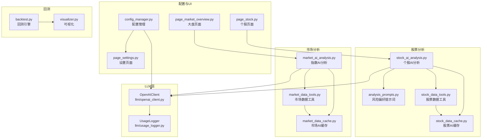
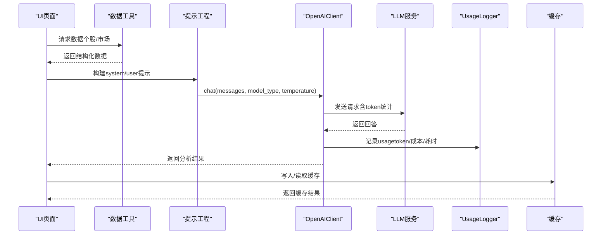
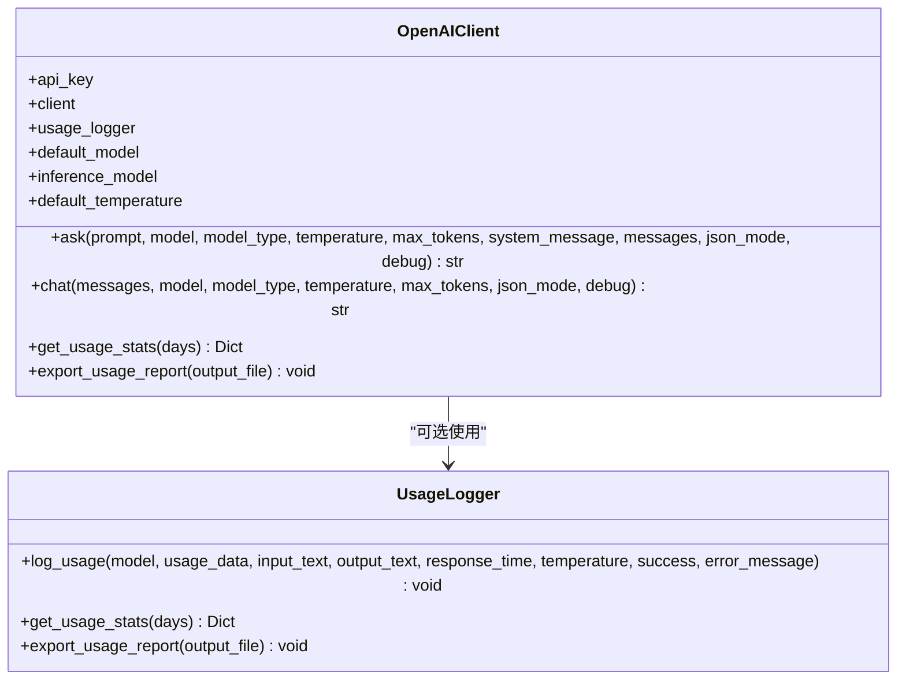
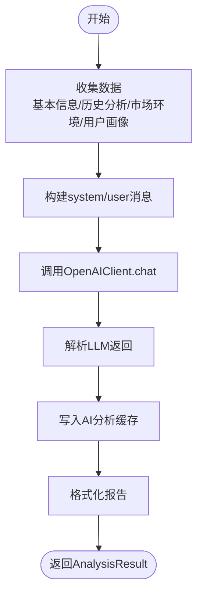
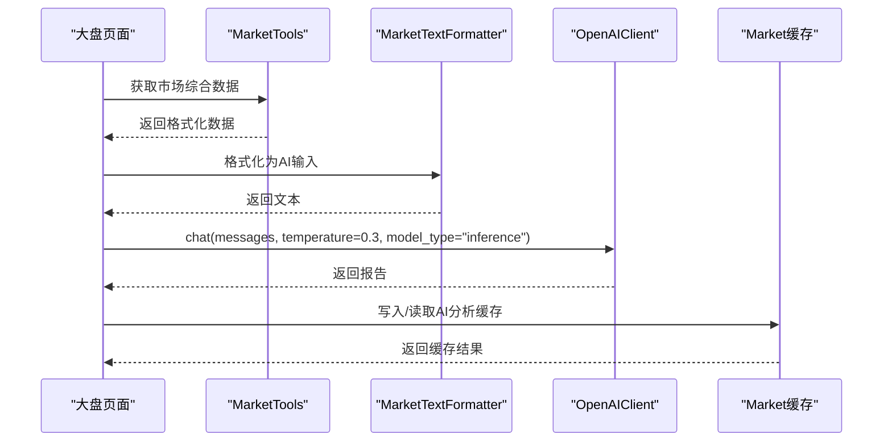
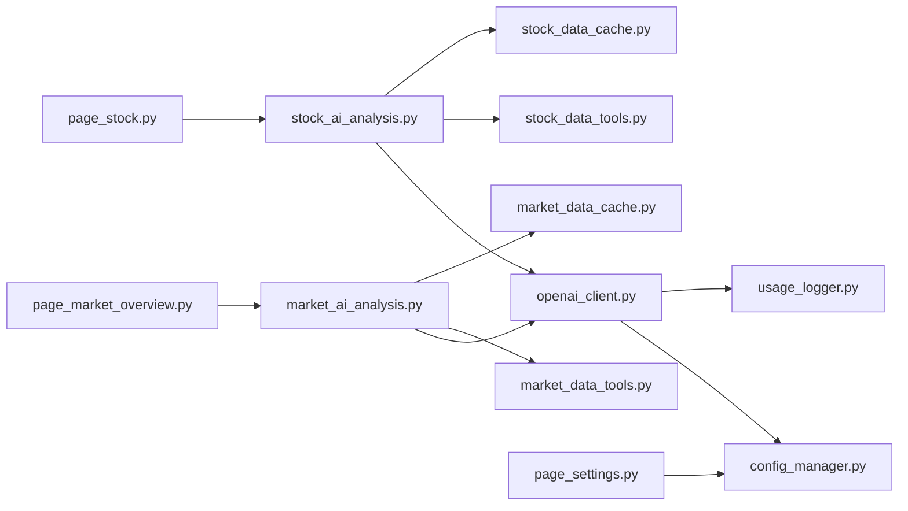

# AI智能分析

<cite>
**本文引用的文件**
- [llm/openai_client.py](file://llm/openai_client.py)
- [llm/usage_logger.py](file://llm/usage_logger.py)
- [llm/__init__.py](file://llm/__init__.py)
- [stock/stock_ai_analysis.py](file://stock/stock_ai_analysis.py)
- [stock/analysis_prompts.py](file://stock/analysis_prompts.py)
- [stock/stock_data_tools.py](file://stock/stock_data_tools.py)
- [stock/stock_data_cache.py](file://stock/stock_data_cache.py)
- [market/market_ai_analysis.py](file://market/market_ai_analysis.py)
- [market/market_data_tools.py](file://market/market_data_tools.py)
- [market/market_data_cache.py](file://market/market_data_cache.py)
- [config_manager.py](file://config_manager.py)
- [ui/components/page_settings.py](file://ui/components/page_settings.py)
- [ui/components/page_stock.py](file://ui/components/page_stock.py)
- [ui/components/page_market_overview.py](file://ui/components/page_market_overview.py)
- [backtesting/backtest.py](file://backtesting/backtest.py)
- [backtesting/visualizer.py](file://backtesting/visualizer.py)
</cite>

## 目录
1. [简介](#简介)
2. [项目结构](#项目结构)
3. [核心组件](#核心组件)
4. [架构总览](#架构总览)
5. [详细组件分析](#详细组件分析)
6. [依赖关系分析](#依赖关系分析)
7. [性能考量](#性能考量)
8. [故障排查指南](#故障排查指南)
9. [结论](#结论)
10. [附录](#附录)

## 简介
本节系统阐述xystock中AI智能分析模块的设计与实现，重点说明如何通过LLM客户端（OpenAIClient）对接多家大语言模型（如DeepSeek等兼容OpenAI接口的服务），将结构化的金融数据转化为自然语言提示（prompt），并解析模型返回结果，最终输出技术分析、基本面评估、新闻摘要与综合投资建议。文档还涵盖与数据获取、缓存、UI与回测模块的集成方式，以及提示工程、模型选择策略、成本控制与输出一致性保障的最佳实践。

## 项目结构
AI智能分析相关代码分布在以下子模块：
- LLM层：OpenAI客户端封装与使用记录
- 股票分析：面向个股的技术面、基本面、新闻、筹码与综合分析
- 市场分析：面向指数的AI分析
- 配置与缓存：统一配置管理与缓存策略
- UI与回测：前端界面与回测模块的集成

**图表来源**
- [llm/openai_client.py](file://llm/openai_client.py#L1-L120)
- [llm/usage_logger.py](file://llm/usage_logger.py#L1-L120)
- [stock/stock_ai_analysis.py](file://stock/stock_ai_analysis.py#L1-L120)
- [stock/analysis_prompts.py](file://stock/analysis_prompts.py#L1-L54)
- [stock/stock_data_tools.py](file://stock/stock_data_tools.py#L1-L120)
- [stock/stock_data_cache.py](file://stock/stock_data_cache.py#L146-L176)
- [market/market_ai_analysis.py](file://market/market_ai_analysis.py#L1-L120)
- [market/market_data_tools.py](file://market/market_data_tools.py#L1-L120)
- [market/market_data_cache.py](file://market/market_data_cache.py#L134-L155)
- [config_manager.py](file://config_manager.py#L1-L120)
- [ui/components/page_settings.py](file://ui/components/page_settings.py#L44-L139)
- [ui/components/page_stock.py](file://ui/components/page_stock.py#L452-L479)
- [ui/components/page_market_overview.py](file://ui/components/page_market_overview.py#L379-L410)
- [backtesting/backtest.py](file://backtesting/backtest.py#L1-L120)
- [backtesting/visualizer.py](file://backtesting/visualizer.py#L1-L120)

**章节来源**
- [llm/openai_client.py](file://llm/openai_client.py#L1-L120)
- [stock/stock_ai_analysis.py](file://stock/stock_ai_analysis.py#L1-L120)
- [market/market_ai_analysis.py](file://market/market_ai_analysis.py#L1-L120)
- [config_manager.py](file://config_manager.py#L1-L120)

## 核心组件
- OpenAIClient：LLM客户端封装，负责请求构造、模型选择、温度与token管理、错误重试、日志记录与使用统计导出。
- UsageLogger：使用记录器，负责将每次调用的输入输出、token用量、响应时间、成本估算等写入CSV并生成HTML报告。
- stock_ai_analysis：个股AI分析模块，提供技术分析、基本面分析、新闻分析、筹码分析与综合分析的提示词构建与调用流程。
- market_ai_analysis：指数AI分析模块，整合市场综合数据、技术指标与用户观点，输出简明的市场分析报告。
- 配置管理：通过ConfigManager集中管理LLM、日志、缓存与市场功能开关等配置。
- UI集成：页面组件负责触发分析、展示结果与保存设置。
- 回测集成：回测模块提供策略验证与可视化，AI分析结果可作为策略输入或辅助判断依据。

**章节来源**
- [llm/openai_client.py](file://llm/openai_client.py#L26-L120)
- [llm/usage_logger.py](file://llm/usage_logger.py#L1-L120)
- [stock/stock_ai_analysis.py](file://stock/stock_ai_analysis.py#L1-L120)
- [market/market_ai_analysis.py](file://market/market_ai_analysis.py#L1-L120)
- [config_manager.py](file://config_manager.py#L1-L120)

## 架构总览
AI智能分析采用“数据采集-提示工程-LLM推理-结果解析-缓存与UI展示”的闭环架构。数据采集由各工具模块完成，提示工程由分析模块构建，LLM推理由OpenAIClient执行，结果解析与格式化由分析模块完成，最后通过缓存与UI呈现给用户。

**图表来源**
- [stock/stock_ai_analysis.py](file://stock/stock_ai_analysis.py#L303-L346)
- [market/market_ai_analysis.py](file://market/market_ai_analysis.py#L96-L123)
- [llm/openai_client.py](file://llm/openai_client.py#L111-L175)
- [llm/usage_logger.py](file://llm/usage_logger.py#L45-L120)
- [stock/stock_data_cache.py](file://stock/stock_data_cache.py#L146-L176)
- [market/market_data_cache.py](file://market/market_data_cache.py#L134-L155)

## 详细组件分析

### OpenAIClient：LLM客户端实现
- 初始化与配置
  - 从配置读取API密钥、基础URL、超时、最大重试、默认模型与温度。
  - 可选启用UsageLogger并设置日志级别与日志文件路径。
- 请求构造
  - 支持传入messages或由system_message+prompt组合生成消息列表。
  - 支持model_type选择“default/inference”模型，或显式指定model。
  - 支持temperature、max_tokens、json_mode等参数。
- Token管理与成本估算
  - 从响应usage中提取prompt/completion/total tokens。
  - 估算成本（按OpenAI定价表，实际以服务端为准）。
- 错误重试与日志记录
  - 捕获异常并记录usage（包含错误信息）。
  - 提供get_usage_stats与export_usage_report便于统计与审计。
- 多轮对话
  - chat方法复用ask逻辑，适合多轮上下文。

**图表来源**
- [llm/openai_client.py](file://llm/openai_client.py#L26-L175)
- [llm/usage_logger.py](file://llm/usage_logger.py#L45-L120)

**章节来源**
- [llm/openai_client.py](file://llm/openai_client.py#L26-L175)
- [llm/usage_logger.py](file://llm/usage_logger.py#L1-L120)

### stock_ai_analysis：个股AI分析
- 统一结果结构
  - AnalysisResult封装success、report、timestamp、error_message、analysis_type、stock_code、data_sources等字段。
- 配置管理
  - AnalysisConfig按分析类型（technical/news/chip/fundamental/company/comprehensive）读取温度、模型类型与缓存文件名，默认配置覆盖用户配置失败场景。
- 数据采集
  - DataCollector负责收集股票基本信息、历史分析、市场环境（综合报告与AI分析）、用户画像与用户观点/持仓。
- 报告格式化
  - ReportFormatter将历史分析、市场环境与用户观点格式化为统一文本，支持截断。
- 基础生成器
  - BaseAnalysisGenerator封装OpenAIClient与AnalysisConfig，统一生成流程，保存请求缓存，捕获异常并返回AnalysisResult。
- 分析类型
  - generate_tech_analysis_report：技术分析，强调指标与趋势。
  - generate_fundamental_analysis_report：基本面分析，区分股票与ETF，ETF包含持仓结构。
  - generate_news_analysis_report：新闻分析，评估时效性与影响。
  - generate_chip_analysis_report：筹码分析，解读分布与主力意图。
  - generate_company_analysis_report：公司/ETF分析，按产品类型切换提示词。
  - generate_comprehensive_analysis_report：综合分析，整合历史、市场、用户画像与核心原则，输出明确操作建议。
- 提示工程
  - analysis_prompts提供风险偏好（中性/保守/激进）的核心原则，支持自定义。
- 缓存与回写
  - 通过stock_data_cache写入/读取AI分析缓存，支持动态过期时间。

**图表来源**
- [stock/stock_ai_analysis.py](file://stock/stock_ai_analysis.py#L303-L346)
- [stock/stock_ai_analysis.py](file://stock/stock_ai_analysis.py#L352-L402)
- [stock/stock_ai_analysis.py](file://stock/stock_ai_analysis.py#L404-L496)
- [stock/stock_ai_analysis.py](file://stock/stock_ai_analysis.py#L498-L550)
- [stock/stock_ai_analysis.py](file://stock/stock_ai_analysis.py#L552-L603)
- [stock/stock_ai_analysis.py](file://stock/stock_ai_analysis.py#L605-L715)
- [stock/stock_ai_analysis.py](file://stock/stock_ai_analysis.py#L717-L809)
- [stock/analysis_prompts.py](file://stock/analysis_prompts.py#L1-L54)
- [stock/stock_data_cache.py](file://stock/stock_data_cache.py#L146-L176)

**章节来源**
- [stock/stock_ai_analysis.py](file://stock/stock_ai_analysis.py#L1-L120)
- [stock/stock_ai_analysis.py](file://stock/stock_ai_analysis.py#L303-L346)
- [stock/stock_ai_analysis.py](file://stock/stock_ai_analysis.py#L352-L809)
- [stock/analysis_prompts.py](file://stock/analysis_prompts.py#L1-L54)
- [stock/stock_data_cache.py](file://stock/stock_data_cache.py#L146-L176)

### market_ai_analysis：指数AI分析
- 数据准备
  - 使用MarketTextFormatter将市场综合数据格式化为AI可读文本。
- 提示词构建
  - 根据配置决定是否包含市场新闻，动态调整分析结构与输出要点。
  - 降低temperature以提升输出一致性。
- 调用与缓存
  - 通过OpenAIClient.chat发送消息，写入请求缓存文件，返回报告与时间戳。
  - 可与市场缓存配合，实现指数级AI分析的缓存与复用。

**图表来源**
- [market/market_ai_analysis.py](file://market/market_ai_analysis.py#L1-L123)
- [market/market_data_tools.py](file://market/market_data_tools.py#L1-L120)
- [market/market_data_cache.py](file://market/market_data_cache.py#L134-L155)

**章节来源**
- [market/market_ai_analysis.py](file://market/market_ai_analysis.py#L1-L123)
- [market/market_data_tools.py](file://market/market_data_tools.py#L1-L120)
- [market/market_data_cache.py](file://market/market_data_cache.py#L134-L155)

### 配置与UI集成
- 配置管理
  - LLM_OPENAI：API_KEY、BASE_URL、TIMEOUT、MAX_RETRIES、DEFAULT_MODEL、INFERENCE_MODEL、DEFAULT_TEMPERATURE。
  - LLM_LOGGING：USAGE_LOG_FILE、ENABLE_LOGGING、LOG_LEVEL。
  - LLM_CACHE：ENABLE_CACHE、CACHE_TTL。
  - MARKET：ENABLE_NEWS。
- UI设置页
  - 提供模型、超时、重试、温度、缓存开关与TTL的可视化配置，并支持测试连接。
- UI页面
  - 个股页面：展示AI基本面分析报告与生成时间。
  - 大盘页面：展示AI指数分析报告与用户观点标注。

**章节来源**
- [config_manager.py](file://config_manager.py#L1-L120)
- [ui/components/page_settings.py](file://ui/components/page_settings.py#L44-L139)
- [ui/components/page_stock.py](file://ui/components/page_stock.py#L452-L479)
- [ui/components/page_market_overview.py](file://ui/components/page_market_overview.py#L379-L410)

### 与回测模块的集成
- 回测模块提供策略回测与可视化，AI分析结果可作为策略输入或辅助判断依据。
- 可在UI中结合回测结果与AI建议进行策略验证与优化。

**章节来源**
- [backtesting/backtest.py](file://backtesting/backtest.py#L1-L120)
- [backtesting/visualizer.py](file://backtesting/visualizer.py#L1-L120)

## 依赖关系分析
- 组件耦合
  - stock_ai_analysis依赖OpenAIClient、analysis_prompts、stock_data_tools与缓存模块。
  - market_ai_analysis依赖OpenAIClient、market_data_tools与缓存模块。
  - OpenAIClient依赖config_manager与usage_logger。
  - UI组件依赖配置与分析模块，形成“页面-分析-数据-缓存”的链路。
- 外部依赖
  - OpenAI SDK（通过兼容接口支持DeepSeek等服务）。
  - pandas（usage_logger导出HTML报告）。
  - toml（配置文件）。
- 循环依赖
  - 通过模块导入顺序与工具类封装避免循环依赖。

**图表来源**
- [stock/stock_ai_analysis.py](file://stock/stock_ai_analysis.py#L1-L120)
- [market/market_ai_analysis.py](file://market/market_ai_analysis.py#L1-L120)
- [llm/openai_client.py](file://llm/openai_client.py#L1-L120)
- [config_manager.py](file://config_manager.py#L1-L120)
- [ui/components/page_settings.py](file://ui/components/page_settings.py#L44-L139)
- [ui/components/page_stock.py](file://ui/components/page_stock.py#L452-L479)
- [ui/components/page_market_overview.py](file://ui/components/page_market_overview.py#L379-L410)

**章节来源**
- [stock/stock_ai_analysis.py](file://stock/stock_ai_analysis.py#L1-L120)
- [market/market_ai_analysis.py](file://market/market_ai_analysis.py#L1-L120)
- [llm/openai_client.py](file://llm/openai_client.py#L1-L120)
- [config_manager.py](file://config_manager.py#L1-L120)

## 性能考量
- Token与成本控制
  - 使用UsageLogger记录prompt_tokens/completion_tokens/total_tokens与成本估算，定期导出报告进行成本审计。
  - 通过缩短输入文本、限制max_tokens、降低temperature等方式减少token消耗。
- 响应时间与吞吐
  - 合理设置TIMEOUT与MAX_RETRIES，避免长时间阻塞。
  - 将高频分析结果缓存至本地，减少重复调用。
- 输出一致性
  - 对需要一致性的场景（如市场分析）降低temperature，必要时启用json_mode并约束系统消息。
- 数据缓存策略
  - 股票与市场缓存分别设置不同过期时间，兼顾新鲜度与性能。

[本节为通用指导，无需特定文件来源]

## 故障排查指南
- API密钥未设置
  - 现象：初始化OpenAIClient时报错。
  - 处理：在配置中设置LLM_OPENAI.API_KEY或通过参数传入。
- 连接超时或重试失败
  - 现象：ask/chat抛出异常。
  - 处理：检查TIMEOUT、MAX_RETRIES与网络连通性；查看UsageLogger记录的error_message。
- JSON模式返回非JSON
  - 现象：启用json_mode但模型未按要求返回。
  - 处理：确保系统消息包含JSON约束；必要时增加调试输出。
- 缓存失效或未命中
  - 现象：分析结果频繁更新或未缓存。
  - 处理：检查缓存键命名与过期时间；确认use_cache参数。
- UI设置未生效
  - 现象：修改设置后未立即生效。
  - 处理：确认配置保存成功；必要时重启应用或重新加载配置。

**章节来源**
- [llm/openai_client.py](file://llm/openai_client.py#L37-L69)
- [llm/usage_logger.py](file://llm/usage_logger.py#L45-L120)
- [config_manager.py](file://config_manager.py#L1-L120)
- [ui/components/page_settings.py](file://ui/components/page_settings.py#L103-L139)

## 结论
xystock的AI智能分析模块通过OpenAIClient实现对多家LLM服务的统一接入，结合stock_ai_analysis与market_ai_analysis完成从结构化数据到自然语言报告的转换。模块内置配置管理、使用记录与缓存策略，支持UI集成与回测联动，具备良好的扩展性与可维护性。建议在生产环境中持续监控token与成本、优化提示词与模型选择，并通过缓存与一致性策略提升用户体验与稳定性。

[本节为总结，无需特定文件来源]

## 附录

### 实际调用示例（步骤说明）
- 技术分析
  - 步骤：获取股票基本信息与K线数据 → 构建技术分析提示 → 调用OpenAIClient.chat → 格式化输出 → 写入缓存。
  - 参考路径：[stock/stock_ai_analysis.py](file://stock/stock_ai_analysis.py#L352-L402)
- 基本面评估
  - 步骤：获取基本面数据（含ETF持仓） → 构建基本面提示 → 调用OpenAIClient.chat → 格式化输出 → 写入缓存。
  - 参考路径：[stock/stock_ai_analysis.py](file://stock/stock_ai_analysis.py#L605-L715)
- 新闻摘要
  - 步骤：获取新闻数据 → 构建新闻分析提示 → 调用OpenAIClient.chat → 格式化输出。
  - 参考路径：[stock/stock_ai_analysis.py](file://stock/stock_ai_analysis.py#L498-L550)
- 综合投资建议
  - 步骤：收集历史分析、市场环境、用户画像 → 构建综合分析提示（含核心原则） → 调用OpenAIClient.chat → 格式化输出。
  - 参考路径：[stock/stock_ai_analysis.py](file://stock/stock_ai_analysis.py#L717-L809)
- 大盘AI分析
  - 步骤：获取市场综合数据 → 格式化 → 构建提示（含新闻开关） → 调用OpenAIClient.chat → 写入缓存。
  - 参考路径：[market/market_ai_analysis.py](file://market/market_ai_analysis.py#L1-L123)

### 提示工程最佳实践
- 明确角色与任务：system消息清晰界定分析师角色与分析范围。
- 结构化输出：固定标题层级与段落格式，便于解析与展示。
- 数据裁剪：对长文本进行截断，保留关键字段，避免token浪费。
- 一致性控制：对需要稳定输出的场景降低temperature，必要时启用json模式。

### 模型选择策略
- 分析模型（default）：用于复杂、长文本的深度分析。
- 推理模型（inference）：用于快速、稳定的推理与简明输出。
- 服务适配：通过BASE_URL适配不同供应商（如DeepSeek），保持接口一致性。

### 成本控制与Token统计
- 使用UsageLogger记录每次调用的token与成本估算，定期导出HTML报告进行审计。
- 通过缩短输入、限制max_tokens、降低temperature与启用缓存降低总体成本。

### 输出一致性保障
- 降低temperature，减少随机性。
- 在system消息中明确输出格式与约束。
- 对关键流程启用json_mode并校验返回格式。

[本节为通用指导，无需特定文件来源]