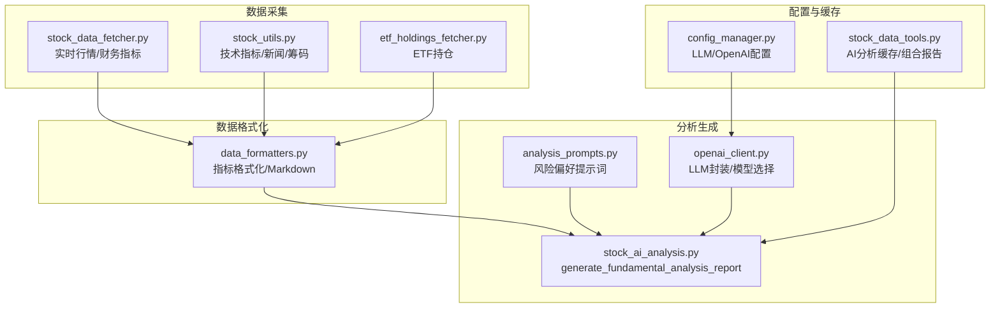
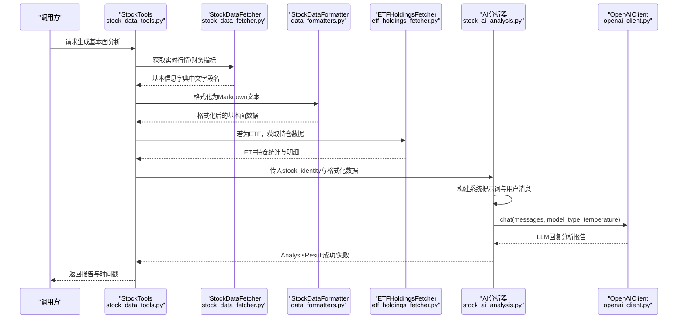
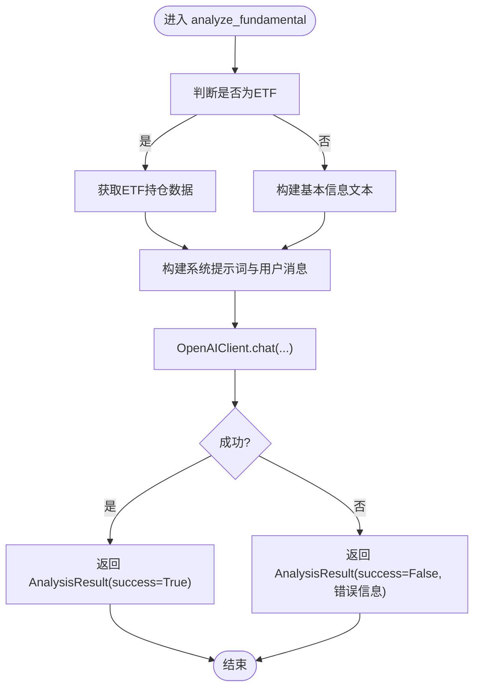
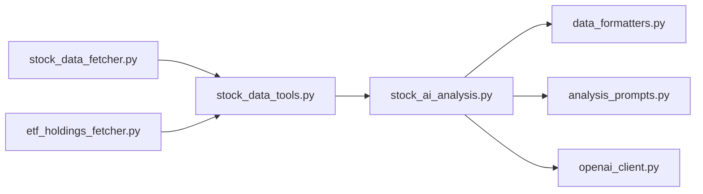

# 基本面分析

<cite>
**本文引用的文件**
- [stock_ai_analysis.py](file://stock/stock_ai_analysis.py)
- [analysis_prompts.py](file://stock/analysis_prompts.py)
- [stock_data_fetcher.py](file://stock/stock_data_fetcher.py)
- [stock_data_tools.py](file://stock/stock_data_tools.py)
- [stock_utils.py](file://stock/stock_utils.py)
- [data_formatters.py](file://utils/data_formatters.py)
- [etf_holdings_fetcher.py](file://stock/etf_holdings_fetcher.py)
- [openai_client.py](file://llm/openai_client.py)
- [config_manager.py](file://config_manager.py)
</cite>

## 目录
1. [简介](#简介)
2. [项目结构](#项目结构)
3. [核心组件](#核心组件)
4. [架构总览](#架构总览)
5. [详细组件分析](#详细组件分析)
6. [依赖关系分析](#依赖关系分析)
7. [性能考量](#性能考量)
8. [故障排查指南](#故障排查指南)
9. [结论](#结论)
10. [附录](#附录)

## 简介
本文件系统性阐述 xystock 中“AI基本面分析”的工作流程与实现细节，围绕如何从财务报表与市场数据中抽取关键指标（如 PE、PB、ROE、毛利率、营收增长率等），结合行业对比与市场环境生成分析输入，并通过提示词模板驱动大模型完成对企业盈利能力、成长性、偿债能力与运营效率的综合评估。文档还涵盖数据标准化、异常值处理、趋势预测、提示词工程、MD&A 文本语义增强、模型幻觉缓解策略以及配置建议（LLM 模型选择与温度参数调优）。

## 项目结构
围绕基本面分析的关键模块如下：
- 数据采集层：从 efinance 获取实时行情与财务指标，从 akshare 获取 ETF 持仓与新闻数据
- 数据格式化层：将原始指标按中文字段名标准化，统一数值格式与单位
- 分析生成层：构建系统提示词与用户输入，调用 LLM 客户端生成报告
- 配置与缓存层：统一管理 LLM 参数、分析配置与缓存策略

图表来源
- [stock_data_fetcher.py](file://stock/stock_data_fetcher.py#L255-L372)
- [stock_utils.py](file://stock/stock_utils.py#L188-L240)
- [etf_holdings_fetcher.py](file://stock/etf_holdings_fetcher.py#L17-L118)
- [data_formatters.py](file://utils/data_formatters.py#L198-L361)
- [stock_ai_analysis.py](file://stock/stock_ai_analysis.py#L605-L714)
- [analysis_prompts.py](file://stock/analysis_prompts.py#L39-L54)
- [openai_client.py](file://llm/openai_client.py#L26-L71)
- [config_manager.py](file://config_manager.py#L41-L63)
- [stock_data_tools.py](file://stock/stock_data_tools.py#L317-L355)

章节来源
- [stock_ai_analysis.py](file://stock/stock_ai_analysis.py#L605-L714)
- [stock_data_fetcher.py](file://stock/stock_data_fetcher.py#L255-L372)
- [data_formatters.py](file://utils/data_formatters.py#L198-L361)
- [openai_client.py](file://llm/openai_client.py#L26-L71)
- [config_manager.py](file://config_manager.py#L41-L63)
- [stock_data_tools.py](file://stock/stock_data_tools.py#L317-L355)

## 核心组件
- 基本面分析入口：generate_fundamental_analysis_report
- 数据采集与标准化：StockDataFetcher、StockDataFormatter
- ETF 持仓增强：ETFHoldingsFetcher
- 提示词与风险偏好：analysis_prompts.get_core_principles
- LLM 客户端：OpenAIClient（模型类型、温度、超时、重试）
- 配置管理：ConfigManager（LLM 参数、缓存、日志）

章节来源
- [stock_ai_analysis.py](file://stock/stock_ai_analysis.py#L605-L714)
- [stock_data_fetcher.py](file://stock/stock_data_fetcher.py#L255-L372)
- [data_formatters.py](file://utils/data_formatters.py#L198-L361)
- [etf_holdings_fetcher.py](file://stock/etf_holdings_fetcher.py#L17-L118)
- [analysis_prompts.py](file://stock/analysis_prompts.py#L39-L54)
- [openai_client.py](file://llm/openai_client.py#L26-L71)
- [config_manager.py](file://config_manager.py#L41-L63)

## 架构总览
下面的序列图展示了从数据采集到生成基本面分析报告的端到端流程，包括 ETF 持仓增强与提示词注入。

图表来源
- [stock_data_tools.py](file://stock/stock_data_tools.py#L317-L355)
- [stock_data_fetcher.py](file://stock/stock_data_fetcher.py#L255-L372)
- [data_formatters.py](file://utils/data_formatters.py#L198-L361)
- [etf_holdings_fetcher.py](file://stock/etf_holdings_fetcher.py#L17-L118)
- [stock_ai_analysis.py](file://stock/stock_ai_analysis.py#L605-L714)
- [openai_client.py](file://llm/openai_client.py#L198-L230)

## 详细组件分析

### 1) analyze_fundamental 方法实现逻辑
- 输入：stock_identity（股票标识）、fundamental_data（可选，若为空则自动抓取）
- 输出：AnalysisResult（包含报告正文、时间戳、是否成功）
- 关键步骤：
  - 识别是否为 ETF（根据市场名称或代码/名称关键字）
  - 若为 ETF：额外拉取持仓明细与集中度统计，用于“持仓结构分析”
  - 构建系统提示词（面向股票/ETF两类模板），强调“基于真实数据、客观语言、不含投资建议”
  - 构建用户消息：包含股票/ETF信息、货币、基本面数据（中文字段名）
  - 调用 BaseAnalysisGenerator.generate_analysis，内部委托 OpenAIClient.chat
  - 返回 AnalysisResult

图表来源
- [stock_ai_analysis.py](file://stock/stock_ai_analysis.py#L605-L714)
- [openai_client.py](file://llm/openai_client.py#L198-L230)

章节来源
- [stock_ai_analysis.py](file://stock/stock_ai_analysis.py#L605-L714)

### 2) 数据标准化与指标抽取
- 财务指标来源：StockDataFetcher.get_more_stock_info 与 _convert_to_stock_info
  - 关键指标集合：ROE、ROA、毛利率、销售净利率、营业利润率、资产负债率、流动比率、速动比率、现金比率、权益乘数、总资产周转率、应收账款周转率、存货周转率、流动资产周转率、营业总收入增长率、归属母公司净利润增长率、市盈率、市净率、基本每股收益、每股净资产、每股经营现金流、每股营业收入
  - 字段名：统一使用中文字段名，便于格式化器直接消费
- 数值清洗与格式化：
  - 安全转换：处理“-”、“--”、None、NaN、百分号等
  - 格式化：统一保留两位小数，百分比字段末尾加“%”，金额/市值使用千分位格式
- ETF 持仓增强：
  - 获取最新季度持仓，统计前5/10/20大持仓占比，集中度水平
  - 用于“持仓结构分析”与“市场表现与风险”两部分

章节来源
- [stock_data_fetcher.py](file://stock/stock_data_fetcher.py#L255-L372)
- [data_formatters.py](file://utils/data_formatters.py#L198-L361)
- [etf_holdings_fetcher.py](file://stock/etf_holdings_fetcher.py#L17-L118)

### 3) 异常值处理与稳健性
- 数值清洗：
  - 对比率类指标保留字符串并统一格式；对绝对数值转换为浮点数并过滤 NaN
  - 百分号字段去除“%”后转换为数值
- 缓存与降级：
  - 若数据源不可用或拉取失败，优先返回缓存数据（若有）
  - 对 ETF 持仓获取失败，记录警告并跳过该部分，不影响主报告
- 报告健壮性：
  - 系统提示词明确禁止编造数据与主观臆测
  - 用户画像与历史分析摘要作为上下文增强，但不会误导模型

章节来源
- [stock_data_fetcher.py](file://stock/stock_data_fetcher.py#L458-L538)
- [stock_data_tools.py](file://stock/stock_data_tools.py#L317-L355)

### 4) 趋势预测与多周期分析
- 技术指标与风险指标：
  - 通过 StockDataFetcher.get_kline_data 与 stock_utils.get_indicators 计算 MA、EMA、MACD、KDJ、RSI、布林带、威廉指标、CCI 等
  - 通过 risk_metrics.calculate_portfolio_risk_summary 计算波动率、最大回撤、夏普比率、VaR/CVaR 等
- 多周期视角：
  - 将技术指标与风险指标拼接到基本面数据中，形成“多维度分析输入”
  - 在提示词中强调“基于真实数据、不编造”，避免过度外推

章节来源
- [stock_utils.py](file://stock/stock_utils.py#L188-L240)
- [stock_data_fetcher.py](file://stock/stock_data_fetcher.py#L135-L224)

### 5) 提示词模板与风险偏好
- 风险偏好提示词：
  - neutral（中性）：诚实、客观、明确操作建议
  - conservative（保守）：本金安全优先、严格风控、谨慎操作
  - aggressive（激进）：把握成长机会、适度承担风险、灵活操作
- 核心原则注入：
  - generate_comprehensive_analysis_report 会将风险偏好提示词注入系统消息，贯穿综合分析
- 基本面分析提示词：
  - 针对股票/ETF两类模板，分别强调财务健康评估、估值分析、增长潜力评估、风险评估等

章节来源
- [analysis_prompts.py](file://stock/analysis_prompts.py#L39-L54)
- [stock_ai_analysis.py](file://stock/stock_ai_analysis.py#L605-L714)

### 6) MD&A 文本语义增强
- 现状：当前基本面分析未直接接入 MD&A 文本处理模块
- 建议方案：
  - 从新闻/研报接口抓取公司公告、研报与管理层讨论与分析（MD&A）文本
  - 使用 data_formatters.format_stock_news_data 或自定义格式化函数，提取关键段落（如“未来展望”、“经营计划”、“风险因素”）
  - 在用户消息中追加“管理层讨论与分析摘要”，并要求模型在“优势与风险分析”中结合该摘要进行语义增强
  - 增加“事实核查”环节：对模型输出中的关键陈述（如“预期收入增长X%”）与公告原文进行一致性比对，标注置信度

章节来源
- [stock_utils.py](file://stock/stock_utils.py#L242-L266)
- [data_formatters.py](file://utils/data_formatters.py#L387-L410)

### 7) 模型幻觉缓解策略
- 事实核查机制：
  - 对模型输出中的关键财务陈述（如 PE/PB 水平、ROE/ROA 趋势、营收/利润增长率）与格式化后的基本面数据进行逐项核对
  - 对不一致项标注“核查未通过”，并在“风险提示”中明确指出
- 置信度评分：
  - 基于“陈述与数据一致性”“数据来源可追溯性”“模型输出稳定性”三维度打分（例如 0-100）
  - 在报告末尾附“置信度说明”与“数据来源清单”
- 交互约束：
  - 系统提示词明确“基于真实数据、不得编造”，并限制输出长度与格式

章节来源
- [stock_ai_analysis.py](file://stock/stock_ai_analysis.py#L605-L714)
- [data_formatters.py](file://utils/data_formatters.py#L198-L361)

### 8) 配置建议（LLM 模型与温度）
- 模型类型选择：
  - 分析型模型：用于生成综合性、结构性更强的报告（默认模型）
  - 推理型模型：用于快速问答与校验（inference 模型）
- 温度参数调优：
  - 基本面分析：0.6（兼顾创造性与稳定性）
  - 新闻/筹码分析：0.7（允许适度发散，捕捉隐含信号）
  - 综合分析：0.4（强调明确性与可执行性）
- 其他参数：
  - 超时与重试：根据网络状况设置合理 TIMEOUT 与 MAX_RETRIES
  - 日志与用量：开启 UsageLogger，定期导出使用报告

章节来源
- [openai_client.py](file://llm/openai_client.py#L26-L71)
- [config_manager.py](file://config_manager.py#L41-L63)

## 依赖关系分析
- 组件耦合：
  - stock_ai_analysis.py 依赖 data_formatters.py（格式化）、analysis_prompts.py（提示词）、openai_client.py（LLM）
  - stock_data_tools.py 作为门面，协调数据采集与缓存，并调用 stock_ai_analysis.py 的分析方法
  - stock_data_fetcher.py 与 etf_holdings_fetcher.py 提供底层数据源
- 外部依赖：
  - efinance、akshare、OpenAI SDK
- 潜在循环依赖：
  - 当前模块间为单向依赖，未发现循环导入

图表来源
- [stock_ai_analysis.py](file://stock/stock_ai_analysis.py#L605-L714)
- [data_formatters.py](file://utils/data_formatters.py#L198-L361)
- [analysis_prompts.py](file://stock/analysis_prompts.py#L39-L54)
- [openai_client.py](file://llm/openai_client.py#L26-L71)
- [stock_data_tools.py](file://stock/stock_data_tools.py#L317-L355)
- [stock_data_fetcher.py](file://stock/stock_data_fetcher.py#L255-L372)
- [etf_holdings_fetcher.py](file://stock/etf_holdings_fetcher.py#L17-L118)

章节来源
- [stock_ai_analysis.py](file://stock/stock_ai_analysis.py#L605-L714)
- [stock_data_tools.py](file://stock/stock_data_tools.py#L317-L355)

## 性能考量
- 数据拉取与缓存：
  - K线与技术指标采用缓存策略，减少重复拉取
  - AI分析报告按分析类型与股票代码缓存，支持动态过期
- 模型调用：
  - 控制消息长度与提示词复杂度，避免 token 超限
  - 合理设置温度与 max_tokens，平衡质量与速度
- I/O 优化：
  - 批量获取 ETF 持仓时使用批量接口，减少网络往返

[本节为通用指导，无需特定文件引用]

## 故障排查指南
- 常见问题与处理：
  - efinance 初始化失败：检查网络与依赖安装，确认 API Key 配置
  - akshare 数据为空：检查目标股票是否存在、接口是否可用
  - LLM 调用失败：查看 UsageLogger 日志，确认超时/重试设置
  - 缓存失效：清理缓存或调整过期时间
- 定位手段：
  - 开启调试日志，查看请求/响应与 token 使用
  - 在 UI 层打印错误信息，便于前端反馈

章节来源
- [stock_data_fetcher.py](file://stock/stock_data_fetcher.py#L81-L134)
- [openai_client.py](file://llm/openai_client.py#L177-L197)
- [stock_data_tools.py](file://stock/stock_data_tools.py#L317-L355)

## 结论
xystock 的 AI 基本面分析以“真实数据+结构化提示词+稳健缓存”为核心，实现了从财务报表与市场数据中抽取关键指标、进行多维标准化与格式化，并通过提示词工程驱动大模型完成对企业盈利能力、成长性、偿债能力与运营效率的综合评估。通过 ETF 持仓增强、MD&A 文本语义增强与事实核查机制，可进一步提升分析的准确性与可信度。配合合理的 LLM 配置与温度调优，可在保证质量的同时兼顾效率。

[本节为总结性内容，无需特定文件引用]

## 附录

### A. 关键指标与字段映射（中文字段名）
- 盈利能力：ROE、ROA、毛利率、销售净利率、营业利润率
- 偿债能力：资产负债率、流动比率、速动比率、现金比率、权益乘数
- 营运能力：总资产周转率、应收账款周转率、存货周转率、流动资产周转率
- 成长能力：营业总收入增长率、归属母公司净利润增长率
- 估值指标：市盈率、市净率
- 每股指标：基本每股收益、每股净资产、每股经营现金流、每股营业收入
- 股息分红：最新分红公告日期、最新分红类型、最新派息比例、最新送股比例、最新转增比例、近年平均派息比例、近年分红次数、近年分红详情

章节来源
- [stock_data_fetcher.py](file://stock/stock_data_fetcher.py#L255-L372)
- [data_formatters.py](file://utils/data_formatters.py#L198-L361)

### B. ETF 持仓增强要点
- 获取最新季度持仓，统计前5/10/20大持仓占比
- 集中度分析：低/中/高集中度判断
- 用于“持仓结构分析”与“市场表现与风险”两部分

章节来源
- [etf_holdings_fetcher.py](file://stock/etf_holdings_fetcher.py#L17-L118)
- [stock_ai_analysis.py](file://stock/stock_ai_analysis.py#L605-L714)

### C. 提示词模板要点
- 风险偏好：中性/保守/激进三档，支持自定义核心原则
- 基本面分析：财务健康评估、估值分析、增长潜力评估、风险评估
- 综合分析：整合技术面/消息面/筹码面，给出涨跌预测与操作建议

章节来源
- [analysis_prompts.py](file://stock/analysis_prompts.py#L39-L54)
- [stock_ai_analysis.py](file://stock/stock_ai_analysis.py#L605-L714)