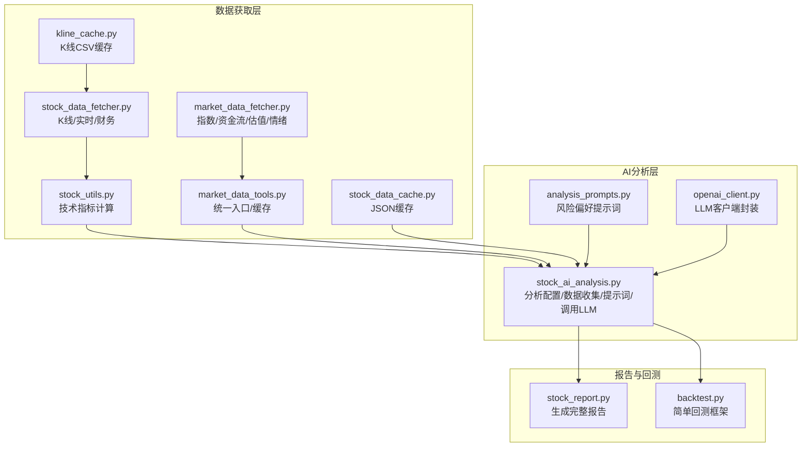
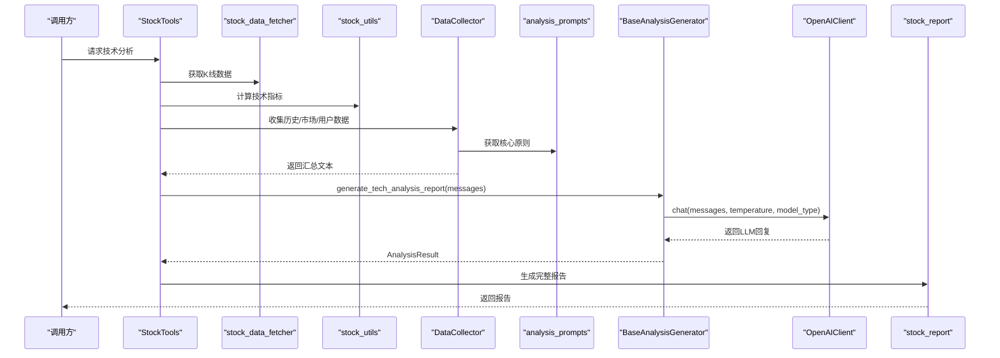
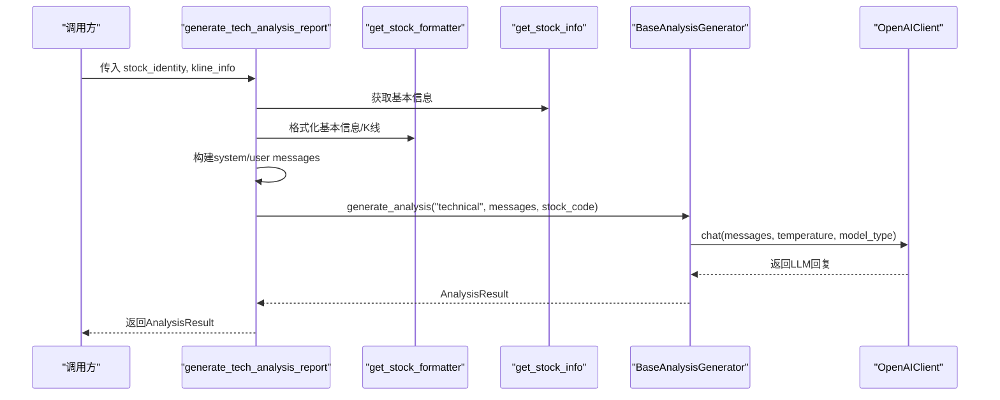
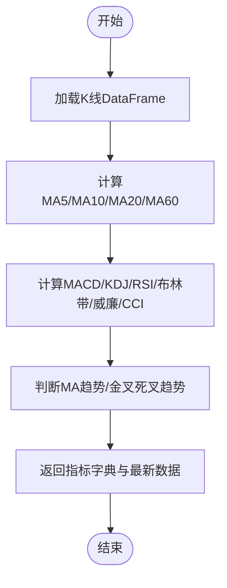
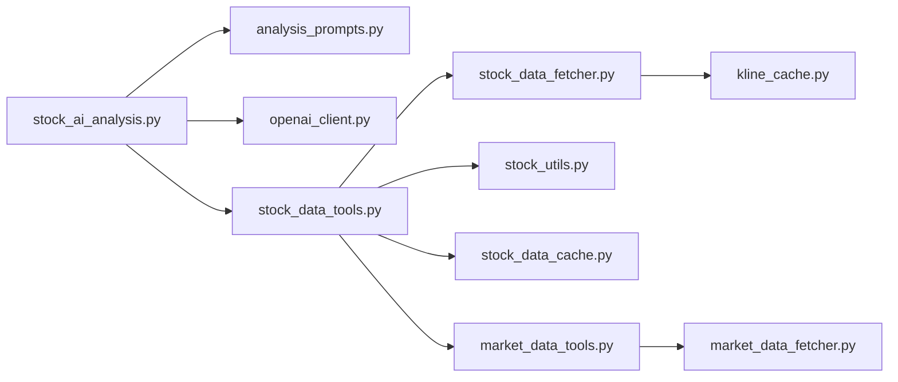

# 技术分析

<cite>
**本文引用的文件**
- [stock_ai_analysis.py](file://stock/stock_ai_analysis.py)
- [analysis_prompts.py](file://stock/analysis_prompts.py)
- [openai_client.py](file://llm/openai_client.py)
- [stock_data_fetcher.py](file://stock/stock_data_fetcher.py)
- [stock_data_tools.py](file://stock/stock_data_tools.py)
- [stock_utils.py](file://stock/stock_utils.py)
- [kline_cache.py](file://utils/kline_cache.py)
- [stock_data_cache.py](file://stock/stock_data_cache.py)
- [market_data_fetcher.py](file://market/market_data_fetcher.py)
- [market_data_tools.py](file://market/market_data_tools.py)
- [backtest.py](file://backtesting/backtest.py)
- [stock_report.py](file://stock/stock_report.py)
</cite>

## 目录
1. [引言](#引言)
2. [项目结构](#项目结构)
3. [核心组件](#核心组件)
4. [架构总览](#架构总览)
5. [详细组件分析](#详细组件分析)
6. [依赖关系分析](#依赖关系分析)
7. [性能考量](#性能考量)
8. [故障排查指南](#故障排查指南)
9. [结论](#结论)
10. [附录](#附录)

## 引言
本节面向希望理解 xystock 中“AI技术分析”实现机制的读者，系统阐述从数据采集（K线、成交量、技术指标）到提示词构建（analysis_prompts），再到调用 OpenAIClient 进行趋势判断、形态识别与买卖信号生成的全流程。文档还涵盖多时间周期分析（日线、周线）、关键支撑阻力位识别、技术指标交叉验证、历史回测数据融合、温度参数对输出稳定性的影响、JSON 模式与结构化输出保障、调试技巧与性能优化（缓存中间结果、控制上下文长度）等主题。

## 项目结构
围绕“AI技术分析”的关键模块与职责如下：
- 数据获取层
  - 股票：stock_data_fetcher（K线、实时行情、财务指标）、stock_utils（技术指标计算）、stock_data_cache（通用缓存）
  - 市场：market_data_fetcher（指数、资金流、估值、情绪）、market_data_tools（统一入口与缓存）
  - 缓存：kline_cache（K线CSV缓存）、stock_data_cache（JSON缓存）
- AI分析层
  - stock_ai_analysis（分析配置、数据收集、提示词拼装、调用OpenAIClient、生成报告）
  - analysis_prompts（风险偏好核心原则提示词）
  - openai_client（LLM客户端封装，支持温度、模型类型、JSON模式、用量统计）
- 报告与回测
  - stock_report（生成完整报告）
  - backtest（简单回测框架）

图表来源
- [stock_ai_analysis.py](file://stock/stock_ai_analysis.py#L1-L200)
- [analysis_prompts.py](file://stock/analysis_prompts.py#L1-L54)
- [openai_client.py](file://llm/openai_client.py#L1-L120)
- [stock_data_fetcher.py](file://stock/stock_data_fetcher.py#L1-L120)
- [stock_utils.py](file://stock/stock_utils.py#L100-L240)
- [kline_cache.py](file://utils/kline_cache.py#L1-L120)
- [stock_data_cache.py](file://stock/stock_data_cache.py#L1-L120)
- [market_data_fetcher.py](file://market/market_data_fetcher.py#L1-L120)
- [market_data_tools.py](file://market/market_data_tools.py#L1-L120)
- [stock_report.py](file://stock/stock_report.py#L1-L120)
- [backtest.py](file://backtesting/backtest.py#L1-L120)

章节来源
- [stock_ai_analysis.py](file://stock/stock_ai_analysis.py#L1-L200)
- [stock_data_fetcher.py](file://stock/stock_data_fetcher.py#L1-L120)
- [stock_utils.py](file://stock/stock_utils.py#L100-L240)
- [market_data_fetcher.py](file://market/market_data_fetcher.py#L1-L120)
- [market_data_tools.py](file://market/market_data_tools.py#L1-L120)
- [kline_cache.py](file://utils/kline_cache.py#L1-L120)
- [stock_data_cache.py](file://stock/stock_data_cache.py#L1-L120)
- [analysis_prompts.py](file://stock/analysis_prompts.py#L1-L54)
- [openai_client.py](file://llm/openai_client.py#L1-L120)
- [stock_report.py](file://stock/stock_report.py#L1-L120)
- [backtest.py](file://backtesting/backtest.py#L1-L120)

## 核心组件
- 分析配置与温度控制：AnalysisConfig 从配置读取温度、模型类型、缓存文件名，用于控制输出稳定性与模型选择。
- 数据收集器 DataCollector：统一收集股票基本信息、历史分析、市场数据、用户画像等，形成结构化输入。
- 提示词构建：analysis_prompts 提供风险偏好核心原则，stock_ai_analysis 在综合分析中注入。
- LLM 调用：BaseAnalysisGenerator 封装 OpenAIClient.chat，按分析类型传入 messages、temperature、model_type、json_mode 等。
- 技术指标计算：stock_utils.get_indicators 使用 stockstats 计算 MA、EMA、MACD、KDJ、RSI、布林带、威廉指标、CCI 等，并给出趋势判断。
- K线与缓存：stock_data_fetcher.get_kline_data 与 utils.kline_cache 协作，支持日线/周线等多周期缓存与新鲜度判断；stock_data_cache 提供通用 JSON 缓存。
- 市场数据：market_data_fetcher 提供指数、估值、资金流、情绪等；market_data_tools 统一封装并缓存。
- 报告与回测：stock_report 生成完整报告；backtest 提供简单回测框架。

章节来源
- [stock_ai_analysis.py](file://stock/stock_ai_analysis.py#L34-L120)
- [analysis_prompts.py](file://stock/analysis_prompts.py#L1-L54)
- [openai_client.py](file://llm/openai_client.py#L72-L175)
- [stock_utils.py](file://stock/stock_utils.py#L105-L151)
- [stock_data_fetcher.py](file://stock/stock_data_fetcher.py#L135-L224)
- [kline_cache.py](file://utils/kline_cache.py#L117-L187)
- [stock_data_cache.py](file://stock/stock_data_cache.py#L1-L120)
- [market_data_fetcher.py](file://market/market_data_fetcher.py#L568-L607)
- [market_data_tools.py](file://market/market_data_tools.py#L379-L495)
- [stock_report.py](file://stock/stock_report.py#L1-L120)
- [backtest.py](file://backtesting/backtest.py#L1-L120)

## 架构总览
AI技术分析的端到端流程如下：
- 数据采集：stock_data_fetcher 获取K线与实时行情，stock_utils 计算技术指标；market_data_fetcher 获取指数与宏观数据；stock_data_cache/kline_cache 提供缓存。
- 提示词构建：analysis_prompts 注入风险偏好；DataCollector 汇总历史分析、市场环境、用户画像等。
- LLM 调用：BaseAnalysisGenerator.chat 传入 messages、temperature、model_type、json_mode 等参数。
- 结果处理：生成 AnalysisResult，支持缓存与后续报告生成。

图表来源
- [stock_data_tools.py](file://stock/stock_data_tools.py#L132-L190)
- [stock_data_fetcher.py](file://stock/stock_data_fetcher.py#L135-L224)
- [stock_utils.py](file://stock/stock_utils.py#L188-L240)
- [stock_ai_analysis.py](file://stock/stock_ai_analysis.py#L352-L402)
- [analysis_prompts.py](file://stock/analysis_prompts.py#L39-L54)
- [openai_client.py](file://llm/openai_client.py#L198-L230)
- [stock_report.py](file://stock/stock_report.py#L16-L120)

## 详细组件分析

### 组件A：技术分析主流程（generate_tech_analysis_report）
- 输入：stock_identity（股票身份信息）、kline_info（K线+指标）
- 输出：AnalysisResult（包含成功标志、报告文本、时间戳、数据来源等）
- 关键步骤：
  - 通过 get_stock_info 获取实时行情与基本信息
  - 使用 get_stock_formatter 格式化 K 线与指标
  - 构建 system/user messages，强调技术指标分析、趋势判断、支撑阻力位识别
  - 调用 BaseAnalysisGenerator.generate_analysis，内部委托 OpenAIClient.chat

图表来源
- [stock_ai_analysis.py](file://stock/stock_ai_analysis.py#L352-L402)
- [openai_client.py](file://llm/openai_client.py#L198-L230)

章节来源
- [stock_ai_analysis.py](file://stock/stock_ai_analysis.py#L352-L402)

### 组件B：分析配置与温度参数（AnalysisConfig）
- 从配置读取 temperature、model_type、cache_filename
- 默认配置针对不同分析类型（technical/news/chip/fundamental/company/comprehensive）设定不同温度与缓存文件名
- temperature 控制输出随机性与稳定性：越低越稳定，越高越多样化

章节来源
- [stock_ai_analysis.py](file://stock/stock_ai_analysis.py#L45-L72)

### 组件C：数据收集与格式化（DataCollector/ReportFormatter）
- DataCollector
  - collect_stock_basic_info：获取基本信息并格式化
  - collect_historical_analyses：读取历史AI分析缓存
  - collect_market_data：获取市场综合报告与AI分析
  - collect_user_profile：读取用户画像与常见错误
- ReportFormatter
  - format_historical_summary/format_market_summary/format_user_opinion_section：将各部分整合为报告片段

章节来源
- [stock_ai_analysis.py](file://stock/stock_ai_analysis.py#L74-L221)
- [stock_ai_analysis.py](file://stock/stock_ai_analysis.py#L223-L291)

### 组件D：技术指标计算（stock_utils.get_indicators）
- 使用 stockstats.wrap(df) 计算 MA/EMA/MACD/KDJ/RSI/布林带/威廉指标/CCI
- 趋势判断：_judge_ma_trend/_judge_macd_trend
- 返回指标字典与最新数据摘要，供提示词与LLM使用

图表来源
- [stock_utils.py](file://stock/stock_utils.py#L105-L151)
- [stock_utils.py](file://stock/stock_utils.py#L71-L104)

章节来源
- [stock_utils.py](file://stock/stock_utils.py#L105-L151)
- [stock_utils.py](file://stock/stock_utils.py#L71-L104)

### 组件E：K线与缓存（stock_data_fetcher + kline_cache）
- stock_data_fetcher.get_kline_data
  - 支持日线/周线等多周期
  - 优先读取缓存，若缺少前一个交易日数据则重新拉取
  - 对日线/分钟线分别处理“当日是否收盘”逻辑，避免盘中数据写入缓存
  - 保存最近 count 条记录
- utils.kline_cache
  - CSV持久化，按 KLineType 分类
  - 智能新鲜度判断：历史数据永久有效，近期数据按周期设定过期窗口
  - 支持增量更新、清理过期、统计查询

章节来源
- [stock_data_fetcher.py](file://stock/stock_data_fetcher.py#L135-L224)
- [kline_cache.py](file://utils/kline_cache.py#L63-L112)
- [kline_cache.py](file://utils/kline_cache.py#L138-L187)
- [kline_cache.py](file://utils/kline_cache.py#L234-L279)

### 组件F：市场数据与指数技术分析（market_data_fetcher + market_data_tools）
- market_data_fetcher
  - 指数实时、资金流、估值、情绪、涨跌停等数据获取
  - fetch_index_technical_indicators：使用统一 K 线管理器获取指数K线并计算技术指标
- market_data_tools
  - get_index_technical_indicators/get_index_kline_data：封装指数数据与指标获取
  - get_ai_analysis：生成指数AI分析并缓存

章节来源
- [market_data_fetcher.py](file://market/market_data_fetcher.py#L568-L607)
- [market_data_tools.py](file://market/market_data_tools.py#L283-L351)
- [market_data_tools.py](file://market/market_data_tools.py#L379-L495)

### 组件G：提示词与风险偏好（analysis_prompts）
- 提供三种风险偏好提示词（中性/保守/激进），支持自定义
- 在综合分析中注入核心原则，指导LLM输出风格与侧重点

章节来源
- [analysis_prompts.py](file://stock/analysis_prompts.py#L1-L54)

### 组件H：LLM客户端封装（openai_client）
- 支持 model_type（default/inference）切换模型
- 支持 temperature、max_tokens、json_mode
- JSON模式下自动注入系统提示，确保输出为合法JSON
- 记录用量日志，支持导出报告

章节来源
- [openai_client.py](file://llm/openai_client.py#L72-L175)
- [openai_client.py](file://llm/openai_client.py#L198-L230)

### 组件I：历史回测数据融合（backtest）
- 提供 SimpleBacktest 基本回测引擎：初始化资金、买卖执行、更新资产、计算收益/夏普/最大回撤/胜率
- 可作为外部数据源，为AI分析提供策略验证与历史表现参考

章节来源
- [backtest.py](file://backtesting/backtest.py#L1-L120)
- [backtest.py](file://backtesting/backtest.py#L120-L207)

## 依赖关系分析
- 组件耦合
  - stock_ai_analysis 依赖 analysis_prompts、openai_client、stock_data_tools、market_data_tools
  - stock_data_tools 依赖 stock_data_fetcher、stock_utils、stock_data_cache
  - stock_data_fetcher 与 kline_cache 协作
  - market_data_tools 依赖 market_data_fetcher、market_data_cache
- 外部依赖
  - stockstats（技术指标）
  - akshare（行情/财务/新闻/筹码/指数等）
  - pandas/numpy（数据处理）
  - openai（LLM）

图表来源
- [stock_ai_analysis.py](file://stock/stock_ai_analysis.py#L1-L120)
- [stock_data_tools.py](file://stock/stock_data_tools.py#L1-L120)
- [stock_data_fetcher.py](file://stock/stock_data_fetcher.py#L1-L120)
- [stock_utils.py](file://stock/stock_utils.py#L1-L120)
- [stock_data_cache.py](file://stock/stock_data_cache.py#L1-L120)
- [kline_cache.py](file://utils/kline_cache.py#L1-L120)
- [market_data_tools.py](file://market/market_data_tools.py#L1-L120)
- [market_data_fetcher.py](file://market/market_data_fetcher.py#L1-L120)

章节来源
- [stock_ai_analysis.py](file://stock/stock_ai_analysis.py#L1-L120)
- [stock_data_tools.py](file://stock/stock_data_tools.py#L1-L120)
- [stock_data_fetcher.py](file://stock/stock_data_fetcher.py#L1-L120)
- [stock_utils.py](file://stock/stock_utils.py#L1-L120)
- [stock_data_cache.py](file://stock/stock_data_cache.py#L1-L120)
- [kline_cache.py](file://utils/kline_cache.py#L1-L120)
- [market_data_tools.py](file://market/market_data_tools.py#L1-L120)
- [market_data_fetcher.py](file://market/market_data_fetcher.py#L1-L120)

## 性能考量
- 缓存策略
  - K线缓存：kline_cache 按周期设定新鲜度，历史数据永久有效，近期数据快速过期，减少重复网络请求
  - JSON缓存：stock_data_cache 对技术指标、新闻、筹码、AI分析等设置差异化过期时间，降低重复计算与LLM调用
- 上下文长度控制
  - DataCollector/ReportFormatter 对历史与市场数据进行截断与摘要，避免消息过长导致成本上升与延迟增加
- 模型与温度
  - technical 分析默认温度较低，保证输出稳定；news 分析温度较高，鼓励创造性；fundamental/company/comprehensive 根据风险偏好调整
- 并发与幂等
  - stock_data_fetcher 对实时行情与K线获取设置重试与去重逻辑，避免重复拉取
- 回测集成
  - backtest 提供策略回测，可用于验证技术信号有效性，指导提示词与指标组合优化

章节来源
- [kline_cache.py](file://utils/kline_cache.py#L63-L112)
- [stock_data_cache.py](file://stock/stock_data_cache.py#L1-L120)
- [stock_ai_analysis.py](file://stock/stock_ai_analysis.py#L223-L291)
- [stock_data_fetcher.py](file://stock/stock_data_fetcher.py#L97-L134)
- [backtest.py](file://backtesting/backtest.py#L1-L120)

## 故障排查指南
- API密钥与配置
  - openai_client 初始化失败通常源于 LLM_OPENAI.API_KEY 未配置；检查配置文件并确认 base_url/timeout/max_retries 设置
- 数据源不可用
  - stock_data_fetcher.initialize 失败或未初始化，需安装 efinance 依赖；检查网络与代理
- 缓存异常
  - kline_cache 保存/加载失败或CSV损坏，清理 data/cache 下对应文件；检查权限与磁盘空间
  - stock_data_cache JSON 序列化失败，确认数据中无不可序列化对象（如numpy类型），必要时使用 _make_json_safe
- LLM调用失败
  - openai_client.chat 抛出异常时，查看 usage_logger 记录；检查网络、速率限制与模型可用性
- 技术指标为空
  - stock_utils.get_indicators 返回 error 或指标为空，检查 K 线长度是否足够（至少5条以上）；确认 stockstats 可用
- 市场数据缺失
  - market_data_fetcher 多种备用方案，若均失败，检查 akshare 依赖与网络；必要时降级使用其他数据源

章节来源
- [openai_client.py](file://llm/openai_client.py#L26-L71)
- [stock_data_fetcher.py](file://stock/stock_data_fetcher.py#L81-L96)
- [kline_cache.py](file://utils/kline_cache.py#L130-L166)
- [stock_data_cache.py](file://stock/stock_data_cache.py#L61-L105)
- [stock_utils.py](file://stock/stock_utils.py#L188-L240)
- [market_data_fetcher.py](file://market/market_data_fetcher.py#L24-L68)

## 结论
xystock 的 AI 技术分析通过“数据采集-指标计算-提示词构建-LLM调用-结果格式化”的流水线，实现了稳定、可扩展、可缓存的技术分析能力。多时间周期（日线/周线）与市场环境（指数、资金流、估值、情绪）的融合，提升了分析的广度与深度。温度参数与JSON模式保障了输出稳定性与结构化，配合缓存与回测，进一步优化了性能与质量。建议在生产环境中持续监控用量日志、定期清理过期缓存，并根据业务场景微调温度与提示词策略。

## 附录
- 实际代码示例（以路径代替具体代码）
  - 技术分析入口：[generate_tech_analysis_report](file://stock/stock_ai_analysis.py#L352-L402)
  - LLM调用封装：[OpenAIClient.chat](file://llm/openai_client.py#L198-L230)
  - 技术指标计算：[get_indicators](file://stock/stock_utils.py#L105-L151)
  - K线缓存与新鲜度：[KLineCacheManager](file://utils/kline_cache.py#L63-L112)
  - 市场指数技术分析：[fetch_index_technical_indicators](file://market/market_data_fetcher.py#L568-L607)
  - 历史回测框架：[SimpleBacktest](file://backtesting/backtest.py#L1-L120)