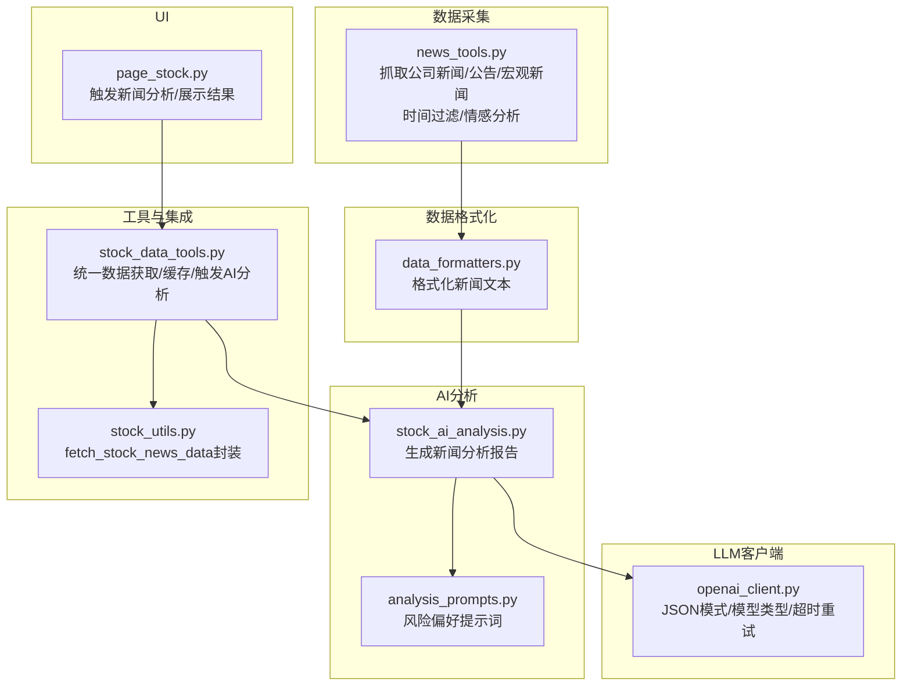
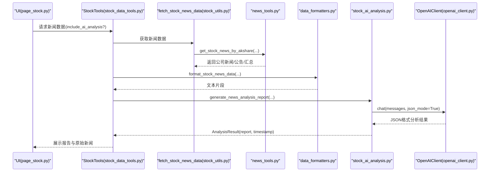
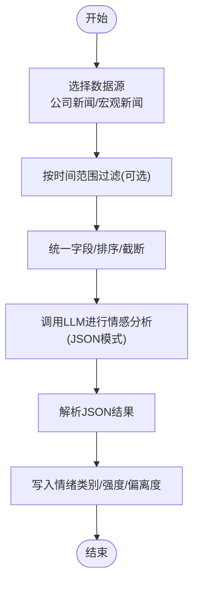
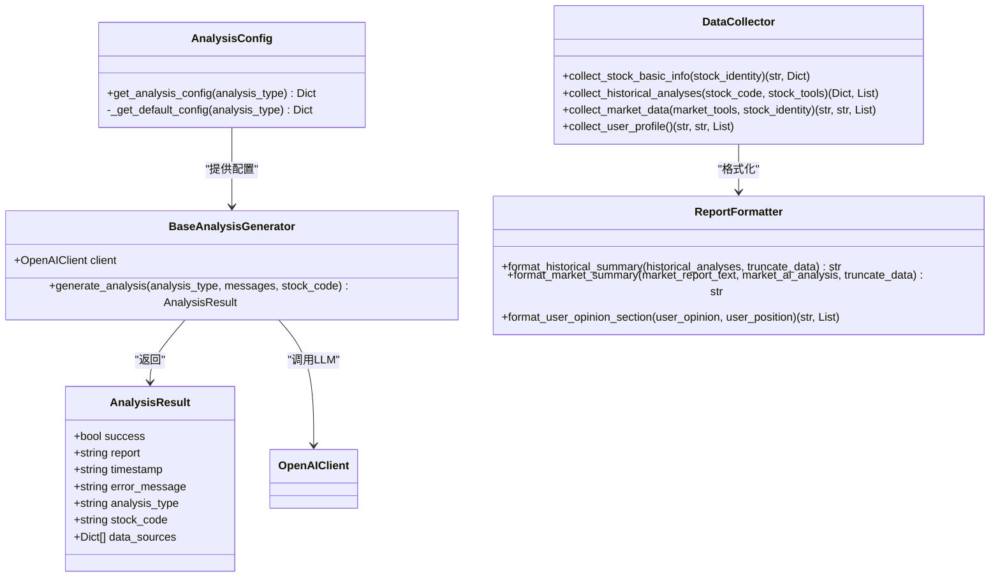
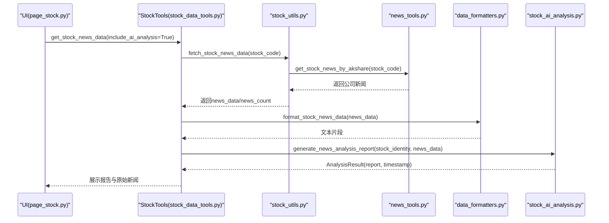
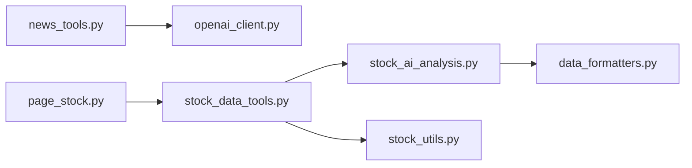

# 新闻分析

<cite>
**本文引用的文件**
- [news_tools.py](file://utils/news_tools.py)
- [stock_ai_analysis.py](file://stock/stock_ai_analysis.py)
- [analysis_prompts.py](file://stock/analysis_prompts.py)
- [openai_client.py](file://llm/openai_client.py)
- [stock_data_tools.py](file://stock/stock_data_tools.py)
- [stock_utils.py](file://stock/stock_utils.py)
- [data_formatters.py](file://utils/data_formatters.py)
- [page_stock.py](file://ui/components/page_stock.py)
</cite>

## 目录
1. [简介](#简介)
2. [项目结构](#项目结构)
3. [核心组件](#核心组件)
4. [架构总览](#架构总览)
5. [详细组件分析](#详细组件分析)
6. [依赖关系分析](#依赖关系分析)
7. [性能考量](#性能考量)
8. [故障排查指南](#故障排查指南)
9. [结论](#结论)

## 简介
本文件面向xystock中“AI新闻舆情分析”的完整链路，围绕两条主线展开：
- 数据采集与预处理：news_tools.py如何从多个数据源抓取财经新闻、公告和社交媒体信息，并进行去重、分类与情感打标。
- 事件抽取与影响评估：stock_ai_analysis.py中的analyze_news方法如何将海量文本摘要为关键事件，并评估其对公司股价的潜在影响；同时阐述提示词工程设计与上下文理解策略，以及在实时性要求下的性能优化与错误处理。

## 项目结构
- 数据采集层：utils/news_tools.py负责从东方财富等数据源抓取公司新闻、公告与宏观新闻，并提供时间过滤、情感分析调用入口。
- 数据格式化层：utils/data_formatters.py将新闻数据格式化为适合LLM消费的文本片段。
- AI分析层：stock/stock_ai_analysis.py提供新闻分析报告生成流程，整合历史分析、市场环境与用户画像，输出结构化分析结果。
- LLM客户端：llm/openai_client.py封装OpenAI兼容接口，支持JSON模式、模型类型切换、超时与重试、用量统计。
- 工具与集成：stock/stock_data_tools.py与stock/stock_utils.py串联数据获取与缓存，UI层通过page_stock.py触发新闻分析与展示。

图表来源
- [news_tools.py](file://utils/news_tools.py#L1-L257)
- [data_formatters.py](file://utils/data_formatters.py#L387-L410)
- [stock_ai_analysis.py](file://stock/stock_ai_analysis.py#L498-L550)
- [analysis_prompts.py](file://stock/analysis_prompts.py#L1-L54)
- [openai_client.py](file://llm/openai_client.py#L72-L175)
- [stock_data_tools.py](file://stock/stock_data_tools.py#L191-L231)
- [stock_utils.py](file://stock/stock_utils.py#L242-L266)
- [page_stock.py](file://ui/components/page_stock.py#L565-L618)

章节来源
- [news_tools.py](file://utils/news_tools.py#L1-L257)
- [stock_ai_analysis.py](file://stock/stock_ai_analysis.py#L498-L550)
- [analysis_prompts.py](file://stock/analysis_prompts.py#L1-L54)
- [openai_client.py](file://llm/openai_client.py#L72-L175)
- [stock_data_tools.py](file://stock/stock_data_tools.py#L191-L231)
- [stock_utils.py](file://stock/stock_utils.py#L242-L266)
- [data_formatters.py](file://utils/data_formatters.py#L387-L410)
- [page_stock.py](file://ui/components/page_stock.py#L565-L618)

## 核心组件
- 新闻采集与情感分析
  - 公司新闻/公告/研究报告采集：get_stock_news_by_akshare
  - 宏观经济新闻采集：get_market_news_caixin
  - 情感分析调用：analyze_news_sentiment，使用JSON模式返回标准化情绪三元组
  - 时间过滤：filter_time
- 数据格式化
  - format_stock_news_data：将新闻列表格式化为LLM可读文本
- AI新闻分析
  - generate_news_analysis_report：构建系统消息与用户消息，调用LLM生成新闻分析报告
  - AnalysisConfig：按分析类型配置温度、模型类型与缓存文件名
- LLM客户端
  - OpenAIClient：ask/chat支持JSON模式、模型类型选择、超时与重试、用量日志
- 工具与集成
  - stock_data_tools：统一获取新闻数据并可触发AI分析
  - stock_utils：fetch_stock_news_data封装news_tools输出
- UI集成
  - page_stock：触发新闻分析并展示报告与原始新闻

章节来源
- [news_tools.py](file://utils/news_tools.py#L12-L257)
- [data_formatters.py](file://utils/data_formatters.py#L387-L410)
- [stock_ai_analysis.py](file://stock/stock_ai_analysis.py#L498-L550)
- [openai_client.py](file://llm/openai_client.py#L72-L175)
- [stock_data_tools.py](file://stock/stock_data_tools.py#L191-L231)
- [stock_utils.py](file://stock/stock_utils.py#L242-L266)
- [page_stock.py](file://ui/components/page_stock.py#L565-L618)

## 架构总览
AI新闻舆情分析链路由“数据采集→格式化→LLM分析→缓存与展示”构成，强调：
- 多源数据融合：公司新闻、公告、宏观新闻
- 结构化情感标注：情绪类别、强度、预期偏离度
- 上下文增强：结合历史分析、市场环境、用户画像
- 实时性与可扩展性：缓存、分页与增量处理

图表来源
- [page_stock.py](file://ui/components/page_stock.py#L565-L618)
- [stock_data_tools.py](file://stock/stock_data_tools.py#L191-L231)
- [stock_utils.py](file://stock/stock_utils.py#L242-L266)
- [news_tools.py](file://utils/news_tools.py#L12-L112)
- [data_formatters.py](file://utils/data_formatters.py#L387-L410)
- [stock_ai_analysis.py](file://stock/stock_ai_analysis.py#L498-L550)
- [openai_client.py](file://llm/openai_client.py#L199-L231)

## 详细组件分析

### 组件A：新闻采集与情感分析（news_tools.py）
- 数据源与采集
  - 公司新闻：通过get_stock_news_by_akshare抓取，按发布时间降序，限制天数与数量，生成news_summary
  - 宏观新闻：get_market_news_caixin抓取财新网宏观经济新闻，统一字段后排序并截断
- 去重与分类
  - 通过时间过滤与字段统一，保证后续处理一致性
  - 分类维度：公司新闻、公告、研究报告、宏观经济
- 情感打标
  - analyze_news_sentiment使用JSON模式调用LLM，返回情绪类别、强度、预期偏离度三项指标
  - 支持时间范围过滤与限制处理条数
- 错误处理
  - 对akshare返回空、字段缺失、JSON解析失败等情况进行捕获与降级

图表来源
- [news_tools.py](file://utils/news_tools.py#L12-L112)
- [news_tools.py](file://utils/news_tools.py#L138-L186)
- [openai_client.py](file://llm/openai_client.py#L120-L175)

章节来源
- [news_tools.py](file://utils/news_tools.py#L12-L112)
- [news_tools.py](file://utils/news_tools.py#L138-L186)
- [openai_client.py](file://llm/openai_client.py#L120-L175)

### 组件B：AI新闻分析（stock_ai_analysis.py）
- 报告生成流程
  - generate_news_analysis_report：构造系统消息与用户消息，调用BaseAnalysisGenerator生成分析结果
  - 系统消息强调识别关键事件、评估时效性与可信度、分析投资者情绪与短期影响、关注基本面影响
- 提示词工程
  - 风险偏好提示词：analysis_prompts.py提供中性/保守/激进三种核心原则，供综合分析使用
  - 新闻分析提示词：明确输出结构（新闻概述、关键信息分析、市场影响评估、风险因素识别），限定字数
- 结果封装
  - AnalysisResult统一返回success/report/timestamp/error_message/analysis_type/stock_code/data_sources

图表来源
- [stock_ai_analysis.py](file://stock/stock_ai_analysis.py#L22-L32)
- [stock_ai_analysis.py](file://stock/stock_ai_analysis.py#L34-L72)
- [stock_ai_analysis.py](file://stock/stock_ai_analysis.py#L303-L346)
- [stock_ai_analysis.py](file://stock/stock_ai_analysis.py#L74-L188)
- [stock_ai_analysis.py](file://stock/stock_ai_analysis.py#L223-L292)
- [openai_client.py](file://llm/openai_client.py#L72-L175)

章节来源
- [stock_ai_analysis.py](file://stock/stock_ai_analysis.py#L22-L32)
- [stock_ai_analysis.py](file://stock/stock_ai_analysis.py#L34-L72)
- [stock_ai_analysis.py](file://stock/stock_ai_analysis.py#L303-L346)
- [stock_ai_analysis.py](file://stock/stock_ai_analysis.py#L498-L550)
- [analysis_prompts.py](file://stock/analysis_prompts.py#L1-L54)

### 组件C：数据格式化与集成（data_formatters.py、stock_data_tools.py、stock_utils.py）
- 格式化
  - format_stock_news_data：将新闻列表格式化为文本，支持截断与链接形式
- 集成
  - stock_data_tools.get_stock_news_data：统一获取新闻数据并可触发AI分析
  - stock_utils.fetch_stock_news_data：封装news_tools输出，返回news_data/news_count/latest_news
- UI触发
  - page_stock：在用户勾选include_ai_analysis时，调用get_stock_news_data并展示AI新闻分析报告

图表来源
- [page_stock.py](file://ui/components/page_stock.py#L565-L618)
- [stock_data_tools.py](file://stock/stock_data_tools.py#L191-L231)
- [stock_utils.py](file://stock/stock_utils.py#L242-L266)
- [news_tools.py](file://utils/news_tools.py#L12-L112)
- [data_formatters.py](file://utils/data_formatters.py#L387-L410)
- [stock_ai_analysis.py](file://stock/stock_ai_analysis.py#L498-L550)

章节来源
- [data_formatters.py](file://utils/data_formatters.py#L387-L410)
- [stock_data_tools.py](file://stock/stock_data_tools.py#L191-L231)
- [stock_utils.py](file://stock/stock_utils.py#L242-L266)
- [page_stock.py](file://ui/components/page_stock.py#L565-L618)

## 依赖关系分析
- 组件耦合
  - news_tools.py依赖llm/openai_client.py进行情感分析
  - stock_ai_analysis.py依赖data_formatters.py进行数据格式化
  - stock_data_tools.py依赖stock_utils.py与stock_ai_analysis.py进行数据获取与AI分析触发
  - UI层依赖stock_data_tools.py进行数据与分析展示
- 外部依赖
  - akshare：新闻与筹码数据源
  - OpenAI兼容接口：JSON模式、模型类型、超时与重试

图表来源
- [news_tools.py](file://utils/news_tools.py#L12-L112)
- [openai_client.py](file://llm/openai_client.py#L72-L175)
- [stock_ai_analysis.py](file://stock/stock_ai_analysis.py#L498-L550)
- [data_formatters.py](file://utils/data_formatters.py#L387-L410)
- [stock_data_tools.py](file://stock/stock_data_tools.py#L191-L231)
- [stock_utils.py](file://stock/stock_utils.py#L242-L266)
- [page_stock.py](file://ui/components/page_stock.py#L565-L618)

章节来源
- [news_tools.py](file://utils/news_tools.py#L12-L112)
- [stock_ai_analysis.py](file://stock/stock_ai_analysis.py#L498-L550)
- [stock_data_tools.py](file://stock/stock_data_tools.py#L191-L231)
- [stock_utils.py](file://stock/stock_utils.py#L242-L266)
- [data_formatters.py](file://utils/data_formatters.py#L387-L410)
- [page_stock.py](file://ui/components/page_stock.py#L565-L618)

## 性能考量
- 实时性与增量处理
  - 新闻数据按天数与数量限制，避免无限增长导致LLM输入膨胀
  - analyze_news_sentiment支持limit参数与时间范围过滤，便于增量处理
- 缓存与复用
  - stock_data_tools对新闻数据与AI分析结果进行缓存，减少重复调用
  - AnalysisConfig按分析类型配置温度与模型类型，兼顾速度与质量
- LLM调用优化
  - OpenAIClient支持JSON模式，减少后处理与解析成本
  - 超时与重试配置降低外部依赖抖动对整体性能的影响
- UI侧优化
  - page_stock在触发AI分析时使用spinner提示，避免阻塞交互

章节来源
- [news_tools.py](file://utils/news_tools.py#L12-L112)
- [news_tools.py](file://utils/news_tools.py#L138-L186)
- [stock_data_tools.py](file://stock/stock_data_tools.py#L191-L231)
- [stock_ai_analysis.py](file://stock/stock_ai_analysis.py#L34-L72)
- [openai_client.py](file://llm/openai_client.py#L72-L175)
- [page_stock.py](file://ui/components/page_stock.py#L565-L618)

## 故障排查指南
- API限流与网络异常
  - OpenAIClient内置超时与重试，异常时记录用量日志并抛出
  - 建议在调用侧增加退避重试与熔断保护
- 内容过滤与编码问题
  - news_tools在字段缺失时跳过该条新闻，避免崩溃
  - JSON模式下若解析失败，打印返回内容便于定位
- 数据源不可用
  - akshare返回空或异常时，返回error字段，上层统一处理
- UI展示异常
  - page_stock对error进行提示，避免前端渲染异常

章节来源
- [openai_client.py](file://llm/openai_client.py#L177-L197)
- [news_tools.py](file://utils/news_tools.py#L148-L186)
- [stock_utils.py](file://stock/stock_utils.py#L242-L266)
- [page_stock.py](file://ui/components/page_stock.py#L565-L618)

## 结论
xystock的AI新闻舆情分析通过“多源采集→结构化情感标注→上下文增强分析→缓存与展示”的闭环，实现了对海量新闻的高效处理与可解释输出。news_tools.py负责高质量数据准备与情感标注，stock_ai_analysis.py通过精心设计的提示词与配置体系，将新闻转化为可操作的投资洞察。在实时性与稳定性方面，项目通过缓存、JSON模式、超时重试与UI提示等手段提供了良好的工程实践。建议在生产环境中进一步引入优先级队列与增量批处理，以应对突发流量与大规模并发场景。