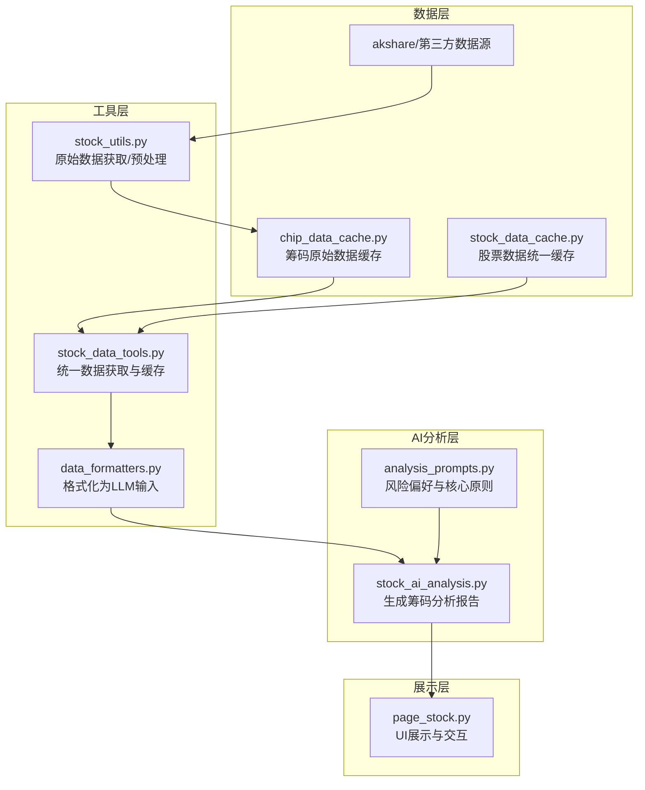
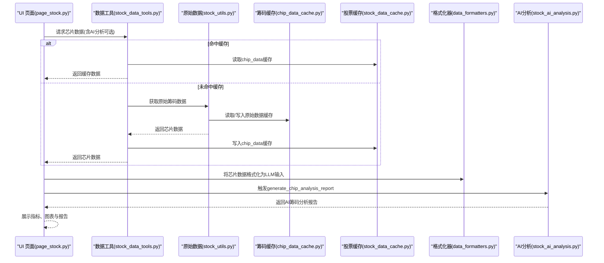
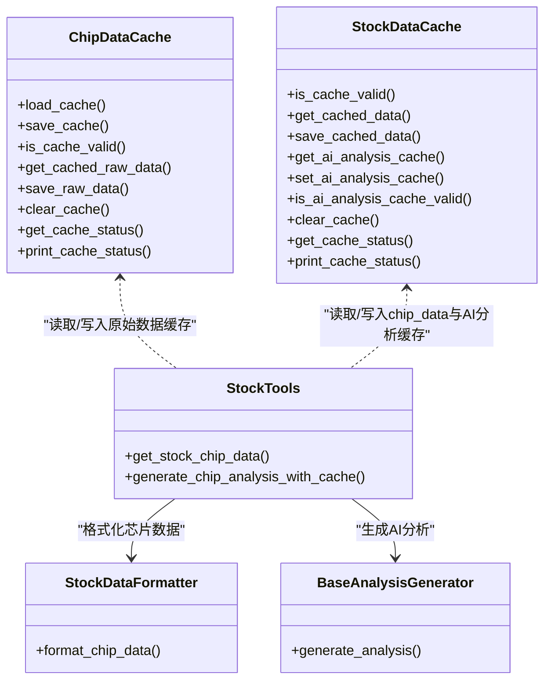

# 筹码分析

<cite>
**本文引用的文件**
- [chip_data_cache.py](file://stock/chip_data_cache.py)
- [stock_data_cache.py](file://stock/stock_data_cache.py)
- [stock_data_tools.py](file://stock/stock_data_tools.py)
- [stock_utils.py](file://stock/stock_utils.py)
- [data_formatters.py](file://utils/data_formatters.py)
- [stock_ai_analysis.py](file://stock/stock_ai_analysis.py)
- [analysis_prompts.py](file://stock/analysis_prompts.py)
- [page_stock.py](file://ui/components/page_stock.py)
- [config_default.toml](file://config_default.toml)
</cite>

## 目录
1. [简介](#简介)
2. [项目结构](#项目结构)
3. [核心组件](#核心组件)
4. [架构总览](#架构总览)
5. [详细组件分析](#详细组件分析)
6. [依赖关系分析](#依赖关系分析)
7. [性能考量](#性能考量)
8. [故障排查指南](#故障排查指南)
9. [结论](#结论)
10. [附录](#附录)

## 简介
本文件围绕 xystock 中“AI筹码分布分析”的技术实现展开，系统阐述如下主题：
- 筹码数据的采集、缓存与格式化
- 筹码数据如何被传递给 LLM，生成可读性强的自然语言分析
- 提示词设计与不同市场阶段（牛市、熊市、震荡市）的侧重点调整
- 如何结合成交量变化验证筹码转移假设
- 数据稀疏性处理（插值估算与跨市场类比）
- 模型选择建议与温度系数配置

## 项目结构
围绕筹码分析的关键文件组织如下：
- 数据采集与缓存
  - 筹码原始数据缓存：chip_data_cache.py
  - 股票数据统一缓存：stock_data_cache.py
  - 数据工具入口：stock_data_tools.py
  - 原始数据获取与预处理：stock_utils.py
- 数据格式化
  - AI分析输入格式化：data_formatters.py
- AI分析
  - 筹码分析提示词与配置：stock_ai_analysis.py、analysis_prompts.py
- UI 展示
  - 筹码分析界面与图表：page_stock.py
- 配置
  - LLM 与分析配置：config_default.toml

图表来源
- [chip_data_cache.py](file://stock/chip_data_cache.py#L1-L215)
- [stock_data_cache.py](file://stock/stock_data_cache.py#L1-L319)
- [stock_data_tools.py](file://stock/stock_data_tools.py#L233-L273)
- [stock_utils.py](file://stock/stock_utils.py#L1-L120)
- [data_formatters.py](file://utils/data_formatters.py#L411-L466)
- [stock_ai_analysis.py](file://stock/stock_ai_analysis.py#L552-L602)
- [analysis_prompts.py](file://stock/analysis_prompts.py#L1-L54)
- [page_stock.py](file://ui/components/page_stock.py#L620-L760)

章节来源
- [chip_data_cache.py](file://stock/chip_data_cache.py#L1-L215)
- [stock_data_cache.py](file://stock/stock_data_cache.py#L1-L319)
- [stock_data_tools.py](file://stock/stock_data_tools.py#L233-L273)
- [stock_utils.py](file://stock/stock_utils.py#L1-L120)
- [data_formatters.py](file://utils/data_formatters.py#L411-L466)
- [stock_ai_analysis.py](file://stock/stock_ai_analysis.py#L552-L602)
- [analysis_prompts.py](file://stock/analysis_prompts.py#L1-L54)
- [page_stock.py](file://ui/components/page_stock.py#L620-L760)

## 核心组件
- 筹码原始数据缓存器：负责将筹码原始数据（如日期、获利比例、平均成本、90%/70%筹码区间与集中度等）持久化，支持过期控制与状态查询。
- 股票数据统一缓存器：负责芯片数据与AI分析报告的统一缓存，支持不同分析类型的差异化过期策略。
- 数据工具入口：封装获取芯片数据与生成AI分析的流程，支持缓存命中、强制刷新与AI分析联动。
- 原始数据获取与预处理：从 akshare 拉取筹码数据，必要时写入专用缓存，并进行日期列转换等清洗。
- 格式化器：将芯片数据结构化为适合 LLM 的自然语言输入，包含关键指标与技术参考位。
- AI 分析器：基于系统提示词与用户配置，生成筹码分析报告；支持温度与模型类型配置。
- UI 展示：在前端展示筹码指标、关键价格区间与历史趋势图，并可触发 AI 分析。

章节来源
- [chip_data_cache.py](file://stock/chip_data_cache.py#L1-L215)
- [stock_data_cache.py](file://stock/stock_data_cache.py#L1-L319)
- [stock_data_tools.py](file://stock/stock_data_tools.py#L233-L273)
- [stock_utils.py](file://stock/stock_utils.py#L1-L120)
- [data_formatters.py](file://utils/data_formatters.py#L411-L466)
- [stock_ai_analysis.py](file://stock/stock_ai_analysis.py#L552-L602)
- [page_stock.py](file://ui/components/page_stock.py#L620-L760)

## 架构总览
下图展示了从数据源到 AI 分析再到 UI 展示的端到端流程。

图表来源
- [page_stock.py](file://ui/components/page_stock.py#L620-L760)
- [stock_data_tools.py](file://stock/stock_data_tools.py#L233-L273)
- [stock_utils.py](file://stock/stock_utils.py#L1-L120)
- [chip_data_cache.py](file://stock/chip_data_cache.py#L1-L215)
- [stock_data_cache.py](file://stock/stock_data_cache.py#L1-L319)
- [data_formatters.py](file://utils/data_formatters.py#L411-L466)
- [stock_ai_analysis.py](file://stock/stock_ai_analysis.py#L552-L602)

## 详细组件分析

### 筹码数据缓存（chip_data_cache.py）
- 设计要点
  - 专用缓存文件：独立存放筹码原始数据，便于后续复用与可视化。
  - JSON 安全转换：将 pandas、numpy、datetime 等非 JSON 类型安全转换为可序列化形式。
  - 过期控制：默认 24 小时过期，到期后自动失效。
  - 状态查询：支持按股票代码查询缓存状态、剩余时间与文件大小。
- 关键方法
  - 加载/保存缓存：load_cache/save_cache
  - 校验有效性：is_cache_valid
  - 读取/写入原始数据：get_cached_raw_data/save_raw_data
  - 清理与状态：clear_cache/print_cache_status/get_cache_status
- 使用场景
  - 从 akshare 拉取的筹码原始数据先写入专用缓存，再由工具层读取并格式化为 AI 输入。

章节来源
- [chip_data_cache.py](file://stock/chip_data_cache.py#L1-L215)

### 股票数据统一缓存（stock_data_cache.py）
- 设计要点
  - 多类型缓存：包含 chip_data、ai_analysis_chip 等，支持差异化过期时间。
  - 键命名规范：ai_analysis_{type}_{stock_code}，便于区分分析类型。
  - 动态过期：根据分析类型选择不同过期分钟数，兼顾时效与成本。
- 关键方法
  - is_cache_valid/get_cached_data/save_cached_data
  - get_ai_analysis_cache/set_ai_analysis_cache/is_ai_analysis_cache_valid
  - 清理与状态：clear_cache/print_cache_status/get_cache_status

章节来源
- [stock_data_cache.py](file://stock/stock_data_cache.py#L1-L319)

### 数据工具入口（stock_data_tools.py）
- 职责
  - 统一获取芯片数据：优先使用统一缓存，未命中则调用原始数据获取函数。
  - AI 分析联动：当 include_ai_analysis=True 时，自动触发 generate_chip_analysis_with_cache 并将报告写入 chip_data.ai_analysis 字段。
- 关键流程
  - get_stock_chip_data：缓存命中/拉取/保存/可选AI分析
  - generate_chip_analysis_with_cache：调用 generate_chip_analysis_report 并缓存结果

章节来源
- [stock_data_tools.py](file://stock/stock_data_tools.py#L233-L273)
- [stock_data_tools.py](file://stock/stock_data_tools.py#L437-L476)

### 原始数据获取与预处理（stock_utils.py）
- 职责
  - 从 akshare 拉取筹码数据（如股东户数、户均持股、集中度、冻结比例等关键指标），并写入专用缓存。
  - 若专用缓存存在，则直接读取并重建 DataFrame，便于后续计算。
- 关键函数
  - get_chip_analysis_data：优先读取专用缓存，否则从 akshare 拉取并写入缓存
  - fetch_stock_chip_data：包装 get_chip_analysis_data，追加更新时间
  - get_chip_raw_data：直接读取专用缓存的原始记录

章节来源
- [stock_utils.py](file://stock/stock_utils.py#L1-L120)
- [stock_utils.py](file://stock/stock_utils.py#L267-L310)

### 数据格式化（data_formatters.py）
- 职责
  - 将芯片数据结构化为自然语言输入：包含最新日期、获利比例、平均成本、90%/70%筹码区间与集中度、分析指标（获利状态、集中度状态、风险水平）、技术参考位（支撑/阻力/成本中枢）。
- 关键方法
  - format_chip_data：将芯片数据格式化为 Markdown 文本，供 LLM 使用

章节来源
- [data_formatters.py](file://utils/data_formatters.py#L411-L466)

### AI 筹码分析（stock_ai_analysis.py）
- 职责
  - 生成筹码分析报告：基于系统提示词与用户配置，将格式化后的芯片数据与股票基本信息传入 LLM，得到自然语言分析。
- 关键点
  - generate_chip_analysis_report：构造 system/user 消息，调用 BaseAnalysisGenerator 生成报告。
  - AnalysisConfig：从配置读取温度、模型类型与缓存文件名，chip 分析默认 temperature=0.5。
  - ReportFormatter：用于格式化历史分析、市场环境与用户观点等辅助信息。
- 提示词设计
  - 侧重解读筹码分布形态与集中度，识别主力成本区间与控盘程度，结合筹码峰值识别关键支撑/压力位，关注筹码迁移与异动转移率等变化，可使用主力成本乖离率、筹码稳定指数等辅助指标。

章节来源
- [stock_ai_analysis.py](file://stock/stock_ai_analysis.py#L552-L602)
- [stock_ai_analysis.py](file://stock/stock_ai_analysis.py#L1-L120)
- [stock_ai_analysis.py](file://stock/stock_ai_analysis.py#L347-L360)
- [config_default.toml](file://config_default.toml#L24-L64)

### 提示词与风险偏好（analysis_prompts.py）
- 职责
  - 定义不同风险偏好的核心原则提示词（中性、保守、激进），并在综合分析中注入到 system message。
- 应用
  - 在 generate_comprehensive_analysis_report 中通过 get_core_principles 获取核心原则，贯穿多维度分析。

章节来源
- [analysis_prompts.py](file://stock/analysis_prompts.py#L1-L54)
- [stock_ai_analysis.py](file://stock/stock_ai_analysis.py#L717-L800)

### UI 展示（page_stock.py）
- 职责
  - 展示筹码指标（获利比例、平均成本、集中度）、关键价格区间（支撑/阻力/成本中枢），并绘制获利比例与平均成本的历史趋势图。
  - 触发 AI 筹码分析，展示报告与生成时间。
- 关键点
  - 通过 session_state.ai_chip_report 缓存 AI 报告，避免重复生成。
  - 当未命中缓存时，自动调用 get_stock_chip_data(include_ai_analysis=True)。

章节来源
- [page_stock.py](file://ui/components/page_stock.py#L620-L760)

## 依赖关系分析

图表来源
- [chip_data_cache.py](file://stock/chip_data_cache.py#L1-L215)
- [stock_data_cache.py](file://stock/stock_data_cache.py#L1-L319)
- [stock_data_tools.py](file://stock/stock_data_tools.py#L233-L273)
- [data_formatters.py](file://utils/data_formatters.py#L411-L466)
- [stock_ai_analysis.py](file://stock/stock_ai_analysis.py#L303-L360)

章节来源
- [stock_data_tools.py](file://stock/stock_data_tools.py#L233-L273)
- [chip_data_cache.py](file://stock/chip_data_cache.py#L1-L215)
- [stock_data_cache.py](file://stock/stock_data_cache.py#L1-L319)
- [data_formatters.py](file://utils/data_formatters.py#L411-L466)
- [stock_ai_analysis.py](file://stock/stock_ai_analysis.py#L303-L360)

## 性能考量
- 缓存策略
  - 筹码原始数据专用缓存默认 24 小时过期，减少重复拉取 akshare 数据的开销。
  - 统一缓存对 AI 筹码分析采用 720 分钟（12 小时）过期，兼顾时效与成本。
- 数据序列化
  - JSON 安全转换避免了 pandas/numpy/datetime 的序列化问题，提升缓存稳定性。
- UI 交互
  - 通过 session_state 缓存 AI 报告，避免重复生成；仅在用户切换观点或刷新时重新生成。

章节来源
- [chip_data_cache.py](file://stock/chip_data_cache.py#L1-L215)
- [stock_data_cache.py](file://stock/stock_data_cache.py#L1-L319)
- [page_stock.py](file://ui/components/page_stock.py#L620-L760)

## 故障排查指南
- 筹码数据为空或报错
  - 检查 akshare 接口是否可用，确认网络与依赖安装正常。
  - 查看专用缓存是否存在，若无则重新拉取并写入缓存。
- 缓存未命中
  - 确认统一缓存是否过期；必要时使用强制刷新参数。
  - 检查缓存文件路径与权限。
- AI 分析失败
  - 查看 LLM 配置（API Key、模型类型、温度）是否正确。
  - 检查提示词是否被正确注入，必要时降低 temperature 提升一致性。
- UI 未显示图表
  - 确认原始数据缓存中存在历史记录；若无历史数据，UI 将提示无法绘制趋势图。

章节来源
- [stock_utils.py](file://stock/stock_utils.py#L1-L120)
- [chip_data_cache.py](file://stock/chip_data_cache.py#L1-L215)
- [stock_data_cache.py](file://stock/stock_data_cache.py#L1-L319)
- [page_stock.py](file://ui/components/page_stock.py#L700-L760)

## 结论
xystock 的筹码分析体系通过“专用缓存 + 统一缓存 + 格式化 + LLM 分析 + UI 展示”的链路，实现了从原始数据到可读性强的自然语言报告的闭环。提示词设计强调主力成本、集中度与关键价格区间的识别，并结合筹码迁移与异动转移率等信号进行综合判断。通过合理的缓存策略与配置，系统在性能与一致性之间取得平衡。

## 附录

### 筹码数据关键指标与含义
- 获利比例：反映当前股价以上筹码占比，用于判断抛压与上涨阻力。
- 平均成本：全体股东的平均持仓成本，作为成本中枢参考。
- 90%/70% 筹码区间与集中度：衡量筹码分布的密集程度与控盘程度。
- 支撑/阻力/成本中枢：结合筹码峰值与均价识别关键技术位。
- 分析指标（analysis）：获利状态、集中度状态、风险水平等辅助判断。

章节来源
- [data_formatters.py](file://utils/data_formatters.py#L411-L466)

### 提示词设计逻辑与市场阶段调整
- 牛市阶段
  - 侧重点：识别高位筹码密集区（潜在抛压）、主力成本上移迹象、成交量配合放量突破。
- 熊市阶段
  - 侧重点：关注低位成本密集区（潜在支撑）、筹码下移与集中度变化、成交量缩量回调。
- 震荡市阶段
  - 侧重点：成本中枢附近反复争夺、筹码迁移速率与集中度变化、量价背离信号。

章节来源
- [stock_ai_analysis.py](file://stock/stock_ai_analysis.py#L552-L602)
- [analysis_prompts.py](file://stock/analysis_prompts.py#L1-L54)

### 结合成交量验证筹码转移假设
- 方法
  - 对筹码历史趋势与成交量进行对比：筹码上移伴随放量突破，或筹码下移伴随缩量回调，有助于验证主力行为与筹码转移方向。
  - 关注筹码异动转移率与成交量变化的时序关系，剔除噪音干扰。
- 实施建议
  - 在 UI 展示中增加成交量与筹码趋势的对比视图，便于直观判断。

章节来源
- [page_stock.py](file://ui/components/page_stock.py#L700-L760)

### 数据稀疏性处理
- 插值估算
  - 对缺失日期的筹码数据，可在保证业务语义合理的前提下进行线性或基于前后窗口的插值，避免时间序列断裂。
- 跨市场类比
  - 当某股票筹码数据缺失时，可参考同板块或相似特征的指数/ETF数据进行类比分析，标注参考来源与局限性。
- 注意事项
  - 插值与类比仅用于辅助判断，最终结论仍应以可验证数据为准。

章节来源
- [stock_utils.py](file://stock/stock_utils.py#L1-L120)
- [stock_data_tools.py](file://stock/stock_data_tools.py#L233-L273)

### 模型选择与温度配置建议
- 模型选择
  - 优先选择擅长数值推理与逻辑推断的 LLM，以提升对筹码指标与趋势的解读能力。
- 温度系数
  - 筹码分析默认 temperature=0.5，有利于提高结论一致性；综合分析默认 temperature=0.4，进一步增强稳定性。
- 配置来源
  - AI 分析配置位于配置文件中，可按需调整。

章节来源
- [stock_ai_analysis.py](file://stock/stock_ai_analysis.py#L347-L360)
- [config_default.toml](file://config_default.toml#L24-L64)