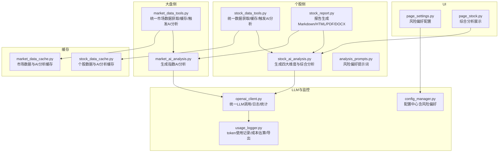
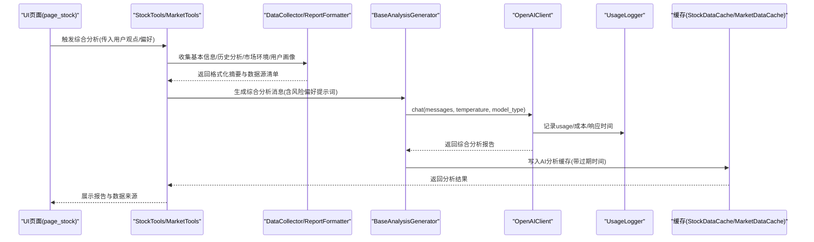
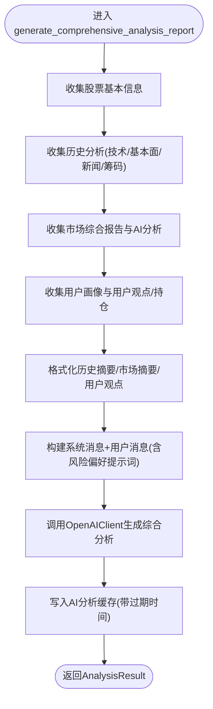
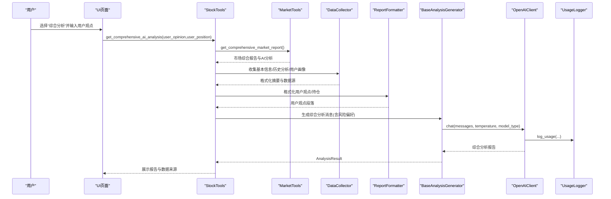
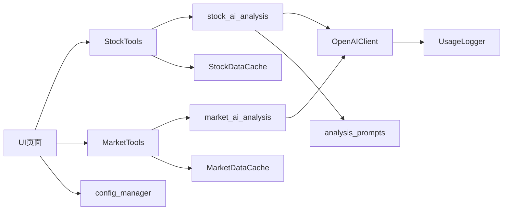

# 综合分析

<cite>
**本文引用的文件**
- [stock/stock_ai_analysis.py](file://stock/stock_ai_analysis.py)
- [stock/analysis_prompts.py](file://stock/analysis_prompts.py)
- [stock/stock_data_tools.py](file://stock/stock_data_tools.py)
- [stock/stock_report.py](file://stock/stock_report.py)
- [market/market_ai_analysis.py](file://market/market_ai_analysis.py)
- [market/market_data_tools.py](file://market/market_data_tools.py)
- [llm/openai_client.py](file://llm/openai_client.py)
- [llm/usage_logger.py](file://llm/usage_logger.py)
- [stock/stock_data_cache.py](file://stock/stock_data_cache.py)
- [market/market_data_cache.py](file://market/market_data_cache.py)
- [config_manager.py](file://config_manager.py)
- [ui/components/page_settings.py](file://ui/components/page_settings.py)
- [ui/components/page_stock.py](file://ui/components/page_stock.py)
</cite>

## 目录
1. [简介](#简介)
2. [项目结构](#项目结构)
3. [核心组件](#核心组件)
4. [架构总览](#架构总览)
5. [详细组件分析](#详细组件分析)
6. [依赖关系分析](#依赖关系分析)
7. [性能考量](#性能考量)
8. [故障排查指南](#故障排查指南)
9. [结论](#结论)
10. [附录](#附录)

## 简介
本文件系统性阐述 xystock 中“AI综合投资建议”的生成机制，围绕 analyze_comprehensive 方法如何整合技术面、基本面、新闻舆情与筹码分布四大维度，形成全局视角；详解三阶段提示词策略（独立分析、交叉验证与矛盾识别、统一结论与操作建议）；说明如何根据用户风险偏好（保守/平衡/激进）动态调整建议风格；解释系统如何通过 usage_logger 进行成本监控并在保证质量的前提下优化 token 使用效率；最后提供从原始数据到最终报告的完整流程案例，并讨论输出格式标准化（Markdown/JSON）与可解释性增强技术。

## 项目结构
xystock 的 AI 综合分析位于 stock 与 market 两大子系统，分别负责个股与大盘的分析与汇总。LLM 层提供统一的 OpenAI 客户端与使用记录器，缓存层负责数据与 AI 分析结果的缓存与过期控制，UI 层负责风险偏好配置与展示。

图表来源
- [stock/stock_data_tools.py](file://stock/stock_data_tools.py#L1-L709)
- [stock/stock_ai_analysis.py](file://stock/stock_ai_analysis.py#L1-L879)
- [stock/analysis_prompts.py](file://stock/analysis_prompts.py#L1-L54)
- [stock/stock_report.py](file://stock/stock_report.py#L1-L311)
- [market/market_data_tools.py](file://market/market_data_tools.py#L1-L519)
- [market/market_ai_analysis.py](file://market/market_ai_analysis.py#L1-L123)
- [llm/openai_client.py](file://llm/openai_client.py#L1-L297)
- [llm/usage_logger.py](file://llm/usage_logger.py#L1-L204)
- [stock/stock_data_cache.py](file://stock/stock_data_cache.py#L1-L319)
- [market/market_data_cache.py](file://market/market_data_cache.py#L1-L440)
- [config_manager.py](file://config_manager.py#L1-L144)
- [ui/components/page_settings.py](file://ui/components/page_settings.py#L135-L161)
- [ui/components/page_stock.py](file://ui/components/page_stock.py#L788-L812)

章节来源
- [stock/stock_ai_analysis.py](file://stock/stock_ai_analysis.py#L717-L878)
- [stock/stock_data_tools.py](file://stock/stock_data_tools.py#L517-L621)
- [market/market_data_tools.py](file://market/market_data_tools.py#L421-L495)
- [llm/openai_client.py](file://llm/openai_client.py#L1-L297)
- [llm/usage_logger.py](file://llm/usage_logger.py#L1-L204)
- [stock/stock_data_cache.py](file://stock/stock_data_cache.py#L1-L319)
- [market/market_data_cache.py](file://market/market_data_cache.py#L1-L440)
- [config_manager.py](file://config_manager.py#L1-L144)
- [ui/components/page_settings.py](file://ui/components/page_settings.py#L135-L161)
- [ui/components/page_stock.py](file://ui/components/page_stock.py#L788-L812)

## 核心组件
- analyze_comprehensive 方法：整合四大维度与用户画像，生成统一结论与操作建议。
- DataCollector/ReportFormatter：负责数据收集、格式化与摘要拼装。
- BaseAnalysisGenerator：统一的分析生成器，封装 OpenAIClient 调用与缓存写入。
- Risk Preference Prompt：根据配置动态注入核心原则，决定建议风格。
- UsageLogger/OpenAIClient：记录 token 使用、成本估算与统计导出。
- 缓存管理：个股与市场数据/分析结果的差异化过期策略。

章节来源
- [stock/stock_ai_analysis.py](file://stock/stock_ai_analysis.py#L717-L878)
- [stock/analysis_prompts.py](file://stock/analysis_prompts.py#L1-L54)
- [llm/openai_client.py](file://llm/openai_client.py#L1-L297)
- [llm/usage_logger.py](file://llm/usage_logger.py#L1-L204)
- [stock/stock_data_cache.py](file://stock/stock_data_cache.py#L1-L319)
- [market/market_data_cache.py](file://market/market_data_cache.py#L1-L440)

## 架构总览
AI 综合分析的端到端流程如下：

图表来源
- [ui/components/page_stock.py](file://ui/components/page_stock.py#L810-L812)
- [stock/stock_data_tools.py](file://stock/stock_data_tools.py#L517-L621)
- [stock/stock_ai_analysis.py](file://stock/stock_ai_analysis.py#L717-L878)
- [llm/openai_client.py](file://llm/openai_client.py#L198-L231)
- [llm/usage_logger.py](file://llm/usage_logger.py#L45-L118)
- [stock/stock_data_cache.py](file://stock/stock_data_cache.py#L165-L178)

## 详细组件分析

### analyze_comprehensive 方法与四维融合
- 数据收集阶段
  - 基本信息：股票实时数据与概览。
  - 历史分析：技术、基本面、新闻、筹码四个维度的历史报告与数据源。
  - 市场环境：大盘综合报告与AI分析（指数维度）。
  - 用户画像：风险偏好、用户常犯错误、用户观点与当前持仓。
- 格式化阶段
  - 历史摘要：对各维度报告进行截断与去 Markdown 格式化，便于统一拼装。
  - 市场摘要：对市场综合报告与AI分析进行截断与拼装。
  - 用户观点：将用户观点与当前持仓状态格式化为独立段落。
- 统一生成阶段
  - 动态注入风险偏好提示词（保守/平衡/激进/自定义），决定建议风格。
  - 构造系统消息与用户消息，包含历史摘要、市场环境、用户画像与用户观点。
  - 通过 BaseAnalysisGenerator 调用 OpenAIClient，得到统一的综合分析报告。
  - 返回 AnalysisResult，包含报告正文、时间戳、数据源清单与错误信息。

图表来源
- [stock/stock_ai_analysis.py](file://stock/stock_ai_analysis.py#L717-L878)

章节来源
- [stock/stock_ai_analysis.py](file://stock/stock_ai_analysis.py#L717-L878)

### 多阶段提示词策略
- 第一阶段：各维度独立分析
  - 技术面：基于 K 线与技术指标，识别趋势与关键位。
  - 基本面：财务与估值指标，评估企业质量与风险。
  - 新闻面：识别关键事件与情绪影响，评估短期扰动。
  - 筹码面：解读筹码分布与主力行为，识别支撑压力与博弈态势。
- 第二阶段：交叉验证与矛盾识别
  - 将四维分析结果与市场环境、用户画像进行交叉比对，识别一致性与分歧。
  - 对技术破位、基本面恶化、新闻利空与筹码异动等负面信号进行预警。
- 第三阶段：统一结论与操作建议
  - 给出超短期/短期/中期的涨跌概率与幅度区间。
  - 明确买入/加仓/减仓/止损位置与止盈策略。
  - 强化风险提示与机会点识别，结合用户风险偏好给出个性化建议。

章节来源
- [stock/stock_ai_analysis.py](file://stock/stock_ai_analysis.py#L780-L848)
- [stock/analysis_prompts.py](file://stock/analysis_prompts.py#L1-L54)

### 风险偏好与建议风格
- 风险偏好来源：配置中心 ANALYSIS.RISK_PREFERENCE 与 ANALYSIS.CUSTOM_PRINCIPLES。
- 三种风格：
  - 保守：本金安全优先，严格风控，谨慎操作。
  - 平衡：诚实直接，客观评估正负信号，兼顾机会与风险。
  - 激进：把握成长机会，适度承担风险，灵活操作。
- UI 展示：页面设置中可查看当前风格的具体提示词内容。

章节来源
- [stock/analysis_prompts.py](file://stock/analysis_prompts.py#L1-L54)
- [config_manager.py](file://config_manager.py#L1-L144)
- [ui/components/page_settings.py](file://ui/components/page_settings.py#L135-L161)

### 成本监控与 token 优化
- OpenAIClient
  - 统一封装 chat/ask，自动记录 usage、响应时间、模型、温度等。
  - 支持 JSON 模式与多轮对话，便于结构化输出与可解释性增强。
- UsageLogger
  - 记录 prompt_tokens/completion_tokens/total_tokens/cost_estimate/response_time。
  - 提供统计接口与 HTML 报告导出，便于成本审计与优化。
- token 优化策略
  - 控制输入长度：DataCollector/ReportFormatter 对历史摘要与市场摘要进行截断。
  - 降低温度：综合分析默认较低温度，提高稳定性与可复现性。
  - 选择模型类型：推理模型用于更稳定的结论生成。

章节来源
- [llm/openai_client.py](file://llm/openai_client.py#L198-L231)
- [llm/usage_logger.py](file://llm/usage_logger.py#L45-L118)
- [stock/stock_ai_analysis.py](file://stock/stock_ai_analysis.py#L293-L346)

### 输出格式标准化与可解释性
- 输出格式
  - Markdown：用于 UI 展示与报告生成。
  - HTML/PDF/DOCX：通过统一报告生成器输出。
- 可解释性增强
  - 数据来源清单：每个分析维度与市场环境均标注来源类型、描述与时间戳。
  - 用户画像与观点：明确标注用户观点是否纳入与当前持仓状态。
  - 统一结构：综合分析报告采用固定章节，便于用户快速定位关键信息。

章节来源
- [stock/stock_report.py](file://stock/stock_report.py#L1-L311)
- [stock/stock_ai_analysis.py](file://stock/stock_ai_analysis.py#L717-L878)

### 实际案例：从原始数据到最终报告
- 场景：某股票当日出现技术突破，同时有新闻利好与市场情绪改善，用户持有一定仓位。
- 步骤：
  1) StockTools 收集基本信息与历史分析（技术/基本面/新闻/筹码）。
  2) MarketTools 收集市场综合报告与AI分析（指数维度）。
  3) DataCollector 汇总并格式化为摘要，收集用户画像与用户观点。
  4) BaseAnalysisGenerator 构造消息，注入风险偏好提示词。
  5) OpenAIClient 调用 LLM，UsageLogger 记录 token 使用。
  6) 结果写入缓存，返回 AnalysisResult。
  7) UI 展示报告与数据来源详情，支持导出 PDF/HTML/DOCX/Markdown。

图表来源
- [stock/stock_data_tools.py](file://stock/stock_data_tools.py#L517-L621)
- [market/market_data_tools.py](file://market/market_data_tools.py#L421-L495)
- [stock/stock_ai_analysis.py](file://stock/stock_ai_analysis.py#L717-L878)
- [llm/openai_client.py](file://llm/openai_client.py#L198-L231)
- [llm/usage_logger.py](file://llm/usage_logger.py#L45-L118)
- [ui/components/page_stock.py](file://ui/components/page_stock.py#L788-L812)

章节来源
- [stock/stock_data_tools.py](file://stock/stock_data_tools.py#L517-L621)
- [market/market_data_tools.py](file://market/market_data_tools.py#L421-L495)
- [stock/stock_ai_analysis.py](file://stock/stock_ai_analysis.py#L717-L878)
- [ui/components/page_stock.py](file://ui/components/page_stock.py#L788-L812)

## 依赖关系分析
- 组件耦合
  - stock_data_tools 依赖 stock_ai_analysis 生成四大维度与综合分析。
  - market_data_tools 依赖 market_ai_analysis 生成指数 AI 分析。
  - openai_client 与 usage_logger 为 LLM 调用与成本监控提供基础设施。
  - 缓存层贯穿数据与分析结果，降低重复调用与成本。
- 关键依赖链
  - UI -> StockTools/MarketTools -> DataCollector/ReportFormatter -> BaseAnalysisGenerator -> OpenAIClient -> UsageLogger -> 缓存。
- 外部集成点
  - 配置中心 config_manager 提供风险偏好与 LLM 参数。
  - UI 页面 page_settings 与 page_stock 与后端分析流程衔接。

图表来源
- [ui/components/page_stock.py](file://ui/components/page_stock.py#L788-L812)
- [ui/components/page_settings.py](file://ui/components/page_settings.py#L135-L161)
- [stock/stock_data_tools.py](file://stock/stock_data_tools.py#L517-L621)
- [market/market_data_tools.py](file://market/market_data_tools.py#L421-L495)
- [stock/stock_ai_analysis.py](file://stock/stock_ai_analysis.py#L717-L878)
- [market/market_ai_analysis.py](file://market/market_ai_analysis.py#L1-L123)
- [llm/openai_client.py](file://llm/openai_client.py#L1-L297)
- [llm/usage_logger.py](file://llm/usage_logger.py#L1-L204)
- [stock/stock_data_cache.py](file://stock/stock_data_cache.py#L1-L319)
- [market/market_data_cache.py](file://market/market_data_cache.py#L1-L440)
- [config_manager.py](file://config_manager.py#L1-L144)

章节来源
- [stock/stock_data_tools.py](file://stock/stock_data_tools.py#L1-L709)
- [market/market_data_tools.py](file://market/market_data_tools.py#L1-L519)
- [stock/stock_ai_analysis.py](file://stock/stock_ai_analysis.py#L1-L879)
- [market/market_ai_analysis.py](file://market/market_ai_analysis.py#L1-L123)
- [llm/openai_client.py](file://llm/openai_client.py#L1-L297)
- [llm/usage_logger.py](file://llm/usage_logger.py#L1-L204)
- [stock/stock_data_cache.py](file://stock/stock_data_cache.py#L1-L319)
- [market/market_data_cache.py](file://market/market_data_cache.py#L1-L440)
- [config_manager.py](file://config_manager.py#L1-L144)
- [ui/components/page_settings.py](file://ui/components/page_settings.py#L135-L161)
- [ui/components/page_stock.py](file://ui/components/page_stock.py#L788-L812)

## 性能考量
- 缓存策略
  - 个股数据与 AI 分析采用差异化过期时间，减少重复调用与 token 消耗。
  - 综合分析缓存同时考虑用户观点变化，避免无效缓存命中。
- 输入裁剪
  - 历史摘要与市场摘要在格式化阶段进行截断，降低输入长度。
- 模型与温度
  - 综合分析默认较低温度，提高稳定性；推理模型用于结论生成。
- 成本控制
  - 通过 UsageLogger 统计 total_tokens 与 cost_estimate，定期导出报告优化策略。

章节来源
- [stock/stock_data_cache.py](file://stock/stock_data_cache.py#L1-L319)
- [market/market_data_cache.py](file://market/market_data_cache.py#L1-L440)
- [stock/stock_ai_analysis.py](file://stock/stock_ai_analysis.py#L293-L346)
- [llm/usage_logger.py](file://llm/usage_logger.py#L125-L163)

## 故障排查指南
- 常见问题
  - API 密钥未配置：OpenAIClient 初始化时报错，需检查配置中心 LLM_OPENAI.API_KEY。
  - 综合分析失败：返回错误报告，包含可能的解决方案与已收集的数据源数量。
  - 市场新闻功能关闭：MarketTools.get_market_news_data 返回禁用提示。
- 排查步骤
  - 检查 UsageLogger 统计与导出报告，确认 token 使用与成本。
  - 查看缓存状态，确认数据与 AI 分析缓存是否有效。
  - 在 UI 页面设置中切换风险偏好，观察提示词变化与输出风格差异。

章节来源
- [llm/openai_client.py](file://llm/openai_client.py#L25-L71)
- [stock/stock_ai_analysis.py](file://stock/stock_ai_analysis.py#L850-L878)
- [market/market_data_tools.py](file://market/market_data_tools.py#L250-L272)
- [llm/usage_logger.py](file://llm/usage_logger.py#L164-L204)
- [stock/stock_data_cache.py](file://stock/stock_data_cache.py#L234-L308)
- [market/market_data_cache.py](file://market/market_data_cache.py#L391-L429)

## 结论
xystock 的 AI 综合投资建议通过“四维独立分析 + 交叉验证 + 统一结论”的三阶段策略，结合用户风险偏好与画像，形成可解释、可追踪、可导出的高质量报告。系统通过缓存与 UsageLogger 实现成本控制与性能优化，UI 层提供直观的配置与展示入口，整体具备良好的扩展性与可维护性。

## 附录
- 风险偏好提示词映射
  - neutral：平衡风险与机会，诚实直接。
  - conservative：本金安全优先，严格风控，谨慎操作。
  - aggressive：把握成长机会，适度承担风险，灵活操作。
- 输出格式
  - Markdown：用于 UI 展示与报告生成。
  - HTML/PDF/DOCX：通过统一报告生成器输出。

章节来源
- [stock/analysis_prompts.py](file://stock/analysis_prompts.py#L1-L54)
- [stock/stock_report.py](file://stock/stock_report.py#L1-L311)