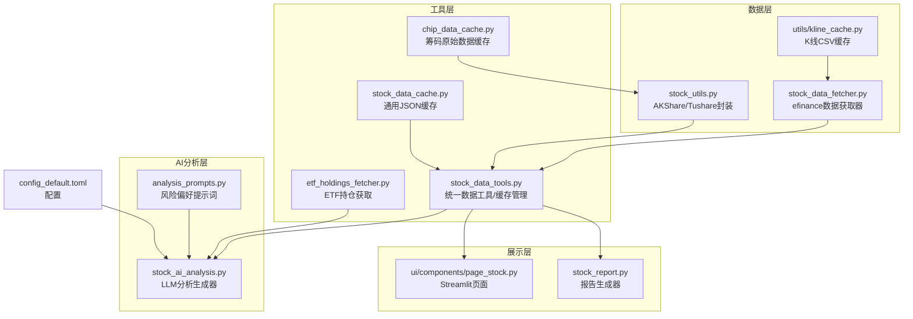
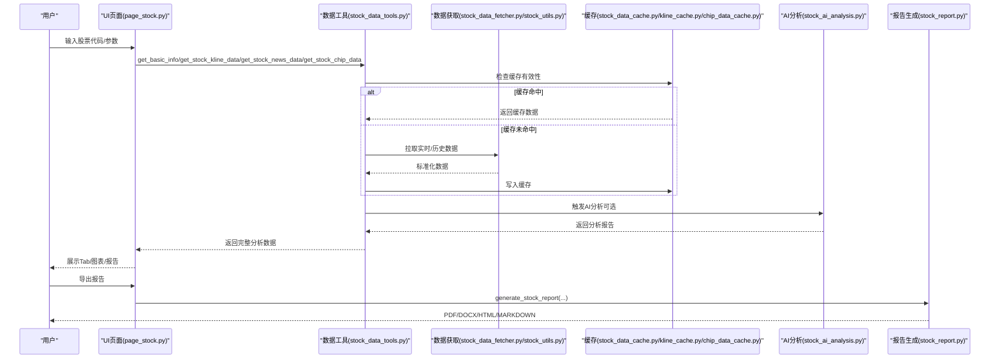
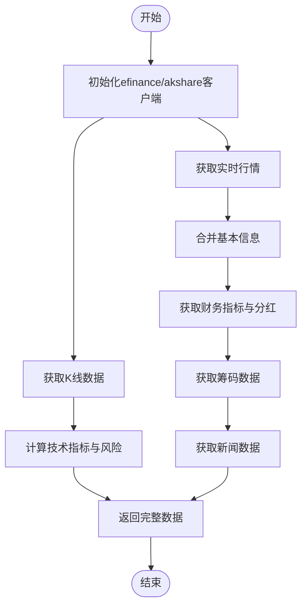
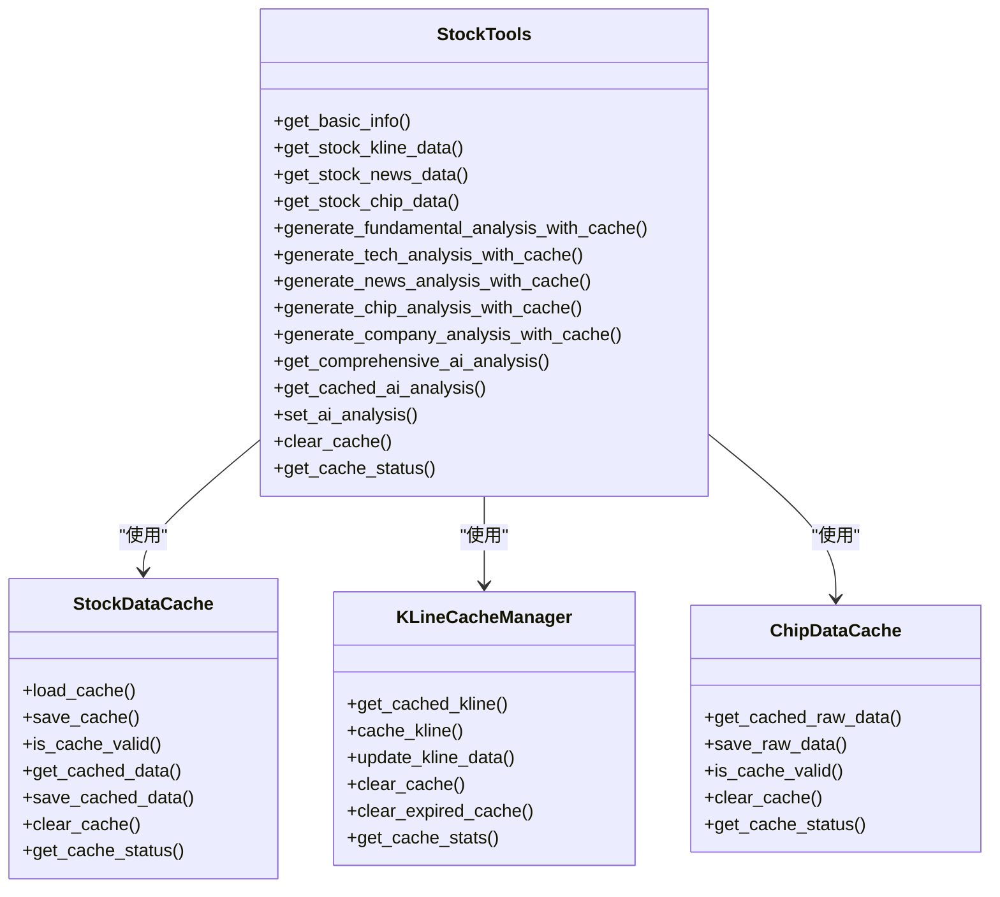
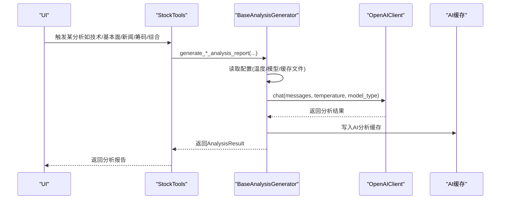
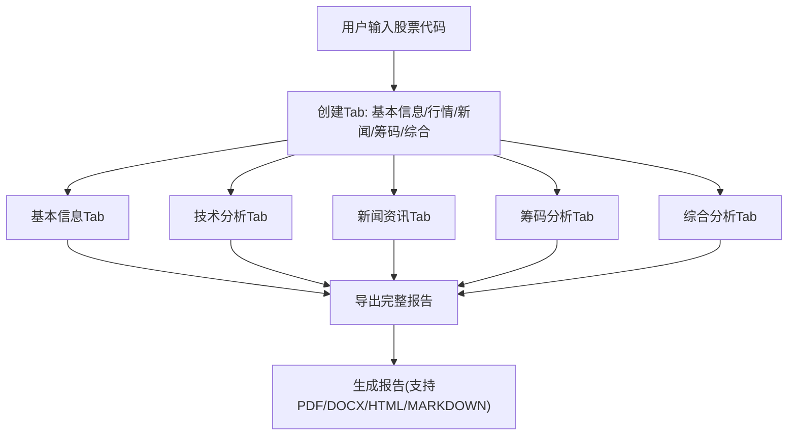
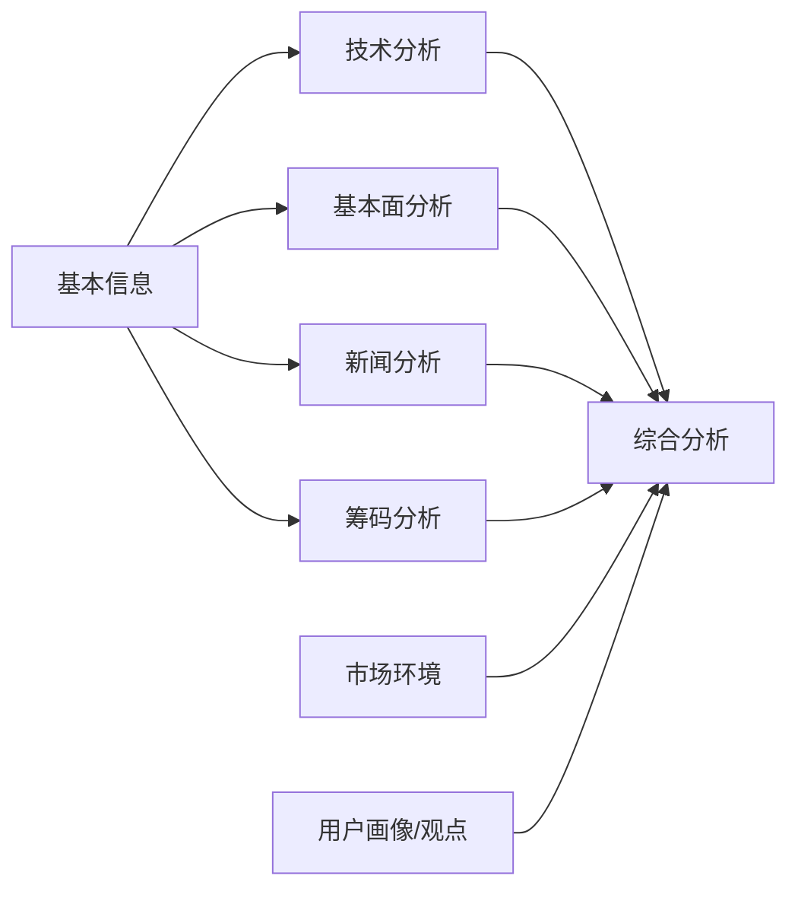
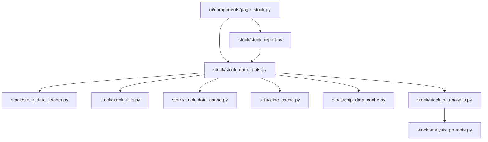

# 个股分析

<cite>
**本文引用的文件**
- [stock/stock_data_fetcher.py](file://stock/stock_data_fetcher.py)
- [stock/stock_utils.py](file://stock/stock_utils.py)
- [stock/stock_data_tools.py](file://stock/stock_data_tools.py)
- [stock/stock_ai_analysis.py](file://stock/stock_ai_analysis.py)
- [stock/analysis_prompts.py](file://stock/analysis_prompts.py)
- [stock/stock_report.py](file://stock/stock_report.py)
- [stock/etf_holdings_fetcher.py](file://stock/etf_holdings_fetcher.py)
- [stock/chip_data_cache.py](file://stock/chip_data_cache.py)
- [stock/stock_data_cache.py](file://stock/stock_data_cache.py)
- [utils/kline_cache.py](file://utils/kline_cache.py)
- [ui/components/page_stock.py](file://ui/components/page_stock.py)
- [config_default.toml](file://config_default.toml)
</cite>

## 目录
1. [简介](#简介)
2. [项目结构](#项目结构)
3. [核心组件](#核心组件)
4. [架构总览](#架构总览)
5. [详细组件分析](#详细组件分析)
6. [依赖关系分析](#依赖关系分析)
7. [性能考量](#性能考量)
8. [故障排查指南](#故障排查指南)
9. [结论](#结论)
10. [附录](#附录)

## 简介
本文件围绕 xystock 的“个股分析”能力展开，系统性阐述如何整合基本信息、基本面数据、技术指标、新闻舆情与筹码分布等多维度信息，形成统一的分析视图。文档重点覆盖：
- 个股数据获取链路（efinance、akshare/tushare 等数据源）
- AI 综合解读与投资建议生成
- UI 层参数输入、结果展示与交互反馈
- 从用户查询到结果呈现的完整流程
- 各分析维度之间的数据依赖关系
- 配置自定义分析提示词的方法
- 常见问题与调试优化策略

## 项目结构
xystock 将个股分析拆分为数据层、工具层、AI 分析层与 UI 展示层，配合缓存与格式化模块，形成清晰的分层架构。

图表来源
- [stock/stock_data_fetcher.py](file://stock/stock_data_fetcher.py#L1-L546)
- [stock/stock_utils.py](file://stock/stock_utils.py#L1-L311)
- [utils/kline_cache.py](file://utils/kline_cache.py#L1-L477)
- [stock/stock_data_tools.py](file://stock/stock_data_tools.py#L1-L709)
- [stock/stock_data_cache.py](file://stock/stock_data_cache.py#L1-L319)
- [stock/chip_data_cache.py](file://stock/chip_data_cache.py#L1-L215)
- [stock/etf_holdings_fetcher.py](file://stock/etf_holdings_fetcher.py#L1-L269)
- [stock/stock_ai_analysis.py](file://stock/stock_ai_analysis.py#L1-L879)
- [stock/analysis_prompts.py](file://stock/analysis_prompts.py#L1-L54)
- [ui/components/page_stock.py](file://ui/components/page_stock.py#L1-L884)
- [stock/stock_report.py](file://stock/stock_report.py#L1-L311)
- [config_default.toml](file://config_default.toml#L1-L64)

章节来源
- [stock/stock_data_fetcher.py](file://stock/stock_data_fetcher.py#L1-L546)
- [stock/stock_utils.py](file://stock/stock_utils.py#L1-L311)
- [stock/stock_data_tools.py](file://stock/stock_data_tools.py#L1-L709)
- [stock/stock_ai_analysis.py](file://stock/stock_ai_analysis.py#L1-L879)
- [stock/analysis_prompts.py](file://stock/analysis_prompts.py#L1-L54)
- [ui/components/page_stock.py](file://ui/components/page_stock.py#L1-L884)
- [stock/stock_report.py](file://stock/stock_report.py#L1-L311)
- [stock/etf_holdings_fetcher.py](file://stock/etf_holdings_fetcher.py#L1-L269)
- [stock/chip_data_cache.py](file://stock/chip_data_cache.py#L1-L215)
- [stock/stock_data_cache.py](file://stock/stock_data_cache.py#L1-L319)
- [utils/kline_cache.py](file://utils/kline_cache.py#L1-L477)
- [config_default.toml](file://config_default.toml#L1-L64)

## 核心组件
- 数据获取器：负责从 efinance/akshare 等数据源抓取实时行情、K线、财务与分红等数据，并进行格式转换与缓存。
- 数据工具：统一入口，按需调用数据获取器，聚合技术指标、风险指标、新闻、筹码等数据，支持缓存与AI分析生成。
- AI 分析：基于 LLM 的技术面、基本面、新闻、筹码与综合分析生成器，支持配置温度、模型类型与缓存文件名。
- UI 页面：Streamlit 页面，提供参数输入、结果展示与交互反馈，支持导出完整报告。
- 缓存体系：K线CSV缓存、通用JSON缓存、筹码原始数据缓存，分别服务于不同粒度与生命周期的数据。
- ETF 持仓：针对 ETF 的持仓数据获取与格式化，用于基本面与公司分析。

章节来源
- [stock/stock_data_fetcher.py](file://stock/stock_data_fetcher.py#L1-L546)
- [stock/stock_utils.py](file://stock/stock_utils.py#L1-L311)
- [stock/stock_data_tools.py](file://stock/stock_data_tools.py#L1-L709)
- [stock/stock_ai_analysis.py](file://stock/stock_ai_analysis.py#L1-L879)
- [ui/components/page_stock.py](file://ui/components/page_stock.py#L1-L884)
- [stock/stock_data_cache.py](file://stock/stock_data_cache.py#L1-L319)
- [stock/chip_data_cache.py](file://stock/chip_data_cache.py#L1-L215)
- [utils/kline_cache.py](file://utils/kline_cache.py#L1-L477)
- [stock/etf_holdings_fetcher.py](file://stock/etf_holdings_fetcher.py#L1-L269)

## 架构总览
从用户输入到结果呈现的端到端流程如下：

图表来源
- [ui/components/page_stock.py](file://ui/components/page_stock.py#L1-L884)
- [stock/stock_data_tools.py](file://stock/stock_data_tools.py#L1-L709)
- [stock/stock_data_fetcher.py](file://stock/stock_data_fetcher.py#L1-L546)
- [stock/stock_utils.py](file://stock/stock_utils.py#L1-L311)
- [stock/stock_data_cache.py](file://stock/stock_data_cache.py#L1-L319)
- [utils/kline_cache.py](file://utils/kline_cache.py#L1-L477)
- [stock/chip_data_cache.py](file://stock/chip_data_cache.py#L1-L215)
- [stock/stock_ai_analysis.py](file://stock/stock_ai_analysis.py#L1-L879)
- [stock/stock_report.py](file://stock/stock_report.py#L1-L311)

## 详细组件分析

### 1) 个股数据获取链路（stock_data_fetcher.py 与 stock_utils.py）
- 实时行情与K线：通过 efinance 获取实时报价与历史K线，支持日线、周线、月线与分钟线；对日K线在16:30后才写入当日数据，避免盘中波动干扰。
- 财务与分红：通过 akshare 获取财务指标与分红信息，按预设关键指标集合提取并清洗，保证字段一致性。
- 技术指标与风险：基于 K 线计算 MA、EMA、MACD、KDJ、RSI、布林带等指标，并计算风险摘要。
- 筹码数据：通过 akshare 获取筹码分布，计算获利比例、平均成本、支撑阻力与集中度等关键指标，并将原始数据单独缓存。
- 新闻数据：通过 akshare 获取公司新闻，支持分页与最新条目展示。

图表来源
- [stock/stock_data_fetcher.py](file://stock/stock_data_fetcher.py#L1-L546)
- [stock/stock_utils.py](file://stock/stock_utils.py#L1-L311)

章节来源
- [stock/stock_data_fetcher.py](file://stock/stock_data_fetcher.py#L1-L546)
- [stock/stock_utils.py](file://stock/stock_utils.py#L1-L311)

### 2) 数据工具与缓存（stock_data_tools.py）
- 统一入口：get_basic_info、get_stock_kline_data、get_stock_news_data、get_stock_chip_data。
- 缓存策略：通用 JSON 缓存（按数据类型与过期时间配置），K线 CSV 缓存（按K线类型与新鲜度策略），筹码原始数据独立缓存。
- AI 分析集成：在获取数据的同时触发 AI 分析（基本面、技术、新闻、筹码、公司），并将结果写入缓存，支持用户观点变化时的缓存失效。
- 综合分析：整合历史分析、市场环境、用户画像与用户观点，生成综合报告。

图表来源
- [stock/stock_data_tools.py](file://stock/stock_data_tools.py#L1-L709)
- [stock/stock_data_cache.py](file://stock/stock_data_cache.py#L1-L319)
- [utils/kline_cache.py](file://utils/kline_cache.py#L1-L477)
- [stock/chip_data_cache.py](file://stock/chip_data_cache.py#L1-L215)

章节来源
- [stock/stock_data_tools.py](file://stock/stock_data_tools.py#L1-L709)
- [stock/stock_data_cache.py](file://stock/stock_data_cache.py#L1-L319)
- [utils/kline_cache.py](file://utils/kline_cache.py#L1-L477)
- [stock/chip_data_cache.py](file://stock/chip_data_cache.py#L1-L215)

### 3) AI 分析与提示词（stock_ai_analysis.py 与 analysis_prompts.py）
- 分析类型：技术面、基本面、新闻、筹码、公司、综合分析。
- 配置管理：从配置读取温度、模型类型与缓存文件名，支持默认与自定义配置。
- 提示词：根据风险偏好（中性/保守/激进/自定义）注入核心原则，确保分析风格一致。
- 报告格式化：将历史分析、市场环境、用户画像与用户观点整合为统一报告。

图表来源
- [stock/stock_ai_analysis.py](file://stock/stock_ai_analysis.py#L1-L879)
- [stock/analysis_prompts.py](file://stock/analysis_prompts.py#L1-L54)
- [stock/stock_data_tools.py](file://stock/stock_data_tools.py#L1-L709)

章节来源
- [stock/stock_ai_analysis.py](file://stock/stock_ai_analysis.py#L1-L879)
- [stock/analysis_prompts.py](file://stock/analysis_prompts.py#L1-L54)

### 4) UI 组件设计（ui/components/page_stock.py）
- 参数输入：通过会话状态控制是否使用缓存、是否触发AI分析。
- 结果展示：Tab 分区展示基本信息、行情走势、新闻资讯、筹码分析、综合分析；支持导出完整报告。
- 交互反馈：错误捕获与提示、AI分析进度提示、图表展示与风险指标。
- ETF 持仓：对 ETF 自动识别并展示主要持仓与集中度分析。

图表来源
- [ui/components/page_stock.py](file://ui/components/page_stock.py#L1-L884)
- [stock/stock_report.py](file://stock/stock_report.py#L1-L311)

章节来源
- [ui/components/page_stock.py](file://ui/components/page_stock.py#L1-L884)
- [stock/stock_report.py](file://stock/stock_report.py#L1-L311)

### 5) 数据依赖关系
- 基本信息依赖：实时行情 + 财务指标 + 分红信息。
- 技术分析依赖：K线数据 + 技术指标 + 风险指标。
- 新闻分析依赖：新闻数据 + 基本信息。
- 筹码分析依赖：筹码数据 + 基本信息。
- 综合分析依赖：历史分析 + 市场环境 + 用户画像 + 用户观点。

图表来源
- [stock/stock_data_tools.py](file://stock/stock_data_tools.py#L1-L709)
- [stock/stock_ai_analysis.py](file://stock/stock_ai_analysis.py#L1-L879)

章节来源
- [stock/stock_data_tools.py](file://stock/stock_data_tools.py#L1-L709)
- [stock/stock_ai_analysis.py](file://stock/stock_ai_analysis.py#L1-L879)

### 6) 配置自定义分析提示词
- 风险偏好：支持 neutral/conservative/aggressive/custom。
- 自定义核心原则：当 risk_preference 为 custom 时，使用配置中的 CUSTOM_PRINCIPLES。
- 配置文件：AI_ANALYSIS.* 下的 TEMPERATURE/MODEL_TYPE/CACHE_FILENAME 控制各分析的 LLM 行为。

章节来源
- [stock/analysis_prompts.py](file://stock/analysis_prompts.py#L1-L54)
- [config_default.toml](file://config_default.toml#L1-L64)

## 依赖关系分析
- 组件耦合：StockTools 作为统一入口，耦合数据获取器、缓存与 AI 分析；UI 仅依赖 StockTools 与格式化器。
- 外部依赖：efinance、akshare、stockstats、plotly、pandas 等。
- 循环依赖：未发现循环导入；各模块职责清晰，通过工具层解耦。

图表来源
- [ui/components/page_stock.py](file://ui/components/page_stock.py#L1-L884)
- [stock/stock_data_tools.py](file://stock/stock_data_tools.py#L1-L709)
- [stock/stock_data_fetcher.py](file://stock/stock_data_fetcher.py#L1-L546)
- [stock/stock_utils.py](file://stock/stock_utils.py#L1-L311)
- [stock/stock_data_cache.py](file://stock/stock_data_cache.py#L1-L319)
- [utils/kline_cache.py](file://utils/kline_cache.py#L1-L477)
- [stock/chip_data_cache.py](file://stock/chip_data_cache.py#L1-L215)
- [stock/stock_ai_analysis.py](file://stock/stock_ai_analysis.py#L1-L879)
- [stock/analysis_prompts.py](file://stock/analysis_prompts.py#L1-L54)
- [stock/stock_report.py](file://stock/stock_report.py#L1-L311)

章节来源
- [ui/components/page_stock.py](file://ui/components/page_stock.py#L1-L884)
- [stock/stock_data_tools.py](file://stock/stock_data_tools.py#L1-L709)

## 性能考量
- 缓存策略：
  - K线 CSV 缓存：按 K 线类型与新鲜度策略，历史数据永久保存，近期数据按分钟/小时过期，减少重复拉取。
  - 通用 JSON 缓存：按数据类型配置过期时间，AI 分析缓存区分类型，支持用户观点变化时失效。
  - 筹码原始数据缓存：独立文件，24 小时过期，避免频繁抓取。
- 数据新鲜度：日K线仅在 16:30 后写入当日数据，分钟线按分钟/小时过期，避免盘中波动导致的重复计算。
- 并发与锁：StockTools 在获取基本信息时避免并发重复拉取，提升稳定性。
- 图表渲染：Plotly 图表按需渲染，避免不必要的计算。

章节来源
- [utils/kline_cache.py](file://utils/kline_cache.py#L1-L477)
- [stock/stock_data_cache.py](file://stock/stock_data_cache.py#L1-L319)
- [stock/chip_data_cache.py](file://stock/chip_data_cache.py#L1-L215)
- [stock/stock_data_tools.py](file://stock/stock_data_tools.py#L1-L709)

## 故障排查指南
- 数据源不可用：
  - efinance 未初始化或导入失败：检查依赖安装与网络连通性。
  - akshare 拉取失败：检查 akshare 版本与接口可用性。
- 缓存异常：
  - 缓存文件损坏：清理缓存后重试；确认权限与磁盘空间。
  - 缓存过期：调整过期时间或强制刷新。
- AI 分析失败：
  - LLM 客户端配置错误：核对 API Key、超时与重试次数。
  - 提示词配置不当：调整风险偏好或自定义核心原则。
- UI 交互问题：
  - 会话状态丢失：检查 Streamlit 会话配置。
  - 导出失败：确认报告生成器依赖已安装。

章节来源
- [stock/stock_data_fetcher.py](file://stock/stock_data_fetcher.py#L1-L546)
- [stock/stock_utils.py](file://stock/stock_utils.py#L1-L311)
- [stock/stock_data_cache.py](file://stock/stock_data_cache.py#L1-L319)
- [stock/stock_ai_analysis.py](file://stock/stock_ai_analysis.py#L1-L879)
- [config_default.toml](file://config_default.toml#L1-L64)

## 结论
xystock 的个股分析以“数据工具 + 缓存 + AI 分析 + UI 展示”的分层架构为核心，实现了从多源数据到统一报告的闭环。通过精细化的缓存策略与提示词配置，系统在准确性、稳定性与可扩展性之间取得良好平衡。建议在生产环境中结合监控与日志，持续优化缓存与模型参数，以获得更佳的用户体验。

## 附录
- 从用户查询到结果呈现的完整流程示例（路径引用）：
  - UI 输入与 Tab 展示：[ui/components/page_stock.py](file://ui/components/page_stock.py#L1-L884)
  - 数据获取与缓存：[stock/stock_data_tools.py](file://stock/stock_data_tools.py#L1-L709)
  - 技术指标与风险计算：[stock/stock_utils.py](file://stock/stock_utils.py#L1-L311)
  - AI 分析生成：[stock/stock_ai_analysis.py](file://stock/stock_ai_analysis.py#L1-L879)
  - 报告导出：[stock/stock_report.py](file://stock/stock_report.py#L1-L311)
  - 配置与提示词：[config_default.toml](file://config_default.toml#L1-L64)、[stock/analysis_prompts.py](file://stock/analysis_prompts.py#L1-L54)