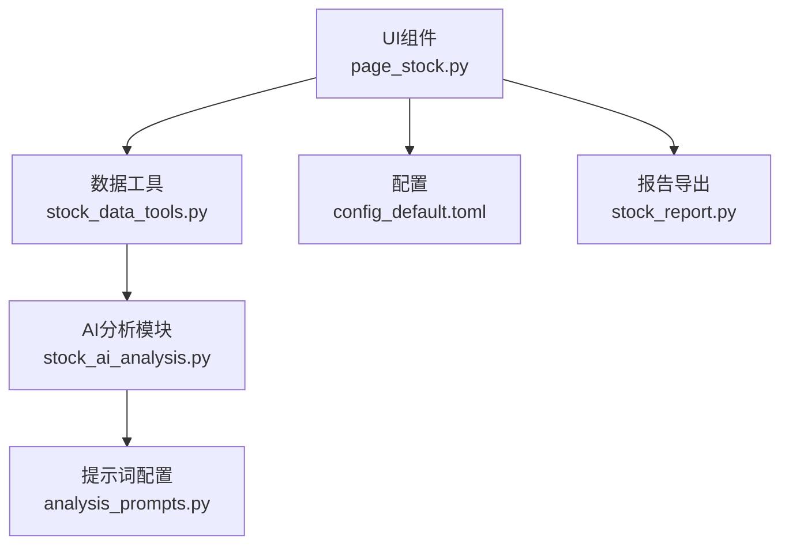
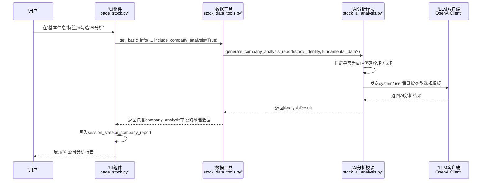
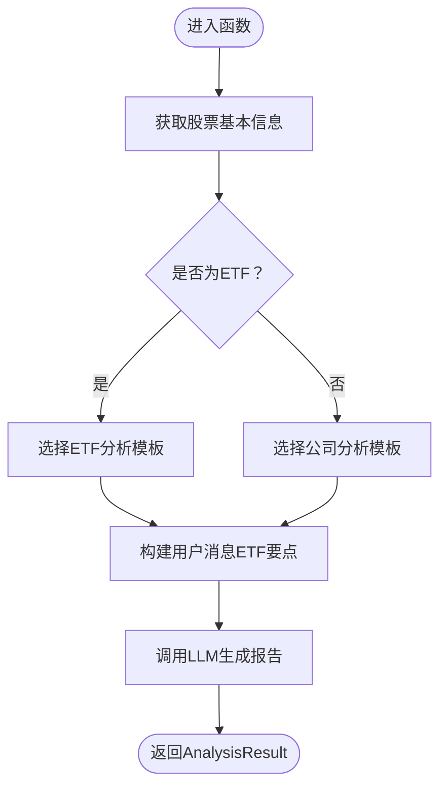
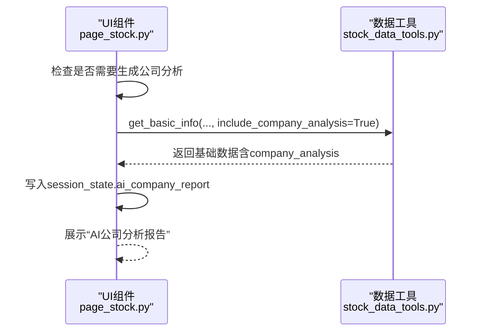
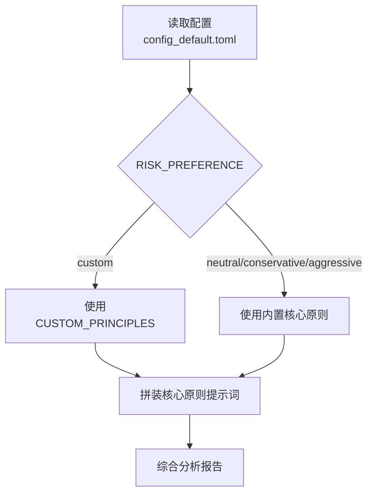
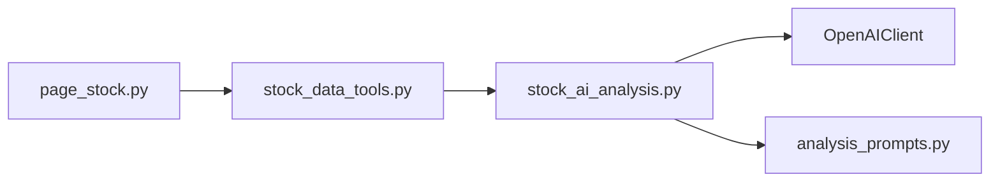

# 公司分析

<cite>
**本文引用的文件**
- [stock_ai_analysis.py](file://stock/stock_ai_analysis.py)
- [page_stock.py](file://ui/components/page_stock.py)
- [analysis_prompts.py](file://stock/analysis_prompts.py)
- [config_default.toml](file://config_default.toml)
- [stock_data_tools.py](file://stock/stock_data_tools.py)
- [stock_report.py](file://stock/stock_report.py)
</cite>

## 目录
1. [简介](#简介)
2. [项目结构](#项目结构)
3. [核心组件](#核心组件)
4. [架构总览](#架构总览)
5. [详细组件分析](#详细组件分析)
6. [依赖关系分析](#依赖关系分析)
7. [性能考量](#性能考量)
8. [故障排查指南](#故障排查指南)
9. [结论](#结论)
10. [附录](#附录)

## 简介
本节聚焦于xystock的“个股公司分析”能力，围绕stock_ai_analysis.py中的generate_company_analysis_report函数展开，说明其如何根据股票类型（普通公司或ETF）自动选择不同的分析模板，并在UI层通过page_stock.py的“基本信息”标签页展示分析结果。同时，文档解释该分析与“基本面分析”的区别：前者侧重商业模式与竞争力的定性分析，后者侧重财务数据的定量分析。最后提供用户自定义分析要点的配置方法。

## 项目结构
与“公司分析”直接相关的模块与文件如下：
- stock/stock_ai_analysis.py：提供AI分析生成器、数据收集器、报告格式化器，以及generate_company_analysis_report函数
- ui/components/page_stock.py：在“基本信息”标签页中展示公司分析结果，并负责触发AI分析
- stock/analysis_prompts.py：提供风险偏好对应的核心原则提示词，用于综合分析
- config_default.toml：提供AI分析与分析偏好的默认配置
- stock/stock_data_tools.py：封装获取基础数据与触发AI分析的入口
- stock/stock_report.py：导出报告时整合公司分析结果

**图表来源**
- [page_stock.py](file://ui/components/page_stock.py#L351-L883)
- [stock_data_tools.py](file://stock/stock_data_tools.py#L65-L120)
- [stock_ai_analysis.py](file://stock/stock_ai_analysis.py#L404-L496)
- [analysis_prompts.py](file://stock/analysis_prompts.py#L1-L54)
- [config_default.toml](file://config_default.toml#L24-L64)
- [stock_report.py](file://stock/stock_report.py#L151-L200)

**章节来源**
- [page_stock.py](file://ui/components/page_stock.py#L351-L883)
- [stock_ai_analysis.py](file://stock/stock_ai_analysis.py#L404-L496)
- [stock_data_tools.py](file://stock/stock_data_tools.py#L65-L120)
- [analysis_prompts.py](file://stock/analysis_prompts.py#L1-L54)
- [config_default.toml](file://config_default.toml#L24-L64)
- [stock_report.py](file://stock/stock_report.py#L151-L200)

## 核心组件
- generate_company_analysis_report：根据股票类型（普通公司/ETF）选择不同系统提示词模板，生成公司分析报告
- DataCollector/ReportFormatter/BaseAnalysisGenerator：负责数据收集、报告格式化与通用AI生成流程
- UI展示组件display_company_analysis：在“基本信息”标签页中触发并展示公司分析结果
- 风险偏好提示词：analysis_prompts.py提供中性/保守/激进三种风格的核心原则，支持自定义

**章节来源**
- [stock_ai_analysis.py](file://stock/stock_ai_analysis.py#L404-L496)
- [page_stock.py](file://ui/components/page_stock.py#L834-L883)
- [analysis_prompts.py](file://stock/analysis_prompts.py#L1-L54)

## 架构总览
下面的序列图展示了从UI触发到生成公司分析报告的端到端流程，包括股票类型判断与提示词选择。

**图表来源**
- [page_stock.py](file://ui/components/page_stock.py#L834-L883)
- [stock_data_tools.py](file://stock/stock_data_tools.py#L92-L120)
- [stock_ai_analysis.py](file://stock/stock_ai_analysis.py#L404-L496)

## 详细组件分析

### 1) generate_company_analysis_report：按类型选择模板
- 输入：stock_identity（含代码、名称、市场等），fundamental_data（可选）
- 判断逻辑：若市场名为“ETF”，或代码以特定前缀开头，或名称包含“ETF/基金”，则判定为ETF
- 模板差异：
  - ETF模板：聚焦“产品功能、投资价值、产品优势、市场地位、替代产品、费用收益、投资风险”等要点
  - 普通公司模板：聚焦“主营业务、市场需求、核心优势、产业地位、竞争格局、盈利模式、风险挑战”等要点
- 输出：AnalysisResult对象，包含报告文本、时间戳、分析类型等

**图表来源**
- [stock_ai_analysis.py](file://stock/stock_ai_analysis.py#L404-L496)

**章节来源**
- [stock_ai_analysis.py](file://stock/stock_ai_analysis.py#L404-L496)

### 2) UI在“基本信息”标签页展示公司分析
- 触发条件：勾选“AI分析”，且当前股票不在session_state.ai_company_report中
- 流程：
  - 调用stock_data_tools.get_basic_info(..., include_company_analysis=True)
  - 若返回包含company_analysis字段，写入session_state.ai_company_report
  - 在“基本信息”标签页下方显示“AI公司分析报告”折叠块
- 展示要点：报告正文与生成时间

**图表来源**
- [page_stock.py](file://ui/components/page_stock.py#L834-L883)
- [stock_data_tools.py](file://stock/stock_data_tools.py#L92-L120)

**章节来源**
- [page_stock.py](file://ui/components/page_stock.py#L834-L883)
- [stock_data_tools.py](file://stock/stock_data_tools.py#L92-L120)

### 3) 与“基本面分析”的区别
- 公司分析（本功能）：面向商业模式与竞争力的定性分析，强调“干啥、为啥、靠啥、处哪、谁敌、怎么赚、有啥险”等要点
- 基本面分析（另一功能）：面向财务数据的定量分析，强调财务健康、估值、增长与风险评估
- 在UI中，二者分别在“基本信息”标签页下展示，且可通过session_state.ai_fundamental_report与ai_company_report区分

**章节来源**
- [stock_ai_analysis.py](file://stock/stock_ai_analysis.py#L404-L496)
- [stock_ai_analysis.py](file://stock/stock_ai_analysis.py#L605-L714)
- [page_stock.py](file://ui/components/page_stock.py#L431-L470)

### 4) 自定义分析要点配置方法
- 风险偏好与核心原则：analysis_prompts.py提供中性/保守/激进三种风格的核心原则，支持自定义
- 配置项：
  - ANALYSIS.RISK_PREFERENCE：取值neutral/conservative/aggressive/custom
  - ANALYSIS.CUSTOM_PRINCIPLES：当RISK_PREFERENCE为custom时生效
- 影响范围：综合分析会读取这些配置生成核心原则提示词，从而影响综合判断风格

**图表来源**
- [analysis_prompts.py](file://stock/analysis_prompts.py#L1-L54)
- [config_default.toml](file://config_default.toml#L55-L64)

**章节来源**
- [analysis_prompts.py](file://stock/analysis_prompts.py#L1-L54)
- [config_default.toml](file://config_default.toml#L55-L64)

### 5) 导出报告时整合公司分析
- stock_report.py在生成Markdown报告时，会将AI公司分析结果插入到“AI公司分析”小节
- 便于用户一次性导出包含公司分析在内的完整报告

**章节来源**
- [stock_report.py](file://stock/stock_report.py#L151-L200)

## 依赖关系分析
- page_stock.py依赖stock_data_tools获取基础数据，并在必要时触发include_company_analysis
- stock_data_tools在include_company_analysis为True时，调用stock_ai_analysis.generate_company_analysis_report
- stock_ai_analysis依赖OpenAIClient进行LLM调用，并使用analysis_prompts中的核心原则（在综合分析中）

**图表来源**
- [page_stock.py](file://ui/components/page_stock.py#L834-L883)
- [stock_data_tools.py](file://stock/stock_data_tools.py#L92-L120)
- [stock_ai_analysis.py](file://stock/stock_ai_analysis.py#L404-L496)
- [analysis_prompts.py](file://stock/analysis_prompts.py#L1-L54)

**章节来源**
- [page_stock.py](file://ui/components/page_stock.py#L834-L883)
- [stock_data_tools.py](file://stock/stock_data_tools.py#L92-L120)
- [stock_ai_analysis.py](file://stock/stock_ai_analysis.py#L404-L496)
- [analysis_prompts.py](file://stock/analysis_prompts.py#L1-L54)

## 性能考量
- 缓存与复用：UI侧通过session_state缓存AI分析结果，避免重复调用LLM
- 数据裁剪：在综合分析中可选择truncate_data以减少上下文长度，提高响应速度
- 模型温度与类型：AI_ANALYSIS配置中可调节temperature与model_type，平衡准确性与稳定性

[本节为通用建议，无需特定文件引用]

## 故障排查指南
- AI公司分析失败：UI会显示错误信息并提示稍后再试或联系管理员
- 未勾选“AI分析”：UI不会触发生成，仅显示提示信息
- 配置缺失：若配置文件未设置或读取失败，将回退到默认配置

**章节来源**
- [page_stock.py](file://ui/components/page_stock.py#L834-L883)

## 结论
xystock的公司分析能力通过generate_company_analysis_report实现了“普通公司/ETF”的差异化模板，配合UI在“基本信息”标签页的展示，使用户能够快速获得针对商业模式与竞争力的定性洞察。与基本面分析相辅相成，二者共同构成全面的投资视角。通过analysis_prompts与config_default.toml，用户可灵活定制分析风格与核心原则，进一步提升分析的个性化与实用性。

## 附录
- 关键路径参考
  - 公司分析生成：[stock_ai_analysis.py](file://stock/stock_ai_analysis.py#L404-L496)
  - UI展示与触发：[page_stock.py](file://ui/components/page_stock.py#L834-L883)
  - 风险偏好与核心原则：[analysis_prompts.py](file://stock/analysis_prompts.py#L1-L54)
  - 默认配置项：[config_default.toml](file://config_default.toml#L24-L64)
  - 报告导出整合：[stock_report.py](file://stock/stock_report.py#L151-L200)