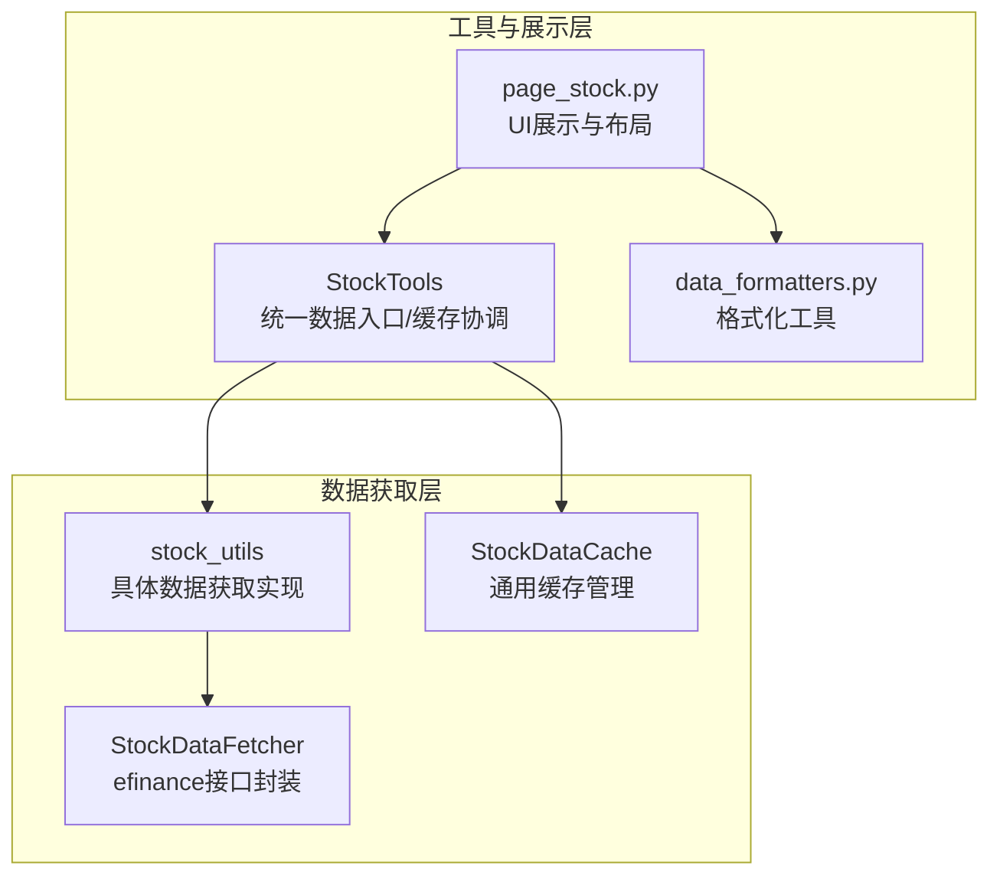
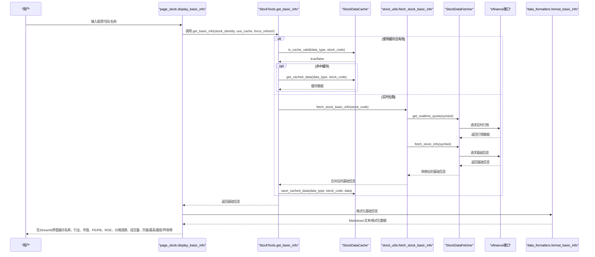
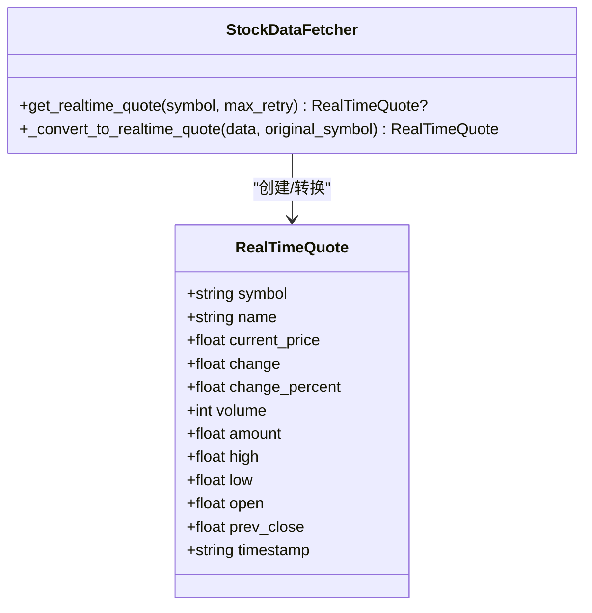
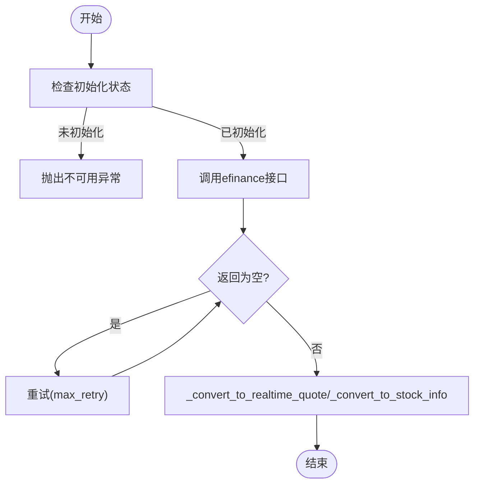
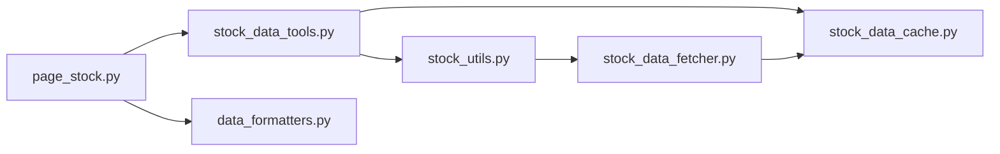

# 基本信息

<cite>
**本文引用的文件**
- [stock_data_fetcher.py](file://stock/stock_data_fetcher.py)
- [stock_data_tools.py](file://stock/stock_data_tools.py)
- [stock_utils.py](file://stock/stock_utils.py)
- [page_stock.py](file://ui/components/page_stock.py)
- [data_formatters.py](file://utils/data_formatters.py)
- [stock_data_cache.py](file://stock/stock_data_cache.py)
</cite>

## 目录
1. [简介](#简介)
2. [项目结构](#项目结构)
3. [核心组件](#核心组件)
4. [架构总览](#架构总览)
5. [详细组件分析](#详细组件分析)
6. [依赖关系分析](#依赖关系分析)
7. [性能考量](#性能考量)
8. [故障排查指南](#故障排查指南)
9. [结论](#结论)

## 简介
本章节聚焦于xystock中“个股基本信息”的获取与展示流程，围绕以下目标展开：
- 解释StockDataFetcher类如何通过efinance接口获取实时行情与基础信息，涵盖股票代码、名称、价格、成交量、市值、行业等关键字段。
- 说明RealTimeQuote数据结构的设计及其在数据流中的作用。
- 描述ui/components/page_stock.py中display_basic_info函数如何组织与呈现这些信息，包括使用Streamlit组件进行布局与格式化。
- 展示从用户输入股票代码到最终在Web界面显示信息的完整流程。
- 解释数据缓存机制如何减少对数据源的重复请求，并提供处理数据获取失败或数据缺失的调试策略。

## 项目结构
与“个股基本信息”直接相关的模块与职责如下：
- stock/stock_data_fetcher.py：封装efinance接口，负责实时行情与基础信息的抓取与转换。
- stock/stock_utils.py：提供具体数据获取实现，合并实时行情与基础信息，并补充更新时间等元数据。
- stock/stock_data_tools.py：统一数据入口，结合缓存管理器实现“按需拉取、按需缓存”的策略。
- ui/components/page_stock.py：前端展示层，负责调用工具层获取数据并在Streamlit界面上布局呈现。
- utils/data_formatters.py：提供格式化工具，用于将数据转换为适合UI展示的格式。
- stock/stock_data_cache.py：提供通用缓存管理，控制不同数据类型的缓存有效期与清理策略。

图表来源
- [stock_data_fetcher.py](file://stock/stock_data_fetcher.py#L1-L120)
- [stock_utils.py](file://stock/stock_utils.py#L152-L186)
- [stock_data_tools.py](file://stock/stock_data_tools.py#L41-L112)
- [page_stock.py](file://ui/components/page_stock.py#L351-L427)
- [data_formatters.py](file://utils/data_formatters.py#L198-L361)
- [stock_data_cache.py](file://stock/stock_data_cache.py#L1-L120)

章节来源
- [stock_data_fetcher.py](file://stock/stock_data_fetcher.py#L1-L120)
- [stock_utils.py](file://stock/stock_utils.py#L152-L186)
- [stock_data_tools.py](file://stock/stock_data_tools.py#L41-L112)
- [page_stock.py](file://ui/components/page_stock.py#L351-L427)
- [data_formatters.py](file://utils/data_formatters.py#L198-L361)
- [stock_data_cache.py](file://stock/stock_data_cache.py#L1-L120)

## 核心组件
- RealTimeQuote：标准化efinance返回的实时行情数据，包含股票代码、名称、当前价、涨跌额、涨跌幅、成交量、成交额、最高、最低、开盘、昨收、时间戳等字段。
- StockDataFetcher：封装efinance接口，提供实时行情获取、基础信息获取、K线数据获取与转换、错误处理与重试机制。
- stock_utils.fetch_stock_basic_info：整合实时行情与基础信息，补充更新时间等元数据，作为数据源。
- stock_data_tools.StockTools.get_basic_info：统一入口，结合缓存策略决定是否从缓存读取或实时拉取，并可选地附加AI分析。
- ui/components/page_stock.display_basic_info：Streamlit布局与格式化展示，组织股票名称、行业、市值、PE/PB、ROE、实时价格与涨跌、成交量、开盘/最高/最低/昨收等信息。
- utils/data_formatters.StockDataFormatter.format_basic_info：将基础信息转换为Markdown文本，便于导出或报告生成。

章节来源
- [stock_data_fetcher.py](file://stock/stock_data_fetcher.py#L13-L28)
- [stock_data_fetcher.py](file://stock/stock_data_fetcher.py#L97-L134)
- [stock_data_fetcher.py](file://stock/stock_data_fetcher.py#L225-L254)
- [stock_data_fetcher.py](file://stock/stock_data_fetcher.py#L374-L393)
- [stock_utils.py](file://stock/stock_utils.py#L152-L186)
- [stock_data_tools.py](file://stock/stock_data_tools.py#L41-L112)
- [page_stock.py](file://ui/components/page_stock.py#L351-L427)
- [data_formatters.py](file://utils/data_formatters.py#L198-L361)

## 架构总览
下面的序列图展示了从用户输入股票代码到Web界面显示“基本信息”的完整流程。

图表来源
- [page_stock.py](file://ui/components/page_stock.py#L351-L427)
- [stock_data_tools.py](file://stock/stock_data_tools.py#L41-L112)
- [stock_utils.py](file://stock/stock_utils.py#L152-L186)
- [stock_data_fetcher.py](file://stock/stock_data_fetcher.py#L97-L134)
- [stock_data_fetcher.py](file://stock/stock_data_fetcher.py#L225-L254)
- [data_formatters.py](file://utils/data_formatters.py#L198-L361)

## 详细组件分析

### RealTimeQuote数据结构设计
- 字段覆盖：股票代码、名称、当前价、涨跌额、涨跌幅、成交量、成交额、最高、最低、开盘、昨收、时间戳。
- 设计目的：统一efinance返回的异构数据格式，便于后续转换与展示。
- 转换逻辑：StockDataFetcher._convert_to_realtime_quote将efinance返回的字典映射到RealTimeQuote，包含类型转换与异常处理。

图表来源
- [stock_data_fetcher.py](file://stock/stock_data_fetcher.py#L13-L28)
- [stock_data_fetcher.py](file://stock/stock_data_fetcher.py#L374-L393)

章节来源
- [stock_data_fetcher.py](file://stock/stock_data_fetcher.py#L13-L28)
- [stock_data_fetcher.py](file://stock/stock_data_fetcher.py#L374-L393)

### StockDataFetcher：efinance接口封装
- 初始化与可用性：initialize()尝试导入efinance模块，失败时输出提示并标记不可用。
- 实时行情：get_realtime_quote()支持重试，兼容DataFrame/Series差异，最终转换为RealTimeQuote。
- 基础信息：fetch_stock_info()整合更多财务指标与股息分红信息，统一字段命名（中文），并进行空值与NaN处理。
- K线数据：get_kline_data()支持缓存与过滤（如去除当日未收盘数据），并返回KLineData列表。
- 错误处理：定义DataFetcherError、DataFetcherNotAvailableError、InvalidSymbolError等异常类型，保障调用方可感知错误类型。

图表来源
- [stock_data_fetcher.py](file://stock/stock_data_fetcher.py#L97-L134)
- [stock_data_fetcher.py](file://stock/stock_data_fetcher.py#L225-L254)
- [stock_data_fetcher.py](file://stock/stock_data_fetcher.py#L374-L393)

章节来源
- [stock_data_fetcher.py](file://stock/stock_data_fetcher.py#L81-L134)
- [stock_data_fetcher.py](file://stock/stock_data_fetcher.py#L225-L373)
- [stock_data_fetcher.py](file://stock/stock_data_fetcher.py#L374-L410)

### stock_utils：具体数据获取实现
- fetch_stock_basic_info()：若efinance未初始化则尝试初始化；拉取实时行情与基础信息，合并到basic_info字典；补充update_time；异常时写入error字段。
- 该函数是StockTools.get_basic_info()的底层实现，确保数据一致性与完整性。

章节来源
- [stock_utils.py](file://stock/stock_utils.py#L152-L186)

### stock_data_tools：统一入口与缓存协调
- get_basic_info()：根据use_cache与force_refresh决定是否命中缓存；命中则直接返回；否则调用fetch_stock_basic_info()拉取并缓存；可选附加AI分析与公司分析。
- 该方法承担“按需拉取、按需缓存”的职责，降低对efinance的重复请求。

章节来源
- [stock_data_tools.py](file://stock/stock_data_tools.py#L41-L112)

### ui/components/page_stock：展示层与布局
- display_basic_info()：接收stock_identity，调用stock_tools.get_basic_info()获取基础信息；使用Streamlit的st.metric、st.write、st.info等组件进行布局与格式化；包含ETF持仓、更多财务指标、股息分红详情等扩展区块；最后显示数据更新时间。
- 该函数是“基本信息”Tab的核心渲染逻辑，负责将数据以用户友好的方式呈现。

章节来源
- [page_stock.py](file://ui/components/page_stock.py#L351-L427)
- [page_stock.py](file://ui/components/page_stock.py#L107-L188)
- [page_stock.py](file://ui/components/page_stock.py#L273-L350)

### utils/data_formatters：格式化工具
- StockDataFormatter.format_basic_info()：将基础信息转换为Markdown文本，包含盈利能力、偿债能力、营运能力、成长能力、估值指标、每股指标、股息分红信息等分组；支持include_dividend开关控制是否包含分红详情。
- 该工具用于报告生成与导出场景，保证展示的一致性与可读性。

章节来源
- [data_formatters.py](file://utils/data_formatters.py#L198-L361)

## 依赖关系分析
- page_stock.py依赖stock_data_tools.get_stock_tools()与utils.data_formatters.get_stock_formatter()。
- stock_data_tools.py依赖stock_utils与stock_data_fetcher，以及stock_data_cache。
- stock_utils.py依赖stock_data_fetcher.data_manager。
- stock_data_fetcher.py依赖utils.kline_cache与外部efinance库。
- stock_data_cache.py提供通用缓存策略，支持不同数据类型的过期时间配置。

图表来源
- [page_stock.py](file://ui/components/page_stock.py#L1-L40)
- [stock_data_tools.py](file://stock/stock_data_tools.py#L1-L40)
- [stock_utils.py](file://stock/stock_utils.py#L1-L20)
- [stock_data_fetcher.py](file://stock/stock_data_fetcher.py#L1-L20)
- [stock_data_cache.py](file://stock/stock_data_cache.py#L1-L40)

章节来源
- [page_stock.py](file://ui/components/page_stock.py#L1-L40)
- [stock_data_tools.py](file://stock/stock_data_tools.py#L1-L40)
- [stock_utils.py](file://stock/stock_utils.py#L1-L20)
- [stock_data_fetcher.py](file://stock/stock_data_fetcher.py#L1-L20)
- [stock_data_cache.py](file://stock/stock_data_cache.py#L1-L40)

## 性能考量
- 缓存策略：StockTools.get_basic_info()在use_cache为true且未force_refresh时优先使用缓存，命中后避免对efinance的请求，显著降低延迟与外部依赖压力。
- 缓存有效期：stock_data_cache.py针对不同数据类型设置了不同的过期时间（如基本信息5分钟、技术指标30分钟、新闻60分钟、筹码1440分钟等），平衡了新鲜度与性能。
- K线数据过滤：StockDataFetcher.get_kline_data()在未收盘时段会移除当日数据，避免盘中数据污染，同时减少不必要的缓存写入。
- 重试与降级：StockDataFetcher.get_realtime_quote()具备重试机制，若拉取失败且存在缓存则返回缓存数据，提升鲁棒性。

章节来源
- [stock_data_tools.py](file://stock/stock_data_tools.py#L41-L112)
- [stock_data_cache.py](file://stock/stock_data_cache.py#L1-L60)
- [stock_data_fetcher.py](file://stock/stock_data_fetcher.py#L135-L224)

## 故障排查指南
- 数据源不可用
  - 现象：调用StockDataFetcher.get_realtime_quote()抛出“未初始化”异常。
  - 处理：确认efinance库已安装并可导入；检查initialize()返回值；必要时在启动阶段显式调用initialize()。
  - 参考路径
    - [stock_data_fetcher.py](file://stock/stock_data_fetcher.py#L81-L95)
    - [stock_data_fetcher.py](file://stock/stock_data_fetcher.py#L97-L101)

- 实时行情为空或拉取失败
  - 现象：get_realtime_quote()返回None或触发重试后仍失败。
  - 处理：检查symbol格式、网络连通性；观察重试日志；若存在缓存则可回退使用缓存数据。
  - 参考路径
    - [stock_data_fetcher.py](file://stock/stock_data_fetcher.py#L97-L134)

- 基础信息字段缺失或为空
  - 现象：页面显示“未能获取到实时数据”或部分字段为空。
  - 处理：确认stock_utils.fetch_stock_basic_info()返回的字典包含所需字段；检查efinance接口返回；在UI层做好空值保护。
  - 参考路径
    - [stock_utils.py](file://stock/stock_utils.py#L152-L186)
    - [page_stock.py](file://ui/components/page_stock.py#L418-L420)

- 缓存未命中或过期
  - 现象：每次刷新都重新拉取数据，响应慢。
  - 处理：启用use_cache；检查缓存文件是否存在；使用get_cache_status()查看缓存状态；必要时清理特定类型或股票的缓存。
  - 参考路径
    - [stock_data_tools.py](file://stock/stock_data_tools.py#L41-L112)
    - [stock_data_cache.py](file://stock/stock_data_cache.py#L234-L275)

- 页面渲染异常
  - 现象：display_basic_info()抛出异常导致页面崩溃。
  - 处理：在UI层捕获异常并显示友好提示；检查传入的stock_identity结构；确保formatter与tools实例可用。
  - 参考路径
    - [page_stock.py](file://ui/components/page_stock.py#L427-L429)

## 结论
xystock在“个股基本信息”方面形成了清晰的分层架构：数据获取层（StockDataFetcher）、工具协调层（StockTools）、展示层（page_stock）与格式化层（data_formatters）。通过统一的缓存策略与健壮的错误处理，系统在保证数据新鲜度的同时，显著降低了对外部数据源的依赖与请求频次。RealTimeQuote与StockDataFetcher的标准化设计使得数据转换与展示更加可靠，而UI层的Streamlit组件化布局则提升了用户体验。建议在生产环境中：
- 默认开启use_cache并合理设置过期时间；
- 对关键字段增加空值保护与类型校验；
- 定期检查缓存文件大小与清理策略；
- 在网络不稳定环境下充分利用缓存回退逻辑。