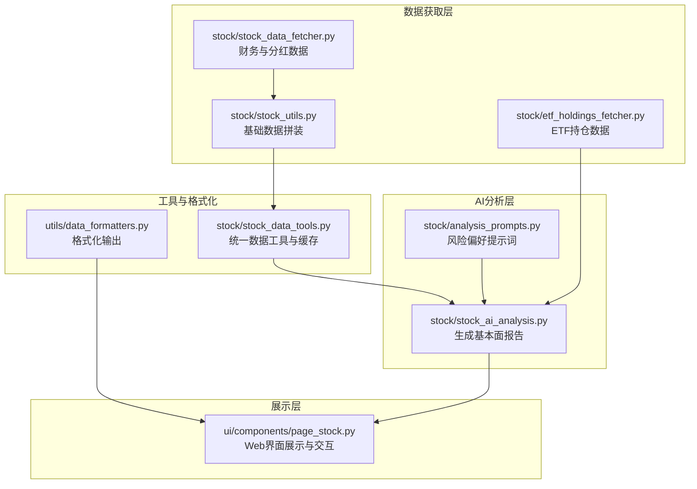
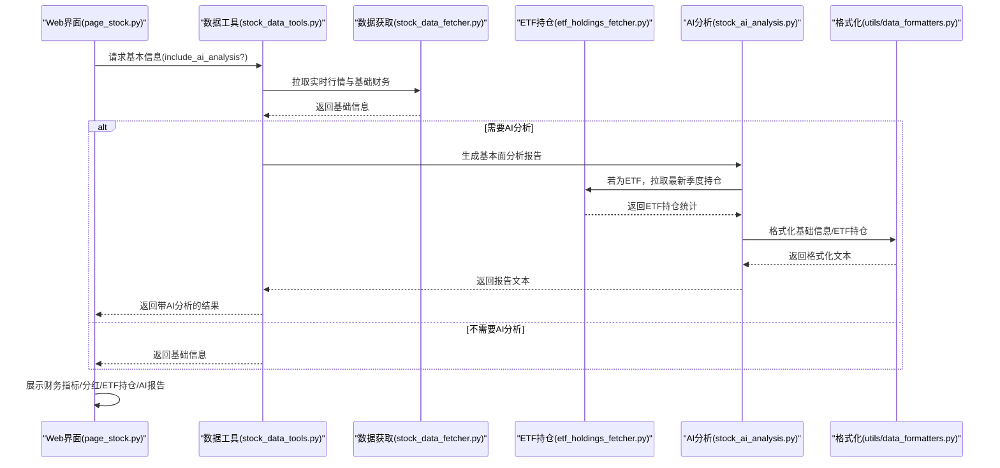
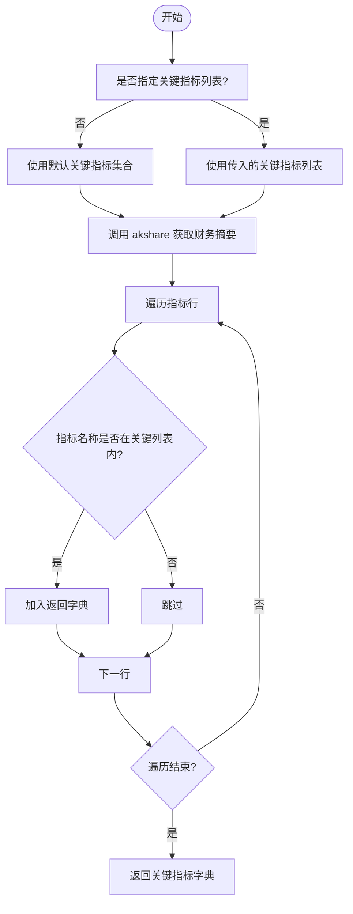
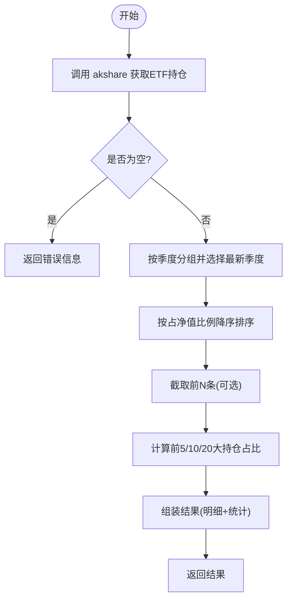
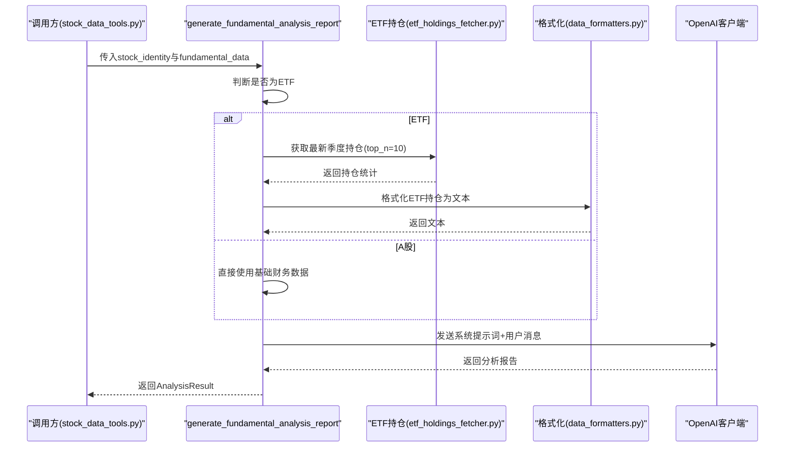
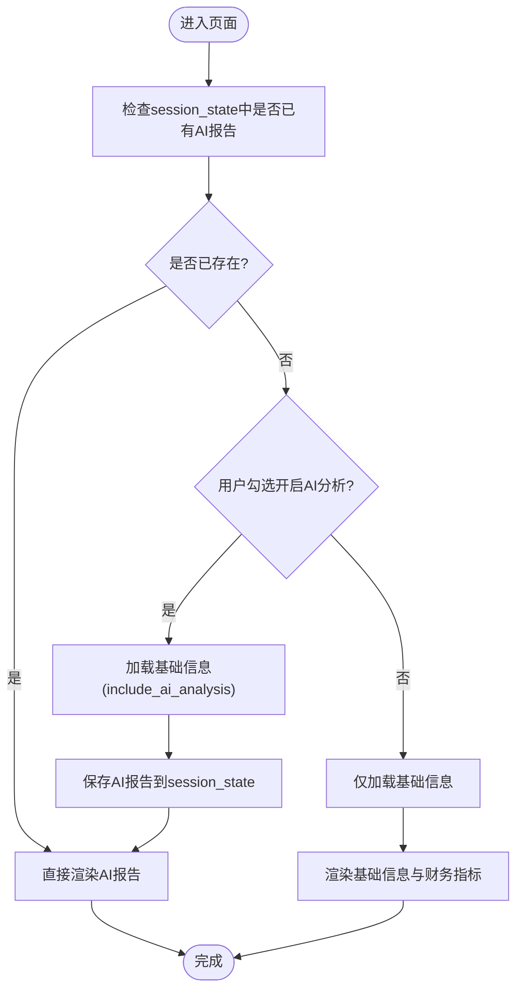
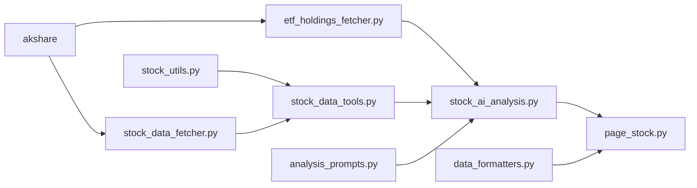

# 基本面分析

<cite>
**本文引用的文件**
- [stock_data_fetcher.py](file://stock/stock_data_fetcher.py)
- [stock_ai_analysis.py](file://stock/stock_ai_analysis.py)
- [page_stock.py](file://ui/components/page_stock.py)
- [analysis_prompts.py](file://stock/analysis_prompts.py)
- [stock_data_tools.py](file://stock/stock_data_tools.py)
- [etf_holdings_fetcher.py](file://stock/etf_holdings_fetcher.py)
- [data_formatters.py](file://utils/data_formatters.py)
- [stock_utils.py](file://stock/stock_utils.py)
</cite>

## 目录
1. [简介](#简介)
2. [项目结构](#项目结构)
3. [核心组件](#核心组件)
4. [架构总览](#架构总览)
5. [详细组件分析](#详细组件分析)
6. [依赖关系分析](#依赖关系分析)
7. [性能考量](#性能考量)
8. [故障排查指南](#故障排查指南)
9. [结论](#结论)

## 简介
本章节系统性阐述 xystock 在个股基本面分析方面的实现，覆盖从 akshare 等数据源拉取盈利能力、偿债能力、营运能力、成长能力与股息分红等财务指标，到基于大语言模型生成结构化分析报告，再到 Web 界面展示与交互的完整流程。文档还特别说明 A 股与 ETF 在基本面分析上的差异处理，以及在数据获取失败或 AI 分析异常时的应对策略。

## 项目结构
围绕“基本面分析”的关键模块与文件组织如下：
- 数据获取层：stock/stock_data_fetcher.py（基于 akshare 的财务与分红数据）、stock/stock_utils.py（基础数据拼装）、stock/etf_holdings_fetcher.py（ETF 持仓数据）
- AI 分析层：stock/stock_ai_analysis.py（生成基本面分析报告）、stock/analysis_prompts.py（风险偏好提示词）
- 展示层：ui/components/page_stock.py（Web 页面展示与交互）
- 工具与格式化：utils/data_formatters.py（数据格式化）、stock/stock_data_tools.py（统一数据工具与缓存）

图表来源
- [stock_data_fetcher.py](file://stock/stock_data_fetcher.py#L255-L372)
- [stock_ai_analysis.py](file://stock/stock_ai_analysis.py#L605-L714)
- [page_stock.py](file://ui/components/page_stock.py#L431-L470)
- [analysis_prompts.py](file://stock/analysis_prompts.py#L1-L54)
- [stock_data_tools.py](file://stock/stock_data_tools.py#L41-L112)
- [etf_holdings_fetcher.py](file://stock/etf_holdings_fetcher.py#L1-L118)
- [data_formatters.py](file://utils/data_formatters.py#L495-L547)

章节来源
- [stock_data_fetcher.py](file://stock/stock_data_fetcher.py#L255-L372)
- [stock_ai_analysis.py](file://stock/stock_ai_analysis.py#L605-L714)
- [page_stock.py](file://ui/components/page_stock.py#L431-L470)
- [analysis_prompts.py](file://stock/analysis_prompts.py#L1-L54)
- [stock_data_tools.py](file://stock/stock_data_tools.py#L41-L112)
- [etf_holdings_fetcher.py](file://stock/etf_holdings_fetcher.py#L1-L118)
- [data_formatters.py](file://utils/data_formatters.py#L495-L547)

## 核心组件
- 财务与分红数据获取器：负责从 akshare 拉取财务摘要与分红数据，筛选关键指标并清洗格式，便于后续分析。
- ETF 持仓数据获取器：按最新季度聚合持仓，计算集中度等统计指标，为 ETF 基本面分析提供结构化输入。
- AI 基本面分析器：根据股票或 ETF 的基本信息与（可选）ETF 持仓，生成结构化报告，区分 A 股与 ETF 的分析模板。
- Web 展示组件：在 Streamlit 页面中展示财务指标、分红详情、ETF 持仓与 AI 报告，并处理“开启/关闭 AI 分析”的交互。
- 统一数据工具：封装缓存、AI 分析调用与数据拼装，确保前后端一致的数据流与可复用性。

章节来源
- [stock_data_fetcher.py](file://stock/stock_data_fetcher.py#L255-L372)
- [etf_holdings_fetcher.py](file://stock/etf_holdings_fetcher.py#L1-L118)
- [stock_ai_analysis.py](file://stock/stock_ai_analysis.py#L605-L714)
- [page_stock.py](file://ui/components/page_stock.py#L431-L470)
- [stock_data_tools.py](file://stock/stock_data_tools.py#L41-L112)

## 架构总览
从数据拉取到 AI 报告生成再到 UI 展示的端到端流程如下：

图表来源
- [page_stock.py](file://ui/components/page_stock.py#L431-L470)
- [stock_data_tools.py](file://stock/stock_data_tools.py#L41-L112)
- [stock_data_fetcher.py](file://stock/stock_data_fetcher.py#L255-L372)
- [etf_holdings_fetcher.py](file://stock/etf_holdings_fetcher.py#L1-L118)
- [stock_ai_analysis.py](file://stock/stock_ai_analysis.py#L605-L714)
- [data_formatters.py](file://utils/data_formatters.py#L495-L547)

## 详细组件分析

### 财务与分红数据拉取：get_more_stock_info 与 get_dividend_info
- get_more_stock_info：从 akshare 拉取财务摘要，筛选盈利能力、偿债能力、营运能力、成长能力与每股指标等关键字段，清洗为统一中文字段名，便于后续格式化与分析。
- get_dividend_info：从 akshare 拉取历史分红，按公告日期排序，提取最新一次分红的公告日期、类型、送转派息比例、登记日、除权日、派息日与说明；并统计近年平均派息比例、分红次数与最近若干条记录，用于 UI 展示与 AI 输入。

图表来源
- [stock_data_fetcher.py](file://stock/stock_data_fetcher.py#L255-L296)

章节来源
- [stock_data_fetcher.py](file://stock/stock_data_fetcher.py#L255-L372)

### ETF 持仓数据拉取与集中度分析
- get_etf_holdings：按最新季度筛选持仓，按占净值比例排序，计算前5/10/20大持仓占比与集中度等级，返回统计摘要与明细。
- 该数据用于 ETF 基本面分析报告的“持仓结构分析”部分，帮助评估分散度与权重股风险。

图表来源
- [etf_holdings_fetcher.py](file://stock/etf_holdings_fetcher.py#L1-L118)

章节来源
- [etf_holdings_fetcher.py](file://stock/etf_holdings_fetcher.py#L1-L118)

### AI 基本面分析报告生成：generate_fundamental_analysis_report
- 输入：股票身份信息与已格式化的基本面数据；若为 ETF，额外注入 ETF 持仓摘要。
- 逻辑：
  - 判断是否为 ETF（依据市场类型或代码/名称特征），分别使用不同的系统提示词模板。
  - 对 ETF：附加“ETF产品概况、持仓结构分析、投资价值评估、市场表现与风险”四段式结构。
  - 对 A 股：附加“基本面概况、财务指标分析、估值与增长分析、优势与风险分析”四段式结构。
  - 调用统一的 BaseAnalysisGenerator 生成报告，返回 AnalysisResult（包含成功标志、报告文本、时间戳、可选错误信息）。
- 输出：结构化中文报告，严格基于真实数据，不包含主观臆测或投资建议。

图表来源
- [stock_ai_analysis.py](file://stock/stock_ai_analysis.py#L605-L714)
- [etf_holdings_fetcher.py](file://stock/etf_holdings_fetcher.py#L1-L118)
- [data_formatters.py](file://utils/data_formatters.py#L495-L547)

章节来源
- [stock_ai_analysis.py](file://stock/stock_ai_analysis.py#L605-L714)

### Web 界面展示与交互：display_fundamental_analysis
- 交互逻辑：
  - 通过 session_state 控制“是否包含 AI 分析”，并在首次触发时拉取基础信息并附带 include_ai_analysis 标志。
  - 若 AI 分析成功，将报告写入 session_state.ai_fundamental_report，下次渲染直接展示；若失败，提示错误并引导重试。
- 展示内容：
  - 基本信息区：当前价、涨跌、成交量、市值、市盈/市净、ROE 等。
  - 更多财务指标：按“盈利能力、偿债能力、营运能力、成长能力、估值指标、每股指标”分段展示。
  - 股息分红详情：最新公告日期、类型、送转派息比例、近年平均派息比例、近年分红次数与最近若干条记录。
  - ETF 持仓信息：最新季度、集中度水平、前10大持仓占比、主要持仓列表与更新时间。
  - AI 基本面分析报告：展开显示，附带生成时间。

图表来源
- [page_stock.py](file://ui/components/page_stock.py#L431-L470)

章节来源
- [page_stock.py](file://ui/components/page_stock.py#L431-L470)

### 统一数据工具与缓存：StockTools
- get_basic_info：统一拉取实时行情与基础财务，支持 include_ai_analysis 与 include_company_analysis，自动缓存与回退。
- generate_fundamental_analysis_with_cache：封装 AI 基本面分析的调用与缓存，避免重复请求；支持动态过期时间与用户观点变更检测。
- get_stock_kline_data/get_stock_news_data/get_stock_chip_data：统一 K 线、新闻、筹码数据的拉取与缓存，支持 include_ai_analysis 生成对应分析报告。

章节来源
- [stock_data_tools.py](file://stock/stock_data_tools.py#L41-L112)
- [stock_data_tools.py](file://stock/stock_data_tools.py#L317-L355)

### 风险偏好与提示词
- analysis_prompts.py 提供中性/保守/激进三种风险偏好的核心原则提示词，用于综合分析报告的系统提示词注入，确保分析风格与用户偏好一致。

章节来源
- [analysis_prompts.py](file://stock/analysis_prompts.py#L1-L54)

## 依赖关系分析
- 数据获取依赖 akshare：财务摘要与分红、ETF 持仓、筹码数据均通过 akshare 接口获取。
- AI 分析依赖 OpenAI 客户端：通过统一的 BaseAnalysisGenerator 调用，支持温度与模型类型配置。
- UI 依赖 Streamlit：通过 session_state 管理交互状态与缓存展示。
- 格式化依赖 data_formatters：将基础信息与 ETF 持仓转换为 Markdown 文本，便于 AI 与 UI 使用。

图表来源
- [stock_data_fetcher.py](file://stock/stock_data_fetcher.py#L255-L372)
- [etf_holdings_fetcher.py](file://stock/etf_holdings_fetcher.py#L1-L118)
- [stock_data_tools.py](file://stock/stock_data_tools.py#L41-L112)
- [stock_ai_analysis.py](file://stock/stock_ai_analysis.py#L605-L714)
- [page_stock.py](file://ui/components/page_stock.py#L431-L470)
- [data_formatters.py](file://utils/data_formatters.py#L495-L547)
- [analysis_prompts.py](file://stock/analysis_prompts.py#L1-L54)

## 性能考量
- 缓存策略：StockTools 对基础信息、技术指标、新闻、筹码等数据进行缓存，减少重复拉取；AI 分析结果同样缓存，支持动态过期与用户观点变更检测。
- 数据裁剪：K 线数据仅保留最近 N 条，避免冗余；分钟线与未收盘日线剔除当日数据，保证稳定性。
- 异步与重试：数据获取器对 akshare 接口进行重试与空值回退，优先返回缓存数据，提升鲁棒性。
- UI 加载优化：通过 session_state 缓存 AI 报告，避免重复生成；仅在用户勾选“开启 AI 分析”时触发。

章节来源
- [stock_data_tools.py](file://stock/stock_data_tools.py#L114-L189)
- [stock_data_tools.py](file://stock/stock_data_tools.py#L317-L355)
- [stock_data_fetcher.py](file://stock/stock_data_fetcher.py#L135-L224)

## 故障排查指南
- 财务数据获取失败：
  - 现象：get_more_stock_info 返回空或报错。
  - 排查：确认 akshare 可用、网络连通；检查返回数据是否为空；查看日志输出。
  - 处理：回退到缓存数据；若无缓存，提示用户稍后重试。
- 分红数据获取失败：
  - 现象：get_dividend_info 返回错误或“暂无分红记录”。
  - 排查：确认股票存在分红历史；检查 akshare 返回字段映射；查看年份筛选逻辑。
  - 处理：记录错误信息并提示用户；UI 展示“暂无分红记录”或“数据更新时间”。
- ETF 持仓获取失败：
  - 现象：etf_holdings_fetcher 返回 error 或空。
  - 排查：确认 ETF 代码正确；akshare 是否支持该 ETF；最新季度是否存在。
  - 处理：UI 提示“可能原因：该产品不是ETF基金，或暂无持仓数据”。
- AI 分析响应异常：
  - 现象：AI 报告生成失败，返回错误信息。
  - 排查：检查 OpenAI 客户端配置与网络；查看 AnalysisResult.error_message。
  - 处理：UI 展示错误并提示稍后再试；必要时清除缓存后重试。
- UI 展示异常：
  - 现象：页面加载失败或报告不显示。
  - 排查：检查 session_state.ai_fundamental_report 是否存在；确认 include_ai_analysis 勾选状态。
  - 处理：重试加载；检查缓存状态与数据工具返回值。

章节来源
- [stock_data_fetcher.py](file://stock/stock_data_fetcher.py#L298-L372)
- [etf_holdings_fetcher.py](file://stock/etf_holdings_fetcher.py#L1-L118)
- [stock_ai_analysis.py](file://stock/stock_ai_analysis.py#L303-L346)
- [page_stock.py](file://ui/components/page_stock.py#L431-L470)

## 结论
xystock 的基本面分析能力通过“数据获取层 + AI 分析层 + 展示层 + 工具与格式化”的清晰分层实现，既能稳定地从 akshare 等数据源拉取关键财务与分红指标，又能针对 A 股与 ETF 的差异设计不同的分析模板，最终以结构化报告形式在 Web 界面直观呈现。配合缓存与重试机制，系统在性能与可靠性方面均有保障；同时提供完善的错误处理与用户提示，便于快速定位与修复问题。