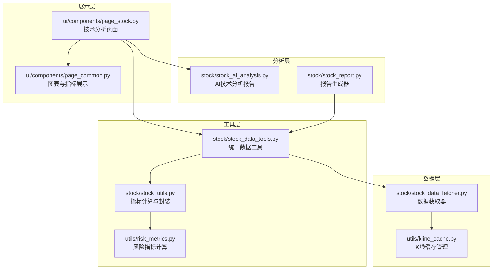
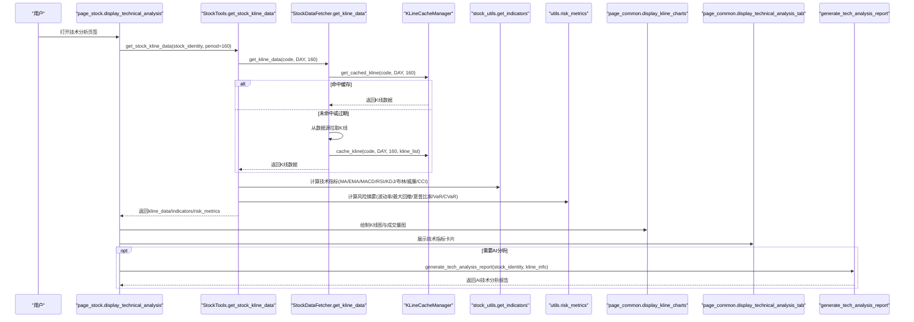
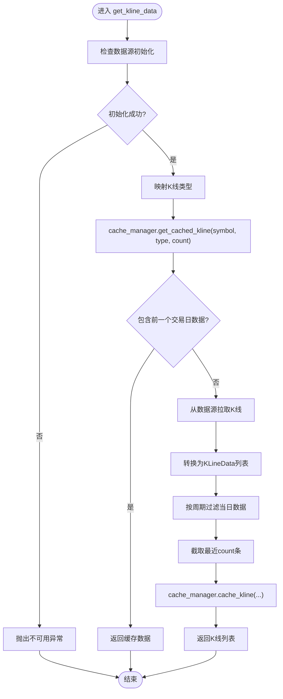
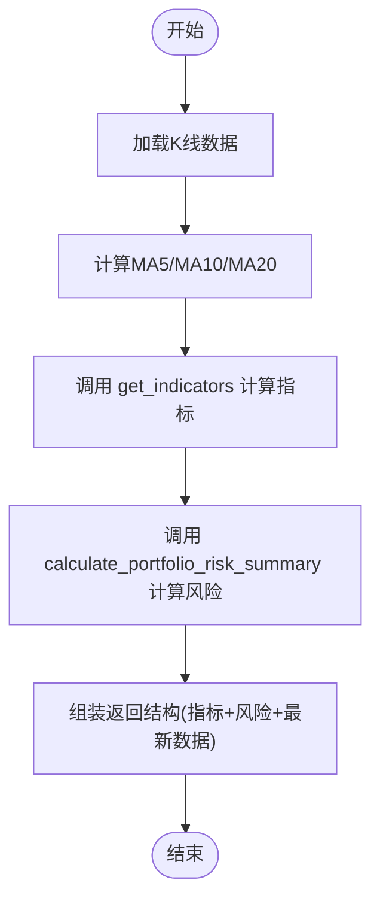
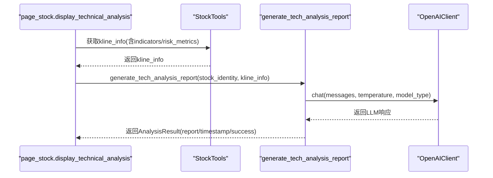
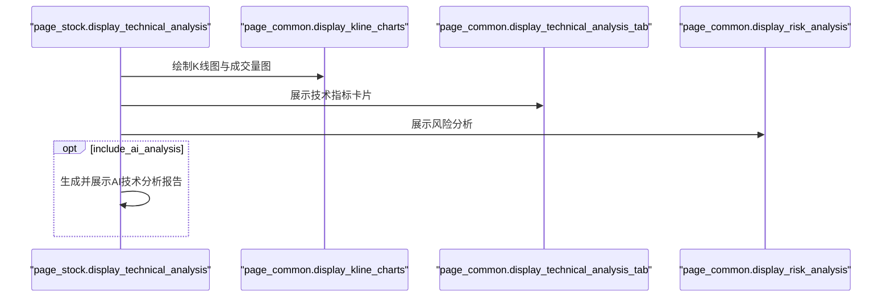
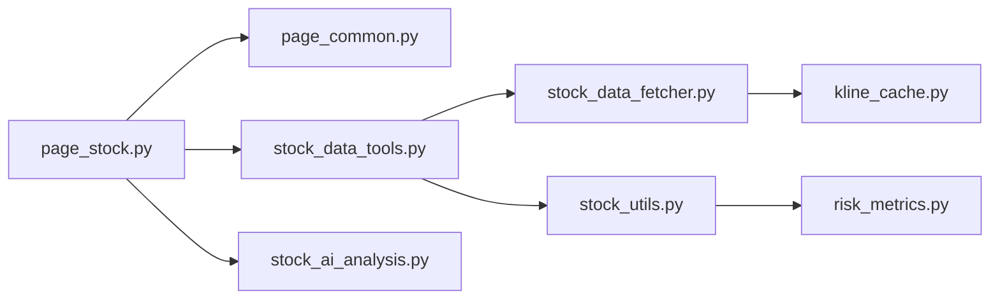

# 技术分析

<cite>
**本文引用的文件**
- [stock/stock_data_fetcher.py](file://stock/stock_data_fetcher.py)
- [utils/kline_cache.py](file://utils/kline_cache.py)
- [stock/stock_data_tools.py](file://stock/stock_data_tools.py)
- [stock/stock_utils.py](file://stock/stock_utils.py)
- [stock/stock_ai_analysis.py](file://stock/stock_ai_analysis.py)
- [ui/components/page_stock.py](file://ui/components/page_stock.py)
- [ui/components/page_common.py](file://ui/components/page_common.py)
- [utils/risk_metrics.py](file://utils/risk_metrics.py)
- [stock/stock_report.py](file://stock/stock_report.py)
</cite>

## 目录
1. [引言](#引言)
2. [项目结构](#项目结构)
3. [核心组件](#核心组件)
4. [架构总览](#架构总览)
5. [详细组件分析](#详细组件分析)
6. [依赖关系分析](#依赖关系分析)
7. [性能考量](#性能考量)
8. [故障排查指南](#故障排查指南)
9. [结论](#结论)
10. [附录](#附录)

## 引言
本文件围绕 xystock 的个股技术分析能力展开，系统梳理从 K 线数据获取、技术指标计算、AI 综合解读到图表与报告展示的完整流程。重点覆盖：
- stock_data_fetcher.py 中 get_kline_data 方法如何按日线、周线等周期获取 K 线数据，并通过 KLineData 结构封装与缓存；
- stock_ai_analysis.py 中 generate_tech_analysis_report 如何结合 LLM 对 K 线、移动平均线、MACD、RSI 等指标进行综合解读；
- ui/components/page_stock.py 中 display_technical_analysis 如何调用 page_common 模块绘制 K 线图、成交量图与技术指标图，并集成 AI 分析报告；
- 通过 utils/risk_metrics.py 的风险指标计算，为技术分析提供量化支撑；
- 数据缓存策略如何优化性能，以及在技术指标计算错误或图表渲染失败时的调试方法。

## 项目结构
xystock 的技术分析链路横跨“数据层”“工具层”“UI 展示层”“LLM 分析层”，并通过统一的缓存与格式化工具串联。

图表来源
- [stock/stock_data_fetcher.py](file://stock/stock_data_fetcher.py#L135-L224)
- [utils/kline_cache.py](file://utils/kline_cache.py#L138-L233)
- [stock/stock_data_tools.py](file://stock/stock_data_tools.py#L132-L189)
- [stock/stock_utils.py](file://stock/stock_utils.py#L188-L240)
- [utils/risk_metrics.py](file://utils/risk_metrics.py#L1-L126)
- [ui/components/page_stock.py](file://ui/components/page_stock.py#L493-L551)
- [ui/components/page_common.py](file://ui/components/page_common.py#L107-L164)
- [stock/stock_ai_analysis.py](file://stock/stock_ai_analysis.py#L352-L402)
- [stock/stock_report.py](file://stock/stock_report.py#L16-L122)

章节来源
- [stock/stock_data_fetcher.py](file://stock/stock_data_fetcher.py#L135-L224)
- [utils/kline_cache.py](file://utils/kline_cache.py#L138-L233)
- [stock/stock_data_tools.py](file://stock/stock_data_tools.py#L132-L189)
- [stock/stock_utils.py](file://stock/stock_utils.py#L188-L240)
- [utils/risk_metrics.py](file://utils/risk_metrics.py#L1-L126)
- [ui/components/page_stock.py](file://ui/components/page_stock.py#L493-L551)
- [ui/components/page_common.py](file://ui/components/page_common.py#L107-L164)
- [stock/stock_ai_analysis.py](file://stock/stock_ai_analysis.py#L352-L402)
- [stock/stock_report.py](file://stock/stock_report.py#L16-L122)

## 核心组件
- 数据获取器与缓存
  - StockDataFetcher.get_kline_data：按 KLineType 获取日/周/月等周期 K 线，封装为 KLineData 列表，结合缓存策略与“当日数据剔除/保留”逻辑，确保日K线的收盘有效性。
  - KLineCacheManager：基于 CSV 的 K 线缓存，按周期类型设定新鲜度阈值，支持全量替换与增量更新，提供统计与清理能力。
- 技术指标与风险计算
  - stock_utils.get_indicators：基于 stockstats 计算 MA、EMA、MACD、KDJ、RSI、布林带、威廉指标、CCI 等指标，并给出 MA 趋势与 MACD 趋势判断。
  - fetch_stock_technical_indicators：组合 K 线与指标计算，同时调用 calculate_portfolio_risk_summary 生成风险摘要。
  - utils/risk_metrics：提供波动率、最大回撤、夏普比率、VaR/CVaR 等风险指标计算与汇总。
- AI 技术分析
  - generate_tech_analysis_report：构造系统提示词与用户消息，调用 LLM 生成技术面报告，强调移动平均线、MACD、RSI、布林带等关键指标解读。
- UI 展示
  - page_stock.display_technical_analysis：调用 get_stock_kline_data 获取 K 线与指标，调用 page_common 绘制 K 线图、成交量图与技术指标卡片，并展示风险分析。
  - page_common.display_kline_charts/display_technical_analysis_tab：统一的 K 线与技术指标展示组件。
- 报告生成
  - stock_report.generate_stock_report：整合基本信息、行情走势、新闻、筹码与 AI 分析，生成 PDF/DOCX/HTML/Markdown 报告。

章节来源
- [stock/stock_data_fetcher.py](file://stock/stock_data_fetcher.py#L135-L224)
- [utils/kline_cache.py](file://utils/kline_cache.py#L138-L233)
- [stock/stock_utils.py](file://stock/stock_utils.py#L105-L150)
- [stock/stock_utils.py](file://stock/stock_utils.py#L188-L240)
- [utils/risk_metrics.py](file://utils/risk_metrics.py#L1-L126)
- [stock/stock_ai_analysis.py](file://stock/stock_ai_analysis.py#L352-L402)
- [ui/components/page_stock.py](file://ui/components/page_stock.py#L493-L551)
- [ui/components/page_common.py](file://ui/components/page_common.py#L107-L164)
- [stock/stock_report.py](file://stock/stock_report.py#L16-L122)

## 架构总览
下面以序列图展示从 K 线数据获取到技术分析报告生成与图表展示的端到端流程。

图表来源
- [ui/components/page_stock.py](file://ui/components/page_stock.py#L493-L551)
- [stock/stock_data_tools.py](file://stock/stock_data_tools.py#L132-L189)
- [stock/stock_data_fetcher.py](file://stock/stock_data_fetcher.py#L135-L224)
- [utils/kline_cache.py](file://utils/kline_cache.py#L138-L233)
- [stock/stock_utils.py](file://stock/stock_utils.py#L105-L150)
- [utils/risk_metrics.py](file://utils/risk_metrics.py#L1-L126)
- [ui/components/page_common.py](file://ui/components/page_common.py#L107-L164)
- [stock/stock_ai_analysis.py](file://stock/stock_ai_analysis.py#L352-L402)

## 详细组件分析

### 组件A：K 线数据获取与缓存（stock_data_fetcher + kline_cache）
- get_kline_data 的关键流程
  - 参数校验与周期映射：将 KLineType 映射到数据源周期参数，支持日线、周线、月线等。
  - 缓存命中与新鲜度：优先从 KLineCacheManager.get_cached_kline 读取，若包含前一个交易日数据则直接返回；否则触发拉取。
  - 日K线特殊处理：根据当前时间与 16:30 收盘阈值决定是否保留当日数据，避免盘中价格污染。
  - 分钟线处理：为避免实时波动，分钟线会剔除当日数据。
  - 数据转换与封装：将数据源记录转换为 KLineData 列表，按 count 截取最近 N 条并写入缓存。
- KLineCacheManager 的缓存策略
  - 按 KLineType 分类存储，CSV 文件命名规则清晰。
  - 新鲜度判定：针对日线/指数日线、分钟线、小时线、周线、月线分别设定过期阈值，兼顾历史数据长期保存与近期数据及时更新。
  - 增量更新：update_kline_data 合并新增/更新，避免全量覆盖。
  - 统计与清理：提供统计信息、过期清理、按符号/周期清理等能力。

图表来源
- [stock/stock_data_fetcher.py](file://stock/stock_data_fetcher.py#L135-L224)
- [utils/kline_cache.py](file://utils/kline_cache.py#L138-L233)

章节来源
- [stock/stock_data_fetcher.py](file://stock/stock_data_fetcher.py#L135-L224)
- [utils/kline_cache.py](file://utils/kline_cache.py#L138-L233)

### 组件B：技术指标计算与风险分析（stock_utils + risk_metrics）
- 指标计算
  - 使用 stockstats.wrap 包装 DataFrame，一次性计算 MA、EMA、MACD、KDJ、RSI、布林带、威廉指标、CCI 等。
  - 趋势判断：基于 MA 排列与 MACD 三线关系给出趋势标签。
- 风险指标
  - 年化波动率、最大回撤、夏普比率、VaR/CVaR 等指标计算与汇总，便于快速评估风险水平与稳定性。
- 与 K 线整合
  - 在 fetch_stock_technical_indicators 中，先拉取 K 线，再计算 MA（滚动均值），随后调用 get_indicators 与 calculate_portfolio_risk_summary，最终返回 indicators 与 risk_metrics。

图表来源
- [stock/stock_utils.py](file://stock/stock_utils.py#L188-L240)
- [utils/risk_metrics.py](file://utils/risk_metrics.py#L1-L126)

章节来源
- [stock/stock_utils.py](file://stock/stock_utils.py#L105-L150)
- [stock/stock_utils.py](file://stock/stock_utils.py#L188-L240)
- [utils/risk_metrics.py](file://utils/risk_metrics.py#L1-L126)

### 组件C：AI 技术分析报告（stock_ai_analysis）
- generate_tech_analysis_report
  - 构造系统提示词，强调移动平均线、MACD、RSI、布林带等关键指标解读，要求输出结构化段落。
  - 通过 DataFormatter 将股票基本信息与 K 线数据格式化为上下文，调用 LLM 生成报告。
  - 返回 AnalysisResult，包含 success、report、timestamp、error_message 等字段，便于 UI 展示与缓存。

图表来源
- [ui/components/page_stock.py](file://ui/components/page_stock.py#L493-L551)
- [stock/stock_data_tools.py](file://stock/stock_data_tools.py#L132-L189)
- [stock/stock_ai_analysis.py](file://stock/stock_ai_analysis.py#L352-L402)

章节来源
- [stock/stock_ai_analysis.py](file://stock/stock_ai_analysis.py#L352-L402)

### 组件D：UI 展示与交互（page_stock + page_common）
- page_stock.display_technical_analysis
  - 调用 get_stock_kline_data 获取 K 线与指标，构建 DataFrame。
  - 调用 page_common.display_kline_charts 绘制 K 线与均线、成交量图。
  - 调用 page_common.display_technical_analysis_tab 展示技术指标卡片。
  - 调用 page_common.display_risk_analysis 展示风险摘要。
  - 若开启 AI 分析，调用 generate_tech_analysis_with_cache 生成并展示 AI 技术分析报告。
- page_common
  - display_kline_charts：统一 K 线蜡烛图与均线、成交量柱状图绘制。
  - display_technical_analysis_tab：根据股票或指数类型获取指标并展示。
  - display_risk_analysis：展示风险指标文本与表格。

图表来源
- [ui/components/page_stock.py](file://ui/components/page_stock.py#L493-L551)
- [ui/components/page_common.py](file://ui/components/page_common.py#L107-L164)
- [ui/components/page_common.py](file://ui/components/page_common.py#L192-L291)

章节来源
- [ui/components/page_stock.py](file://ui/components/page_stock.py#L493-L551)
- [ui/components/page_common.py](file://ui/components/page_common.py#L107-L164)
- [ui/components/page_common.py](file://ui/components/page_common.py#L192-L291)

### 组件E：报告生成与导出（stock_report）
- generate_stock_report
  - 按需收集基本信息、行情走势、新闻、筹码与 AI 分析，生成 Markdown 内容并导出为 PDF/DOCX/HTML/Markdown。
  - 自动整合 AI 报告（如技术分析、新闻分析、筹码分析、综合分析）到最终报告中。

章节来源
- [stock/stock_report.py](file://stock/stock_report.py#L16-L122)
- [stock/stock_report.py](file://stock/stock_report.py#L124-L311)

## 依赖关系分析
- 组件耦合与协作
  - page_stock 依赖 page_common 进行图表绘制与指标展示，依赖 StockTools 获取数据与 AI 分析。
  - StockTools 依赖 StockDataFetcher 获取 K 线，依赖 stock_utils 计算指标，依赖 risk_metrics 计算风险。
  - stock_ai_analysis 依赖 OpenAIClient 与 DataFormatter，生成 AnalysisResult。
  - kline_cache 为 StockDataFetcher 与 KLineCacheManager 提供统一的数据结构与缓存策略。
- 外部依赖
  - 数据源：efinance/akshare（通过 data_manager 与 ak 接口）。
  - 可视化：plotly.graph_objects。
  - 指标计算：stockstats。

图表来源
- [ui/components/page_stock.py](file://ui/components/page_stock.py#L493-L551)
- [ui/components/page_common.py](file://ui/components/page_common.py#L107-L164)
- [stock/stock_data_tools.py](file://stock/stock_data_tools.py#L132-L189)
- [stock/stock_data_fetcher.py](file://stock/stock_data_fetcher.py#L135-L224)
- [utils/kline_cache.py](file://utils/kline_cache.py#L138-L233)
- [stock/stock_utils.py](file://stock/stock_utils.py#L188-L240)
- [utils/risk_metrics.py](file://utils/risk_metrics.py#L1-L126)
- [stock/stock_ai_analysis.py](file://stock/stock_ai_analysis.py#L352-L402)

章节来源
- [ui/components/page_stock.py](file://ui/components/page_stock.py#L493-L551)
- [ui/components/page_common.py](file://ui/components/page_common.py#L107-L164)
- [stock/stock_data_tools.py](file://stock/stock_data_tools.py#L132-L189)
- [stock/stock_data_fetcher.py](file://stock/stock_data_fetcher.py#L135-L224)
- [utils/kline_cache.py](file://utils/kline_cache.py#L138-L233)
- [stock/stock_utils.py](file://stock/stock_utils.py#L188-L240)
- [utils/risk_metrics.py](file://utils/risk_metrics.py#L1-L126)
- [stock/stock_ai_analysis.py](file://stock/stock_ai_analysis.py#L352-L402)

## 性能考量
- 缓存策略
  - K 线缓存：按周期类型设定新鲜度阈值，历史日线/指数日线 T-2 之后永久有效，分钟线 1 小时内有效，周/月线 1 天内有效，减少重复拉取。
  - 技术指标缓存：StockTools 对技术指标与风险摘要进行缓存，避免重复计算。
  - K 线数据本身不缓存，仅缓存计算结果，降低存储压力。
- 数据新鲜度与一致性
  - 日K线收盘阈值控制：仅在 16:30 后保留当日数据，避免盘中数据污染。
  - 前一个交易日数据校验：若缓存不含前一个交易日数据则强制刷新，保证分析连续性。
- UI 加载体验
  - 使用 spinner 提示加载进度，分步渲染图表与指标，避免阻塞。
  - 指标与风险摘要通过卡片化展示，提升可读性。

章节来源
- [utils/kline_cache.py](file://utils/kline_cache.py#L63-L112)
- [stock/stock_data_fetcher.py](file://stock/stock_data_fetcher.py#L162-L209)
- [stock/stock_data_tools.py](file://stock/stock_data_tools.py#L114-L131)

## 故障排查指南
- K 线数据为空或拉取失败
  - 检查数据源初始化状态与网络连接，确认 data_manager.is_available 与 initialize 是否成功。
  - 查看缓存统计与清理过期缓存：cache_manager.get_cache_stats() 与 clear_expired_cache()。
  - 若缓存命中但缺少前一个交易日数据，会触发重新拉取；可手动清理对应符号缓存后重试。
- 技术指标计算错误
  - 检查输入 DataFrame 是否包含必要列（open/high/low/close/volume），长度是否足够（至少 5）。
  - 若出现异常，RiskCalculator 会抛出异常；可在调用前增加长度与列检查。
- 图表渲染失败
  - 确认 DataFrame 中 datetime 列可被解析为日期类型。
  - 检查 plotly 图表容器宽度与固定范围设置，避免渲染异常。
- AI 分析失败
  - 检查 OpenAI 客户端配置与网络连通性。
  - 查看 AnalysisResult.error_message 与 timestamp，必要时清理对应 AI 分析缓存后重试。

章节来源
- [stock/stock_data_fetcher.py](file://stock/stock_data_fetcher.py#L135-L224)
- [utils/kline_cache.py](file://utils/kline_cache.py#L363-L398)
- [utils/risk_metrics.py](file://utils/risk_metrics.py#L52-L81)
- [ui/components/page_common.py](file://ui/components/page_common.py#L192-L291)
- [stock/stock_ai_analysis.py](file://stock/stock_ai_analysis.py#L310-L346)

## 结论
xystock 的技术分析体系以“高效数据获取 + 精准指标计算 + AI 综合解读 + 友好可视化”为核心，通过多层缓存与新鲜度控制显著提升性能，配合 UI 组件实现从 K 线到技术指标再到风险与 AI 报告的一站式展示。建议在生产环境中：
- 严格监控缓存命中率与过期清理频率；
- 对指标计算与图表渲染增加健壮性检查；
- 在网络不稳定场景下合理设置重试与降级策略。

## 附录
- 代码示例路径（不展示具体代码内容）
  - 获取日K线并封装为 KLineData 列表：[get_kline_data](file://stock/stock_data_fetcher.py#L135-L224)
  - K 线缓存管理与新鲜度判定：[KLineCacheManager](file://utils/kline_cache.py#L63-L112)
  - 技术指标计算（stockstats）：[get_indicators](file://stock/stock_utils.py#L105-L150)
  - 风险指标计算与汇总：[calculate_portfolio_risk_summary](file://utils/risk_metrics.py#L128-L197)
  - 生成技术分析报告（LLM）：[generate_tech_analysis_report](file://stock/stock_ai_analysis.py#L352-L402)
  - UI 技术分析页面与图表展示：[display_technical_analysis](file://ui/components/page_stock.py#L493-L551)、[display_kline_charts](file://ui/components/page_common.py#L192-L291)
  - 报告生成与导出：[generate_stock_report](file://stock/stock_report.py#L16-L122)