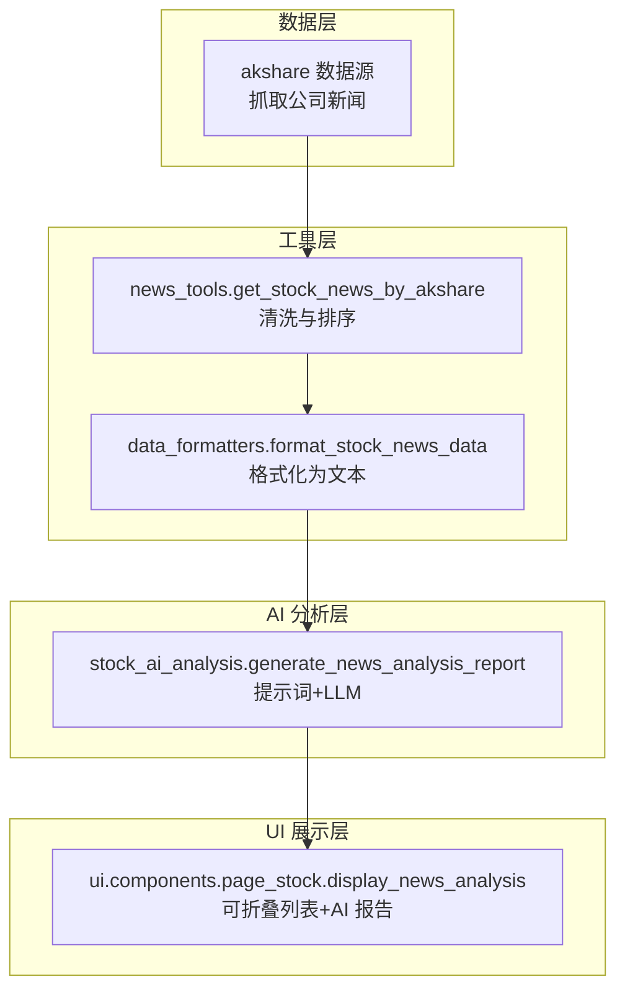
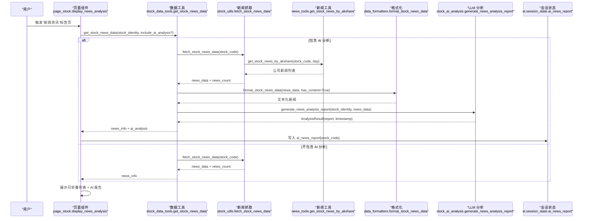
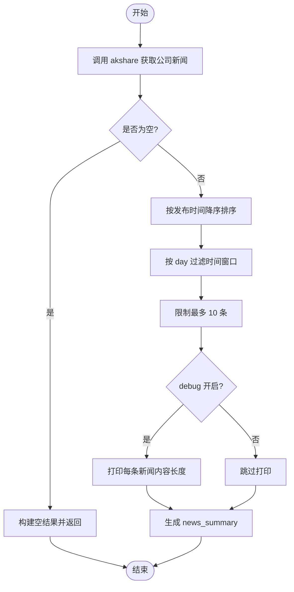
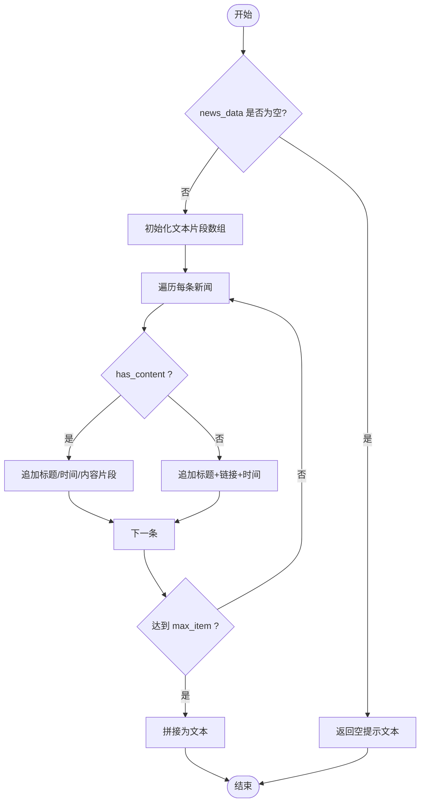
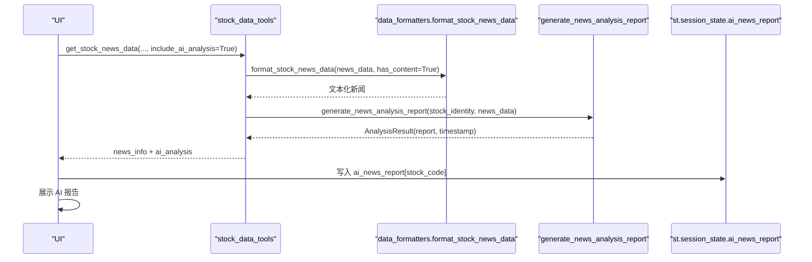
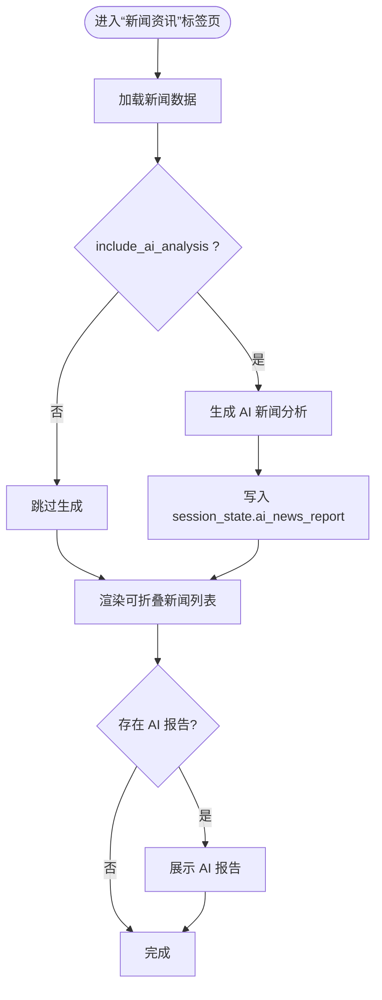
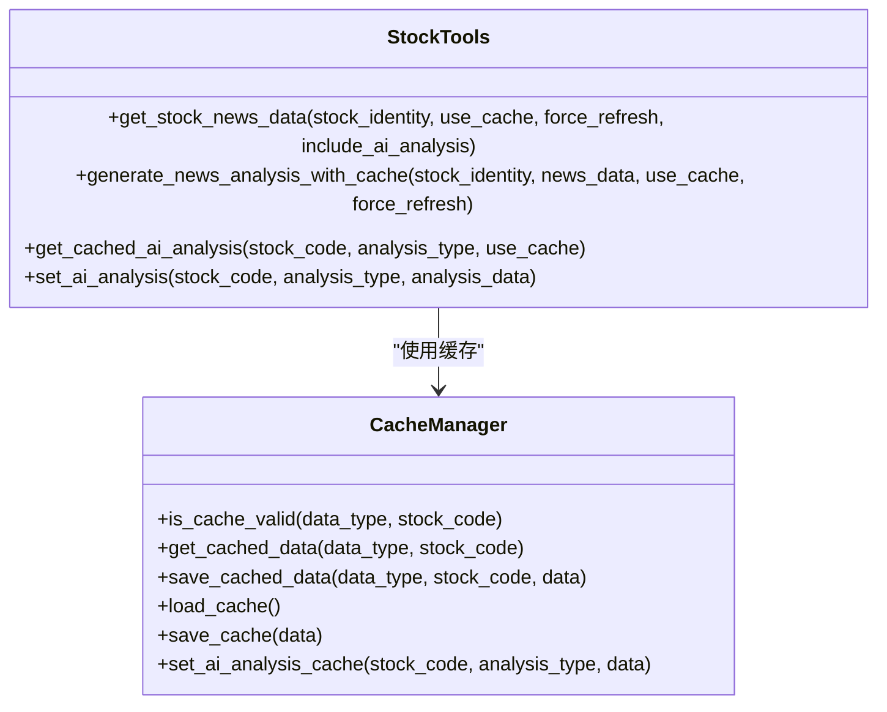
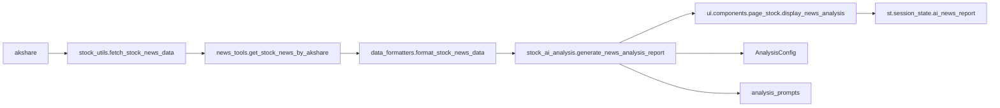

# 新闻分析

<cite>
**本文引用的文件**
- [utils/news_tools.py](file://utils/news_tools.py)
- [stock/stock_ai_analysis.py](file://stock/stock_ai_analysis.py)
- [ui/components/page_stock.py](file://ui/components/page_stock.py)
- [stock/stock_data_tools.py](file://stock/stock_data_tools.py)
- [utils/data_formatters.py](file://utils/data_formatters.py)
- [stock/stock_utils.py](file://stock/stock_utils.py)
- [stock/analysis_prompts.py](file://stock/analysis_prompts.py)
</cite>

## 目录
1. [简介](#简介)
2. [项目结构](#项目结构)
3. [核心组件](#核心组件)
4. [架构总览](#架构总览)
5. [详细组件分析](#详细组件分析)
6. [依赖关系分析](#依赖关系分析)
7. [性能考量](#性能考量)
8. [故障排查指南](#故障排查指南)
9. [结论](#结论)

## 简介
本文围绕 xystock 的个股新闻分析能力，系统梳理从数据拉取、内容格式化、大语言模型分析到 Web 界面展示的完整流程。重点覆盖：
- utils/news_tools.py 中的 get_stock_news_by_akshare 如何从数据源抓取与指定股票相关的新闻资讯；
- stock/stock_ai_analysis.py 中 generate_news_analysis_report 如何调用 LLM 对新闻进行摘要、情感分析与影响评估；
- ui/components/page_stock.py 中 display_news_analysis 如何在 Streamlit 页面中以可折叠列表展示原始新闻并集成 AI 分析报告；
- 针对新闻数据量过大或内容为空的处理策略；
- 当 AI 分析无法准确理解新闻内容时的优化建议。

## 项目结构
xystock 的新闻分析涉及多个层次：
- 数据层：通过 akshare 等数据源抓取新闻，封装为统一结构；
- 工具层：格式化新闻文本，供 LLM 使用；
- AI 分析层：基于提示词模板生成新闻分析报告；
- UI 展示层：在页面中以可折叠列表展示原始新闻，并展示 AI 生成的分析报告。

**图表来源**
- [utils/news_tools.py](file://utils/news_tools.py#L12-L57)
- [utils/data_formatters.py](file://utils/data_formatters.py#L387-L409)
- [stock/stock_ai_analysis.py](file://stock/stock_ai_analysis.py#L498-L549)
- [ui/components/page_stock.py](file://ui/components/page_stock.py#L554-L618)

**章节来源**
- [utils/news_tools.py](file://utils/news_tools.py#L12-L57)
- [utils/data_formatters.py](file://utils/data_formatters.py#L387-L409)
- [stock/stock_ai_analysis.py](file://stock/stock_ai_analysis.py#L498-L549)
- [ui/components/page_stock.py](file://ui/components/page_stock.py#L554-L618)

## 核心组件
- 新闻数据抓取与清洗：get_stock_news_by_akshare
- 新闻文本格式化：format_stock_news_data
- 新闻分析报告生成：generate_news_analysis_report
- UI 展示：display_news_analysis
- 数据工具桥接：stock_data_tools.get_stock_news_data
- 辅助提示词：analysis_prompts

**章节来源**
- [utils/news_tools.py](file://utils/news_tools.py#L12-L57)
- [utils/data_formatters.py](file://utils/data_formatters.py#L387-L409)
- [stock/stock_ai_analysis.py](file://stock/stock_ai_analysis.py#L498-L549)
- [ui/components/page_stock.py](file://ui/components/page_stock.py#L554-L618)
- [stock/stock_data_tools.py](file://stock/stock_data_tools.py#L191-L231)
- [stock/analysis_prompts.py](file://stock/analysis_prompts.py#L1-L54)

## 架构总览
下面的序列图展示了从用户触发到最终在页面展示的完整流程。

**图表来源**
- [ui/components/page_stock.py](file://ui/components/page_stock.py#L554-L618)
- [stock/stock_data_tools.py](file://stock/stock_data_tools.py#L191-L231)
- [stock/stock_utils.py](file://stock/stock_utils.py#L242-L265)
- [utils/news_tools.py](file://utils/news_tools.py#L12-L57)
- [utils/data_formatters.py](file://utils/data_formatters.py#L387-L409)
- [stock/stock_ai_analysis.py](file://stock/stock_ai_analysis.py#L498-L549)

## 详细组件分析

### 组件A：新闻数据抓取与清洗（utils/news_tools.py）
- 功能职责
  - 通过 akshare 获取公司新闻，按发布时间降序排序；
  - 支持按天数过滤与数量上限（默认最多 10 条）；
  - 输出统一结构，包含新闻列表与摘要信息；
  - 提供情感分析辅助提示词模板与时间过滤工具。
- 关键逻辑
  - 数据源：akshare 的股票新闻接口；
  - 排序与过滤：按“发布时间”字段解析并排序，再按时间窗口与条数限制裁剪；
  - 结果组织：返回 company_news、news_summary 等字段；
  - 调试开关：可打印每条新闻的内容长度，便于观察数据质量。
- 处理要点
  - 若新闻内容缺失，会在调试模式下标注“无内容”，便于定位数据源问题；
  - 汇总统计包含 total_news_count、data_freshness 等，便于前端展示与审计。

**图表来源**
- [utils/news_tools.py](file://utils/news_tools.py#L12-L57)

**章节来源**
- [utils/news_tools.py](file://utils/news_tools.py#L12-L57)

### 组件B：新闻文本格式化（utils/data_formatters.py）
- 功能职责
  - 将新闻列表格式化为 LLM 可读的文本，支持截断与最大条目限制；
  - 在 has_content=True 时，包含标题、时间、内容片段；
  - 在 has_content=False 时，输出标题与链接形式，便于快速浏览。
- 关键逻辑
  - 遍历新闻列表，拼接标题、时间、内容片段；
  - 截断内容长度，避免输入过长；
  - 支持 max_item 控制输出条数，便于性能与可读性平衡。

**图表来源**
- [utils/data_formatters.py](file://utils/data_formatters.py#L387-L409)

**章节来源**
- [utils/data_formatters.py](file://utils/data_formatters.py#L387-L409)

### 组件C：LLM 新闻分析报告生成（stock/stock_ai_analysis.py）
- 功能职责
  - 基于系统提示词与用户消息，生成新闻分析报告；
  - 报告包含“新闻概述、关键信息分析、市场影响评估、风险因素识别”等结构化要点；
  - 通过 AnalysisConfig 管理温度、模型类型与缓存文件名；
  - 通过 DataCollector/ReportFormatter 统一格式化与汇总。
- 关键逻辑
  - 输入：股票身份信息、新闻文本（经格式化）；
  - 系统提示词强调“基于真实新闻数据、关注时效性与实质性影响”；
  - 输出：AnalysisResult（包含 report、timestamp、success 等）。
- 与 UI 的衔接
  - page_stock 在展示时，若开启 include_ai_analysis，则通过 stock_data_tools 触发生成并写入 st.session_state.ai_news_report。

**图表来源**
- [stock/stock_ai_analysis.py](file://stock/stock_ai_analysis.py#L498-L549)
- [utils/data_formatters.py](file://utils/data_formatters.py#L387-L409)
- [ui/components/page_stock.py](file://ui/components/page_stock.py#L554-L618)
- [stock/stock_data_tools.py](file://stock/stock_data_tools.py#L191-L231)

**章节来源**
- [stock/stock_ai_analysis.py](file://stock/stock_ai_analysis.py#L498-L549)
- [stock/analysis_prompts.py](file://stock/analysis_prompts.py#L1-L54)

### 组件D：Web 界面展示（ui/components/page_stock.py）
- 功能职责
  - 在“新闻资讯”标签页中展示新闻；
  - 使用可折叠 expander 展示每条新闻的标题、时间与内容；
  - 若存在 AI 分析，展示 AI 生成的新闻分析报告；
  - 支持“包含 AI 分析”的开关，按需触发生成。
- 关键逻辑
  - 通过 st.session_state.ai_news_report 缓存 AI 报告，避免重复生成；
  - 展示新闻条数与来源摘要；
  - 对空数据与错误进行友好提示。

**图表来源**
- [ui/components/page_stock.py](file://ui/components/page_stock.py#L554-L618)

**章节来源**
- [ui/components/page_stock.py](file://ui/components/page_stock.py#L554-L618)

### 组件E：数据工具桥接（stock/stock_data_tools.py）
- 功能职责
  - 统一封装 get_stock_news_data，负责缓存命中、错误处理与 AI 分析触发；
  - 在 include_ai_analysis=True 时，调用 generate_news_analysis_with_cache 生成并缓存报告；
  - 返回 news_data、news_count、latest_news 等字段，供 UI 使用。
- 关键逻辑
  - 缓存策略：根据 data_type='news_data' 判断是否命中缓存；
  - 错误兜底：若缓存或抓取失败，返回 error 字段；
  - AI 分析：将格式化后的新闻文本传给 generate_news_analysis_report。

**图表来源**
- [stock/stock_data_tools.py](file://stock/stock_data_tools.py#L191-L231)
- [stock/stock_data_tools.py](file://stock/stock_data_tools.py#L393-L435)

**章节来源**
- [stock/stock_data_tools.py](file://stock/stock_data_tools.py#L191-L231)
- [stock/stock_data_tools.py](file://stock/stock_data_tools.py#L393-L435)

## 依赖关系分析
- 数据抓取依赖 akshare，通过 stock_utils.fetch_stock_news_data 调用 news_tools.get_stock_news_by_akshare；
- 格式化依赖 data_formatters.format_stock_news_data；
- LLM 分析依赖 stock_ai_analysis.generate_news_analysis_report；
- UI 依赖 st.session_state 缓存与 stock_data_tools 的数据接口；
- 分析配置与提示词由 AnalysisConfig 与 analysis_prompts 提供。

**图表来源**
- [stock/stock_utils.py](file://stock/stock_utils.py#L242-L265)
- [utils/news_tools.py](file://utils/news_tools.py#L12-L57)
- [utils/data_formatters.py](file://utils/data_formatters.py#L387-L409)
- [stock/stock_ai_analysis.py](file://stock/stock_ai_analysis.py#L498-L549)
- [ui/components/page_stock.py](file://ui/components/page_stock.py#L554-L618)
- [stock/analysis_prompts.py](file://stock/analysis_prompts.py#L1-L54)

**章节来源**
- [stock/stock_utils.py](file://stock/stock_utils.py#L242-L265)
- [utils/news_tools.py](file://utils/news_tools.py#L12-L57)
- [utils/data_formatters.py](file://utils/data_formatters.py#L387-L409)
- [stock/stock_ai_analysis.py](file://stock/stock_ai_analysis.py#L498-L549)
- [ui/components/page_stock.py](file://ui/components/page_stock.py#L554-L618)
- [stock/analysis_prompts.py](file://stock/analysis_prompts.py#L1-L54)

## 性能考量
- 数据抓取与排序
  - 默认最多 10 条新闻，时间窗口可按 day 控制，减少无效数据传输与处理；
  - 调试模式下打印内容长度，有助于发现数据源质量问题。
- 文本格式化
  - 对新闻内容进行截断，避免 LLM 输入过长导致 Token 超限；
  - 支持 max_item 控制输出条数，兼顾性能与可读性。
- 缓存与复用
  - stock_data_tools 对新闻数据与 AI 分析结果进行缓存，降低重复请求与生成成本；
  - UI 侧通过 st.session_state 缓存 AI 报告，避免重复渲染。
- 并发与稳定性
  - stock_data_tools.get_stock_news_data 对异常进行捕获并返回 error 字段，保证 UI 稳定；
  - 若抓取失败，优先返回缓存数据（use_cache=True 且未强制刷新）。

[本节为通用性能讨论，无需特定文件引用]

## 故障排查指南
- 新闻数据为空
  - 检查 akshare 数据源是否可用，确认股票代码正确；
  - 查看 news_tools 的调试输出，确认是否打印“无内容”；
  - 在 UI 中查看“未能获取到相关新闻”的提示。
- LLM 分析报错
  - 查看 stock_ai_analysis 的错误返回与时间戳，确认生成失败原因；
  - 检查 AnalysisConfig 的温度与模型类型配置；
  - 确认 data_formatters.format_stock_news_data 是否正确截断与拼接。
- UI 展示异常
  - 确认 st.session_state.ai_news_report 是否写入成功；
  - 检查 include_ai_analysis 开关状态与缓存是否命中；
  - 若 error 字段存在，查看错误详情并重试。

**章节来源**
- [utils/news_tools.py](file://utils/news_tools.py#L12-L57)
- [stock/stock_ai_analysis.py](file://stock/stock_ai_analysis.py#L498-L549)
- [ui/components/page_stock.py](file://ui/components/page_stock.py#L554-L618)
- [stock/stock_data_tools.py](file://stock/stock_data_tools.py#L191-L231)

## 结论
xystock 的个股新闻分析能力通过“数据抓取—文本格式化—LLM 分析—UI 展示”的闭环实现，具备以下特点：
- 数据抓取与清洗：基于 akshare 的公司新闻抓取，支持时间窗口与数量限制；
- 文本格式化：面向 LLM 的结构化文本输出，兼顾性能与可读性；
- LLM 分析：结构化提示词引导，输出涵盖摘要、情感与影响评估；
- UI 展示：可折叠列表与 AI 报告并存，支持缓存与开关控制；
- 错误处理与缓存：完善的异常捕获与缓存策略，提升稳定性与性能。

针对新闻数据量过大或内容为空的问题，建议：
- 在抓取阶段通过 day 与 limit 控制数据规模；
- 在格式化阶段启用截断与 max_item；
- 在 UI 层提供开关与缓存，避免重复生成；
- 当 AI 分析无法准确理解内容时，优化提示词模板、增加上下文字段（如发布时间、来源），并结合历史缓存与人工校验。