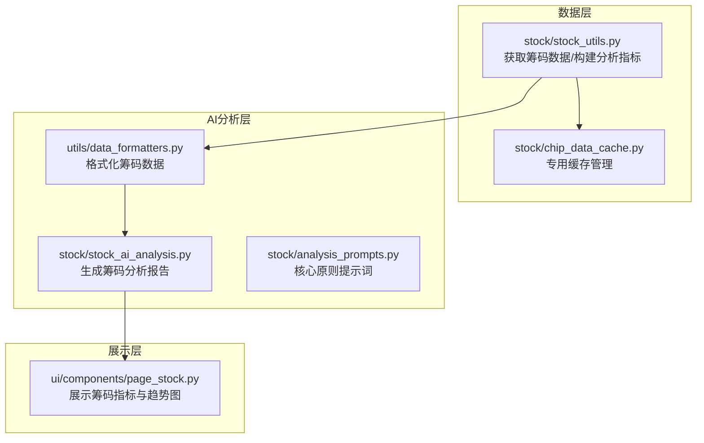
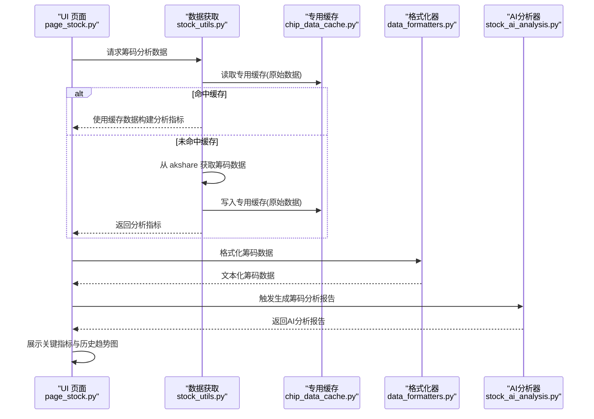
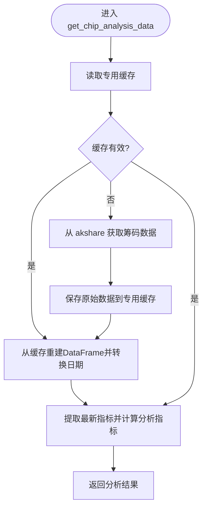
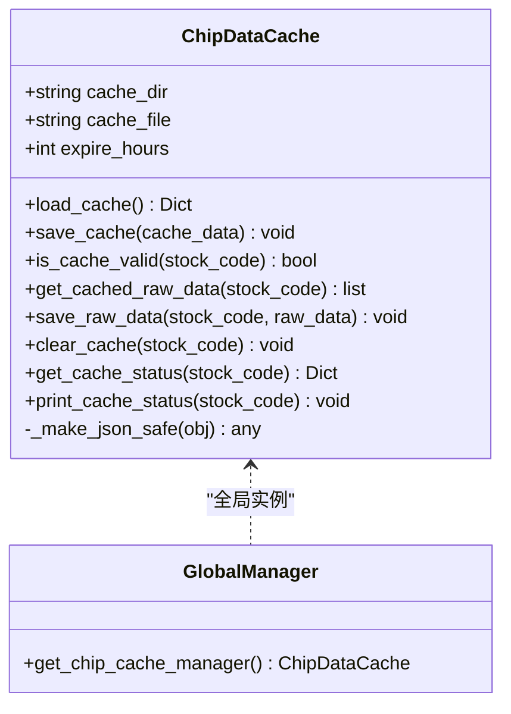
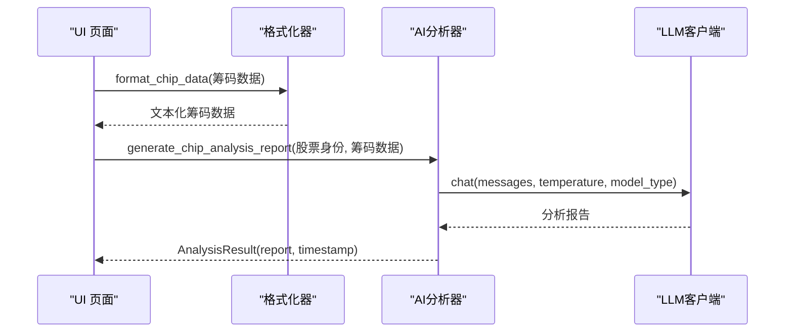
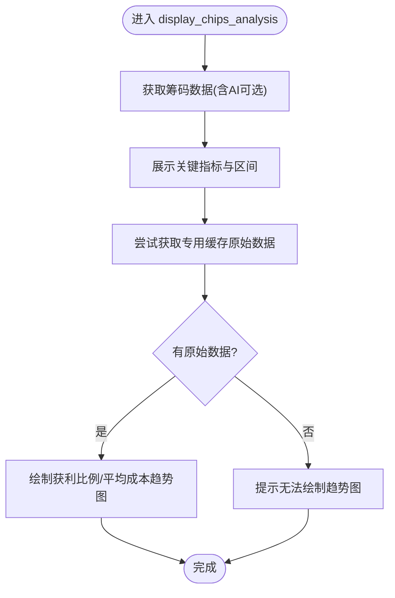
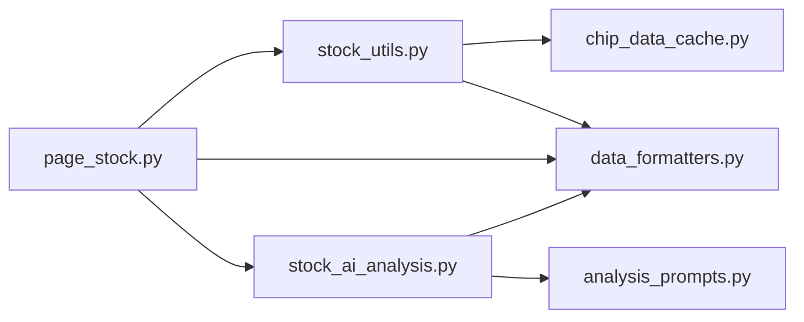

# 筹码分析

<cite>
**本文引用的文件**
- [stock_utils.py](file://stock/stock_utils.py)
- [chip_data_cache.py](file://stock/chip_data_cache.py)
- [stock_ai_analysis.py](file://stock/stock_ai_analysis.py)
- [page_stock.py](file://ui/components/page_stock.py)
- [data_formatters.py](file://utils/data_formatters.py)
- [analysis_prompts.py](file://stock/analysis_prompts.py)
</cite>

## 目录
1. [简介](#简介)
2. [项目结构](#项目结构)
3. [核心组件](#核心组件)
4. [架构总览](#架构总览)
5. [详细组件分析](#详细组件分析)
6. [依赖关系分析](#依赖关系分析)
7. [性能考量](#性能考量)
8. [故障排查指南](#故障排查指南)
9. [结论](#结论)
10. [附录](#附录)

## 简介
本章节系统性阐述 xystock 的个股筹码分析能力，围绕以下目标展开：
- 解释 stock_utils.py 中的 get_chip_analysis_data 如何通过 akshare 获取筹码分布数据，并借助 chip_data_cache.py 实现“筹码原始数据”的专用缓存管理。
- 解析 stock_ai_analysis.py 中 generate_chip_analysis_report 如何基于 LLM，结合获利比例、平均成本、成本集中度等筹码指标，分析主力行为、识别支撑阻力位并判断市场信号。
- 说明 ui/components/page_stock.py 中 display_chips_analysis 如何在 Web 界面展示关键筹码指标（如获利比例、平均成本），并通过 Plotly 绘制获利比例与平均成本的历史变化趋势图。
- 通过代码示例路径展示从筹码数据获取、缓存、AI 分析到多维度结果展示的完整流程。
- 区分“专用缓存”与“通用缓存”，并提供处理筹码数据源不可用或趋势图绘制失败的解决方案。

## 项目结构
围绕筹码分析的相关模块与文件组织如下：
- 数据获取与缓存：stock/stock_utils.py、stock/chip_data_cache.py
- AI 分析：stock/stock_ai_analysis.py、utils/data_formatters.py、stock/analysis_prompts.py
- Web 展示：ui/components/page_stock.py

图表来源
- [stock_utils.py](file://stock/stock_utils.py#L1-L120)
- [chip_data_cache.py](file://stock/chip_data_cache.py#L1-L120)
- [stock_ai_analysis.py](file://stock/stock_ai_analysis.py#L552-L602)
- [data_formatters.py](file://utils/data_formatters.py#L411-L466)
- [analysis_prompts.py](file://stock/analysis_prompts.py#L1-L54)
- [page_stock.py](file://ui/components/page_stock.py#L620-L764)

章节来源
- [stock_utils.py](file://stock/stock_utils.py#L1-L120)
- [chip_data_cache.py](file://stock/chip_data_cache.py#L1-L120)
- [stock_ai_analysis.py](file://stock/stock_ai_analysis.py#L552-L602)
- [data_formatters.py](file://utils/data_formatters.py#L411-L466)
- [analysis_prompts.py](file://stock/analysis_prompts.py#L1-L54)
- [page_stock.py](file://ui/components/page_stock.py#L620-L764)

## 核心组件
- 筹码数据获取与分析：stock/stock_utils.py 提供 get_chip_analysis_data，负责从 akshare 获取筹码数据、构建分析指标（获利状态、集中度状态、风险等级），并使用专用缓存管理器保存/读取原始数据。
- 专用缓存管理：stock/chip_data_cache.py 提供 ChipDataCache，独立管理筹码原始数据的 JSON 文件缓存，支持有效期校验、保存、清理与状态查询。
- AI 筹码分析：stock/stock_ai_analysis.py 的 generate_chip_analysis_report 使用 LLM，结合格式化后的筹码数据生成专业分析报告。
- Web 展示：ui/components/page_stock.py 的 display_chips_analysis 展示关键指标与历史趋势图，并在需要时触发 AI 分析。

章节来源
- [stock_utils.py](file://stock/stock_utils.py#L1-L120)
- [chip_data_cache.py](file://stock/chip_data_cache.py#L1-L120)
- [stock_ai_analysis.py](file://stock/stock_ai_analysis.py#L552-L602)
- [page_stock.py](file://ui/components/page_stock.py#L620-L764)

## 架构总览
下图展示了从数据获取、缓存、格式化到 AI 分析与前端展示的端到端流程。

图表来源
- [stock_utils.py](file://stock/stock_utils.py#L1-L120)
- [chip_data_cache.py](file://stock/chip_data_cache.py#L69-L115)
- [data_formatters.py](file://utils/data_formatters.py#L411-L466)
- [stock_ai_analysis.py](file://stock/stock_ai_analysis.py#L552-L602)
- [page_stock.py](file://ui/components/page_stock.py#L620-L764)

## 详细组件分析

### 组件A：筹码数据获取与分析（stock_utils.py）
- 功能职责
  - 通过 akshare 获取筹码分布数据（如获利比例、平均成本、成本区间与集中度等）。
  - 若专用缓存有效，则直接从缓存重建 DataFrame 进行分析；否则从 akshare 拉取并写入专用缓存。
  - 计算分析指标：获利状态、集中度状态、风险等级。
  - 提供 get_chip_raw_data 以直接获取原始数据（供 UI 绘图使用）。
- 关键实现要点
  - 专用缓存读取与有效性判断：先检查缓存是否有效，再读取原始数据。
  - 数据清洗与类型转换：将日期列转换为 datetime 类型，便于后续趋势分析。
  - 分析指标构建：基于获利比例与集中度阈值划分状态与风险等级。
  - 错误处理：捕获异常并返回错误信息，避免中断流程。

图表来源
- [stock_utils.py](file://stock/stock_utils.py#L1-L120)
- [chip_data_cache.py](file://stock/chip_data_cache.py#L69-L115)

章节来源
- [stock_utils.py](file://stock/stock_utils.py#L1-L120)
- [chip_data_cache.py](file://stock/chip_data_cache.py#L69-L115)

### 组件B：专用缓存管理（chip_data_cache.py）
- 功能职责
  - 独立存储筹码原始数据，文件名为 chip_raw_data.json，按股票代码分项保存。
  - 支持有效期校验（默认24小时）、保存、清理与状态查询。
  - 提供全局管理器实例，避免重复创建。
- 关键实现要点
  - JSON 安全转换：将 pandas、numpy 等类型转换为可序列化格式。
  - 有效期判定：基于 cache_time 与 expire_hours 计算剩余时间。
  - 状态打印：提供 print_cache_status 用于调试与运维。

图表来源
- [chip_data_cache.py](file://stock/chip_data_cache.py#L1-L215)

章节来源
- [chip_data_cache.py](file://stock/chip_data_cache.py#L1-L215)

### 组件C：AI 筹码分析（stock_ai_analysis.py）
- 功能职责
  - generate_chip_analysis_report 接收股票身份与筹码数据，构造系统提示词与用户消息，调用 LLM 生成筹码分析报告。
  - 使用 data_formatters.py 的 format_chip_data 将筹码数据文本化，便于 LLM 理解。
  - 通过 AnalysisConfig 与 AnalysisResult 统一管理分析配置与结果封装。
- 关键实现要点
  - 系统提示词强调筹码分布形态、集中度、主力成本区间、关键支撑/压力位、筹码迁移与异动转移率等要素。
  - 输出结构化段落：筹码分布概况、主力行为画像、压力支撑分析、筹码变化信号。
  - 与通用提示词体系（analysis_prompts.py）协同，确保分析风格一致。

图表来源
- [stock_ai_analysis.py](file://stock/stock_ai_analysis.py#L552-L602)
- [data_formatters.py](file://utils/data_formatters.py#L411-L466)

章节来源
- [stock_ai_analysis.py](file://stock/stock_ai_analysis.py#L552-L602)
- [data_formatters.py](file://utils/data_formatters.py#L411-L466)
- [analysis_prompts.py](file://stock/analysis_prompts.py#L1-L54)

### 组件D：Web 界面展示（ui/components/page_stock.py）
- 功能职责
  - display_chips_analysis 展示关键筹码指标（获利比例、平均成本、成本区间与集中度、支撑/阻力/成本中枢）。
  - 尝试从专用缓存获取原始数据，若存在则绘制获利比例与平均成本的历史趋势图。
  - 支持触发 AI 筹码分析，将报告存入 session_state 并展示。
- 关键实现要点
  - 指标展示：使用 st.metric 与 st.info/st.success 等组件直观呈现状态。
  - 图表绘制：使用 Plotly 绘制两条趋势线，分别反映获利比例与平均成本随时间的变化。
  - 异常处理：对数据源不可用与绘图失败分别给出提示。

图表来源
- [page_stock.py](file://ui/components/page_stock.py#L620-L764)

章节来源
- [page_stock.py](file://ui/components/page_stock.py#L620-L764)

## 依赖关系分析
- 模块耦合
  - stock_utils.py 依赖 akshare 与 pandas，同时依赖 chip_data_cache.py 的专用缓存。
  - stock_ai_analysis.py 依赖 data_formatters.py 的格式化器与 analysis_prompts.py 的核心原则。
  - page_stock.py 依赖 stock_utils.py 获取原始数据，依赖 data_formatters.py 格式化筹码数据，依赖 stock_ai_analysis.py 生成报告。
- 外部依赖
  - akshare：提供筹码分布数据接口。
  - Plotly：用于绘制历史趋势图。
  - Streamlit：用于 Web 展示。

图表来源
- [stock_utils.py](file://stock/stock_utils.py#L1-L120)
- [chip_data_cache.py](file://stock/chip_data_cache.py#L1-L120)
- [stock_ai_analysis.py](file://stock/stock_ai_analysis.py#L552-L602)
- [data_formatters.py](file://utils/data_formatters.py#L411-L466)
- [analysis_prompts.py](file://stock/analysis_prompts.py#L1-L54)
- [page_stock.py](file://ui/components/page_stock.py#L620-L764)

章节来源
- [stock_utils.py](file://stock/stock_utils.py#L1-L120)
- [chip_data_cache.py](file://stock/chip_data_cache.py#L1-L120)
- [stock_ai_analysis.py](file://stock/stock_ai_analysis.py#L552-L602)
- [data_formatters.py](file://utils/data_formatters.py#L411-L466)
- [analysis_prompts.py](file://stock/analysis_prompts.py#L1-L54)
- [page_stock.py](file://ui/components/page_stock.py#L620-L764)

## 性能考量
- 专用缓存命中率
  - 通过 24 小时有效期减少 akshare 请求频率，提高响应速度。
  - 建议在高频查询场景下，结合业务侧的刷新策略，避免频繁拉取。
- 数据处理复杂度
  - DataFrame 构建与日期转换为 O(n) 操作，n 为历史数据长度。
  - 分析指标计算为 O(1)，整体开销较小。
- 可视化性能
  - Plotly 图表渲染与交互在大数据量时可能较慢，建议限制历史窗口长度或采用分页/滑动窗口策略。
- LLM 调用成本
  - 生成筹码分析报告会消耗 token，建议在必要时触发（如用户点击“生成AI分析”按钮）。

## 故障排查指南
- 筹码数据源不可用
  - 现象：返回错误信息或空数据。
  - 处理：
    - 检查 akshare 是否可用，确认网络连通性。
    - 查看专用缓存是否过期或损坏，必要时清理缓存后重试。
    - 参考路径：[stock_utils.py](file://stock/stock_utils.py#L1-L120)、[chip_data_cache.py](file://stock/chip_data_cache.py#L69-L115)
- 趋势图绘制失败
  - 现象：提示无法绘制趋势图或报错。
  - 处理：
    - 确认原始数据非空且包含日期与指标列。
    - 检查 Plotly 版本与依赖是否正确安装。
    - 参考路径：[page_stock.py](file://ui/components/page_stock.py#L703-L760)
- AI 分析生成失败
  - 现象：返回错误信息或为空。
  - 处理：
    - 检查 LLM 客户端配置与可用性。
    - 确认格式化后的筹码数据结构完整。
    - 参考路径：[stock_ai_analysis.py](file://stock/stock_ai_analysis.py#L552-L602)、[data_formatters.py](file://utils/data_formatters.py#L411-L466)

章节来源
- [stock_utils.py](file://stock/stock_utils.py#L1-L120)
- [chip_data_cache.py](file://stock/chip_data_cache.py#L69-L115)
- [page_stock.py](file://ui/components/page_stock.py#L703-L760)
- [stock_ai_analysis.py](file://stock/stock_ai_analysis.py#L552-L602)
- [data_formatters.py](file://utils/data_formatters.py#L411-L466)

## 结论
xystock 的筹码分析能力通过“专用缓存 + akshare + LLM + Web 展示”的闭环实现：
- 专用缓存确保筹码原始数据的高效复用与一致性。
- get_chip_analysis_data 提供稳定的指标计算与错误兜底。
- generate_chip_analysis_report 将结构化筹码数据转化为可读性强的专业分析。
- page_stock.py 将关键指标与历史趋势可视化，提升用户体验。
建议在生产环境中结合缓存策略与限流机制，保障性能与稳定性。

## 附录
- 代码示例路径（不展示具体代码内容）
  - 获取筹码分析数据：[stock_utils.py](file://stock/stock_utils.py#L1-L120)
  - 获取筹码原始数据：[stock_utils.py](file://stock/stock_utils.py#L280-L311)
  - 专用缓存读取/保存：[chip_data_cache.py](file://stock/chip_data_cache.py#L69-L115)
  - 专用缓存状态查询：[chip_data_cache.py](file://stock/chip_data_cache.py#L138-L171)
  - 格式化筹码数据：[data_formatters.py](file://utils/data_formatters.py#L411-L466)
  - 生成筹码分析报告：[stock_ai_analysis.py](file://stock/stock_ai_analysis.py#L552-L602)
  - 展示筹码指标与趋势图：[page_stock.py](file://ui/components/page_stock.py#L620-L764)