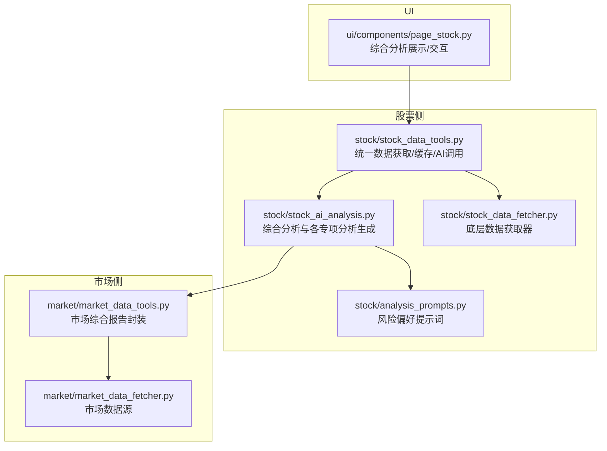
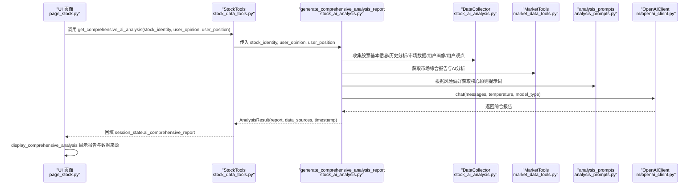
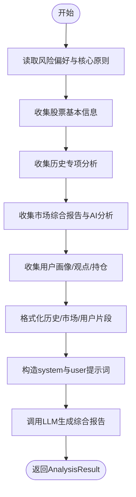
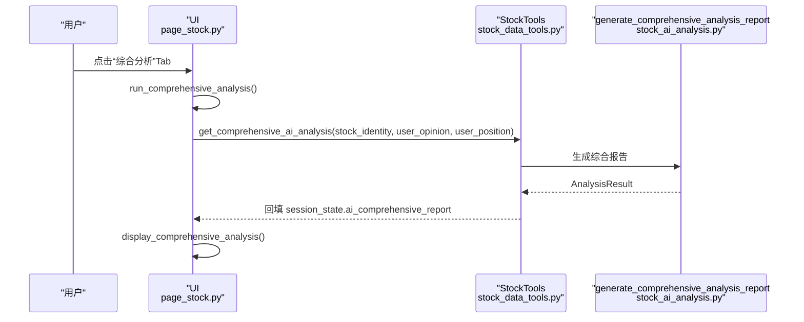
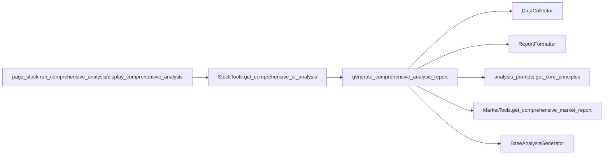

# 综合分析

<cite>
**本文引用的文件**
- [stock_ai_analysis.py](file://stock/stock_ai_analysis.py)
- [analysis_prompts.py](file://stock/analysis_prompts.py)
- [page_stock.py](file://ui/components/page_stock.py)
- [stock_data_tools.py](file://stock/stock_data_tools.py)
- [market_data_tools.py](file://market/market_data_tools.py)
- [stock_data_fetcher.py](file://stock/stock_data_fetcher.py)
- [market_data_fetcher.py](file://market/market_data_fetcher.py)
</cite>

## 目录
1. [引言](#引言)
2. [项目结构](#项目结构)
3. [核心组件](#核心组件)
4. [架构总览](#架构总览)
5. [详细组件分析](#详细组件分析)
6. [依赖关系分析](#依赖关系分析)
7. [性能考量](#性能考量)
8. [故障排查指南](#故障排查指南)
9. [结论](#结论)

## 引言
本文件围绕 xystock 的“个股综合分析”能力展开，聚焦于 stock_ai_analysis.py 中的 generate_comprehensive_analysis_report 函数，系统阐述其如何作为分析的集大成者，整合技术面、基本面、新闻面、筹码面的分析结果，并结合大盘环境、用户画像与用户观点，生成高度凝练的投资决策建议。文档还解析 DataCollector 和 ReportFormatter 类如何协同收集与格式化多源数据，以及 analysis_prompts.py 如何根据用户风险偏好（保守、中性、激进）动态选择核心原则提示词，指导 LLM 输出个性化报告。UI 层面，ui/components/page_stock.py 的 display_comprehensive_analysis 与 run_comprehensive_analysis 提供了 Web 界面展示与交互入口，用户可在界面中输入观点并选择风险偏好，从而驱动生成过程。

## 项目结构
本功能涉及的模块与文件如下：
- 股票侧 AI 分析与数据工具
  - stock/stock_ai_analysis.py：生成各类分析报告与综合报告的核心逻辑
  - stock/analysis_prompts.py：风险偏好提示词与核心原则
  - stock/stock_data_tools.py：统一数据获取、缓存与 AI 分析调用
  - stock/stock_data_fetcher.py：底层数据获取器（K线、实时行情等）
- 市场侧数据工具
  - market/market_data_tools.py：市场综合报告与 AI 分析封装
  - market/market_data_fetcher.py：市场情绪、估值、资金流等数据源
- UI 展示层
  - ui/components/page_stock.py：综合分析展示与交互入口

图表来源
- [stock_ai_analysis.py](file://stock/stock_ai_analysis.py#L717-L879)
- [analysis_prompts.py](file://stock/analysis_prompts.py#L1-L54)
- [stock_data_tools.py](file://stock/stock_data_tools.py#L1-L200)
- [stock_data_fetcher.py](file://stock/stock_data_fetcher.py#L1-L120)
- [market_data_tools.py](file://market/market_data_tools.py#L1-L120)
- [market_data_fetcher.py](file://market/market_data_fetcher.py#L1-L120)
- [page_stock.py](file://ui/components/page_stock.py#L765-L832)

章节来源
- [stock_ai_analysis.py](file://stock/stock_ai_analysis.py#L717-L879)
- [analysis_prompts.py](file://stock/analysis_prompts.py#L1-L54)
- [stock_data_tools.py](file://stock/stock_data_tools.py#L1-L200)
- [stock_data_fetcher.py](file://stock/stock_data_fetcher.py#L1-L120)
- [market_data_tools.py](file://market/market_data_tools.py#L1-L120)
- [market_data_fetcher.py](file://market/market_data_fetcher.py#L1-L120)
- [page_stock.py](file://ui/components/page_stock.py#L765-L832)

## 核心组件
- generate_comprehensive_analysis_report：综合分析主函数，负责收集与拼装多源数据，动态注入风险偏好提示词，调用 LLM 生成综合报告，并返回 AnalysisResult。
- DataCollector：负责收集股票基本信息、历史分析、市场数据、用户画像与用户观点/持仓信息，并记录数据来源。
- ReportFormatter：负责将历史分析、市场环境、用户观点等片段格式化为统一的报告段落。
- analysis_prompts.get_core_principles：根据风险偏好（中性/保守/激进/自定义）返回核心原则提示词。
- stock_data_tools.StockTools.get_comprehensive_ai_analysis：UI 层调用的统一入口，负责缓存控制、参数传递与结果回填至 session_state。
- market_data_tools.MarketTools.get_comprehensive_market_report：生成市场综合报告，供 DataCollector 收集使用。

章节来源
- [stock_ai_analysis.py](file://stock/stock_ai_analysis.py#L717-L879)
- [analysis_prompts.py](file://stock/analysis_prompts.py#L1-L54)
- [stock_data_tools.py](file://stock/stock_data_tools.py#L517-L621)
- [market_data_tools.py](file://market/market_data_tools.py#L421-L455)

## 架构总览
综合分析的端到端流程如下：
- UI 触发 run_comprehensive_analysis，读取用户观点与风险偏好，调用 StockTools.get_comprehensive_ai_analysis。
- StockTools.get_comprehensive_ai_analysis 内部调用 generate_comprehensive_analysis_report。
- generate_comprehensive_analysis_report 通过 DataCollector 收集：
  - 股票基本信息（实时行情、涨跌等）
  - 历史专项分析（技术、基本面、新闻、筹码）
  - 市场综合报告与 AI 分析（由 MarketTools 生成）
  - 用户画像与用户观点/持仓
- ReportFormatter 将上述内容格式化为统一文本。
- analysis_prompts.get_core_principles 动态注入风险偏好提示词。
- BaseAnalysisGenerator 调用 LLM，生成 AnalysisResult。
- UI 层 display_comprehensive_analysis 展示报告与数据来源。

图表来源
- [page_stock.py](file://ui/components/page_stock.py#L810-L831)
- [stock_data_tools.py](file://stock/stock_data_tools.py#L517-L621)
- [stock_ai_analysis.py](file://stock/stock_ai_analysis.py#L717-L879)
- [analysis_prompts.py](file://stock/analysis_prompts.py#L1-L54)
- [market_data_tools.py](file://market/market_data_tools.py#L421-L455)

## 详细组件分析

### 综合分析主函数：generate_comprehensive_analysis_report
- 输入参数：stock_identity、user_opinion、user_position、stock_tools、market_tools、truncate_data。
- 关键步骤：
  - 读取风险偏好与自定义核心原则，调用 analysis_prompts.get_core_principles 动态注入 system prompt。
  - 使用 DataCollector 收集：
    - 股票基本信息（实时行情、涨跌等），并记录数据来源。
    - 历史专项分析（技术、基本面、新闻、筹码），若无则提示。
    - 市场综合报告与 AI 分析（由 MarketTools 生成），并记录数据来源。
    - 用户画像与用户常犯错误，以及用户观点与当前持仓状态。
  - 使用 ReportFormatter 将历史分析、市场环境、用户观点等格式化为统一文本。
  - 构造 system prompt（包含核心原则与输出要求）与 user prompt（拼装所有片段），调用 BaseAnalysisGenerator 生成报告。
  - 返回 AnalysisResult，包含 report、timestamp、data_sources 等。

图表来源
- [stock_ai_analysis.py](file://stock/stock_ai_analysis.py#L717-L879)
- [analysis_prompts.py](file://stock/analysis_prompts.py#L1-L54)

章节来源
- [stock_ai_analysis.py](file://stock/stock_ai_analysis.py#L717-L879)

### 数据收集器：DataCollector
- 职责：统一收集多源数据并标注数据来源，便于最终报告溯源。
- 能力：
  - collect_stock_basic_info：获取实时行情与涨跌等基本信息，格式化后返回。
  - collect_historical_analyses：从缓存读取历史专项分析（技术/基本面/新闻/筹码），并记录来源。
  - collect_market_data：获取市场综合报告与 AI 分析（按股票身份映射目标指数），并记录来源。
  - collect_user_profile：读取用户画像与用户常犯错误，记录来源。

章节来源
- [stock_ai_analysis.py](file://stock/stock_ai_analysis.py#L74-L187)

### 报告格式化器：ReportFormatter
- 职责：将历史分析、市场环境、用户观点等片段格式化为统一文本，便于拼接到 user prompt。
- 能力：
  - format_historical_summary：将历史分析片段截断或完整输出，并移除 Markdown 格式。
  - format_market_summary：将市场综合报告与 AI 分析片段格式化。
  - format_user_opinion_section：将用户观点与当前持仓格式化为独立片段，并记录来源。

章节来源
- [stock_ai_analysis.py](file://stock/stock_ai_analysis.py#L223-L291)

### 风险偏好提示词：analysis_prompts.get_core_principles
- 能力：根据 risk_preference 返回对应的核心原则提示词（中性/保守/激进），或使用自定义核心原则。
- 影响：直接影响 generate_comprehensive_analysis_report 的 system prompt，决定报告风格与侧重点（如保守风格强调本金安全、激进风格强调成长机会）。

章节来源
- [analysis_prompts.py](file://stock/analysis_prompts.py#L1-L54)

### UI 展示与交互：page_stock.py
- display_comprehensive_analysis：展示综合分析报告正文、生成时间、数据来源统计，并展开显示每个数据来源的类型与描述。
- run_comprehensive_analysis：从 session_state 读取 use_cache、user_opinion、user_position，调用 StockTools.get_comprehensive_ai_analysis，将结果写入 session_state.ai_comprehensive_report。
- 页面 Tab 中的“综合分析”触发上述流程。

图表来源
- [page_stock.py](file://ui/components/page_stock.py#L765-L832)
- [stock_data_tools.py](file://stock/stock_data_tools.py#L517-L621)
- [stock_ai_analysis.py](file://stock/stock_ai_analysis.py#L717-L879)

章节来源
- [page_stock.py](file://ui/components/page_stock.py#L765-L832)

### 数据来源与缓存
- 股票侧：
  - stock_data_tools.StockTools.get_stock_* 系列方法负责调用底层数据获取器（stock_data_fetcher），并按需生成 AI 分析（技术/基本面/新闻/筹码/公司），同时写入缓存。
  - get_comprehensive_ai_analysis 支持缓存控制与用户观点一致性校验，避免重复生成。
- 市场侧：
  - market_data_tools.MarketTools.get_comprehensive_market_report 聚合技术指标、情绪、估值、资金流、融资融券、市场新闻等，供综合分析使用。

章节来源
- [stock_data_tools.py](file://stock/stock_data_tools.py#L1-L200)
- [stock_data_fetcher.py](file://stock/stock_data_fetcher.py#L1-L120)
- [market_data_tools.py](file://market/market_data_tools.py#L421-L455)
- [market_data_fetcher.py](file://market/market_data_fetcher.py#L1-L120)

## 依赖关系分析
- generate_comprehensive_analysis_report 依赖：
  - DataCollector：收集多源数据
  - ReportFormatter：格式化片段
  - analysis_prompts.get_core_principles：注入风险偏好提示词
  - MarketTools：获取市场综合报告与 AI 分析
  - BaseAnalysisGenerator：统一调用 LLM
- UI 层 page_stock.py 依赖：
  - StockTools.get_comprehensive_ai_analysis：统一入口
  - session_state：存储与展示综合分析结果

图表来源
- [stock_ai_analysis.py](file://stock/stock_ai_analysis.py#L717-L879)
- [analysis_prompts.py](file://stock/analysis_prompts.py#L1-L54)
- [page_stock.py](file://ui/components/page_stock.py#L765-L832)
- [stock_data_tools.py](file://stock/stock_data_tools.py#L517-L621)
- [market_data_tools.py](file://market/market_data_tools.py#L421-L455)

章节来源
- [stock_ai_analysis.py](file://stock/stock_ai_analysis.py#L717-L879)
- [analysis_prompts.py](file://stock/analysis_prompts.py#L1-L54)
- [page_stock.py](file://ui/components/page_stock.py#L765-L832)
- [stock_data_tools.py](file://stock/stock_data_tools.py#L517-L621)
- [market_data_tools.py](file://market/market_data_tools.py#L421-L455)

## 性能考量
- 缓存策略：
  - 股票侧：StockTools 对基础信息、技术指标、新闻、筹码、AI 分析均提供缓存与过期控制，减少重复拉取与 LLM 调用。
  - 市场侧：MarketTools 对市场情绪、估值、资金流、融资融券、指数技术指标等提供缓存。
- 数据截断：
  - ReportFormatter.format_historical_summary 与 format_market_summary 支持 truncate_data 截断，降低提示词长度，提高 LLM 生成效率。
- 并发与重试：
  - 底层数据获取器（如 stock_data_fetcher）具备重试机制，避免瞬时网络波动导致失败。
- 会话状态：
  - UI 层使用 session_state 存储分析结果，避免重复计算。

章节来源
- [stock_data_tools.py](file://stock/stock_data_tools.py#L1-L200)
- [market_data_tools.py](file://market/market_data_tools.py#L1-L120)
- [stock_data_fetcher.py](file://stock/stock_data_fetcher.py#L1-L120)

## 故障排查指南
- 综合分析失败：
  - 查看返回的 AnalysisResult.error_message 或 UI 的错误提示，确认网络、AI 服务配置、依赖安装是否正常。
  - 检查缓存是否过期或被清空，必要时强制刷新。
- 数据来源缺失：
  - 若历史分析为空，系统会提示“未找到历史分析数据，将基于基本信息进行分析”，属于预期行为。
  - 若市场数据为空，检查 MarketTools 的数据源可用性与网络状态。
- UI 未显示报告：
  - 确认已勾选“综合分析”选项并触发 run_comprehensive_analysis。
  - 检查 session_state.ai_comprehensive_report 是否存在对应股票代码的键值。

章节来源
- [stock_ai_analysis.py](file://stock/stock_ai_analysis.py#L850-L879)
- [page_stock.py](file://ui/components/page_stock.py#L765-L832)

## 结论
xystock 的“个股综合分析”通过 generate_comprehensive_analysis_report 将技术面、基本面、新闻面、筹码面与大盘环境、用户画像、用户观点有机融合，借助 DataCollector 与 ReportFormatter 的规范化数据收集与格式化，配合 analysis_prompts 的风险偏好提示词，最终由 LLM 生成高度凝练、可操作的投资建议。UI 层提供直观的交互入口与展示，使用户能够输入观点、选择风险偏好，并获得一致、可追溯的综合报告。该设计有效将分散的分析结果转化为明确的投资指导，提升决策效率与质量。