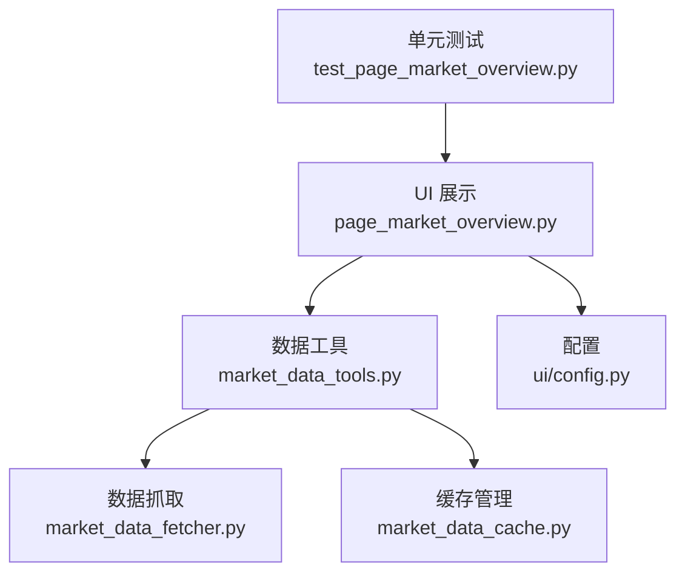
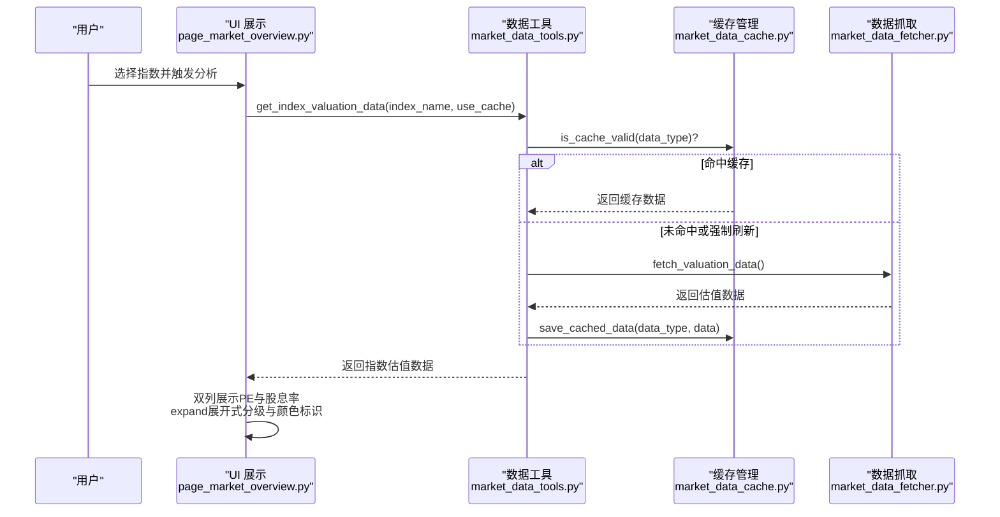
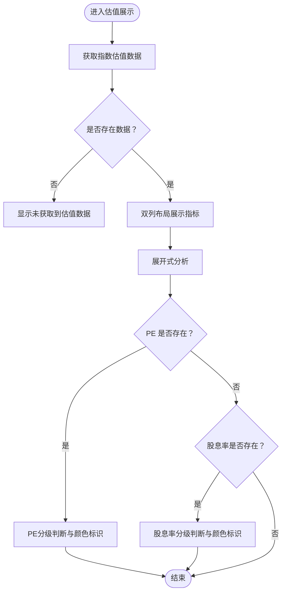
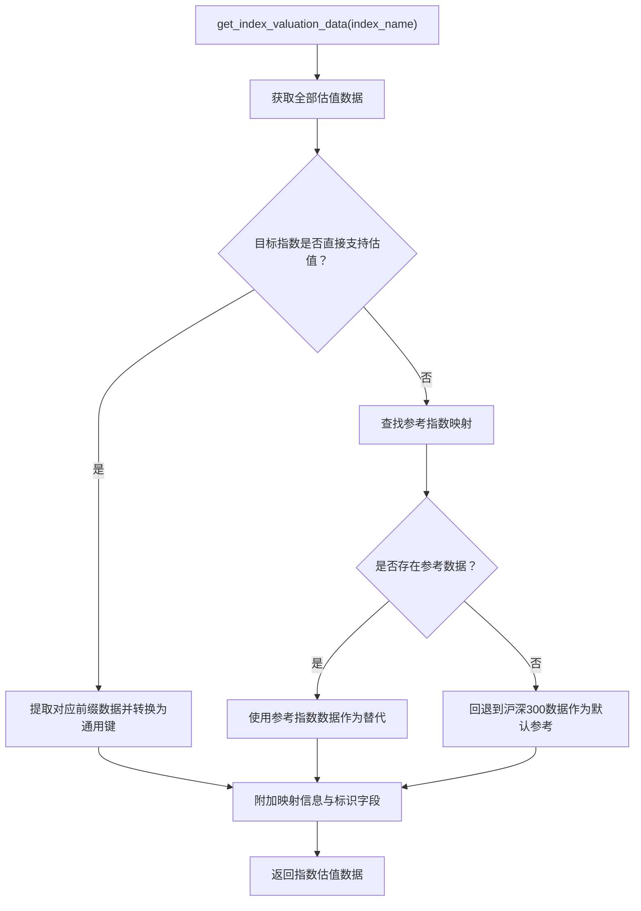
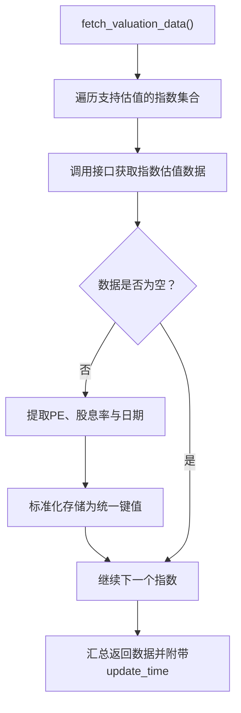
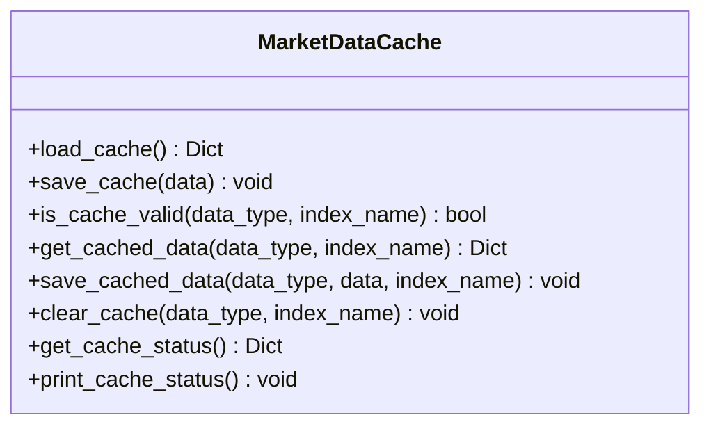
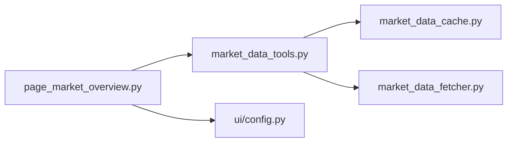

# 估值分析

<cite>
**本文引用的文件**
- [ui/components/page_market_overview.py](file://ui/components/page_market_overview.py)
- [market/market_data_tools.py](file://market/market_data_tools.py)
- [market/market_data_fetcher.py](file://market/market_data_fetcher.py)
- [ui/config.py](file://ui/config.py)
- [market/market_data_cache.py](file://market/market_data_cache.py)
- [tests/unit/ui/test_page_market_overview.py](file://tests/unit/ui/test_page_market_overview.py)
</cite>

## 目录
1. [简介](#简介)
2. [项目结构](#项目结构)
3. [核心组件](#核心组件)
4. [架构总览](#架构总览)
5. [详细组件分析](#详细组件分析)
6. [依赖关系分析](#依赖关系分析)
7. [性能考量](#性能考量)
8. [故障排查指南](#故障排查指南)
9. [结论](#结论)
10. [附录](#附录)

## 简介
本章节面向使用者与开发者，系统性介绍 xystock 的“估值分析”功能。该功能围绕多个中国 A 股指数（如沪深300、中证500、中证1000、中证2000、上证50、科创50 等）的市盈率（PE）与股息率（Dividend Yield）进行采集、处理与可视化展示。数据来源为中证指数公司（通过第三方库接口获取），并在 Streamlit 界面中以双列布局展示 PE 与股息率指标，并通过 expand 展开式提供估值水平分级与颜色标识。

## 项目结构
估值分析涉及 UI 展示层、数据工具层、数据抓取层与缓存层，以及配置与测试文件。下图展示了与估值分析直接相关的模块关系与数据流。

**图表来源**
- [ui/components/page_market_overview.py](file://ui/components/page_market_overview.py#L21-L104)
- [market/market_data_tools.py](file://market/market_data_tools.py#L67-L194)
- [market/market_data_fetcher.py](file://market/market_data_fetcher.py#L181-L245)
- [market/market_data_cache.py](file://market/market_data_cache.py#L120-L142)
- [ui/config.py](file://ui/config.py#L45-L81)
- [tests/unit/ui/test_page_market_overview.py](file://tests/unit/ui/test_page_market_overview.py#L75-L133)

**章节来源**
- [ui/components/page_market_overview.py](file://ui/components/page_market_overview.py#L21-L104)
- [market/market_data_tools.py](file://market/market_data_tools.py#L67-L194)
- [market/market_data_fetcher.py](file://market/market_data_fetcher.py#L181-L245)
- [market/market_data_cache.py](file://market/market_data_cache.py#L120-L142)
- [ui/config.py](file://ui/config.py#L45-L81)
- [tests/unit/ui/test_page_market_overview.py](file://tests/unit/ui/test_page_market_overview.py#L75-L133)

## 核心组件
- UI 展示组件：负责在 Streamlit 页面中渲染估值指标与分析结果，采用双列布局展示 PE 与股息率，并通过 st.metric 与 expand 展开式呈现估值水平分级与颜色标识。
- 数据工具组件：封装统一的数据获取入口，支持缓存控制、强制刷新与错误回退；提供指数到估值数据的映射与参考机制。
- 数据抓取组件：通过第三方库接口批量抓取多个指数的估值数据（PE 与股息率），并标准化存储。
- 缓存管理组件：定义不同数据类型的缓存有效期与序列化策略，保障性能与稳定性。
- 配置组件：提供关注指数清单与指数符号映射，支撑数据抓取与展示。

**章节来源**
- [ui/components/page_market_overview.py](file://ui/components/page_market_overview.py#L21-L104)
- [market/market_data_tools.py](file://market/market_data_tools.py#L67-L194)
- [market/market_data_fetcher.py](file://market/market_data_fetcher.py#L181-L245)
- [market/market_data_cache.py](file://market/market_data_cache.py#L120-L142)
- [ui/config.py](file://ui/config.py#L45-L81)

## 架构总览
下图展示了估值分析从 UI 到缓存与抓取的整体调用链路。

**图表来源**
- [ui/components/page_market_overview.py](file://ui/components/page_market_overview.py#L21-L104)
- [market/market_data_tools.py](file://market/market_data_tools.py#L67-L194)
- [market/market_data_fetcher.py](file://market/market_data_fetcher.py#L181-L245)
- [market/market_data_cache.py](file://market/market_data_cache.py#L192-L239)

## 详细组件分析

### UI 层：估值展示与交互
- 双列布局：左侧展示 PE 指标，右侧展示股息率指标，均使用 st.metric 组件，帮助快速识别数值与单位。
- expand 展开式：在展开区域中，依据 PE 与股息率阈值进行分级判断，并以颜色标识提示估值状态（极低估、低估、合理、偏高、高估；高股息、中等股息、低股息）。
- 数据来源说明：当指数估值非直接获取而是参考其他指数时，会显示参考说明，增强透明度。
- 时间戳：展示估值数据的获取时间，便于用户理解数据新鲜度。

**图表来源**
- [ui/components/page_market_overview.py](file://ui/components/page_market_overview.py#L21-L104)

**章节来源**
- [ui/components/page_market_overview.py](file://ui/components/page_market_overview.py#L21-L104)

### 数据工具层：统一获取与映射
- 统一入口：get_valuation_data 负责获取全部估值指标，支持 use_cache 与 force_refresh 控制缓存行为。
- 指数映射：get_index_valuation_data 将不同指数名称映射到统一的估值数据键前缀（如 hs300、zz500、zz1000、zz2000、上证50、科创50），并支持参考指数映射（如创业板指参考科创50，深证成指参考中证500 等）。
- 回退策略：若目标指数无直接估值数据，自动回退到沪深300作为参考，保证展示可用性。
- 标识字段：返回数据包含 original_index、reference_index、valuation_description、is_direct_valuation 等字段，便于 UI 展示与说明。

**图表来源**
- [market/market_data_tools.py](file://market/market_data_tools.py#L67-L194)

**章节来源**
- [market/market_data_tools.py](file://market/market_data_tools.py#L67-L194)

### 数据抓取层：批量获取与标准化
- 批量抓取：fetch_valuation_data 会遍历一组支持估值的指数代码（沪深300、中证500、中证1000、中证2000、上证50、科创50、沪深300成长、中证信息技术），逐个请求估值数据。
- 数据来源：数据来源于中证指数公司（通过第三方库接口获取），返回值包含 PE 与股息率，以及日期字段。
- 标准化存储：统一生成键名（如 hs300_pe、zz500_dividend_yield 等），同时保留兼容键（如 hs300_pe）以适配既有逻辑。
- 更新时间：在返回数据中附带 update_time，便于 UI 展示数据新鲜度。

**图表来源**
- [market/market_data_fetcher.py](file://market/market_data_fetcher.py#L181-L245)

**章节来源**
- [market/market_data_fetcher.py](file://market/market_data_fetcher.py#L181-L245)

### 缓存层：差异化过期与序列化
- 缓存配置：针对“估值指标”类型设置较长的有效期（分钟级），以减少频繁抓取带来的网络压力。
- 缓存键：区分指数相关与非指数相关数据，指数相关数据会在键名中附加指数名称，便于独立管理。
- 序列化：提供自定义 JSON 编码器，处理 numpy、pandas、datetime 等类型，确保缓存文件稳定可读。
- 状态查询：提供缓存状态查询与打印能力，便于调试与运维。

**图表来源**
- [market/market_data_cache.py](file://market/market_data_cache.py#L120-L439)

**章节来源**
- [market/market_data_cache.py](file://market/market_data_cache.py#L120-L439)

### 配置与映射：关注指数与符号映射
- 关注指数清单：FOCUS_INDICES 定义了 UI 默认展示的指数集合，覆盖大盘、中盘、小盘与成长板块。
- 符号映射：INDEX_SYMBOL_MAPPING 提供指数名称到查询符号的映射，用于后续技术分析与 K 线数据获取（虽然估值分析本身不直接使用该映射，但与整体数据体系一致）。

**章节来源**
- [ui/config.py](file://ui/config.py#L45-L81)

### 估值水平分级与颜色标识
- PE 分级：
  - 极低估：<12
  - 低估：<15
  - 合理：<18
  - 偏高：<25
  - 高估：≥25
- 股息率分级：
  - 高股息：>3%
  - 中等股息：>2%
  - 低股息：≤2%
- 颜色标识：使用 Emoji 表情与颜色搭配，直观提示估值状态。

**章节来源**
- [ui/components/page_market_overview.py](file://ui/components/page_market_overview.py#L66-L99)

## 依赖关系分析
- UI 层依赖数据工具层提供的 get_index_valuation_data 接口。
- 数据工具层依赖缓存管理器进行缓存命中与持久化。
- 数据工具层依赖数据抓取层获取原始估值数据。
- 配置层为 UI 与工具层提供指数清单与符号映射。

**图表来源**
- [ui/components/page_market_overview.py](file://ui/components/page_market_overview.py#L21-L104)
- [market/market_data_tools.py](file://market/market_data_tools.py#L67-L194)
- [market/market_data_fetcher.py](file://market/market_data_fetcher.py#L181-L245)
- [market/market_data_cache.py](file://market/market_data_cache.py#L120-L142)
- [ui/config.py](file://ui/config.py#L45-L81)

**章节来源**
- [ui/components/page_market_overview.py](file://ui/components/page_market_overview.py#L21-L104)
- [market/market_data_tools.py](file://market/market_data_tools.py#L67-L194)
- [market/market_data_fetcher.py](file://market/market_data_fetcher.py#L181-L245)
- [market/market_data_cache.py](file://market/market_data_cache.py#L120-L142)
- [ui/config.py](file://ui/config.py#L45-L81)

## 性能考量
- 缓存策略：估值指标缓存有效期较长，显著降低重复抓取成本；可通过 use_cache 与 force_refresh 控制缓存命中与刷新。
- 批量抓取：fetch_valuation_data 一次性抓取多个指数的估值数据，减少多次请求的网络开销。
- 数据清洗与序列化：缓存层对 numpy/pandas/datetime 等类型进行安全序列化，避免异常导致的缓存写入失败。
- UI 渲染：双列布局与 expand 展开式在数据量较小的情况下渲染高效，适合日常浏览。

**章节来源**
- [market/market_data_cache.py](file://market/market_data_cache.py#L120-L142)
- [market/market_data_tools.py](file://market/market_data_tools.py#L67-L84)
- [market/market_data_fetcher.py](file://market/market_data_fetcher.py#L181-L245)

## 故障排查指南
- 数据源不可用：
  - 现象：UI 显示“未获取到估值数据”，或 expand 展开式无内容。
  - 排查：检查网络连通性与第三方库接口可用性；确认 INDEX_SYMBOL_MAPPING 与指数名称是否匹配。
  - 回退：数据工具层在抓取失败时会尝试返回缓存数据；若无缓存则返回空字典。
- 缓存失效或过期：
  - 现象：展示数据较旧。
  - 处理：使用“刷新数据”按钮触发强制刷新；或手动清理缓存后重新抓取。
- 指数无直接估值数据：
  - 现象：展示“参考XX指数”的说明。
  - 处理：系统会自动回退到沪深300或相应参考指数数据，保证可用性。
- UI 展示异常：
  - 现象：PE 或股息率显示为 N/A。
  - 处理：检查返回数据中 index_pe 与 index_dividend_yield 字段是否存在；确认 get_index_valuation_data 的映射是否正确。

**章节来源**
- [market/market_data_tools.py](file://market/market_data_tools.py#L67-L84)
- [ui/components/page_market_overview.py](file://ui/components/page_market_overview.py#L21-L104)

## 结论
xystock 的估值分析模块通过清晰的分层设计实现了从数据抓取、缓存管理到 UI 展示的完整闭环。其核心优势在于：
- 支持多指数估值数据的批量抓取与统一存储；
- 提供指数映射与参考机制，增强展示的灵活性与鲁棒性；
- 在 Streamlit 中以直观的双列布局与 expand 展开式呈现估值水平分级与颜色标识；
- 通过差异化缓存策略提升性能与用户体验。

## 附录

### INDEX_SYMBOL_MAPPING 的作用
- 该映射主要用于技术分析与 K 线数据获取，确保不同指数名称与查询符号一致。
- 估值分析模块虽不直接使用该映射，但与整体数据体系保持一致，有助于跨模块协同。

**章节来源**
- [ui/config.py](file://ui/config.py#L70-L81)

### 估值数据获取、处理与展示全流程示例（路径指引）
- 获取估值数据：调用 get_valuation_data（由 UI 层间接调用 get_index_valuation_data）。
  - 示例路径：[获取估值数据](file://market/market_data_tools.py#L67-L84)
- 指数映射与参考：get_index_valuation_data 的指数映射与回退逻辑。
  - 示例路径：[指数映射与回退](file://market/market_data_tools.py#L85-L194)
- 批量抓取与标准化：fetch_valuation_data 的批量抓取与键名标准化。
  - 示例路径：[批量抓取与标准化](file://market/market_data_fetcher.py#L181-L245)
- UI 展示与分级：display_valuation_analysis 的双列布局与 expand 分级。
  - 示例路径：[UI 展示与分级](file://ui/components/page_market_overview.py#L21-L104)
- 缓存管理：is_cache_valid、save_cached_data 等缓存操作。
  - 示例路径：[缓存管理](file://market/market_data_cache.py#L192-L239)

### 常见问题与备用方案
- 数据源不可用时的备用方案：
  - 使用缓存数据回退；若无缓存则返回空字典，UI 展示“未获取到估值数据”。
  - 参考指数映射：当目标指数无直接估值数据时，自动回退到沪深300或相应参考指数。
- 性能优化建议：
  - 合理使用 use_cache 与 force_refresh 控制缓存命中与刷新；
  - 批量获取与缓存结合，减少重复抓取；
  - 对于高频访问场景，可考虑缩短刷新周期或增加缓存容量。

**章节来源**
- [market/market_data_tools.py](file://market/market_data_tools.py#L67-L84)
- [ui/components/page_market_overview.py](file://ui/components/page_market_overview.py#L21-L104)
- [market/market_data_cache.py](file://market/market_data_cache.py#L192-L239)