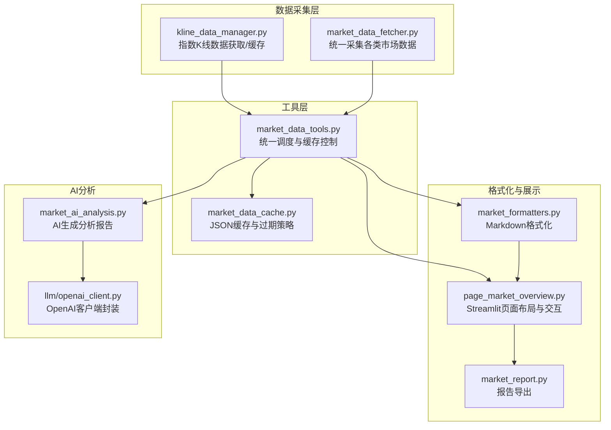
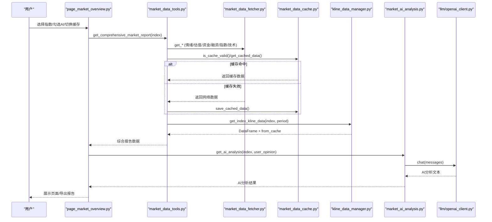
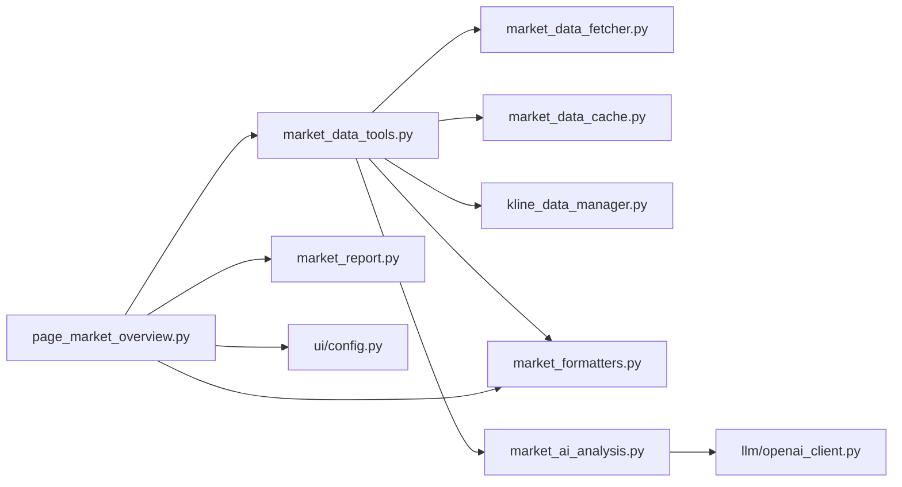

# 大盘分析

<cite>
**本文引用的文件**
- [market/market_data_fetcher.py](file://market/market_data_fetcher.py)
- [market/market_data_tools.py](file://market/market_data_tools.py)
- [market/market_ai_analysis.py](file://market/market_ai_analysis.py)
- [market/market_formatters.py](file://market/market_formatters.py)
- [market/market_report.py](file://market/market_report.py)
- [market/market_data_cache.py](file://market/market_data_cache.py)
- [market/kline_data_manager.py](file://market/kline_data_manager.py)
- [ui/components/page_market_overview.py](file://ui/components/page_market_overview.py)
- [ui/config.py](file://ui/config.py)
- [llm/openai_client.py](file://llm/openai_client.py)
</cite>

## 目录
1. [简介](#简介)
2. [项目结构](#项目结构)
3. [核心组件](#核心组件)
4. [架构总览](#架构总览)
5. [详细组件分析](#详细组件分析)
6. [依赖关系分析](#依赖关系分析)
7. [性能考量](#性能考量)
8. [故障排查指南](#故障排查指南)
9. [结论](#结论)
10. [附录](#附录)

## 简介
本文件系统性梳理 xystock 项目的“大盘分析”功能，围绕市场整体数据采集、统一缓存、格式化与展示、以及 AI 深度解读展开。重点覆盖以下方面：
- 指数走势、板块表现、估值水平、资金流向、融资融券、市场情绪、技术指标等全量数据链路
- market_data_fetcher.py 的数据采集逻辑与降级策略
- market_ai_analysis.py 如何结合大语言模型生成智能分析结论
- ui/components/page_market_overview.py 的页面布局与交互流程
- 实际代码示例的“路径引用”，帮助定位实现位置
- 子功能之间的关联性与如何通过 AI 增强传统金融指标的解读能力
- 常见问题（数据延迟、API 调用失败）的处理机制与性能优化建议（缓存）

## 项目结构
大盘分析功能由“数据采集层（fetcher）—工具层（tools）—缓存层（cache）—格式化层（formatters）—AI 分析层（ai_analysis）—UI 展示层（page_market_overview）—报告导出（market_report）”组成，形成闭环的数据流与可视化体验。

图表来源
- [market/market_data_fetcher.py](file://market/market_data_fetcher.py#L1-L607)
- [market/market_data_tools.py](file://market/market_data_tools.py#L1-L519)
- [market/market_data_cache.py](file://market/market_data_cache.py#L1-L440)
- [market/kline_data_manager.py](file://market/kline_data_manager.py#L1-L330)
- [market/market_formatters.py](file://market/market_formatters.py#L1-L939)
- [market/market_ai_analysis.py](file://market/market_ai_analysis.py#L1-L123)
- [llm/openai_client.py](file://llm/openai_client.py#L1-L297)
- [ui/components/page_market_overview.py](file://ui/components/page_market_overview.py#L1-L758)
- [market/market_report.py](file://market/market_report.py#L1-L114)

章节来源
- [ui/config.py](file://ui/config.py#L45-L82)

## 核心组件
- 数据采集层（market_data_fetcher.py）
  - 提供市场情绪、涨跌停、估值、资金流向、融资融券、指数实时、技术指标等采集函数；内置多源降级策略，避免频繁请求导致 IP 封禁。
- 工具层（market_data_tools.py）
  - 统一调度采集与缓存，提供 get_* 系列方法，支持 use_cache/force_refresh 控制；负责组合综合报告与 AI 分析。
- 缓存层（market_data_cache.py）
  - JSON 文件缓存，按数据类型设定差异化过期时间；支持指数相关与非指数相关两类缓存键管理。
- K线管理（kline_data_manager.py）
  - 通过 akshare 获取指数日线数据，统一转换为 KLineData 列表并缓存；提供批量更新与均线计算。
- 格式化层（market_formatters.py）
  - 统一的 Markdown 格式化器，涵盖市场情绪、估值、资金流向、融资融券、新闻、技术指标摘要、AI 分析等。
- AI 分析（market_ai_analysis.py）
  - 基于 OpenAI 客户端生成指数 AI 分析报告，支持新闻开关与用户观点整合。
- UI 展示（page_market_overview.py）
  - Streamlit 页面，组织“指数走势、技术指标、基本面、情绪、资讯、综合摘要”等标签页；支持缓存开关、刷新缓存、导出报告。
- 报告导出（market_report.py）
  - 将综合报告与 AI 分析打包导出 PDF/DOCX/HTML/MARKDOWN。

章节来源
- [market/market_data_fetcher.py](file://market/market_data_fetcher.py#L1-L607)
- [market/market_data_tools.py](file://market/market_data_tools.py#L1-L519)
- [market/market_data_cache.py](file://market/market_data_cache.py#L1-L440)
- [market/kline_data_manager.py](file://market/kline_data_manager.py#L1-L330)
- [market/market_formatters.py](file://market/market_formatters.py#L1-L939)
- [market/market_ai_analysis.py](file://market/market_ai_analysis.py#L1-L123)
- [ui/components/page_market_overview.py](file://ui/components/page_market_overview.py#L1-L758)
- [market/market_report.py](file://market/market_report.py#L1-L114)

## 架构总览
大盘分析采用“分层解耦 + 统一调度 + 智能缓存 + AI 增强”的设计，数据从采集层经工具层统一调度，写入缓存，再由格式化层统一渲染，最终在 UI 展示并可导出报告。

图表来源
- [ui/components/page_market_overview.py](file://ui/components/page_market_overview.py#L627-L758)
- [market/market_data_tools.py](file://market/market_data_tools.py#L421-L495)
- [market/market_data_fetcher.py](file://market/market_data_fetcher.py#L286-L607)
- [market/market_data_cache.py](file://market/market_data_cache.py#L120-L246)
- [market/kline_data_manager.py](file://market/kline_data_manager.py#L152-L200)
- [market/market_ai_analysis.py](file://market/market_ai_analysis.py#L1-L123)
- [llm/openai_client.py](file://llm/openai_client.py#L72-L176)

## 详细组件分析

### 数据采集层：market_data_fetcher.py
- 市场情绪（fetch_market_sentiment）
  - 优先使用乐咕乐股的市场活跃度数据；失败则回退到概念板块汇总；再失败则回退到资金流向推断情绪；最终失败记录错误。
- 涨跌停明细（fetch_limit_stocks_data）
  - 获取当日涨停/跌停股票数量与原因分布，异常时记录告警。
- 估值水平（fetch_valuation_data）
  - 针对沪深300、中证500、中证1000、中证2000、上证50、科创50、沪深300成长、中证信息技术等指数获取估值指标（PE、股息率），并兼容历史键名。
- 资金流向（fetch_money_flow_data）
  - 获取M2货币供应量、同比增长等宏观流动性指标。
- 指数实时（fetch_current_indices）
  - 获取沪深重要指数的实时行情（最新价、涨跌幅、成交量、振幅等），并按关注指数集合过滤。
- 融资融券（fetch_margin_data_unified）
  - 统一获取上交所/深交所融资融券余额、融资买入、融券卖出，并计算周变化与变化率。
- 综合情绪（fetch_comprehensive_market_sentiment）
  - 聚合基础情绪、涨跌停分析、资金流向，计算综合评分与情绪等级，并给出可信度。
- 技术指标（fetch_index_technical_indicators）
  - 通过 K 线管理器获取指数 K 线，计算技术指标与风险指标，返回给 UI。

章节来源
- [market/market_data_fetcher.py](file://market/market_data_fetcher.py#L24-L135)
- [market/market_data_fetcher.py](file://market/market_data_fetcher.py#L138-L179)
- [market/market_data_fetcher.py](file://market/market_data_fetcher.py#L181-L245)
- [market/market_data_fetcher.py](file://market/market_data_fetcher.py#L248-L283)
- [market/market_data_fetcher.py](file://market/market_data_fetcher.py#L286-L355)
- [market/market_data_fetcher.py](file://market/market_data_fetcher.py#L358-L449)
- [market/market_data_fetcher.py](file://market/market_data_fetcher.py#L463-L566)
- [market/market_data_fetcher.py](file://market/market_data_fetcher.py#L568-L607)

### 工具层：market_data_tools.py
- 统一缓存控制
  - get_market_sentiment/get_valuation_data/get_money_flow_data/get_margin_data/get_current_indices/get_index_technical_indicators/get_index_kline_data 等均支持 use_cache/force_refresh。
- 指数估值映射
  - get_index_valuation_data 将不同指数映射到统一的估值键，支持参考估值与直接估值。
- AI 分析
  - get_ai_analysis 支持缓存有效性校验与用户观点一致性判断；_generate_ai_analysis 调用 market_ai_analysis 生成报告并写入缓存。
- 综合报告
  - get_comprehensive_market_report 汇聚技术指标、情绪、估值、资金、融资、新闻等，形成统一报告结构。

章节来源
- [market/market_data_tools.py](file://market/market_data_tools.py#L30-L115)
- [market/market_data_tools.py](file://market/market_data_tools.py#L116-L195)
- [market/market_data_tools.py](file://market/market_data_tools.py#L196-L231)
- [market/market_data_tools.py](file://market/market_data_tools.py#L232-L249)
- [market/market_data_tools.py](file://market/market_data_tools.py#L250-L272)
- [market/market_data_tools.py](file://market/market_data_tools.py#L273-L306)
- [market/market_data_tools.py](file://market/market_data_tools.py#L307-L351)
- [market/market_data_tools.py](file://market/market_data_tools.py#L352-L378)
- [market/market_data_tools.py](file://market/market_data_tools.py#L379-L495)
- [market/market_data_tools.py](file://market/market_data_tools.py#L421-L455)

### 缓存层：market_data_cache.py
- 缓存键命名规则
  - 非指数相关：直接以数据类型为键；指数相关：以 data_type_index_name 为键。
- 过期策略
  - market_sentiment/comprehensive_sentiment: 15 分钟；valuation_indicators: 24 小时；money_flow_indicators: 30 天；margin_detail: 60 分钟；current_indices: 5 分钟；ai_analysis: 3 小时；technical_indicators: 60 分钟。
- 数据清洗
  - NumpyJSONEncoder 递归清理 NaN/Inf，确保 JSON 可序列化。
- 状态查询
  - get_cache_status 支持指数维度与非指数维度的缓存有效性与剩余时间统计。

章节来源
- [market/market_data_cache.py](file://market/market_data_cache.py#L120-L246)
- [market/market_data_cache.py](file://market/market_data_cache.py#L247-L295)
- [market/market_data_cache.py](file://market/market_data_cache.py#L296-L430)

### K线管理：kline_data_manager.py
- 原始数据获取
  - 通过 akshare 获取指数日线，限定列类型与日期格式。
- 缓存与转换
  - KLineData 列表与 DataFrame 双向转换；支持 for_technical_analysis 设置索引。
- 缓存更新
  - update_index_cache/batch_update_indices_cache 支持批量更新与智能合并。
- 均线计算
  - add_moving_averages 计算 MA5/MA10/MA20/MA60。

章节来源
- [market/kline_data_manager.py](file://market/kline_data_manager.py#L30-L64)
- [market/kline_data_manager.py](file://market/kline_data_manager.py#L65-L151)
- [market/kline_data_manager.py](file://market/kline_data_manager.py#L152-L201)
- [market/kline_data_manager.py](file://market/kline_data_manager.py#L202-L266)
- [market/kline_data_manager.py](file://market/kline_data_manager.py#L267-L296)

### 格式化层：market_formatters.py
- 市场情绪格式化
  - format_sentiment_data 支持详细/简单两版，输出评分、涨跌家数、涨跌停、资金流向与解读。
- 估值/资金/融资融券/新闻/技术摘要/AI分析等
  - 提供统一的 Markdown 模板与指标过滤、格式化工具。
- 摘要报告
  - format_summary_report 将技术趋势、融资余额、PE、M2 增速等关键指标汇总为摘要卡片。

章节来源
- [market/market_formatters.py](file://market/market_formatters.py#L106-L368)
- [market/market_formatters.py](file://market/market_formatters.py#L370-L451)
- [market/market_formatters.py](file://market/market_formatters.py#L452-L513)
- [market/market_formatters.py](file://market/market_formatters.py#L561-L647)
- [market/market_formatters.py](file://market/market_formatters.py#L575-L618)

### AI 分析：market_ai_analysis.py
- 输入数据
  - 从 MarketTextFormatter.format_data_for_ai_analysis 获取统一格式的市场数据文本。
- 系统消息与提示词
  - 根据新闻开关动态调整分析维度；支持用户观点整合。
- 调用 LLM
  - 通过 OpenAIClient.chat 发起多轮对话，返回 AI 分析文本与时间戳。
- 请求缓存
  - 将系统消息与用户消息写入 data/cache/req_market.txt 便于调试。

章节来源
- [market/market_ai_analysis.py](file://market/market_ai_analysis.py#L1-L123)
- [llm/openai_client.py](file://llm/openai_client.py#L72-L176)

### UI 展示：page_market_overview.py
- 页面布局
  - 顶部：指数选择、AI 开关、缓存开关、开始分析/刷新数据按钮。
  - 标签页：指数走势、技术指标、市场基本面（估值、资金、融资）、市场情绪、市场资讯、综合摘要。
- 数据展示
  - 指数走势：K线图与成交量；技术指标：MA/MACD/RSI 等；基本面：PE、股息率、M2、融资融券；情绪：综合评分与解读；资讯：新闻列表；摘要：AI 报告与综合评级。
- 交互流程
  - 点击“开始分析”后，按标签页顺序拉取数据；AI 分析在需要时触发；支持导出报告。

章节来源
- [ui/components/page_market_overview.py](file://ui/components/page_market_overview.py#L627-L758)
- [ui/components/page_market_overview.py](file://ui/components/page_market_overview.py#L301-L362)
- [ui/components/page_market_overview.py](file://ui/components/page_market_overview.py#L537-L597)
- [ui/components/page_market_overview.py](file://ui/components/page_market_overview.py#L221-L300)
- [ui/components/page_market_overview.py](file://ui/components/page_market_overview.py#L152-L220)
- [ui/components/page_market_overview.py](file://ui/components/page_market_overview.py#L180-L220)

### 报告导出：market_report.py
- 组装数据
  - 调用 get_comprehensive_market_report 与 get_ai_analysis（可选）组装报告数据。
- 格式化
  - 通过 MarketTextFormatter.format_data_for_report 生成 Markdown。
- 导出
  - 支持 PDF/DOCX/HTML/MARKDOWN 四种格式。

章节来源
- [market/market_report.py](file://market/market_report.py#L13-L87)

## 依赖关系分析
- 组件耦合
  - market_data_tools 依赖 market_data_fetcher、market_data_cache、kline_data_manager、market_formatters、config_manager。
  - page_market_overview 依赖 market_data_tools、market_formatters、ui.config。
  - market_ai_analysis 依赖 market_formatters、config_manager、llm.openai_client。
- 外部依赖
  - akshare（数据源）、OpenAI（LLM 接口）、Streamlit（UI）、pandas/numpy（数据处理）。

图表来源
- [ui/components/page_market_overview.py](file://ui/components/page_market_overview.py#L1-L758)
- [market/market_data_tools.py](file://market/market_data_tools.py#L1-L519)
- [market/market_data_fetcher.py](file://market/market_data_fetcher.py#L1-L607)
- [market/market_data_cache.py](file://market/market_data_cache.py#L1-L440)
- [market/kline_data_manager.py](file://market/kline_data_manager.py#L1-L330)
- [market/market_formatters.py](file://market/market_formatters.py#L1-L939)
- [market/market_ai_analysis.py](file://market/market_ai_analysis.py#L1-L123)
- [llm/openai_client.py](file://llm/openai_client.py#L1-L297)
- [ui/config.py](file://ui/config.py#L45-L82)

## 性能考量
- 缓存策略
  - 不同数据类型设置差异化过期时间，避免热点数据频繁刷新；指数相关与非指数相关分别管理键空间。
- 数据去重与降级
  - 市场情绪采集三段式降级，防止 IP 封禁；资金流向与板块汇总互为后备。
- K线缓存与批量更新
  - K 线数据统一转换为 KLineData 列表并缓存，支持批量更新与智能合并，减少网络请求。
- UI 侧缓存开关
  - 用户可一键切换 use_cache/force_refresh，提升交互效率。
- JSON 序列化优化
  - 自定义 NumpyJSONEncoder 清理 NaN/Inf，避免序列化失败与缓存损坏。

章节来源
- [market/market_data_cache.py](file://market/market_data_cache.py#L132-L141)
- [market/market_data_fetcher.py](file://market/market_data_fetcher.py#L24-L135)
- [market/kline_data_manager.py](file://market/kline_data_manager.py#L152-L201)
- [ui/components/page_market_overview.py](file://ui/components/page_market_overview.py#L627-L758)

## 故障排查指南
- 数据延迟
  - 检查缓存是否命中（print 日志与 get_cache_status）。若缓存过期，尝试刷新缓存或关闭 use_cache。
- API 调用失败
  - market_data_fetcher 的各采集函数均捕获异常并记录错误；可查看“所有数据源都失败”等提示。
- LLM 调用失败
  - llm/openai_client.py 提供统一错误记录与日志；检查 API Key、Base URL、超时与重试配置。
- UI 无数据显示
  - 确认 selected_index 是否在 ui/config.py 的 FOCUS_INDICES 中；检查 session_state 中的缓存开关与刷新逻辑。

章节来源
- [market/market_data_fetcher.py](file://market/market_data_fetcher.py#L24-L135)
- [market/market_data_fetcher.py](file://market/market_data_fetcher.py#L358-L449)
- [llm/openai_client.py](file://llm/openai_client.py#L177-L197)
- [ui/components/page_market_overview.py](file://ui/components/page_market_overview.py#L627-L758)
- [ui/config.py](file://ui/config.py#L45-L82)

## 结论
大盘分析模块通过“采集—工具—缓存—格式化—AI—UI—导出”的完整链路，实现了对市场整体的多维度观测与智能解读。其关键优势在于：
- 多源降级与差异化缓存，兼顾稳定性与性能
- 统一的数据格式化与 UI 布局，提升可读性与可维护性
- AI 分析与传统指标的融合，增强对复杂市场的洞察力

## 附录

### 实际代码示例（路径引用）
- 获取市场情绪（含综合评分）
  - [fetch_market_sentiment](file://market/market_data_fetcher.py#L24-L135)
  - [fetch_comprehensive_market_sentiment](file://market/market_data_fetcher.py#L463-L566)
- 获取估值数据与指数映射
  - [fetch_valuation_data](file://market/market_data_fetcher.py#L181-L245)
  - [get_index_valuation_data](file://market/market_data_tools.py#L85-L195)
- 资金流向与融资融券
  - [fetch_money_flow_data](file://market/market_data_fetcher.py#L248-L283)
  - [fetch_margin_data_unified](file://market/market_data_fetcher.py#L358-L449)
- 指数实时与技术指标
  - [fetch_current_indices](file://market/market_data_fetcher.py#L286-L355)
  - [fetch_index_technical_indicators](file://market/market_data_fetcher.py#L568-L607)
- K线数据获取与缓存
  - [get_index_kline_data](file://market/kline_data_manager.py#L152-L201)
  - [update_index_cache](file://market/kline_data_manager.py#L202-L231)
- 统一调度与缓存控制
  - [MarketTools.get_*](file://market/market_data_tools.py#L39-L115)
  - [MarketTools.get_comprehensive_market_report](file://market/market_data_tools.py#L421-L455)
- AI 分析与 LLM 调用
  - [generate_index_analysis_report](file://market/market_ai_analysis.py#L14-L123)
  - [OpenAIClient.chat](file://llm/openai_client.py#L198-L231)
- UI 展示与交互
  - [display_market_overview](file://ui/components/page_market_overview.py#L627-L758)
  - [display_market_technical_analysis](file://ui/components/page_market_overview.py#L537-L597)
- 报告导出
  - [write_market_report](file://market/market_report.py#L13-L87)