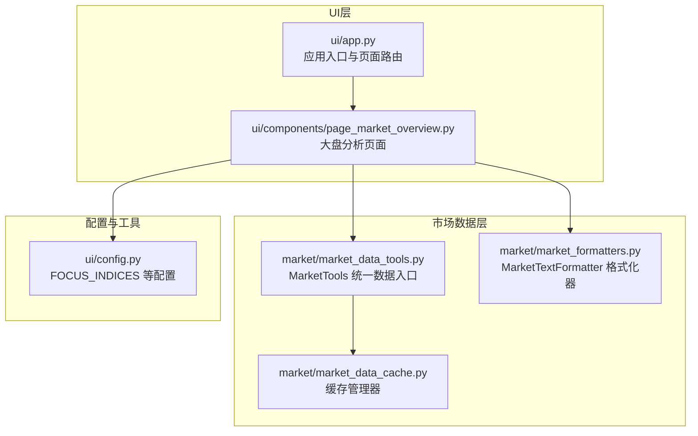
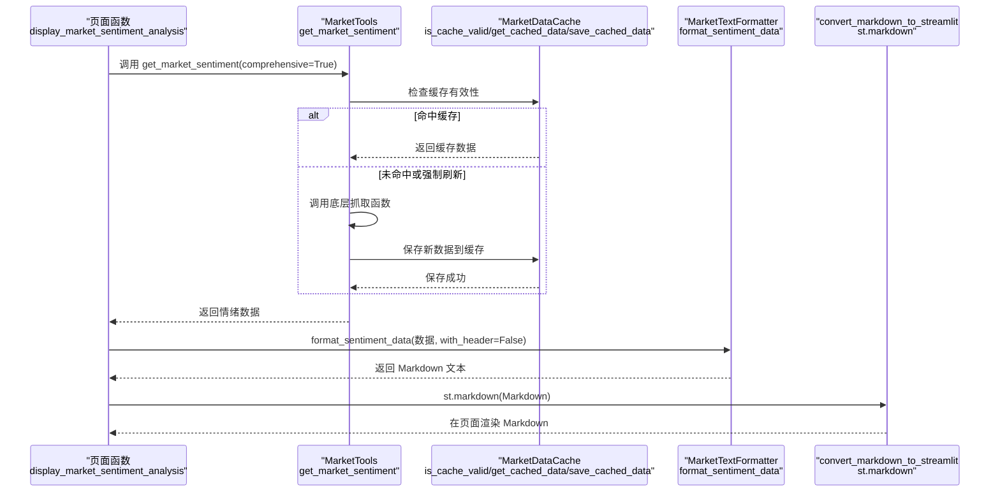
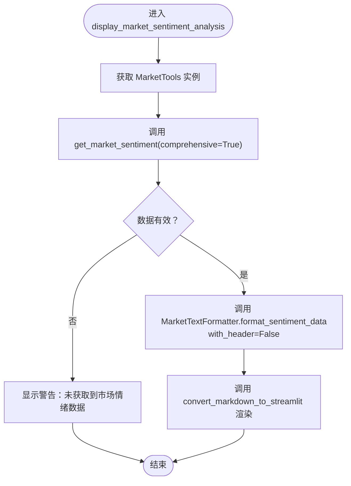
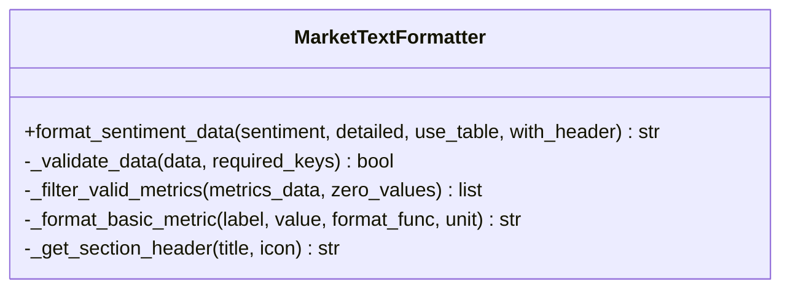
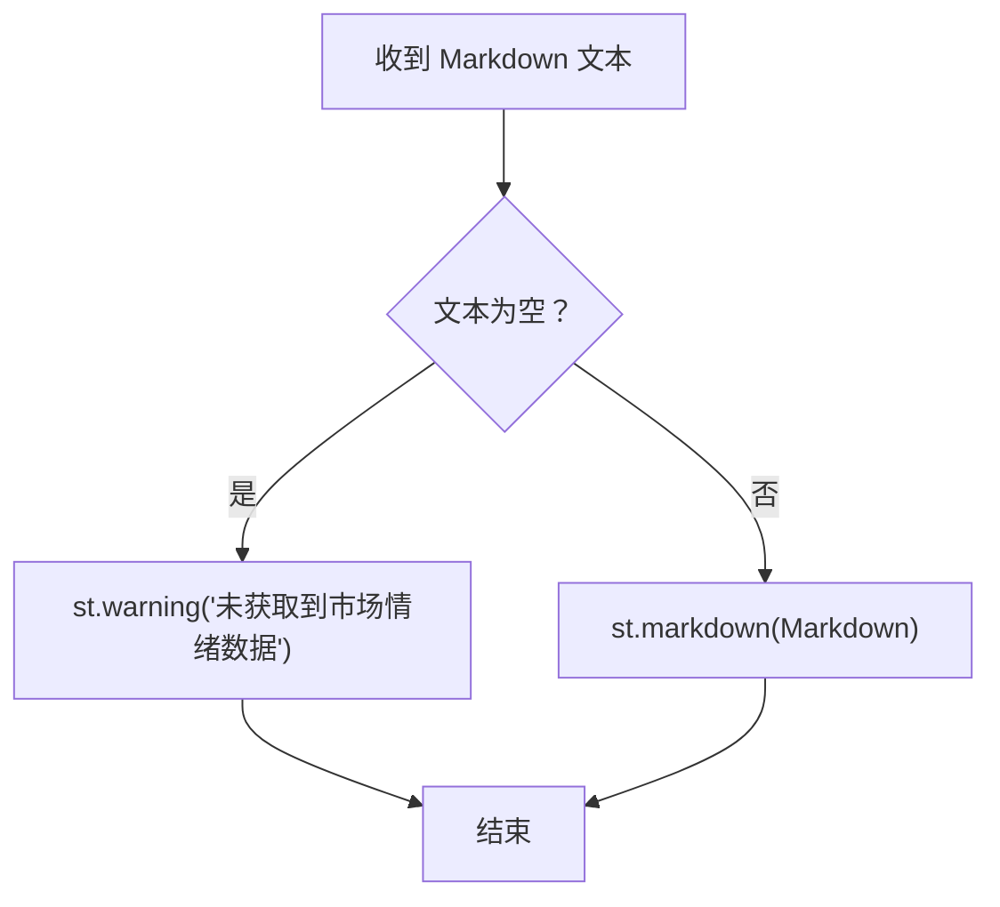
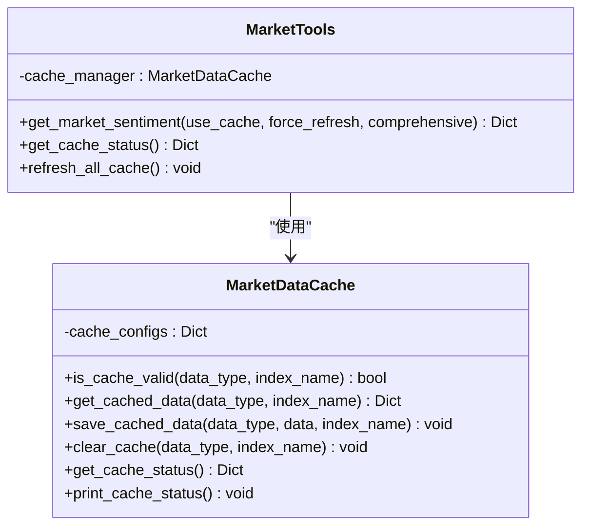
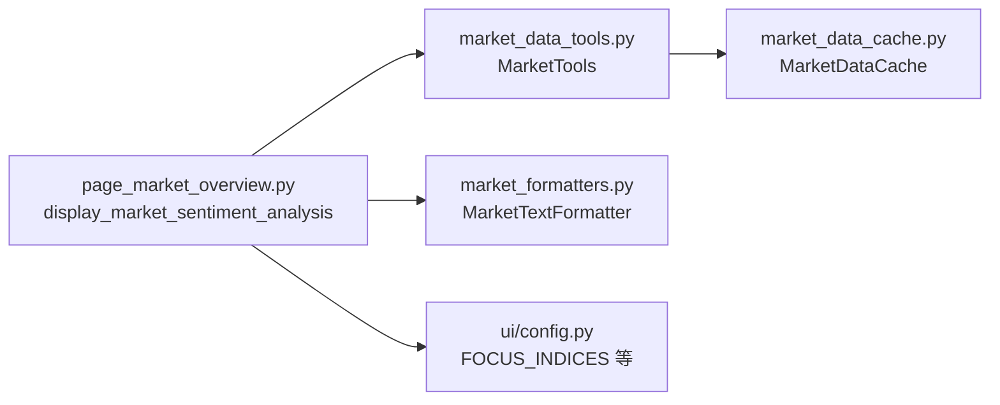

# 前端渲染

<cite>
**本文引用的文件**
- [ui/components/page_market_overview.py](file://ui/components/page_market_overview.py)
- [market/market_formatters.py](file://market/market_formatters.py)
- [market/market_data_tools.py](file://market/market_data_tools.py)
- [market/market_data_cache.py](file://market/market_data_cache.py)
- [ui/app.py](file://ui/app.py)
- [ui/config.py](file://ui/config.py)
</cite>

## 目录
1. [简介](#简介)
2. [项目结构](#项目结构)
3. [核心组件](#核心组件)
4. [架构总览](#架构总览)
5. [详细组件分析](#详细组件分析)
6. [依赖关系分析](#依赖关系分析)
7. [性能考量](#性能考量)
8. [故障排查指南](#故障排查指南)
9. [结论](#结论)

## 简介
本文聚焦“市场情绪数据在Streamlit前端的渲染流程”，围绕以下目标展开：
- 展示 display_market_sentiment_analysis 如何通过 get_market_tools 获取市场工具实例，调用 get_market_sentiment 方法获取情绪数据，并验证数据完整性。
- 说明从 market_formatters 导入 MarketTextFormatter 后，如何调用 format_sentiment_data 方法生成 Markdown 内容；以及 convert_markdown_to_streamlit 如何通过 st.markdown 直接渲染 Markdown 文本。
- 解释响应式设计如何通过 st.columns 与容器布局适配不同屏幕尺寸。
- 描述错误处理机制：当数据获取失败时如何显示警告信息。
- 提供使用示例路径，阐述 with_header 参数如何控制标题显示，并解释数据缓存机制对渲染性能的影响。

## 项目结构
本项目采用“功能分层 + 组件化”的组织方式：
- ui 层负责前端交互与页面渲染（Streamlit）。
- market 层封装市场数据获取、缓存与格式化。
- utils 层提供通用工具与格式化辅助。
- tests 层包含单元测试与集成测试。

图表来源
- [ui/app.py](file://ui/app.py#L1-L229)
- [ui/components/page_market_overview.py](file://ui/components/page_market_overview.py#L1-L758)
- [market/market_data_tools.py](file://market/market_data_tools.py#L1-L519)
- [market/market_data_cache.py](file://market/market_data_cache.py#L1-L440)
- [market/market_formatters.py](file://market/market_formatters.py#L1-L939)
- [ui/config.py](file://ui/config.py#L1-L82)

章节来源
- [ui/app.py](file://ui/app.py#L1-L229)
- [ui/components/page_market_overview.py](file://ui/components/page_market_overview.py#L1-L758)
- [market/market_data_tools.py](file://market/market_data_tools.py#L1-L519)
- [market/market_data_cache.py](file://market/market_data_cache.py#L1-L440)
- [market/market_formatters.py](file://market/market_formatters.py#L1-L939)
- [ui/config.py](file://ui/config.py#L1-L82)

## 核心组件
- MarketTools：统一的市场数据访问入口，封装 get_market_sentiment、缓存读写、错误回退等逻辑。
- MarketTextFormatter：统一的 Markdown 格式化器，提供 format_sentiment_data 等方法。
- 页面渲染函数：display_market_sentiment_analysis 负责调用 MarketTools 获取情绪数据，调用 MarketTextFormatter 生成 Markdown，再由 convert_markdown_to_streamlit 渲染。
- 缓存管理器：MarketDataCache 提供差异化过期策略与 JSON 序列化兼容处理。
- UI 配置：FOCUS_INDICES 等配置影响页面布局与数据来源。

章节来源
- [market/market_data_tools.py](file://market/market_data_tools.py#L1-L519)
- [market/market_formatters.py](file://market/market_formatters.py#L1-L939)
- [ui/components/page_market_overview.py](file://ui/components/page_market_overview.py#L1-L758)
- [market/market_data_cache.py](file://market/market_data_cache.py#L1-L440)
- [ui/config.py](file://ui/config.py#L1-L82)

## 架构总览
下图展示了从 UI 调用到数据渲染的关键链路。

图表来源
- [ui/components/page_market_overview.py](file://ui/components/page_market_overview.py#L162-L178)
- [market/market_data_tools.py](file://market/market_data_tools.py#L39-L66)
- [market/market_data_cache.py](file://market/market_data_cache.py#L192-L246)
- [market/market_formatters.py](file://market/market_formatters.py#L105-L170)

## 详细组件分析

### 组件A：市场情绪渲染流程（display_market_sentiment_analysis）
- 入口函数：display_market_sentiment_analysis
- 步骤：
  1) 通过 get_market_tools 获取 MarketTools 实例。
  2) 调用 get_market_sentiment(use_cache=True, comprehensive=True) 获取综合市场情绪数据。
  3) 若返回数据为空或包含 error 字段，则显示警告提示。
  4) 从 market_formatters 导入 MarketTextFormatter，调用 format_sentiment_data(sentiment_data, with_header=False) 生成 Markdown 文本。
  5) 调用 convert_markdown_to_streamlit(markdown_text, sentiment_data) 渲染 Markdown。
- with_header 参数说明：format_sentiment_data 支持 with_header 控制是否输出章节标题；在页面函数中传入 False，避免重复标题层级。

图表来源
- [ui/components/page_market_overview.py](file://ui/components/page_market_overview.py#L162-L178)
- [market/market_formatters.py](file://market/market_formatters.py#L105-L170)

章节来源
- [ui/components/page_market_overview.py](file://ui/components/page_market_overview.py#L162-L178)

### 组件B：MarketTextFormatter.format_sentiment_data
- 功能：将情绪数据结构化为 Markdown 文本，支持详细/简要两种模式，支持表格/文本两种展示方式。
- 关键点：
  - 数据校验：内部使用 _validate_data 检查数据有效性。
  - 标题控制：with_header 控制是否输出章节标题。
  - 指标过滤：_filter_valid_metrics 过滤无效指标，避免显示 N/A。
  - 输出：返回完整的 Markdown 字符串，供渲染函数使用。

图表来源
- [market/market_formatters.py](file://market/market_formatters.py#L19-L120)
- [market/market_formatters.py](file://market/market_formatters.py#L105-L369)

章节来源
- [market/market_formatters.py](file://market/market_formatters.py#L105-L369)

### 组件C：convert_markdown_to_streamlit 渲染
- 功能：接收 Markdown 文本，若为空则显示警告；否则直接调用 st.markdown 渲染。
- 作用：将 MarketTextFormatter 生成的 Markdown 文本在 Streamlit 页面中展示。

图表来源
- [ui/components/page_market_overview.py](file://ui/components/page_market_overview.py#L152-L159)

章节来源
- [ui/components/page_market_overview.py](file://ui/components/page_market_overview.py#L152-L159)

### 组件D：MarketTools.get_market_sentiment 与缓存
- 功能：根据 use_cache 和 force_refresh 决策是否命中缓存；若未命中则抓取并保存缓存；异常时回退到缓存或返回空字典。
- 缓存配置：MarketDataCache.cache_configs 定义了不同数据类型的过期分钟数，情绪数据默认 15 分钟。
- JSON 兼容：NumpyJSONEncoder 清理 NaN/无穷大等特殊值，确保缓存可序列化。

图表来源
- [market/market_data_tools.py](file://market/market_data_tools.py#L39-L66)
- [market/market_data_cache.py](file://market/market_data_cache.py#L132-L141)
- [market/market_data_cache.py](file://market/market_data_cache.py#L192-L246)

章节来源
- [market/market_data_tools.py](file://market/market_data_tools.py#L39-L66)
- [market/market_data_cache.py](file://market/market_data_cache.py#L132-L141)
- [market/market_data_cache.py](file://market/market_data_cache.py#L192-L246)

### 组件E：响应式设计与布局
- 页面通过 st.columns(3) 等方式实现多列布局，自动适配不同屏幕宽度。
- 页面容器与 expander 结合，保证在窄屏设备上也能良好展示。
- 通过 st.metric、st.caption 等组件组合，形成紧凑而清晰的信息密度。

章节来源
- [ui/components/page_market_overview.py](file://ui/components/page_market_overview.py#L326-L359)
- [ui/components/page_market_overview.py](file://ui/components/page_market_overview.py#L115-L149)

### 组件F：错误处理机制
- 数据获取失败：当 get_market_sentiment 返回空或包含 error 字段时，页面显示 st.warning。
- 异常捕获：MarketTools 在抓取过程中捕获异常并回退缓存或返回空字典。
- UI 层兜底：convert_markdown_to_streamlit 对空 Markdown 文本也进行警告提示。

章节来源
- [ui/components/page_market_overview.py](file://ui/components/page_market_overview.py#L169-L171)
- [market/market_data_tools.py](file://market/market_data_tools.py#L63-L66)
- [ui/components/page_market_overview.py](file://ui/components/page_market_overview.py#L154-L159)

## 依赖关系分析
- 页面函数依赖 MarketTools 获取数据，依赖 MarketTextFormatter 生成 Markdown，依赖 UI 配置（如 FOCUS_INDICES）。
- MarketTools 依赖 MarketDataCache 进行缓存管理，依赖底层抓取函数获取真实数据。
- MarketTextFormatter 依赖 utils/format_utils 与 config_manager 提供的工具与配置。

图表来源
- [ui/components/page_market_overview.py](file://ui/components/page_market_overview.py#L162-L178)
- [market/market_data_tools.py](file://market/market_data_tools.py#L1-L519)
- [market/market_formatters.py](file://market/market_formatters.py#L1-L939)
- [market/market_data_cache.py](file://market/market_data_cache.py#L1-L440)
- [ui/config.py](file://ui/config.py#L1-L82)

章节来源
- [ui/components/page_market_overview.py](file://ui/components/page_market_overview.py#L162-L178)
- [market/market_data_tools.py](file://market/market_data_tools.py#L1-L519)
- [market/market_formatters.py](file://market/market_formatters.py#L1-L939)
- [market/market_data_cache.py](file://market/market_data_cache.py#L1-L440)
- [ui/config.py](file://ui/config.py#L1-L82)

## 性能考量
- 缓存命中率：MarketDataCache 为情绪数据设置 15 分钟过期，高频访问场景下可显著减少网络请求与解析开销。
- 数据序列化：NumpyJSONEncoder 清理 NaN/无穷大等特殊值，避免缓存损坏与序列化失败。
- UI 渲染：st.markdown 直接渲染 Markdown，避免额外的二次处理成本。
- 会话状态：页面通过 st.session_state 控制 use_cache 与强制刷新，减少不必要的网络往返。

章节来源
- [market/market_data_cache.py](file://market/market_data_cache.py#L132-L141)
- [market/market_data_cache.py](file://market/market_data_cache.py#L192-L246)
- [market/market_data_tools.py](file://market/market_data_tools.py#L39-L66)
- [ui/components/page_market_overview.py](file://ui/components/page_market_overview.py#L642-L675)

## 故障排查指南
- 未获取到市场情绪数据
  - 现象：页面显示“未获取到市场情绪数据”警告。
  - 排查：确认 MarketTools.get_market_sentiment 返回值是否包含 error；检查缓存是否过期；查看底层抓取函数是否抛出异常。
  - 参考路径：
    - [ui/components/page_market_overview.py](file://ui/components/page_market_overview.py#L169-L171)
    - [market/market_data_tools.py](file://market/market_data_tools.py#L63-L66)
- 缓存异常或损坏
  - 现象：缓存读取失败或数据异常。
  - 排查：检查 MarketDataCache.load_cache/save_cache 是否报错；确认 NumpyJSONEncoder.clean_data 是否正确清理特殊值。
  - 参考路径：
    - [market/market_data_cache.py](file://market/market_data_cache.py#L144-L179)
    - [market/market_data_cache.py](file://market/market_data_cache.py#L218-L239)
- Markdown 渲染为空
  - 现象：页面空白或仅警告。
  - 排查：确认 MarketTextFormatter.format_sentiment_data 返回值是否为空；检查 with_header 参数与数据字段是否匹配。
  - 参考路径：
    - [market/market_formatters.py](file://market/market_formatters.py#L105-L170)
    - [ui/components/page_market_overview.py](file://ui/components/page_market_overview.py#L154-L159)

章节来源
- [ui/components/page_market_overview.py](file://ui/components/page_market_overview.py#L152-L171)
- [market/market_data_tools.py](file://market/market_data_tools.py#L63-L66)
- [market/market_data_cache.py](file://market/market_data_cache.py#L144-L179)
- [market/market_data_cache.py](file://market/market_data_cache.py#L218-L239)
- [market/market_formatters.py](file://market/market_formatters.py#L105-L170)

## 结论
- 市场情绪数据在前端的渲染流程清晰、可控：页面函数负责编排，MarketTools 负责数据获取与缓存，MarketTextFormatter 负责结构化输出，convert_markdown_to_streamlit 负责最终渲染。
- with_header 参数可灵活控制标题层级，避免重复标题层级导致的阅读负担。
- 响应式布局通过 st.columns 与容器组件自然适配不同屏幕尺寸。
- 错误处理机制完善：数据为空或异常时均能及时提示，保障用户体验。
- 缓存机制显著提升渲染性能，建议在高频访问场景下优先使用缓存，必要时通过“刷新数据”按钮强制刷新。