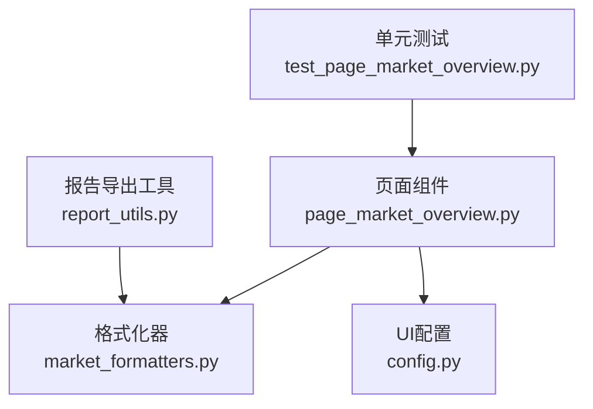
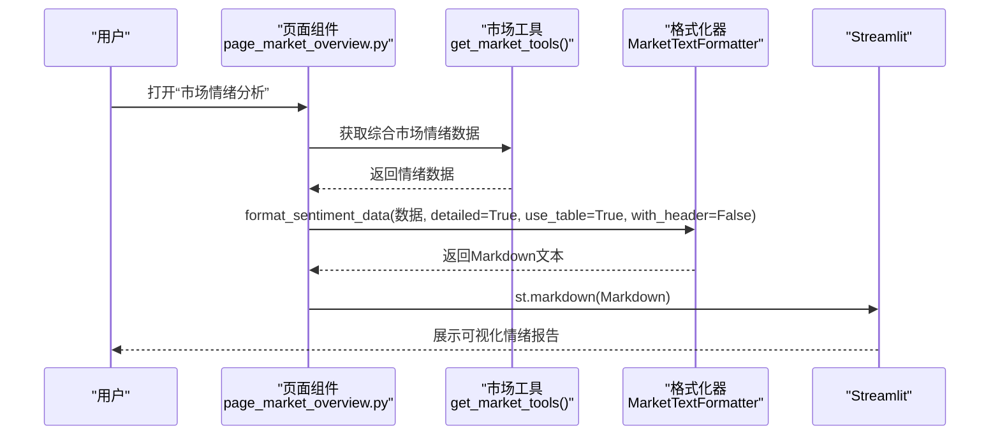
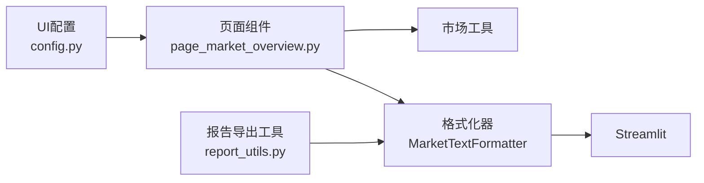

# 可视化展示

<cite>
**本文引用的文件**
- [market_formatters.py](file://market/market_formatters.py)
- [page_market_overview.py](file://ui/components/page_market_overview.py)
- [report_utils.py](file://utils/report_utils.py)
- [config.py](file://ui/config.py)
- [test_page_market_overview.py](file://tests/unit/ui/test_page_market_overview.py)
</cite>

## 目录
1. [简介](#简介)
2. [项目结构](#项目结构)
3. [核心组件](#核心组件)
4. [架构总览](#架构总览)
5. [详细组件分析](#详细组件分析)
6. [依赖关系分析](#依赖关系分析)
7. [性能考量](#性能考量)
8. [故障排查指南](#故障排查指南)
9. [结论](#结论)
10. [附录](#附录)

## 简介
本文件围绕 xystock 的“市场情绪可视化展示”方案进行系统化文档化，重点解释 MarketTextFormatter.format_sentiment_data 如何将原始情绪数据转换为 Streamlit 友好的 Markdown 格式；详述 detailed 模式下的四大展示模块：综合情绪评分、市场涨跌概览、资金流向情绪、情绪分析解读；说明 display_market_sentiment_analysis 如何调用格式化器并在 Streamlit 中渲染，以及如何依据数据可信度提示不同级别的警告信息；提供 Markdown 生成逻辑示例路径与响应式布局思路；并指出常见问题（如特殊字符渲染异常）及其解决方案。

## 项目结构
围绕市场情绪可视化展示的相关文件分布如下：
- 市场数据格式化：market/market_formatters.py
- UI 页面与渲染：ui/components/page_market_overview.py
- 报告导出与 Markdown 清洗：utils/report_utils.py
- UI 配置与关注指数：ui/config.py
- 单元测试：tests/unit/ui/test_page_market_overview.py

图表来源
- [page_market_overview.py](file://ui/components/page_market_overview.py#L162-L178)
- [market_formatters.py](file://market/market_formatters.py#L106-L368)
- [report_utils.py](file://utils/report_utils.py#L48-L78)
- [config.py](file://ui/config.py#L45-L55)
- [test_page_market_overview.py](file://tests/unit/ui/test_page_market_overview.py#L248-L285)

章节来源
- [page_market_overview.py](file://ui/components/page_market_overview.py#L162-L178)
- [market_formatters.py](file://market/market_formatters.py#L106-L368)
- [report_utils.py](file://utils/report_utils.py#L48-L78)
- [config.py](file://ui/config.py#L45-L55)
- [test_page_market_overview.py](file://tests/unit/ui/test_page_market_overview.py#L248-L285)

## 核心组件
- MarketTextFormatter.format_sentiment_data：将原始情绪数据转换为 Markdown，支持 detailed/simple 两档展示与表格/文本两种格式。
- display_market_sentiment_analysis：在 Streamlit 页面中拉取情绪数据、调用格式化器并渲染 Markdown。
- convert_markdown_to_streamlit：将格式化后的 Markdown 直接渲染到页面。
- report_utils._clean_markdown_for_pandoc：在导出 PDF/HTML 时清洗 Markdown，避免特殊字符导致的渲染问题。

章节来源
- [market_formatters.py](file://market/market_formatters.py#L106-L368)
- [page_market_overview.py](file://ui/components/page_market_overview.py#L152-L178)
- [report_utils.py](file://utils/report_utils.py#L48-L78)

## 架构总览
下图展示了“页面调用格式化器 -> 生成 Markdown -> Streamlit 渲染”的端到端流程。

图表来源
- [page_market_overview.py](file://ui/components/page_market_overview.py#L162-L178)
- [market_formatters.py](file://market/market_formatters.py#L106-L368)

## 详细组件分析

### MarketTextFormatter.format_sentiment_data：Markdown 生成逻辑
- 输入：情绪数据字典，包含基础情绪、资金流向、评分构成等字段。
- 输出：符合 Streamlit 渲染的 Markdown 文本。
- 关键行为：
  - 数据校验：若数据为空或包含错误标志，直接返回空串。
  - 标题与前缀：根据 detailed 与 with_header 控制标题层级与分隔。
  - 综合情绪评分模块：显示评分、等级（乐观/悲观/中性）、可信度。
  - 市场涨跌概览模块：支持表格与文本两种格式，展示上涨/下跌/平盘家数与占比，以及涨停/跌停家数与占比。
  - 资金流向情绪模块：展示主力资金净流入金额与流入占比，支持表格/文本两种格式。
  - 情绪分析解读模块：拆解评分构成（涨跌比例、涨跌停、资金流向），并给出总体情绪判断。
  - 简单模式：仅展示核心指标与总结，便于快速浏览。

章节来源
- [market_formatters.py](file://market/market_formatters.py#L106-L368)

### detailed 模式四大模块详解
- 综合情绪评分模块
  - 展示内容：情绪评分、情绪等级、数据可信度。
  - 评分等级映射：乐观/悲观/中性，配合图标与颜色提示。
  - 评分区间：-100 到 100，便于直观判断市场情绪强度。
- 市场涨跌概览模块
  - 表格格式：包含上涨/下跌/平盘/总计，以及涨停/跌停的家数与占比。
  - 文本格式：以自然语言描述涨跌家数与占比，突出市场主流趋势与调整压力。
  - 指标来源：基础情绪数据中的 up/down/flat/limit_up/limit_down 及其占比。
- 资金流向情绪模块
  - 表格格式：主力资金净流入金额与流入占比，标注净流入/净流出与资金活跃度。
  - 文本格式：以自然语言描述主力资金动向与市场偏好。
  - 指标来源：资金流向数据中的主力净流入与流入占比。
- 情绪分析解读模块
  - 评分构成：分别对涨跌比例、涨跌停、资金流向三个维度进行分项评分与解释。
  - 总体判断：根据总评分区间给出“极度乐观/偏乐观/中性/偏悲观/极度悲观”的结论与建议。

章节来源
- [market_formatters.py](file://market/market_formatters.py#L131-L320)

### display_market_sentiment_analysis：在 Streamlit 中渲染
- 步骤：
  - 通过市场工具获取综合情绪数据。
  - 调用 MarketTextFormatter.format_sentiment_data 生成 Markdown。
  - 通过 convert_markdown_to_streamlit 直接渲染到页面。
- 注意事项：
  - 若数据为空或包含错误标志，页面会提示“未获取到市场情绪数据”。

章节来源
- [page_market_overview.py](file://ui/components/page_market_overview.py#L162-L178)
- [page_market_overview.py](file://ui/components/page_market_overview.py#L152-L161)

### Markdown 生成逻辑示例（代码片段路径）
- 综合情绪评分段落生成：[路径](file://market/market_formatters.py#L131-L148)
- 市场涨跌概览（表格/文本）：[路径](file://market/market_formatters.py#L159-L207)
- 资金流向情绪（表格/文本）：[路径](file://market/market_formatters.py#L210-L246)
- 情绪分析解读（评分构成与总体判断）：[路径](file://market/market_formatters.py#L248-L320)
- 简单模式核心指标与总结：[路径](file://market/market_formatters.py#L332-L368)

章节来源
- [market_formatters.py](file://market/market_formatters.py#L131-L368)

### 响应式设计与屏幕适配
- 页面采用 Streamlit 的列布局（st.columns）与指标组件（st.metric）实现多列并排展示，便于在桌面与平板上充分利用横向空间。
- 指数展示使用三列布局，随窗口宽度自动调整列宽，保证在小屏设备上仍能清晰显示关键指标。
- 对于长文本与表格，Streamlit 自动滚动与换行，确保在移动端阅读体验。

章节来源
- [page_market_overview.py](file://ui/components/page_market_overview.py#L326-L359)
- [page_market_overview.py](file://ui/components/page_market_overview.py#L190-L210)

### 数据可信度与警告提示
- 在综合情绪评分模块中，格式化器会输出“数据可信度”字段，用于提示当前情绪评分的可靠性。
- 在页面渲染层，若情绪数据为空或包含错误标志，页面会显示“未获取到市场情绪数据”的警告提示，帮助用户识别数据异常。
- 导出 PDF/HTML 时，报告工具会对 Markdown 进行清洗，避免特殊字符导致的渲染异常。

章节来源
- [market_formatters.py](file://market/market_formatters.py#L131-L148)
- [page_market_overview.py](file://ui/components/page_market_overview.py#L169-L171)
- [report_utils.py](file://utils/report_utils.py#L48-L78)

## 依赖关系分析
- 页面组件依赖市场工具获取数据，再调用格式化器生成 Markdown，最终交给 Streamlit 渲染。
- 报告导出工具依赖格式化器生成的 Markdown 文本，并在导出前进行清洗。
- UI 配置提供关注指数列表，影响页面展示的指数选择与布局。

图表来源
- [page_market_overview.py](file://ui/components/page_market_overview.py#L162-L178)
- [market_formatters.py](file://market/market_formatters.py#L106-L368)
- [report_utils.py](file://utils/report_utils.py#L48-L78)
- [config.py](file://ui/config.py#L45-L55)

章节来源
- [page_market_overview.py](file://ui/components/page_market_overview.py#L162-L178)
- [market_formatters.py](file://market/market_formatters.py#L106-L368)
- [report_utils.py](file://utils/report_utils.py#L48-L78)
- [config.py](file://ui/config.py#L45-L55)

## 性能考量
- 数据获取与缓存：页面提供“使用缓存数据/强制刷新”的开关，减少重复请求与网络延迟。
- 渲染效率：Markdown 由格式化器一次性生成，Streamlit 直接渲染，避免多次 DOM 重建。
- 导出性能：报告导出前对 Markdown 进行清洗，减少 Pandoc/WeasyPrint 的解析负担。

章节来源
- [page_market_overview.py](file://ui/components/page_market_overview.py#L640-L653)
- [page_market_overview.py](file://ui/components/page_market_overview.py#L662-L675)
- [report_utils.py](file://utils/report_utils.py#L48-L78)

## 故障排查指南
- 特殊字符渲染异常
  - 症状：导出 PDF/HTML 时出现表格分隔符或引号导致的解析错误。
  - 解决：使用报告导出工具的 Markdown 清洗函数，替换特殊字符并保护表格分隔符。
  - 参考路径：[路径](file://utils/report_utils.py#L48-L78)
- 页面未显示情绪数据
  - 症状：页面提示“未获取到市场情绪数据”。
  - 排查：确认市场工具可用、网络连通、缓存是否过期；必要时关闭“使用缓存数据”强制刷新。
  - 参考路径：[路径](file://ui/components/page_market_overview.py#L169-L171)
- 单元测试验证
  - 测试用例覆盖了情绪分析与新闻情绪分析的调用链路，可用于回归验证。
  - 参考路径：[路径](file://tests/unit/ui/test_page_market_overview.py#L248-L285)

章节来源
- [report_utils.py](file://utils/report_utils.py#L48-L78)
- [page_market_overview.py](file://ui/components/page_market_overview.py#L169-L171)
- [test_page_market_overview.py](file://tests/unit/ui/test_page_market_overview.py#L248-L285)

## 结论
MarketTextFormatter.format_sentiment_data 提供了统一、可扩展的情绪数据 Markdown 生成能力，支持 detailed/simple 两档展示与表格/文本切换。页面组件通过简洁的调用链路将格式化后的 Markdown 直接渲染至 Streamlit，辅以数据可信度提示与导出前的 Markdown 清洗，确保在不同设备与导出场景下均能稳定呈现高质量的市场情绪可视化报告。

## 附录
- 关注指数列表：用于页面指数选择与展示布局。
  - 参考路径：[路径](file://ui/config.py#L45-L55)