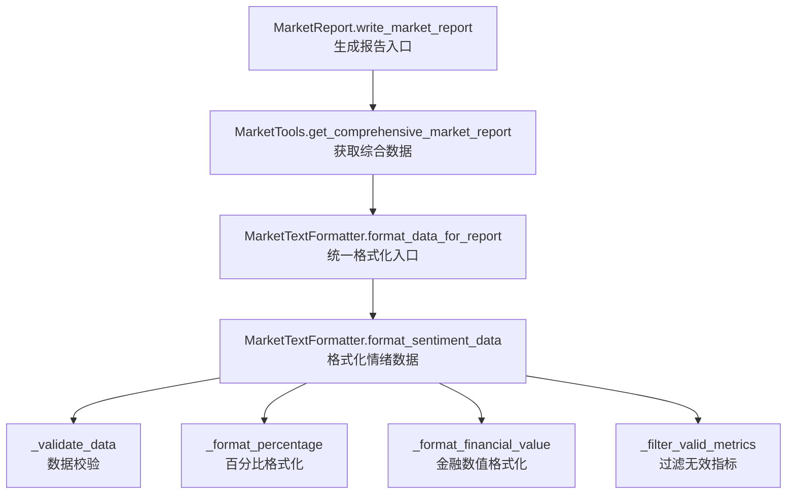
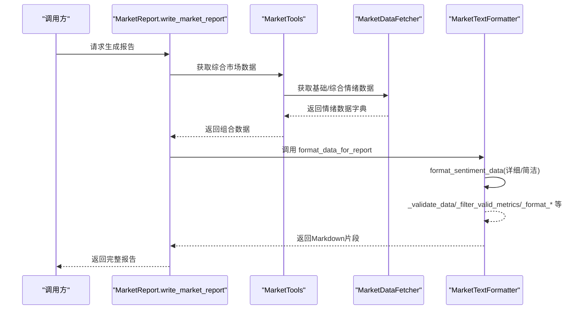
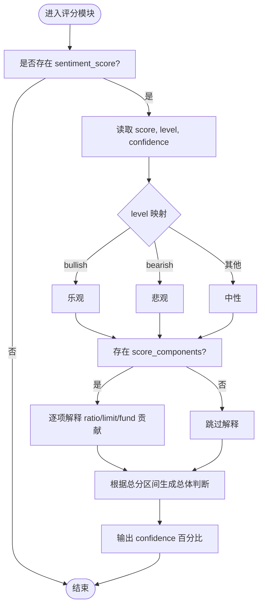
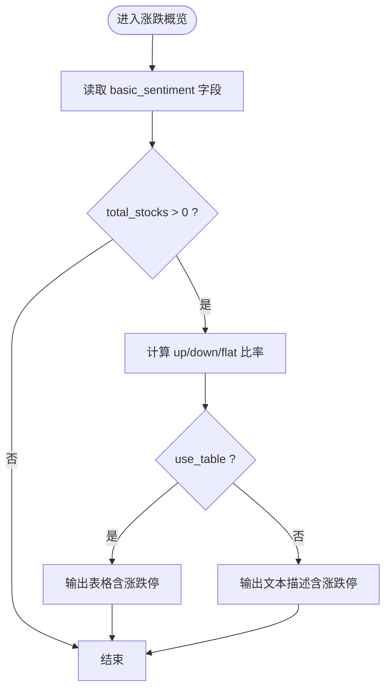
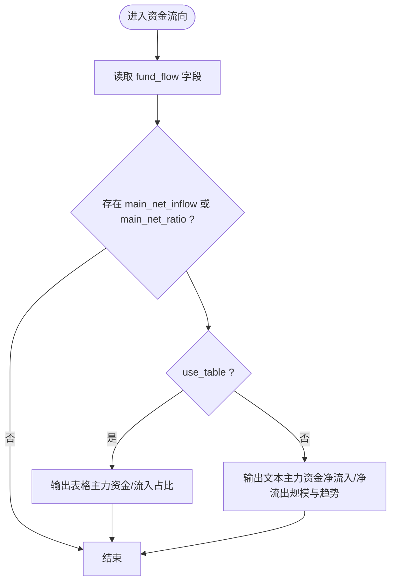
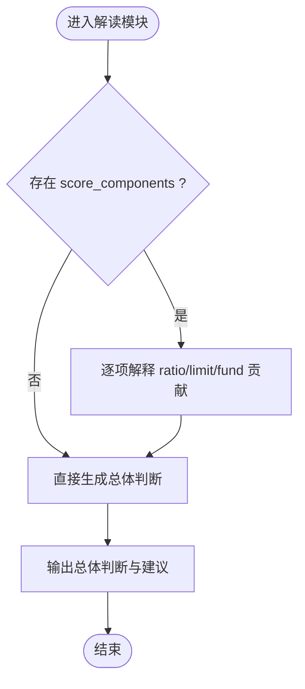
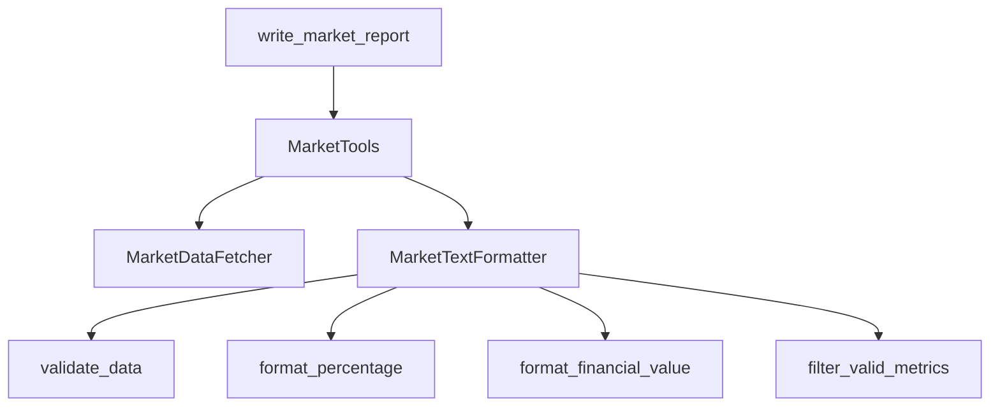

# 数据格式化

<cite>
**本文引用的文件**
- [market/market_formatters.py](file://market/market_formatters.py)
- [market/market_data_fetcher.py](file://market/market_data_fetcher.py)
- [market/market_report.py](file://market/market_report.py)
- [market/market_data_tools.py](file://market/market_data_tools.py)
- [tests/test_market_report.py](file://tests/test_market_report.py)
</cite>

## 目录
1. [简介](#简介)
2. [项目结构](#项目结构)
3. [核心组件](#核心组件)
4. [架构总览](#架构总览)
5. [详细组件分析](#详细组件分析)
6. [依赖关系分析](#依赖关系分析)
7. [性能考量](#性能考量)
8. [故障排查指南](#故障排查指南)
9. [结论](#结论)

## 简介
本文围绕 MarketTextFormatter.format_sentiment_data 方法展开，系统梳理其数据处理流程与模块化设计，重点解释：
- 如何接收原始情绪数据字典并通过 _validate_data 进行数据验证；
- detailed 参数如何决定输出“详细版”或“简洁版”；
- 四大模块的处理逻辑：综合情绪评分、市场涨跌概览、资金流向情绪、情绪分析解读；
- 辅助方法 _format_percentage、_format_financial_value 的数值格式化作用；
- _filter_valid_metrics 对无效指标的过滤策略；
- 如何基于数据可信度生成不同级别的警告信息。

## 项目结构
MarketTextFormatter 位于市场模块，负责将各类市场数据（含情绪指标）格式化为 Markdown 文本，供报告生成与展示使用。其调用链如下：
- MarketReport.write_market_report 调用 MarketTools 获取综合数据；
- MarketTools 将数据交给 MarketTextFormatter.format_data_for_report；
- format_data_for_report 内部调用 format_sentiment_data 生成情绪部分。

图表来源
- [market/market_report.py](file://market/market_report.py#L1-L114)
- [market/market_data_tools.py](file://market/market_data_tools.py#L1-L200)
- [market/market_formatters.py](file://market/market_formatters.py#L105-L368)

章节来源
- [market/market_report.py](file://market/market_report.py#L1-L114)
- [market/market_data_tools.py](file://market/market_data_tools.py#L1-L200)
- [market/market_formatters.py](file://market/market_formatters.py#L105-L368)

## 核心组件
- MarketTextFormatter.format_sentiment_data：核心情绪数据格式化方法，支持详细/简洁双模式，支持表格/文本两种展示风格。
- MarketTextFormatter._validate_data：统一数据验证入口，确保输入非空且不含错误标志。
- MarketTextFormatter._format_percentage：百分比格式化，统一输出格式。
- MarketTextFormatter._format_financial_value：金融数值格式化，支持亿/万亿元单位转换。
- MarketTextFormatter._filter_valid_metrics：过滤无效指标，避免 N/A、零值等干扰展示。
- MarketTextFormatter._create_metrics_list/_format_basic_metric：统一指标列表生成与基础指标格式化。
- MarketTextFormatter._get_section_header：统一章节标题生成。

章节来源
- [market/market_formatters.py](file://market/market_formatters.py#L19-L104)
- [market/market_formatters.py](file://market/market_formatters.py#L105-L368)

## 架构总览
下图展示了从数据采集到最终 Markdown 输出的整体流程，以及 format_sentiment_data 在其中的位置。

图表来源
- [market/market_report.py](file://market/market_report.py#L1-L114)
- [market/market_data_tools.py](file://market/market_data_tools.py#L1-L200)
- [market/market_formatters.py](file://market/market_formatters.py#L800-L939)

## 详细组件分析

### 方法：MarketTextFormatter.format_sentiment_data
- 输入：sentiment（字典）、detailed（布尔）、use_table（布尔）、with_header（布尔）
- 输出：Markdown 字符串
- 控制流要点：
  - 使用 _validate_data 快速失败，避免空数据或错误标志；
  - detailed=True 时输出完整分析，False 时输出简洁摘要；
  - use_table=True 时采用表格展示，False 时采用文本描述；
  - with_header 控制是否添加标题与分隔线。

章节来源
- [market/market_formatters.py](file://market/market_formatters.py#L105-L125)

#### 1) 综合情绪评分模块
- 读取字段：sentiment_score、sentiment_level、confidence；
- 情绪等级映射：bullish→乐观，bearish→悲观，其他→中性；
- 评分构成解读：当存在 score_components 时，逐项解释 ratio、limit、fund 的贡献与意义；
- 总体情绪判断：依据总分区间给出“极度乐观/偏乐观/中性/偏悲观/极度悲观”的结论与建议。

图表来源
- [market/market_formatters.py](file://market/market_formatters.py#L129-L320)

章节来源
- [market/market_formatters.py](file://market/market_formatters.py#L129-L320)

#### 2) 市场涨跌概览模块
- 读取字段：up_stocks、down_stocks、flat_stocks、total_stocks、limit_up、limit_down；
- 计算占比：若 total_stocks>0，则计算 up_ratio、down_ratio、flat_ratio；
- 表格/文本两种展示：
  - 表格：包含上涨/下跌/平盘/总计及其占比与备注；
  - 文本：逐项描述数量与占比，并对涨跌停单独说明；
- 涨跌停处理：limit_up_ratio、limit_down_ratio 用于标注强势/恐慌信号。

图表来源
- [market/market_formatters.py](file://market/market_formatters.py#L150-L209)

章节来源
- [market/market_formatters.py](file://market/market_formatters.py#L150-L209)

#### 3) 资金流向情绪模块
- 读取字段：fund_flow.main_net_inflow、fund_flow.main_net_ratio；
- 表格/文本两种展示：
  - 表格：主力资金净流入/净流出与流入占比，标注“活跃/平稳”；
  - 文本：描述主力资金净流入/净流出规模与市场情绪；
- 单位转换：主力资金以“亿”为单位展示。

图表来源
- [market/market_formatters.py](file://market/market_formatters.py#L210-L247)

章节来源
- [market/market_formatters.py](file://market/market_formatters.py#L210-L247)

#### 4) 情绪分析解读模块
- 评分构成分析：遍历 score_components，对 ratio、limit、fund 分别给出贡献说明与市场含义；
- 总体情绪判断：根据总分区间输出“极度乐观/偏乐观/中性/偏悲观/极度悲观”，并附带建议；
- 数据可信度：confidence 百分比用于提示数据来源丰富程度与可信度。

图表来源
- [market/market_formatters.py](file://market/market_formatters.py#L248-L320)

章节来源
- [market/market_formatters.py](file://market/market_formatters.py#L248-L320)

### 辅助方法与过滤策略
- _format_percentage：将数值格式化为百分比字符串，非数值返回“N/A”；
- _format_financial_value：将数值按单位（亿/万亿/亿元/万亿元）转换为易读字符串；
- _filter_valid_metrics：过滤掉值为空或属于零值集合的指标，避免冗余展示；
- _create_metrics_list/_format_basic_metric：统一指标列表生成与基础指标格式化；
- _get_section_header：统一章节标题生成。

章节来源
- [market/market_formatters.py](file://market/market_formatters.py#L33-L104)

### 数据来源与可信度
- 综合情绪评分由 MarketDataFetcher.fetch_comprehensive_market_sentiment 计算，包含：
  - 基于涨跌比例的评分；
  - 基于涨跌停比例的评分；
  - 基于主力资金净流入占比的评分；
- 情绪等级与可信度：
  - 情绪等级：总分>20→乐观，<−20→悲观，否则→中性；
  - 可信度：统计数据来源数量（基础情绪、资金流向、涨跌停），按规则计算百分比上限。

章节来源
- [market/market_data_fetcher.py](file://market/market_data_fetcher.py#L480-L565)

### 代码示例路径（展示数据转换过程）
- 情绪评分与等级、可信度计算：[计算评分与等级](file://market/market_data_fetcher.py#L503-L565)
- 情绪评分构成与总分：[评分构成与总分](file://market/market_data_fetcher.py#L507-L531)
- 情绪解读与总体判断：[解读与判断](file://market/market_formatters.py#L248-L320)
- 涨跌概览表格/文本输出：[涨跌概览](file://market/market_formatters.py#L150-L209)
- 资金流向表格/文本输出：[资金流向](file://market/market_formatters.py#L210-L247)
- 百分比与金融数值格式化：[格式化方法](file://market/market_formatters.py#L33-L68)

章节来源
- [market/market_data_fetcher.py](file://market/market_data_fetcher.py#L480-L565)
- [market/market_formatters.py](file://market/market_formatters.py#L150-L247)

## 依赖关系分析
- MarketReport.write_market_report 依赖 MarketTools 获取综合数据；
- MarketTools 依赖 MarketDataFetcher 获取基础/综合情绪数据；
- MarketTextFormatter.format_sentiment_data 依赖 _validate_data、_filter_valid_metrics、_format_* 等辅助方法；
- format_sentiment_data 的输出被 format_data_for_report 组合进完整报告。

图表来源
- [market/market_report.py](file://market/market_report.py#L1-L114)
- [market/market_data_tools.py](file://market/market_data_tools.py#L1-L200)
- [market/market_formatters.py](file://market/market_formatters.py#L105-L368)

章节来源
- [market/market_report.py](file://market/market_report.py#L1-L114)
- [market/market_data_tools.py](file://market/market_data_tools.py#L1-L200)
- [market/market_formatters.py](file://market/market_formatters.py#L105-L368)

## 性能考量
- 数据验证与过滤：在格式化前进行快速失败与无效指标过滤，减少后续处理开销；
- 表格/文本切换：use_table 可按需选择，避免不必要的表格渲染；
- 百分比与金融数值格式化：统一格式化方法减少重复计算与字符串拼接；
- 缓存与复用：MarketTools 通过缓存管理器复用数据，降低重复请求成本。

## 故障排查指南
- 输入为空或含错误标志：_validate_data 返回 False，format_sentiment_data 直接返回空字符串；
- 指标缺失或为零：_filter_valid_metrics 过滤掉无效指标，避免误导；
- 百分比/金额异常：_format_percentage/_format_financial_value 返回“N/A”，便于定位问题；
- 可信度低：confidence 较低时，建议结合其他维度数据进行交叉验证；
- 报告生成失败：write_market_report 捕获异常并返回错误提示，便于定位具体环节。

章节来源
- [market/market_formatters.py](file://market/market_formatters.py#L19-L104)
- [market/market_report.py](file://market/market_report.py#L1-L114)

## 结论
MarketTextFormatter.format_sentiment_data 通过清晰的模块划分与统一的格式化策略，实现了对市场情绪数据的标准化输出。其四大模块分别覆盖评分、涨跌概览、资金流向与解读判断，配合 _validate_data、_filter_valid_metrics、_format_* 等辅助方法，既保证了可读性，也兼顾了健壮性与扩展性。结合 MarketDataFetcher 的评分计算与可信度评估，可为用户提供高质量的情绪分析与决策参考。