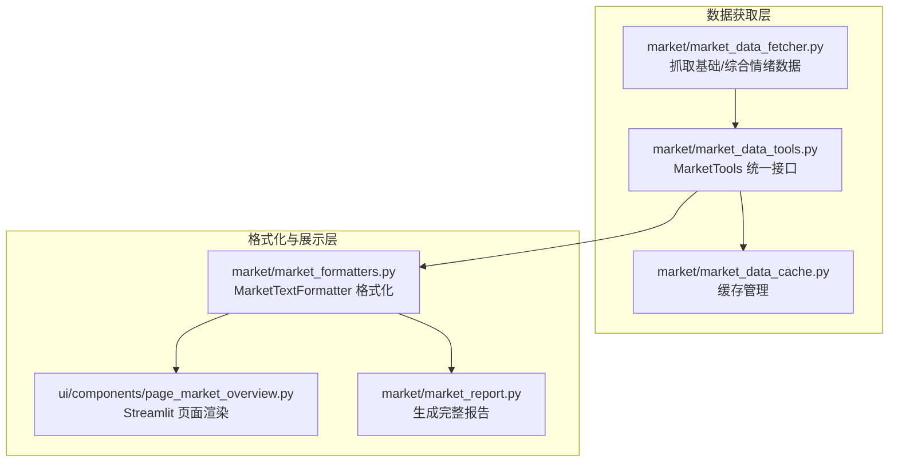
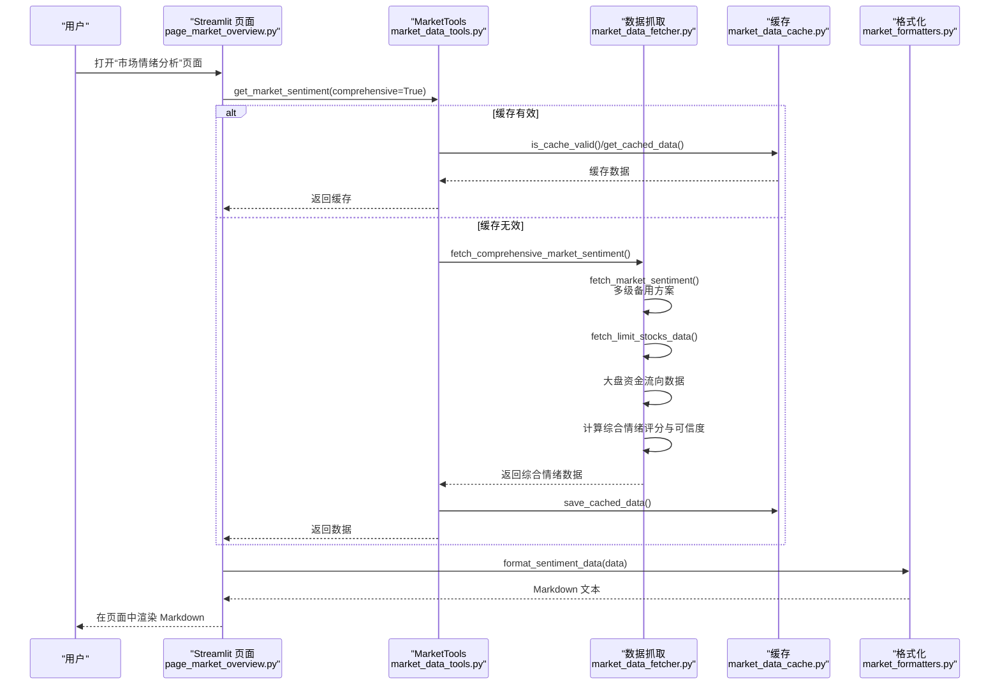
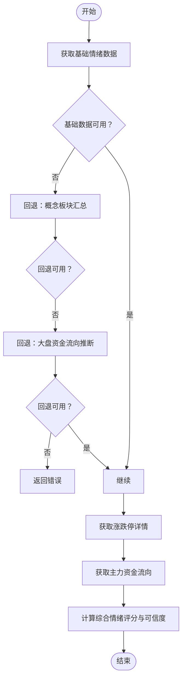
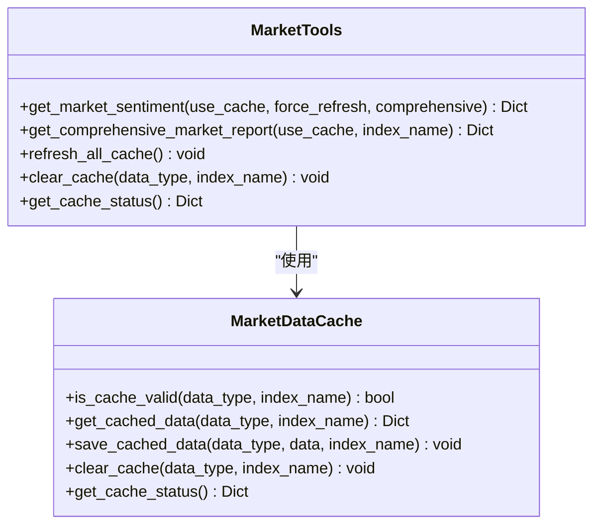
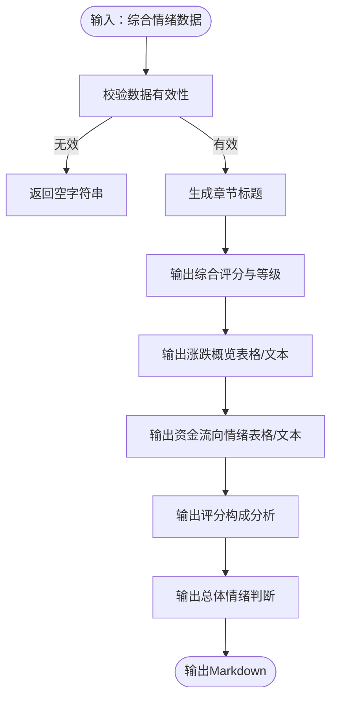
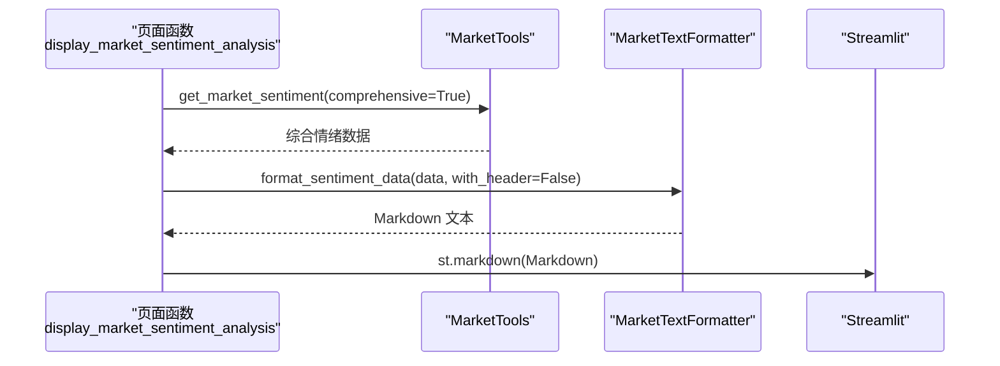
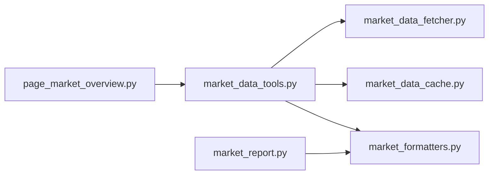

# 市场情绪

<cite>
**本文引用的文件**
- [market/market_data_fetcher.py](file://market/market_data_fetcher.py)
- [market/market_data_tools.py](file://market/market_data_tools.py)
- [market/market_formatters.py](file://market/market_formatters.py)
- [ui/components/page_market_overview.py](file://ui/components/page_market_overview.py)
- [market/market_report.py](file://market/market_report.py)
- [market/market_data_cache.py](file://market/market_data_cache.py)
</cite>

## 目录
1. [简介](#简介)
2. [项目结构](#项目结构)
3. [核心组件](#核心组件)
4. [架构总览](#架构总览)
5. [详细组件分析](#详细组件分析)
6. [依赖关系分析](#依赖关系分析)
7. [性能考量](#性能考量)
8. [故障排查指南](#故障排查指南)
9. [结论](#结论)

## 简介
本章节面向使用者与开发者，系统性介绍 xystock 的“市场情绪分析”能力。该模块通过统一的数据抓取与缓存机制，聚合多数据源（乐咕乐股、东方财富等），产出包含上涨/下跌股票数量、涨跌停数量、主力资金流向等指标的综合情绪数据；并通过 MarketTextFormatter 统一格式化为 Markdown 报告，最终在 Streamlit 页面中展示。同时，模块实现了多维度评分体系（基于涨跌比例、涨跌停比例、资金流向），并提供多级备用数据源的容错机制与缓存策略，以提升稳定性与性能。

## 项目结构
围绕市场情绪分析的关键文件组织如下：
- market/market_data_fetcher.py：负责从 akshare 等数据源抓取基础情绪、涨跌停、资金流向等数据，并实现多级备用方案与评分计算。
- market/market_data_tools.py：封装 MarketTools 类，统一对外提供 get_market_sentiment 接口，集成缓存与错误回退。
- market/market_formatters.py：提供 MarketTextFormatter，将情绪数据格式化为 Markdown，支持表格与文本两种展示方式。
- ui/components/page_market_overview.py：Streamlit 页面入口，调用 MarketTools 获取综合情绪数据并渲染。
- market/market_report.py：生成完整市场报告，内部调用 MarketTextFormatter.format_sentiment_data 输出情绪段落。
- market/market_data_cache.py：统一缓存管理，支持差异化过期策略与指数相关缓存键。

**图表来源**
- [market/market_data_fetcher.py](file://market/market_data_fetcher.py#L24-L135)
- [market/market_data_tools.py](file://market/market_data_tools.py#L30-L120)
- [market/market_data_cache.py](file://market/market_data_cache.py#L120-L180)
- [market/market_formatters.py](file://market/market_formatters.py#L105-L170)
- [ui/components/page_market_overview.py](file://ui/components/page_market_overview.py#L162-L178)
- [market/market_report.py](file://market/market_report.py#L57-L63)

**章节来源**
- [market/market_data_fetcher.py](file://market/market_data_fetcher.py#L24-L135)
- [market/market_data_tools.py](file://market/market_data_tools.py#L30-L120)
- [market/market_formatters.py](file://market/market_formatters.py#L105-L170)
- [ui/components/page_market_overview.py](file://ui/components/page_market_overview.py#L162-L178)
- [market/market_report.py](file://market/market_report.py#L57-L63)

## 核心组件
- 数据抓取与评分
  - 基础情绪数据：从乐咕乐股获取上涨/下跌/平盘/涨停/跌停/停牌等数量与占比。
  - 备用方案：概念板块汇总（上涨/下跌家数估算）、东方财富大盘资金流向推断。
  - 综合情绪评分：基于涨跌比例、涨跌停比例、主力资金流向三维度加权合成，输出评分与可信度。
- 统一接口与缓存
  - MarketTools.get_market_sentiment(comprehensive=True) 返回综合情绪数据，自动读写缓存。
  - 缓存键区分“基础情绪”与“综合情绪”，并按分钟级过期策略管理。
- 格式化与展示
  - MarketTextFormatter.format_sentiment_data 支持表格/文本两种视图，输出 Markdown。
  - Streamlit 页面 display_market_sentiment_analysis 调用接口并直接渲染 Markdown。
- 报告生成
  - market_report.write_market_report 内部调用 MarketTextFormatter.format_data_for_report，将情绪指标纳入完整报告。

**章节来源**
- [market/market_data_fetcher.py](file://market/market_data_fetcher.py#L24-L135)
- [market/market_data_fetcher.py](file://market/market_data_fetcher.py#L463-L566)
- [market/market_data_tools.py](file://market/market_data_tools.py#L30-L120)
- [market/market_data_cache.py](file://market/market_data_cache.py#L120-L180)
- [market/market_formatters.py](file://market/market_formatters.py#L105-L170)
- [ui/components/page_market_overview.py](file://ui/components/page_market_overview.py#L162-L178)
- [market/market_report.py](file://market/market_report.py#L57-L63)

## 架构总览
下图展示了从数据抓取到页面渲染的端到端流程，以及评分计算与格式化的关键节点。

**图表来源**
- [ui/components/page_market_overview.py](file://ui/components/page_market_overview.py#L162-L178)
- [market/market_data_tools.py](file://market/market_data_tools.py#L30-L120)
- [market/market_data_fetcher.py](file://market/market_data_fetcher.py#L24-L135)
- [market/market_data_fetcher.py](file://market/market_data_fetcher.py#L463-L566)
- [market/market_data_cache.py](file://market/market_data_cache.py#L180-L240)
- [market/market_formatters.py](file://market/market_formatters.py#L105-L170)

## 详细组件分析

### 组件A：fetch_comprehensive_market_sentiment 综合情绪数据抓取与评分
- 数据来源与流程
  - 基础情绪：优先从乐咕乐股获取市场活跃度（上涨/下跌/平盘/涨停/跌停/停牌），若失败则回退至概念板块汇总（上涨/下跌家数估算）。
  - 涨跌停详情：从东方财富获取当日涨停/跌停股票数量及原因分布。
  - 资金流向：从大盘资金流向获取主力净流入金额与净占比。
  - 评分计算：三维度加权合成，输出综合评分、情绪等级与可信度。
- 多级备用数据源
  - 乐咕乐股活跃度数据失败时，回退到“概念板块汇总”；若仍失败，再回退到“大盘资金流向推断”。
- 错误处理
  - 每一步均捕获异常并记录日志；若所有数据源均失败，返回 error 字段与失败原因。
- 可信度计算
  - 基于可用数据源数量加权：每可用数据源+30%，上限100%。

**图表来源**
- [market/market_data_fetcher.py](file://market/market_data_fetcher.py#L24-L135)
- [market/market_data_fetcher.py](file://market/market_data_fetcher.py#L463-L566)

**章节来源**
- [market/market_data_fetcher.py](file://market/market_data_fetcher.py#L24-L135)
- [market/market_data_fetcher.py](file://market/market_data_fetcher.py#L463-L566)

### 组件B：MarketTools.get_market_sentiment 统一接口与缓存
- 接口职责
  - 支持基础情绪与综合情绪两种模式；自动判断缓存有效性；失败时回退到缓存。
- 缓存策略
  - 基础情绪与综合情绪分别缓存，过期时间均为15分钟；失败回退时同样返回缓存。
- 指数相关缓存
  - 报告生成等场景会使用指数名作为缓存键后缀，避免跨指数污染。

**图表来源**
- [market/market_data_tools.py](file://market/market_data_tools.py#L30-L120)
- [market/market_data_cache.py](file://market/market_data_cache.py#L120-L180)

**章节来源**
- [market/market_data_tools.py](file://market/market_data_tools.py#L30-L120)
- [market/market_data_cache.py](file://market/market_data_cache.py#L120-L180)

### 组件C：MarketTextFormatter.format_sentiment_data 格式化与展示
- 输出内容
  - 综合情绪评分、情绪等级、数据可信度。
  - 市场涨跌概览（表格/文本），包含上涨/下跌/平盘数量与占比，以及涨停/跌停数量与占比。
  - 资金流向情绪（表格/文本），包含主力净流入金额与流入占比。
  - 评分构成分析与总体情绪判断。
- 展示策略
  - 支持详细/简单两种模式；支持表格/文本两种布局；自动过滤无效指标。

**图表来源**
- [market/market_formatters.py](file://market/market_formatters.py#L105-L170)
- [market/market_formatters.py](file://market/market_formatters.py#L170-L368)

**章节来源**
- [market/market_formatters.py](file://market/market_formatters.py#L105-L170)
- [market/market_formatters.py](file://market/market_formatters.py#L170-L368)

### 组件D：Streamlit 页面渲染 display_market_sentiment_analysis
- 调用链路
  - 通过 MarketTools.get_market_sentiment(comprehensive=True) 获取综合情绪数据。
  - 调用 MarketTextFormatter.format_sentiment_data 生成 Markdown。
  - convert_markdown_to_streamlit 直接渲染 Markdown。
- 交互细节
  - 支持使用缓存/强制刷新；当数据不可用时提示警告。

**图表来源**
- [ui/components/page_market_overview.py](file://ui/components/page_market_overview.py#L162-L178)
- [market/market_formatters.py](file://market/market_formatters.py#L105-L170)

**章节来源**
- [ui/components/page_market_overview.py](file://ui/components/page_market_overview.py#L162-L178)

### 组件E：报告生成 write_market_report 中的情绪段落
- 调用关系
  - market_report.write_market_report 内部调用 MarketTextFormatter.format_data_for_report，后者会调用 format_sentiment_data 生成情绪段落。
- 输出形态
  - 支持 pdf/docx/html/markdown 四种格式；错误时生成带错误信息的相应格式。

**章节来源**
- [market/market_report.py](file://market/market_report.py#L57-L63)

## 依赖关系分析
- 组件耦合
  - MarketTools 依赖 MarketDataCache 与 market_data_fetcher 的具体抓取函数。
  - MarketTextFormatter 仅依赖输入数据结构，与抓取层解耦，便于扩展与测试。
  - Streamlit 页面仅依赖 MarketTools 与 MarketTextFormatter，职责清晰。
- 外部依赖
  - akshare：用于乐咕乐股活跃度、概念板块汇总、资金流向、指数实时数据等。
  - Streamlit：用于页面渲染与交互。
- 潜在循环依赖
  - 未发现循环依赖；模块边界清晰。

**图表来源**
- [ui/components/page_market_overview.py](file://ui/components/page_market_overview.py#L162-L178)
- [market/market_data_tools.py](file://market/market_data_tools.py#L30-L120)
- [market/market_data_fetcher.py](file://market/market_data_fetcher.py#L24-L135)
- [market/market_formatters.py](file://market/market_formatters.py#L105-L170)
- [market/market_report.py](file://market/market_report.py#L57-L63)

**章节来源**
- [ui/components/page_market_overview.py](file://ui/components/page_market_overview.py#L162-L178)
- [market/market_data_tools.py](file://market/market_data_tools.py#L30-L120)
- [market/market_data_fetcher.py](file://market/market_data_fetcher.py#L24-L135)
- [market/market_formatters.py](file://market/market_formatters.py#L105-L170)
- [market/market_report.py](file://market/market_report.py#L57-L63)

## 性能考量
- 缓存策略
  - 基础情绪与综合情绪缓存过期时间为15分钟；指数相关技术指标缓存为60分钟；资金流向为43200分钟（30天）等差异化策略，兼顾时效与性能。
  - 缓存文件采用 JSON 序列化，内置 Numpy/Pandas/datetime 安全编码器，避免序列化失败。
- 请求频率控制
  - 通过缓存减少重复请求；抓取函数内已做异常捕获与回退，避免因单一数据源失败导致整体阻塞。
- 渲染效率
  - MarketTextFormatter 支持表格/文本两种布局，可根据需求选择更简洁的文本布局以减少渲染开销。
- 建议
  - 在高频刷新场景下，建议开启缓存；必要时使用“强制刷新”按钮清空缓存后重新抓取。
  - 对于网络不稳定环境，建议适当延长缓存过期时间，降低失败概率。

**章节来源**
- [market/market_data_cache.py](file://market/market_data_cache.py#L120-L180)
- [market/market_data_cache.py](file://market/market_data_cache.py#L180-L240)
- [market/market_data_fetcher.py](file://market/market_data_fetcher.py#L24-L135)

## 故障排查指南
- 常见问题
  - 数据源失效：乐咕乐股活跃度接口失败时，自动回退到概念板块汇总；若仍失败，回退到资金流向推断；若三者均失败，返回 error 字段。
  - 缓存命中但数据过期：页面提供“刷新数据”按钮，调用 MarketTools.refresh_all_cache 清除并重新抓取。
  - Streamlit 页面无数据显示：检查 MarketTools.get_market_sentiment 返回值是否包含 error；若存在，前端会提示“未获取到市场情绪数据”。
- 处理策略
  - 优先检查网络与 akshare 可用性；若数据源暂时不可用，系统会返回最近一次有效缓存。
  - 若需强制获取最新数据，关闭“使用缓存数据”勾选，或调用 clear_cache/refresh_all_cache。
  - 对于报告生成失败，write_market_report 会生成包含错误信息的相应格式文件，便于定位问题。

**章节来源**
- [market/market_data_fetcher.py](file://market/market_data_fetcher.py#L24-L135)
- [market/market_data_tools.py](file://market/market_data_tools.py#L408-L420)
- [ui/components/page_market_overview.py](file://ui/components/page_market_overview.py#L662-L675)
- [market/market_report.py](file://market/market_report.py#L75-L87)

## 结论
xystock 的市场情绪分析模块通过“多级备用数据源 + 统一评分体系 + 缓存与格式化”的设计，在保证稳定性的同时提供了丰富的市场情绪洞察。其核心流程清晰、组件职责明确，既能在 Streamlit 中快速展示，也能无缝融入完整报告生成。建议在生产环境中结合缓存策略与错误回退机制，进一步提升用户体验与系统鲁棒性。