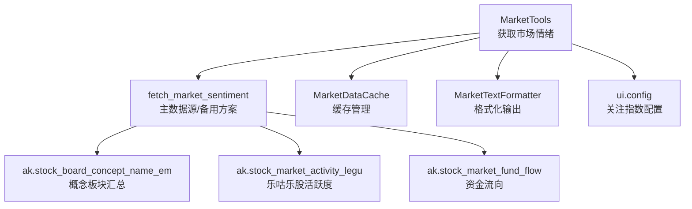
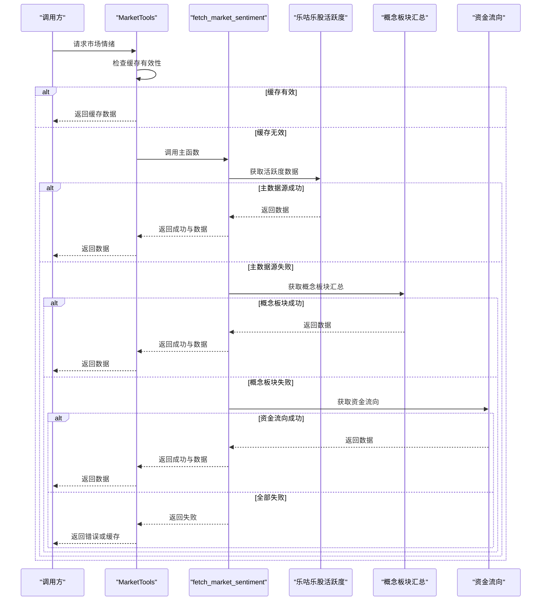
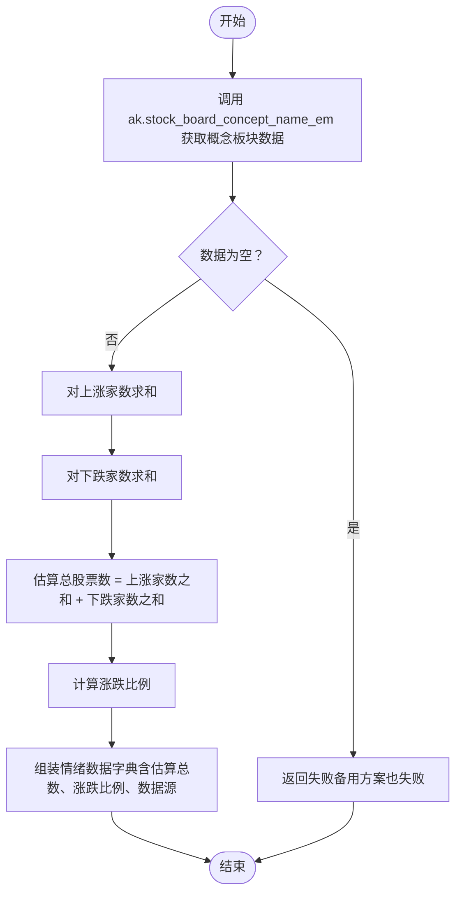
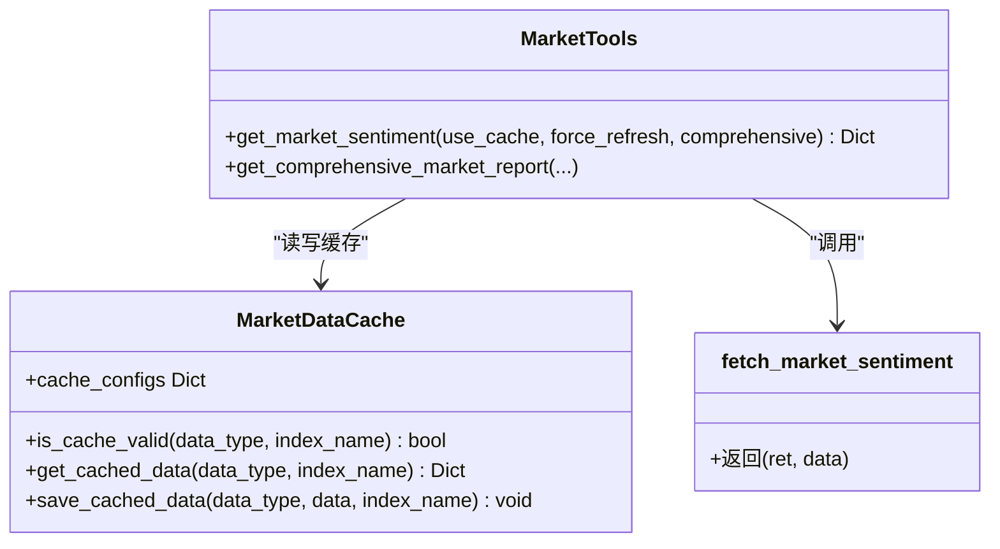
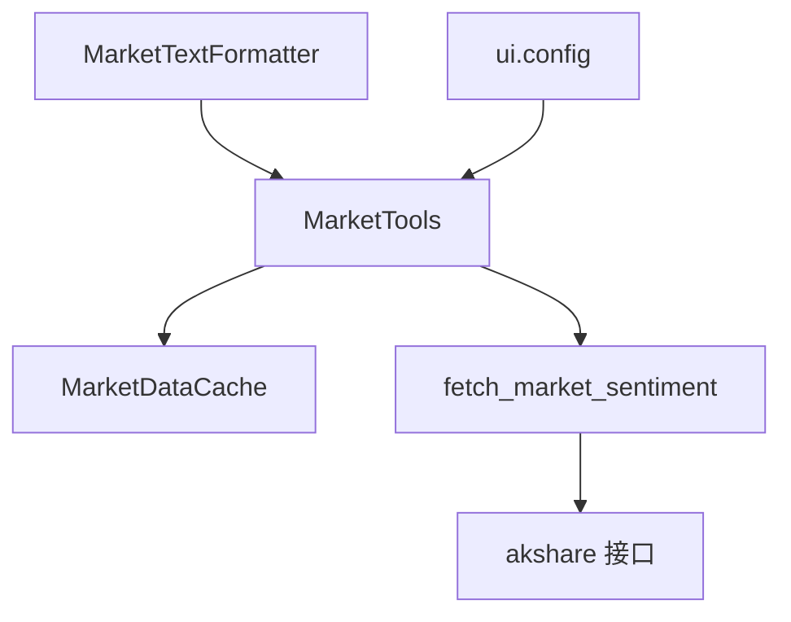

# 一级备用方案

<cite>
**本文引用的文件**
- [market_data_fetcher.py](file://market/market_data_fetcher.py)
- [market_data_tools.py](file://market/market_data_tools.py)
- [market_data_cache.py](file://market/market_data_cache.py)
- [market_formatters.py](file://market/market_formatters.py)
- [config.py](file://ui/config.py)
</cite>

## 目录
1. [简介](#简介)
2. [项目结构](#项目结构)
3. [核心组件](#核心组件)
4. [架构总览](#架构总览)
5. [详细组件分析](#详细组件分析)
6. [依赖分析](#依赖分析)
7. [性能考量](#性能考量)
8. [故障排查指南](#故障排查指南)
9. [结论](#结论)

## 简介
本文聚焦于xystock在主数据源（乐咕乐股）失效时，如何通过“东方财富的概念板块汇总数据”（ak.stock_board_concept_name_em）进行市场情绪估算的“一级备用方案”。文档将深入解析fetch_market_sentiment函数中备用方案的执行逻辑：获取所有概念板块数据，累加各板块的上涨家数和下跌家数，估算市场总股票数，并计算涨跌比例；同时指出该方案的局限性（存在股票重复计算、缺少平盘和涨跌停数据）及适用场景（主数据源临时不可用时的快速替代），并提供性能优化建议（缓存板块数据以减少重复请求）。

## 项目结构
围绕“备用方案”的关键文件与职责：
- market/market_data_fetcher.py：实现fetch_market_sentiment函数，包含主数据源与多级备用方案。
- market/market_data_tools.py：封装MarketTools类，负责调用fetch_market_sentiment并结合缓存管理。
- market/market_data_cache.py：提供统一的缓存管理器，支持差异化过期策略。
- market/market_formatters.py：提供市场情绪数据的Markdown格式化输出。
- ui/config.py：提供关注指数等配置，辅助理解数据来源与展示。

图表来源
- [market_data_tools.py](file://market/market_data_tools.py#L30-L66)
- [market_data_fetcher.py](file://market/market_data_fetcher.py#L24-L135)
- [market_data_cache.py](file://market/market_data_cache.py#L120-L142)
- [market_formatters.py](file://market/market_formatters.py#L105-L170)
- [config.py](file://ui/config.py#L45-L55)

章节来源
- [market_data_fetcher.py](file://market/market_data_fetcher.py#L24-L135)
- [market_data_tools.py](file://market/market_data_tools.py#L30-L66)
- [market_data_cache.py](file://market/market_data_cache.py#L120-L142)
- [market_formatters.py](file://market/market_formatters.py#L105-L170)
- [config.py](file://ui/config.py#L45-L55)

## 核心组件
- fetch_market_sentiment：主函数，按优先级尝试主数据源（乐咕乐股），失败后进入备用方案（概念板块汇总），再进入最后备用方案（资金流向）。返回布尔标志与情绪数据字典。
- MarketTools.get_market_sentiment：对外暴露的入口，结合缓存策略决定是否直接返回缓存或调用fetch_market_sentiment。
- MarketDataCache：提供差异化过期策略（如市场情绪15分钟、资金流向43200分钟等），保障数据新鲜度与稳定性。
- MarketTextFormatter.format_sentiment_data：将基础情绪数据格式化为Markdown，供UI或报告使用。

章节来源
- [market_data_fetcher.py](file://market/market_data_fetcher.py#L24-L135)
- [market_data_tools.py](file://market/market_data_tools.py#L30-L66)
- [market_data_cache.py](file://market/market_data_cache.py#L120-L142)
- [market_formatters.py](file://market/market_formatters.py#L105-L170)

## 架构总览
备用方案的调用链路如下：

图表来源
- [market_data_tools.py](file://market/market_data_tools.py#L30-L66)
- [market_data_fetcher.py](file://market/market_data_fetcher.py#L24-L135)

## 详细组件分析

### 备用方案：概念板块汇总估算逻辑
- 数据来源：ak.stock_board_concept_name_em返回概念板块列表，包含“上涨家数”“下跌家数”等字段。
- 处理流程：
  - 对“上涨家数”“下跌家数”分别求和，得到累计上涨家数与累计下跌家数。
  - 估算总股票数：total_estimated = 上涨家数之和 + 下跌家数之和。
  - 计算涨跌比例：up_ratio = 上涨家数之和 / total_estimated；down_ratio = 下跌家数之和 / total_estimated。
  - 由于概念板块数据不含“平盘”和“涨跌停”信息，备用方案将flat_stocks置为0，并不提供limit_up/limit_down相关指标。
- 返回数据包含：up_stocks、down_stocks、flat_stocks、total_stocks、up_ratio、down_ratio、data_source等。

图表来源
- [market_data_fetcher.py](file://market/market_data_fetcher.py#L72-L96)

章节来源
- [market_data_fetcher.py](file://market/market_data_fetcher.py#L72-L96)

### MarketTools与缓存集成
- MarketTools.get_market_sentiment会先检查缓存是否有效，若有效则直接返回缓存；否则调用fetch_market_sentiment并根据结果写入缓存。
- MarketDataCache为不同类型数据配置了不同的过期时间，例如“市场情绪”为15分钟，保证在主数据源不稳定时仍能稳定输出。

图表来源
- [market_data_tools.py](file://market/market_data_tools.py#L30-L66)
- [market_data_cache.py](file://market/market_data_cache.py#L120-L142)
- [market_data_fetcher.py](file://market/market_data_fetcher.py#L24-L135)

章节来源
- [market_data_tools.py](file://market/market_data_tools.py#L30-L66)
- [market_data_cache.py](file://market/market_data_cache.py#L120-L142)

### 输出与展示
- MarketTextFormatter.format_sentiment_data支持表格与文本两种格式，自动根据total_stocks是否大于0来计算up_ratio、down_ratio、flat_ratio，并可选输出涨停/跌停相关指标（当存在时）。
- 该格式化器与备用方案的flat_stocks=0保持一致，不会渲染平盘数据。

章节来源
- [market_formatters.py](file://market/market_formatters.py#L150-L197)

## 依赖分析
- 外部库依赖：akshare（概念板块、活跃度、资金流向等接口）。
- 内部模块耦合：
  - MarketTools依赖MarketDataCache与fetch_market_sentiment。
  - MarketTextFormatter依赖基础情绪数据结构（up_stocks、down_stocks、total_stocks、up_ratio、down_ratio等）。
  - ui.config提供关注指数配置，影响后续展示与分析维度。

图表来源
- [market_data_tools.py](file://market/market_data_tools.py#L30-L66)
- [market_data_fetcher.py](file://market/market_data_fetcher.py#L24-L135)
- [market_formatters.py](file://market/market_formatters.py#L105-L170)
- [config.py](file://ui/config.py#L45-L55)

章节来源
- [market_data_tools.py](file://market/market_data_tools.py#L30-L66)
- [market_data_fetcher.py](file://market/market_data_fetcher.py#L24-L135)
- [market_formatters.py](file://market/market_formatters.py#L105-L170)
- [config.py](file://ui/config.py#L45-L55)

## 性能考量
- 备用方案的优势在于请求单一接口（概念板块汇总），响应快、网络开销小，适合主数据源临时不可用时的快速替代。
- 局限性：
  - 存在股票重复计算：同一股票可能同时出现在多个概念板块中，导致“上涨家数之和”“下跌家数之和”被重复累加，从而高估实际参与交易的股票数量。
  - 缺少平盘与涨跌停数据：备用方案不包含“平盘”“涨停”“跌停”等指标，无法进行更精细的情绪分析。
  - 估算总股票数不准确：total_estimated = 上涨家数之和 + 下跌家数之和，可能远高于真实交易股票数。
- 性能优化建议：
  - 启用缓存：MarketDataCache为“市场情绪”配置15分钟过期，建议在调用get_market_sentiment时开启use_cache，避免频繁请求ak.stock_board_concept_name_em。
  - 合理的刷新策略：在业务侧设置合理的force_refresh策略，避免在短时间内重复刷新。
  - 降级策略：当概念板块数据为空或异常时，尽快回退到资金流向或直接返回缓存，减少失败重试带来的资源消耗。

章节来源
- [market_data_cache.py](file://market/market_data_cache.py#L120-L142)
- [market_data_tools.py](file://market/market_data_tools.py#L30-L66)
- [market_data_fetcher.py](file://market/market_data_fetcher.py#L72-L96)

## 故障排查指南
- 主数据源失败（乐咕乐股）：
  - 现象：打印“获取市场活跃度数据失败”，进入备用方案。
  - 处理：检查ak.stock_market_activity_legu接口可用性与网络状况。
- 备用方案失败（概念板块汇总）：
  - 现象：打印“备用方案也失败”，进入最后备用方案或返回错误。
  - 处理：检查ak.stock_board_concept_name_em接口可用性；确认返回数据非空；必要时直接返回缓存。
- 最后备用方案失败（资金流向）：
  - 现象：打印“所有备用方案都失败”，返回错误信息。
  - 处理：检查ak.stock_market_fund_flow接口可用性；若持续失败，建议返回缓存或提示用户稍后再试。
- 缓存问题：
  - 现象：长时间未更新或数据过期。
  - 处理：使用MarketDataCache.print_cache_status查看缓存状态；必要时执行refresh_all_cache或清理特定类型缓存。

章节来源
- [market_data_fetcher.py](file://market/market_data_fetcher.py#L69-L135)
- [market_data_tools.py](file://market/market_data_tools.py#L409-L420)
- [market_data_cache.py](file://market/market_data_cache.py#L391-L429)

## 结论
- 一级备用方案通过“概念板块汇总数据”实现了在主数据源失效时的快速替代，具备响应快、实现简单的优点。
- 该方案存在股票重复计算、缺少平盘与涨跌停数据等局限性，应谨慎用于需要精确统计的场景。
- 在生产环境中，建议结合缓存与降级策略，确保在主数据源不稳定时仍能稳定输出市场情绪概览，并在条件允许时逐步恢复到更全面的数据源。