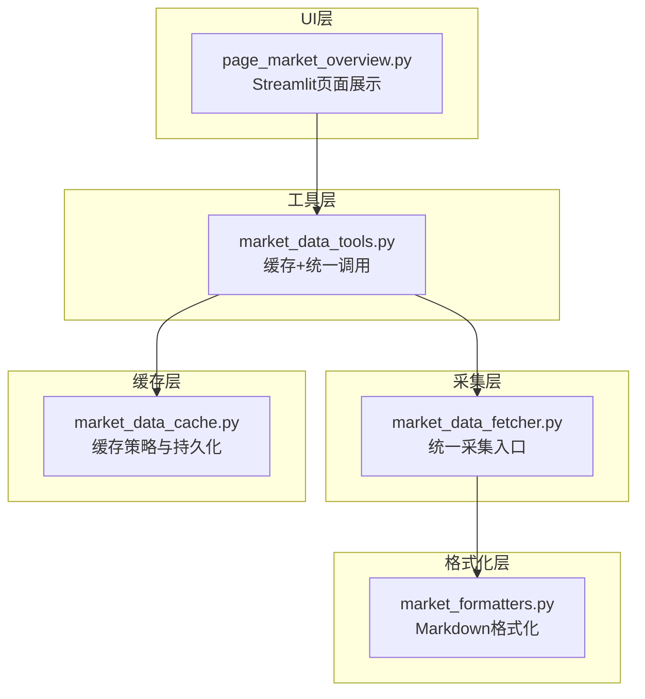
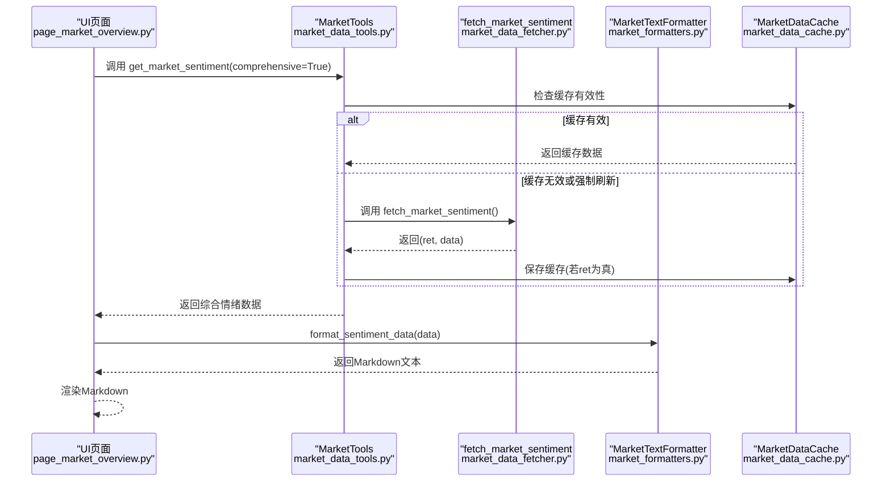
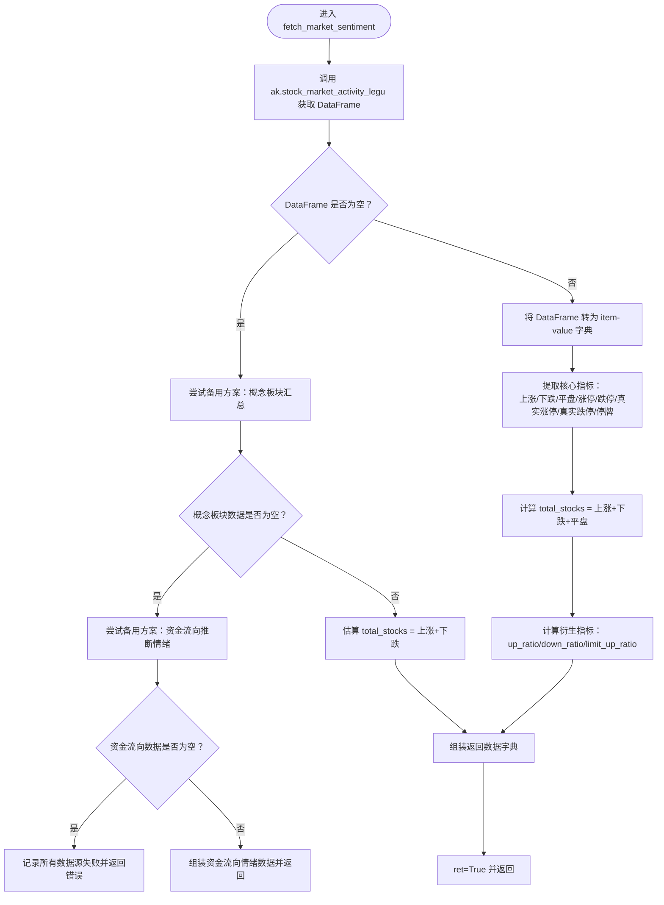
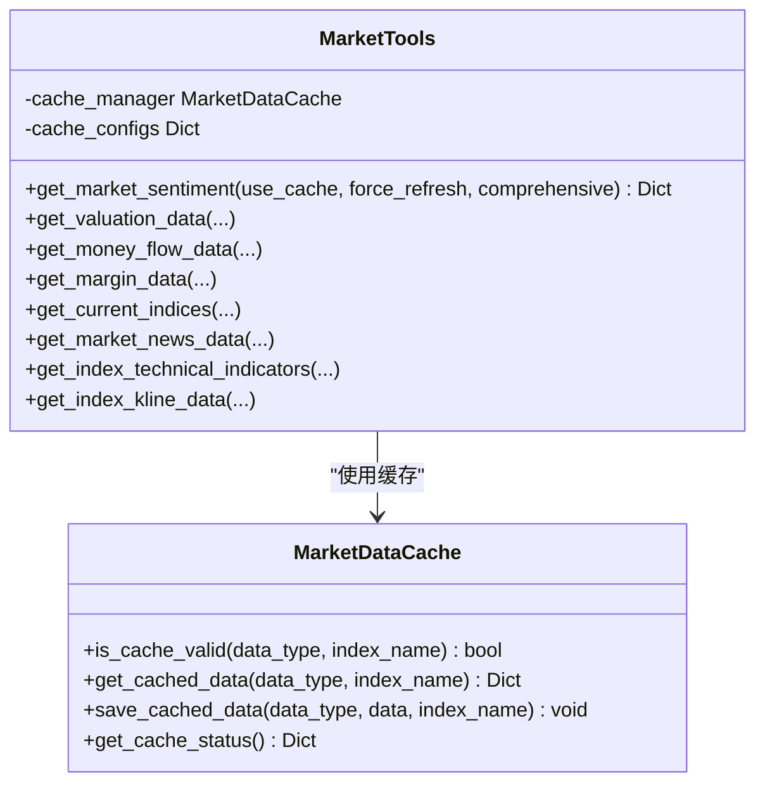
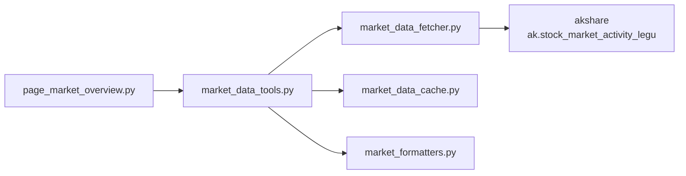

# 主数据源采集

<cite>
**本文引用的文件**
- [market_data_fetcher.py](file://market/market_data_fetcher.py)
- [market_data_tools.py](file://market/market_data_tools.py)
- [market_formatters.py](file://market/market_formatters.py)
- [page_market_overview.py](file://ui/components/page_market_overview.py)
- [market_data_cache.py](file://market/market_data_cache.py)
</cite>

## 目录
1. [简介](#简介)
2. [项目结构](#项目结构)
3. [核心组件](#核心组件)
4. [架构总览](#架构总览)
5. [详细组件分析](#详细组件分析)
6. [依赖关系分析](#依赖关系分析)
7. [性能考量](#性能考量)
8. [故障排查指南](#故障排查指南)
9. [结论](#结论)
10. [附录](#附录)

## 简介
本文围绕 xystock 项目中通过乐咕乐股 API（ak.stock_market_activity_legu）采集市场情绪主数据的实现机制进行系统化说明。重点解释 fetch_market_sentiment 如何解析返回的 DataFrame，提取上涨家数、下跌家数、涨停、跌停、真实涨停、真实跌停、平盘和停牌等核心指标，并据此计算涨跌比例、涨停比例等衍生指标；同时提供数据转换（item-value 转字典）、类型转换（字符串转整数）和异常处理的代码示例路径；最后阐述该数据源的优势（数据全面、更新及时）与潜在风险（IP 限制、API 稳定性），并给出应对建议（合理设置请求间隔、监控数据源状态）。

## 项目结构
围绕“主数据源采集”的相关模块组织如下：
- 数据采集层：market/market_data_fetcher.py 提供 fetch_market_sentiment 等统一采集入口
- 工具封装层：market/market_data_tools.py 提供缓存、统一调用、格式化输出等能力
- 格式化展示层：market/market_formatters.py 将情绪数据格式化为 Markdown 文本
- UI 展示层：ui/components/page_market_overview.py 在 Streamlit 页面中调用工具并渲染情绪分析
- 缓存管理：market/market_data_cache.py 提供统一缓存策略与持久化

图表来源
- [market_data_fetcher.py](file://market/market_data_fetcher.py#L24-L135)
- [market_data_tools.py](file://market/market_data_tools.py#L30-L66)
- [market_formatters.py](file://market/market_formatters.py#L105-L299)
- [page_market_overview.py](file://ui/components/page_market_overview.py#L162-L178)
- [market_data_cache.py](file://market/market_data_cache.py#L132-L142)

章节来源
- [market_data_fetcher.py](file://market/market_data_fetcher.py#L24-L135)
- [market_data_tools.py](file://market/market_data_tools.py#L30-L66)
- [market_formatters.py](file://market/market_formatters.py#L105-L299)
- [page_market_overview.py](file://ui/components/page_market_overview.py#L162-L178)
- [market_data_cache.py](file://market/market_data_cache.py#L132-L142)

## 核心组件
- fetch_market_sentiment：从 ak.stock_market_activity_legu 获取 DataFrame，将 item/value 转为字典，提取核心指标并计算衍生指标，返回布尔结果与字典数据
- MarketTools.get_market_sentiment：封装缓存逻辑，按需调用 fetch_market_sentiment，并在缓存有效时直接返回
- MarketTextFormatter.format_sentiment_data：将情绪数据格式化为 Markdown 文本，支持表格与文本两种展示形式
- UI 页面 display_market_sentiment_analysis：调用 MarketTools 获取综合情绪数据并渲染

章节来源
- [market_data_fetcher.py](file://market/market_data_fetcher.py#L24-L135)
- [market_data_tools.py](file://market/market_data_tools.py#L39-L66)
- [market_formatters.py](file://market/market_formatters.py#L105-L299)
- [page_market_overview.py](file://ui/components/page_market_overview.py#L162-L178)

## 架构总览
下图展示了从 UI 到数据源的整体调用链路与数据流转：

图表来源
- [page_market_overview.py](file://ui/components/page_market_overview.py#L162-L178)
- [market_data_tools.py](file://market/market_data_tools.py#L39-L66)
- [market_data_fetcher.py](file://market/market_data_fetcher.py#L24-L135)
- [market_formatters.py](file://market/market_formatters.py#L105-L299)
- [market_data_cache.py](file://market/market_data_cache.py#L192-L200)

## 详细组件分析

### 组件A：fetch_market_sentiment 的数据采集与转换
- 输入：调用 ak.stock_market_activity_legu 返回 DataFrame
- 关键步骤
  - DataFrame 转字典：以 item 为键、value 为值，形成 activity_dict
  - 类型转换：将各指标从字符串转为整数
  - 核心指标提取：上涨、下跌、平盘、涨停、跌停、真实涨停、真实跌停、停牌
  - 衍生指标计算：total_stocks、up_ratio、down_ratio、limit_up_ratio
  - 异常处理：捕获异常并记录错误，随后尝试备用方案
- 备用方案
  - 从概念板块汇总数据中估算上涨/下跌家数，估算 total_stocks
  - 最终备用方案：从大盘资金流向推断市场情绪（主力净流入/占比）

图表来源
- [market_data_fetcher.py](file://market/market_data_fetcher.py#L24-L135)

章节来源
- [market_data_fetcher.py](file://market/market_data_fetcher.py#L24-L135)

### 组件B：MarketTools 的缓存与统一调用
- get_market_sentiment：根据 use_cache/force_refresh 决策是否命中缓存；支持 comprehensive 参数控制是否返回综合情绪
- 缓存配置：不同数据类型具有不同的过期分钟数，市场情绪指标默认 15 分钟

图表来源
- [market_data_tools.py](file://market/market_data_tools.py#L30-L66)
- [market_data_cache.py](file://market/market_data_cache.py#L132-L142)

章节来源
- [market_data_tools.py](file://market/market_data_tools.py#L39-L66)
- [market_data_cache.py](file://market/market_data_cache.py#L132-L142)

### 组件C：MarketTextFormatter 的格式化输出
- format_sentiment_data：将基础情绪数据（或综合情绪数据）格式化为 Markdown 文本
- 支持表格与文本两种展示方式，自动过滤无效指标，输出情绪评分、涨跌概览、涨跌停情况、资金流向情绪等

章节来源
- [market_formatters.py](file://market/market_formatters.py#L105-L299)

### 组件D：UI 页面的调用与渲染
- display_market_sentiment_analysis：调用 MarketTools.get_market_sentiment(comprehensive=True)，再调用 MarketTextFormatter.format_sentiment_data 输出 Markdown，最终在 Streamlit 中渲染

章节来源
- [page_market_overview.py](file://ui/components/page_market_overview.py#L162-L178)

## 依赖关系分析
- fetch_market_sentiment 依赖 akshare 库提供的 ak.stock_market_activity_legu 接口
- MarketTools 依赖 MarketDataCache 实现缓存策略
- UI 页面依赖 MarketTools 与 MarketTextFormatter 完成数据获取与展示

图表来源
- [page_market_overview.py](file://ui/components/page_market_overview.py#L162-L178)
- [market_data_tools.py](file://market/market_data_tools.py#L30-L66)
- [market_data_fetcher.py](file://market/market_data_fetcher.py#L24-L135)
- [market_data_cache.py](file://market/market_data_cache.py#L132-L142)
- [market_formatters.py](file://market/market_formatters.py#L105-L299)

章节来源
- [page_market_overview.py](file://ui/components/page_market_overview.py#L162-L178)
- [market_data_tools.py](file://market/market_data_tools.py#L30-L66)
- [market_data_fetcher.py](file://market/market_data_fetcher.py#L24-L135)
- [market_data_cache.py](file://market/market_data_cache.py#L132-L142)
- [market_formatters.py](file://market/market_formatters.py#L105-L299)

## 性能考量
- 缓存策略：市场情绪指标默认 15 分钟过期，减少频繁请求带来的网络与 IP 风险
- 备用方案：当主数据源失败时，快速切换至概念板块汇总或资金流向推断，提升可用性
- 类型转换与计算：在内存中完成，复杂度主要取决于 DataFrame 行数与字段数量，通常为 O(n)

[本节为通用性能讨论，无需列出具体文件来源]

## 故障排查指南
- 数据为空或异常
  - 检查 ak.stock_market_activity_legu 返回的 DataFrame 是否为空
  - 查看异常日志，确认是否触发备用方案
- 缓存失效或过期
  - 使用 MarketDataCache.get_cache_status() 查看缓存状态
  - 通过 MarketTools.refresh_all_cache() 刷新缓存
- UI 未显示数据
  - 确认 UI 页面调用 MarketTools.get_market_sentiment(comprehensive=True)
  - 检查 MarketTextFormatter.format_sentiment_data 的输入是否有效

章节来源
- [market_data_fetcher.py](file://market/market_data_fetcher.py#L24-L135)
- [market_data_cache.py](file://market/market_data_cache.py#L370-L439)
- [market_data_tools.py](file://market/market_data_tools.py#L408-L420)
- [page_market_overview.py](file://ui/components/page_market_overview.py#L162-L178)

## 结论
xystock 通过 fetch_market_sentiment 将乐咕乐股 API 的 DataFrame 转换为结构化字典，提取并计算了核心与衍生指标，结合 MarketTools 的缓存与 MarketTextFormatter 的格式化输出，实现了稳定、可复用的市场情绪主数据采集与展示流程。UI 层通过简洁的调用即可获得高质量的市场情绪报告。建议在生产环境中配合合理的缓存策略与备用方案，以降低 API 不稳定与 IP 限制带来的影响。

[本节为总结性内容，无需列出具体文件来源]

## 附录

### 数据转换与类型转换示例路径
- item-value 转字典
  - 示例路径：[activity_dict 构建](file://market/market_data_fetcher.py#L34-L37)
- 字符串转整数
  - 示例路径：[核心指标类型转换](file://market/market_data_fetcher.py#L38-L45)
- 衍生指标计算
  - 示例路径：[总数与比例计算](file://market/market_data_fetcher.py#L47-L63)

### 异常处理示例路径
- 主数据源异常与备用方案
  - 示例路径：[主数据源异常与备用方案](file://market/market_data_fetcher.py#L69-L131)
- UI 层异常处理
  - 示例路径：[UI 未获取到数据提示](file://ui/components/page_market_overview.py#L169-L171)

### 数据源优势与风险
- 优势
  - 数据全面：涵盖上涨、下跌、平盘、涨停、跌停、真实涨停、真实跌停、停牌等多维度指标
  - 更新及时：通过统一采集入口与缓存策略，保障数据新鲜度
- 风险
  - IP 限制：频繁请求可能导致 IP 被限
  - API 稳定性：第三方接口可能出现波动或不可用
- 应对建议
  - 合理设置请求间隔与缓存过期时间
  - 监控数据源状态，必要时启用备用方案
  - 使用 MarketDataCache 的统一缓存管理，避免重复请求

[本节为通用建议，无需列出具体文件来源]