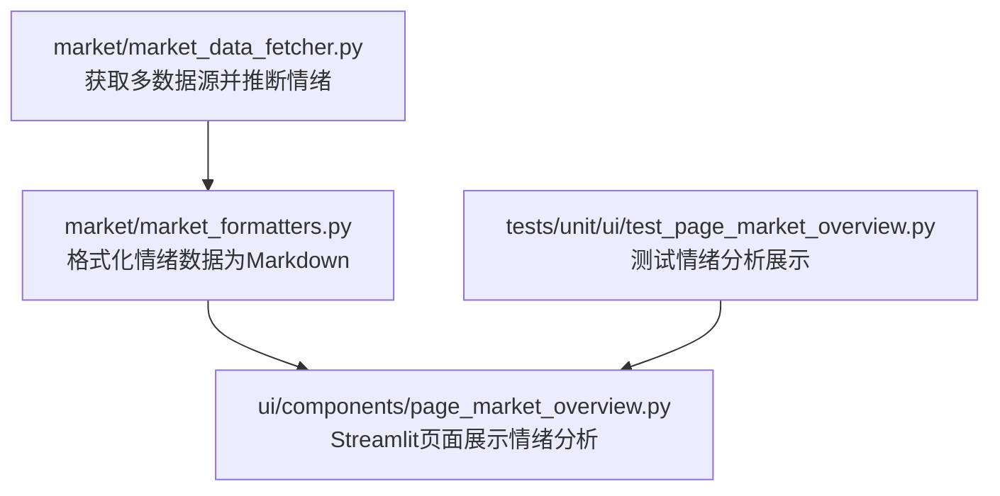
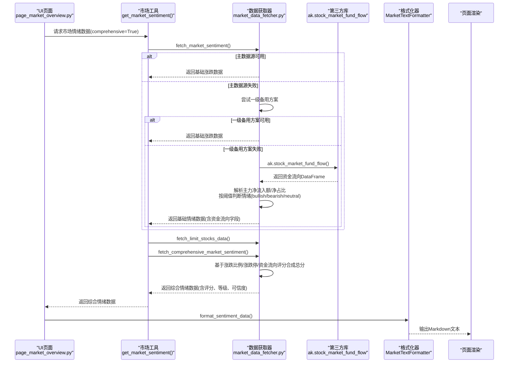
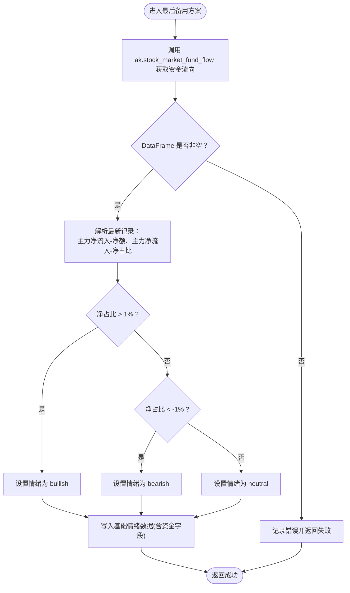
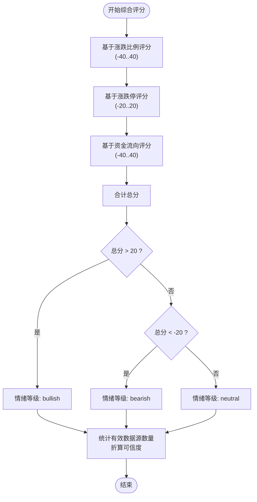
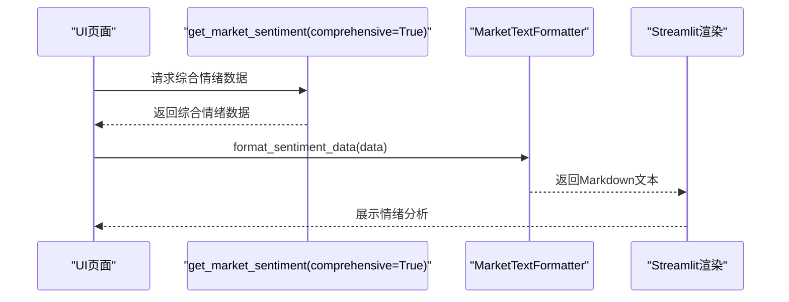
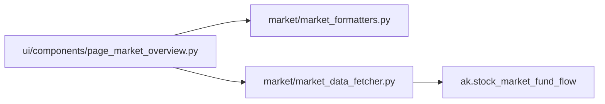

# 二级备用方案

<cite>
**本文引用的文件**
- [market_data_fetcher.py](file://market/market_data_fetcher.py)
- [market_formatters.py](file://market/market_formatters.py)
- [page_market_overview.py](file://ui/components/page_market_overview.py)
- [test_page_market_overview.py](file://tests/unit/ui/test_page_market_overview.py)
</cite>

## 目录
1. [引言](#引言)
2. [项目结构](#项目结构)
3. [核心组件](#核心组件)
4. [架构总览](#架构总览)
5. [详细组件分析](#详细组件分析)
6. [依赖关系分析](#依赖关系分析)
7. [性能考量](#性能考量)
8. [故障排查指南](#故障排查指南)
9. [结论](#结论)
10. [附录](#附录)

## 引言
本节聚焦于当主数据源与一级备用方案均失效时，xystock如何利用“大盘资金流向数据”（ak.stock_market_fund_flow）推断市场情绪的二级备用方案。文档将深入解释 fetch_market_sentiment 函数中最后备用方案的实现细节：通过主力资金净流入额与净占比，采用阈值规则（>1% 为看涨，<-1% 为看跌，否则中性）进行情绪判断；并分析该方案的间接性与价值，以及在极端行情下的指示意义。同时提供代码示例路径，帮助读者定位实现位置与数据解析流程。

## 项目结构
围绕“二级备用方案”的相关模块与职责如下：
- market/market_data_fetcher.py：负责多数据源获取与情绪推断，包含三级备用方案与综合情绪评分。
- market/market_formatters.py：负责将情绪数据格式化为Markdown文本，供UI展示。
- ui/components/page_market_overview.py：负责UI层展示市场情绪分析，调用格式化器输出。
- tests/unit/ui/test_page_market_overview.py：包含对情绪分析展示的单元测试，验证数据流与展示逻辑。

**图表来源**
- [market_data_fetcher.py](file://market/market_data_fetcher.py#L24-L135)
- [market_formatters.py](file://market/market_formatters.py#L105-L368)
- [page_market_overview.py](file://ui/components/page_market_overview.py#L162-L178)

**章节来源**
- [market_data_fetcher.py](file://market/market_data_fetcher.py#L24-L135)
- [market_formatters.py](file://market/market_formatters.py#L105-L368)
- [page_market_overview.py](file://ui/components/page_market_overview.py#L162-L178)

## 核心组件
- 备用方案入口：fetch_market_sentiment 在主数据源与一级备用方案均失败后，进入“最后备用方案”，从 ak.stock_market_fund_flow 获取最新日的资金流向，并据此推断市场情绪倾向（bullish/bearish/neutral）。
- 综合情绪评分：fetch_comprehensive_market_sentiment 在基础涨跌数据、涨跌停数据与资金流向数据三者基础上，分别赋予不同权重并合成总分，最终确定情绪等级与可信度。
- UI 展示：page_market_overview 调用 MarketTextFormatter 将综合情绪数据渲染为 Markdown，直观呈现评分、构成与解读。

**章节来源**
- [market_data_fetcher.py](file://market/market_data_fetcher.py#L24-L135)
- [market_data_fetcher.py](file://market/market_data_fetcher.py#L463-L566)
- [market_formatters.py](file://market/market_formatters.py#L105-L368)
- [page_market_overview.py](file://ui/components/page_market_overview.py#L162-L178)

## 架构总览
下图展示了从数据源到UI展示的端到端流程，重点标注了二级备用方案的位置与资金流向数据的解析与情绪判断。

**图表来源**
- [page_market_overview.py](file://ui/components/page_market_overview.py#L162-L178)
- [market_data_fetcher.py](file://market/market_data_fetcher.py#L24-L135)
- [market_data_fetcher.py](file://market/market_data_fetcher.py#L463-L566)
- [market_formatters.py](file://market/market_formatters.py#L105-L368)

## 详细组件分析

### 备用方案：基于大盘资金流向推断市场情绪
- 数据来源：ak.stock_market_fund_flow 返回资金流向数据，取最新一条记录。
- 字段解析：主力净流入-净额、主力净流入-净占比。
- 情绪判断：
  - 若净占比 > 1%，判定为看涨（bullish）
  - 若净占比 < -1%，判定为看跌（bearish）
  - 否则为中性（neutral）
- 数据存储：将主力净流入额与净占比写入基础情绪数据，供后续综合评分使用。

**图表来源**
- [market_data_fetcher.py](file://market/market_data_fetcher.py#L101-L133)

**章节来源**
- [market_data_fetcher.py](file://market/market_data_fetcher.py#L101-L133)

### 综合情绪评分与可信度
- 基础涨跌比例评分：基于上涨占比偏离50%的程度，线性映射至-40到40分。
- 涨跌停评分：基于涨跌停数量差与总股票数的比例，放大1000倍并限制在-20到20分。
- 资金流向评分：基于主力净流入占比，按每百分点10分计算，上限40分。
- 总分与等级：将上述分项求和，>20为看涨，<-20为看跌，否则中性。
- 可信度：统计有效数据源数量（基础涨跌、资金流向、涨跌停），按固定规则折算为0-100的可信度。

**图表来源**
- [market_data_fetcher.py](file://market/market_data_fetcher.py#L503-L566)

**章节来源**
- [market_data_fetcher.py](file://market/market_data_fetcher.py#L503-L566)

### UI 展示与Markdown格式化
- 页面调用 get_market_sentiment(comprehensive=True) 获取综合情绪数据。
- MarketTextFormatter.format_sentiment_data 将评分、等级、可信度、资金流向与评分构成等信息格式化为Markdown。
- 页面将Markdown渲染为Streamlit组件，直观展示市场情绪分析。

**图表来源**
- [page_market_overview.py](file://ui/components/page_market_overview.py#L162-L178)
- [market_formatters.py](file://market/market_formatters.py#L105-L368)

**章节来源**
- [page_market_overview.py](file://ui/components/page_market_overview.py#L162-L178)
- [market_formatters.py](file://market/market_formatters.py#L105-L368)

### 代码示例路径（定位实现）
- 最后备用方案入口与阈值判断：
  - [fetch_market_sentiment 函数（最后备用方案）](file://market/market_data_fetcher.py#L101-L133)
- 资金流向数据解析与综合评分：
  - [fetch_comprehensive_market_sentiment（资金流向评分与总分）](file://market/market_data_fetcher.py#L463-L566)
- UI 展示与Markdown格式化：
  - [display_market_sentiment_analysis（页面调用）](file://ui/components/page_market_overview.py#L162-L178)
  - [MarketTextFormatter.format_sentiment_data（格式化）](file://market/market_formatters.py#L105-L368)
- 单元测试（验证情绪分析展示）：
  - [TestDisplayMarketSentimentAnalysis（测试情绪指标显示）](file://tests/unit/ui/test_page_market_overview.py#L225-L267)

**章节来源**
- [market_data_fetcher.py](file://market/market_data_fetcher.py#L101-L133)
- [market_data_fetcher.py](file://market/market_data_fetcher.py#L463-L566)
- [page_market_overview.py](file://ui/components/page_market_overview.py#L162-L178)
- [market_formatters.py](file://market/market_formatters.py#L105-L368)
- [test_page_market_overview.py](file://tests/unit/ui/test_page_market_overview.py#L225-L267)

## 依赖关系分析
- 组件耦合：
  - market_data_fetcher 依赖 akshare 库获取 ak.stock_market_fund_flow 数据。
  - UI 层 page_market_overview 依赖 market_formatters 进行格式化。
- 数据依赖：
  - 资金流向数据为最终备用方案的核心输入，解析主力净流入额与净占比。
- 可能的循环依赖：
  - 未发现直接循环依赖；模块间为单向调用链。

**图表来源**
- [page_market_overview.py](file://ui/components/page_market_overview.py#L162-L178)
- [market_data_fetcher.py](file://market/market_data_fetcher.py#L463-L566)
- [market_formatters.py](file://market/market_formatters.py#L105-L368)

**章节来源**
- [page_market_overview.py](file://ui/components/page_market_overview.py#L162-L178)
- [market_data_fetcher.py](file://market/market_data_fetcher.py#L463-L566)
- [market_formatters.py](file://market/market_formatters.py#L105-L368)

## 性能考量
- 备用方案仅在主数据源与一级备用方案均失败时触发，避免频繁请求第三方接口。
- 资金流向数据通常为日频，解析成本较低，且仅取最新一条记录，复杂度为常数级。
- 综合评分过程为常数时间与空间复杂度，整体开销可控。

[本节为通用指导，无需具体文件来源]

## 故障排查指南
- ak.stock_market_fund_flow 返回空或异常：
  - 检查网络与第三方库可用性；备用方案会捕获异常并记录错误。
  - 参考路径：[备用方案异常处理](file://market/market_data_fetcher.py#L101-L133)
- 综合评分异常或情绪等级异常：
  - 检查基础涨跌数据、涨跌停数据与资金流向数据是否有效；确认评分权重与阈值逻辑。
  - 参考路径：[综合评分与等级判定](file://market/market_data_fetcher.py#L503-L566)
- UI 展示空白或数据缺失：
  - 确认 get_market_sentiment 返回数据结构完整；检查 MarketTextFormatter 的输入校验。
  - 参考路径：[页面调用与格式化](file://ui/components/page_market_overview.py#L162-L178), [格式化器校验](file://market/market_formatters.py#L105-L132)

**章节来源**
- [market_data_fetcher.py](file://market/market_data_fetcher.py#L101-L133)
- [market_data_fetcher.py](file://market/market_data_fetcher.py#L503-L566)
- [page_market_overview.py](file://ui/components/page_market_overview.py#L162-L178)
- [market_formatters.py](file://market/market_formatters.py#L105-L132)

## 结论
当主数据源与一级备用方案均不可用时，xystock通过 ak.stock_market_fund_flow 的主力资金净流入额与净占比，采用“>1% 看涨、<-1% 看跌、其他中性”的阈值规则进行二级备用方案的情绪判断。该方案以“大资金动向”为间接信号，具备较高的宏观视角价值，尤其在极端行情下可作为“最后的锚点”。配合综合评分体系，系统能在多源数据缺失时仍给出稳健的市场情绪评估，并通过UI清晰展示评分构成与解读，辅助决策。

[本节为总结性内容，无需具体文件来源]

## 附录
- 术语说明：
  - 主力资金：通常指机构或大户资金，反映大资金偏好。
  - 净流入额：当日主力资金净流入金额。
  - 净占比：主力资金净流入占总成交额的比例。
- 阈值设定依据：
  - 1% 为经验阈值，用于区分“显著流入/流出”与“中性”状态。
- 极端行情下的指示意义：
  - 在剧烈波动或流动性紧张时，主力资金的动向往往先于价格波动，可作为提前信号；但需结合其他维度（如涨跌停、技术面）综合判断，避免单一指标误导。

[本节为背景知识，无需具体文件来源]