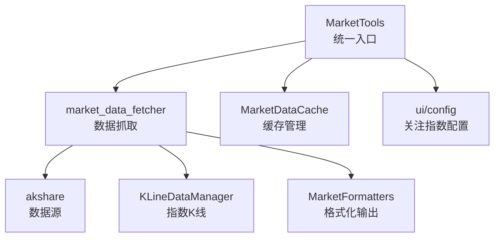
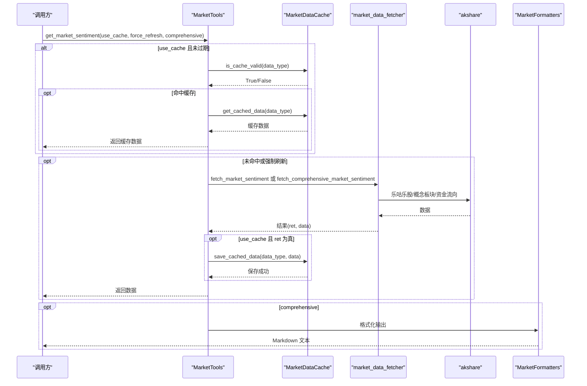
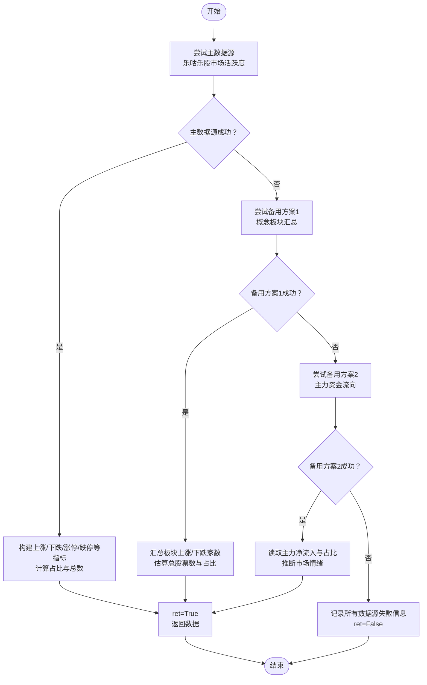
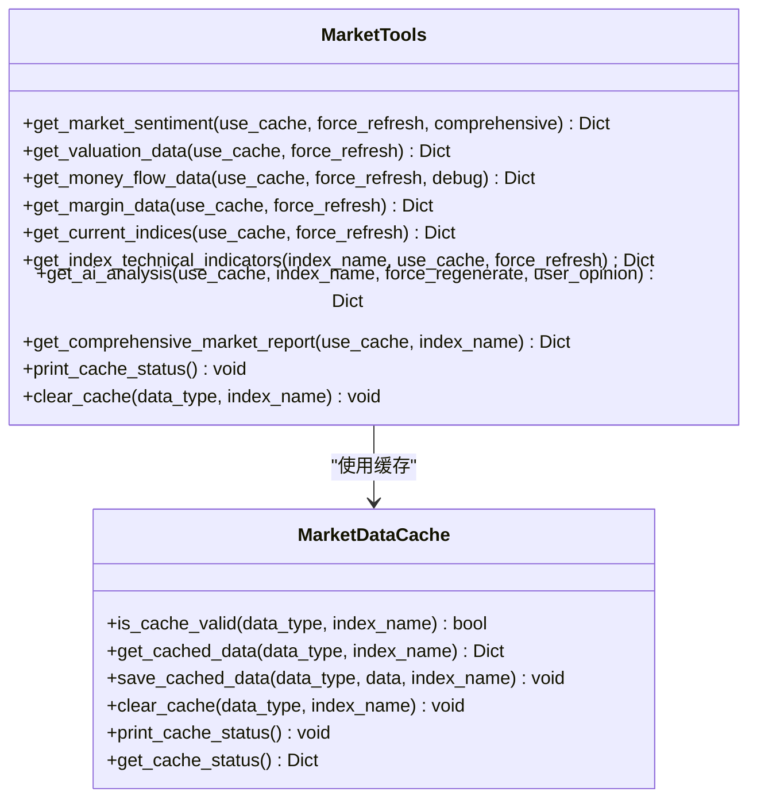
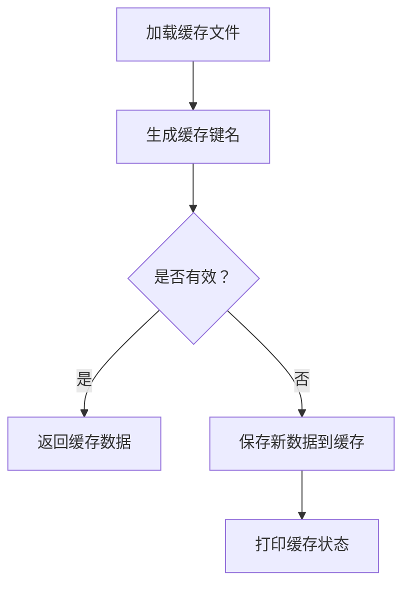
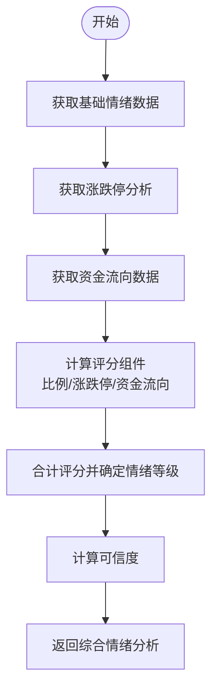
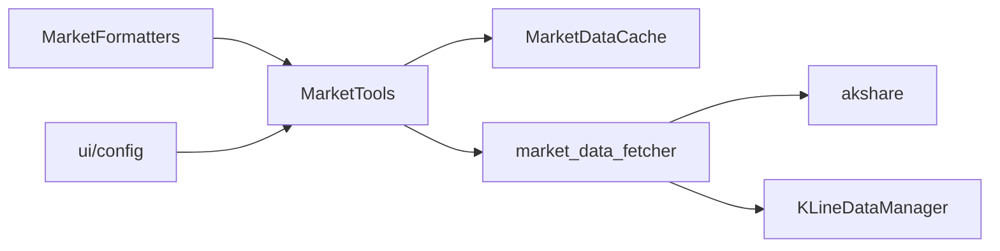

# 数据采集

<cite>
**本文引用的文件**
- [market_data_fetcher.py](file://market/market_data_fetcher.py)
- [market_data_tools.py](file://market/market_data_tools.py)
- [market_data_cache.py](file://market/market_data_cache.py)
- [kline_data_manager.py](file://market/kline_data_manager.py)
- [market_formatters.py](file://market/market_formatters.py)
- [config.py](file://ui/config.py)
</cite>

## 目录
1. [简介](#简介)
2. [项目结构](#项目结构)
3. [核心组件](#核心组件)
4. [架构总览](#架构总览)
5. [详细组件分析](#详细组件分析)
6. [依赖关系分析](#依赖关系分析)
7. [性能考量](#性能考量)
8. [故障排查指南](#故障排查指南)
9. [结论](#结论)
10. [附录](#附录)

## 简介
本文围绕 xystock 的市场情绪数据采集机制展开，重点解析 fetch_market_sentiment 函数的三级容错架构：主数据源（乐咕乐股市场活跃度）优先采集，失败时自动切换至备用方案（概念板块汇总估算、主力资金流向推断），并通过统一的 MarketTools 和 MarketDataCache 实现多级缓存与请求节流，避免频繁请求导致 IP 被封。同时提供常见问题应对策略、性能优化建议与异常处理示例路径。

## 项目结构
围绕市场情绪数据采集的关键模块如下：
- market/market_data_fetcher.py：提供 fetch_market_sentiment、fetch_comprehensive_market_sentiment 等数据抓取函数，封装三级容错与综合评分。
- market/market_data_tools.py：统一入口 MarketTools，负责缓存命中、强制刷新、错误回退与综合报告生成。
- market/market_data_cache.py：多类型缓存管理器，支持差异化过期策略与指数维度缓存。
- market/kline_data_manager.py：指数 K 线数据统一管理，服务于技术指标与可视化。
- market/market_formatters.py：市场数据格式化工具，用于情绪报告渲染。
- ui/config.py：关注指数与映射配置，支撑数据抓取与展示。

图表来源
- [market_data_tools.py](file://market/market_data_tools.py#L30-L120)
- [market_data_fetcher.py](file://market/market_data_fetcher.py#L24-L135)
- [market_data_cache.py](file://market/market_data_cache.py#L120-L240)
- [kline_data_manager.py](file://market/kline_data_manager.py#L152-L200)
- [market_formatters.py](file://market/market_formatters.py#L105-L210)
- [config.py](file://ui/config.py#L44-L82)

章节来源
- [market_data_tools.py](file://market/market_data_tools.py#L30-L120)
- [market_data_fetcher.py](file://market/market_data_fetcher.py#L24-L135)
- [market_data_cache.py](file://market/market_data_cache.py#L120-L240)
- [kline_data_manager.py](file://market/kline_data_manager.py#L152-L200)
- [market_formatters.py](file://market/market_formatters.py#L105-L210)
- [config.py](file://ui/config.py#L44-L82)

## 核心组件
- MarketTools.get_market_sentiment：统一入口，支持 use_cache/force_refresh/comprehensive 参数，先查缓存，再调用 fetch_market_sentiment 或 fetch_comprehensive_market_sentiment，失败时回退缓存。
- fetch_market_sentiment：三级容错抓取，主源（乐咕乐股市场活跃度）→ 备用（概念板块汇总）→ 最终备用（主力资金流向）。
- MarketDataCache：多类型缓存，差异化过期时间，支持指数维度键名，提供 is_cache_valid/get_cached_data/save_cached_data/clear_cache/print_cache_status。
- fetch_comprehensive_market_sentiment：整合基础情绪、涨跌停分析与资金流向，计算综合评分与情绪等级，并评估可信度。

章节来源
- [market_data_tools.py](file://market/market_data_tools.py#L39-L66)
- [market_data_fetcher.py](file://market/market_data_fetcher.py#L24-L135)
- [market_data_fetcher.py](file://market/market_data_fetcher.py#L463-L566)
- [market_data_cache.py](file://market/market_data_cache.py#L120-L240)

## 架构总览
下图展示了从 UI/调用方到数据抓取、缓存与格式化的端到端流程。

图表来源
- [market_data_tools.py](file://market/market_data_tools.py#L39-L66)
- [market_data_fetcher.py](file://market/market_data_fetcher.py#L24-L135)
- [market_data_fetcher.py](file://market/market_data_fetcher.py#L463-L566)
- [market_formatters.py](file://market/market_formatters.py#L105-L210)

## 详细组件分析

### fetch_market_sentiment：三级容错架构
- 主数据源（乐咕乐股市场活跃度）
  - 从 akshare 获取市场活跃度数据，提取上涨/下跌/平盘/涨停/跌停/停牌等核心指标，计算占比与总数，标注数据源为“乐咕乐股-市场活跃度”。
  - 成功即 ret=True，返回数据；失败进入备用方案。
- 第一级备用方案（概念板块汇总）
  - 从 akshare 获取概念板块列表，汇总上涨家数与下跌家数，估算总股票数，计算上涨/下跌占比，标注数据源为“东方财富-概念板块汇总”。
  - 成功即 ret=True，返回数据；失败进入最终备用方案。
- 第二级备用方案（主力资金流向）
  - 从 akshare 获取大盘资金流向，读取主力净流入金额与占比，基于占比阈值推断市场情绪（乐观/中性/悲观），标注数据源为“东方财富-大盘资金流向”。
  - 成功即 ret=True，返回数据；若三次均失败，记录错误信息并 ret=False。
- 异常处理与日志
  - 每一步均有 try/except 捕获异常并打印失败原因，保证流程稳健。
- 返回值
  - 返回 (ret, data)，其中 data 包含 update_time、数据源标识、核心指标与比率等。

图表来源
- [market_data_fetcher.py](file://market/market_data_fetcher.py#L24-L135)

章节来源
- [market_data_fetcher.py](file://market/market_data_fetcher.py#L24-L135)

### MarketTools：统一入口与缓存策略
- get_market_sentiment
  - 根据 comprehensive 决定缓存键类型（基础情绪或综合情绪）。
  - 若 use_cache 且未过期，直接返回缓存；否则调用 fetch_*，成功后写入缓存。
  - 发生异常时，若允许缓存则回退缓存数据，否则返回空字典。
- 其他能力
  - get_valuation_data、get_money_flow_data、get_margin_data、get_current_indices、get_index_technical_indicators、get_ai_analysis、get_comprehensive_market_report 等均遵循相同缓存策略。
  - print_cache_status 与 clear_cache 支持运维与调试。

图表来源
- [market_data_tools.py](file://market/market_data_tools.py#L39-L66)
- [market_data_cache.py](file://market/market_data_cache.py#L120-L240)

章节来源
- [market_data_tools.py](file://market/market_data_tools.py#L39-L66)
- [market_data_tools.py](file://market/market_data_tools.py#L196-L231)
- [market_data_tools.py](file://market/market_data_tools.py#L232-L249)
- [market_data_tools.py](file://market/market_data_tools.py#L273-L306)
- [market_data_tools.py](file://market/market_data_tools.py#L307-L351)
- [market_data_tools.py](file://market/market_data_tools.py#L379-L420)
- [market_data_tools.py](file://market/market_data_tools.py#L421-L455)

### MarketDataCache：多级缓存与差异化过期
- 缓存键命名
  - 非指数相关：直接以数据类型为键。
  - 指数相关：键名附加指数名称后缀，如 technical_indicators_上证指数。
- 过期策略
  - market_sentiment/comprehensive_sentiment：15 分钟
  - valuation_indicators：1440 分钟（1 天）
  - money_flow_indicators：43200 分钟（30 天）
  - margin_detail：60 分钟
  - current_indices：5 分钟
  - ai_analysis/technical_indicators：指数维度缓存，分别 180/60 分钟
- 功能
  - 加载/保存缓存文件，清理指定类型或指数的缓存，打印缓存状态与剩余有效期。

图表来源
- [market_data_cache.py](file://market/market_data_cache.py#L120-L240)
- [market_data_cache.py](file://market/market_data_cache.py#L247-L295)
- [market_data_cache.py](file://market/market_data_cache.py#L296-L390)

章节来源
- [market_data_cache.py](file://market/market_data_cache.py#L120-L240)
- [market_data_cache.py](file://market/market_data_cache.py#L247-L295)
- [market_data_cache.py](file://market/market_data_cache.py#L296-L390)

### 综合情绪分析：fetch_comprehensive_market_sentiment
- 数据来源整合
  - 基础情绪：fetch_market_sentiment
  - 涨跌停分析：fetch_limit_stocks_data
  - 资金流向：从 akshare 获取最新资金流向数据
- 评分体系
  - 基于涨跌比例：(up_ratio - 0.5) × 80，范围约 ±40
  - 基于涨跌停比例：((limit_up - limit_down) / total_stocks) × 1000，限制在 ±20
  - 基于主力资金流向：main_net_ratio × 10，限制在 ±40
  - 合计得到综合评分，确定情绪等级（乐观/中性/悲观），并计算可信度（基于可用数据源数量）。
- 输出
  - 包含 basic_sentiment、limit_analysis、fund_flow、sentiment_score、sentiment_level、confidence、update_time 等。

图表来源
- [market_data_fetcher.py](file://market/market_data_fetcher.py#L463-L566)
- [market_data_fetcher.py](file://market/market_data_fetcher.py#L511-L538)

章节来源
- [market_data_fetcher.py](file://market/market_data_fetcher.py#L463-L566)
- [market_data_fetcher.py](file://market/market_data_fetcher.py#L511-L538)

### 主数据源采集流程详解：乐咕乐股市场活跃度
- 数据项
  - 上涨、下跌、平盘、涨停、跌停、真实涨停、真实跌停、停牌
  - 计算 total_stocks、up_ratio、down_ratio、limit_up_ratio
- 返回字段
  - up_stocks、down_stocks、flat_stocks、limit_up_stocks、limit_down_stocks、real_limit_up_stocks、real_limit_down_stocks、suspended_stocks、total_stocks、up_ratio、down_ratio、limit_up_ratio、data_source、update_time
- 失败处理
  - 捕获异常并打印失败原因，进入备用方案。

章节来源
- [market_data_fetcher.py](file://market/market_data_fetcher.py#L24-L135)

### 备用方案一：概念板块汇总估算
- 数据来源
  - 概念板块列表，汇总上涨家数与下跌家数，估算 total_stocks
- 返回字段
  - up_stocks、down_stocks、total_stocks、up_ratio、down_ratio、data_source、update_time
- 适用场景
  - 主数据源不可用时快速估算市场涨跌比例。

章节来源
- [market_data_fetcher.py](file://market/market_data_fetcher.py#L72-L113)

### 备用方案二：主力资金流向推断
- 数据来源
  - 大盘资金流向，读取主力净流入金额与占比
- 推断规则
  - 基于占比阈值（正负 1）推断市场情绪等级
- 返回字段
  - main_net_inflow、main_net_ratio、market_mood、data_source、update_time

章节来源
- [market_data_fetcher.py](file://market/market_data_fetcher.py#L101-L135)

### 多级缓存机制与请求节流
- 缓存命中优先
  - MarketTools 在每次抓取前先检查缓存有效性，避免重复请求。
- 差异化过期
  - 不同数据类型采用不同过期时间，兼顾时效性与稳定性。
- 指数维度缓存
  - 技术指标与 AI 分析按指数维度缓存，避免跨指数混淆。
- 缓存清理与运维
  - 支持按类型或指数清理缓存，打印缓存状态辅助诊断。

章节来源
- [market_data_tools.py](file://market/market_data_tools.py#L39-L66)
- [market_data_cache.py](file://market/market_data_cache.py#L120-L240)
- [market_data_cache.py](file://market/market_data_cache.py#L247-L295)
- [market_data_cache.py](file://market/market_data_cache.py#L296-L390)

### 常见问题与应对策略
- 数据源 API 变更
  - 现状：各抓取函数内联 akshare 调用，若接口变更需修改对应函数。
  - 建议：将 akshare 调用抽象为独立适配层，集中维护；或在 MarketDataCache 层增加“数据源健康检查”与降级开关。
- IP 被封/风控
  - 现状：通过缓存与较低频率访问缓解；未见显式延时或代理池。
  - 建议：引入请求间隔控制（如随机抖动）、并发限速、代理轮换与重试退避策略。
- 数据缺失
  - 现状：任一阶段失败会进入下一备用方案；若三次均失败，返回错误信息。
  - 建议：增加“历史回补”与“静态兜底”策略（如固定比例或默认值）。

章节来源
- [market_data_fetcher.py](file://market/market_data_fetcher.py#L24-L135)
- [market_data_tools.py](file://market/market_data_tools.py#L39-L66)

## 依赖关系分析
- 模块耦合
  - MarketTools 依赖 MarketDataCache 与 market_data_fetcher；fetcher 依赖 akshare 与 KLineDataManager（用于技术指标）。
  - MarketFormatters 依赖 MarketTools 生成的综合报告进行格式化。
- 外部依赖
  - akshare：市场活跃度、板块、资金流向、指数行情等数据接口。
  - ui/config：关注指数与映射，影响数据抓取与展示。

图表来源
- [market_data_tools.py](file://market/market_data_tools.py#L39-L66)
- [market_data_fetcher.py](file://market/market_data_fetcher.py#L24-L135)
- [kline_data_manager.py](file://market/kline_data_manager.py#L152-L200)
- [market_formatters.py](file://market/market_formatters.py#L575-L618)
- [config.py](file://ui/config.py#L44-L82)

章节来源
- [market_data_tools.py](file://market/market_data_tools.py#L39-L66)
- [market_data_fetcher.py](file://market/market_data_fetcher.py#L24-L135)
- [kline_data_manager.py](file://market/kline_data_manager.py#L152-L200)
- [market_formatters.py](file://market/market_formatters.py#L575-L618)
- [config.py](file://ui/config.py#L44-L82)

## 性能考量
- 请求频率控制
  - 建议在 MarketTools 层引入最小请求间隔（如 1-2 分钟），结合随机抖动避免触发风控。
- 并发处理
  - 对独立指数与独立数据类型采用并发抓取，但需限制并发度，避免 IP 封禁。
- 缓存命中率
  - 合理设置过期时间，减少网络请求；对高频访问的综合报告可适当缩短过期时间。
- 数据清洗与序列化
  - 使用 NumpyJSONEncoder 处理 numpy/pandas/datetime 类型，避免 JSON 序列化失败。

章节来源
- [market_data_cache.py](file://market/market_data_cache.py#L21-L118)
- [market_data_cache.py](file://market/market_data_cache.py#L120-L240)

## 故障排查指南
- 缓存状态查看
  - 使用 MarketTools.print_cache_status 查看各类数据的缓存有效性与剩余时间。
- 缓存清理
  - 使用 MarketTools.clear_cache(data_type, index_name) 清理指定类型或指数的缓存，便于重新抓取验证。
- 错误回退
  - MarketTools 在抓取异常时会回退缓存数据（若允许缓存），避免 UI 报错。
- 日志定位
  - fetch_market_sentiment 每步均打印失败原因，便于快速定位 akshare 接口变化或网络异常。

章节来源
- [market_data_tools.py](file://market/market_data_tools.py#L39-L66)
- [market_data_tools.py](file://market/market_data_tools.py#L400-L420)
- [market_data_fetcher.py](file://market/market_data_fetcher.py#L24-L135)

## 结论
xystock 的市场情绪采集通过“主数据源优先 + 两级备用 + 统一缓存”的设计，在保证数据质量的同时提升了鲁棒性与用户体验。MarketTools 与 MarketDataCache 的配合实现了请求节流与稳定输出，fetch_comprehensive_market_sentiment 则将多维指标融合为可读的综合评分与情绪等级。未来可在请求间隔控制、并发限速与代理轮换等方面进一步优化，以应对更复杂的外部环境。

## 附录
- 关注指数配置
  - FOCUS_INDICES 与 INDEX_SYMBOL_MAPPING 影响数据抓取与展示，确保与 akshare 接口一致。
- 格式化输出
  - MarketFormatters 提供情绪、估值、资金流向、融资融券等多维度格式化，便于报告生成与 UI 展示。

章节来源
- [config.py](file://ui/config.py#L44-L82)
- [market_formatters.py](file://market/market_formatters.py#L105-L210)
- [market_formatters.py](file://market/market_formatters.py#L370-L451)
- [market_formatters.py](file://market/market_formatters.py#L452-L513)
- [market_formatters.py](file://market/market_formatters.py#L514-L560)
- [market_formatters.py](file://market/market_formatters.py#L561-L618)
- [market_formatters.py](file://market/market_formatters.py#L619-L647)