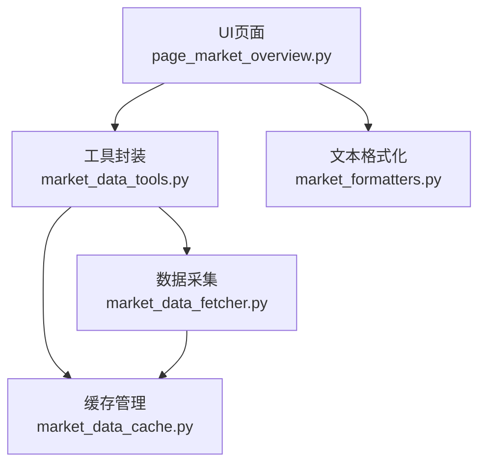
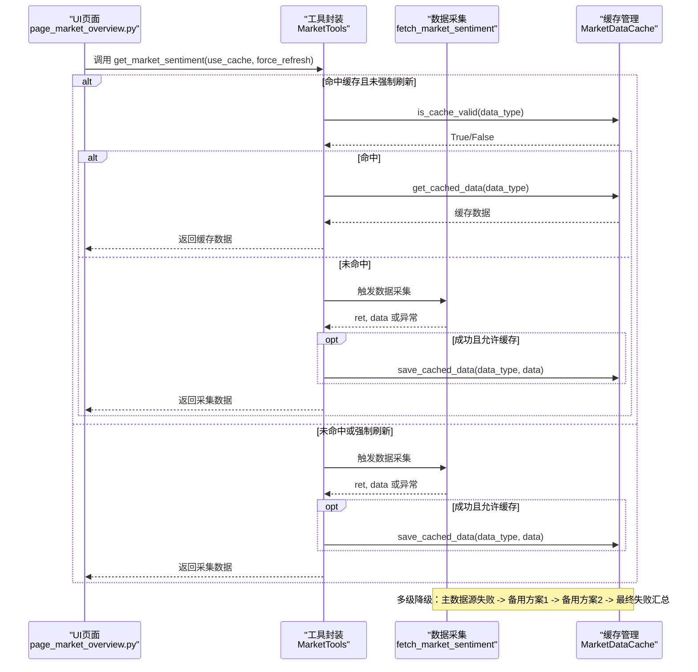
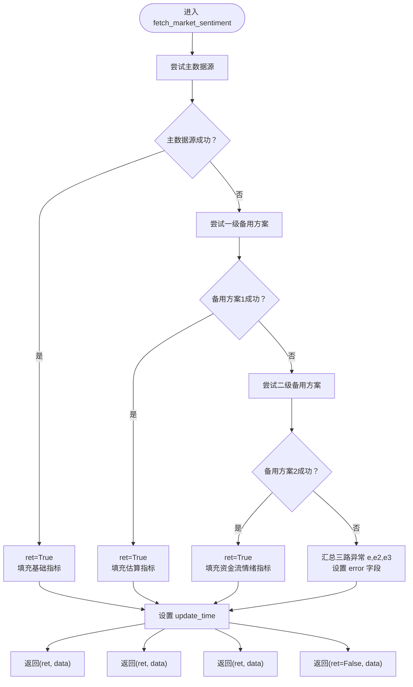
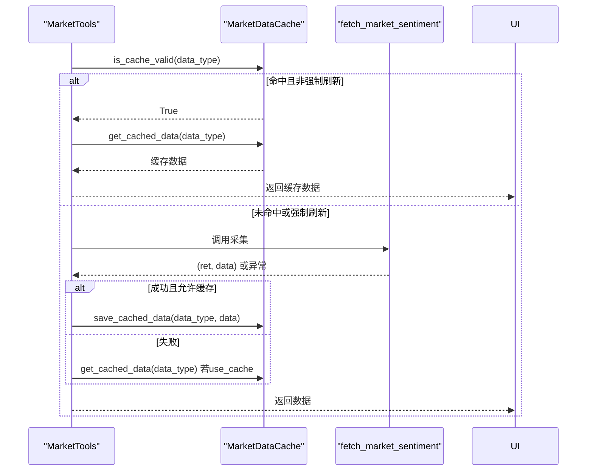
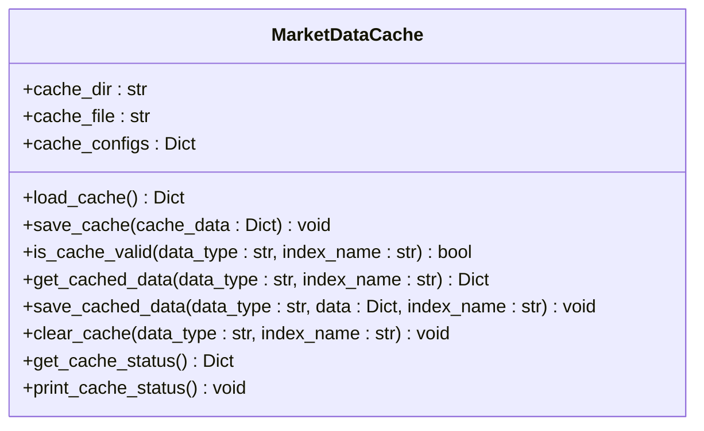
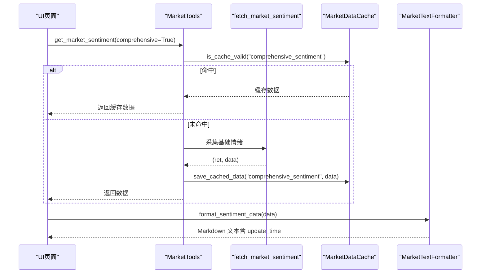
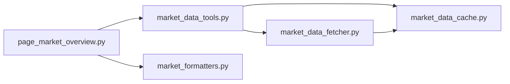

# 缓存与错误处理

<cite>
**本文引用的文件**
- [market_data_fetcher.py](file://market/market_data_fetcher.py)
- [market_data_tools.py](file://market/market_data_tools.py)
- [market_data_cache.py](file://market/market_data_cache.py)
- [page_market_overview.py](file://ui/components/page_market_overview.py)
- [market_formatters.py](file://market/market_formatters.py)
</cite>

## 目录
1. [简介](#简介)
2. [项目结构](#项目结构)
3. [核心组件](#核心组件)
4. [架构总览](#架构总览)
5. [详细组件分析](#详细组件分析)
6. [依赖关系分析](#依赖关系分析)
7. [性能考量](#性能考量)
8. [故障排查指南](#故障排查指南)
9. [结论](#结论)

## 简介
本文件聚焦于xystock项目中“市场情绪数据采集”的缓存机制与错误处理策略，系统性说明：
- fetch_market_sentiment函数如何通过多级try-except实现三级容错：主数据源失败后自动降级到一级备用方案，再失败则启用二级备用方案，确保服务高可用。
- 数据更新时间（update_time）的记录方式与在UI中的展示逻辑。
- 异常信息的打印与错误链的传递（e、e2、e3），以及最终错误信息的汇总。
- 缓存机制在避免IP被封和提升响应速度方面的作用，并给出生产环境的缓存过期策略建议。

## 项目结构
围绕市场情绪数据采集与展示的相关模块如下：
- 数据采集层：market/market_data_fetcher.py 提供原始数据抓取与多级降级逻辑。
- 工具封装层：market/market_data_tools.py 提供统一入口，集成缓存与错误回退。
- 缓存管理层：market/market_data_cache.py 提供缓存读写、有效期校验与状态打印。
- UI展示层：ui/components/page_market_overview.py 展示市场情绪与更新时间；market/market_formatters.py 负责文本格式化，包含update_time的展示。

图表来源
- [page_market_overview.py](file://ui/components/page_market_overview.py#L162-L178)
- [market_data_tools.py](file://market/market_data_tools.py#L39-L66)
- [market_data_fetcher.py](file://market/market_data_fetcher.py#L24-L135)
- [market_data_cache.py](file://market/market_data_cache.py#L120-L246)
- [market_formatters.py](file://market/market_formatters.py#L320-L330)

章节来源
- [page_market_overview.py](file://ui/components/page_market_overview.py#L162-L178)
- [market_data_tools.py](file://market/market_data_tools.py#L39-L66)
- [market_data_fetcher.py](file://market/market_data_fetcher.py#L24-L135)
- [market_data_cache.py](file://market/market_data_cache.py#L120-L246)
- [market_formatters.py](file://market/market_formatters.py#L320-L330)

## 核心组件
- fetch_market_sentiment：实现三级容错的数据采集函数，优先使用主数据源，失败后依次尝试备用方案，并在最终失败时汇总错误信息。
- MarketTools.get_market_sentiment：统一入口，负责缓存命中判断、强制刷新控制、异常回退与缓存落盘。
- MarketDataCache：提供缓存读写、有效期校验、状态打印与清理能力。
- UI展示：page_market_overview.py在情绪分析区域调用工具并渲染；market_formatters.py在格式化文本时展示update_time。

章节来源
- [market_data_fetcher.py](file://market/market_data_fetcher.py#L24-L135)
- [market_data_tools.py](file://market/market_data_tools.py#L39-L66)
- [market_data_cache.py](file://market/market_data_cache.py#L120-L246)
- [page_market_overview.py](file://ui/components/page_market_overview.py#L162-L178)
- [market_formatters.py](file://market/market_formatters.py#L320-L330)

## 架构总览
下图展示了从UI到数据采集、缓存与回退的整体流程。

图表来源
- [page_market_overview.py](file://ui/components/page_market_overview.py#L162-L178)
- [market_data_tools.py](file://market/market_data_tools.py#L39-L66)
- [market_data_fetcher.py](file://market/market_data_fetcher.py#L24-L135)
- [market_data_cache.py](file://market/market_data_cache.py#L192-L246)

## 详细组件分析

### fetch_market_sentiment：三级容错与错误链
- 主数据源：优先使用主数据源获取市场活跃度数据，若成功则设置ret为True并返回。
- 一级备用方案：主数据源失败时，尝试从概念板块汇总数据获取上涨/下跌家数，估算总股票数并返回。
- 二级备用方案：一级备用方案失败时，尝试从大盘资金流向推断市场情绪（主力净流入/净占比），并根据阈值判定多/空/中性。
- 最终失败：若三级方案均失败，构造错误信息并汇总三路异常（e、e2、e3），同时仍设置update_time，保证UI可展示时间戳。

图表来源
- [market_data_fetcher.py](file://market/market_data_fetcher.py#L24-L135)

章节来源
- [market_data_fetcher.py](file://market/market_data_fetcher.py#L24-L135)

### MarketTools.get_market_sentiment：缓存与回退
- 缓存命中：当use_cache为True且force_refresh为False时，先检查缓存有效性，命中则直接返回缓存数据。
- 强制刷新：当force_refresh为True时，绕过缓存直接采集。
- 异常回退：采集过程中捕获异常，打印错误信息，并在use_cache为True时返回缓存数据，否则返回空字典。
- 缓存落盘：采集成功且ret为True时，将数据写入缓存。

图表来源
- [market_data_tools.py](file://market/market_data_tools.py#L39-L66)
- [market_data_cache.py](file://market/market_data_cache.py#L192-L246)
- [market_data_fetcher.py](file://market/market_data_fetcher.py#L24-L135)

章节来源
- [market_data_tools.py](file://market/market_data_tools.py#L39-L66)

### MarketDataCache：缓存生命周期与过期策略
- 缓存键生成：支持区分“指数相关”与“非指数相关”两类数据，指数相关数据会附加指数名后缀。
- 有效期校验：基于cache_meta中的timestamp与expire_minutes计算过期时间，当前时间早于过期时间即视为有效。
- 读写与清理：提供load/save、get_cached_data/save_cached_data、clear_cache等接口；打印缓存状态时会显示剩余/过期时间、文件大小等信息。
- JSON编码：自定义NumpyJSONEncoder，处理numpy/pandas/datetime等类型，确保可序列化。

图表来源
- [market_data_cache.py](file://market/market_data_cache.py#L120-L246)
- [market_data_cache.py](file://market/market_data_cache.py#L296-L429)

章节来源
- [market_data_cache.py](file://market/market_data_cache.py#L120-L246)
- [market_data_cache.py](file://market/market_data_cache.py#L296-L429)

### UI展示：update_time的记录与呈现
- 数据采集侧：所有数据采集函数在成功或失败时都会设置update_time字段，确保UI可展示。
- UI渲染侧：page_market_overview.py在情绪分析区域调用MarketTools获取综合情绪数据；market_formatters.py在格式化文本时包含update_time与数据源信息，UI页面随后在相应位置展示。

图表来源
- [page_market_overview.py](file://ui/components/page_market_overview.py#L162-L178)
- [market_data_tools.py](file://market/market_data_tools.py#L39-L66)
- [market_data_fetcher.py](file://market/market_data_fetcher.py#L24-L135)
- [market_formatters.py](file://market/market_formatters.py#L320-L330)

章节来源
- [page_market_overview.py](file://ui/components/page_market_overview.py#L162-L178)
- [market_formatters.py](file://market/market_formatters.py#L320-L330)

## 依赖关系分析
- MarketTools依赖MarketDataCache进行缓存管理，并调用MarketDataFetcher系列函数进行数据采集。
- MarketDataFetcher内部实现多级降级与update_time设置。
- UI层通过MarketTools间接依赖缓存与数据采集，最终由MarketTextFormatter负责文本格式化。

图表来源
- [page_market_overview.py](file://ui/components/page_market_overview.py#L162-L178)
- [market_data_tools.py](file://market/market_data_tools.py#L39-L66)
- [market_data_fetcher.py](file://market/market_data_fetcher.py#L24-L135)
- [market_data_cache.py](file://market/market_data_cache.py#L120-L246)
- [market_formatters.py](file://market/market_formatters.py#L320-L330)

章节来源
- [page_market_overview.py](file://ui/components/page_market_overview.py#L162-L178)
- [market_data_tools.py](file://market/market_data_tools.py#L39-L66)
- [market_data_fetcher.py](file://market/market_data_fetcher.py#L24-L135)
- [market_data_cache.py](file://market/market_data_cache.py#L120-L246)
- [market_formatters.py](file://market/market_formatters.py#L320-L330)

## 性能考量
- 缓存命中率：MarketTools在use_cache为True且未强制刷新时优先命中缓存，显著降低网络请求频率，避免IP被封风险。
- 过期策略：不同数据类型具有差异化过期分钟数，例如市场情绪（15分钟）、估值（1440分钟）、资金流向（43200分钟）等。建议在生产环境结合业务波动性与数据敏感度调整，例如：
  - 高频短期指标（如市场情绪）：维持较短过期（如10-20分钟）。
  - 中长期指标（如估值）：适当延长过期（如12-24小时）。
  - 实时性要求高的指标（如指数实时）：缩短至几分钟。
- 序列化稳定性：NumpyJSONEncoder确保复杂数据类型可序列化，减少I/O失败概率。

章节来源
- [market_data_cache.py](file://market/market_data_cache.py#L132-L142)
- [market_data_cache.py](file://market/market_data_cache.py#L168-L179)

## 故障排查指南
- 多级降级验证：若主数据源失败，确认是否触发一级备用方案；若仍失败，确认是否触发二级备用方案；若三级均失败，检查错误信息汇总（e、e2、e3）。
- 缓存状态检查：使用MarketDataCache.print_cache_status打印缓存状态，核对各数据类型是否过期、剩余时间与文件大小。
- UI时间显示：若update_time未显示，检查数据采集函数是否设置update_time，以及MarketTextFormatter是否正确提取并渲染。
- 强制刷新：在MarketTools中使用force_refresh=True可绕过缓存，快速定位网络或第三方接口问题。

章节来源
- [market_data_fetcher.py](file://market/market_data_fetcher.py#L24-L135)
- [market_data_cache.py](file://market/market_data_cache.py#L391-L429)
- [market_data_tools.py](file://market/market_data_tools.py#L39-L66)
- [market_formatters.py](file://market/market_formatters.py#L320-L330)

## 结论
- fetch_market_sentiment通过三级容错设计，在主数据源不可用时自动降级，极大提升了系统的鲁棒性与可用性。
- MarketTools与MarketDataCache共同实现了“缓存优先、异常回退、可强制刷新”的稳健数据访问模式，既保护了上游接口免受频繁请求冲击，又保障了用户体验。
- UI层通过统一的格式化与展示逻辑，清晰呈现update_time与数据源信息，便于用户理解数据新鲜度与来源。
- 建议在生产环境根据业务特性调整缓存过期策略，持续监控缓存命中率与错误链，确保系统在高并发场景下的稳定性与可靠性。