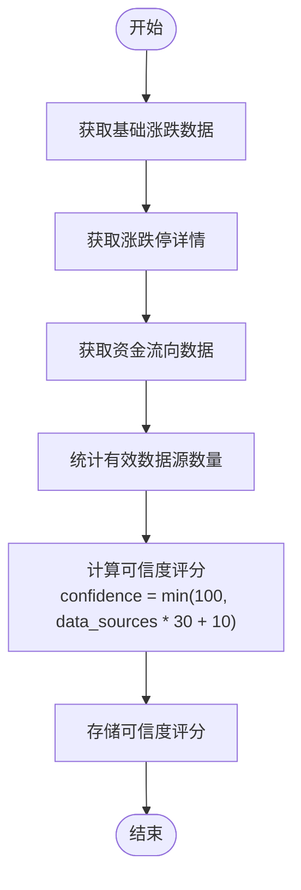

# 可信度评分

<cite>
**本文档引用文件**  
- [market_data_fetcher.py](file://market/market_data_fetcher.py)
- [market_formatters.py](file://market/market_formatters.py)
- [market_data_tools.py](file://market/market_data_tools.py)
</cite>

## 目录
1. [可信度评分概述](#可信度评分概述)
2. [数据源计数逻辑](#数据源计数逻辑)
3. [可信度评分计算公式](#可信度评分计算公式)
4. [代码实现流程](#代码实现流程)
5. [可信度评分的应用](#可信度评分的应用)
6. [常见问题与优化建议](#常见问题与优化建议)

## 可信度评分概述

在xystock系统中，市场情绪数据的可信度评分（confidence score）是一个关键指标，用于衡量综合市场情绪分析结果的可靠性。该评分范围为0-100，数值越高表示数据来源越全面、分析结果越可信。可信度评分的计算基于有效数据源的数量，通过`fetch_comprehensive_market_sentiment`函数实现，该函数整合了多个数据源的信息，包括基础涨跌数据、资金流向数据和涨跌停详情数据。

**Section sources**
- [market_data_fetcher.py](file://market/market_data_fetcher.py#L463-L607)

## 数据源计数逻辑

可信度评分的计算首先基于对有效数据源数量的统计。系统通过以下三个维度来判断数据源的有效性：

1. **基础涨跌数据**：检查`sentiment_data.get('data_source')`是否存在。如果存在，表示成功获取了市场涨跌家数、涨跌停股票等基础情绪数据，计为1个有效数据源。
2. **资金流向数据**：检查`comprehensive_data.get('fund_flow')`是否非空。如果存在资金流向数据，表示成功获取了主力资金净流入、超大单流向等资金数据，计为1个有效数据源。
3. **涨跌停详情数据**：检查`limit_data.get('limit_up_detail_count', 0) > 0`是否成立。如果涨停股票数量大于0，表示成功获取了详细的涨停股票信息，计为1个有效数据源。

这三个数据源的计数逻辑在`fetch_comprehensive_market_sentiment`函数中通过简单的条件判断实现，每个有效数据源贡献1点，最终累加得到`data_sources`的总分。

**Section sources**
- [market_data_fetcher.py](file://market/market_data_fetcher.py#L543-L549)

## 可信度评分计算公式

在统计出有效数据源数量后，系统使用以下公式计算最终的可信度评分：

```
confidence = min(100, data_sources * 30 + 10)
```

该公式的含义如下：
- **线性增长**：每增加一个有效数据源，可信度评分增加30分。这体现了多源数据融合的价值，数据源越多，分析结果越可靠。
- **基础保障**：即使只有一个数据源，可信度评分也有10分的基础分，确保了最低限度的可信度。
- **上限保护**：使用`min(100, ...)`确保评分不会超过100分，符合0-100的评分范围要求。

例如：
- 0个数据源：`min(100, 0*30+10) = 10`（但实际中这种情况表示数据获取失败，可信度为0）
- 1个数据源：`min(100, 1*30+10) = 40`
- 2个数据源：`min(100, 2*30+10) = 70`
- 3个数据源：`min(100, 3*30+10) = 100`

这种设计确保了当所有三个数据源都有效时，可信度达到满分100，体现了数据完整性的重要性。

**Section sources**
- [market_data_fetcher.py](file://market/market_data_fetcher.py#L550-L551)

## 代码实现流程

可信度评分的计算流程在`fetch_comprehensive_market_sentiment`函数中完整实现，主要步骤如下：

1. 初始化`comprehensive_data`字典，包含`sentiment_score`、`sentiment_level`和`confidence`等字段。
2. 依次调用`fetch_market_sentiment`、`fetch_limit_stocks_data`和资金流向获取逻辑，获取各维度数据。
3. 基于获取的数据计算情绪评分和情绪等级。
4. 统计有效数据源数量`data_sources`。
5. 使用公式`min(100, data_sources * 30 + 10)`计算可信度评分。
6. 将结果存储在`comprehensive_data['confidence']`中。

整个流程通过异常处理确保了计算的鲁棒性，即使部分数据源失败，也能基于可用数据源给出合理的可信度评分。



**Diagram sources**
- [market_data_fetcher.py](file://market/market_data_fetcher.py#L463-L607)

**Section sources**
- [market_data_fetcher.py](file://market/market_data_fetcher.py#L463-L607)

## 可信度评分的应用

可信度评分在xystock系统的多个环节中发挥重要作用：

1. **结果展示**：在市场报告中，可信度评分以"数据可信度: X%"的形式直接展示给用户，帮助用户判断分析结果的可靠性。
2. **决策支持**：高可信度的分析结果可以作为投资决策的重要参考，而低可信度的结果则提示用户需要谨慎对待或等待更多数据。
3. **系统监控**：通过监控可信度评分的变化，可以及时发现数据源异常或网络问题，便于系统维护。

在`MarketTextFormatter.format_sentiment_data`中，可信度评分被格式化为Markdown文本，与其他情绪指标一同展示，使用户能够直观地了解当前市场分析的可靠性。

**Section sources**
- [market_formatters.py](file://market/market_formatters.py#L130-L148)
- [market_data_tools.py](file://market/market_data_tools.py#L440)

## 常见问题与优化建议

### 常见问题
1. **单一数据源失效**：当某个数据源（如资金流向）因网络问题或API限制无法获取时，`data_sources`减少1，导致可信度评分从100降至70，显著影响用户对分析结果的信任。
2. **数据源质量不均**：不同数据源的可靠性不同，但当前评分模型对所有数据源一视同仁，可能导致评分与实际可靠性不完全匹配。

### 优化建议
1. **加权评分**：为不同数据源分配不同权重，如基础涨跌数据权重0.4，资金流向权重0.4，涨跌停详情权重0.2，使评分更符合实际重要性。
2. **动态调整**：根据历史数据验证各数据源的预测准确性，动态调整其权重。
3. **异常检测**：增加对数据源一致性的检查，如当涨跌家数与资金流向趋势严重背离时，降低可信度评分。
4. **多级评分**：除了0-100的总评分，可提供各数据源的子评分，让用户了解具体哪个维度的数据较弱。

通过这些优化，可以进一步提升可信度评分的准确性和实用性，为用户提供更可靠的决策支持。

**Section sources**
- [market_data_fetcher.py](file://market/market_data_fetcher.py#L543-L551)
- [market_formatters.py](file://market/market_formatters.py#L130-L148)