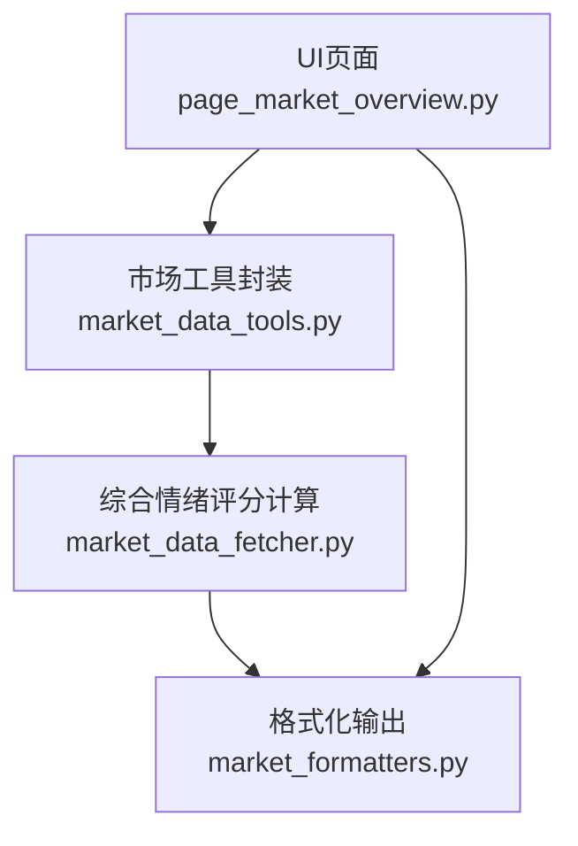
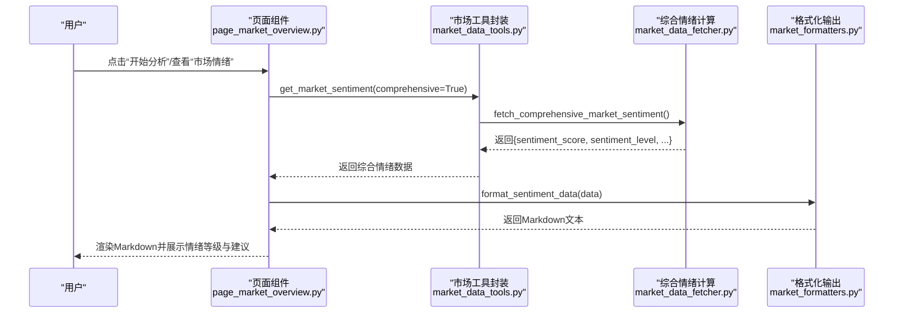
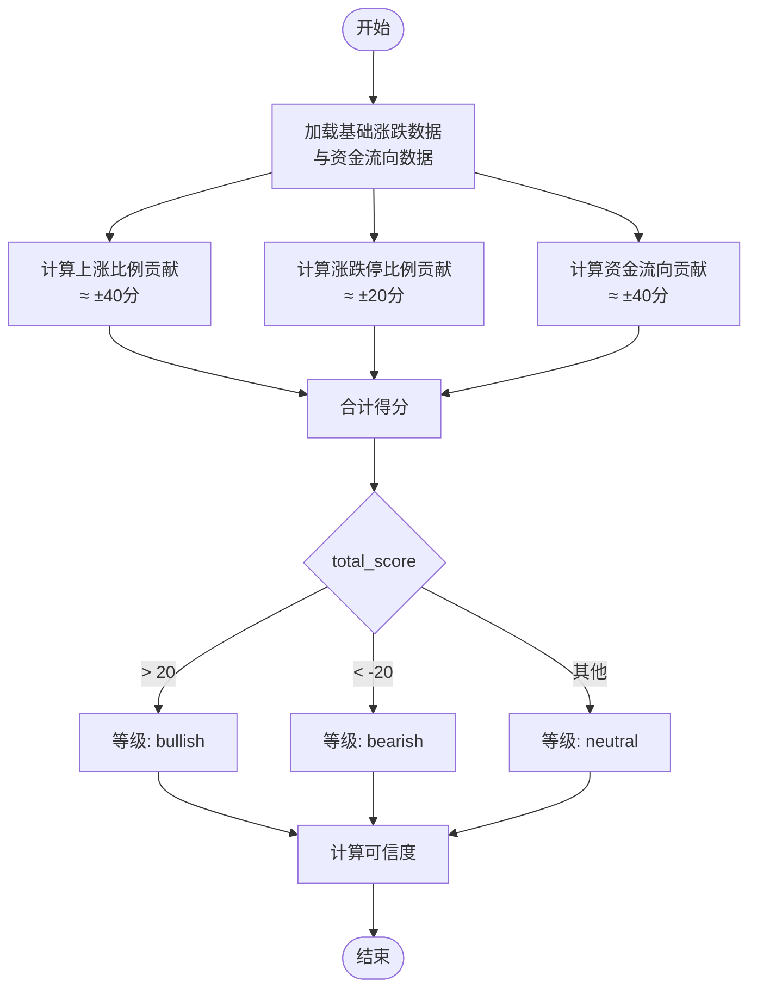
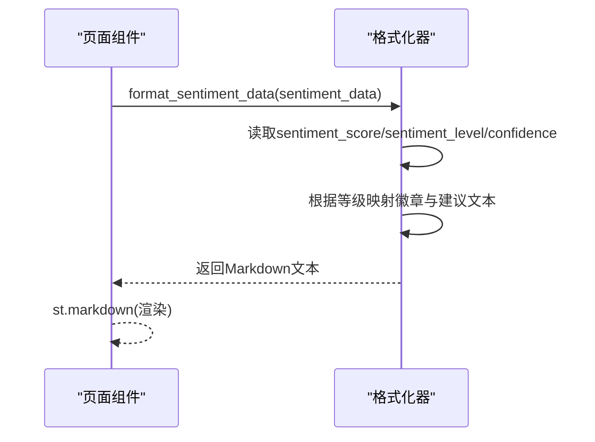
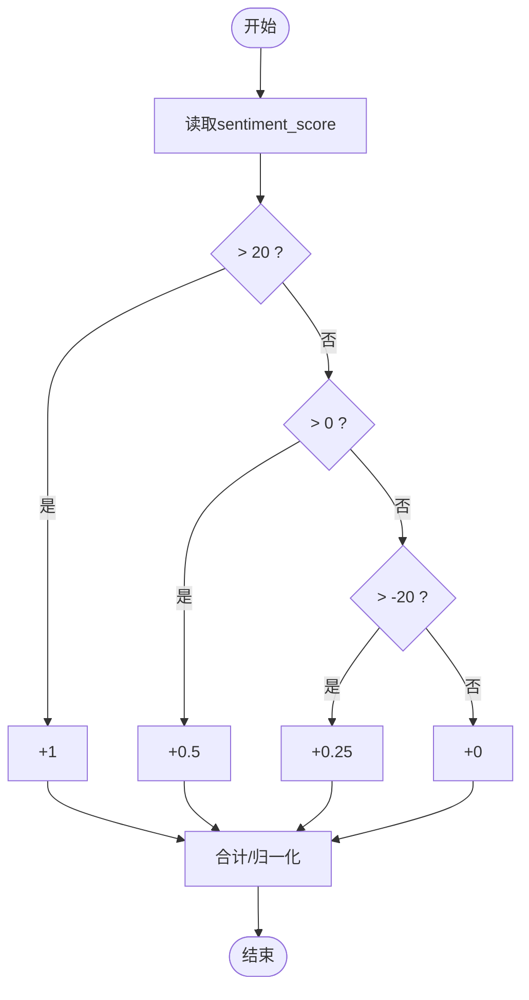
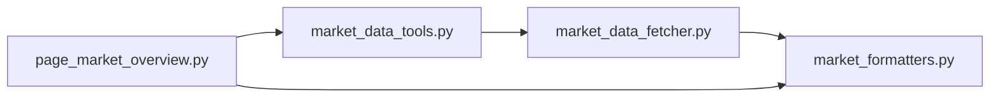

# 情绪等级判定

<cite>
**本文引用的文件**
- [market_data_fetcher.py](file://market/market_data_fetcher.py)
- [market_formatters.py](file://market/market_formatters.py)
- [page_market_overview.py](file://ui/components/page_market_overview.py)
- [market_data_tools.py](file://market/market_data_tools.py)
</cite>

## 目录
1. [引言](#引言)
2. [项目结构](#项目结构)
3. [核心组件](#核心组件)
4. [架构总览](#架构总览)
5. [详细组件分析](#详细组件分析)
6. [依赖关系分析](#依赖关系分析)
7. [性能考量](#性能考量)
8. [故障排查指南](#故障排查指南)
9. [结论](#结论)

## 引言
本文件聚焦于xystock中“市场情绪等级”的判定规则与UI输出流程，围绕以下目标展开：
- 解释综合情绪评分total_score的计算来源与边界
- 明确情绪等级划分：bullish（>20）、bearish（<-20）、neutral（-20到20区间）
- 结合market_formatters.py的格式化输出，说明不同情绪等级对应的Markdown展示样式与投资建议文本
- 提供从评分到用户界面输出的完整流程示例路径
- 针对评分临界点附近频繁切换的问题，提出优化建议

## 项目结构
与“市场情绪等级”相关的关键文件与职责如下：
- market/market_data_fetcher.py：负责综合市场情绪评分的计算与情绪等级确定
- market/market_formatters.py：负责将情绪数据格式化为Markdown，包含情绪等级与建议文本
- ui/components/page_market_overview.py：负责在Streamlit页面中展示情绪分析与综合评级
- market/market_data_tools.py：封装获取综合情绪数据的入口，供UI层调用

图表来源
- [page_market_overview.py](file://ui/components/page_market_overview.py#L162-L178)
- [market_data_tools.py](file://market/market_data_tools.py#L40-L66)
- [market_data_fetcher.py](file://market/market_data_fetcher.py#L463-L566)
- [market_formatters.py](file://market/market_formatters.py#L106-L148)

章节来源
- [page_market_overview.py](file://ui/components/page_market_overview.py#L162-L178)
- [market_data_tools.py](file://market/market_data_tools.py#L40-L66)

## 核心组件
- 综合情绪评分计算与等级判定
  - 计算来源：基于“上涨比例”“涨跌停比例”“资金流向”三类指标的加权合成
  - 等级判定：total_score > 20 → bullish；total_score < -20 → bearish；否则 → neutral
- Markdown格式化输出
  - 展示情绪评分、等级、可信度
  - 根据total_score给出不同层级的建议文本（如“极度乐观/极度悲观”等）
- UI层展示
  - 页面组件调用工具层获取综合情绪数据
  - 使用格式化器生成Markdown并渲染到页面
  - 综合评级模块对情绪面进行二次评分（>20、>0、>-20）

章节来源
- [market_data_fetcher.py](file://market/market_data_fetcher.py#L503-L566)
- [market_formatters.py](file://market/market_formatters.py#L106-L148)
- [page_market_overview.py](file://ui/components/page_market_overview.py#L416-L507)

## 架构总览
下面的序列图展示了从用户触发到最终UI输出的完整流程：

图表来源
- [page_market_overview.py](file://ui/components/page_market_overview.py#L162-L178)
- [market_data_tools.py](file://market/market_data_tools.py#L40-L66)
- [market_data_fetcher.py](file://market/market_data_fetcher.py#L463-L566)
- [market_formatters.py](file://market/market_formatters.py#L106-L148)

## 详细组件分析

### 组件A：综合情绪评分与等级判定
- 评分构成与边界
  - 上涨比例贡献：基于“上涨比例”线性映射，范围约±40分
  - 涨跌停比例贡献：基于“涨停-跌停”占总股数的比例，放大1000倍后限制在±20分
  - 资金流向贡献：基于“主力净流入占比”，按4%为满分线性映射，范围约±40分
  - 总分：三者之和，理论范围约±100分
- 等级判定
  - total_score > 20 → bullish
  - total_score < -20 → bearish
  - 否则 → neutral
- 可信度
  - 基于数据源完整性计数，最多100%

图表来源
- [market_data_fetcher.py](file://market/market_data_fetcher.py#L503-L566)

章节来源
- [market_data_fetcher.py](file://market/market_data_fetcher.py#L503-L566)

### 组件B：Markdown格式化与UI输出
- 情绪等级展示
  - 在“综合情绪评分”小节中，将sentiment_level映射为“乐观/悲观/中性”的彩色徽章
  - 展示情绪评分与可信度
- 建议文本
  - 根据total_score给出不同层级的建议文本，例如“极度乐观/偏乐观/中性/偏悲观/极度悲观”
  - UI层还提供“总体情绪判断”段落，进一步细化建议
- UI渲染
  - 页面组件通过MarketTextFormatter.format_sentiment_data生成Markdown
  - 直接在Streamlit中渲染，形成直观的“情绪等级+建议”展示

图表来源
- [market_formatters.py](file://market/market_formatters.py#L106-L148)
- [page_market_overview.py](file://ui/components/page_market_overview.py#L162-L178)

章节来源
- [market_formatters.py](file://market/market_formatters.py#L106-L148)
- [page_market_overview.py](file://ui/components/page_market_overview.py#L162-L178)

### 组件C：综合评级中的情绪面评分
- 页面提供“综合评级”模块，对技术面、资金面、情绪面分别打分
- 情绪面评分规则
  - total_score > 20 → 1分
  - total_score > 0 → 0.5分
  - total_score > -20 → 0.25分
  - 负分不加分
- 该评分用于生成“市场综合评级”的文字描述（如“强势/偏强/中性/偏弱/弱势”）

图表来源
- [page_market_overview.py](file://ui/components/page_market_overview.py#L416-L507)

章节来源
- [page_market_overview.py](file://ui/components/page_market_overview.py#L416-L507)

## 依赖关系分析
- 页面组件依赖市场工具封装，后者统一调度数据获取与缓存
- 市场工具封装依赖综合情绪计算函数，后者产出情绪等级与评分
- 格式化器独立于业务逻辑，仅消费数据字典并输出Markdown
- UI层在“综合评级”处再次消费情绪评分，形成双层判断

图表来源
- [page_market_overview.py](file://ui/components/page_market_overview.py#L162-L178)
- [market_data_tools.py](file://market/market_data_tools.py#L40-L66)
- [market_data_fetcher.py](file://market/market_data_fetcher.py#L463-L566)
- [market_formatters.py](file://market/market_formatters.py#L106-L148)

章节来源
- [page_market_overview.py](file://ui/components/page_market_overview.py#L162-L178)
- [market_data_tools.py](file://market/market_data_tools.py#L40-L66)

## 性能考量
- 数据获取与缓存
  - 市场工具封装支持缓存与强制刷新，减少重复请求
  - 综合情绪计算涉及多源数据聚合，建议在UI层合理使用缓存开关
- 渲染效率
  - Markdown生成与Streamlit渲染均为轻量操作，性能瓶颈通常不在此处
- 评分稳定性
  - 若评分接近±20，建议在UI层增加“平滑”或“窗口平均”策略，避免频繁切换

[本节为通用指导，无需特定文件引用]

## 故障排查指南
- 未获取到情绪数据
  - 检查网络与数据源可用性
  - 查看工具层的错误回退逻辑与缓存命中情况
- 情绪等级与建议不符预期
  - 核对评分构成与边界，确认是否满足>20或<-20
  - 检查UI层“综合评级”是否覆盖了情绪面评分
- 评分临界点附近频繁切换
  - 建议引入“滞后阈值”或“滑动窗口平均”策略，降低噪声影响

章节来源
- [market_data_tools.py](file://market/market_data_tools.py#L40-L66)
- [page_market_overview.py](file://ui/components/page_market_overview.py#L416-L507)

## 结论
- 情绪等级判定采用“综合评分+阈值”的双层机制：评分计算决定等级，UI建议细化投资策略
- 评分边界清晰：>20为bullish，<-20为bearish，其余为neutral
- UI层通过格式化器与页面组件实现“评分+等级+建议”的一体化展示
- 针对临界点抖动，建议在UI层引入平滑策略，提升用户体验与决策稳定性