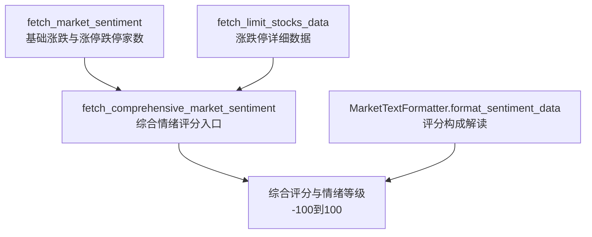
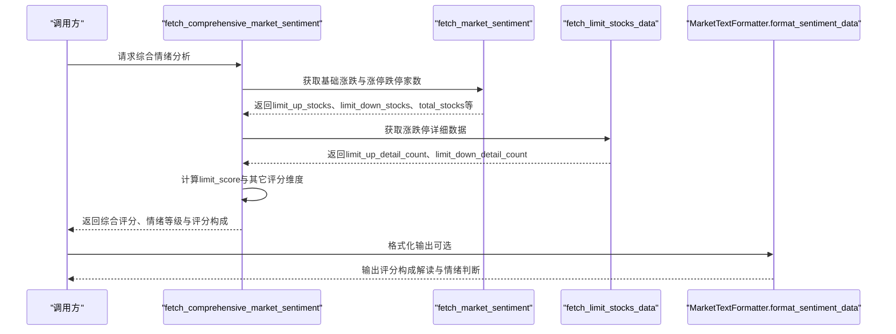
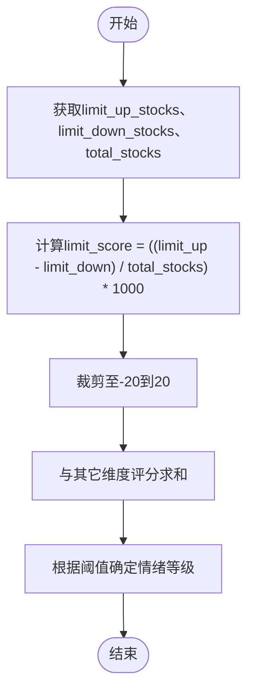
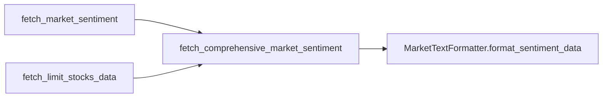

# 涨跌停比例评分

<cite>
**本文引用的文件**
- [market_data_fetcher.py](file://market/market_data_fetcher.py)
- [market_formatters.py](file://market/market_formatters.py)
</cite>

## 目录
1. [引言](#引言)
2. [项目结构](#项目结构)
3. [核心组件](#核心组件)
4. [架构总览](#架构总览)
5. [详细组件分析](#详细组件分析)
6. [依赖关系分析](#依赖关系分析)
7. [性能考量](#性能考量)
8. [故障排查指南](#故障排查指南)
9. [结论](#结论)
10. [附录](#附录)

## 引言
本文件聚焦于xystock中“基于涨跌停股票数量差值”的市场情绪评分维度，系统性阐述fetch_comprehensive_market_sentiment函数如何利用涨停与跌停股票数量差值占总股票数的比例，将-20到20分的评分融入综合情绪评分体系。文档将详细说明limit_up、limit_down与total_stocks字段的来源（分别来自fetch_market_sentiment与fetch_limit_stocks_data），解释limit_score = ((limit_up - limit_down) / total_stocks) * 1000的缩放机制与边界约束，提供评分流程的代码路径示例，并讨论极端行情下的敏感性、常见问题与优化建议。

## 项目结构
围绕“涨跌停比例评分”，涉及的核心文件与职责如下：
- market/market_data_fetcher.py
  - 提供基础市场情绪数据（含limit_up_stocks、limit_down_stocks、total_stocks等）与综合情绪评分计算入口
  - 提供涨跌停股票详细数据获取能力
- market/market_formatters.py
  - 提供情绪报告格式化输出，包含评分构成解读与可视化文案

图示来源
- [market_data_fetcher.py](file://market/market_data_fetcher.py#L24-L135)
- [market_data_fetcher.py](file://market/market_data_fetcher.py#L138-L178)
- [market_data_fetcher.py](file://market/market_data_fetcher.py#L463-L565)
- [market_formatters.py](file://market/market_formatters.py#L106-L368)

章节来源
- [market_data_fetcher.py](file://market/market_data_fetcher.py#L24-L135)
- [market_data_fetcher.py](file://market/market_data_fetcher.py#L138-L178)
- [market_data_fetcher.py](file://market/market_data_fetcher.py#L463-L565)
- [market_formatters.py](file://market/market_formatters.py#L106-L368)

## 核心组件
- 基础市场情绪数据（limit_up_stocks、limit_down_stocks、total_stocks）
  - 来自fetch_market_sentiment，该函数从“乐咕乐股-市场活跃度”接口聚合上涨、下跌、平盘、涨停、跌停、停牌等计数，并计算总数与占比，同时补充真实涨停/跌停计数与数据源标识
- 涨跌停详细数据（limit_up_detail_count、limit_down_detail_count）
  - 来自fetch_limit_stocks_data，该函数从“同花顺-涨停池/跌停池”接口获取当日涨停/跌停股票数量，并统计涨停原因分布
- 综合情绪评分（含limit_score）
  - 来自fetch_comprehensive_market_sentiment，该函数在基础数据基础上叠加资金流向评分与涨跌比例评分，最终形成-100到100的综合评分与情绪等级，并记录评分构成

章节来源
- [market_data_fetcher.py](file://market/market_data_fetcher.py#L24-L135)
- [market_data_fetcher.py](file://market/market_data_fetcher.py#L138-L178)
- [market_data_fetcher.py](file://market/market_data_fetcher.py#L463-L565)

## 架构总览
下图展示了“涨跌停比例评分”在综合情绪评分中的位置与数据流：

图示来源
- [market_data_fetcher.py](file://market/market_data_fetcher.py#L463-L565)
- [market_data_fetcher.py](file://market/market_data_fetcher.py#L24-L135)
- [market_data_fetcher.py](file://market/market_data_fetcher.py#L138-L178)
- [market_formatters.py](file://market/market_formatters.py#L106-L368)

## 详细组件分析

### 组件A：基础市场情绪数据（limit_up_stocks、limit_down_stocks、total_stocks）
- 数据来源与字段
  - limit_up_stocks：来自“乐咕乐股-市场活跃度”接口的“涨停”计数
  - limit_down_stocks：来自“乐咕乐股-市场活跃度”接口的“跌停”计数
  - total_stocks：上涨+下跌+平盘三类计数之和
- 计算与补充
  - 计算up_ratio、down_ratio、limit_up_ratio等占比
  - 记录数据源与更新时间
- 作用
  - 为“涨跌停比例评分”提供limit_up、limit_down与total_stocks三项核心输入

章节来源
- [market_data_fetcher.py](file://market/market_data_fetcher.py#L24-L135)

### 组件B：涨跌停详细数据（limit_up_detail_count、limit_down_detail_count）
- 数据来源与字段
  - limit_up_detail_count：当日涨停股票数量（来自“同花顺-涨停池”接口）
  - limit_down_detail_count：当日跌停股票数量（来自“同花顺-跌停池”接口）
- 作用
  - 作为评分可信度的辅助来源之一；综合评分计算中会据此提升可信度

章节来源
- [market_data_fetcher.py](file://market/market_data_fetcher.py#L138-L178)

### 组件C：综合情绪评分（含limit_score）
- 评分构成
  - 涨跌比例评分（-40到40分）
  - 涨跌停比例评分（-20到20分）
  - 资金流向评分（-40到40分）
- 涨跌停比例评分计算
  - 输入：limit_up_stocks、limit_down_stocks、total_stocks
  - 公式：limit_score = ((limit_up - limit_down) / total_stocks) * 1000
  - 边界：限制在-20到20之间
  - 说明：乘以1000用于放大灵敏度，使微小差异在总量级下也能体现；随后裁剪至[-20,20]以稳定整体评分范围
- 综合评分
  - 将各维度评分求和，得到-100到100范围内的综合评分
  - 根据阈值划分情绪等级（牛市/熊市/中性）

图示来源
- [market_data_fetcher.py](file://market/market_data_fetcher.py#L507-L521)

章节来源
- [market_data_fetcher.py](file://market/market_data_fetcher.py#L507-L521)
- [market_data_fetcher.py](file://market/market_data_fetcher.py#L523-L541)

### 组件D：评分构成解读与输出
- MarketTextFormatter.format_sentiment_data会：
  - 展示综合评分、情绪等级与数据可信度
  - 对评分构成进行逐项解读，其中包含“涨跌停贡献”维度
  - 提供总体情绪判断与建议

章节来源
- [market_formatters.py](file://market/market_formatters.py#L106-L368)

## 依赖关系分析
- fetch_comprehensive_market_sentiment依赖：
  - fetch_market_sentiment：提供limit_up_stocks、limit_down_stocks、total_stocks等基础数据
  - fetch_limit_stocks_data：提供limit_up_detail_count、limit_down_detail_count等辅助数据，用于提升可信度
- 输出依赖：
  - MarketTextFormatter.format_sentiment_data：用于格式化输出评分构成与情绪解读

图示来源
- [market_data_fetcher.py](file://market/market_data_fetcher.py#L24-L135)
- [market_data_fetcher.py](file://market/market_data_fetcher.py#L138-L178)
- [market_data_fetcher.py](file://market/market_data_fetcher.py#L463-L565)
- [market_formatters.py](file://market/market_formatters.py#L106-L368)

章节来源
- [market_data_fetcher.py](file://market/market_data_fetcher.py#L24-L135)
- [market_data_fetcher.py](file://market/market_data_fetcher.py#L138-L178)
- [market_data_fetcher.py](file://market/market_data_fetcher.py#L463-L565)
- [market_formatters.py](file://market/market_formatters.py#L106-L368)

## 性能考量
- 数据源稳定性
  - fetch_market_sentiment提供多套备用方案（乐咕乐股→概念板块汇总→资金流向），减少单一接口失败的影响
- 计算复杂度
  - 涨跌停比例评分为常数时间复杂度，仅涉及一次除法、一次乘法与两次比较，开销极低
- 缓存策略
  - 项目中多处采用智能缓存与批量更新策略，建议在高频调用场景下复用缓存结果，避免重复拉取

[本节为通用指导，无需列出具体文件来源]

## 故障排查指南
- 常见问题
  - 数据缺失或为空：当任一数据源失败时，综合评分可能无法生成或可信度降低
  - total_stocks为0：会导致limit_score计算出现除零风险，需确保基础数据有效
  - 接口限流或网络异常：可能导致数据拉取失败，应检查日志并重试
- 优化建议
  - 在基础数据为空时，优先启用备用方案（概念板块汇总或资金流向）
  - 对limit_up与limit_down进行一致性校验，避免来源不一致导致的偏差
  - 在UI层对评分构成进行可视化提示，帮助用户理解评分来源与可信度

章节来源
- [market_data_fetcher.py](file://market/market_data_fetcher.py#L24-L135)
- [market_data_fetcher.py](file://market/market_data_fetcher.py#L463-L565)

## 结论
“涨跌停比例评分”通过limit_up与limit_down的差值占total_stocks的比例，结合1000倍放大与-20到20的裁剪，实现了对极端行情的高敏感度捕捉，并将其纳入-100到100的综合评分体系。该评分维度在情绪解读中扮演“强势/恐慌信号”的直观指示器，配合资金流向与涨跌比例评分，能够为投资决策提供稳健的参考依据。

[本节为总结性内容，无需列出具体文件来源]

## 附录

### 评分维度与范围对照
- 涨跌比例评分：-40到40分
- 涨跌停比例评分：-20到20分
- 资金流向评分：-40到40分
- 综合评分：-100到100分

章节来源
- [market_data_fetcher.py](file://market/market_data_fetcher.py#L507-L541)

### 代码示例路径（不展示具体代码）
- 基础数据来源（limit_up_stocks、limit_down_stocks、total_stocks）
  - [fetch_market_sentiment](file://market/market_data_fetcher.py#L24-L135)
- 涨跌停详细数据来源（limit_up_detail_count、limit_down_detail_count）
  - [fetch_limit_stocks_data](file://market/market_data_fetcher.py#L138-L178)
- 综合情绪评分入口与limit_score计算
  - [fetch_comprehensive_market_sentiment](file://market/market_data_fetcher.py#L463-L565)
  - [limit_score计算与裁剪](file://market/market_data_fetcher.py#L507-L521)
- 评分构成解读与输出
  - [MarketTextFormatter.format_sentiment_data](file://market/market_formatters.py#L106-L368)