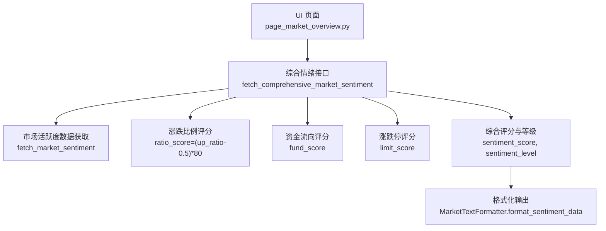
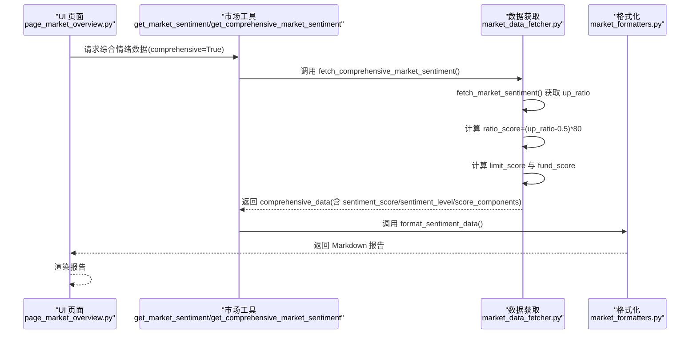
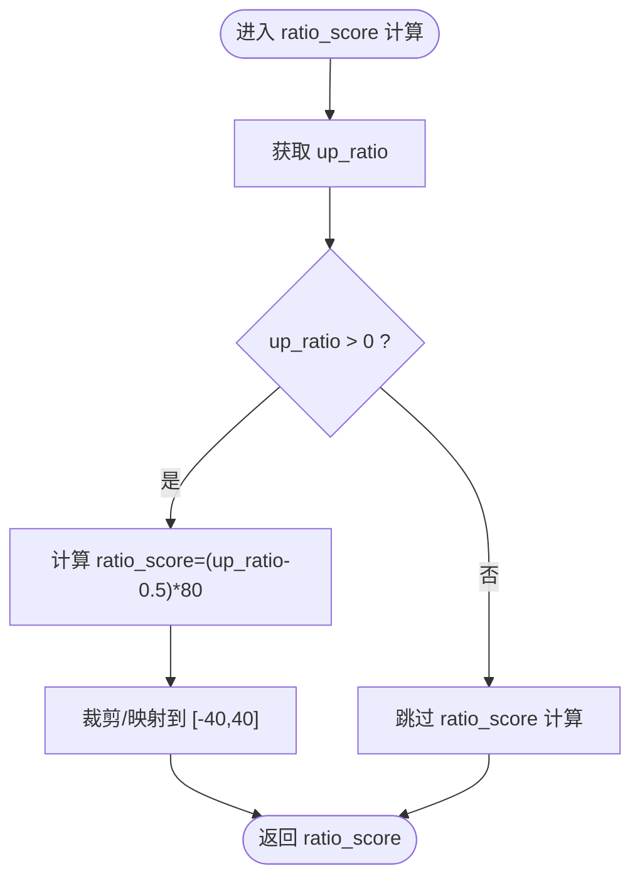
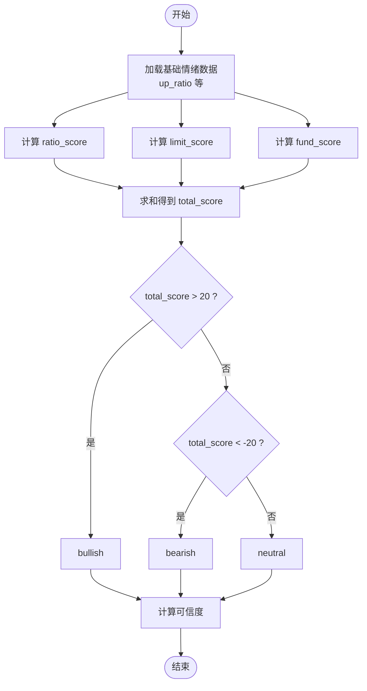
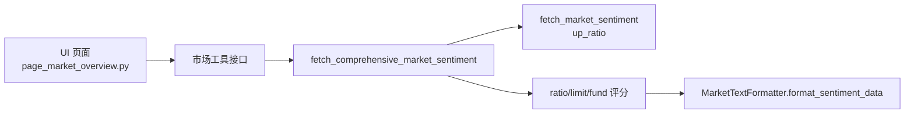

# 涨跌比例评分

<cite>
**本文引用的文件**
- [market_data_fetcher.py](file://market/market_data_fetcher.py)
- [market_formatters.py](file://market/market_formatters.py)
- [page_market_overview.py](file://ui/components/page_market_overview.py)
</cite>

## 目录
1. [简介](#简介)
2. [项目结构](#项目结构)
3. [核心组件](#核心组件)
4. [架构总览](#架构总览)
5. [详细组件分析](#详细组件分析)
6. [依赖关系分析](#依赖关系分析)
7. [性能考量](#性能考量)
8. [故障排查指南](#故障排查指南)
9. [结论](#结论)

## 简介
本文聚焦于 xystock 中“基于涨跌比例”的市场情绪评分计算方法，围绕 fetch_comprehensive_market_sentiment 函数中“涨跌比例评分”（ratio_score）的实现细节展开，解释：
- up_ratio 字段的来源与含义
- 为什么以 50% 为中性基准
- 公式 (up_ratio - 0.5) × 80 的设计意图与取值范围
- 该评分在整体情绪评分中的权重与意义
- 常见问题（如数据源切换导致的 up_ratio 波动）及优化建议

## 项目结构
围绕“涨跌比例评分”，涉及的关键文件与职责如下：
- market/market_data_fetcher.py：负责获取市场活跃度数据（含 up_ratio）、计算综合情绪评分（包含 ratio_score）
- market/market_formatters.py：负责将情绪数据格式化为 Markdown 报告，展示评分构成与解读
- ui/components/page_market_overview.py：UI 展示层，调用综合情绪接口并渲染报告

**图表来源**
- [page_market_overview.py](file://ui/components/page_market_overview.py#L162-L178)
- [market_data_fetcher.py](file://market/market_data_fetcher.py#L463-L566)
- [market_formatters.py](file://market/market_formatters.py#L106-L368)

**Section sources**
- [market_data_fetcher.py](file://market/market_data_fetcher.py#L463-L566)
- [market_formatters.py](file://market/market_formatters.py#L106-L368)
- [page_market_overview.py](file://ui/components/page_market_overview.py#L162-L178)

## 核心组件
- 市场活跃度数据获取（含 up_ratio）
  - 优先使用“乐咕乐股-市场活跃度”数据，计算 up_ratio = 上涨家数 / 总交易家数
  - 备用方案：概念板块汇总估算，up_ratio = 上涨家数 / (上涨家数+下跌家数)
- 综合情绪评分计算
  - ratio_score = (up_ratio - 0.5) × 80，范围 [-40, 40]
  - limit_score 基于涨停/跌停家数与总家数的差值，放大 1000 倍并裁剪至 [-20, 20]
  - fund_score 基于主力净流入占比，4% 为满分，裁剪至 [-40, 40]
  - 总分 = ratio_score + limit_score + fund_score，等级按阈值划分
- 报告格式化
  - MarketTextFormatter.format_sentiment_data 展示评分构成与解读，帮助理解 ratio_score 的贡献

**Section sources**
- [market_data_fetcher.py](file://market/market_data_fetcher.py#L24-L135)
- [market_data_fetcher.py](file://market/market_data_fetcher.py#L484-L566)
- [market_formatters.py](file://market/market_formatters.py#L249-L288)

## 架构总览
下图展示了从 UI 到数据源、评分计算与格式化的端到端流程。

**图表来源**
- [page_market_overview.py](file://ui/components/page_market_overview.py#L162-L178)
- [market_data_fetcher.py](file://market/market_data_fetcher.py#L463-L566)
- [market_formatters.py](file://market/market_formatters.py#L106-L368)

## 详细组件分析

### 组件A：基于涨跌比例的评分（ratio_score）
- up_ratio 的来源
  - 来自 fetch_market_sentiment 获取的“乐咕乐股-市场活跃度”数据，计算得到
  - 若该数据不可用，则回退到“概念板块汇总”估算
- 50% 作为中性基准的原因
  - 在完全中性的市场中，上涨与下跌家数相等，up_ratio ≈ 0.5
  - 将 0.5 设为零点，使正负偏差直观反映市场偏向
- 公式 (up_ratio - 0.5) × 80 的含义
  - 将 [0, 1] 的比例映射到 [-40, 40] 的分数区间
  - 0.5 → 0 分；0.6 → 8 分；0.7 → 24 分；1.0 → 40 分
  - 0.4 → -8 分；0.3 → -24 分；0.0 → -40 分
- 在整体评分中的权重与意义
  - ratio_score ∈ [-40, 40]，是三大维度之一
  - 与 limit_score（∈ [-20, 20]）和 fund_score（∈ [-40, 40]）共同加权求和
  - 由于 ratio_score 的绝对上限更高，通常对总分影响更大，反映“多数股票涨跌”的主导作用

**图表来源**
- [market_data_fetcher.py](file://market/market_data_fetcher.py#L507-L511)

**Section sources**
- [market_data_fetcher.py](file://market/market_data_fetcher.py#L24-L135)
- [market_data_fetcher.py](file://market/market_data_fetcher.py#L507-L511)

### 组件B：综合情绪评分与等级判定
- 评分构成
  - ratio_score：基于上涨家数占比
  - limit_score：基于涨停/跌停家数差值，放大 1000 倍并裁剪
  - fund_score：基于主力净流入占比，4% 为满分并裁剪
- 总分与等级
  - total_score = sum(score_components)
  - sentiment_level：>20 为“乐观”，<-20 为“悲观”，否则“中性”
- 数据可信度
  - 基于可用数据源数量计算，最多 100%

**图表来源**
- [market_data_fetcher.py](file://market/market_data_fetcher.py#L484-L566)

**Section sources**
- [market_data_fetcher.py](file://market/market_data_fetcher.py#L484-L566)

### 组件C：报告格式化与解读
- MarketTextFormatter.format_sentiment_data 展示：
  - 情绪评分、等级、可信度
  - 评分构成明细（ratio/limit/fund）
  - 对 ratio_score 的解读：上涨家数占优/下跌家数占优/相对均衡
- 评分构成解读有助于理解 ratio_score 的实际贡献

**Section sources**
- [market_formatters.py](file://market/market_formatters.py#L131-L148)
- [market_formatters.py](file://market/market_formatters.py#L249-L288)

## 依赖关系分析
- UI 依赖市场工具接口获取综合情绪数据
- 综合情绪接口依赖 fetch_market_sentiment 获取 up_ratio
- 综合情绪接口内部计算 ratio_score、limit_score、fund_score 并汇总
- 报告格式化依赖综合情绪接口返回的 score_components

**图表来源**
- [page_market_overview.py](file://ui/components/page_market_overview.py#L162-L178)
- [market_data_fetcher.py](file://market/market_data_fetcher.py#L463-L566)
- [market_formatters.py](file://market/market_formatters.py#L106-L368)

**Section sources**
- [page_market_overview.py](file://ui/components/page_market_overview.py#L162-L178)
- [market_data_fetcher.py](file://market/market_data_fetcher.py#L463-L566)
- [market_formatters.py](file://market/market_formatters.py#L106-L368)

## 性能考量
- 数据源切换与稳定性
  - 优先使用“乐咕乐股-市场活跃度”，若失败则回退到“概念板块汇总”估算，再回退到“资金流向推断”
  - 不同数据源口径差异可能导致 up_ratio 波动，建议在 UI 中提示数据来源与更新时间
- 评分裁剪与缩放
  - ratio_score、limit_score、fund_score 均进行裁剪，避免极端值对总分的过度影响
- 缓存与刷新
  - UI 提供使用缓存与强制刷新选项，建议在数据波动较大时关闭缓存以获取最新 up_ratio

[本节为通用建议，无需特定文件引用]

## 故障排查指南
- up_ratio 波动异常
  - 现象：ratio_score 与历史值差异较大
  - 排查要点：
    - 检查数据源切换日志（fetch_market_sentiment 的 try-except 分支）
    - 确认是否从“乐咕乐股-市场活跃度”切换到“概念板块汇总”估算
    - 关注 total_stocks 的估算误差（板块汇总可能重复计算）
- 评分计算失败
  - 现象：综合情绪评分返回 0 或 unknown
  - 排查要点：
    - 检查 fetch_comprehensive_market_sentiment 的 try-except 分支
    - 确认 up_ratio 是否大于 0，否则 ratio_score 不计入
- UI 展示异常
  - 现象：报告未显示或评分为空
  - 排查要点：
    - 确认 UI 调用 get_market_sentiment(use_cache=...) 参数
    - 检查 MarketTextFormatter.format_sentiment_data 的输入数据结构

**Section sources**
- [market_data_fetcher.py](file://market/market_data_fetcher.py#L24-L135)
- [market_data_fetcher.py](file://market/market_data_fetcher.py#L463-L566)
- [page_market_overview.py](file://ui/components/page_market_overview.py#L162-L178)

## 结论
- ratio_score 以 50% 为中性基准，采用 (up_ratio - 0.5) × 80 的线性映射，将上涨家数占比转化为 [-40, 40] 的情绪分值
- 该评分在综合情绪中具有较大的绝对上限，通常对总分影响显著，反映“多数股票涨跌”的主导作用
- 评分体系同时融合涨停/跌停与资金流向，形成多维互补
- 建议在 UI 中明确标注数据来源与更新时间，以便用户理解 up_ratio 波动的成因，并根据需要选择缓存或强制刷新