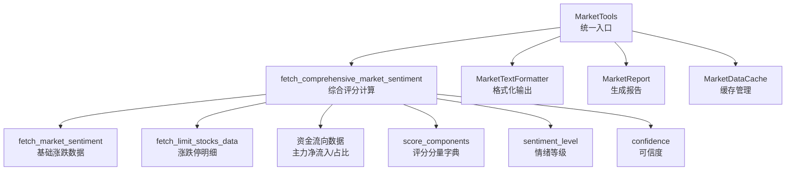
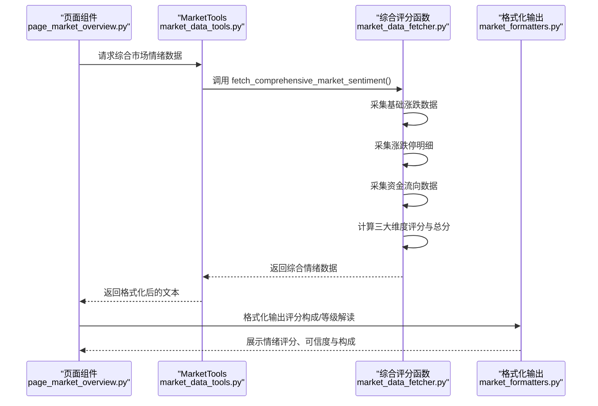
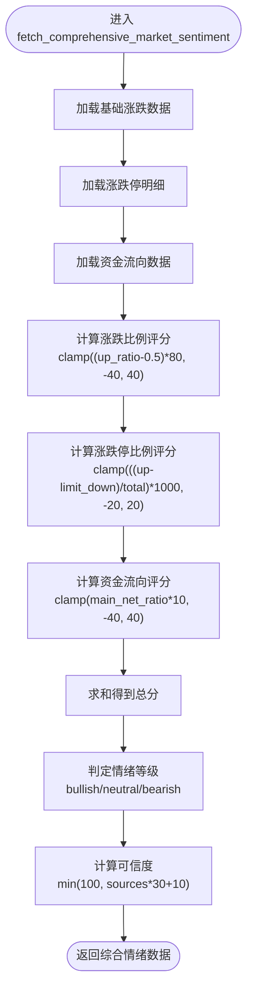
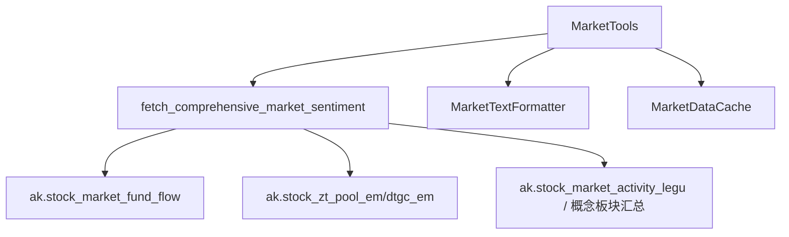

# 评分计算

<cite>
**本文引用的文件**
- [market_data_fetcher.py](file://market/market_data_fetcher.py)
- [market_data_tools.py](file://market/market_data_tools.py)
- [market_formatters.py](file://market/market_formatters.py)
- [market_report.py](file://market/market_report.py)
- [page_market_overview.py](file://ui/components/page_market_overview.py)
- [market_data_cache.py](file://market/market_data_cache.py)
</cite>

## 目录
1. [简介](#简介)
2. [项目结构](#项目结构)
3. [核心组件](#核心组件)
4. [架构总览](#架构总览)
5. [详细组件分析](#详细组件分析)
6. [依赖关系分析](#依赖关系分析)
7. [性能考量](#性能考量)
8. [故障排查指南](#故障排查指南)
9. [结论](#结论)

## 简介
本文围绕 xystock 的“市场情绪综合评分”计算方法展开，系统性说明 fetch_comprehensive_market_sentiment 函数如何基于多维度指标合成 -100 到 100 的情绪评分，并详细拆解三大评分维度：
- 基于涨跌比例的评分（-40 到 40 分）
- 基于涨跌停比例的评分（-20 到 20 分）
- 基于资金流向的评分（-40 到 40 分）

同时解释 score_components 字典如何存储各维度分量，sentiment_level 的判定规则（bullish>20、bearish<-20、neutral 区间），以及 confidence 可信度评分的计算方法（基于有效数据源数量）。文末提供常见问题与优化建议。

## 项目结构
围绕评分计算的相关模块与职责如下：
- market/market_data_fetcher.py：负责采集基础市场情绪、涨跌停、资金流向数据，并执行综合评分计算与可信度评估。
- market/market_data_tools.py：统一入口，封装缓存与调用逻辑，供上层 UI 和报告模块使用。
- market/market_formatters.py：将评分结果格式化为可读文本，包含评分构成与情绪等级解读。
- market/market_report.py：生成完整市场报告，整合技术、估值、资金流、融资融券、新闻与情绪等多维数据。
- ui/components/page_market_overview.py：前端页面展示综合情绪评分、可信度与评分构成。
- market/market_data_cache.py：缓存管理，控制数据有效期与序列化。

图表来源
- [market_data_tools.py](file://market/market_data_tools.py#L39-L66)
- [market_data_fetcher.py](file://market/market_data_fetcher.py#L463-L566)
- [market_formatters.py](file://market/market_formatters.py#L130-L329)
- [market_report.py](file://market/market_report.py#L13-L74)
- [market_data_cache.py](file://market/market_data_cache.py#L120-L142)

章节来源
- [market_data_fetcher.py](file://market/market_data_fetcher.py#L463-L566)
- [market_data_tools.py](file://market/market_data_tools.py#L39-L66)
- [market_formatters.py](file://market/market_formatters.py#L130-L329)
- [market_report.py](file://market/market_report.py#L13-L74)
- [market_data_cache.py](file://market/market_data_cache.py#L120-L142)

## 核心组件
- 综合评分函数：fetch_comprehensive_market_sentiment
  - 输入：基础涨跌数据、涨跌停明细、资金流向数据
  - 输出：sentiment_score（-100~100）、sentiment_level（bullish/neutral/bearish）、score_components（各维度分量）、confidence（可信度）
- 评分维度与范围
  - 涨跌比例评分：-40 ~ 40
  - 涨跌停比例评分：-20 ~ 20
  - 资金流向评分：-40 ~ 40
- 情绪等级判定
  - bullish：总分 > 20
  - bearish：总分 < -20
  - neutral：否则
- 可信度计算
  - 基于有效数据源数量：每有效数据源 +30，再加 10，上限 100

章节来源
- [market_data_fetcher.py](file://market/market_data_fetcher.py#L463-L566)

## 架构总览
下图展示从 UI 到评分计算与格式化的端到端流程。

图表来源
- [page_market_overview.py](file://ui/components/page_market_overview.py#L162-L178)
- [market_data_tools.py](file://market/market_data_tools.py#L39-L66)
- [market_data_fetcher.py](file://market/market_data_fetcher.py#L463-L566)
- [market_formatters.py](file://market/market_formatters.py#L130-L329)

## 详细组件分析

### 综合评分函数：fetch_comprehensive_market_sentiment
- 数据来源与顺序
  - 基础涨跌数据：fetch_market_sentiment
  - 涨跌停明细：fetch_limit_stocks_data
  - 资金流向：ak.stock_market_fund_flow
- 评分维度计算
  - 基于涨跌比例的评分（-40 到 40）
    - 公式：(up_ratio - 0.5) × 80
    - 说明：以 50% 为中性线，偏离越大得分越极端
  - 基于涨跌停比例的评分（-20 到 20）
    - 公式：clamp(((limit_up - limit_down) / total_stocks) × 1000, -20, 20)
    - 说明：放大 1000 倍以凸显极端行情，再限制在 [-20, 20]
  - 基于资金流向的评分（-40 到 40）
    - 公式：clamp(main_net_ratio × 10, -40, 40)
    - 说明：以 4% 为满额基准（即 4% 净流入占比对应 40 分）
- 总分与情绪等级
  - 总分：各维度得分之和，四舍五入保留两位小数
  - 情绪等级：bullish（>20）、bearish（<-20）、neutral（否则）
- 可信度（confidence）
  - 计数有效数据源：基础涨跌数据、资金流向、涨跌停明细（非零）
  - 公式：min(100, data_sources × 30 + 10)
- 输出字段
  - sentiment_score、sentiment_level、score_components、confidence、update_time

图表来源
- [market_data_fetcher.py](file://market/market_data_fetcher.py#L463-L566)

章节来源
- [market_data_fetcher.py](file://market/market_data_fetcher.py#L463-L566)

### 评分构成与情绪等级解读
- score_components 字典
  - key：'ratio'（涨跌比例）、'limit'（涨跌停比例）、'fund'（资金流向）
  - value：对应分量数值
- 情绪等级判定
  - bullish：总分 > 20
  - bearish：总分 < -20
  - neutral：否则
- 格式化输出
  - MarketTextFormatter.format_sentiment_data 会将评分、等级、可信度与各维度贡献进行人性化解读与可视化展示

章节来源
- [market_data_fetcher.py](file://market/market_data_fetcher.py#L504-L561)
- [market_formatters.py](file://market/market_formatters.py#L130-L329)

### 可信度（confidence）计算
- 计数有效数据源
  - 基础涨跌数据存在：+1
  - 资金流向数据存在：+1
  - 涨跌停明细数量 > 0：+1
- 公式：min(100, sources × 30 + 10)
- 示例
  - 仅基础涨跌数据：30 + 10 = 40
  - 基础涨跌数据 + 资金流向：60 + 10 = 70
  - 三个数据源齐全：90 + 10 = 100

章节来源
- [market_data_fetcher.py](file://market/market_data_fetcher.py#L542-L551)

### 评分范围与边界说明
- 涨跌比例评分：-40 ~ 40
- 涨跌停比例评分：-20 ~ 20
- 资金流向评分：-40 ~ 40
- 总分范围：理论最大约 100，理论最小约 -100；实际受 clamp 与数据有效性约束

章节来源
- [market_data_fetcher.py](file://market/market_data_fetcher.py#L504-L539)

### UI 展示与报告集成
- 页面展示
  - page_market_overview.py 直接调用 MarketTextFormatter.format_sentiment_data 输出评分、等级与可信度
- 报告生成
  - market_report.py 调用 MarketTools.get_comprehensive_market_report，内部包含 get_market_sentiment(comprehensive=True)，从而获得综合评分数据

章节来源
- [page_market_overview.py](file://ui/components/page_market_overview.py#L162-L178)
- [market_report.py](file://market/market_report.py#L13-L74)

## 依赖关系分析
- 组件耦合
  - MarketTools 作为统一入口，聚合多个数据源并调用 fetch_comprehensive_market_sentiment
  - MarketTextFormatter 依赖综合情绪数据中的 score_components、sentiment_score、sentiment_level、confidence 进行格式化
- 外部依赖
  - ak.stock_market_fund_flow 用于资金流向数据
  - ak.stock_zt_pool_em / ak.stock_zt_pool_dtgc_em 用于涨跌停明细
  - ak.stock_market_activity_legu / 概念板块汇总 用于基础涨跌数据
- 缓存策略
  - comprehensive_sentiment 缓存有效期 15 分钟，避免频繁抓取导致 IP 封禁

图表来源
- [market_data_tools.py](file://market/market_data_tools.py#L39-L66)
- [market_data_fetcher.py](file://market/market_data_fetcher.py#L463-L566)
- [market_data_cache.py](file://market/market_data_cache.py#L120-L142)

章节来源
- [market_data_tools.py](file://market/market_data_tools.py#L39-L66)
- [market_data_cache.py](file://market/market_data_cache.py#L120-L142)

## 性能考量
- 缓存命中：comprehensive_sentiment 缓存 15 分钟，减少对外部接口的频繁请求
- 数据源降级：若某数据源失败，函数仍尝试其他备用方案，保证评分可用性
- clamp 限幅：对各维度评分进行限幅，避免极端行情导致总分无限扩大
- 可信度阈值：当数据源不足时，confidence 较低，提示用户谨慎解读

章节来源
- [market_data_cache.py](file://market/market_data_cache.py#L120-L142)
- [market_data_fetcher.py](file://market/market_data_fetcher.py#L463-L566)

## 故障排查指南
- 常见问题
  - 数据源为空或失败：资金流向、涨跌停、基础涨跌数据任一为空或异常，将导致对应维度不计入或评分异常
  - 极端市场情况：大量涨停/跌停或主力资金大幅净流入/流出，可能使评分接近边界，需结合其他指标判断
  - 可信度低：仅一个或两个数据源有效，confidence 较低，应谨慎使用
- 排查步骤
  - 检查缓存状态：确认 comprehensive_sentiment 是否有效
  - 查看数据源：确认资金流向、涨跌停、基础涨跌数据是否成功获取
  - 核对 up_ratio、limit_up/down、main_net_ratio 是否为合理数值
- 优化建议
  - 在 UI 中显示 confidence，引导用户关注数据质量
  - 在极端行情下，结合技术面与资金面指标进行交叉验证
  - 对于连续极端行情，可考虑动态调整权重或引入滑动窗口

章节来源
- [market_data_fetcher.py](file://market/market_data_fetcher.py#L463-L566)
- [market_data_cache.py](file://market/market_data_cache.py#L120-L142)

## 结论
xystock 的市场情绪综合评分以“涨跌比例、涨跌停比例、资金流向”三维度为核心，采用 clamp 限幅与加权求和的方式，形成 -100 到 100 的总分，并以 20 为阈值划分情绪等级。score_components 与 confidence 为用户提供评分构成与数据可信度，有助于在复杂市场环境下做出更稳健的判断。通过缓存与降级策略，系统在稳定性与性能之间取得平衡，建议在 UI 中直观展示 confidence 与评分构成，提升用户对评分质量的认知。