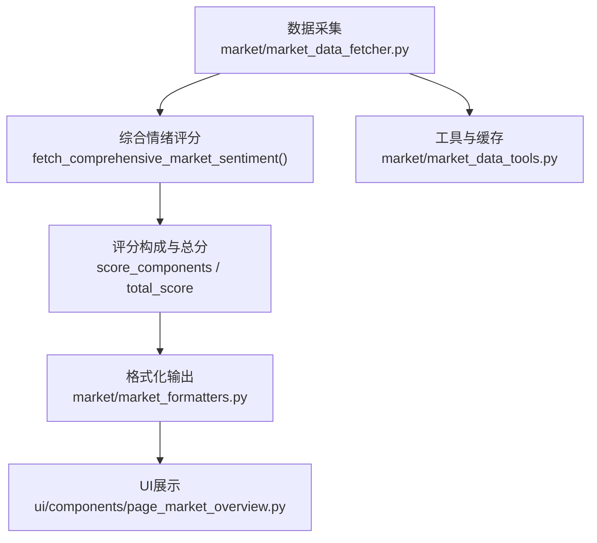
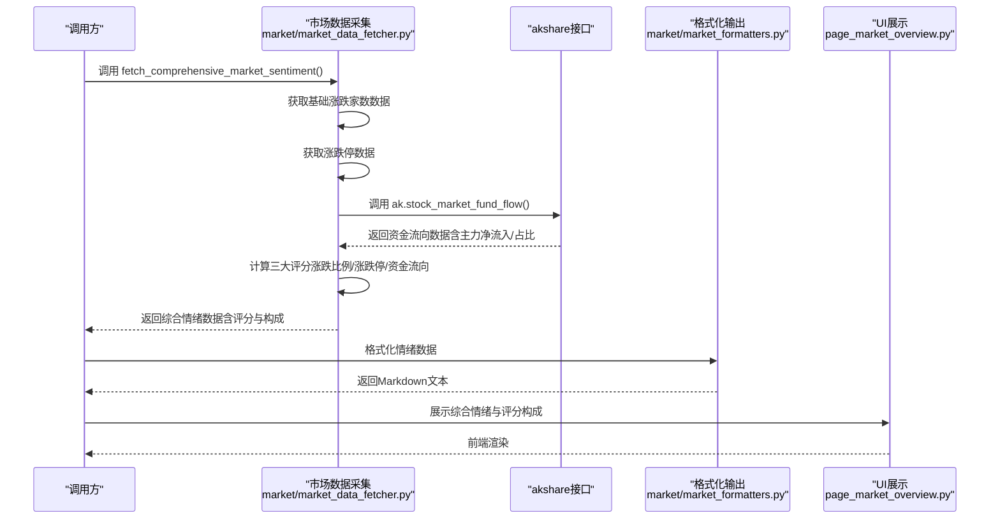
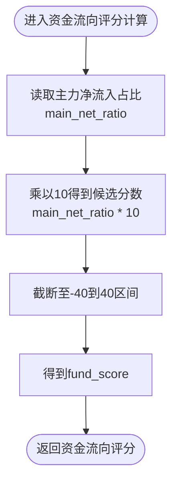
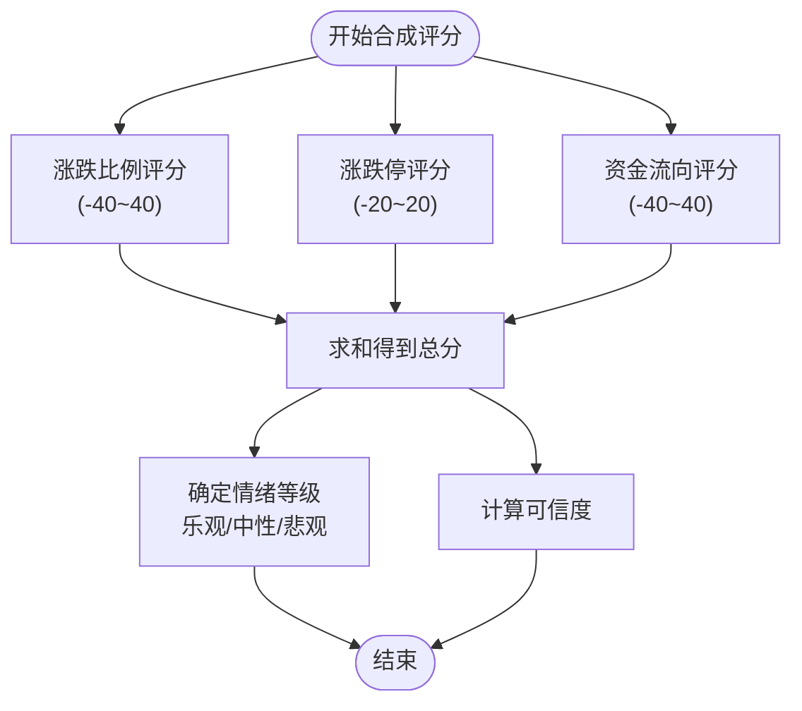
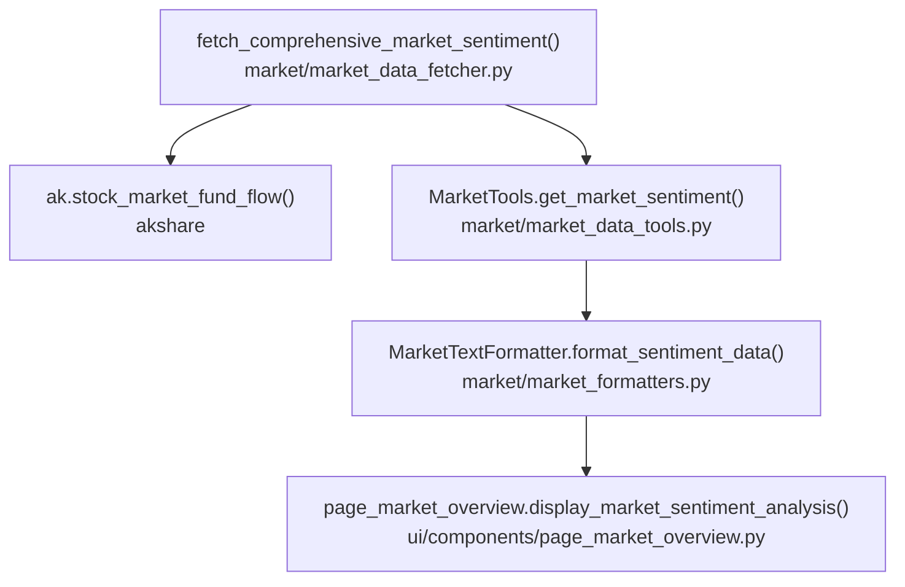

# 资金流向评分

<cite>
**本文引用的文件**
- [market_data_fetcher.py](file://market/market_data_fetcher.py)
- [market_formatters.py](file://market/market_formatters.py)
- [page_market_overview.py](file://ui/components/page_market_overview.py)
- [market_data_tools.py](file://market/market_data_tools.py)
</cite>

## 目录
1. [简介](#简介)
2. [项目结构](#项目结构)
3. [核心组件](#核心组件)
4. [架构总览](#架构总览)
5. [详细组件分析](#详细组件分析)
6. [依赖关系分析](#依赖关系分析)
7. [性能考量](#性能考量)
8. [故障排查指南](#故障排查指南)
9. [结论](#结论)
10. [附录](#附录)

## 简介
本文件聚焦于xystock中“基于主力资金净流入”的市场情绪评分维度，系统阐述fetch_comprehensive_market_sentiment函数如何利用akshare提供的stock_market_fund_flow接口数据，将主力资金净流入占比转换为-40到40分的评分，并解释4%主力净流入对应满分的设计逻辑。文档还说明main_net_ratio字段的来源、fund_score计算公式、评分在整体情绪中的作用与权重、常见问题与优化建议，以及如何在UI中展示该评分及其构成。

## 项目结构
围绕资金流向评分的关键代码分布在以下模块：
- 数据采集层：market/market_data_fetcher.py负责调用akshare接口获取资金流向数据，并在综合情绪分析中提取主力资金相关指标。
- 格式化与展示层：market/market_formatters.py负责将资金流向数据与情绪评分转化为可读的Markdown文本；ui/components/page_market_overview.py负责在前端界面中展示评分与构成。
- 工具与缓存：market/market_data_tools.py提供统一的数据获取入口与缓存策略，确保评分流程可复用、可缓存。

图表来源
- [market_data_fetcher.py](file://market/market_data_fetcher.py#L463-L566)
- [market_formatters.py](file://market/market_formatters.py#L105-L369)
- [page_market_overview.py](file://ui/components/page_market_overview.py#L416-L507)
- [market_data_tools.py](file://market/market_data_tools.py#L30-L66)

章节来源
- [market_data_fetcher.py](file://market/market_data_fetcher.py#L463-L566)
- [market_formatters.py](file://market/market_formatters.py#L105-L369)
- [page_market_overview.py](file://ui/components/page_market_overview.py#L416-L507)
- [market_data_tools.py](file://market/market_data_tools.py#L30-L66)

## 核心组件
- 主力资金净流入占比字段main_net_ratio来源：来自akshare接口ak.stock_market_fund_flow()返回的最新一条记录中的“主力净流入-净占比”字段。
- 资金流向评分fund_score计算：对main_net_ratio乘以10并进行截断，使其落在-40到40区间内，即fund_score = max(-40, min(40, main_net_ratio * 10))。
- 设计逻辑：将4%主力净流入定义为满分，意味着当主力净流入占比达到4%时，对应fund_score为40分；-4%对应-40分，形成对称的评分区间，便于与其他维度（如涨跌比例、涨跌停）进行加权合成。

章节来源
- [market_data_fetcher.py](file://market/market_data_fetcher.py#L484-L538)
- [market_formatters.py](file://market/market_formatters.py#L210-L247)

## 架构总览
资金流向评分在综合情绪分析中的位置如下：
- 首先获取基础涨跌家数数据（用于涨跌比例评分）。
- 获取涨跌停数据（用于涨跌停评分）。
- 获取资金流向数据（提取主力净流入与主力净流入占比）。
- 将三个维度评分合成得到总分与情绪等级，并计算可信度。

图表来源
- [market_data_fetcher.py](file://market/market_data_fetcher.py#L463-L566)
- [market_formatters.py](file://market/market_formatters.py#L105-L369)
- [page_market_overview.py](file://ui/components/page_market_overview.py#L162-L178)

## 详细组件分析

### 组件A：资金流向评分计算流程
- 字段来源：从akshare接口返回的最新记录中读取“主力净流入-净占比”，赋值给main_net_ratio。
- 计算公式：fund_score = max(-40, min(40, main_net_ratio * 10))。
- 设计意图：以4%为满分阈值，使正负对称，便于与其它维度评分叠加；同时通过截断避免极端异常值影响整体评分稳定性。

图表来源
- [market_data_fetcher.py](file://market/market_data_fetcher.py#L523-L527)

章节来源
- [market_data_fetcher.py](file://market/market_data_fetcher.py#L484-L538)

### 组件B：综合情绪评分合成
- 涨跌比例评分：基于上涨家数占比，中性为50%，偏离中性越大，得分越极端，范围约-40到40。
- 涨跌停评分：基于涨跌停数量差与总家数的比例，放大1000倍后限制在-20到20。
- 资金流向评分：基于主力净流入占比，放大10倍后限制在-40到40。
- 总分与等级：三者相加得到总分，超过20为乐观，低于-20为悲观，否则中性；并计算可信度。

图表来源
- [market_data_fetcher.py](file://market/market_data_fetcher.py#L507-L541)

章节来源
- [market_data_fetcher.py](file://market/market_data_fetcher.py#L503-L561)

### 组件C：数据来源与字段映射
- akshare接口ak.stock_market_fund_flow()返回的最新记录包含：
  - 主力净流入-净额（main_net_inflow）
  - 主力净流入-净占比（main_net_ratio）
  - 超大单净流入-净额（super_large_inflow）
  - 大单净流入-净额（large_inflow）
  - 日期（date）
- 在综合情绪分析中，仅使用main_net_ratio参与资金流向评分。

章节来源
- [market_data_fetcher.py](file://market/market_data_fetcher.py#L484-L502)
- [market_data_fetcher.py](file://market/market_data_fetcher.py#L523-L527)

### 组件D：UI展示与评分构成
- UI侧会展示综合情绪评分、情绪等级与评分构成明细，其中资金流向贡献值来自fund_score。
- 页面还会将资金面（融资融券余额）与情绪面（综合评分）纳入市场综合评级的权重分配中。

章节来源
- [market_formatters.py](file://market/market_formatters.py#L105-L369)
- [page_market_overview.py](file://ui/components/page_market_overview.py#L416-L507)

## 依赖关系分析
- fetch_comprehensive_market_sentiment依赖akshare接口获取资金流向数据。
- MarketTextFormatter负责将资金流向与评分构成格式化为Markdown，供UI展示。
- MarketTools提供统一入口与缓存机制，确保评分流程可复用、可缓存。

图表来源
- [market_data_fetcher.py](file://market/market_data_fetcher.py#L463-L566)
- [market_data_tools.py](file://market/market_data_tools.py#L30-L66)
- [market_formatters.py](file://market/market_formatters.py#L105-L369)
- [page_market_overview.py](file://ui/components/page_market_overview.py#L162-L178)

章节来源
- [market_data_fetcher.py](file://market/market_data_fetcher.py#L463-L566)
- [market_data_tools.py](file://market/market_data_tools.py#L30-L66)
- [market_formatters.py](file://market/market_formatters.py#L105-L369)
- [page_market_overview.py](file://ui/components/page_market_overview.py#L162-L178)

## 性能考量
- 数据获取与缓存：MarketTools对各类数据提供缓存与刷新机制，建议在高频调用场景下开启缓存，减少对外部接口的压力。
- 评分计算复杂度：资金流向评分为常数时间复杂度，开销极小；整体评分合成亦为常数时间，性能开销可忽略。
- UI渲染：Markdown格式化与UI展示为纯文本处理，性能良好；若数据量增大，建议在前端做虚拟滚动与懒加载。

## 故障排查指南
- akshare接口不可用或返回空数据
  - 现象：资金流向数据为空，综合情绪数据中fund_flow为空，资金流向评分缺失。
  - 排查：检查网络连通性与akshare可用性；确认ak.stock_market_fund_flow()返回非空数据。
  - 处置：在数据为空时，资金流向评分将不参与合成，总分由其他维度决定；可在UI侧提示“资金流向数据缺失”。

- 数据延迟或异常
  - 现象：主力净流入占比数值异常（如远超4%或极低），导致fund_score被截断。
  - 排查：核对akshare接口返回字段与单位；确认main_net_ratio单位为百分比。
  - 处置：由于已进行截断处理，极端值不会影响总分稳定性；建议在UI中增加异常提示与阈值预警。

- 评分权重与合成
  - 现象：资金流向评分与其他维度评分叠加后，总分波动较大。
  - 排查：确认各维度评分范围与权重设置；检查是否存在异常数据导致评分失真。
  - 处置：可考虑对评分进行平滑处理或引入移动平均；在UI中展示评分构成，帮助用户理解波动来源。

章节来源
- [market_data_fetcher.py](file://market/market_data_fetcher.py#L484-L502)
- [market_data_fetcher.py](file://market/market_data_fetcher.py#L523-L527)
- [page_market_overview.py](file://ui/components/page_market_overview.py#L416-L507)

## 结论
xystock通过akshare提供的主力资金净流入占比，构建了-40到40分的资金流向评分维度，并以4%为满分阈值，形成对称且稳定的评分体系。该评分与涨跌比例、涨跌停评分共同合成综合情绪，既反映大资金动向，又兼顾市场广度与情绪信号。通过缓存与格式化机制，系统在保证实时性的同时提升了用户体验与可维护性。

## 附录
- 代码示例路径（不展示具体代码内容）
  - 资金流向评分计算：[资金流向评分计算](file://market/market_data_fetcher.py#L523-L527)
  - 综合情绪评分合成：[综合情绪评分合成](file://market/market_data_fetcher.py#L503-L541)
  - 资金流向数据获取与字段映射：[资金流向数据获取](file://market/market_data_fetcher.py#L484-L502)
  - UI展示评分构成与综合评级：[UI展示](file://ui/components/page_market_overview.py#L416-L507)
  - Markdown格式化输出：[格式化输出](file://market/market_formatters.py#L105-L369)