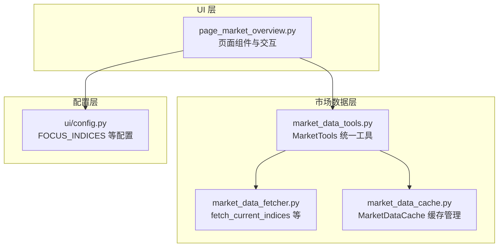
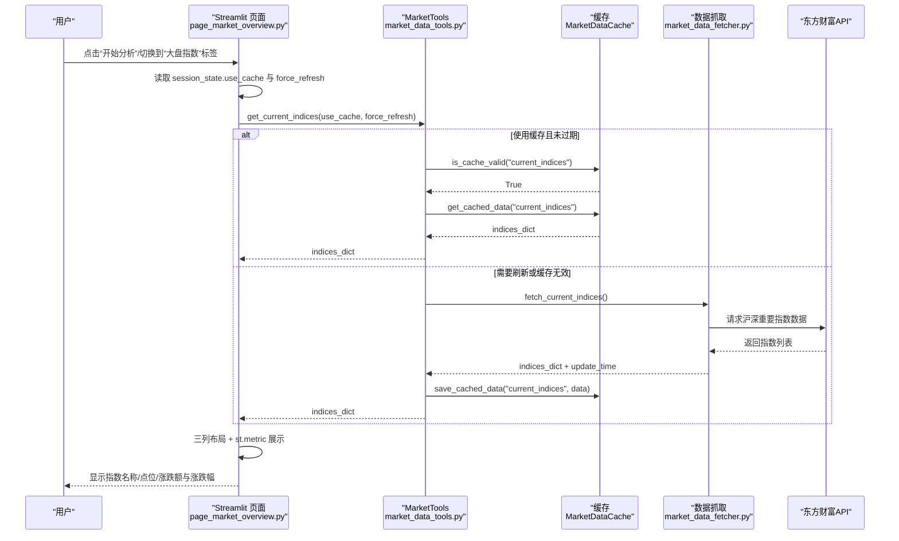
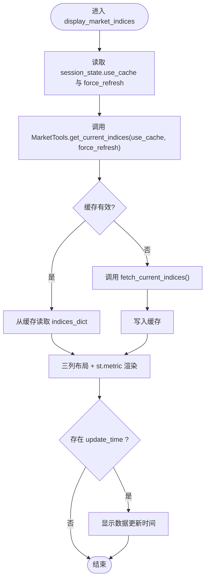
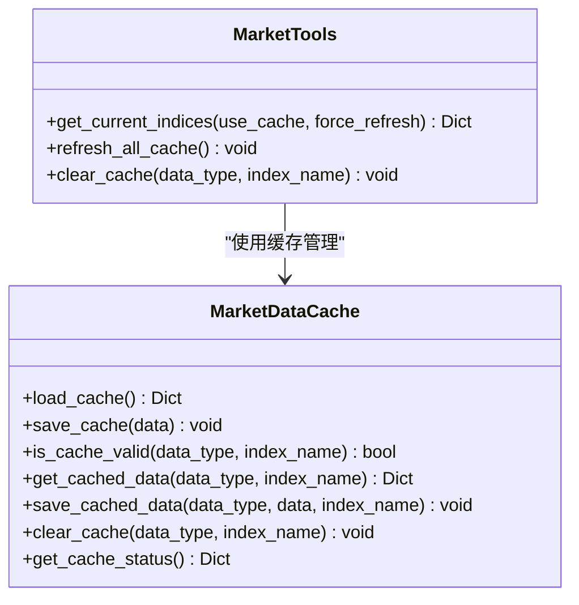
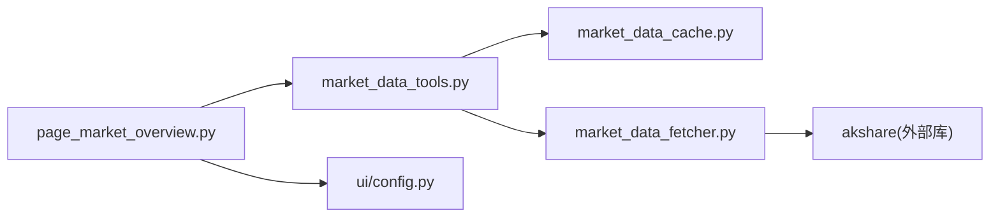

# 市场概览

<cite>
**本文引用的文件**
- [ui/components/page_market_overview.py](file://ui/components/page_market_overview.py)
- [market/market_data_tools.py](file://market/market_data_tools.py)
- [market/market_data_fetcher.py](file://market/market_data_fetcher.py)
- [market/market_data_cache.py](file://market/market_data_cache.py)
- [ui/config.py](file://ui/config.py)
- [ui/start_ui.py](file://ui/start_ui.py)
- [tests/unit/ui/test_page_market_overview.py](file://tests/unit/ui/test_page_market_overview.py)
</cite>

## 目录
1. [简介](#简介)
2. [项目结构](#项目结构)
3. [核心组件](#核心组件)
4. [架构总览](#架构总览)
5. [详细组件分析](#详细组件分析)
6. [依赖关系分析](#依赖关系分析)
7. [性能考量](#性能考量)
8. [故障排查指南](#故障排查指南)
9. [结论](#结论)
10. [附录](#附录)

## 简介
本章节聚焦 xystock 的“市场概览”功能，系统性说明如何在 Streamlit 界面中通过 display_market_indices 函数展示主要大盘指数（如上证指数、深证成指、创业板指等）的实时行情数据；解释三列布局与 st.metric 组件的组合，如何格式化显示价格、涨跌额与涨跌幅；梳理 fetch_current_indices 从东方财富 API 获取沪深重要指数数据的流程及缓存逻辑；并给出前端 UI 与后端数据获取的交互流程、FOCUS_INDICES 配置项的作用、数据更新时间显示机制、常见错误处理与性能优化建议。

## 项目结构
- UI 层：ui/components/page_market_overview.py 提供页面级组件与交互逻辑，负责渲染“市场概览”页面、Tab 切换、按钮交互、缓存控制、数据展示等。
- 市场数据层：
  - market/market_data_tools.py：统一的市场工具封装，负责调用 fetcher、缓存管理、数据聚合与格式化。
  - market/market_data_fetcher.py：具体数据抓取实现，包括 fetch_current_indices 从东方财富获取指数实时数据。
  - market/market_data_cache.py：市场数据缓存管理器，提供统一的缓存读写、过期策略、清理与状态查询。
- 配置层：ui/config.py 定义 FOCUS_INDICES（关注指数清单）、版本信息等。
- 启动层：ui/start_ui.py 提供 Streamlit 启动入口。

**图表来源**
- [ui/components/page_market_overview.py](file://ui/components/page_market_overview.py#L301-L362)
- [market/market_data_tools.py](file://market/market_data_tools.py#L232-L249)
- [market/market_data_fetcher.py](file://market/market_data_fetcher.py#L286-L355)
- [market/market_data_cache.py](file://market/market_data_cache.py#L120-L246)
- [ui/config.py](file://ui/config.py#L44-L55)

**章节来源**
- [ui/components/page_market_overview.py](file://ui/components/page_market_overview.py#L301-L362)
- [market/market_data_tools.py](file://market/market_data_tools.py#L232-L249)
- [market/market_data_fetcher.py](file://market/market_data_fetcher.py#L286-L355)
- [market/market_data_cache.py](file://market/market_data_cache.py#L120-L246)
- [ui/config.py](file://ui/config.py#L44-L55)

## 核心组件
- 页面组件：display_market_indices 负责在“大盘指数”标签页中展示核心指数的实时行情，采用三列布局与 st.metric 组件，分别显示指数名称、当前点位、涨跌额与涨跌幅，并在底部显示数据更新时间。
- 市场工具：MarketTools.get_current_indices 负责获取当前指数数据，内部优先使用缓存，否则调用 fetch_current_indices 并写入缓存。
- 数据抓取：fetch_current_indices 通过 akshare 从东方财富获取沪深重要指数数据，构造 indices_dict 字典并返回。
- 缓存管理：MarketDataCache 提供统一的缓存读写、过期策略与清理能力，current_indices 类型缓存过期时间为 5 分钟。
- 配置项：FOCUS_INDICES 决定页面展示的核心指数集合，影响 display_market_indices 的渲染顺序与列布局。

**章节来源**
- [ui/components/page_market_overview.py](file://ui/components/page_market_overview.py#L301-L362)
- [market/market_data_tools.py](file://market/market_data_tools.py#L232-L249)
- [market/market_data_fetcher.py](file://market/market_data_fetcher.py#L286-L355)
- [market/market_data_cache.py](file://market/market_data_cache.py#L132-L141)
- [ui/config.py](file://ui/config.py#L44-L55)

## 架构总览
下图展示了“市场概览”页面中“大盘指数”区域的前端 UI 与后端数据流交互：

**图表来源**
- [ui/components/page_market_overview.py](file://ui/components/page_market_overview.py#L301-L362)
- [market/market_data_tools.py](file://market/market_data_tools.py#L232-L249)
- [market/market_data_fetcher.py](file://market/market_data_fetcher.py#L286-L355)
- [market/market_data_cache.py](file://market/market_data_cache.py#L192-L246)

## 详细组件分析

### 页面组件：display_market_indices
- 作用：在“大盘指数”标签页中展示核心指数的实时行情，采用三列布局，每列一个 st.metric 卡片，分别显示指数名称、当前点位、涨跌额与涨跌幅。
- 数据来源：通过 MarketTools.get_current_indices 获取 indices_dict。
- 布局与格式化：
  - 三列布局：col1, col2, col3。
  - 指数筛选：仅展示 FOCUS_INDICES 中列出的核心指数。
  - 数值格式：st.metric 的 label 为指数名称，value 为当前点位，delta 为涨跌额与涨跌幅的组合字符串，delta_color 根据涨跌幅正负调整。
- 更新时间：若返回数据包含 update_time，页面底部显示“数据更新时间”。

**图表来源**
- [ui/components/page_market_overview.py](file://ui/components/page_market_overview.py#L301-L362)
- [market/market_data_tools.py](file://market/market_data_tools.py#L232-L249)
- [market/market_data_fetcher.py](file://market/market_data_fetcher.py#L286-L355)
- [market/market_data_cache.py](file://market/market_data_cache.py#L192-L246)

**章节来源**
- [ui/components/page_market_overview.py](file://ui/components/page_market_overview.py#L301-L362)

### 数据抓取：fetch_current_indices
- 作用：从东方财富获取沪深重要指数的实时数据，过滤出 FOCUS_INDICES 中的指数，构造 indices_dict，包含名称、代码、当前点位、涨跌幅、涨跌额、成交量、成交额、振幅、最高、最低、今开、昨收、量比等字段，并返回包含 total_count、data_source、update_time 的字典。
- 错误处理：当数据为空或异常时，返回包含 error 与 update_time 的字典，供上层 UI 判断并提示。
- 数据来源：使用 akshare 接口获取“沪深重要指数”，遍历行数据，按 FOCUS_INDICES 过滤并组装。

**章节来源**
- [market/market_data_fetcher.py](file://market/market_data_fetcher.py#L286-L355)
- [ui/config.py](file://ui/config.py#L44-L55)

### 缓存逻辑：MarketDataCache 与 MarketTools
- 缓存类型：current_indices（当前指数实时数据），过期时间为 5 分钟。
- 读取流程：MarketTools.get_current_indices 先检查缓存是否有效，有效则直接返回缓存数据；否则调用 fetch_current_indices 获取新数据并写入缓存。
- 清理与刷新：支持按类型或按指数清理缓存；页面提供“刷新数据”按钮，调用 MarketTools.refresh_all_cache 触发各数据类型的强制刷新。

**图表来源**
- [market/market_data_cache.py](file://market/market_data_cache.py#L120-L246)
- [market/market_data_tools.py](file://market/market_data_tools.py#L232-L249)

**章节来源**
- [market/market_data_cache.py](file://market/market_data_cache.py#L132-L141)
- [market/market_data_tools.py](file://market/market_data_tools.py#L232-L249)

### 配置项：FOCUS_INDICES
- 作用：定义页面展示的核心指数清单，display_market_indices 会按该列表顺序依次渲染，形成三列布局。
- 影响范围：决定页面显示哪些指数、渲染顺序与列分配。

**章节来源**
- [ui/config.py](file://ui/config.py#L44-L55)
- [ui/components/page_market_overview.py](file://ui/components/page_market_overview.py#L324-L351)

### 数据更新时间显示机制
- 页面：display_market_indices 若返回数据包含 update_time，会在页面底部显示“数据更新时间”。
- 工具：fetch_current_indices 在成功获取数据时设置 update_time；MarketTools.get_current_indices 在缓存命中时同样返回缓存中的 update_time。

**章节来源**
- [ui/components/page_market_overview.py](file://ui/components/page_market_overview.py#L353-L359)
- [market/market_data_fetcher.py](file://market/market_data_fetcher.py#L324-L333)
- [market/market_data_tools.py](file://market/market_data_tools.py#L232-L249)

### 前后端交互流程示例（代码路径）
- 页面入口与 Tab 切换：[ui/components/page_market_overview.py](file://ui/components/page_market_overview.py#L701-L729)
- 指数展示调用链：[ui/components/page_market_overview.py](file://ui/components/page_market_overview.py#L710-L712) → [market/market_data_tools.py](file://market/market_data_tools.py#L232-L249) → [market/market_data_fetcher.py](file://market/market_data_fetcher.py#L286-L355) → [market/market_data_cache.py](file://market/market_data_cache.py#L192-L246)

**章节来源**
- [ui/components/page_market_overview.py](file://ui/components/page_market_overview.py#L701-L729)
- [market/market_data_tools.py](file://market/market_data_tools.py#L232-L249)
- [market/market_data_fetcher.py](file://market/market_data_fetcher.py#L286-L355)
- [market/market_data_cache.py](file://market/market_data_cache.py#L192-L246)

## 依赖关系分析
- 组件耦合：
  - page_market_overview.py 依赖 MarketTools（统一数据入口）与 FOCUS_INDICES（配置）。
  - MarketTools 依赖 MarketDataCache（缓存）与 market_data_fetcher（抓取实现）。
  - market_data_fetcher 依赖 akshare 与 FOCUS_INDICES。
- 外部依赖：akshare（东方财富数据接口）、Streamlit（UI 渲染）。
- 潜在循环依赖：未发现循环依赖，模块职责清晰。

**图表来源**
- [ui/components/page_market_overview.py](file://ui/components/page_market_overview.py#L301-L362)
- [market/market_data_tools.py](file://market/market_data_tools.py#L232-L249)
- [market/market_data_fetcher.py](file://market/market_data_fetcher.py#L286-L355)
- [market/market_data_cache.py](file://market/market_data_cache.py#L120-L246)
- [ui/config.py](file://ui/config.py#L44-L55)

**章节来源**
- [ui/components/page_market_overview.py](file://ui/components/page_market_overview.py#L301-L362)
- [market/market_data_tools.py](file://market/market_data_tools.py#L232-L249)
- [market/market_data_fetcher.py](file://market/market_data_fetcher.py#L286-L355)
- [market/market_data_cache.py](file://market/market_data_cache.py#L120-L246)
- [ui/config.py](file://ui/config.py#L44-L55)

## 性能考量
- 缓存策略：current_indices 类型缓存过期时间为 5 分钟，适合高频访问的实时行情展示，降低对外部 API 的请求压力。
- 三列布局：按 FOCUS_INDICES 顺序渲染，减少不必要的 DOM 结构，提升页面渲染效率。
- 按需刷新：通过“使用缓存数据”与“刷新数据”按钮控制 use_cache 与 force_refresh，避免每次强制请求。
- 建议：
  - 合理设置缓存过期时间，平衡实时性与性能。
  - 对于高频交互页面，可考虑在 UI 层增加“自动刷新间隔”配置。
  - 对于网络不稳定环境，建议默认使用缓存并提供手动刷新按钮。

[本节为通用指导，无需代码引用]

## 故障排查指南
- API 调用失败：
  - 现象：页面提示“获取指数数据失败: ...”或“暂无指数数据”。
  - 排查：检查网络连通性、akshare 依赖是否安装、东方财富接口可用性；查看返回的 error 字段。
  - 处理：页面已捕获异常并提示；可尝试取消“使用缓存数据”勾选以强制刷新。
- 缓存失效：
  - 现象：显示旧数据或长时间未更新。
  - 排查：确认缓存是否过期（current_indices 过期 5 分钟）；使用“刷新数据”按钮清理并重新拉取。
- 指数不在清单：
  - 现象：某些指数未显示。
  - 排查：确认该指数是否在 FOCUS_INDICES 中；若不在，不会出现在页面展示列表中。
- 数据更新时间异常：
  - 现象：未显示“数据更新时间”。
  - 排查：确认返回数据是否包含 update_time；若缓存命中，可能沿用缓存中的时间戳。

**章节来源**
- [ui/components/page_market_overview.py](file://ui/components/page_market_overview.py#L314-L362)
- [market/market_data_fetcher.py](file://market/market_data_fetcher.py#L346-L355)
- [market/market_data_cache.py](file://market/market_data_cache.py#L192-L246)
- [ui/config.py](file://ui/config.py#L44-L55)

## 结论
“市场概览”的“大盘指数”模块通过清晰的三层架构（UI 组件、市场工具、数据抓取与缓存）实现了高效、稳定的实时行情展示。FOCUS_INDICES 控制核心指数清单，三列布局与 st.metric 组件提供了直观的数值呈现；缓存机制显著降低了对外部 API 的依赖，提升了用户体验。通过合理的错误处理与刷新机制，系统在稳定性与易用性之间取得了良好平衡。

[本节为总结，无需代码引用]

## 附录
- 启动说明：通过 ui/start_ui.py 在本地 8811 端口启动 Streamlit 应用，访问 http://localhost:8811 查看“市场概览”页面。
- 测试参考：tests/unit/ui/test_page_market_overview.py 提供了页面渲染、缓存控制、技术分析等单元测试示例，可用于验证功能正确性与边界条件。

**章节来源**
- [ui/start_ui.py](file://ui/start_ui.py#L1-L60)
- [tests/unit/ui/test_page_market_overview.py](file://tests/unit/ui/test_page_market_overview.py#L1-L399)