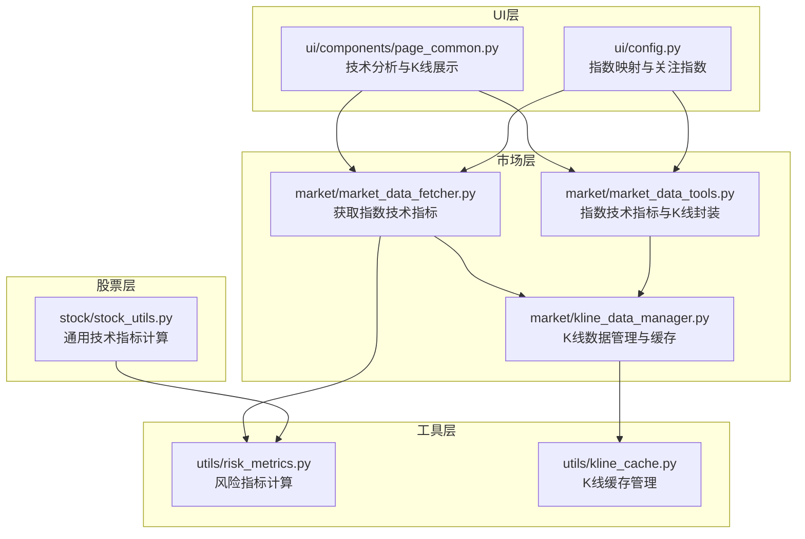
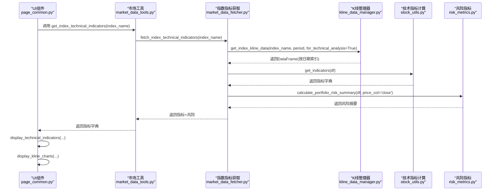
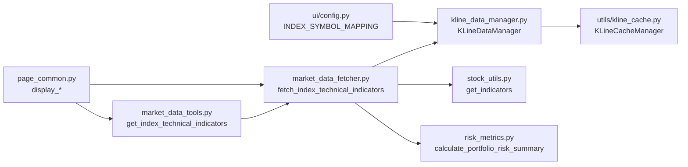

# 技术分析

<cite>
**本文引用的文件**
- [market_data_fetcher.py](file://market/market_data_fetcher.py)
- [kline_data_manager.py](file://market/kline_data_manager.py)
- [stock_utils.py](file://stock/stock_utils.py)
- [market_data_tools.py](file://market/market_data_tools.py)
- [risk_metrics.py](file://utils/risk_metrics.py)
- [page_common.py](file://ui/components/page_common.py)
- [config.py](file://ui/config.py)
- [API文档](file://ui/components/API_DOCUMENTATION.md)
</cite>

## 目录
1. [简介](#简介)
2. [项目结构](#项目结构)
3. [核心组件](#核心组件)
4. [架构总览](#架构总览)
5. [详细组件分析](#详细组件分析)
6. [依赖关系分析](#依赖关系分析)
7. [性能考量](#性能考量)
8. [故障排查指南](#故障排查指南)
9. [结论](#结论)
10. [附录](#附录)

## 简介
本章节面向使用者与开发者，系统性介绍xystock项目中的“技术分析”能力，重点覆盖如下目标：
- 通过fetch_index_technical_indicators函数获取指定指数（如上证指数）的技术指标，涵盖MA趋势、MACD趋势、KDJ、RSI、布林带、威廉指标、CCI等。
- 技术指标数据来源于智能缓存的K线数据管理器，确保高效与稳定。
- 通过display_technical_analysis_tab在Streamlit界面中展示K线图、成交量图以及技术指标分析标签页。
- 解释技术指标的计算逻辑与风险分析功能的集成方式。
- 提供从K线数据获取到技术指标计算再到可视化展示的完整流程示例路径。
- 说明for_technical_analysis参数的作用与影响。
- 总结常见问题与错误处理机制，并给出性能优化建议（如合理设置缓存周期）。

## 项目结构
技术分析相关模块主要分布在以下位置：
- 市场层：负责指数K线数据获取、技术指标计算与缓存。
- 股票层：提供通用技术指标计算与风险指标集成。
- 工具层：风险指标计算、K线缓存管理。
- UI层：Streamlit组件，负责展示K线图、成交量图与技术指标卡片。

**图表来源**
- [market_data_fetcher.py](file://market/market_data_fetcher.py#L568-L607)
- [kline_data_manager.py](file://market/kline_data_manager.py#L152-L200)
- [stock_utils.py](file://stock/stock_utils.py#L105-L150)
- [risk_metrics.py](file://utils/risk_metrics.py#L128-L196)
- [page_common.py](file://ui/components/page_common.py#L192-L291)
- [config.py](file://ui/config.py#L45-L82)

**Section sources**
- [market_data_fetcher.py](file://market/market_data_fetcher.py#L568-L607)
- [kline_data_manager.py](file://market/kline_data_manager.py#L152-L200)
- [stock_utils.py](file://stock/stock_utils.py#L105-L150)
- [risk_metrics.py](file://utils/risk_metrics.py#L128-L196)
- [page_common.py](file://ui/components/page_common.py#L192-L291)
- [config.py](file://ui/config.py#L45-L82)

## 核心组件
- 指数技术指标获取：market_data_fetcher.fetch_index_technical_indicators
- K线数据管理与缓存：market.kline_data_manager.KLineDataManager
- 技术指标计算：stock.stock_utils.get_indicators
- 风险指标计算：utils.risk_metrics.calculate_portfolio_risk_summary
- UI展示：ui.components.page_common.display_technical_analysis_tab、display_kline_charts、display_technical_indicators

**Section sources**
- [market_data_fetcher.py](file://market/market_data_fetcher.py#L568-L607)
- [kline_data_manager.py](file://market/kline_data_manager.py#L152-L200)
- [stock_utils.py](file://stock/stock_utils.py#L105-L150)
- [risk_metrics.py](file://utils/risk_metrics.py#L128-L196)
- [page_common.py](file://ui/components/page_common.py#L107-L191)

## 架构总览
技术分析从“数据获取—指标计算—风险集成—UI展示”的链路如下：

**图表来源**
- [market_data_tools.py](file://market/market_data_tools.py#L283-L306)
- [market_data_fetcher.py](file://market/market_data_fetcher.py#L568-L607)
- [kline_data_manager.py](file://market/kline_data_manager.py#L152-L200)
- [stock_utils.py](file://stock/stock_utils.py#L105-L150)
- [risk_metrics.py](file://utils/risk_metrics.py#L128-L196)
- [page_common.py](file://ui/components/page_common.py#L107-L191)

## 详细组件分析

### 组件A：fetch_index_technical_indicators（指数技术指标获取）
- 功能概述
  - 通过统一的K线数据管理器获取指数K线数据（for_technical_analysis=True），确保DataFrame以日期为索引，便于技术指标计算。
  - 调用get_indicators(df)计算常用技术指标（MA、EMA、MACD、KDJ、RSI、布林带、威廉、CCI等）。
  - 在满足长度条件时，调用calculate_portfolio_risk_summary(df, price_col='close')计算风险摘要并注入到指标字典中。
  - 返回布尔状态与指标字典，供上层UI或工具层使用。
- 关键参数
  - index_name：指数名称（需在INDEX_SYMBOL_MAPPING中定义）。
  - period：默认100，用于控制K线长度。
  - for_technical_analysis：True，使K线管理器返回以日期为索引的DataFrame，便于stockstats包装与滚动窗口计算。
- 错误处理
  - 对不支持的指数名称抛出异常；对网络/计算异常捕获并返回空字典，保证UI可用性。
- 风险分析集成
  - 当数据长度≥5时尝试计算风险指标；若模块导入失败或计算异常，记录警告并跳过风险指标。

**Section sources**
- [market_data_fetcher.py](file://market/market_data_fetcher.py#L568-L607)
- [stock_utils.py](file://stock/stock_utils.py#L105-L150)
- [risk_metrics.py](file://utils/risk_metrics.py#L128-L196)

### 组件B：K线数据管理器（KLineDataManager）
- 功能概述
  - 提供统一的指数K线数据获取入口：get_index_kline_data(index_name, period, use_cache, force_refresh, for_technical_analysis)。
  - 支持智能缓存：优先从本地CSV缓存读取，不足或强制刷新时从akshare拉取并写入缓存。
  - 提供add_moving_averages(df)为DataFrame添加MA5/MA10/MA20/MA60。
  - 提供convert_to_kline_data_list/convert_from_kline_data_list在DataFrame与KLineData对象之间转换，支持for_technical_analysis=True时设置日期索引。
- 关键参数
  - for_technical_analysis：True时设置date为索引，便于后续技术分析；False时保留标准列结构用于绘图。
- 缓存策略
  - 使用utils.kline_cache.KLineCacheManager管理指数K线缓存，支持批量更新与统计查询。

**Section sources**
- [kline_data_manager.py](file://market/kline_data_manager.py#L152-L200)
- [kline_data_manager.py](file://market/kline_data_manager.py#L267-L296)
- [kline_data_manager.py](file://market/kline_data_manager.py#L1-L151)

### 组件C：技术指标计算（stock_utils.get_indicators）
- 功能概述
  - 使用stockstats.wrap(df)对DataFrame进行包装，基于滚动窗口计算各类技术指标。
  - 指标范围：MA5/10/20/60、EMA12/26、MACD、KDJ、RSI(14)、布林带、威廉指标(14)、CCI(14)。
  - 趋势判断：ma_trend、macd_trend，基于最近值比较得出。
- 复杂度与性能
  - 指标计算依赖滚动窗口，时间复杂度近似O(n)，空间复杂度O(n)。
  - 若数据长度不足对应窗口，相应指标返回None，避免异常。

**Section sources**
- [stock_utils.py](file://stock/stock_utils.py#L105-L150)

### 组件D：风险指标计算（utils.risk_metrics）
- 功能概述
  - 计算年化波动率、最大回撤、夏普比率、VaR/CVaR等核心风险指标。
  - 提供calculate_portfolio_risk_summary(df, price_col='close')返回精简统计摘要，包含期间涨跌幅、波动率趋势、风险等级、稳定性与趋势强度等。
- 集成方式
  - 在指数技术指标获取流程中，当数据长度≥5时自动计算并注入到指标字典中，供UI展示与进一步分析。

**Section sources**
- [risk_metrics.py](file://utils/risk_metrics.py#L128-L196)

### 组件E：UI展示（page_common.py）
- 技术指标展示
  - display_technical_indicators(tech_data)：以指标卡片形式展示MA趋势、MACD趋势、MA5/10/20/60、RSI(14)、KDJ、MACD、布林带、威廉、CCI等。
- 技术分析标签页
  - display_technical_analysis_tab(stock_identity=None, index_name=None)：根据传入参数选择股票或指数技术分析路径，获取指标并展示。
- K线与成交量展示
  - display_kline_charts(df, chart_type="stock/index", title_prefix)：绘制K线蜡烛图与均线，叠加成交量柱状图。

**Section sources**
- [page_common.py](file://ui/components/page_common.py#L107-L191)
- [page_common.py](file://ui/components/page_common.py#L192-L291)

### 组件F：配置与映射（ui/config.py）
- 关注指数与指数代码映射
  - FOCUS_INDICES：列出支持的指数集合。
  - INDEX_SYMBOL_MAPPING：指数名称到akshare查询符号的映射，用于fetch_index_kline_data。
- 作用
  - 保障fetch_index_technical_indicators与K线管理器正确解析指数名称与符号。

**Section sources**
- [config.py](file://ui/config.py#L45-L82)

## 依赖关系分析

**图表来源**
- [market_data_fetcher.py](file://market/market_data_fetcher.py#L568-L607)
- [kline_data_manager.py](file://market/kline_data_manager.py#L152-L200)
- [stock_utils.py](file://stock/stock_utils.py#L105-L150)
- [risk_metrics.py](file://utils/risk_metrics.py#L128-L196)
- [market_data_tools.py](file://market/market_data_tools.py#L283-L306)
- [page_common.py](file://ui/components/page_common.py#L107-L191)
- [config.py](file://ui/config.py#L45-L82)

## 性能考量
- 缓存策略
  - K线数据采用智能缓存：优先读取本地CSV缓存，不足或强制刷新时从网络拉取并写入缓存，显著降低重复请求与计算成本。
  - 指数技术指标与AI分析结果同样具备缓存与失效控制，减少重复计算。
- 计算复杂度
  - 技术指标计算为滚动窗口，整体O(n)；风险指标计算亦为O(n)。
- UI渲染
  - K线与成交量采用Plotly渲染，支持容器宽度自适应，避免大数据量下的卡顿。
- 参数优化
  - for_technical_analysis=True时设置日期索引，有利于stockstats高效计算；False时保留标准列结构，便于绘图。
  - 合理设置period，避免过大导致内存压力与计算耗时增加。

[无需来源：本节为通用性能建议总结]

## 故障排查指南
- 指数名称不支持
  - 现象：抛出不支持的指数名称异常。
  - 排查：确认index_name是否在ui/config.py的INDEX_SYMBOL_MAPPING中。
- 技术指标计算失败
  - 现象：返回空字典或警告。
  - 排查：检查数据长度是否满足计算条件（如风险指标至少需要≥5条）；确认网络访问与akshare可用性。
- 缓存读取异常
  - 现象：缓存文件损坏或格式不符。
  - 排查：清理特定指数缓存后重试；检查utils/kline_cache.py的缓存目录权限与磁盘空间。
- UI展示空白
  - 现象：未显示技术指标或K线图。
  - 排查：确认session_state中的use_cache与market_use_cache配置；检查DataFrame列是否包含datetime/open/high/low/close/volume等必要字段。

**Section sources**
- [market_data_fetcher.py](file://market/market_data_fetcher.py#L568-L607)
- [kline_data_manager.py](file://market/kline_data_manager.py#L152-L200)
- [page_common.py](file://ui/components/page_common.py#L107-L191)

## 结论
xystock的技术分析模块通过“智能缓存+统一K线管理+标准化指标计算+风险集成+Streamlit可视化”的完整链路，实现了对上证指数等主流指数的快速、稳定与可解释的技术分析。用户可通过UI一键查看K线、成交量与技术指标卡片，并获得风险摘要辅助决策。对于性能与稳定性，建议结合业务场景合理设置缓存周期与数据长度，并在异常情况下利用内置缓存兜底。

[无需来源：本节为总结性内容]

## 附录

### 代码示例路径（从K线到可视化）
- 获取指数技术指标
  - [fetch_index_technical_indicators](file://market/market_data_fetcher.py#L568-L607)
- 获取指数K线数据（含均线与指标）
  - [get_index_kline_data（工具层封装）](file://market/market_data_tools.py#L307-L347)
- 计算技术指标
  - [get_indicators](file://stock/stock_utils.py#L105-L150)
- 计算风险指标
  - [calculate_portfolio_risk_summary](file://utils/risk_metrics.py#L128-L196)
- 展示技术指标卡片
  - [display_technical_indicators](file://ui/components/page_common.py#L16-L105)
- 展示K线与成交量
  - [display_kline_charts](file://ui/components/page_common.py#L192-L291)
- API参考
  - [API文档（技术分析相关接口）](file://ui/components/API_DOCUMENTATION.md#L46-L115)

### for_technical_analysis参数说明
- 作用
  - 控制K线管理器返回的DataFrame是否设置日期为索引，以便stockstats进行滚动窗口计算与趋势判断。
- 影响
  - True：返回以日期为索引的DataFrame，适合技术指标计算。
  - False：返回标准列结构，适合绘图与展示。

**Section sources**
- [kline_data_manager.py](file://market/kline_data_manager.py#L152-L200)
- [market_data_fetcher.py](file://market/market_data_fetcher.py#L568-L607)