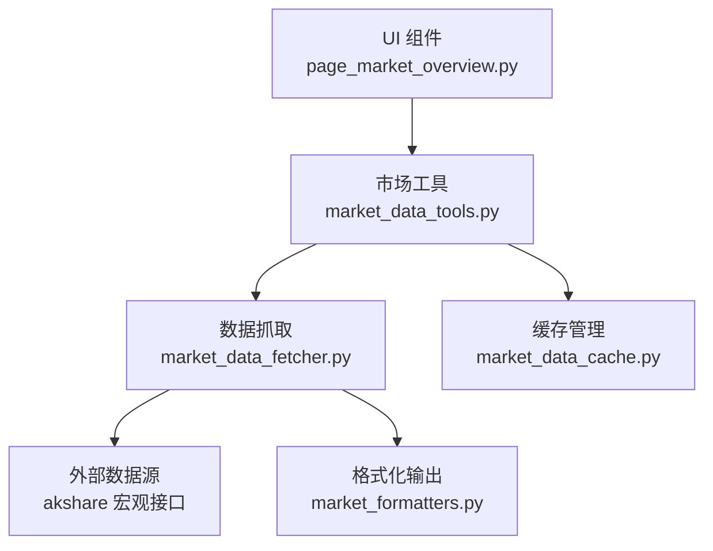
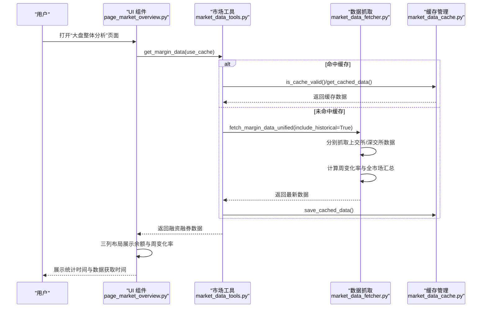
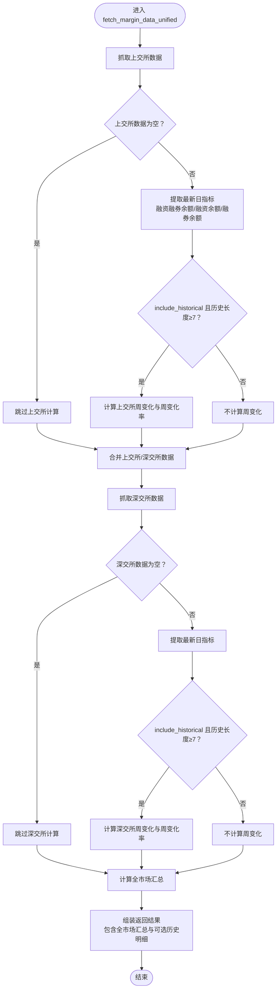
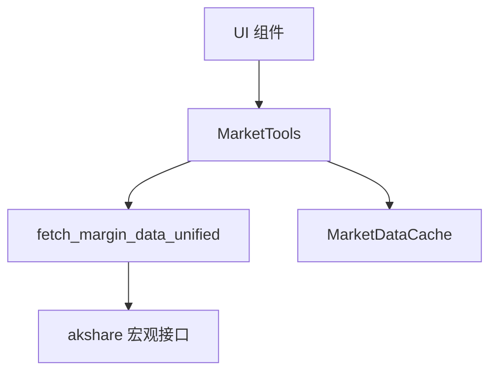

# 融资融券

<cite>
**本文引用的文件**
- [market_data_fetcher.py](file://market/market_data_fetcher.py)
- [market_data_tools.py](file://market/market_data_tools.py)
- [page_market_overview.py](file://ui/components/page_market_overview.py)
- [market_formatters.py](file://market/market_formatters.py)
- [market_data_cache.py](file://market/market_data_cache.py)
- [test_page_market_overview.py](file://tests/unit/ui/test_page_market_overview.py)
</cite>

## 目录
1. [简介](#简介)
2. [项目结构](#项目结构)
3. [核心组件](#核心组件)
4. [架构总览](#架构总览)
5. [详细组件分析](#详细组件分析)
6. [依赖关系分析](#依赖关系分析)
7. [性能考量](#性能考量)
8. [故障排查指南](#故障排查指南)
9. [结论](#结论)
10. [附录](#附录)

## 简介
本文档围绕 xystock 的“融资融券”分析功能展开，系统讲解如何通过统一接口 fetch_margin_data_unified 获取上交所与深交所的融资融券数据，涵盖关键指标（融资融券余额、融资余额、融券余额）的提取与合并，以及在 Streamlit 页面中以三列布局展示余额数据并计算周变化率的方法。同时，文档还说明了数据更新时间、错误处理机制、常见问题与容错方案，并给出性能优化建议（如缓存复用）。

## 项目结构
围绕融资融券分析的关键文件与职责如下：
- market/market_data_fetcher.py：实现统一的融资融券数据抓取与周变化率计算
- market/market_data_tools.py：封装 MarketTools 类，提供 get_margin_data 接口并集成缓存
- ui/components/page_market_overview.py：在 Streamlit 页面中展示融资融券数据，三列布局与周变化率展示
- market/market_formatters.py：提供 Markdown 格式化输出（用于报告与摘要）
- market/market_data_cache.py：统一缓存管理，支持差异化过期策略
- tests/unit/ui/test_page_market_overview.py：单元测试覆盖融资融券展示逻辑

图表来源
- [page_market_overview.py](file://ui/components/page_market_overview.py#L180-L219)
- [market_data_tools.py](file://market/market_data_tools.py#L214-L231)
- [market_data_fetcher.py](file://market/market_data_fetcher.py#L358-L449)
- [market_data_cache.py](file://market/market_data_cache.py#L120-L142)
- [market_formatters.py](file://market/market_formatters.py#L452-L513)

章节来源
- [page_market_overview.py](file://ui/components/page_market_overview.py#L180-L219)
- [market_data_tools.py](file://market/market_data_tools.py#L214-L231)
- [market_data_fetcher.py](file://market/market_data_fetcher.py#L358-L449)
- [market_data_cache.py](file://market/market_data_cache.py#L120-L142)
- [market_formatters.py](file://market/market_formatters.py#L452-L513)

## 核心组件
- 统一抓取函数：fetch_margin_data_unified
  - 功能：分别从上交所与深交所获取融资融券历史数据，提取最新日的“融资融券余额”“融资余额”“融券余额”，并在可选的历史模式下计算周变化率与累计变化
  - 输出：包含全市场汇总（上交所+深交所）的余额与周变化率字段，以及更新时间
- 市场工具接口：MarketTools.get_margin_data
  - 功能：对外暴露统一的 get_margin_data 接口，内部调用 fetch_margin_data_unified(include_historical=True)，并集成缓存
- UI 展示：display_margin_trading_analysis
  - 功能：在 Streamlit 中以三列布局展示“融资融券余额”“融资余额”“融券余额”，并在第二行展示“周变化率”，同时显示统计时间与数据获取时间

章节来源
- [market_data_fetcher.py](file://market/market_data_fetcher.py#L358-L449)
- [market_data_tools.py](file://market/market_data_tools.py#L214-L231)
- [page_market_overview.py](file://ui/components/page_market_overview.py#L180-L219)

## 架构总览
下面的时序图展示了从 UI 触发到数据展示的完整流程，包括缓存命中与抓取路径。

图表来源
- [page_market_overview.py](file://ui/components/page_market_overview.py#L180-L219)
- [market_data_tools.py](file://market/market_data_tools.py#L214-L231)
- [market_data_fetcher.py](file://market/market_data_fetcher.py#L358-L449)
- [market_data_cache.py](file://market/market_data_cache.py#L192-L239)

## 详细组件分析

### 统一抓取函数：fetch_margin_data_unified
- 输入参数
  - include_historical：是否计算周变化率与返回明细
- 数据来源
  - 上交所：调用 akshare 的宏观接口获取上交所融资融券历史数据
  - 深交所：调用 akshare 的宏观接口获取深交所融资融券历史数据
- 关键指标提取
  - 最新日的“融资融券余额”“融资余额”“融券余额”
  - 若开启 include_historical，还需至少7天的历史数据以计算周变化
- 周变化率计算
  - 单市场：周变化 = 本周融资余额 - 一周前融资余额；周变化率 = 周变化 / (本周融资余额 - 周变化) × 100%
  - 全市场：将上交所与深交所的周变化相加，得到全市场周变化；全市场周变化率按全市场汇总后的融资余额计算
- 数据合并
  - 全市场“融资融券余额” = 上交所余额 + 深交所余额
  - 全市场“融资余额” = 上交所融资余额 + 深交所融资余额
  - 全市场“融券余额” = 上交所融券余额 + 深交所融券余额
- 返回值
  - 包含全市场汇总与可选的历史明细字段，以及 update_time

图表来源
- [market_data_fetcher.py](file://market/market_data_fetcher.py#L358-L449)

章节来源
- [market_data_fetcher.py](file://market/market_data_fetcher.py#L358-L449)

### 市场工具接口：MarketTools.get_margin_data
- 职责
  - 通过缓存管理器判断是否命中缓存
  - 未命中时调用 fetch_margin_data_unified(include_historical=True) 获取最新数据
  - 成功后写入缓存，失败时回退到缓存数据
- 缓存配置
  - 融资融券数据缓存过期时间为 60 分钟（见缓存配置）

章节来源
- [market_data_tools.py](file://market/market_data_tools.py#L214-L231)
- [market_data_cache.py](file://market/market_data_cache.py#L132-L141)

### UI 展示：display_margin_trading_analysis
- 三列布局
  - 第一列：融资融券余额
  - 第二列：融资余额
  - 第三列：融券余额
- 周变化率展示
  - 在第二行以指标组件展示“周变化率”，并根据正负设置颜色
- 时间信息
  - 显示统计时间（margin_date）与数据获取时间（update_time 或 margin_date）

章节来源
- [page_market_overview.py](file://ui/components/page_market_overview.py#L180-L219)

### 数据合并与周变化率计算方法
- 全市场汇总
  - 融资融券余额 = 上交所余额 + 深交所余额
  - 融资余额 = 上交所融资余额 + 深交所融资余额
  - 融券余额 = 上交所融券余额 + 深交所融券余额
- 周变化率
  - 单市场：周变化 = 本周融资余额 − 一周前融资余额；周变化率 = 周变化 / (本周融资余额 − 周变化) × 100%
  - 全市场：周变化 = 上交所周变化 + 深交所周变化；全市场周变化率按全市场汇总后的融资余额计算

章节来源
- [market_data_fetcher.py](file://market/market_data_fetcher.py#L358-L449)

### 代码示例：获取、处理与展示全流程（以路径引用代替代码）
- 获取数据
  - 调用 MarketTools.get_margin_data(use_cache=True) 获取融资融券数据
  - 参考路径：[market_data_tools.py](file://market/market_data_tools.py#L214-L231)
- 处理数据
  - 调用 fetch_margin_data_unified(include_historical=True) 计算周变化率与全市场汇总
  - 参考路径：[market_data_fetcher.py](file://market/market_data_fetcher.py#L358-L449)
- 展示数据
  - 在 UI 中使用三列布局展示余额与周变化率，并显示统计时间与数据获取时间
  - 参考路径：[page_market_overview.py](file://ui/components/page_market_overview.py#L180-L219)

章节来源
- [market_data_tools.py](file://market/market_data_tools.py#L214-L231)
- [market_data_fetcher.py](file://market/market_data_fetcher.py#L358-L449)
- [page_market_overview.py](file://ui/components/page_market_overview.py#L180-L219)

## 依赖关系分析
- 组件耦合
  - UI 仅依赖 MarketTools 接口，不直接访问抓取层，降低耦合
  - MarketTools 依赖缓存管理器与抓取层，形成清晰的分层
- 外部依赖
  - akshare 宏观接口用于获取上交所与深交所融资融券历史数据
- 缓存策略
  - 融资融券数据缓存过期时间 60 分钟，适合高频查询场景

图表来源
- [page_market_overview.py](file://ui/components/page_market_overview.py#L180-L219)
- [market_data_tools.py](file://market/market_data_tools.py#L214-L231)
- [market_data_fetcher.py](file://market/market_data_fetcher.py#L358-L449)
- [market_data_cache.py](file://market/market_data_cache.py#L132-L141)

章节来源
- [page_market_overview.py](file://ui/components/page_market_overview.py#L180-L219)
- [market_data_tools.py](file://market/market_data_tools.py#L214-L231)
- [market_data_fetcher.py](file://market/market_data_fetcher.py#L358-L449)
- [market_data_cache.py](file://market/market_data_cache.py#L132-L141)

## 性能考量
- 缓存复用
  - 使用 MarketDataCache 对融资融券数据进行缓存，过期时间 60 分钟，显著减少重复请求
  - 参考路径：[market_data_cache.py](file://market/market_data_cache.py#L132-L141)
- 历史数据需求
  - 计算周变化率需至少 7 天的历史数据，若历史不足则不计算周变化，避免异常
  - 参考路径：[market_data_fetcher.py](file://market/market_data_fetcher.py#L388-L419)
- UI 渲染优化
  - 三列布局与指标组件渲染轻量，配合缓存可保证流畅体验

章节来源
- [market_data_cache.py](file://market/market_data_cache.py#L132-L141)
- [market_data_fetcher.py](file://market/market_data_fetcher.py#L388-L419)

## 故障排查指南
- API 调用失败
  - 现象：上交所或深交所抓取异常，返回失败标志
  - 处理：函数捕获异常并记录错误，ret 标志置为 False；最终返回 update_time 与空数据或部分数据
  - 参考路径：[market_data_fetcher.py](file://market/market_data_fetcher.py#L397-L401)、[market_data_fetcher.py](file://market/market_data_fetcher.py#L421-L423)
- 数据为空
  - 现象：akshare 返回空 DataFrame
  - 处理：函数会记录警告并继续尝试其他数据源或返回空结果；MarketTools 在 use_cache 为真时回退到缓存
  - 参考路径：[market_data_fetcher.py](file://market/market_data_fetcher.py#L378-L386)、[market_data_tools.py](file://market/market_data_tools.py#L214-L231)
- 历史数据不足
  - 现象：历史长度小于 7 天，无法计算周变化
  - 处理：跳过周变化计算，仅返回余额汇总
  - 参考路径：[market_data_fetcher.py](file://market/market_data_fetcher.py#L388-L419)
- UI 未显示数据
  - 现象：页面提示“未获取到融资融券数据”
  - 处理：检查 MarketTools.get_margin_data 是否返回空；确认缓存是否过期或被清空；必要时强制刷新
  - 参考路径：[page_market_overview.py](file://ui/components/page_market_overview.py#L186-L188)

章节来源
- [market_data_fetcher.py](file://market/market_data_fetcher.py#L378-L423)
- [market_data_tools.py](file://market/market_data_tools.py#L214-L231)
- [page_market_overview.py](file://ui/components/page_market_overview.py#L186-L188)

## 结论
xystock 的融资融券分析通过统一抓取函数 fetch_margin_data_unified 实现对上交所与深交所数据的标准化处理，并在 MarketTools 中集成缓存与错误回退，最终在 UI 中以直观的三列布局展示关键余额与周变化率。该设计具备良好的可维护性与扩展性，同时通过缓存与异常处理保障了用户体验与稳定性。

## 附录
- 单元测试覆盖
  - 测试用例验证了融资融券数据显示与历史图表生成逻辑
  - 参考路径：[test_page_market_overview.py](file://tests/unit/ui/test_page_market_overview.py#L182-L223)

章节来源
- [test_page_market_overview.py](file://tests/unit/ui/test_page_market_overview.py#L182-L223)