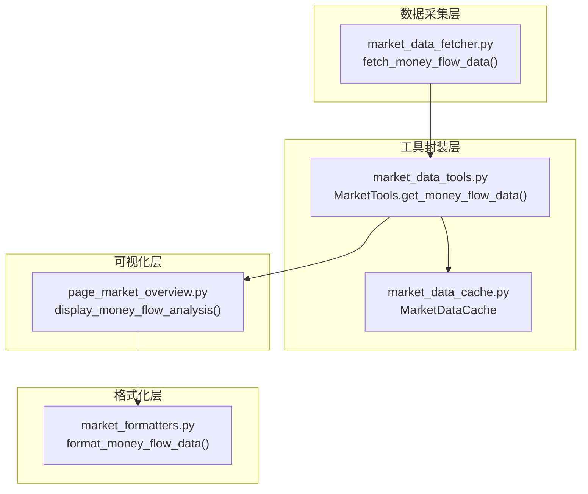
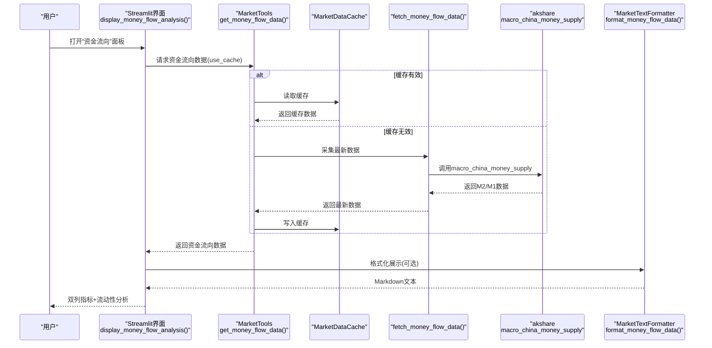
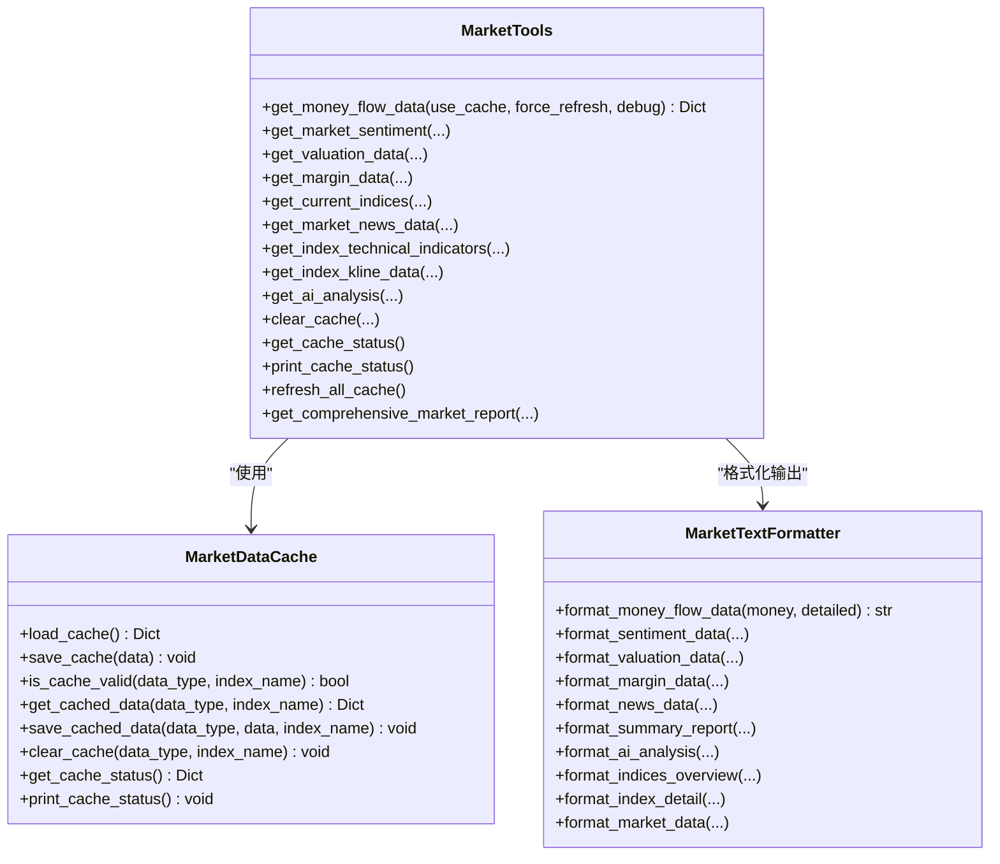
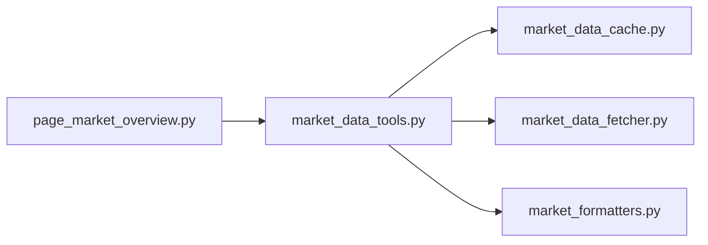

# 资金流向

<cite>
**本文引用的文件**
- [market_data_fetcher.py](file://market/market_data_fetcher.py)
- [market_data_tools.py](file://market/market_data_tools.py)
- [page_market_overview.py](file://ui/components/page_market_overview.py)
- [market_formatters.py](file://market/market_formatters.py)
- [market_data_cache.py](file://market/market_data_cache.py)
</cite>

## 目录
1. [简介](#简介)
2. [项目结构](#项目结构)
3. [核心组件](#核心组件)
4. [架构总览](#架构总览)
5. [详细组件分析](#详细组件分析)
6. [依赖关系分析](#依赖关系分析)
7. [性能考量](#性能考量)
8. [故障排查指南](#故障排查指南)
9. [结论](#结论)

## 简介
本节面向“资金流向”分析功能，聚焦于xystock中M2货币供应量与M1货币供应量等宏观流动性指标的采集、处理与可视化展示。该功能通过调用akshare的macro_china_money_supply接口获取中国M2与M1相关数据，经由统一的市场工具层进行缓存与封装，最终在Streamlit界面以双列布局直观呈现M2余额、M2同比增长、M1余额、M1同比增长，并提供流动性分析的判断逻辑（M2增速水平评估与M1/M2增速对比）。同时，文档说明了数据更新时间戳的格式化显示、常见问题（如宏观经济数据更新延迟）的处理机制以及性能优化建议（缓存策略）。

## 项目结构
资金流向分析涉及四个关键模块：
- 数据采集层：从akshare抓取宏观货币供应量数据
- 工具封装层：统一缓存、错误回退与数据组装
- 可视化层：Streamlit界面展示与交互
- 格式化层：统一的文本与指标格式化

图表来源
- [market_data_fetcher.py](file://market/market_data_fetcher.py#L248-L283)
- [market_data_tools.py](file://market/market_data_tools.py#L196-L213)
- [market_data_cache.py](file://market/market_data_cache.py#L132-L142)
- [page_market_overview.py](file://ui/components/page_market_overview.py#L106-L150)
- [market_formatters.py](file://market/market_formatters.py#L412-L450)

章节来源
- [market_data_fetcher.py](file://market/market_data_fetcher.py#L248-L283)
- [market_data_tools.py](file://market/market_data_tools.py#L196-L213)
- [page_market_overview.py](file://ui/components/page_market_overview.py#L106-L150)
- [market_formatters.py](file://market/market_formatters.py#L412-L450)
- [market_data_cache.py](file://market/market_data_cache.py#L132-L142)

## 核心组件
- 数据采集函数：fetch_money_flow_data
  - 作用：调用akshare的macro_china_money_supply接口，提取最新月份的M2与M1相关指标，构造资金流向数据字典，并附带更新时间戳。
  - 关键字段：m2_amount、m2_growth、m1_amount、m1_growth、m2_date、update_time。
- 工具封装类：MarketTools.get_money_flow_data
  - 作用：统一管理缓存策略（按类型配置过期时间），在缓存有效期内直接返回缓存数据；否则触发采集函数并写入缓存。
  - 关键配置：资金流向指标缓存过期时间为43200分钟（约30天）。
- Streamlit展示函数：display_money_flow_analysis
  - 作用：在Streamlit界面以双列布局展示M2余额与M2同比增长、M1余额与M1同比增长，并展开“流动性分析”区域进行判断提示。
  - 判断逻辑：M2增速>10为“流动性充裕”，M2增速>8为“流动性正常”，否则为“流动性偏紧”；若M1增速>M2增速，提示“资金活跃度较高”，否则“资金活跃度一般”。
- 格式化函数：MarketTextFormatter.format_money_flow_data
  - 作用：将资金流向数据格式化为Markdown文本，支持详细/简单两种模式，统一数值单位与百分比格式。

章节来源
- [market_data_fetcher.py](file://market/market_data_fetcher.py#L248-L283)
- [market_data_tools.py](file://market/market_data_tools.py#L196-L213)
- [page_market_overview.py](file://ui/components/page_market_overview.py#L106-L150)
- [market_formatters.py](file://market/market_formatters.py#L412-L450)

## 架构总览
资金流向分析的端到端流程如下：

图表来源
- [page_market_overview.py](file://ui/components/page_market_overview.py#L106-L150)
- [market_data_tools.py](file://market/market_data_tools.py#L196-L213)
- [market_data_cache.py](file://market/market_data_cache.py#L132-L142)
- [market_data_fetcher.py](file://market/market_data_fetcher.py#L248-L283)
- [market_formatters.py](file://market/market_formatters.py#L412-L450)

## 详细组件分析

### 数据采集：fetch_money_flow_data
- 数据来源：akshare.macro_china_money_supply
- 输出结构：包含m2_amount、m2_growth、m1_amount、m1_growth、m2_date、update_time等字段。
- 错误处理：异常捕获并返回失败标志，保证上层逻辑稳定。
- 更新时间：在采集完成后统一写入update_time。

章节来源
- [market_data_fetcher.py](file://market/market_data_fetcher.py#L248-L283)

### 工具封装：MarketTools.get_money_flow_data
- 缓存策略：依据数据类型配置过期时间（资金流向指标为43200分钟），优先返回缓存数据。
- 异常回退：当采集失败时，尝试返回缓存数据，避免界面中断。
- 与缓存管理器协作：通过MarketDataCache进行读写与有效性校验。

章节来源
- [market_data_tools.py](file://market/market_data_tools.py#L196-L213)
- [market_data_cache.py](file://market/market_data_cache.py#L132-L142)

### 可视化：display_money_flow_analysis
- 双列布局：左侧显示M2余额与M1余额，右侧显示M2同比增长与M1同比增长。
- 时间戳显示：在数据可用时显示update_time或date字段。
- 流动性分析：
  - M2增速水平评估：>10为“充裕”，>8为“正常”，否则“偏紧”。
  - M1/M2增速对比：M1增速>M2为“资金活跃度较高”，否则“资金活跃度一般”。

章节来源
- [page_market_overview.py](file://ui/components/page_market_overview.py#L106-L150)

### 格式化：MarketTextFormatter.format_money_flow_data
- 适用场景：将资金流向数据转为Markdown文本，支持详细/简单两种模式。
- 单位与百分比：统一使用“万亿元”“亿元”“百分比”等格式化函数。
- 过滤零值：自动过滤无效或零值指标，提升可读性。

章节来源
- [market_formatters.py](file://market/market_formatters.py#L412-L450)

### 类关系图

图表来源
- [market_data_cache.py](file://market/market_data_cache.py#L120-L430)
- [market_data_tools.py](file://market/market_data_tools.py#L30-L519)
- [market_formatters.py](file://market/market_formatters.py#L19-L800)

## 依赖关系分析
- 模块耦合
  - MarketTools依赖MarketDataCache进行缓存管理，耦合度低，职责清晰。
  - MarketTools依赖market_data_fetcher进行数据采集，形成稳定的上层封装。
  - Streamlit界面仅依赖MarketTools提供的数据，不直接访问底层采集逻辑，便于UI扩展。
- 外部依赖
  - akshare.macro_china_money_supply：资金流向数据的唯一外部来源。
- 潜在循环依赖
  - 未发现循环导入；各模块职责单一，导入关系单向。

图表来源
- [page_market_overview.py](file://ui/components/page_market_overview.py#L106-L150)
- [market_data_tools.py](file://market/market_data_tools.py#L196-L213)
- [market_data_cache.py](file://market/market_data_cache.py#L132-L142)
- [market_data_fetcher.py](file://market/market_data_fetcher.py#L248-L283)
- [market_formatters.py](file://market/market_formatters.py#L412-L450)

## 性能考量
- 缓存策略
  - 资金流向指标缓存过期时间较长（43200分钟≈30天），适合宏观数据相对稳定的场景，减少频繁请求akshare带来的网络与速率限制风险。
  - 在需要实时性时，可通过取消使用缓存或强制刷新的方式获取最新数据。
- 数据清洗与序列化
  - 缓存层提供NumpyJSONEncoder，自动处理NaN、无穷大、pandas对象等非标准JSON类型，确保缓存文件稳定可靠。
- UI渲染
  - Streamlit双列布局与展开面板的使用，使信息密度高且易于对比，同时通过update_time标注数据新鲜度，提升用户体验。

章节来源
- [market_data_cache.py](file://market/market_data_cache.py#L132-L142)
- [market_data_cache.py](file://market/market_data_cache.py#L21-L118)
- [page_market_overview.py](file://ui/components/page_market_overview.py#L106-L150)

## 故障排查指南
- 宏观经济数据更新延迟
  - 现象：资金流向数据未更新或显示旧值。
  - 排查：确认缓存是否有效；若缓存有效，尝试强制刷新（取消使用缓存或清空缓存后重新获取）。
  - 处理：MarketTools.refresh_all_cache会统一刷新各类缓存；也可单独清理资金流向缓存。
- akshare接口异常
  - 现象：采集失败或返回空数据。
  - 排查：检查网络连通性与akshare可用性；查看异常日志。
  - 处理：工具层会在失败时回退到缓存数据，保证界面可用；必要时手动清空缓存以强制重新采集。
- UI显示异常
  - 现象：指标显示为N/A或格式不正确。
  - 排查：确认返回数据字段是否存在；检查格式化函数的单位与百分比处理逻辑。
  - 处理：核对字段命名与单位映射，确保数据类型为数值。

章节来源
- [market_data_tools.py](file://market/market_data_tools.py#L408-L420)
- [market_data_tools.py](file://market/market_data_tools.py#L214-L231)
- [market_data_fetcher.py](file://market/market_data_fetcher.py#L248-L283)
- [page_market_overview.py](file://ui/components/page_market_overview.py#L106-L150)

## 结论
xystock的资金流向分析通过“采集—封装—缓存—展示—格式化”的完整链路，实现了M2与M1宏观流动性指标的稳定获取与直观呈现。其缓存策略兼顾稳定性与实时性，流式界面提供清晰的流动性判断逻辑，适合日常监控与辅助决策。针对宏观经济数据更新延迟等常见问题，系统提供了缓存回退与强制刷新机制；性能方面，合理的缓存配置与数据清洗保障了长期运行的可靠性。