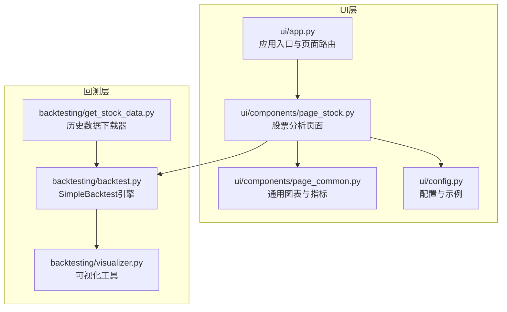
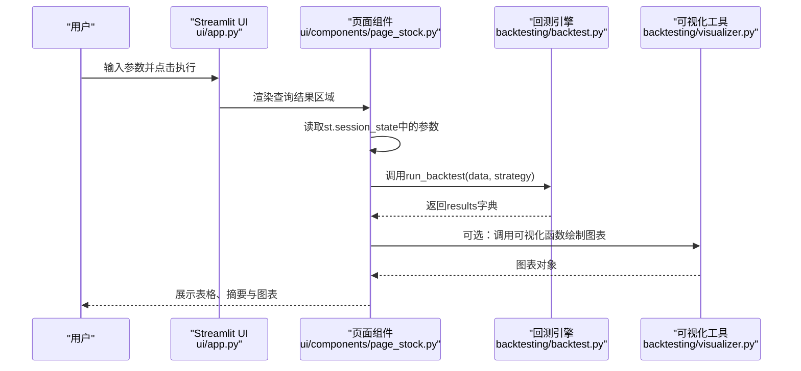
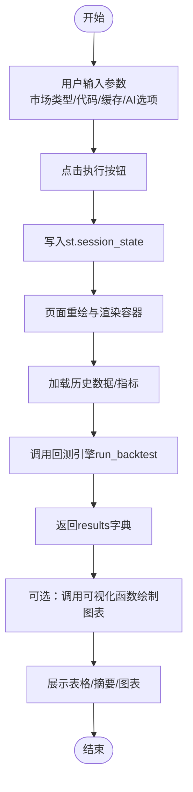
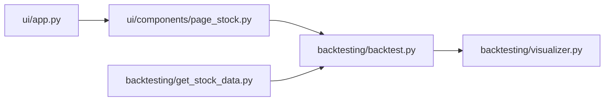

# 前端界面集成

<cite>
**本文引用的文件**
- [ui/app.py](file://ui/app.py)
- [ui/components/page_stock.py](file://ui/components/page_stock.py)
- [backtesting/backtest.py](file://backtesting/backtest.py)
- [backtesting/visualizer.py](file://backtesting/visualizer.py)
- [backtesting/get_stock_data.py](file://backtesting/get_stock_data.py)
- [ui/config.py](file://ui/config.py)
- [ui/components/page_common.py](file://ui/components/page_common.py)
</cite>

## 目录
1. [简介](#简介)
2. [项目结构](#项目结构)
3. [核心组件](#核心组件)
4. [架构总览](#架构总览)
5. [详细组件分析](#详细组件分析)
6. [依赖关系分析](#依赖关系分析)
7. [性能考量](#性能考量)
8. [故障排查指南](#故障排查指南)
9. [结论](#结论)
10. [附录](#附录)

## 简介
本文件聚焦于Web界面与回测引擎的集成方案，围绕ui/components/page_stock.py中的回测功能模块，系统阐述：
- UI组件结构：参数输入表单、执行按钮与结果展示区域
- 参数传递机制：通过Streamlit回调与会话状态，将用户配置传递给回测执行函数
- 异步任务处理：利用Spinner与rerun机制避免界面阻塞
- 前后端数据交互：回测结果数据结构与前端展示策略
- 错误信息传递与前端展示：统一的错误捕获与用户提示

## 项目结构
本项目采用“模块化+分层”的组织方式：
- ui层：Streamlit应用入口与页面组件，负责用户交互与结果展示
- backtesting层：回测引擎与可视化工具，负责策略回测与结果呈现
- stock/market/utils等：数据获取与工具模块，为UI与回测提供数据支撑

图表来源
- [ui/app.py](file://ui/app.py#L1-L229)
- [ui/components/page_stock.py](file://ui/components/page_stock.py#L1-L884)
- [backtesting/backtest.py](file://backtesting/backtest.py#L1-L207)
- [backtesting/visualizer.py](file://backtesting/visualizer.py#L1-L726)
- [backtesting/get_stock_data.py](file://backtesting/get_stock_data.py#L1-L79)
- [ui/components/page_common.py](file://ui/components/page_common.py#L1-L291)
- [ui/config.py](file://ui/config.py#L1-L82)

章节来源
- [ui/app.py](file://ui/app.py#L1-L229)
- [ui/components/page_stock.py](file://ui/components/page_stock.py#L1-L884)
- [backtesting/backtest.py](file://backtesting/backtest.py#L1-L207)
- [backtesting/visualizer.py](file://backtesting/visualizer.py#L1-L726)
- [backtesting/get_stock_data.py](file://backtesting/get_stock_data.py#L1-L79)
- [ui/components/page_common.py](file://ui/components/page_common.py#L1-L291)
- [ui/config.py](file://ui/config.py#L1-L82)

## 核心组件
- UI入口与路由：ui/app.py负责页面导航与参数收集，将用户输入写入st.session_state
- 股票分析页面：ui/components/page_stock.py承载回测功能的UI布局与交互逻辑
- 回测引擎：backtesting/backtest.py提供SimpleBacktest类，封装买卖、更新资产、统计与结果汇总
- 可视化工具：backtesting/visualizer.py提供多种图表绘制与字体配置
- 数据获取：backtesting/get_stock_data.py提供历史数据下载器（供离线/演示使用）

章节来源
- [ui/app.py](file://ui/app.py#L1-L229)
- [ui/components/page_stock.py](file://ui/components/page_stock.py#L1-L884)
- [backtesting/backtest.py](file://backtesting/backtest.py#L1-L207)
- [backtesting/visualizer.py](file://backtesting/visualizer.py#L1-L726)
- [backtesting/get_stock_data.py](file://backtesting/get_stock_data.py#L1-L79)

## 架构总览
前端通过Streamlit构建交互界面，用户在UI层输入参数后，由回调驱动将参数写入会话状态；随后在页面容器中触发回测执行，回测引擎基于策略函数与历史数据进行迭代计算，并返回结果字典；前端将结果字典转换为表格、图表与摘要信息进行展示。

图表来源
- [ui/app.py](file://ui/app.py#L84-L225)
- [ui/components/page_stock.py](file://ui/components/page_stock.py#L1-L884)
- [backtesting/backtest.py](file://backtesting/backtest.py#L97-L139)
- [backtesting/visualizer.py](file://backtesting/visualizer.py#L272-L441)

## 详细组件分析

### UI组件结构与参数输入表单
- 页面入口与参数收集
  - ui/app.py提供“股票查询”页面，包含市场类型选择、股票代码输入、是否使用缓存、是否启用AI分析等选项
  - 通过st.session_state持久化用户输入，作为后续回测与分析的上下文
- 结果展示容器
  - 使用st.container与st.spinner在查询完成后渲染股票信息与分析结果
- 股票分析页面的回测相关区域
  - ui/components/page_stock.py中存在“综合分析”“公司分析”等区域，这些区域展示了AI分析的集成方式，为回测结果的展示提供了参考模式

章节来源
- [ui/app.py](file://ui/app.py#L84-L225)
- [ui/components/page_stock.py](file://ui/components/page_stock.py#L1-L884)

### 执行按钮与回调机制
- 查询按钮逻辑
  - 点击“查询”按钮后，ui/app.py将用户输入写入st.session_state，并标记显示股票信息
  - 通过st.rerun()触发页面重绘，从而进入结果展示阶段
- 会话状态驱动
  - 所有参数（如use_cache、include_ai_analysis、user_opinion、user_position等）均保存在st.session_state中，供后续组件读取
- 回测触发时机
  - 在页面渲染阶段，根据st.session_state的状态决定是否执行回测或展示AI分析结果

章节来源
- [ui/app.py](file://ui/app.py#L125-L207)

### 回测参数与策略函数
- 回测参数
  - 初始资金：SimpleBacktest构造函数接收initial_cash
  - 时间范围：策略函数遍历DataFrame的每一行，逐日执行买卖决策
  - 策略类型：策略函数接收(index, row, backtest, data)，返回字符串('buy'/'sell'/'hold')或字典{'action': ..., 'ratio': ...}
- 数据输入
  - backtesting/backtest.py的run_backtest期望传入包含日期、价格等列的DataFrame
  - backtesting/get_stock_data.py提供历史数据下载器，可用于准备回测数据

章节来源
- [backtesting/backtest.py](file://backtesting/backtest.py#L14-L20)
- [backtesting/backtest.py](file://backtesting/backtest.py#L97-L139)
- [backtesting/get_stock_data.py](file://backtesting/get_stock_data.py#L1-L79)

### 异步任务处理与界面防阻塞
- Spinner与状态提示
  - UI层广泛使用st.spinner显示加载状态，避免长时间回测导致界面卡顿
- rerun机制
  - 通过st.rerun()在按钮点击后触发页面重绘，确保状态变更生效
- 分步执行
  - 将AI分析与回测拆分为独立步骤，分别在不同expander中展示，降低单次渲染压力

章节来源
- [ui/app.py](file://ui/app.py#L125-L207)
- [ui/components/page_stock.py](file://ui/components/page_stock.py#L1-L884)

### 前后端数据交互格式
- 回测结果数据结构
  - SimpleBacktest.get_results返回字典，包含：
    - 初始资金、最终资产、总收益率、年化收益率、最大回撤、夏普比率、胜率
    - 历史净值序列、交易明细
- 可视化接口
  - BacktestVisualizer提供plot_single_strategy、plot_strategy_comparison、plot_trade_analysis、plot_monthly_analysis等函数，接收results字典并绘制图表

章节来源
- [backtesting/backtest.py](file://backtesting/backtest.py#L140-L189)
- [backtesting/visualizer.py](file://backtesting/visualizer.py#L272-L441)

### 前端调用后端接口的完整流程图
以下流程图展示从前端参数输入到回测结果展示的端到端流程：

图表来源
- [ui/app.py](file://ui/app.py#L125-L207)
- [ui/components/page_stock.py](file://ui/components/page_stock.py#L1-L884)
- [backtesting/backtest.py](file://backtesting/backtest.py#L97-L139)
- [backtesting/visualizer.py](file://backtesting/visualizer.py#L272-L441)

### 错误信息传递与前端展示策略
- 统一异常捕获
  - UI层在各模块中使用try/except捕获异常，并通过st.error/st.warning/st.info等组件向用户展示错误信息
- 详细错误面板
  - 使用st.expander展开“错误详情”，便于调试与定位问题
- 缓存与超时控制
  - UI层通过monkey patch设置requests默认超时，减少网络请求阻塞

章节来源
- [ui/app.py](file://ui/app.py#L22-L31)
- [ui/components/page_stock.py](file://ui/components/page_stock.py#L1-L884)

## 依赖关系分析
- UI与回测引擎的耦合
  - UI通过st.session_state传递参数，回测引擎通过run_backtest(data, strategy)执行策略
  - 可视化工具与回测结果解耦，可按需调用
- 数据依赖
  - 回测引擎依赖历史数据DataFrame；数据可通过外部模块或本地下载器准备
- 组件内聚与解耦
  - UI层负责交互与展示；回测层负责业务逻辑；可视化层负责结果呈现，职责清晰

图表来源
- [ui/app.py](file://ui/app.py#L1-L229)
- [ui/components/page_stock.py](file://ui/components/page_stock.py#L1-L884)
- [backtesting/backtest.py](file://backtesting/backtest.py#L1-L207)
- [backtesting/visualizer.py](file://backtesting/visualizer.py#L1-L726)
- [backtesting/get_stock_data.py](file://backtesting/get_stock_data.py#L1-L79)

章节来源
- [ui/app.py](file://ui/app.py#L1-L229)
- [ui/components/page_stock.py](file://ui/components/page_stock.py#L1-L884)
- [backtesting/backtest.py](file://backtesting/backtest.py#L1-L207)
- [backtesting/visualizer.py](file://backtesting/visualizer.py#L1-L726)
- [backtesting/get_stock_data.py](file://backtesting/get_stock_data.py#L1-L79)

## 性能考量
- 使用缓存与强制刷新
  - 通过use_cache与force_refresh控制数据获取策略，平衡速度与准确性
- Spinner与懒加载
  - 在AI分析与回测过程中使用st.spinner，避免长时间阻塞
- 可视化优化
  - 可视化工具提供多类图表，建议按需调用，避免一次性绘制过多图表

## 故障排查指南
- 常见问题
  - 股票代码无效：检查ui/config.py中的示例与映射
  - 网络超时：确认请求超时设置与网络环境
  - 回测无数据：检查历史数据准备与DataFrame列名
- 建议排查步骤
  - 打开“错误详情”expander查看具体异常栈
  - 确认st.session_state中的参数是否正确写入
  - 分步执行：先验证数据获取，再验证策略函数，最后验证可视化

章节来源
- [ui/config.py](file://ui/config.py#L1-L82)
- [ui/app.py](file://ui/app.py#L22-L31)
- [ui/components/page_stock.py](file://ui/components/page_stock.py#L1-L884)

## 结论
本项目通过Streamlit实现了UI与回测引擎的清晰分离：UI负责参数收集与结果展示，回测引擎专注于策略回测与统计分析，可视化工具提供灵活的图表输出。通过st.session_state与Spinner机制，系统在保证用户体验的同时，有效避免了长时间回测导致的界面阻塞。建议在实际部署中进一步完善错误恢复与性能监控，以提升稳定性与可维护性。

## 附录
- 回测结果字段说明
  - 初始资金、最终资产、总收益率、年化收益率、最大回撤、夏普比率、胜率、历史净值序列、交易明细
- 可视化图表类型
  - 资产曲线、回撤曲线、收益分布、持仓变化、交易点位、月度收益、风险收益散点等

章节来源
- [backtesting/backtest.py](file://backtesting/backtest.py#L140-L189)
- [backtesting/visualizer.py](file://backtesting/visualizer.py#L272-L441)