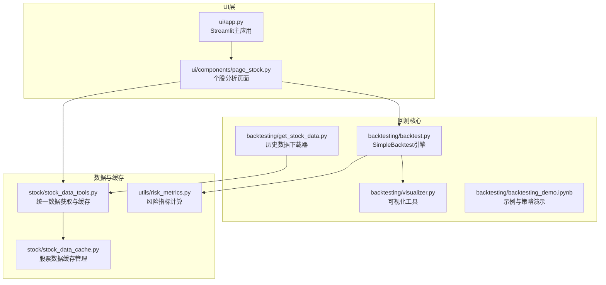
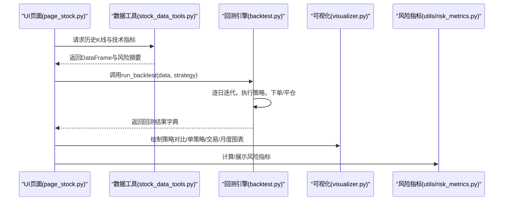
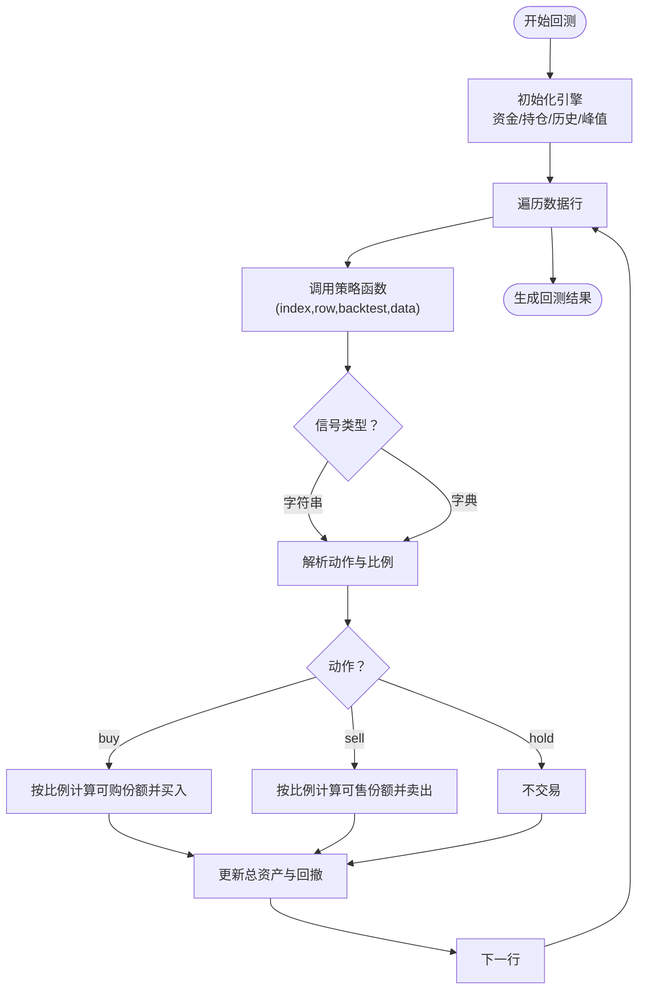
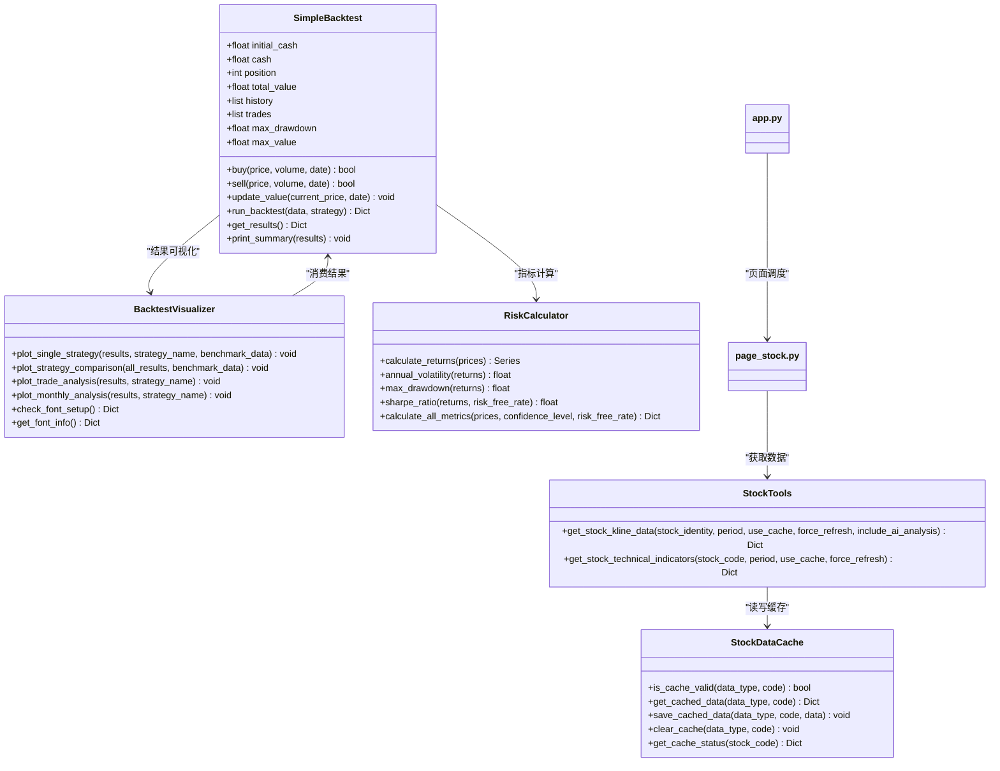

# 回测执行

<cite>
**本文引用的文件**
- [backtest.py](file://backtesting/backtest.py)
- [visualizer.py](file://backtesting/visualizer.py)
- [get_stock_data.py](file://backtesting/get_stock_data.py)
- [backtesting_demo.ipynb](file://backtesting/backtesting_demo.ipynb)
- [page_stock.py](file://ui/components/page_stock.py)
- [app.py](file://ui/app.py)
- [stock_data_tools.py](file://stock/stock_data_tools.py)
- [stock_data_cache.py](file://stock/stock_data_cache.py)
- [risk_metrics.py](file://utils/risk_metrics.py)
</cite>

## 目录
1. [简介](#简介)
2. [项目结构](#项目结构)
3. [核心组件](#核心组件)
4. [架构总览](#架构总览)
5. [详细组件分析](#详细组件分析)
6. [依赖关系分析](#依赖关系分析)
7. [性能考量](#性能考量)
8. [故障排查指南](#故障排查指南)
9. [结论](#结论)

## 简介
本文件围绕 xystock 回测引擎的执行流程展开，重点解析 backtest.py 中的 SimpleBacktest 引擎如何运行回测、策略如何接入、资金管理与订单执行逻辑、可视化输出，以及 UI 层如何通过 Web 界面触发回测任务。同时结合风险控制、异常处理与性能优化建议，帮助读者全面理解从数据准备到结果可视化的完整链路。

## 项目结构
回测相关的关键文件集中在 backtesting 模块，UI 触发层在 ui/components/page_stock.py 与 ui/app.py，数据获取与缓存在 stock 与 utils 模块中。

图表来源
- [app.py](file://ui/app.py#L1-L229)
- [page_stock.py](file://ui/components/page_stock.py#L1-L200)
- [backtest.py](file://backtesting/backtest.py#L1-L207)
- [visualizer.py](file://backtesting/visualizer.py#L1-L120)
- [backtesting_demo.ipynb](file://backtesting/backtesting_demo.ipynb#L1-L120)
- [get_stock_data.py](file://backtesting/get_stock_data.py#L1-L79)
- [stock_data_tools.py](file://stock/stock_data_tools.py#L1-L200)
- [stock_data_cache.py](file://stock/stock_data_cache.py#L53-L256)
- [risk_metrics.py](file://utils/risk_metrics.py#L1-L120)

章节来源
- [app.py](file://ui/app.py#L1-L229)
- [page_stock.py](file://ui/components/page_stock.py#L1-L200)
- [backtest.py](file://backtesting/backtest.py#L1-L207)
- [visualizer.py](file://backtesting/visualizer.py#L1-L120)
- [backtesting_demo.ipynb](file://backtesting/backtesting_demo.ipynb#L1-L120)
- [get_stock_data.py](file://backtesting/get_stock_data.py#L1-L79)
- [stock_data_tools.py](file://stock/stock_data_tools.py#L1-L200)
- [stock_data_cache.py](file://stock/stock_data_cache.py#L53-L256)
- [risk_metrics.py](file://utils/risk_metrics.py#L1-L120)

## 核心组件
- SimpleBacktest 引擎：负责初始化资金、执行买卖、更新资产、计算指标与生成回测结果。
- 可视化模块：提供资产曲线、回撤、收益分布、交易点位、月度表现等图表。
- 数据获取与缓存：统一从 stock 模块获取历史数据，支持缓存与过期策略。
- UI 触发：通过 Streamlit 页面收集用户输入，组装参数并调用回测流程。

章节来源
- [backtest.py](file://backtesting/backtest.py#L1-L207)
- [visualizer.py](file://backtesting/visualizer.py#L272-L441)
- [stock_data_tools.py](file://stock/stock_data_tools.py#L132-L189)
- [stock_data_cache.py](file://stock/stock_data_cache.py#L192-L256)

## 架构总览
回测执行链路如下：
- UI 层收集用户输入（如策略、参数），调用数据工具获取历史数据。
- 将数据与策略函数传入 SimpleBacktest.run_backtest，逐日迭代执行策略并记录交易。
- 回测完成后，调用可视化模块绘制图表；同时可结合风险指标模块进行风险评估。

图表来源
- [page_stock.py](file://ui/components/page_stock.py#L493-L546)
- [stock_data_tools.py](file://stock/stock_data_tools.py#L132-L189)
- [backtest.py](file://backtesting/backtest.py#L97-L139)
- [visualizer.py](file://backtesting/visualizer.py#L272-L441)
- [risk_metrics.py](file://utils/risk_metrics.py#L1-L120)

## 详细组件分析

### SimpleBacktest 引擎与回测流程
- 初始化与状态：初始资金、现金、持仓、总资产、历史记录、最大回撤与峰值。
- 买入/卖出：按价格×数量扣款/加仓，记录交易明细；卖出按数量扣减。
- 更新资产：按当日收盘价更新总资产，计算回撤并记录历史。
- 策略接入：run_backtest 接收策略函数，逐行调用，支持字符串信号与带比例的字典信号。
- 结果统计：计算总收益、年化收益、夏普比率、胜率、交易次数等，并返回历史与交易明细 DataFrame。

图表来源
- [backtest.py](file://backtesting/backtest.py#L97-L139)
- [backtest.py](file://backtesting/backtest.py#L44-L96)
- [backtest.py](file://backtesting/backtest.py#L140-L207)

章节来源
- [backtest.py](file://backtesting/backtest.py#L1-L207)

### 策略实现与示例
- 示例 Notebook 展示了多种策略函数，包括均线交叉、动量、RSI近似、突破与价格阈值策略。
- 策略函数签名：接收 index、row、backtest 实例、data，返回 'buy'/'sell'/'hold' 或 {'action':'buy','ratio':x}。
- Notebook 中还演示了如何选择最近几年数据、批量执行策略并对比结果。

章节来源
- [backtesting_demo.ipynb](file://backtesting/backtesting_demo.ipynb#L160-L261)
- [backtesting_demo.ipynb](file://backtesting/backtesting_demo.ipynb#L299-L343)
- [backtesting_demo.ipynb](file://backtesting/backtesting_demo.ipynb#L352-L477)

### 数据获取与缓存
- UI 页面通过 stock_data_tools 获取 K 线与技术指标，返回包含 kline_data、indicators、risk_metrics 的结构。
- stock_data_cache 提供统一的缓存管理，支持 JSON 安全编码、过期策略、状态查询与清理。
- get_stock_data 提供历史数据下载器，支持按股票代码或全市场下载 CSV 文件。

章节来源
- [page_stock.py](file://ui/components/page_stock.py#L506-L541)
- [stock_data_tools.py](file://stock/stock_data_tools.py#L132-L189)
- [stock_data_cache.py](file://stock/stock_data_cache.py#L192-L256)
- [get_stock_data.py](file://backtesting/get_stock_data.py#L1-L79)

### 可视化模块
- 单策略分析：资产曲线、回撤曲线、收益分布、持仓变化。
- 策略对比：多策略资产曲线、回撤对比、总收益对比、风险收益散点。
- 交易分析：价格与交易点位、月度交易频率、持仓时间分布、单笔盈亏。
- 月度分析：月度收益、累计收益曲线、收益分布、胜率饼图。
- 字体与显示：自动检测系统字体，必要时安装中文字体，提供测试与检查接口。

章节来源
- [visualizer.py](file://backtesting/visualizer.py#L272-L441)
- [visualizer.py](file://backtesting/visualizer.py#L442-L545)
- [visualizer.py](file://backtesting/visualizer.py#L546-L618)
- [visualizer.py](file://backtesting/visualizer.py#L619-L726)

### 风险控制与指标
- 回测引擎内置最大回撤与峰值追踪，用于衡量回撤幅度。
- utils/risk_metrics 提供波动率、最大回撤、夏普比率、VaR/CVaR 等指标计算，可用于独立风险评估与报告。

章节来源
- [backtest.py](file://backtesting/backtest.py#L75-L96)
- [risk_metrics.py](file://utils/risk_metrics.py#L1-L120)
- [risk_metrics.py](file://utils/risk_metrics.py#L128-L197)

### UI 触发回测任务
- app.py 提供主页面与菜单，页面内包含市场类型选择、股票代码输入、AI分析开关、缓存开关等。
- page_stock.py 在“技术分析”Tab 中调用 stock_data_tools 获取数据并渲染图表，同时可触发回测流程（由 Notebook 示例展示思路）。
- UI 使用 session_state 保持查询状态，避免重复触发与刷新问题。

章节来源
- [app.py](file://ui/app.py#L84-L209)
- [page_stock.py](file://ui/components/page_stock.py#L493-L546)

## 依赖关系分析

图表来源
- [backtest.py](file://backtesting/backtest.py#L1-L207)
- [visualizer.py](file://backtesting/visualizer.py#L272-L441)
- [stock_data_tools.py](file://stock/stock_data_tools.py#L132-L189)
- [stock_data_cache.py](file://stock/stock_data_cache.py#L192-L256)
- [risk_metrics.py](file://utils/risk_metrics.py#L1-L120)
- [page_stock.py](file://ui/components/page_stock.py#L493-L546)
- [app.py](file://ui/app.py#L84-L209)

## 性能考量
- 数据缓存
  - 使用 stock_data_cache 管理缓存，避免重复拉取，提高 UI 与回测加载速度。
  - 建议：对高频访问的数据（如技术指标、风险摘要）启用缓存；对实时性强的数据（K线）按需刷新。
- 分批回测
  - Notebook 示例展示了按最近 N 个交易日分段回测的做法，有助于控制内存占用与缩短等待时间。
- 字体与图表
  - 可视化模块自动检测与安装中文字体，减少渲染失败与重试开销。
- 并发与幂等
  - stock_data_tools 对关键数据获取加锁与缓存，避免并发重复拉取造成的资源浪费。

章节来源
- [stock_data_cache.py](file://stock/stock_data_cache.py#L192-L256)
- [backtesting_demo.ipynb](file://backtesting/backtesting_demo.ipynb#L300-L343)
- [visualizer.py](file://backtesting/visualizer.py#L619-L726)
- [stock_data_tools.py](file://stock/stock_data_tools.py#L41-L113)

## 故障排查指南
- 数据中断
  - 若 get_stock_data 下载失败，检查网络与目标目录权限；确认日期范围与股票代码格式。
  - UI 页面在获取数据失败时会弹出错误提示与详情折叠面板，便于定位问题。
- 内存溢出
  - 大数据集回测时，建议分批执行或减少策略复杂度；关闭不必要的 AI 分析与图表渲染。
  - Notebook 中通过截取最近 N 日数据降低内存压力。
- 回测异常
  - 策略函数返回非法信号或越界（如空仓卖出、负资金），回测会拒绝执行并返回 False；可在策略中增加边界检查。
- 可视化问题
  - 字体缺失导致中文乱码或渲染失败，使用 check_font_setup 与 install_chinese_fonts 自动修复。

章节来源
- [get_stock_data.py](file://backtesting/get_stock_data.py#L1-L79)
- [page_stock.py](file://ui/components/page_stock.py#L1-L120)
- [backtesting_demo.ipynb](file://backtesting/backtesting_demo.ipynb#L300-L343)
- [visualizer.py](file://backtesting/visualizer.py#L619-L726)

## 结论
xystock 回测引擎以 SimpleBacktest 为核心，配合可视化与风险指标模块，提供了从策略接入、订单执行、资金管理到结果可视化的完整闭环。UI 层通过 Streamlit 提供友好的交互体验，数据层通过统一工具与缓存提升效率。实践中建议结合缓存、分批回测与异常监控，持续优化性能与稳定性。