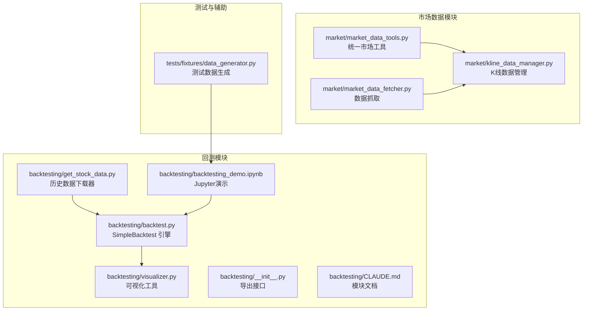
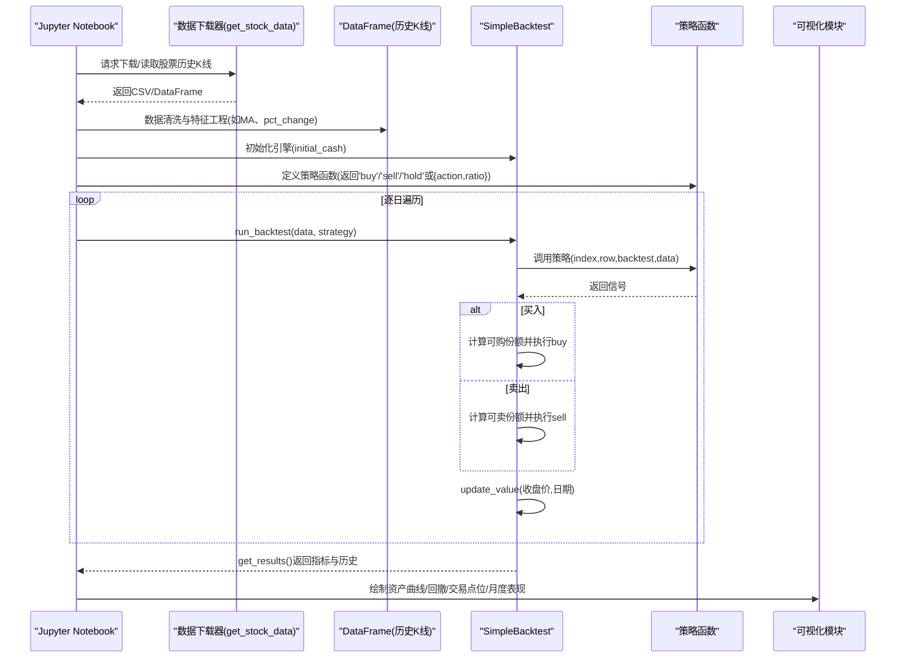
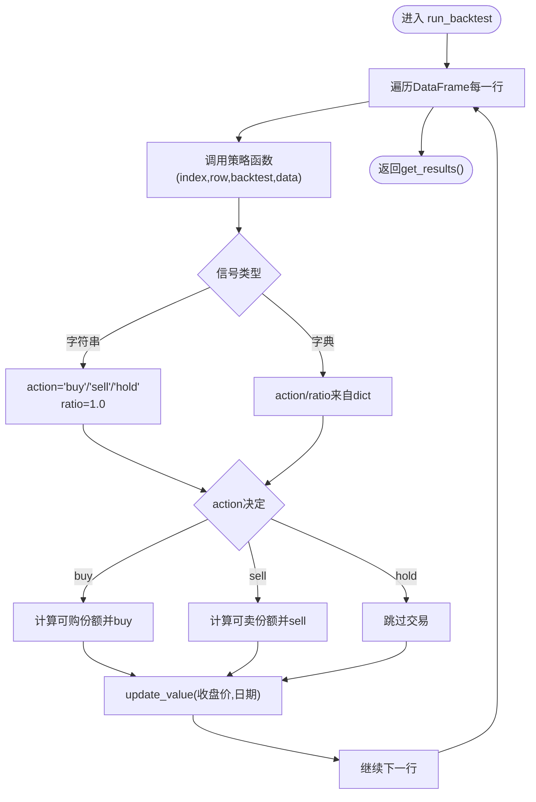
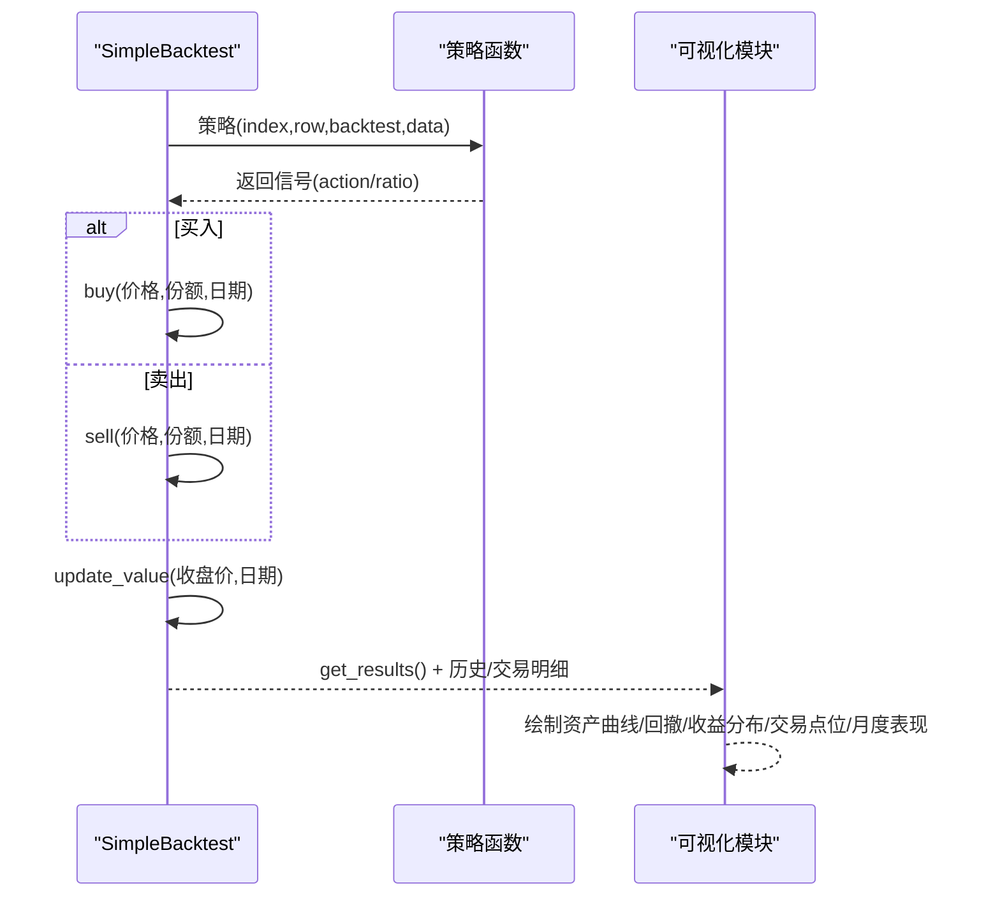
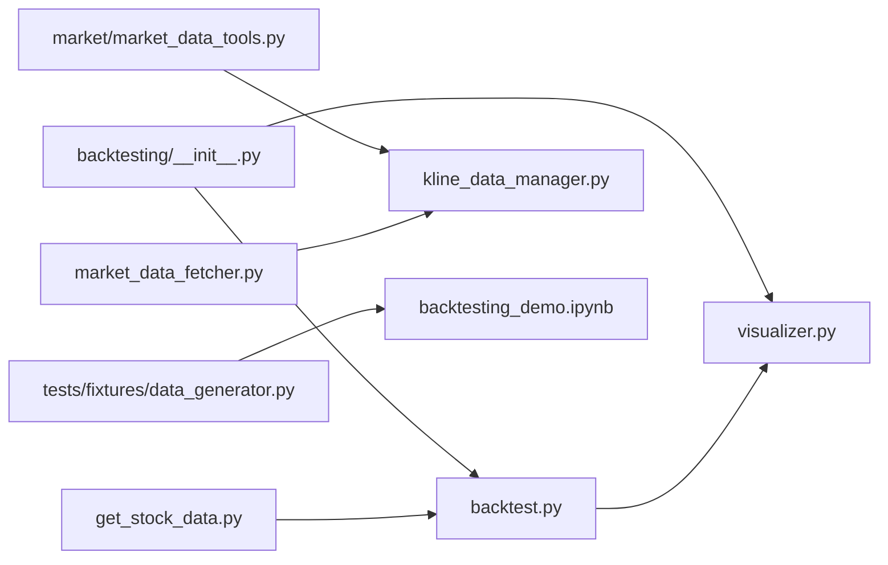

# 回测执行流程

<cite>
**本文引用的文件**
- [backtest.py](file://backtesting/backtest.py)
- [get_stock_data.py](file://backtesting/get_stock_data.py)
- [visualizer.py](file://backtesting/visualizer.py)
- [backtesting_demo.ipynb](file://backtesting/backtesting_demo.ipynb)
- [CLAUDE.md](file://backtesting/CLAUDE.md)
- [__init__.py](file://backtesting/__init__.py)
- [kline_data_manager.py](file://market/kline_data_manager.py)
- [market_data_tools.py](file://market/market_data_tools.py)
- [market_data_fetcher.py](file://market/market_data_fetcher.py)
- [data_generator.py](file://tests/fixtures/data_generator.py)
</cite>

## 目录
1. [简介](#简介)
2. [项目结构](#项目结构)
3. [核心组件](#核心组件)
4. [架构总览](#架构总览)
5. [详细组件分析](#详细组件分析)
6. [依赖关系分析](#依赖关系分析)
7. [性能考量](#性能考量)
8. [故障排查指南](#故障排查指南)
9. [结论](#结论)
10. [附录](#附录)

## 简介
本文件面向希望深入理解 xystock 回测引擎完整执行流程的读者，围绕 backtest.py 中的 SimpleBacktest 引擎展开，系统阐述从数据源加载、策略注入、手续费与滑点模型配置，到回测时间范围确定、数据对齐与多股票回测时序同步、事件循环与回调顺序、以及可视化与结果汇总的全过程。同时提供流程图与关键断点，帮助定位问题与优化性能。

## 项目结构
回测相关的核心文件集中在 backtesting 模块，配合 market 模块的数据获取与缓存能力，形成“数据获取—策略回测—结果可视化”的闭环。

图表来源
- [backtest.py](file://backtesting/backtest.py#L1-L207)
- [visualizer.py](file://backtesting/visualizer.py#L1-L726)
- [get_stock_data.py](file://backtesting/get_stock_data.py#L1-L79)
- [backtesting_demo.ipynb](file://backtesting/backtesting_demo.ipynb#L1-L502)
- [__init__.py](file://backtesting/__init__.py#L1-L24)
- [CLAUDE.md](file://backtesting/CLAUDE.md#L1-L204)
- [kline_data_manager.py](file://market/kline_data_manager.py#L319-L329)
- [market_data_tools.py](file://market/market_data_tools.py#L1-L519)
- [market_data_fetcher.py](file://market/market_data_fetcher.py#L1-L607)
- [data_generator.py](file://tests/fixtures/data_generator.py#L1-L48)

章节来源
- [backtesting/__init__.py](file://backtesting/__init__.py#L1-L24)
- [backtesting/CLAUDE.md](file://backtesting/CLAUDE.md#L1-L204)

## 核心组件
- SimpleBacktest 引擎：负责账户状态维护、交易执行、净值更新与回测指标计算。
- 策略函数：接收索引、行数据、回测实例与原始数据，返回字符串或字典信号；字典可携带“action”和“ratio”。
- 可视化模块：提供资产曲线、回撤、收益分布、交易点位、月度表现等图表。
- 数据获取：get_stock_data 提供 Baostock 历史数据下载；market 模块提供统一的指数与技术指标获取能力。

章节来源
- [backtest.py](file://backtesting/backtest.py#L1-L207)
- [visualizer.py](file://backtesting/visualizer.py#L1-L726)
- [get_stock_data.py](file://backtesting/get_stock_data.py#L1-L79)
- [backtesting_demo.ipynb](file://backtesting/backtesting_demo.ipynb#L1-L502)

## 架构总览
回测执行链路由“数据准备—策略注入—逐日回测—指标汇总—可视化输出”构成。下图展示了从 Jupyter Notebook 到 SimpleBacktest 的调用关系与数据流。

图表来源
- [backtesting_demo.ipynb](file://backtesting/backtesting_demo.ipynb#L1-L502)
- [backtest.py](file://backtesting/backtest.py#L97-L139)
- [visualizer.py](file://backtesting/visualizer.py#L272-L441)

## 详细组件分析

### SimpleBacktest 引擎
- 初始化与状态：维护初始资金、现金、持仓、总资产、历史与交易记录、最大回撤与峰值。
- 交易执行：buy/sell 根据价格与可用资金/持仓数量执行；记录交易明细。
- 净值更新：update_value 计算总资产、更新最大值与回撤，并记录历史。
- 回测主循环：run_backtest 逐行迭代，调用策略函数，解析信号（字符串或字典），按比例下单，最后返回指标。
- 指标计算：总收益、年化收益、夏普比率、胜率、交易次数、历史与交易明细。

图表来源
- [backtest.py](file://backtesting/backtest.py#L97-L139)

章节来源
- [backtest.py](file://backtesting/backtest.py#L1-L207)

### 数据源加载与时间范围
- 历史数据获取：get_stock_data 提供 Baostock 下载器，支持按股票代码或全市场下载，输出 CSV 文件。
- Notebook 示例：演示了数据读取、排序、时间范围确认、技术指标计算（如 MA、pct_change）与回测窗口截取（如最近约5年交易日）。
- 时间范围确定：通过最小/最大日期与长度判断，确保回测区间连续且符合交易日习惯。

章节来源
- [get_stock_data.py](file://backtesting/get_stock_data.py#L1-L79)
- [backtesting_demo.ipynb](file://backtesting/backtesting_demo.ipynb#L113-L145)
- [backtesting_demo.ipynb](file://backtesting/backtesting_demo.ipynb#L299-L343)

### 策略注入与信号解析
- 策略函数签名：接收 index、row、backtest 实例、原始数据，返回字符串或字典。
- 字典信号：支持 action 与 ratio，ratio 控制下单比例；字符串信号默认全仓。
- Notebook 中提供了多种策略示例：均线交叉、动量、RSI模拟、突破、价格阈值策略等。

章节来源
- [backtest.py](file://backtesting/backtest.py#L97-L139)
- [backtesting_demo.ipynb](file://backtesting/backtesting_demo.ipynb#L153-L291)

### 手续费与滑点模型配置
- 模块文档中明确列出 BACKTEST_CONFIG 包含初始资金、手续费率、滑点、仓位上限等参数，建议在策略或引擎扩展中应用。
- 当前 SimpleBacktest 未内置手续费与滑点计算逻辑，可在策略侧自行考虑或扩展引擎以纳入成本模型。

章节来源
- [CLAUDE.md](file://backtesting/CLAUDE.md#L92-L101)

### 多股票回测与时序同步
- 当前 SimpleBacktest 为单标的回测引擎，未内置多股票组合与对齐逻辑。
- 若需多股票回测，建议在外部层面对齐各标的的时间轴（如统一日期集合、缺失值填充/跳过），然后对每个标的独立运行回测，再在上层合并结果与风控。
- market 模块提供指数与技术指标获取能力，可作为多标的回测的辅助数据来源。

章节来源
- [backtesting/CLAUDE.md](file://backtesting/CLAUDE.md#L144-L183)
- [market/market_data_tools.py](file://market/market_data_tools.py#L1-L519)
- [market/market_data_fetcher.py](file://market/market_data_fetcher.py#L1-L607)

### 事件循环与回调顺序
- 逐日事件流：开盘前（策略决策）、收盘后（净值更新）。
- 回测主循环内顺序：
  1) 调用策略函数获取信号；
  2) 解析信号并按比例下单（买入/卖出/持有）；
  3) 更新总资产、最大值与回撤；
  4) 记录历史与交易明细。
- 可视化阶段：在回测完成后，使用可视化模块绘制资产曲线、回撤、收益分布、交易点位与月度表现。

图表来源
- [backtest.py](file://backtesting/backtest.py#L97-L139)
- [visualizer.py](file://backtesting/visualizer.py#L272-L441)

### 可视化与结果汇总
- 单策略分析：资产曲线、回撤曲线、收益分布、持仓变化。
- 策略对比：多策略资产曲线对比、回撤对比、总收益对比、风险收益散点。
- 交易分析：价格与交易点位、月度交易频率、持仓时间分布、单笔盈亏。
- 月度分析：月度收益、累计收益曲线、分布直方图、胜率统计。

章节来源
- [visualizer.py](file://backtesting/visualizer.py#L272-L726)

## 依赖关系分析
- backtesting 模块导出 SimpleBacktest 与可视化接口，便于 Notebook 与外部脚本直接使用。
- get_stock_data 与 market 模块分别承担数据下载与指数/技术指标获取，为回测提供高质量输入。
- 测试数据生成器可用于构造合成数据，验证回测逻辑与可视化。

图表来源
- [__init__.py](file://backtesting/__init__.py#L1-L24)
- [backtest.py](file://backtesting/backtest.py#L1-L207)
- [visualizer.py](file://backtesting/visualizer.py#L1-L726)
- [get_stock_data.py](file://backtesting/get_stock_data.py#L1-L79)
- [market_data_tools.py](file://market/market_data_tools.py#L1-L519)
- [kline_data_manager.py](file://market/kline_data_manager.py#L319-L329)
- [market_data_fetcher.py](file://market/market_data_fetcher.py#L1-L607)
- [data_generator.py](file://tests/fixtures/data_generator.py#L1-L48)

章节来源
- [backtesting/__init__.py](file://backtesting/__init__.py#L1-L24)

## 性能考量
- 数据规模：回测主循环按行迭代，时间复杂度近似 O(N)，其中 N 为交易日数量。建议在策略函数中尽量避免高复杂度计算（如滚动窗口内嵌套循环）。
- 指标计算：夏普比率与收益分布基于历史净值序列，注意空序列与除零保护。
- 可视化：Matplotlib 渲染图表时注意内存占用，大批量对比图建议分批绘制或降低分辨率。
- 多标的扩展：若扩展为多股票组合，建议在外部层面对齐时间轴并采用向量化计算（如使用 pandas rolling、groupby 等）以提升效率。

[本节为通用指导，无需特定文件引用]

## 故障排查指南
- 数据缺失/异常：检查 CSV 文件是否存在、日期是否排序、收盘价是否为空；必要时在 Notebook 中增加数据清洗步骤。
- 策略无交易：确认策略函数返回信号的条件是否满足，或在策略中加入“hold”分支；检查 ratio 是否为 0。
- 回测无结果：确认 run_backtest 是否被调用、get_results 是否被返回；检查历史与交易记录是否为空。
- 可视化异常：检查字体配置与系统字体安装；使用 check_font_setup 与 get_font_info 辅助诊断。
- 多标的对齐：若出现时间不一致导致的 NaN，应在外部层面对齐日期集合并填充/跳过。

章节来源
- [backtesting_demo.ipynb](file://backtesting/backtesting_demo.ipynb#L1-L120)
- [visualizer.py](file://backtesting/visualizer.py#L619-L726)

## 结论
xystock 回测引擎以 SimpleBacktest 为核心，通过清晰的策略注入与逐日事件循环，实现了从数据到指标与可视化的完整闭环。当前引擎聚焦单标的回测与基础指标，未内置手续费/滑点与多标的对齐逻辑；可通过策略侧扩展或在外部层面对齐时间轴实现更复杂的场景。结合 market 模块的数据能力与可视化工具，可快速搭建策略验证与分析工作流。

[本节为总结，无需特定文件引用]

## 附录

### 构建并运行完整回测任务的步骤
- 准备数据：使用 get_stock_data 下载目标股票的历史K线，或在 Notebook 中读取已有 CSV。
- 数据预处理：排序、去重、计算技术指标（如 MA、pct_change），并截取回测区间。
- 定义策略：编写策略函数，返回字符串或字典信号。
- 运行回测：初始化 SimpleBacktest，调用 run_backtest，获取结果并打印摘要。
- 可视化：调用可视化模块绘制各类图表。

章节来源
- [get_stock_data.py](file://backtesting/get_stock_data.py#L1-L79)
- [backtesting_demo.ipynb](file://backtesting/backtesting_demo.ipynb#L113-L291)
- [backtest.py](file://backtesting/backtest.py#L97-L139)
- [visualizer.py](file://backtesting/visualizer.py#L272-L441)