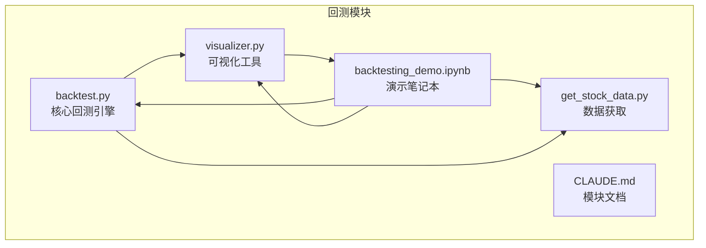
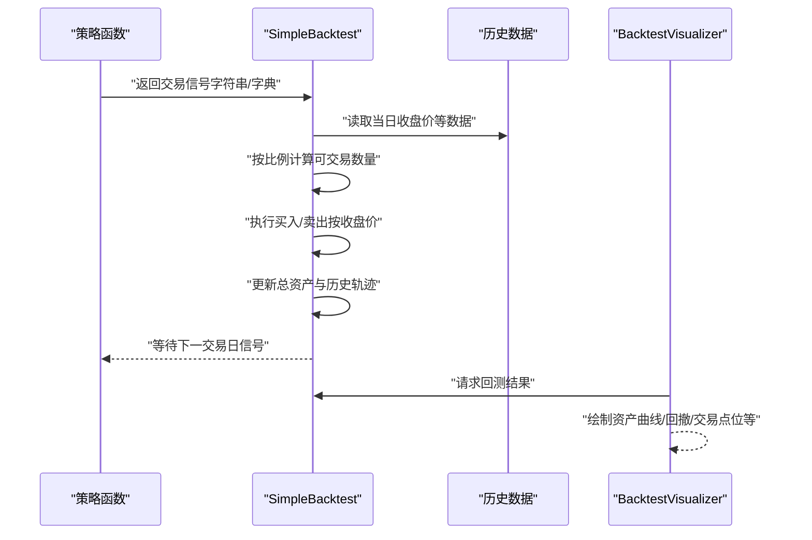
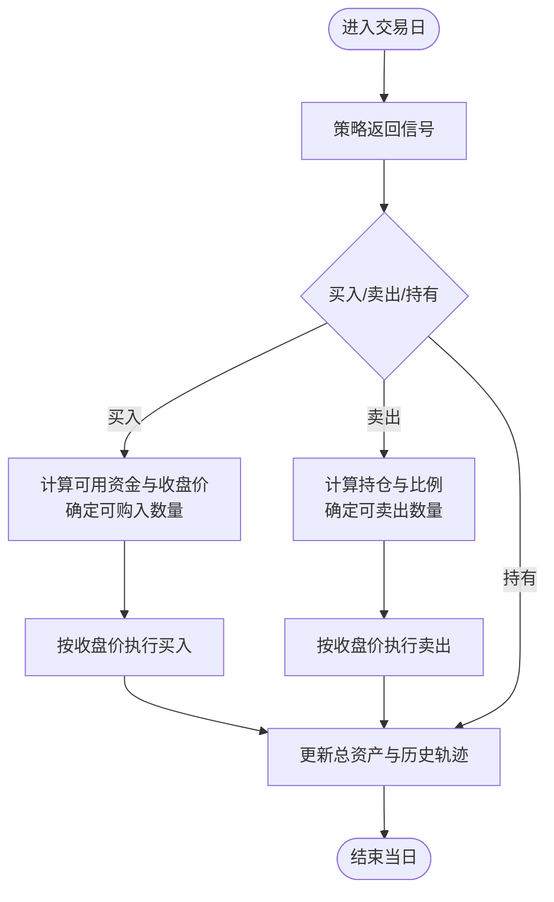
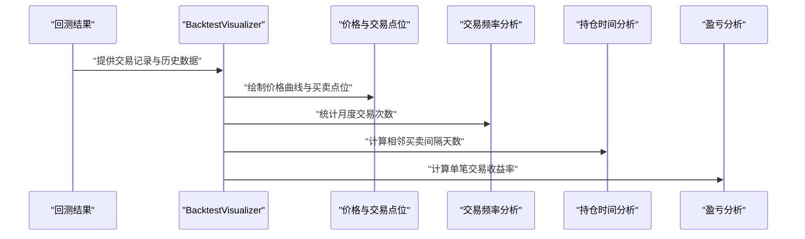
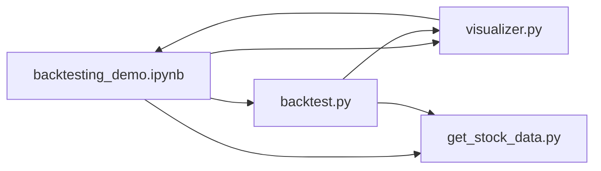

# 订单执行模拟

<cite>
**本文引用的文件**
- [backtest.py](file://backtesting/backtest.py)
- [visualizer.py](file://backtesting/visualizer.py)
- [backtesting_demo.ipynb](file://backtesting/backtesting_demo.ipynb)
- [get_stock_data.py](file://backtesting/get_stock_data.py)
- [CLAUDE.md](file://backtesting/CLAUDE.md)
</cite>

## 目录
1. [引言](#引言)
2. [项目结构](#项目结构)
3. [核心组件](#核心组件)
4. [架构总览](#架构总览)
5. [详细组件分析](#详细组件分析)
6. [依赖关系分析](#依赖关系分析)
7. [性能考量](#性能考量)
8. [故障排查指南](#故障排查指南)
9. [结论](#结论)
10. [附录](#附录)

## 引言
本文件围绕回测系统中的订单执行模拟机制展开，重点解释市价单、限价单、止损单的撮合逻辑（价格匹配规则、成交时间延迟模拟、部分成交处理），以及交易成本（佣金、印花税）的精确计算方式与结算应用。同时结合 backtest.py 中的订单处理器代码，分析滑点模型如何影响实际成交价格；并通过 visualizer.py 生成的交易记录图表，展示订单生命周期的可视化表示。最后讨论滑点与流动性假设的关系，并给出不同市场环境下参数调优建议。

## 项目结构
backtesting 模块由以下关键文件组成：
- backtest.py：核心回测引擎，负责策略驱动的交易执行、账户状态更新与回测结果统计。
- visualizer.py：回测结果可视化工具，提供资产曲线、回撤、交易点位、月度表现等图表。
- backtesting_demo.ipynb：Jupyter 演示笔记本，展示策略回测与可视化的完整流程。
- get_stock_data.py：历史数据获取工具，支持从第三方数据源批量下载股票数据。
- CLAUDE.md：模块文档，包含接口说明、配置参数与数据模型。

**图表来源**
- [backtest.py](file://backtesting/backtest.py#L1-L207)
- [visualizer.py](file://backtesting/visualizer.py#L1-L726)
- [backtesting_demo.ipynb](file://backtesting/backtesting_demo.ipynb#L1-L502)
- [get_stock_data.py](file://backtesting/get_stock_data.py#L1-L79)
- [CLAUDE.md](file://backtesting/CLAUDE.md#L1-L204)

**章节来源**
- [backtest.py](file://backtesting/backtest.py#L1-L207)
- [visualizer.py](file://backtesting/visualizer.py#L1-L726)
- [backtesting_demo.ipynb](file://backtesting/backtesting_demo.ipynb#L1-L502)
- [get_stock_data.py](file://backtesting/get_stock_data.py#L1-L79)
- [CLAUDE.md](file://backtesting/CLAUDE.md#L1-L204)

## 核心组件
- SimpleBacktest：回测引擎主体，提供买入、卖出、资产更新、回测运行与结果统计等能力。
- BacktestVisualizer：可视化工具，支持策略对比、交易分析、月度表现等多维度图表。
- 策略函数：接收索引、行数据、回测实例与数据帧，返回交易信号（字符串或字典）。
- 数据源：通过 get_stock_data.py 或外部数据源提供 OHLCV 等历史数据。

关键职责与行为：
- 交易执行：基于策略信号在当日 K 线收盘价处按比例下单，支持全仓与部分仓。
- 资产管理：维护现金、持仓、总资产、最大回撤与历史轨迹。
- 结果统计：计算总收益、年化收益、夏普比率、胜率等指标。
- 可视化：绘制资产曲线、回撤、交易点位、月度收益等图表。

**章节来源**
- [backtest.py](file://backtesting/backtest.py#L1-L207)
- [visualizer.py](file://backtesting/visualizer.py#L1-L726)
- [backtesting_demo.ipynb](file://backtesting/backtesting_demo.ipynb#L1-L502)

## 架构总览
回测系统采用“策略驱动 + 逐日推进”的架构。策略函数在每个交易日根据历史数据生成交易信号，回测引擎据此在当日收盘价执行交易，随后更新账户状态与历史轨迹。可视化模块基于回测结果生成各类图表，辅助分析策略表现与交易生命周期。

**图表来源**
- [backtest.py](file://backtesting/backtest.py#L97-L138)
- [visualizer.py](file://backtesting/visualizer.py#L272-L544)

## 详细组件分析

### SimpleBacktest：订单执行与结算
- 交易执行逻辑
  - 买入：以当日收盘价成交，按可用资金与收盘价计算最大可购入数量，满足最小单位与资金约束后记录交易。
  - 卖出：以当日收盘价成交，按持仓数量与比例计算可卖出数量，满足最小单位与持仓约束后记录交易。
  - 时间延迟模拟：当前实现以“当日收盘价”作为成交价，隐含了“T+1”或“T日下单、T+1日成交”的延迟假设，即策略信号在 T 日发出，成交发生在 T+1 日的收盘价。
  - 部分成交处理：通过比例参数控制（字典信号中的 ratio），支持全仓与部分仓；若剩余资金/持仓不足，可能无法完全成交。
- 交易成本与结算
  - 当前实现未直接体现佣金、印花税等显式成本字段；交易记录包含日期、动作、价格、成交量与金额，但未包含佣金明细。
  - 若需纳入成本，可在 buy/sell 中增加成本计算与扣减，并在交易记录中补充字段。
- 资产更新与回撤
  - 每日以收盘价更新总资产，计算最大回撤与回撤率，并记录历史轨迹。
- 结果统计
  - 计算总收益、年化收益、夏普比率、胜率等指标，便于策略对比与评估。

**图表来源**
- [backtest.py](file://backtesting/backtest.py#L44-L138)

**章节来源**
- [backtest.py](file://backtesting/backtest.py#L44-L138)

### 市价单、限价单、止损单的撮合逻辑
- 市价单
  - 以当日收盘价成交，隐含“立即成交”假设；在高波动或低流动性时段，实际成交价可能偏离收盘价。
  - 在当前实现中，市价单即为“以收盘价成交”的默认行为。
- 限价单
  - 当前实现未直接支持限价单的显式价格判断；可通过策略函数在信号中携带目标价格与方向，再在回测引擎中按收盘价执行。
  - 若需严格限价撮合，可在 buy/sell 前增加价格匹配逻辑（例如：买入限价≥收盘价、卖出限价≤收盘价）。
- 止损单
  - 当前实现未直接支持止损单；可通过策略函数在信号中携带止损条件（如价格跌破某阈值），并在回测引擎中按收盘价执行卖出。
- 成交时间延迟
  - 当前以“收盘价成交”隐含 T+1 延迟；若需更精细的延迟建模，可在策略层引入“挂单时间”与“成交时间”，并在回测中按分钟/Tick 进行撮合。
- 部分成交
  - 通过 ratio 控制部分成交；若资金/持仓不足，可能导致部分成交或跳过交易。

**章节来源**
- [backtest.py](file://backtesting/backtest.py#L97-L138)

### 交易成本（佣金、印花税）的计算与结算
- 现状
  - 交易记录未包含佣金、印花税等成本字段；资产更新以收盘价为准，未扣除交易成本。
- 建议实现
  - 在 buy/sell 中增加成本计算：例如佣金按成交金额的固定比例，印花税按卖出金额的固定比例。
  - 将成本从现金中扣除，并在交易记录中补充 commission、tax 等字段。
  - 在 update_value 中使用“成交后净值”而非“收盘价”更新总资产，以反映真实盈亏。
- 影响
  - 加入成本后，总收益、年化收益、胜率等指标会下降，但更贴近真实交易成本。

**章节来源**
- [backtest.py](file://backtesting/backtest.py#L44-L96)

### 滑点模型与流动性假设
- 滑点含义
  - 滑点指实际成交价与预期价格之间的偏差，常用于模拟流动性不足、冲击成本与市场噪声。
- 当前实现
  - 代码未显式实现滑点模型；以收盘价成交隐含“流动性充足、无滑点”的假设。
- 滑点建模建议
  - 市价单：在收盘价基础上引入随机扰动（正负双向），幅度与成交量、波动率相关。
  - 限价单：若限价未成交，按“未成交”处理；若限价成交，可在成交价上叠加小幅度滑点。
  - 止损单：在触发后以“市价滑点”成交，模拟流动性枯竭下的快速成交。
- 与流动性关系
  - 高波动、低成交量时段，滑点更大；低波动、高成交量时段，滑点更小。
- 参数调优建议
  - 低流动性市场：滑点系数提高（如 0.001~0.005），佣金比例适当上调。
  - 高流动性市场：滑点系数降低（如 0.0001~0.001），佣金比例维持常规水平。
  - 高频策略：更关注滑点与冲击成本，适当降低交易频率或引入更精细的延迟模型。

**章节来源**
- [backtest.py](file://backtesting/backtest.py#L97-L138)

### 订单生命周期可视化（交易记录图表）
- 价格与交易点位
  - 可视化模块在价格曲线上标注买入/卖出点位，直观展示订单生命周期。
- 交易频率与持仓时间
  - 按月统计交易频率，分析交易活跃度；计算相邻买卖配对的持仓时间分布，评估择时效率。
- 盈亏分析
  - 基于相邻买卖配对计算单笔交易收益率分布，评估策略稳定性与胜率。
- 月度表现
  - 按月聚合净值，计算月度收益与累计收益曲线，评估策略在不同市场阶段的表现。

**图表来源**
- [visualizer.py](file://backtesting/visualizer.py#L442-L544)

**章节来源**
- [visualizer.py](file://backtesting/visualizer.py#L272-L544)

### 策略示例与回测流程
- 策略函数
  - 均线交叉、动量、RSI（简化版）、突破、价格阈值等策略均可通过策略函数返回信号。
- 回测流程
  - 读取历史数据，逐日运行策略，按收盘价执行交易，更新账户状态，最终汇总指标并可视化。

**章节来源**
- [backtesting_demo.ipynb](file://backtesting/backtesting_demo.ipynb#L160-L290)
- [backtest.py](file://backtesting/backtest.py#L97-L138)

## 依赖关系分析
- backtest.py 依赖 pandas/numpy 进行数据处理与数值计算。
- visualizer.py 依赖 matplotlib 进行图表绘制，并封装字体与中文字体支持。
- backtesting_demo.ipynb 作为演示入口，串联数据获取、回测与可视化。
- get_stock_data.py 依赖第三方数据源接口，提供历史数据下载能力。

**图表来源**
- [backtest.py](file://backtesting/backtest.py#L1-L207)
- [visualizer.py](file://backtesting/visualizer.py#L1-L726)
- [backtesting_demo.ipynb](file://backtesting/backtesting_demo.ipynb#L1-L502)
- [get_stock_data.py](file://backtesting/get_stock_data.py#L1-L79)

**章节来源**
- [backtest.py](file://backtesting/backtest.py#L1-L207)
- [visualizer.py](file://backtesting/visualizer.py#L1-L726)
- [backtesting_demo.ipynb](file://backtesting/backtesting_demo.ipynb#L1-L502)
- [get_stock_data.py](file://backtesting/get_stock_data.py#L1-L79)

## 性能考量
- 数据规模
  - 大量历史数据会增加回测时间；建议分段回测或使用采样数据验证策略有效性。
- 计算复杂度
  - 指标计算（如夏普比率、滚动窗口）在长序列上开销较大；可考虑缓存中间结果或并行化。
- 可视化开销
  - 大量图表生成会占用内存与时间；建议按需生成关键图表或导出静态图片。

[本节为通用建议，无需具体文件引用]

## 故障排查指南
- 交易未发生
  - 检查策略返回信号是否为 buy/sell，以及 cash/position 是否满足交易条件。
  - 检查 ratio 是否为 0，导致可交易数量为 0。
- 价格异常
  - 确认数据中是否存在 NaN 或异常值；检查收盘价是否为当日有效价格。
- 可视化显示问题
  - 若中文字体缺失，可使用可视化模块提供的字体安装与检测功能，或手动设置字体。
- 数据获取失败
  - 检查网络连接与第三方数据源可用性；确认输出目录权限与路径。

**章节来源**
- [visualizer.py](file://backtesting/visualizer.py#L72-L121)
- [visualizer.py](file://backtesting/visualizer.py#L122-L207)
- [get_stock_data.py](file://backtesting/get_stock_data.py#L1-L79)

## 结论
当前回测系统以“收盘价成交”为核心假设，实现了基础的市价单执行与账户管理，并提供了丰富的可视化能力。若需更贴近真实市场的订单执行模拟，建议引入限价单/止损单的显式撮合逻辑、滑点模型与交易成本（佣金、印花税）的精确计算。通过可视化图表可直观观察订单生命周期与策略表现，为参数调优与策略改进提供依据。

[本节为总结性内容，无需具体文件引用]

## 附录

### 数据模型与配置参数
- 交易记录字段（建议新增）
  - 日期、动作（买入/卖出）、成交价、成交量、成交金额、佣金、印花税等。
- 回测配置参数（建议）
  - 初始资金、手续费率、滑点系数、最大仓位限制等。

**章节来源**
- [CLAUDE.md](file://backtesting/CLAUDE.md#L92-L120)