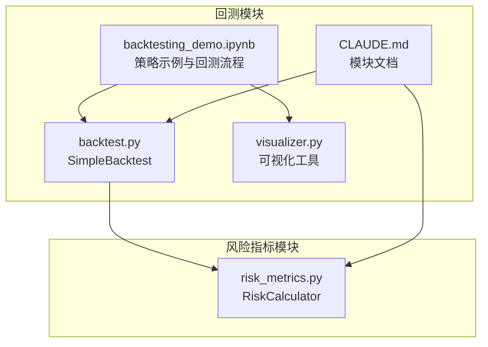
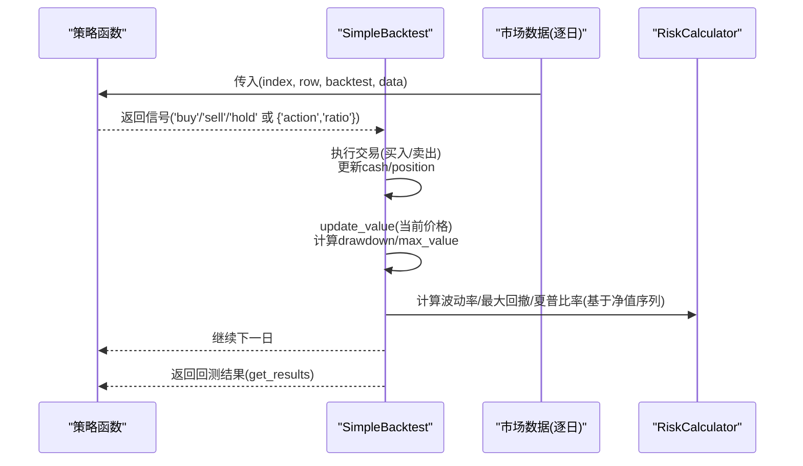
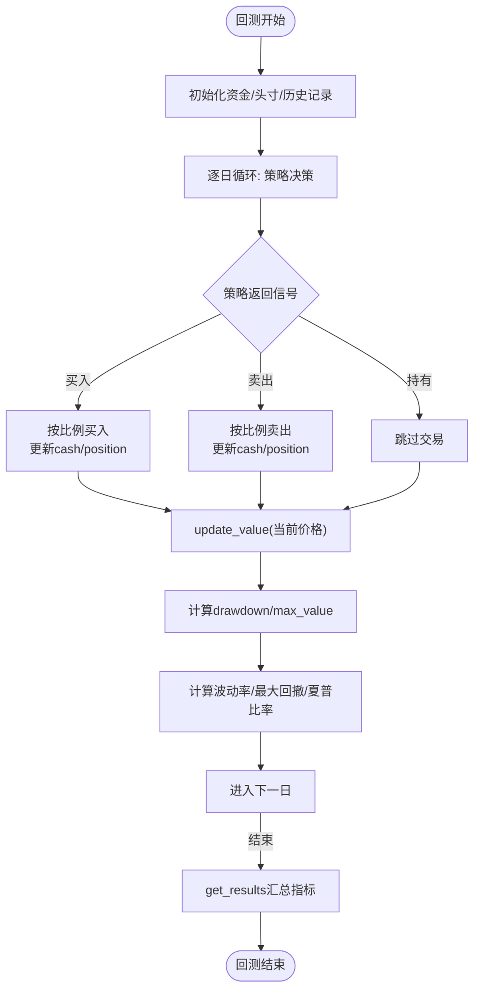
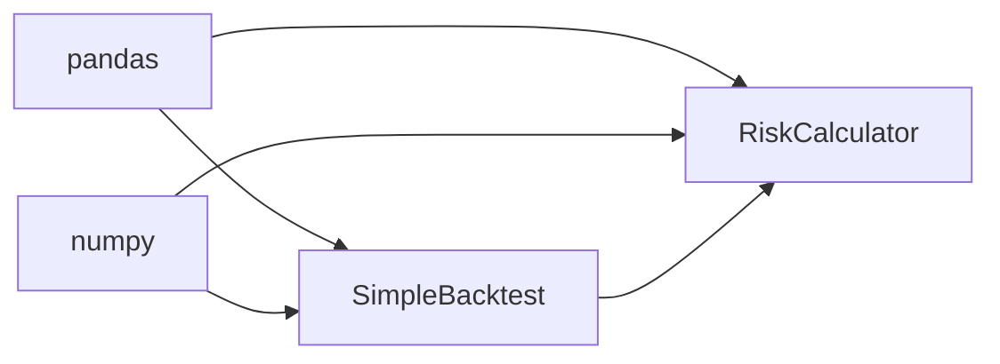

# 风险管理机制

<cite>
**本文引用的文件**
- [backtest.py](file://backtesting/backtest.py)
- [risk_metrics.py](file://utils/risk_metrics.py)
- [backtesting_demo.ipynb](file://backtesting/backtesting_demo.ipynb)
- [visualizer.py](file://backtesting/visualizer.py)
- [CLAUDE.md](file://backtesting/CLAUDE.md)
</cite>

## 目录
1. [引言](#引言)
2. [项目结构](#项目结构)
3. [核心组件](#核心组件)
4. [架构总览](#架构总览)
5. [详细组件分析](#详细组件分析)
6. [依赖关系分析](#依赖关系分析)
7. [性能考量](#性能考量)
8. [故障排查指南](#故障排查指南)
9. [结论](#结论)
10. [附录](#附录)

## 引言
本文件聚焦于回测过程中的风险管理机制，围绕以下目标展开：
- 解释 backtest.py 中如何集成单笔最大亏损限制、持仓集中度控制、每日最大回撤熔断等风控规则
- 结合 utils/risk_metrics.py 中的风险指标计算函数，说明波动率、最大回撤、夏普比率等指标在回测过程中的实时监控逻辑
- 描述当触发风控条件时系统的响应行为（如自动平仓、暂停交易或发出告警）
- 提供配置示例，展示如何在策略中启用不同级别的风控策略，并讨论其对回测结果真实性的影响
- 分析潜在误报场景并提出优化建议

## 项目结构
回测与风险管理相关的关键文件如下：
- backtesting/backtest.py：回测引擎，负责执行策略、记录交易、更新资产价值、计算回测指标
- utils/risk_metrics.py：风险指标计算模块，提供波动率、最大回撤、夏普比率等指标的计算与汇总
- backtesting/backtesting_demo.ipynb：演示如何加载数据、编写策略、运行回测并可视化结果
- backtesting/visualizer.py：回测结果可视化工具（用于展示资金曲线、回撤曲线等）
- backtesting/CLAUDE.md：模块文档，包含对外接口、数据模型与配置说明

**图表来源**
- [backtest.py](file://backtesting/backtest.py#L1-L207)
- [risk_metrics.py](file://utils/risk_metrics.py#L1-L230)
- [backtesting_demo.ipynb](file://backtesting/backtesting_demo.ipynb#L1-L502)
- [visualizer.py](file://backtesting/visualizer.py#L1-L200)
- [CLAUDE.md](file://backtesting/CLAUDE.md#L1-L204)

**章节来源**
- [backtest.py](file://backtesting/backtest.py#L1-L207)
- [risk_metrics.py](file://utils/risk_metrics.py#L1-L230)
- [backtesting_demo.ipynb](file://backtesting/backtesting_demo.ipynb#L1-L502)
- [visualizer.py](file://backtesting/visualizer.py#L1-L200)
- [CLAUDE.md](file://backtesting/CLAUDE.md#L1-L204)

## 核心组件
- 回测引擎 SimpleBacktest
  - 负责初始化资金、执行买入/卖出、更新总资产与历史记录、计算回测指标（最大回撤、夏普比率、胜率等）
  - 提供 run_backtest(data, strategy) 接口，按逐日数据驱动策略执行
- 风险指标计算器 RiskCalculator
  - 提供波动率、最大回撤、夏普比率、VaR/CVaR 等指标的计算与汇总
  - 支持按交易日折算年化波动率，支持无风险利率参数化

**章节来源**
- [backtest.py](file://backtesting/backtest.py#L11-L207)
- [risk_metrics.py](file://utils/risk_metrics.py#L10-L126)

## 架构总览
回测流程中，策略函数根据当日数据返回交易信号，回测引擎据此执行交易并更新资产价值。同时，回测引擎维护最大回撤与历史净值序列，用于后续指标计算与可视化。

**图表来源**
- [backtest.py](file://backtesting/backtest.py#L97-L189)
- [risk_metrics.py](file://utils/risk_metrics.py#L22-L81)

**章节来源**
- [backtest.py](file://backtesting/backtest.py#L97-L189)
- [risk_metrics.py](file://utils/risk_metrics.py#L22-L81)

## 详细组件分析

### 回测引擎 SimpleBacktest 风控集成现状与建议
- 单笔最大亏损限制
  - 现状：回测引擎未内置“单笔最大亏损”限制逻辑
  - 建议：在策略层或回测引擎中增加“单笔最大亏损”阈值检查，若下单后可能触发超过阈值的亏损，则拒绝下单或调整下单规模
- 持仓集中度控制
  - 现状：回测引擎未内置“单一标的/组合集中度”限制
  - 建议：在策略层返回信号时，对多头/空头头寸占总资产的比例进行约束；或在回测引擎中增加集中度监控与限制
- 每日最大回撤熔断
  - 现状：回测引擎维护了最大回撤与最大净值，但未在回测过程中基于“每日回撤”进行熔断
  - 建议：在 update_value 后，计算当日回撤或滚动窗口回撤，当超过阈值时暂停交易或自动平仓

上述建议均属于扩展性增强，可在策略函数内部或回测引擎中实现，以满足不同风险等级的需求。

**章节来源**
- [backtest.py](file://backtesting/backtest.py#L34-L96)
- [backtest.py](file://backtesting/backtest.py#L97-L139)

### 风险指标计算与实时监控逻辑
- 波动率（年化）
  - 由 RiskCalculator.annual_volatility 基于日收益率序列计算
  - 回测引擎在 get_results 中使用净值序列计算波动率，作为回测指标之一
- 最大回撤
  - 由 RiskCalculator.max_drawdown 基于日收益率序列计算
  - 回测引擎在 update_value 中维护 max_value 与当前净值，实时计算 drawdown 并更新 max_drawdown
- 夏普比率
  - 由 RiskCalculator.sharpe_ratio 基于日收益率序列与无风险利率计算
  - 回测引擎在 get_results 中使用净值序列计算日收益率并求夏普比率

**图表来源**
- [backtest.py](file://backtesting/backtest.py#L44-L96)
- [backtest.py](file://backtesting/backtest.py#L97-L189)
- [risk_metrics.py](file://utils/risk_metrics.py#L22-L81)

**章节来源**
- [backtest.py](file://backtesting/backtest.py#L75-L96)
- [backtest.py](file://backtesting/backtest.py#L140-L189)
- [risk_metrics.py](file://utils/risk_metrics.py#L22-L81)

### 策略与风控配置示例
- 在策略中启用风控策略
  - 单笔最大亏损限制：在策略函数中加入下单前检查，若下单后可能导致超过阈值的亏损则拒绝
  - 持仓集中度控制：在策略函数中计算当前头寸占总资产的比例，超过阈值则减少下单规模或放弃交易
  - 每日最大回撤熔断：在策略函数中读取回测引擎的历史净值，计算滚动回撤，超过阈值则暂停交易
- 配置示例（概念性说明）
  - 风险偏好与风控等级：可通过配置项在策略层选择“保守/中性/激进”，对应不同的风控阈值
  - 参数化：将阈值（如单笔最大亏损比例、集中度上限、熔断回撤阈值）作为策略参数传入

说明：以上为实现建议与配置思路，具体参数与阈值需在策略或回测引擎中落地。

**章节来源**
- [backtesting_demo.ipynb](file://backtesting/backtesting_demo.ipynb#L153-L261)
- [CLAUDE.md](file://backtesting/CLAUDE.md#L92-L101)

### 触发风控条件时的系统响应
- 现状：回测引擎未内置风控熔断逻辑，因此不会自动平仓或暂停交易
- 建议响应行为
  - 自动平仓：当触发集中度或单笔亏损限制时，策略或回测引擎可自动卖出部分或全部头寸
  - 暂停交易：当触发熔断（如滚动回撤超限）时，策略返回“持有”或“不交易”，直到条件恢复
  - 发出告警：在策略层记录风控触发事件，便于后续可视化与分析

**章节来源**
- [backtest.py](file://backtesting/backtest.py#L112-L135)
- [backtesting_demo.ipynb](file://backtesting/backtesting_demo.ipynb#L153-L261)

### 回测结果真实性与风控策略影响
- 风控策略对回测结果的影响
  - 严格风控可能降低交易频率与收益，但提升回测结果的稳健性
  - 过度保守可能导致错过趋势性机会，影响胜率与年化收益
- 建议
  - 将风控策略作为可配置开关，对比不同风控等级下的回测结果
  - 使用可视化工具观察风控触发频次与时机，评估对策略真实性的扰动

**章节来源**
- [visualizer.py](file://backtesting/visualizer.py#L1-L200)
- [backtesting_demo.ipynb](file://backtesting/backtesting_demo.ipynb#L345-L477)

## 依赖关系分析
- 回测引擎依赖
  - pandas/numpy：数据处理与数值计算
  - 策略函数：返回交易信号
- 风险指标模块依赖
  - pandas/numpy：收益率序列与统计计算
  - 回测引擎历史净值序列：用于指标计算

**图表来源**
- [backtest.py](file://backtesting/backtest.py#L1-L20)
- [risk_metrics.py](file://utils/risk_metrics.py#L1-L12)

**章节来源**
- [backtest.py](file://backtesting/backtest.py#L1-L20)
- [risk_metrics.py](file://utils/risk_metrics.py#L1-L12)

## 性能考量
- 指标计算复杂度
  - 波动率与夏普比率：O(n) 计算日收益率与统计量
  - 最大回撤：O(n) 计算累计收益与滚动最大值
- 回测性能
  - 策略函数应尽量避免在回测循环内进行昂贵的外部调用
  - 可将风控逻辑前置到策略层，减少回测引擎的分支判断

[本节为通用指导，无需特定文件来源]

## 故障排查指南
- 常见问题
  - 价格序列长度不足导致指标计算失败：检查数据预处理与缺失值处理
  - 策略未产生交易：确认策略信号生成逻辑与回测引擎交易执行逻辑
  - 回撤/波动率异常：检查是否正确使用净值序列或价格序列进行计算
- 建议
  - 在策略层输出风控触发日志，便于定位问题
  - 使用可视化工具对比资金曲线与回撤曲线，辅助诊断

**章节来源**
- [risk_metrics.py](file://utils/risk_metrics.py#L67-L81)
- [backtest.py](file://backtesting/backtest.py#L140-L189)
- [visualizer.py](file://backtesting/visualizer.py#L1-L200)

## 结论
- 回测引擎已具备最大回撤与净值序列的维护能力，但未内置单笔最大亏损、集中度与每日回撤熔断等风控规则
- 风险指标模块提供了波动率、最大回撤、夏普比率等关键指标的计算能力，可用于回测过程中的实时监控
- 建议在策略层或回测引擎中扩展风控规则，并通过可视化与日志进行验证与优化
- 不同风控等级对回测结果的真实性与稳健性具有显著影响，应通过对比实验进行评估

[本节为总结性内容，无需特定文件来源]

## 附录
- 回测与可视化使用示例可参考演示笔记本与模块文档
- 风险指标汇总与格式化展示可参考风险指标模块与数据格式化工具

**章节来源**
- [backtesting_demo.ipynb](file://backtesting/backtesting_demo.ipynb#L1-L502)
- [CLAUDE.md](file://backtesting/CLAUDE.md#L1-L204)