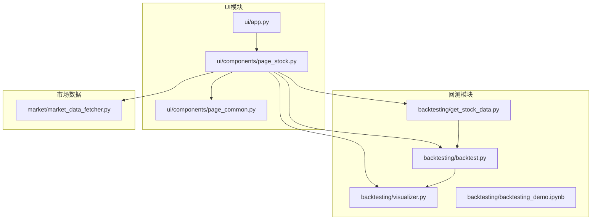
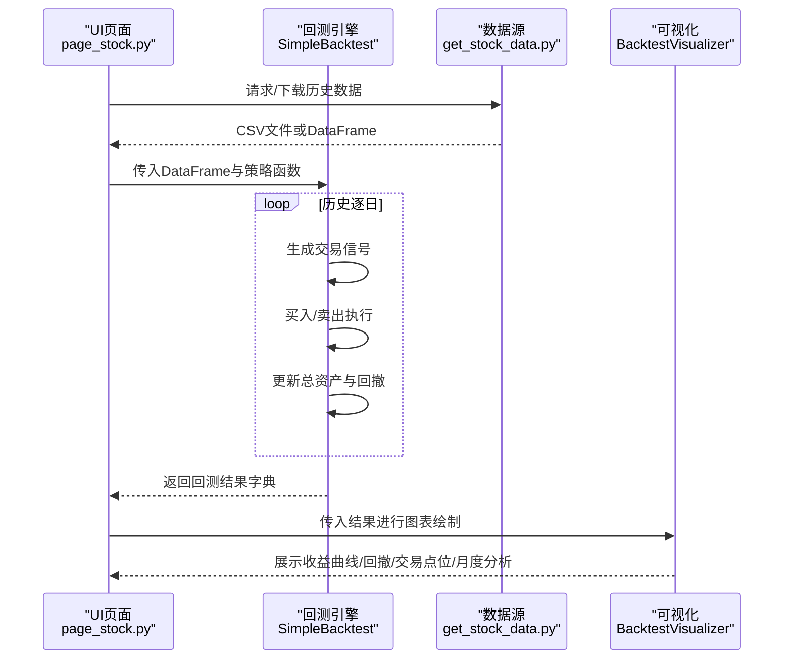
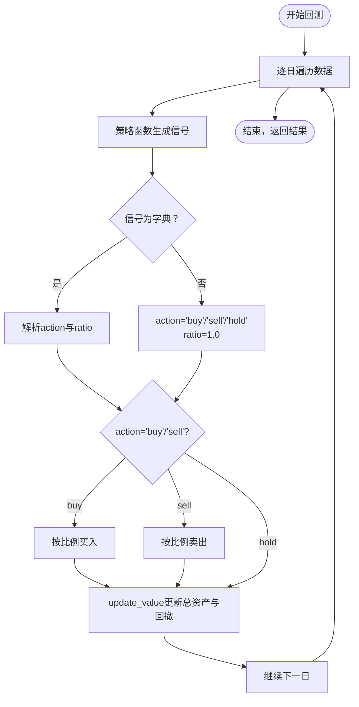
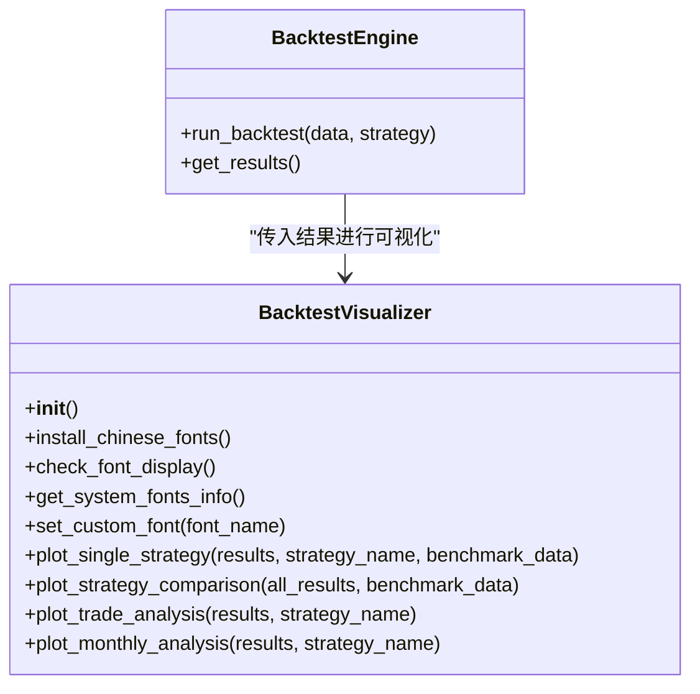
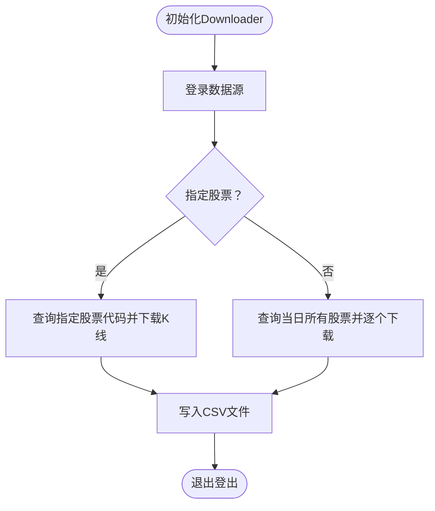
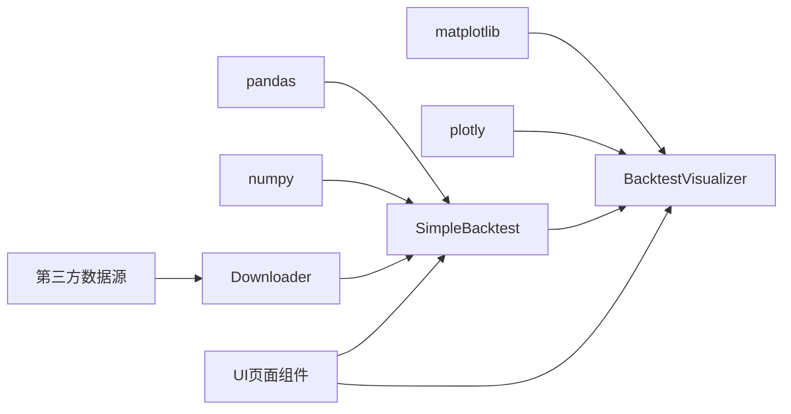

# 策略回测

<cite>
**本文引用的文件**
- [backtest.py](file://backtesting/backtest.py)
- [visualizer.py](file://backtesting/visualizer.py)
- [get_stock_data.py](file://backtesting/get_stock_data.py)
- [backtesting_demo.ipynb](file://backtesting/backtesting_demo.ipynb)
- [app.py](file://ui/app.py)
- [page_stock.py](file://ui/components/page_stock.py)
- [page_common.py](file://ui/components/page_common.py)
- [market_data_fetcher.py](file://market/market_data_fetcher.py)
</cite>

## 目录
1. [引言](#引言)
2. [项目结构](#项目结构)
3. [核心组件](#核心组件)
4. [架构总览](#架构总览)
5. [详细组件分析](#详细组件分析)
6. [依赖关系分析](#依赖关系分析)
7. [性能考虑](#性能考虑)
8. [故障排查指南](#故障排查指南)
9. [结论](#结论)
10. [附录](#附录)

## 引言
本文件面向xystock项目中的量化策略回测功能，系统性阐述回测引擎、可视化组件、数据获取与UI集成方式，并提供完整回测示例、关键问题与优化建议。目标读者既包括开发者，也包括希望理解回测工作流与结果解读的使用者。

## 项目结构
回测相关的核心代码集中在backtesting模块，配合UI模块在Web界面中提供策略配置与结果展示；数据获取由get_stock_data.py负责，也可结合市场模块提供的数据工具；回测演示以Jupyter笔记本backtesting_demo.ipynb呈现。

**图表来源**
- [backtest.py](file://backtesting/backtest.py#L1-L207)
- [visualizer.py](file://backtesting/visualizer.py#L1-L726)
- [get_stock_data.py](file://backtesting/get_stock_data.py#L1-L79)
- [backtesting_demo.ipynb](file://backtesting/backtesting_demo.ipynb#L1-L502)
- [app.py](file://ui/app.py#L1-L229)
- [page_stock.py](file://ui/components/page_stock.py#L1-L884)
- [page_common.py](file://ui/components/page_common.py#L1-L291)
- [market_data_fetcher.py](file://market/market_data_fetcher.py#L1-L607)

**章节来源**
- [backtest.py](file://backtesting/backtest.py#L1-L207)
- [visualizer.py](file://backtesting/visualizer.py#L1-L726)
- [get_stock_data.py](file://backtesting/get_stock_data.py#L1-L79)
- [backtesting_demo.ipynb](file://backtesting/backtesting_demo.ipynb#L1-L502)
- [app.py](file://ui/app.py#L1-L229)
- [page_stock.py](file://ui/components/page_stock.py#L1-L884)
- [page_common.py](file://ui/components/page_common.py#L1-L291)
- [market_data_fetcher.py](file://market/market_data_fetcher.py#L1-L607)

## 核心组件
- 回测引擎SimpleBacktest：提供买入/卖出、资产更新、回测循环与结果统计。
- 可视化BacktestVisualizer：提供资产曲线、回撤、收益分布、交易点位、月度分析等图表。
- 数据获取Downloader：基于第三方库下载历史K线数据，输出CSV供回测使用。
- Jupyter演示backtesting_demo.ipynb：包含策略定义、数据准备、回测执行与结果分析的完整示例。

**章节来源**
- [backtest.py](file://backtesting/backtest.py#L1-L207)
- [visualizer.py](file://backtesting/visualizer.py#L1-L726)
- [get_stock_data.py](file://backtesting/get_stock_data.py#L1-L79)
- [backtesting_demo.ipynb](file://backtesting/backtesting_demo.ipynb#L1-L502)

## 架构总览
回测流程从数据准备开始，策略函数根据历史数据生成交易信号，回测引擎据此执行买卖并记录历史与交易明细，最后由可视化模块输出多维度图表。UI层通过页面组件调用回测与可视化模块，实现Web端策略配置与结果展示。

**图表来源**
- [page_stock.py](file://ui/components/page_stock.py#L1-L884)
- [backtest.py](file://backtesting/backtest.py#L97-L138)
- [visualizer.py](file://backtesting/visualizer.py#L272-L441)
- [get_stock_data.py](file://backtesting/get_stock_data.py#L40-L65)

## 详细组件分析

### 回测引擎 SimpleBacktest
- 职责：管理初始资金、现金、持仓与总资产；按策略信号执行买卖；记录历史与交易；计算总收益、年化收益、最大回撤、夏普比率、胜率等指标。
- 关键流程：
  - run_backtest：遍历数据，调用策略函数获取信号，按信号与比例下单，更新资产与回撤，记录历史。
  - buy/sell：校验资金/持仓后执行交易，记录交易明细。
  - update_value：计算总资产、更新最大值与回撤率。
  - get_results：汇总历史、交易、指标并返回字典。
  - print_summary：打印关键指标摘要。
- 设计要点：
  - 支持字符串信号('buy'/'sell'/'hold')与字典信号({'action','ratio'})两种格式。
  - 比例下单：ratio默认1.0，按可用资金/可用持仓计算下单数量。
  - 回撤计算：以总资产相对于最大值的回撤率记录。

**图表来源**
- [backtest.py](file://backtesting/backtest.py#L97-L138)
- [backtest.py](file://backtesting/backtest.py#L44-L73)
- [backtest.py](file://backtesting/backtest.py#L75-L96)
- [backtest.py](file://backtesting/backtest.py#L140-L189)

**章节来源**
- [backtest.py](file://backtesting/backtest.py#L1-L207)

### 可视化 BacktestVisualizer
- 职责：提供中文字体检测与安装、字体配置、多类图表绘制与分析。
- 主要图表：
  - 单策略分析：资产曲线、回撤曲线、收益分布、持仓变化。
  - 策略对比：资产曲线对比、回撤对比、总收益对比柱状图、风险收益散点图。
  - 交易分析：价格与交易点位、月度交易频率、持仓时间分布、单笔盈亏。
  - 月度分析：月度收益、累计收益曲线、收益分布、胜率饼图。
- 辅助能力：字体检测与安装、系统字体信息获取、自定义字体设置、便捷函数封装。

**图表来源**
- [visualizer.py](file://backtesting/visualizer.py#L1-L726)
- [backtest.py](file://backtesting/backtest.py#L97-L189)

**章节来源**
- [visualizer.py](file://backtesting/visualizer.py#L1-L726)

### 数据获取 get_stock_data.Downloader
- 职责：登录第三方数据源，按起止日期与股票代码下载历史K线数据，输出CSV文件。
- 关键点：
  - 支持指定股票或全量下载。
  - 输出目录可配置，文件命名包含股票代码与名称。
  - 提供命令行入口，便于离线准备数据。

**图表来源**
- [get_stock_data.py](file://backtesting/get_stock_data.py#L14-L65)

**章节来源**
- [get_stock_data.py](file://backtesting/get_stock_data.py#L1-L79)

### 回测演示 notebook backtesting_demo.ipynb
- 内容概览：字体配置检查、数据下载、数据读取与预处理、多种策略函数定义（均线交叉、动量、RSI模拟、突破、价格阈值）、回测执行、结果汇总与可视化、交易统计与月度分析。
- 使用建议：作为策略开发与验证的起点，便于快速迭代策略与观察结果。

**章节来源**
- [backtesting_demo.ipynb](file://backtesting/backtesting_demo.ipynb#L1-L502)

## 依赖关系分析
- 回测引擎依赖pandas/numpy进行数据处理与统计。
- 可视化模块依赖matplotlib/plotly进行图表绘制，并集成中文字体处理。
- 数据获取依赖第三方库下载历史数据。
- UI层通过页面组件调用回测与可视化模块，实现Web端交互。

**图表来源**
- [backtest.py](file://backtesting/backtest.py#L1-L207)
- [visualizer.py](file://backtesting/visualizer.py#L1-L726)
- [get_stock_data.py](file://backtesting/get_stock_data.py#L1-L79)
- [page_stock.py](file://ui/components/page_stock.py#L1-L884)

**章节来源**
- [backtest.py](file://backtesting/backtest.py#L1-L207)
- [visualizer.py](file://backtesting/visualizer.py#L1-L726)
- [get_stock_data.py](file://backtesting/get_stock_data.py#L1-L79)
- [page_stock.py](file://ui/components/page_stock.py#L1-L884)

## 性能考虑
- 数据加载优化
  - 使用缓存：UI层与市场模块提供缓存机制，减少重复网络请求。
  - 分批回测：对长时间序列分段回测，降低内存峰值。
  - 数据预处理：提前计算均线、涨跌幅等指标，避免在回测循环内重复计算。
- 回测执行优化
  - 向量化：尽量使用pandas/numpy向量化操作替代逐行循环。
  - 信号合并：将多信号整合为单一决策，减少交易频率。
- 可视化优化
  - 按需渲染：仅在用户切换到对应Tab时渲染图表。
  - 图表压缩：对大量点位进行抽样或聚合，降低渲染压力。

[本节为通用指导，无需特定文件来源]

## 故障排查指南
- 字体显示问题
  - 使用BacktestVisualizer的字体检测与安装函数，自动识别可用中文字体并配置matplotlib。
  - 若系统缺少中文字体，可按提示安装并刷新字体缓存。
- 数据下载失败
  - 检查网络连通性与第三方数据源可用性。
  - 确认输出目录权限与路径正确。
- 回测无交易
  - 检查策略函数是否返回有效信号，注意初始期均线/技术指标缺失导致的hold。
  - 确保DataFrame包含必要列（date/close/open/high/low/volume等）。
- 结果异常
  - 检查回测期间是否出现异常行情（如停牌、涨跌停），必要时剔除或填充。
  - 确认回测起止日期与数据范围一致。

**章节来源**
- [visualizer.py](file://backtesting/visualizer.py#L122-L186)
- [visualizer.py](file://backtesting/visualizer.py#L619-L662)
- [get_stock_data.py](file://backtesting/get_stock_data.py#L66-L79)
- [backtest.py](file://backtesting/backtest.py#L97-L138)

## 结论
xystock的回测体系以SimpleBacktest为核心，结合BacktestVisualizer提供丰富的可视化能力，并通过get_stock_data实现历史数据获取。UI层通过页面组件将回测与可视化无缝集成到Web界面，便于用户配置策略、执行回测与分析结果。建议在实际应用中完善滑点与手续费模拟、扩展更多策略类型，并持续优化数据与回测性能。

[本节为总结，无需特定文件来源]

## 附录

### 完整策略回测示例（步骤说明）
- 准备数据
  - 使用Downloader下载目标股票的历史K线数据，或在notebook中按示例下载。
- 定义策略
  - 在策略函数中读取当前行与历史数据，返回字符串或字典信号。
- 执行回测
  - 创建SimpleBacktest实例，调用run_backtest传入数据与策略函数。
- 结果分析
  - 调用get_results获取指标与历史/交易明细，使用BacktestVisualizer绘制图表。
- 可视化展示
  - 在UI页面中调用可视化函数，展示收益曲线、回撤、交易点位与月度分析。

**章节来源**
- [backtesting_demo.ipynb](file://backtesting/backtesting_demo.ipynb#L1-L502)
- [backtest.py](file://backtesting/backtest.py#L97-L189)
- [visualizer.py](file://backtesting/visualizer.py#L272-L441)

### 回测引擎与UI组件的集成方式
- UI页面组件
  - page_stock.py：在股票分析页面中调用回测与可视化模块，展示K线、技术指标与风险分析。
  - page_common.py：提供统一的K线与技术指标展示组件，供页面组合使用。
- 启动与导航
  - app.py：定义Web应用入口与菜单，用户可在不同页面间切换。
- 市场数据支持
  - market_data_fetcher.py：提供指数与市场数据获取与缓存，辅助回测与分析。

**章节来源**
- [page_stock.py](file://ui/components/page_stock.py#L1-L884)
- [page_common.py](file://ui/components/page_common.py#L1-L291)
- [app.py](file://ui/app.py#L1-L229)
- [market_data_fetcher.py](file://market/market_data_fetcher.py#L1-L607)

### 关键问题与建议
- 数据清洗
  - 处理缺失值、异常值与停牌期，确保回测期间价格连续性。
- 滑点与手续费
  - 当前回测引擎未内置滑点与手续费模拟，建议在策略函数中加入模拟逻辑或扩展回测引擎以支持这些参数。
- 过拟合风险
  - 使用样本外数据验证、交叉验证、参数扫描与随机游走对照，避免过度优化。
- 扩展策略类型
  - 引入多标的组合、动态仓位、止损止盈、趋势过滤等机制，提升策略鲁棒性。

[本节为通用指导，无需特定文件来源]