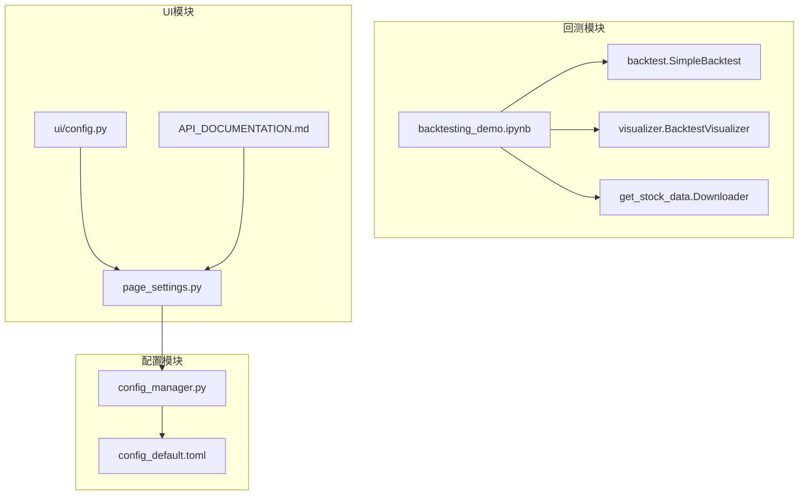
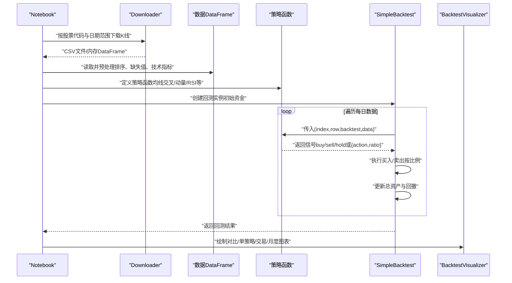
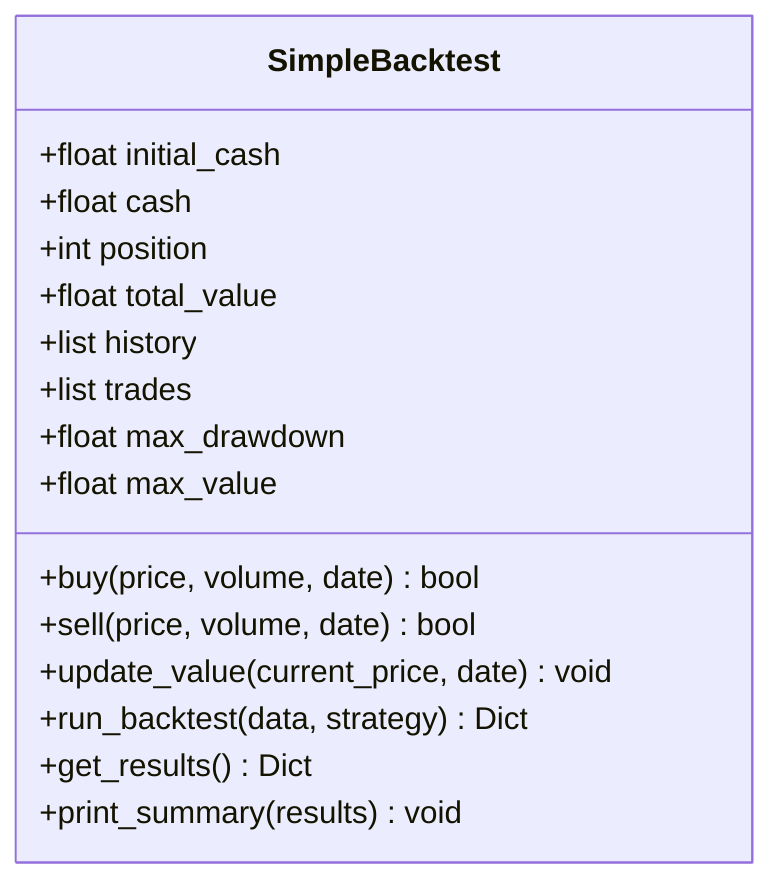
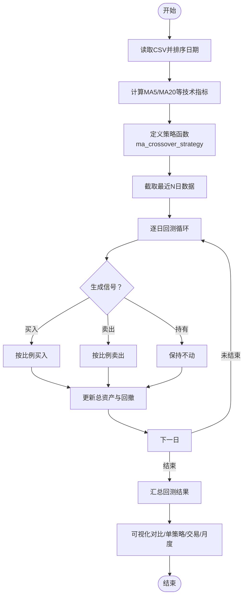
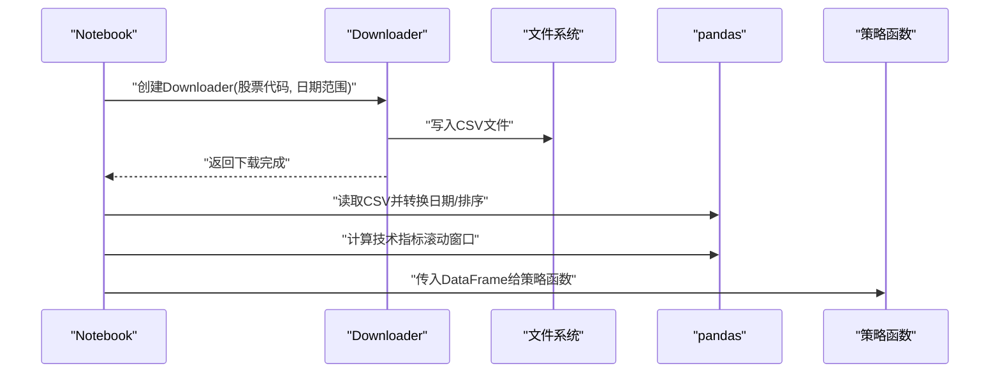
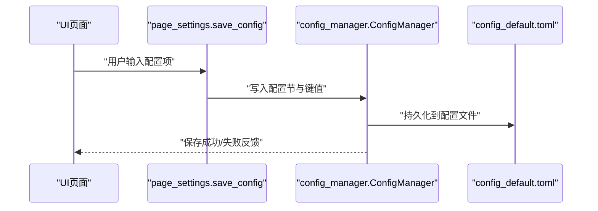
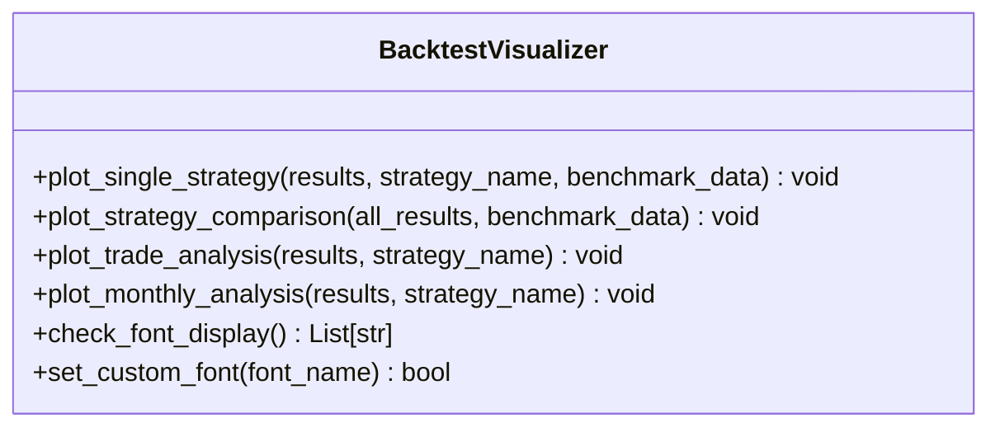
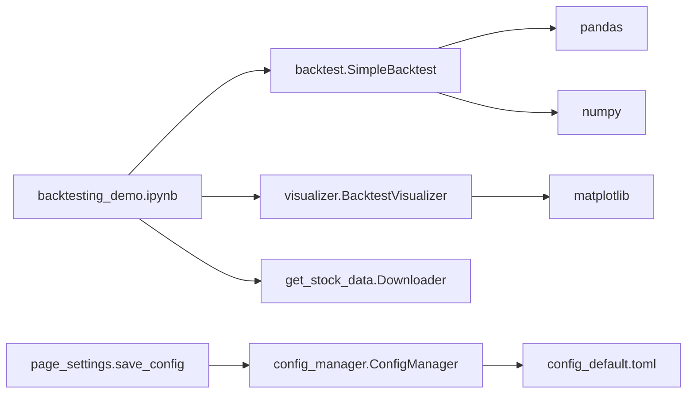

# 策略配置

<cite>
**本文引用的文件**
- [backtest.py](file://backtesting/backtest.py)
- [backtesting_demo.ipynb](file://backtesting/backtesting_demo.ipynb)
- [visualizer.py](file://backtesting/visualizer.py)
- [get_stock_data.py](file://backtesting/get_stock_data.py)
- [CLAUDE.md](file://backtesting/CLAUDE.md)
- [__init__.py](file://backtesting/__init__.py)
- [config_default.toml](file://config_default.toml)
- [config_manager.py](file://config_manager.py)
- [page_settings.py](file://ui/components/page_settings.py)
- [config.py](file://ui/config.py)
- [API_DOCUMENTATION.md](file://ui/components/API_DOCUMENTATION.md)
</cite>

## 目录
1. [简介](#简介)
2. [项目结构](#项目结构)
3. [核心组件](#核心组件)
4. [架构总览](#架构总览)
5. [详细组件分析](#详细组件分析)
6. [依赖关系分析](#依赖关系分析)
7. [性能考量](#性能考量)
8. [故障排查指南](#故障排查指南)
9. [结论](#结论)
10. [附录](#附录)

## 简介
本文件围绕 xystock 量化策略的配置机制展开，重点说明：
- 如何在 backtest.py 中定义策略类与回测引擎 SimpleBacktest；
- 策略参数（如均线周期、止损止盈阈值）的外部化配置方式（通过 UI 或配置文件传入）；
- 结合 backtesting_demo.ipynb 展示“双均线交叉”策略的完整定义与运行流程；
- get_stock_data.py 如何根据策略时间范围与股票代码加载适配的历史 K 线数据，并进行数据预处理（缺失值填充、复权处理思路）；
- 策略与数据源的绑定流程，以及如何支持多股票、多周期回测；
- 常见配置错误的排查方法（如数据频率不匹配、参数越界等），并给出最佳实践建议。

## 项目结构
backtesting 模块提供了回测框架、可视化与示例 Notebook；UI 模块提供配置入口；config 模块提供配置管理与默认配置。

**图表来源**
- [backtest.py](file://backtesting/backtest.py#L1-L207)
- [backtesting_demo.ipynb](file://backtesting/backtesting_demo.ipynb#L1-L502)
- [visualizer.py](file://backtesting/visualizer.py#L1-L726)
- [get_stock_data.py](file://backtesting/get_stock_data.py#L1-L79)
- [page_settings.py](file://ui/components/page_settings.py#L183-L215)
- [config_default.toml](file://config_default.toml#L1-L64)
- [config_manager.py](file://config_manager.py#L125-L143)
- [config.py](file://ui/config.py#L1-L82)
- [API_DOCUMENTATION.md](file://ui/components/API_DOCUMENTATION.md#L347-L466)

**章节来源**
- [backtest.py](file://backtesting/backtest.py#L1-L207)
- [backtesting_demo.ipynb](file://backtesting/backtesting_demo.ipynb#L1-L502)
- [visualizer.py](file://backtesting/visualizer.py#L1-L726)
- [get_stock_data.py](file://backtesting/get_stock_data.py#L1-L79)
- [config_default.toml](file://config_default.toml#L1-L64)
- [config_manager.py](file://config_manager.py#L125-L143)
- [page_settings.py](file://ui/components/page_settings.py#L183-L215)
- [config.py](file://ui/config.py#L1-L82)
- [API_DOCUMENTATION.md](file://ui/components/API_DOCUMENTATION.md#L347-L466)

## 核心组件
- SimpleBacktest：回测引擎，负责资金管理、交易执行、历史记录与指标计算。
- 策略函数：接收(index, row, backtest, data)四元组，返回字符串或字典形式的交易信号；字典可包含 action 与 ratio。
- 可视化模块：提供策略对比、单策略分析、交易细节、月度表现等图表。
- 数据下载器：基于第三方库批量下载股票历史 K 线数据，支持按股票代码与日期范围筛选。
- 配置管理：提供默认配置与运行时配置读取，UI 页面支持保存配置项。

**章节来源**
- [backtest.py](file://backtesting/backtest.py#L1-L207)
- [visualizer.py](file://backtesting/visualizer.py#L1-L726)
- [get_stock_data.py](file://backtesting/get_stock_data.py#L1-L79)
- [config_default.toml](file://config_default.toml#L1-L64)
- [config_manager.py](file://config_manager.py#L125-L143)

## 架构总览
下图展示了策略、数据与回测引擎之间的交互关系，以及可视化与配置的参与环节。

**图表来源**
- [backtesting_demo.ipynb](file://backtesting/backtesting_demo.ipynb#L1-L502)
- [backtest.py](file://backtesting/backtest.py#L97-L139)
- [visualizer.py](file://backtesting/visualizer.py#L272-L441)
- [get_stock_data.py](file://backtesting/get_stock_data.py#L40-L65)

## 详细组件分析

### 回测引擎与策略函数
- SimpleBacktest 提供 buy/sell/update_value/reset 等核心方法，支持按比例下单（ratio）与全仓下单。
- run_backtest 逐日迭代，调用策略函数生成信号，依据信号执行交易并更新资产曲线与回撤。
- get_results 计算总收益、年化收益、最大回撤、夏普比率、胜率等指标，并返回历史与交易明细 DataFrame。

**图表来源**
- [backtest.py](file://backtesting/backtest.py#L1-L207)

**章节来源**
- [backtest.py](file://backtesting/backtest.py#L1-L207)

### 双均线交叉策略（来自示例 Notebook）
- 示例 Notebook 展示了“均线交叉策略”的完整定义与运行流程：
  - 读取 CSV 历史数据，转换日期列并按日期排序；
  - 计算 MA5、MA20 等技术指标；
  - 定义 ma_crossover_strategy：当日 MA5 上穿 MA20 且无持仓则买入；MA5 下穿 MA20 且有持仓则卖出；
  - 选择最近 N 日数据进行回测，调用 SimpleBacktest.run_backtest 执行策略；
  - 使用可视化模块绘制对比图表与单策略分析。

**图表来源**
- [backtesting_demo.ipynb](file://backtesting/backtesting_demo.ipynb#L120-L343)
- [backtest.py](file://backtesting/backtest.py#L97-L139)
- [visualizer.py](file://backtesting/visualizer.py#L272-L441)

**章节来源**
- [backtesting_demo.ipynb](file://backtesting/backtesting_demo.ipynb#L120-L343)

### 数据加载与预处理
- get_stock_data.Downloader 支持按股票代码下载历史 K 线，字段包含日期、开盘、最高、最低、收盘、成交量等；
- Notebook 中演示了对下载数据的预处理：日期转换、排序、计算日涨跌幅与移动平均线；
- Notebook 中还展示了“突破策略”与“价格阈值策略”，体现策略对数据预处理的依赖。

**图表来源**
- [get_stock_data.py](file://backtesting/get_stock_data.py#L40-L65)
- [backtesting_demo.ipynb](file://backtesting/backtesting_demo.ipynb#L120-L170)

**章节来源**
- [get_stock_data.py](file://backtesting/get_stock_data.py#L1-L79)
- [backtesting_demo.ipynb](file://backtesting/backtesting_demo.ipynb#L120-L203)

### 策略参数外部化配置
- UI 页面支持保存配置项，如 LLM_OPENAI、LLM_CACHE、ANALYSIS、USER_PROFILE 等；
- 配置项通过 save_config 写入配置文件，UI 组件文档中明确列出各配置节与键名；
- 配置管理器提供读取与重载能力，便于在运行时调整参数。

**图表来源**
- [page_settings.py](file://ui/components/page_settings.py#L183-L215)
- [API_DOCUMENTATION.md](file://ui/components/API_DOCUMENTATION.md#L347-L466)
- [config_manager.py](file://config_manager.py#L125-L143)
- [config_default.toml](file://config_default.toml#L1-L64)

**章节来源**
- [page_settings.py](file://ui/components/page_settings.py#L183-L215)
- [API_DOCUMENTATION.md](file://ui/components/API_DOCUMENTATION.md#L347-L466)
- [config_manager.py](file://config_manager.py#L125-L143)
- [config_default.toml](file://config_default.toml#L1-L64)

### 可视化与结果呈现
- BacktestVisualizer 提供多种图表：资产曲线、回撤曲线、收益分布、持仓变化、策略对比、风险收益散点、交易点位、月度收益等；
- 支持基准线对比（如买入持有）与中文显示配置；
- 提供便捷函数 plot_backtest_results、plot_single_strategy_analysis、plot_trade_details、plot_monthly_performance。

**图表来源**
- [visualizer.py](file://backtesting/visualizer.py#L272-L441)
- [visualizer.py](file://backtesting/visualizer.py#L442-L618)

**章节来源**
- [visualizer.py](file://backtesting/visualizer.py#L1-L726)

### 多股票、多周期回测支持
- Notebook 中演示了对不同策略在同一数据集上的对比回测；
- 通过将策略函数注册到字典并循环执行，即可实现多策略对比；
- 多股票可通过循环不同股票代码与数据文件，结合策略函数实现多股票回测；
- 多周期可通过切换技术指标窗口（如 MA5/MA20）或不同数据粒度（日线/周线）实现。

**章节来源**
- [backtesting_demo.ipynb](file://backtesting/backtesting_demo.ipynb#L300-L343)

## 依赖关系分析
- backtesting 模块对外依赖 pandas/numpy/matplotlib；
- 可视化模块依赖 matplotlib/font_manager；
- 数据下载依赖第三方库（示例中使用 baostock）；
- UI 配置依赖配置管理器与默认配置文件；
- Notebook 作为示例入口，串联数据下载、策略定义与回测执行。

**图表来源**
- [backtesting_demo.ipynb](file://backtesting/backtesting_demo.ipynb#L1-L502)
- [backtest.py](file://backtesting/backtest.py#L1-L207)
- [visualizer.py](file://backtesting/visualizer.py#L1-L726)
- [get_stock_data.py](file://backtesting/get_stock_data.py#L1-L79)
- [config_manager.py](file://config_manager.py#L125-L143)
- [config_default.toml](file://config_default.toml#L1-L64)
- [page_settings.py](file://ui/components/page_settings.py#L183-L215)

**章节来源**
- [backtesting_demo.ipynb](file://backtesting/backtesting_demo.ipynb#L1-L502)
- [backtest.py](file://backtesting/backtest.py#L1-L207)
- [visualizer.py](file://backtesting/visualizer.py#L1-L726)
- [get_stock_data.py](file://backtesting/get_stock_data.py#L1-L79)
- [config_manager.py](file://config_manager.py#L125-L143)
- [config_default.toml](file://config_default.toml#L1-L64)
- [page_settings.py](file://ui/components/page_settings.py#L183-L215)

## 性能考量
- 回测循环复杂度与数据长度线性相关，建议：
  - 控制回测数据长度（如只回测最近 N 个交易日）；
  - 合理设置技术指标窗口，避免过长窗口导致大量 NaN；
  - 使用向量化计算（如 pandas rolling）提升效率；
  - 对策略函数进行边界判断与早退优化（如不足历史时不交易）。
- 可视化阶段尽量延迟到回测完成后，避免在回测循环内频繁绘图。

[本节为通用指导，无需特定文件引用]

## 故障排查指南
- 数据频率不匹配
  - 症状：策略在早期出现大量“持有”信号，或技术指标列存在大量 NaN；
  - 排查：确认数据已按日期排序、技术指标窗口大于等于数据长度；
  - 解决：在策略函数中增加对 index 与 NaN 的判断，确保至少需要 N 日历史后再交易。
- 参数越界
  - 症状：下单失败或下单数量为 0；
  - 排查：检查 ratio 是否在合理范围（0~1），以及 cash/position 是否满足下单条件；
  - 解决：在策略函数中对 ratio 进行裁剪，并在下单前检查可购买/可卖出数量。
- 数据缺失与异常
  - 症状：回测期间出现 NaN 或异常波动；
  - 排查：检查数据清洗步骤（缺失值填充、异常值处理）；
  - 解决：在数据预处理阶段对缺失值进行填充或剔除，确保技术指标列无 NaN。
- 配置错误
  - 症状：UI 保存失败或配置未生效；
  - 排查：确认配置节与键名正确，检查配置文件权限；
  - 解决：通过 page_settings.save_config 逐项保存，必要时重启应用使配置生效。

**章节来源**
- [backtest.py](file://backtesting/backtest.py#L97-L139)
- [backtesting_demo.ipynb](file://backtesting/backtesting_demo.ipynb#L120-L203)
- [page_settings.py](file://ui/components/page_settings.py#L183-L215)

## 结论
- xystock 的回测体系以 SimpleBacktest 为核心，策略通过函数接口与回测引擎解耦，便于扩展与对比；
- 数据加载与预处理在 Notebook 中清晰演示，策略对技术指标与时间序列的依赖明确；
- UI 提供配置入口，配合配置管理器实现参数的外部化与持久化；
- 可视化模块覆盖策略对比与细节分析，帮助快速定位问题与优化方向；
- 多股票、多周期回测可通过策略注册与数据循环实现，具备良好的扩展性。

[本节为总结，无需特定文件引用]

## 附录
- 回测参数配置（示例）：初始资金、手续费、滑点、仓位限制等；
- UI 配置项结构：OpenAI API、缓存、分析偏好、用户画像等；
- 常用函数与接口：策略函数签名、回测执行、可视化便捷函数。

**章节来源**
- [CLAUDE.md](file://backtesting/CLAUDE.md#L69-L144)
- [API_DOCUMENTATION.md](file://ui/components/API_DOCUMENTATION.md#L347-L466)
- [config_default.toml](file://config_default.toml#L1-L64)