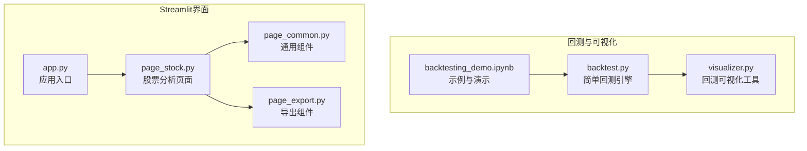
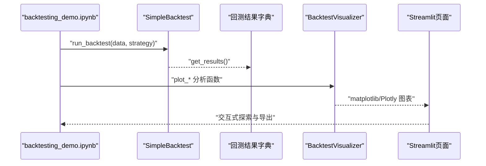
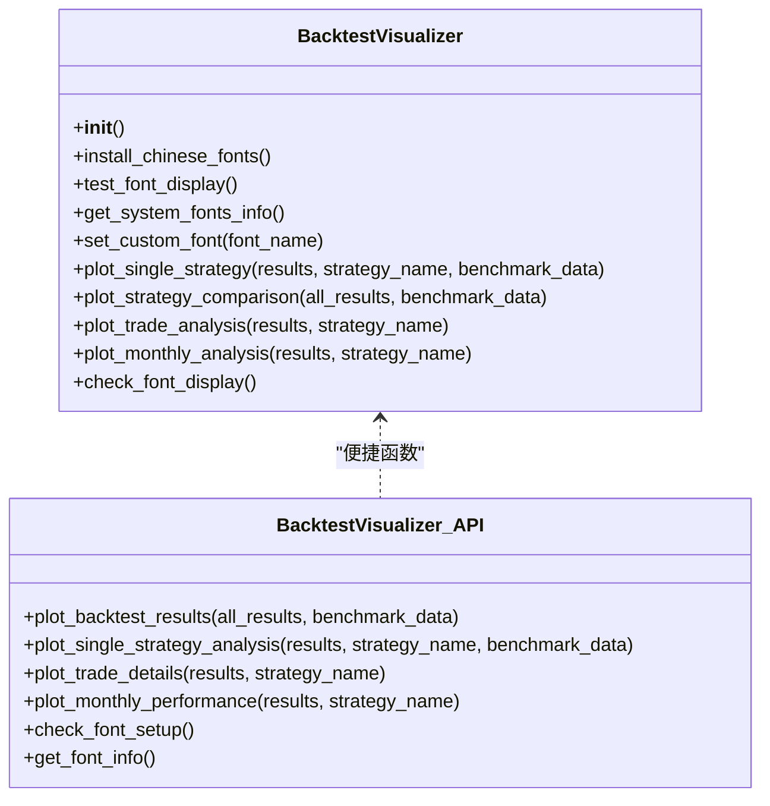
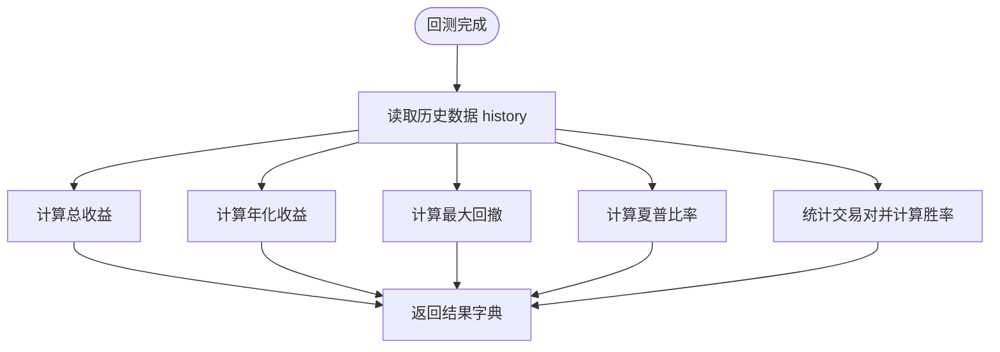
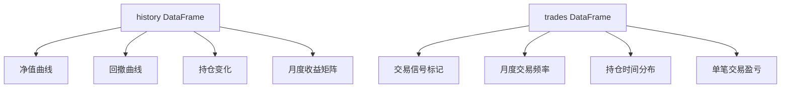
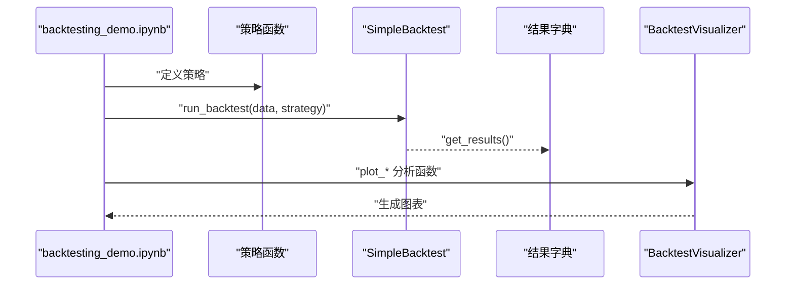
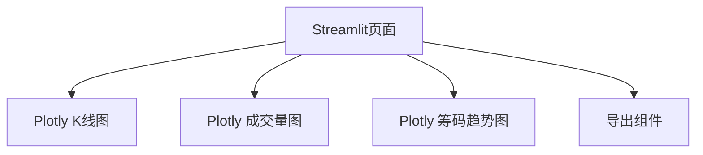
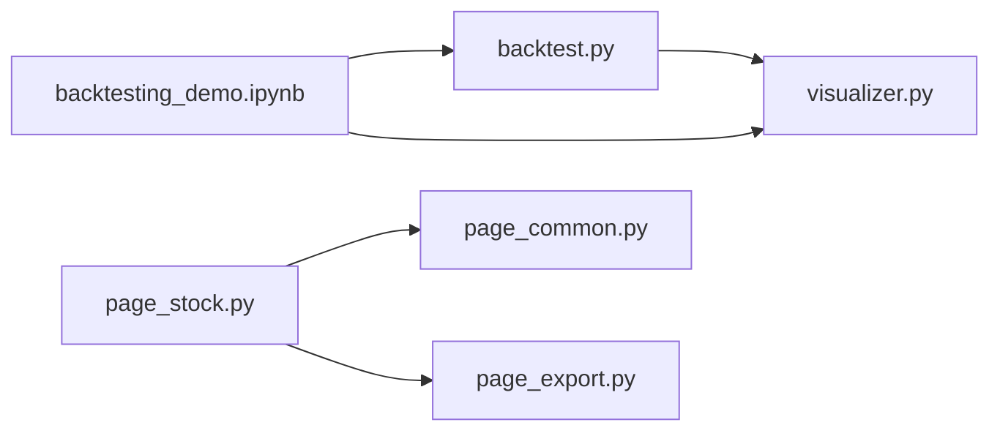

# 结果可视化

<cite>
**本文引用的文件**
- [visualizer.py](file://backtesting/visualizer.py)
- [backtest.py](file://backtesting/backtest.py)
- [backtesting_demo.ipynb](file://backtesting/backtesting_demo.ipynb)
- [page_stock.py](file://ui/components/page_stock.py)
- [page_common.py](file://ui/components/page_common.py)
- [page_export.py](file://ui/components/page_export.py)
- [app.py](file://ui/app.py)
</cite>

## 目录
1. [简介](#简介)
2. [项目结构](#项目结构)
3. [核心组件](#核心组件)
4. [架构总览](#架构总览)
5. [详细组件分析](#详细组件分析)
6. [依赖关系分析](#依赖关系分析)
7. [性能考量](#性能考量)
8. [故障排查指南](#故障排查指南)
9. [结论](#结论)
10. [附录](#附录)

## 简介
本章节聚焦于xystock项目中“回测结果可视化”的能力，系统性说明visualizer.py如何基于matplotlib与Plotly生成多维度分析图表；如何从backtest.py的Analyzer模块提取关键绩效指标（如夏普比率、最大回撤、胜率、盈亏比等），并将其格式化为结构化报告；如何设计可复用的绘图组件以灵活组合不同图表；结合backtesting_demo.ipynb示例讲解如何自定义可视化样式与添加注释；以及如何将可视化结果嵌入Streamlit界面，实现交互式探索（缩放、悬停提示等）。最后提供常见可视化问题的解决方案与导出PDF/图片报告的最佳实践。

## 项目结构
围绕回测与可视化的相关文件组织如下：
- backtesting/visualizer.py：回测结果可视化工具类与便捷函数，提供资产净值曲线、基准对比、交易信号标记、持仓分布、月度收益矩阵等多维图表。
- backtesting/backtest.py：简单回测引擎，负责策略执行、交易记录与历史轨迹维护，并计算关键绩效指标（总收益、年化收益、最大回撤、夏普比率、胜率等）。
- backtesting/backtesting_demo.ipynb：演示如何加载数据、定义策略、运行回测并将结果传入可视化模块进行分析。
- ui/components/page_stock.py：在Streamlit中展示股票分析页面，包含技术分析、筹码分析等，其中使用Plotly进行交互式K线与成交量展示。
- ui/components/page_common.py：通用组件，封装Plotly图表展示（K线、均线、成交量）与技术指标卡片。
- ui/components/page_export.py：导出组件，统一管理报告导出流程（PDF/Word/Markdown/HTML）。
- ui/app.py：Streamlit应用入口，负责页面路由与交互控制。

**图表来源**
- [visualizer.py](file://backtesting/visualizer.py#L1-L726)
- [backtest.py](file://backtesting/backtest.py#L1-L207)
- [backtesting_demo.ipynb](file://backtesting/backtesting_demo.ipynb#L1-L502)
- [page_stock.py](file://ui/components/page_stock.py#L1-L884)
- [page_common.py](file://ui/components/page_common.py#L1-L291)
- [page_export.py](file://ui/components/page_export.py#L1-L457)
- [app.py](file://ui/app.py#L1-L229)

**章节来源**
- [visualizer.py](file://backtesting/visualizer.py#L1-L726)
- [backtest.py](file://backtesting/backtest.py#L1-L207)
- [backtesting_demo.ipynb](file://backtesting/backtesting_demo.ipynb#L1-L502)
- [page_stock.py](file://ui/components/page_stock.py#L1-L884)
- [page_common.py](file://ui/components/page_common.py#L1-L291)
- [page_export.py](file://ui/components/page_export.py#L1-L457)
- [app.py](file://ui/app.py#L1-L229)

## 核心组件
- 回测可视化工具类BacktestVisualizer：提供字体配置、策略对比、单策略分析、交易分析、月度分析等图表绘制方法；并提供便捷函数plot_backtest_results、plot_single_strategy_analysis、plot_trade_details、plot_monthly_performance等。
- 简单回测引擎SimpleBacktest：负责策略执行、交易记录、历史轨迹维护，并计算关键绩效指标（总收益、年化收益、最大回撤、夏普比率、胜率等）。
- Streamlit可视化组件：page_common.py中的display_kline_charts使用Plotly展示K线与成交量；page_stock.py中展示筹码分析趋势图；page_export.py提供导出能力。

**章节来源**
- [visualizer.py](file://backtesting/visualizer.py#L1-L726)
- [backtest.py](file://backtesting/backtest.py#L1-L207)
- [page_common.py](file://ui/components/page_common.py#L192-L291)
- [page_stock.py](file://ui/components/page_stock.py#L704-L760)
- [page_export.py](file://ui/components/page_export.py#L1-L457)

## 架构总览
回测结果可视化从数据到图表的端到端流程如下：
- 数据与策略：backtesting_demo.ipynb加载数据、定义策略，调用SimpleBacktest.run_backtest执行回测，得到包含history与trades的结果字典。
- 关键指标：SimpleBacktest.get_results计算总收益、年化收益、最大回撤、夏普比率、胜率等指标。
- 可视化：visualizer.py接收结果字典，绘制资产净值曲线、基准对比、回撤曲线、收益分布、交易信号标记、持仓变化、月度收益矩阵等。
- Streamlit集成：page_stock.py与page_common.py使用Plotly展示交互式K线与成交量；page_export.py提供导出能力。

**图表来源**
- [backtesting_demo.ipynb](file://backtesting/backtesting_demo.ipynb#L345-L477)
- [backtest.py](file://backtesting/backtest.py#L97-L190)
- [visualizer.py](file://backtesting/visualizer.py#L272-L726)
- [page_common.py](file://ui/components/page_common.py#L192-L291)
- [page_stock.py](file://ui/components/page_stock.py#L704-L760)

## 详细组件分析

### BacktestVisualizer：可复用的可视化组件设计
BacktestVisualizer提供以下核心能力：
- 字体配置与检测：自动检测系统可用中文字体，设置matplotlib字体，支持Linux自动安装中文字体与字体测试。
- 单策略分析：绘制资产净值曲线（含基准对比）、回撤曲线、日收益分布、持仓变化。
- 策略对比：绘制多策略资产净值对比、回撤对比、总收益率对比柱状图、风险收益散点图。
- 交易分析：价格与交易点位标记、月度交易频率、持仓时间分布、单笔交易盈亏。
- 月度分析：月度收益率柱状图、累计收益率曲线、月度收益分布、月度胜率饼图。
- 便捷函数：plot_backtest_results、plot_single_strategy_analysis、plot_trade_details、plot_monthly_performance。

**图表来源**
- [visualizer.py](file://backtesting/visualizer.py#L1-L726)

**章节来源**
- [visualizer.py](file://backtesting/visualizer.py#L1-L726)

### SimpleBacktest：关键绩效指标提取
SimpleBacktest在回测完成后通过get_results计算以下指标：
- 总收益：(最终资产 - 初始资金) / 初始资金
- 年化收益：基于交易日数推算年化复合收益
- 最大回撤：跟踪历史最大资产与当前资产的回撤率
- 夏普比率：日收益均值/标准差×sqrt(250)，假设250个交易日
- 胜率：按配对交易（买入-卖出）计算盈利交易比例

**图表来源**
- [backtest.py](file://backtesting/backtest.py#L140-L190)

**章节来源**
- [backtest.py](file://backtesting/backtest.py#L140-L190)

### 可视化图表清单与数据来源
- 资产净值曲线与基准对比：来自history['total_value']与基准（买入持有）价格序列。
- 回撤曲线：来自history['drawdown']。
- 日收益分布：来自total_value的百分比变化直方图。
- 持仓变化：来自history['position']。
- 月度收益矩阵：基于history按月聚合计算首尾净值，得到月度收益率、累计收益、分布与胜率统计。
- 交易信号标记：在价格曲线上标注买入/卖出点位，依据trades中日期匹配。
- 交易频率与持仓时间：按月统计交易次数、计算每笔交易持有天数分布。
- 盈亏分析：按配对交易计算单笔收益率并以柱状图展示。

**图表来源**
- [visualizer.py](file://backtesting/visualizer.py#L272-L726)

**章节来源**
- [visualizer.py](file://backtesting/visualizer.py#L272-L726)

### 示例：backtesting_demo.ipynb中的策略与可视化
- 数据准备：下载/读取CSV，计算均线与涨跌幅，构造策略函数（均线交叉、突破、价格阈值等）。
- 回测执行：遍历策略，调用SimpleBacktest.run_backtest，收集结果字典。
- 可视化：调用plot_backtest_results进行策略对比；调用plot_single_strategy_analysis、plot_trade_details、plot_monthly_performance进行深入分析。
- 自定义样式与注释：可在notebook中调整图表标题、颜色、布局，或在visualizer.py中扩展绘图参数以满足个性化需求。

**图表来源**
- [backtesting_demo.ipynb](file://backtesting/backtesting_demo.ipynb#L299-L477)
- [visualizer.py](file://backtesting/visualizer.py#L668-L726)
- [backtest.py](file://backtesting/backtest.py#L97-L190)

**章节来源**
- [backtesting_demo.ipynb](file://backtesting/backtesting_demo.ipynb#L299-L477)

### Streamlit集成与交互式探索
- K线与成交量：page_common.py的display_kline_charts使用Plotly Candlestick与Bar，支持交互式缩放与悬停提示。
- 筹码分析趋势：page_stock.py中使用Plotly绘制获利比例与平均成本随时间的趋势图。
- 报告导出：page_export.py提供PDF/Word/Markdown/HTML导出流程，统一管理生成、下载与历史记录。

**图表来源**
- [page_common.py](file://ui/components/page_common.py#L192-L291)
- [page_stock.py](file://ui/components/page_stock.py#L704-L760)
- [page_export.py](file://ui/components/page_export.py#L1-L457)

**章节来源**
- [page_common.py](file://ui/components/page_common.py#L192-L291)
- [page_stock.py](file://ui/components/page_stock.py#L704-L760)
- [page_export.py](file://ui/components/page_export.py#L1-L457)

## 依赖关系分析
- backtest.py与visualizer.py：visualizer.py消费backtest.py产生的结果字典（history、trades、指标等）。
- backtesting_demo.ipynb：作为演示入口，串联数据、策略、回测与可视化。
- Streamlit组件：page_stock.py与page_common.py依赖Plotly进行交互式图表展示；page_export.py提供导出能力。

**图表来源**
- [backtesting_demo.ipynb](file://backtesting/backtesting_demo.ipynb#L1-L502)
- [backtest.py](file://backtesting/backtest.py#L1-L207)
- [visualizer.py](file://backtesting/visualizer.py#L1-L726)
- [page_stock.py](file://ui/components/page_stock.py#L1-L884)
- [page_common.py](file://ui/components/page_common.py#L1-L291)
- [page_export.py](file://ui/components/page_export.py#L1-L457)

**章节来源**
- [backtesting_demo.ipynb](file://backtesting/backtesting_demo.ipynb#L1-L502)
- [backtest.py](file://backtesting/backtest.py#L1-L207)
- [visualizer.py](file://backtesting/visualizer.py#L1-L726)
- [page_stock.py](file://ui/components/page_stock.py#L1-L884)
- [page_common.py](file://ui/components/page_common.py#L1-L291)
- [page_export.py](file://ui/components/page_export.py#L1-L457)

## 性能考量
- 图表渲染性能：matplotlib在大量数据点时渲染较慢，建议：
  - 对历史数据进行采样或分段渲染；
  - 合理设置子图数量与尺寸，避免过多subplot；
  - 使用交互式Plotly替代静态matplotlib进行大规模数据展示。
- 字体与渲染：字体检测与缓存刷新可能带来额外开销，建议在应用启动时一次性完成字体配置。
- 导出性能：PDF导出依赖外部库，生成时间较长，建议：
  - 在后台任务中异步生成；
  - 提供进度提示与取消机制；
  - 对大体量报告进行分页或拆分导出。

[本节为通用指导，无需特定文件引用]

## 故障排查指南
- 中文乱码与字体显示异常：
  - 使用visualizer.check_font_setup()与visualizer.get_font_info()检查当前字体配置；
  - 若未检测到中文字体，可调用install_chinese_fonts()在Linux环境下自动安装常用中文字体；
  - 也可通过set_custom_font()指定可用字体。
- 图表渲染缓慢：
  - 减少数据点数量或分批渲染；
  - 使用Plotly进行交互式图表以提升交互体验；
  - 避免在循环中频繁创建Figure对象。
- 导出失败：
  - 检查page_export.py的格式支持情况（PDF/Word/Markdown/HTML）；
  - 确认生成函数返回的内容类型与MIME类型一致；
  - 查看导出历史记录以定位问题。

**章节来源**
- [visualizer.py](file://backtesting/visualizer.py#L619-L726)
- [page_export.py](file://ui/components/page_export.py#L1-L457)

## 结论
xystock的回测结果可视化体系以BacktestVisualizer为核心，结合SimpleBacktest的关键指标计算，能够生成覆盖资产曲线、基准对比、交易信号、持仓分布、月度收益矩阵等多维度图表。通过Streamlit组件，用户可以在Web界面中进行交互式探索，并借助导出组件生成PDF/Word/Markdown/HTML报告。针对性能与字体问题，提供了完善的检测、安装与优化方案，便于在生产环境中稳定运行。

[本节为总结性内容，无需特定文件引用]

## 附录

### 关键接口与数据结构参考
- 回测结果字典字段（来自SimpleBacktest.get_results）：
  - initial_cash：初始资金
  - final_value：最终资产
  - total_return：总收益率
  - annual_return：年化收益率
  - max_drawdown：最大回撤
  - sharpe_ratio：夏普比率
  - total_trades：交易次数
  - win_rate：胜率
  - history：历史轨迹DataFrame（包含date、cash、position、current_price、total_value、drawdown）
  - trades：交易记录DataFrame（包含date、action、price、volume、cost/revenue）

**章节来源**
- [backtest.py](file://backtesting/backtest.py#L140-L190)

### 可视化图表清单（对应函数）
- 单策略分析：plot_single_strategy_analysis → 资产净值曲线、回撤曲线、日收益分布、持仓变化
- 策略对比：plot_backtest_results → 资产净值对比、回撤对比、总收益率对比、风险收益散点图
- 交易分析：plot_trade_details → 价格与交易点位、月度交易频率、持仓时间分布、单笔交易盈亏
- 月度分析：plot_monthly_performance → 月度收益率、累计收益率、月度收益分布、月度胜率

**章节来源**
- [visualizer.py](file://backtesting/visualizer.py#L272-L726)

### Streamlit页面与导出流程
- 页面入口：app.py负责路由与侧边栏菜单。
- 股票分析页面：page_stock.py整合技术分析、筹码分析与导出组件。
- 通用组件：page_common.py提供Plotly图表展示与技术指标卡片。
- 导出组件：page_export.py统一管理格式选择、生成、下载与历史记录。

**章节来源**
- [app.py](file://ui/app.py#L1-L229)
- [page_stock.py](file://ui/components/page_stock.py#L1-L884)
- [page_common.py](file://ui/components/page_common.py#L1-L291)
- [page_export.py](file://ui/components/page_export.py#L1-L457)