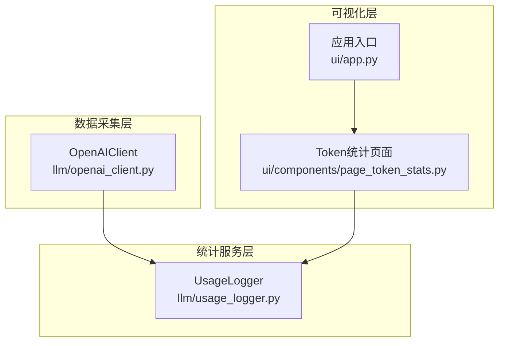
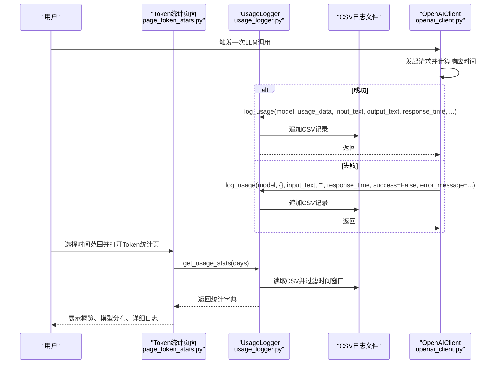
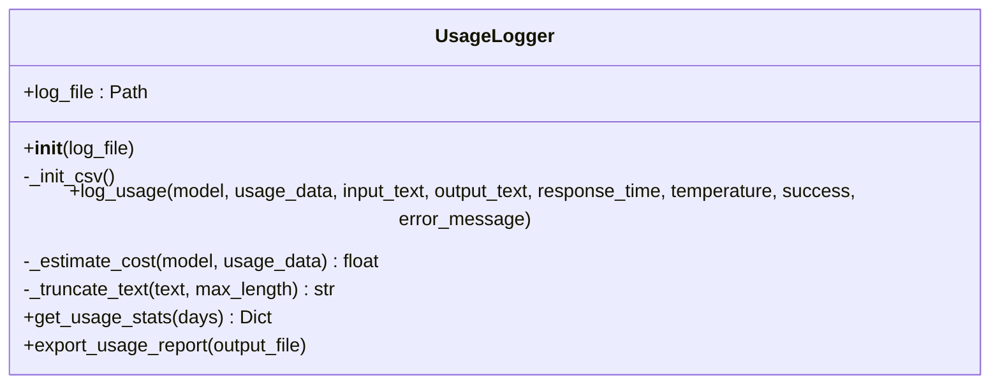
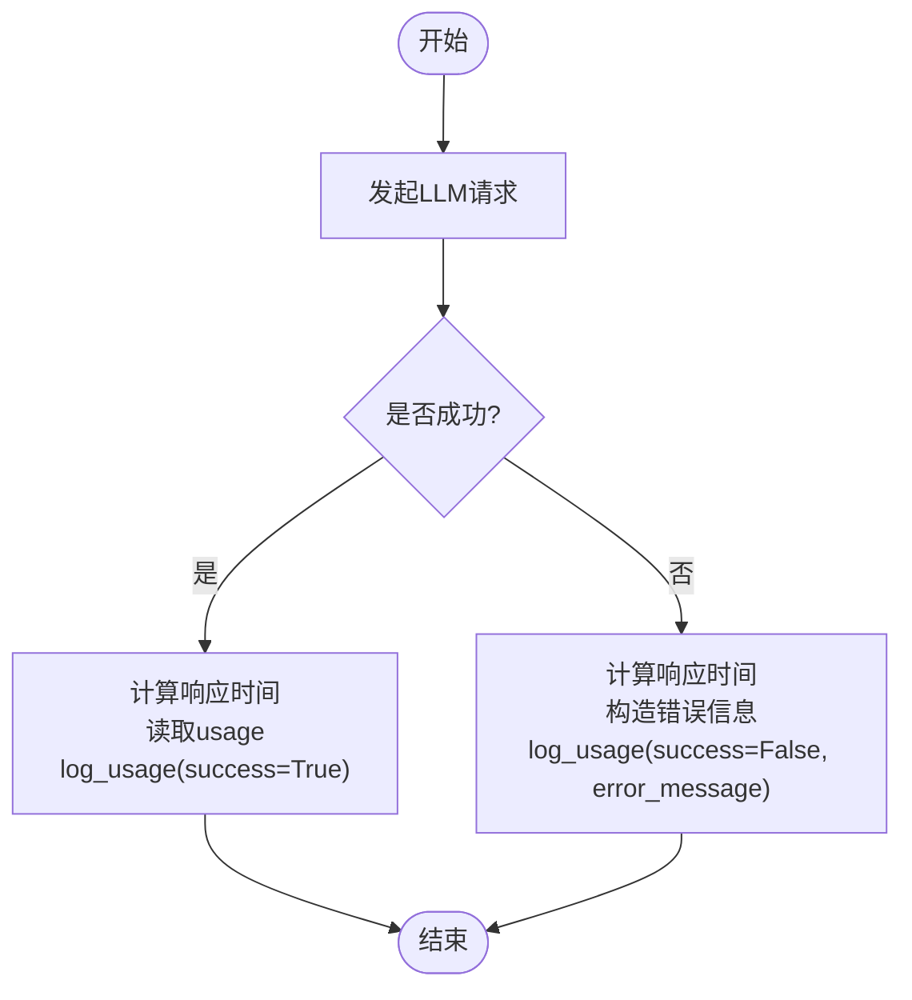
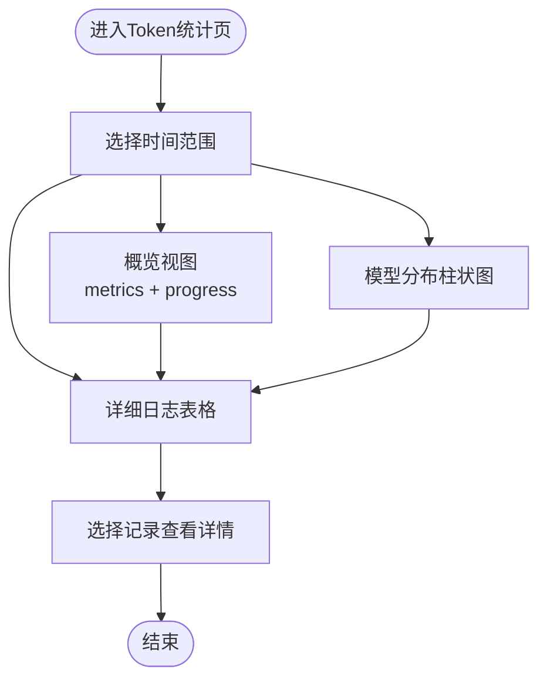
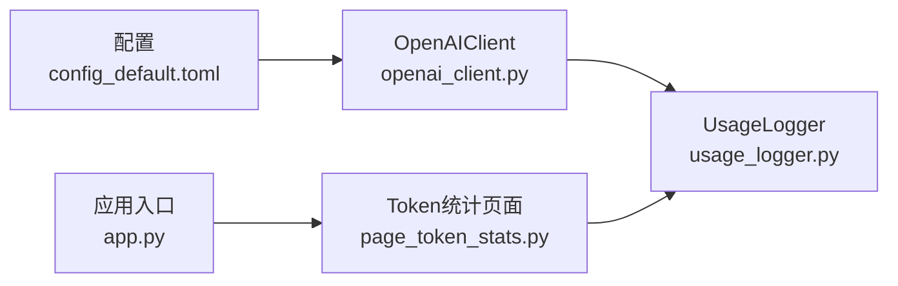

# Token统计

<cite>
**本文引用的文件**
- [usage_logger.py](file://llm/usage_logger.py)
- [openai_client.py](file://llm/openai_client.py)
- [page_token_stats.py](file://ui/components/page_token_stats.py)
- [app.py](file://ui/app.py)
- [config_default.toml](file://config_default.toml)
- [README.md](file://README.md)
</cite>

## 目录
1. [简介](#简介)
2. [项目结构](#项目结构)
3. [核心组件](#核心组件)
4. [架构总览](#架构总览)
5. [详细组件分析](#详细组件分析)
6. [依赖关系分析](#依赖关系分析)
7. [性能考量](#性能考量)
8. [故障排查指南](#故障排查指南)
9. [结论](#结论)
10. [附录](#附录)

## 简介
本章节面向使用者与开发者，系统性介绍 xystock 的 Token 统计能力，涵盖如何通过 UsageLogger 记录 LLM 调用的详细信息（请求时间、模型名称、输入/输出 Token 数、响应时间、成功率与成本估算），并通过 UI 页面以概览、分布与明细三类视图进行可视化呈现。同时提供时间范围选择（7天、30天、90天、所有时间）的操作示例，以及常见问题排查与维护建议（日志文件位置、大小与保留策略）。

## 项目结构
Token 统计功能由三层组成：
- 数据采集层：OpenAIClient 在每次调用后调用 UsageLogger 记录使用情况。
- 统计服务层：UsageLogger 提供 CSV 文件读写、成本估算、统计聚合与报告导出。
- 可视化层：UI 页面通过 Streamlit 展示概览指标、模型分布柱状图与详细日志。

图表来源
- [openai_client.py](file://llm/openai_client.py#L141-L194)
- [usage_logger.py](file://llm/usage_logger.py#L45-L124)
- [page_token_stats.py](file://ui/components/page_token_stats.py#L157-L188)
- [app.py](file://ui/app.py#L57-L79)

章节来源
- [openai_client.py](file://llm/openai_client.py#L141-L194)
- [usage_logger.py](file://llm/usage_logger.py#L13-L44)
- [page_token_stats.py](file://ui/components/page_token_stats.py#L157-L188)
- [app.py](file://ui/app.py#L57-L79)

## 核心组件
- UsageLogger：负责 CSV 日志文件的初始化、记录写入、成本估算、统计聚合与报告导出。
- OpenAIClient：在成功与失败两种路径上，调用 UsageLogger 记录请求详情。
- UI 页面 page_token_stats：提供概览、模型分布与详细日志三类视图，并支持时间范围切换。

章节来源
- [usage_logger.py](file://llm/usage_logger.py#L13-L44)
- [openai_client.py](file://llm/openai_client.py#L141-L194)
- [page_token_stats.py](file://ui/components/page_token_stats.py#L157-L188)

## 架构总览
下图展示了从 LLM 调用到统计展示的完整流程。

图表来源
- [openai_client.py](file://llm/openai_client.py#L141-L194)
- [usage_logger.py](file://llm/usage_logger.py#L45-L124)
- [usage_logger.py](file://llm/usage_logger.py#L125-L163)
- [page_token_stats.py](file://ui/components/page_token_stats.py#L157-L188)

## 详细组件分析

### UsageLogger：记录与统计
- 初始化与CSV结构
  - 自动创建日志目录与CSV表头，字段包含时间戳、模型、Prompt/Completion/Total Token、成本估算、温度、输入/输出文本、响应时间、成功标志与错误信息。
- 记录写入
  - 在 log_usage 中估算成本并写入 CSV，同时对长文本进行截断以节省空间。
- 成本估算
  - 基于内置的模型定价表估算输入与输出成本之和。
- 统计聚合
  - get_usage_stats 支持按天数过滤，返回总请求数、总Token、总成本、平均响应时间、成功率、模型分布与每日Token汇总。
- 报告导出
  - export_usage_report 将统计与明细导出为 HTML 报告。

图表来源
- [usage_logger.py](file://llm/usage_logger.py#L13-L44)
- [usage_logger.py](file://llm/usage_logger.py#L45-L124)
- [usage_logger.py](file://llm/usage_logger.py#L125-L163)
- [usage_logger.py](file://llm/usage_logger.py#L164-L204)

章节来源
- [usage_logger.py](file://llm/usage_logger.py#L13-L44)
- [usage_logger.py](file://llm/usage_logger.py#L45-L124)
- [usage_logger.py](file://llm/usage_logger.py#L125-L163)
- [usage_logger.py](file://llm/usage_logger.py#L164-L204)

### OpenAIClient：调用记录触发点
- 成功路径
  - 解析响应中的 usage 信息，调用 UsageLogger.log_usage 并标记 success=True。
- 失败路径
  - 捕获异常，计算响应时间，调用 UsageLogger.log_usage 并标记 success=False 与 error_message。
- 日志文件路径
  - 优先使用配置中的 USAGE_LOG_FILE，若为相对路径则拼接项目根目录。

图表来源
- [openai_client.py](file://llm/openai_client.py#L141-L194)

章节来源
- [openai_client.py](file://llm/openai_client.py#L141-L194)

### UI 页面：概览、分布与明细
- 概览视图
  - 通过 get_usage_stats 获取总请求数、总Token、平均响应时间与成功率，并以 metric 与 progress 组件展示。
- 模型分布
  - 读取模型分布字典，使用 Altair 绘制柱状图；同时提供可展开的数据框查看。
- 详细日志
  - 读取 CSV，按时间倒序排序，展示关键字段；支持选择记录查看输入/输出文本详情与错误信息。
- 时间范围
  - 支持“过去7天”、“过去30天”、“过去90天”、“所有时间”四档选择。

图表来源
- [page_token_stats.py](file://ui/components/page_token_stats.py#L157-L188)
- [page_token_stats.py](file://ui/components/page_token_stats.py#L26-L53)
- [page_token_stats.py](file://ui/components/page_token_stats.py#L54-L83)
- [page_token_stats.py](file://ui/components/page_token_stats.py#L84-L156)

章节来源
- [page_token_stats.py](file://ui/components/page_token_stats.py#L26-L53)
- [page_token_stats.py](file://ui/components/page_token_stats.py#L54-L83)
- [page_token_stats.py](file://ui/components/page_token_stats.py#L84-L156)
- [page_token_stats.py](file://ui/components/page_token_stats.py#L157-L188)

## 依赖关系分析
- OpenAIClient 依赖 UsageLogger，并在配置开启时根据配置决定日志文件路径。
- UI 页面依赖 UsageLogger 的统计接口与日志文件路径。
- 应用入口将“Token统计”菜单项与 UI 页面关联。

图表来源
- [config_default.toml](file://config_default.toml#L13-L18)
- [openai_client.py](file://llm/openai_client.py#L55-L64)
- [page_token_stats.py](file://ui/components/page_token_stats.py#L157-L188)
- [app.py](file://ui/app.py#L57-L79)

章节来源
- [config_default.toml](file://config_default.toml#L13-L18)
- [openai_client.py](file://llm/openai_client.py#L55-L64)
- [page_token_stats.py](file://ui/components/page_token_stats.py#L157-L188)
- [app.py](file://ui/app.py#L57-L79)

## 性能考量
- CSV读写与过滤
  - get_usage_stats 会对 CSV 进行全量读取并按时间过滤，时间窗口越大、数据越多，读取与转换开销越高。建议合理设置统计时间范围与日志保留周期。
- 文本截断
  - 输入/输出文本在记录时会被截断，避免日志文件过大，有助于提升读写性能与存储效率。
- 成本估算
  - 成本估算基于内置定价表，若模型不在表中则返回 0，不会影响统计聚合，但可能造成总成本低估。

章节来源
- [usage_logger.py](file://llm/usage_logger.py#L125-L163)
- [usage_logger.py](file://llm/usage_logger.py#L119-L124)

## 故障排查指南
- 日志文件加载失败
  - 现象：概览或明细页面提示“暂无使用数据”或报错。
  - 排查要点：
    - 确认日志文件是否存在且可读（默认路径为 data/logs/openai_usage.csv，可通过配置修改）。
    - 若为相对路径，确认拼接项目根目录后的绝对路径正确。
    - 检查是否有权限读取该文件。
- CSV解析错误
  - 现象：读取 CSV 时报错或无法渲染明细表格。
  - 排查要点：
    - 确认 CSV 列头与数据一致，未被外部程序修改。
    - 检查时间戳列是否为标准 ISO 时间格式。
- 统计数据显示异常
  - 现象：总Token、平均响应时间或成功率与预期不符。
  - 排查要点：
    - 确认所选时间范围是否正确。
    - 检查是否存在大量失败请求导致成功率偏低。
    - 确认成本估算仅对已识别模型生效，其他模型成本为 0。
- UI 无法显示 Token 统计
  - 现象：侧边栏存在“Token统计”，但点击后无反应或空白。
  - 排查要点：
    - 确认 UI 应用入口已将“Token统计”菜单项与页面函数关联。
    - 检查网络与端口配置，确保 Streamlit 服务正常运行。

章节来源
- [page_token_stats.py](file://ui/components/page_token_stats.py#L84-L156)
- [usage_logger.py](file://llm/usage_logger.py#L125-L163)
- [app.py](file://ui/app.py#L57-L79)

## 结论
xystock 的 Token 统计体系以 UsageLogger 为核心，结合 OpenAIClient 的调用记录与 UI 页面的可视化展示，实现了从数据采集、统计聚合到结果呈现的闭环。通过合理的时间范围选择与日志管理策略，可在保证可观测性的同时兼顾性能与成本控制。

## 附录

### 实际操作示例：选择时间范围查看统计
- 打开应用后，在侧边栏选择“Token统计”。
- 在页面顶部选择“过去7天”、“过去30天”、“过去90天”或“所有时间”。
- 查看概览区域的总请求数、总Token、平均响应时间与成功率。
- 查看模型分布柱状图，了解各模型使用频次。
- 切换到“详细记录”标签，浏览 CSV 明细并选择某条记录查看输入/输出文本与错误信息。

章节来源
- [page_token_stats.py](file://ui/components/page_token_stats.py#L157-L188)

### 日志文件存储位置、大小管理与数据保留策略
- 存储位置
  - 默认日志文件位于 data/logs/openai_usage.csv；可通过配置文件修改路径。
- 大小管理
  - 建议定期归档旧日志，避免单文件过大影响读写性能。
  - 可按月/季度生成独立 CSV 文件，便于分片统计与清理。
- 数据保留策略
  - 建议保留近 90 天至 180 天的日志以满足常规分析需求。
  - 对于合规或审计要求，可延长保留期并压缩归档。
- 成本估算
  - 成本估算基于内置定价表，若模型未收录则成本为 0，建议在配置中补充或在统计中剔除该模型。

章节来源
- [config_default.toml](file://config_default.toml#L13-L18)
- [usage_logger.py](file://llm/usage_logger.py#L103-L118)
- [README.md](file://README.md#L93-L101)