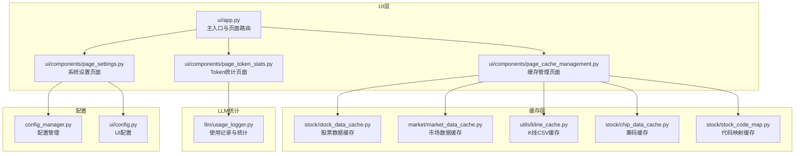
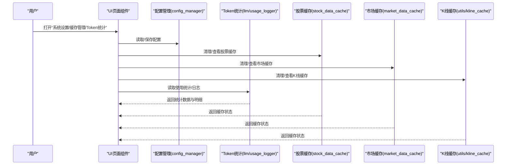
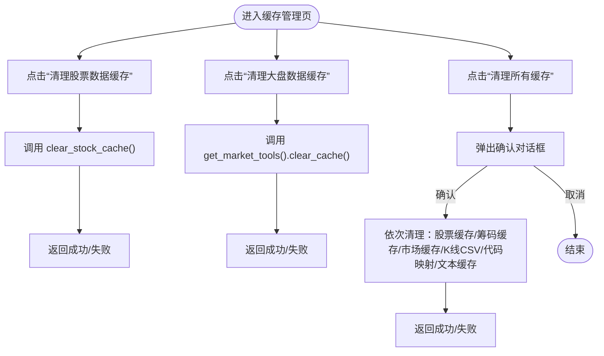
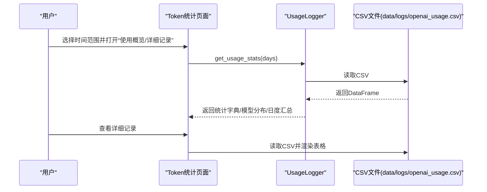
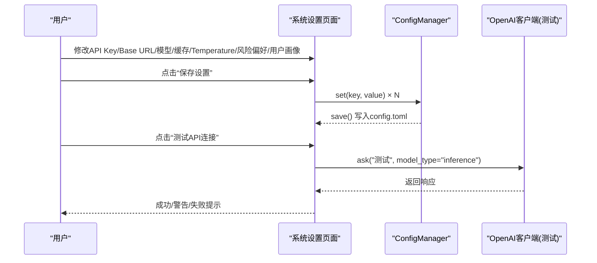
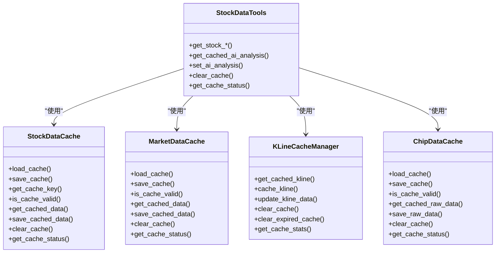
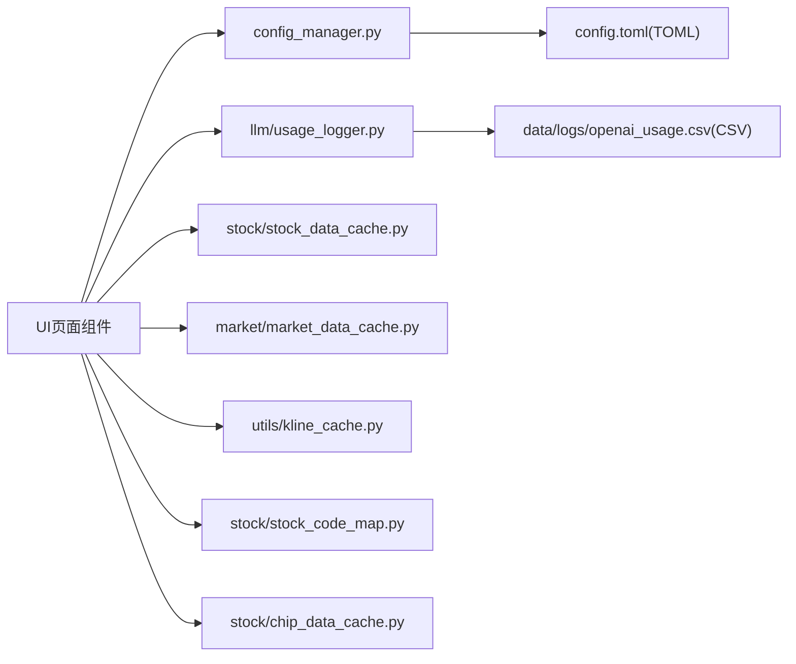

# 系统管理

<cite>
**本文引用的文件**
- [ui/components/page_cache_management.py](file://ui/components/page_cache_management.py)
- [ui/components/page_token_stats.py](file://ui/components/page_token_stats.py)
- [ui/components/page_settings.py](file://ui/components/page_settings.py)
- [llm/usage_logger.py](file://llm/usage_logger.py)
- [stock/stock_data_cache.py](file://stock/stock_data_cache.py)
- [market/market_data_cache.py](file://market/market_data_cache.py)
- [stock/stock_data_tools.py](file://stock/stock_data_tools.py)
- [utils/kline_cache.py](file://utils/kline_cache.py)
- [stock/chip_data_cache.py](file://stock/chip_data_cache.py)
- [stock/stock_code_map.py](file://stock/stock_code_map.py)
- [config_manager.py](file://config_manager.py)
- [ui/app.py](file://ui/app.py)
- [ui/config.py](file://ui/config.py)
- [stock/analysis_prompts.py](file://stock/analysis_prompts.py)
</cite>

## 目录
1. [简介](#简介)
2. [项目结构](#项目结构)
3. [核心组件](#核心组件)
4. [架构总览](#架构总览)
5. [详细组件分析](#详细组件分析)
6. [依赖关系分析](#依赖关系分析)
7. [性能考量](#性能考量)
8. [故障排查指南](#故障排查指南)
9. [结论](#结论)
10. [附录](#附录)

## 简介
本章节面向系统管理员与开发者，系统性梳理 xystock 的“系统管理”能力，重点覆盖：
- 缓存管理：如何查看、清理与优化本地数据缓存，防止重复请求、降低网络压力并提升响应速度。
- Token 统计：记录 LLM 调用消耗，帮助用户监控使用成本与性能。
- 系统设置：通过 UI 界面调整风险偏好、LLM 参数、数据源偏好等关键配置。
- 页面组件实现与状态管理：解析 page_cache_management.py、page_token_stats.py、page_settings.py 的实现逻辑与状态流转。
- 实操示例：通过 Web 界面完成各项管理任务。
- 协同机制：管理功能与核心分析模块的协作方式，保障系统稳定高效运行。
- 常见问题与维护建议：缓存损坏、Token 统计不准、配置未生效等问题的排查与修复。

## 项目结构
系统管理相关模块主要分布在以下位置：
- UI 页面组件：ui/components 下的 page_cache_management.py、page_token_stats.py、page_settings.py
- 缓存管理：stock/stock_data_cache.py、market/market_data_cache.py、utils/kline_cache.py、stock/chip_data_cache.py、stock/stock_code_map.py
- LLM 使用统计：llm/usage_logger.py
- 配置管理：config_manager.py、ui/config.py
- 主入口与页面路由：ui/app.py

图表来源
- [ui/app.py](file://ui/app.py#L1-L229)
- [ui/components/page_cache_management.py](file://ui/components/page_cache_management.py#L1-L133)
- [ui/components/page_token_stats.py](file://ui/components/page_token_stats.py#L1-L189)
- [ui/components/page_settings.py](file://ui/components/page_settings.py#L1-L216)
- [stock/stock_data_cache.py](file://stock/stock_data_cache.py#L1-L319)
- [market/market_data_cache.py](file://market/market_data_cache.py#L1-L440)
- [utils/kline_cache.py](file://utils/kline_cache.py#L1-L477)
- [stock/chip_data_cache.py](file://stock/chip_data_cache.py#L1-L215)
- [stock/stock_code_map.py](file://stock/stock_code_map.py#L1-L287)
- [llm/usage_logger.py](file://llm/usage_logger.py#L1-L204)
- [config_manager.py](file://config_manager.py#L1-L144)
- [ui/config.py](file://ui/config.py#L1-L82)

章节来源
- [ui/app.py](file://ui/app.py#L1-L229)
- [ui/components/page_cache_management.py](file://ui/components/page_cache_management.py#L1-L133)
- [ui/components/page_token_stats.py](file://ui/components/page_token_stats.py#L1-L189)
- [ui/components/page_settings.py](file://ui/components/page_settings.py#L1-L216)
- [stock/stock_data_cache.py](file://stock/stock_data_cache.py#L1-L319)
- [market/market_data_cache.py](file://market/market_data_cache.py#L1-L440)
- [utils/kline_cache.py](file://utils/kline_cache.py#L1-L477)
- [stock/chip_data_cache.py](file://stock/chip_data_cache.py#L1-L215)
- [stock/stock_code_map.py](file://stock/stock_code_map.py#L1-L287)
- [llm/usage_logger.py](file://llm/usage_logger.py#L1-L204)
- [config_manager.py](file://config_manager.py#L1-L144)
- [ui/config.py](file://ui/config.py#L1-L82)

## 核心组件
- 缓存管理页面：提供“清理股票数据缓存”“清理大盘数据缓存”“批量清理”等操作入口，配合后端缓存管理器执行清理。
- Token 统计页面：展示总请求数、总 Token 数、平均响应时间、成功率、模型分布、详细日志等，支持按时间窗口筛选。
- 系统设置页面：集中管理 LLM API Key、Base URL、模型、超时、重试、温度、缓存开关与 TTL、风险偏好、用户画像等。
- 缓存实现：股票数据缓存、市场数据缓存、K线CSV缓存、筹码缓存、代码映射缓存，均采用 JSON/CSV 文件持久化，支持差异化过期策略与状态查询。
- 配置管理：以 TOML 为配置文件，支持读取、写入、保存、热加载，供 UI 与业务模块共享。
- LLM 使用记录：统一记录每次调用的 Token、耗时、成功率、错误信息，并估算成本。

章节来源
- [ui/components/page_cache_management.py](file://ui/components/page_cache_management.py#L1-L133)
- [ui/components/page_token_stats.py](file://ui/components/page_token_stats.py#L1-L189)
- [ui/components/page_settings.py](file://ui/components/page_settings.py#L1-L216)
- [stock/stock_data_cache.py](file://stock/stock_data_cache.py#L1-L319)
- [market/market_data_cache.py](file://market/market_data_cache.py#L1-L440)
- [utils/kline_cache.py](file://utils/kline_cache.py#L1-L477)
- [stock/chip_data_cache.py](file://stock/chip_data_cache.py#L1-L215)
- [stock/stock_code_map.py](file://stock/stock_code_map.py#L1-L287)
- [config_manager.py](file://config_manager.py#L1-L144)
- [llm/usage_logger.py](file://llm/usage_logger.py#L1-L204)

## 架构总览
系统管理功能通过 UI 页面组件与后端缓存/统计/配置模块解耦协作，形成“前端配置—配置持久化—后端缓存/统计—前端展示”的闭环。

图表来源
- [ui/components/page_settings.py](file://ui/components/page_settings.py#L1-L216)
- [ui/components/page_cache_management.py](file://ui/components/page_cache_management.py#L1-L133)
- [ui/components/page_token_stats.py](file://ui/components/page_token_stats.py#L1-L189)
- [config_manager.py](file://config_manager.py#L1-L144)
- [llm/usage_logger.py](file://llm/usage_logger.py#L1-L204)
- [stock/stock_data_cache.py](file://stock/stock_data_cache.py#L1-L319)
- [market/market_data_cache.py](file://market/market_data_cache.py#L1-L440)
- [utils/kline_cache.py](file://utils/kline_cache.py#L1-L477)

## 详细组件分析

### 缓存管理页面（page_cache_management.py）
- 功能要点
  - 提供“清理股票数据缓存”“清理大盘数据缓存”“批量清理所有缓存”三大入口。
  - 使用 session_state 控制“确认弹窗”，避免误操作。
  - 批量清理涉及：股票数据缓存、筹码缓存、市场数据缓存、K线CSV缓存、股票/港股代码映射缓存、data/cache 下的 txt 文本文件。
- 状态管理
  - 使用 st.session_state['show_clear_all_confirm'] 控制二次确认弹窗。
  - 点击“确认清理”后执行清理流程并反馈结果，随后重置状态。
- 与后端缓存模块的协作
  - 调用 stock.stock_data_tools.clear_stock_cache、stock.chip_data_cache.clear_chip_cache、market.market_data_tools.get_market_tools().clear_cache、utils.kline_cache.cache_manager.clear_cache、stock.stock_code_map.clear_stock_map_cache/clear_hk_stock_map_cache、删除 data/cache/*.txt。
- 注意事项
  - 清理后下次查询会重新获取最新数据；K线数据有独立的 CSV 缓存机制，不会被此处清理影响；过期缓存会自动更新，无需手动清理。

图表来源
- [ui/components/page_cache_management.py](file://ui/components/page_cache_management.py#L1-L133)
- [stock/stock_data_tools.py](file://stock/stock_data_tools.py#L682-L709)
- [stock/chip_data_cache.py](file://stock/chip_data_cache.py#L116-L137)
- [market/market_data_cache.py](file://market/market_data_cache.py#L247-L295)
- [utils/kline_cache.py](file://utils/kline_cache.py#L331-L362)
- [stock/stock_code_map.py](file://stock/stock_code_map.py#L256-L287)

章节来源
- [ui/components/page_cache_management.py](file://ui/components/page_cache_management.py#L1-L133)
- [stock/stock_data_tools.py](file://stock/stock_data_tools.py#L682-L709)
- [stock/chip_data_cache.py](file://stock/chip_data_cache.py#L116-L137)
- [market/market_data_cache.py](file://market/market_data_cache.py#L247-L295)
- [utils/kline_cache.py](file://utils/kline_cache.py#L331-L362)
- [stock/stock_code_map.py](file://stock/stock_code_map.py#L256-L287)

### Token 统计页面（page_token_stats.py）
- 功能要点
  - 使用概览：总请求数、总 Token 数、平均响应时间、成功率。
  - 模型分布：柱状图展示各模型使用次数。
  - 详细记录：读取 data/logs/openai_usage.csv，展示时间、模型、输入/输出 Token、总 Token、成本、响应时间、成功与否、错误信息等。
  - 时间范围：支持“过去7天/30天/90天/所有时间”切换。
- 数据来源与处理
  - 通过 llm/usage_logger.UsageLogger 读取与统计，内部使用 pandas 进行聚合与导出。
  - 成本估算基于预设的模型定价表。
- 与 LLM 使用记录的关系
  - UI 展示与统计由 UsageLogger 提供，UI 仅负责可视化与交互。

图表来源
- [ui/components/page_token_stats.py](file://ui/components/page_token_stats.py#L1-L189)
- [llm/usage_logger.py](file://llm/usage_logger.py#L125-L163)

章节来源
- [ui/components/page_token_stats.py](file://ui/components/page_token_stats.py#L1-L189)
- [llm/usage_logger.py](file://llm/usage_logger.py#L1-L204)

### 系统设置页面（page_settings.py）
- 功能要点
  - LLM API 设置：API Key、Base URL、分析模型、推理模型、超时、最大重试、温度。
  - 缓存设置：启用缓存、缓存有效期（秒）。
  - 测试连接：调用 llm.openai_client.OpenAIClient.ask(...) 进行连通性测试。
  - 分析偏好设置：风险偏好（中性/保守/激进/自定义），支持查看对应提示词与保存自定义核心原则。
  - 用户画像：用户擅长领域、交易习惯、常犯错误等，便于个性化分析。
  - 保存配置：通过 config_manager.ConfigManager.set/save 写入 config.toml。
- 状态与交互
  - 使用 st.session_state 保存临时输入，按钮点击后统一保存。
  - 保存成功/失败均有反馈。
- 与配置管理的关系
  - UI 读取/写入 config_manager.config，配置文件位于项目根目录 config.toml。

图表来源
- [ui/components/page_settings.py](file://ui/components/page_settings.py#L1-L216)
- [config_manager.py](file://config_manager.py#L1-L144)
- [ui/config.py](file://ui/config.py#L1-L82)
- [stock/analysis_prompts.py](file://stock/analysis_prompts.py#L1-L54)

章节来源
- [ui/components/page_settings.py](file://ui/components/page_settings.py#L1-L216)
- [config_manager.py](file://config_manager.py#L1-L144)
- [ui/config.py](file://ui/config.py#L1-L82)
- [stock/analysis_prompts.py](file://stock/analysis_prompts.py#L1-L54)

### 缓存实现与优化（多模块协同）
- 股票数据缓存（stock/stock_data_cache.py）
  - 缓存键：data_type_stock_code，AI分析按类型细分，支持动态过期时间。
  - 过期策略：针对不同数据类型（基本信息、技术指标、新闻、筹码、AI分析等）设置差异化的过期分钟数。
  - 状态查询：打印/返回缓存状态，含剩余有效期与文件大小。
- 市场数据缓存（market/market_data_cache.py）
  - 缓存键：data_type 或 data_type_index_name（指数相关），支持差异化过期分钟数。
  - 状态查询：遍历关注指数，输出每个指数的缓存有效性与剩余时间。
- K线缓存（utils/kline_cache.py）
  - 基于 CSV 文件，区分分钟线与日线等，采用“历史永久、近期智能过期”的策略。
  - 支持按股票、周期类型清理，支持分析缺失区间与统计信息。
- 筹码缓存（stock/chip_data_cache.py）
  - 专用 JSON 文件，24 小时过期，保存原始筹码数据与条目数量。
- 代码映射缓存（stock/stock_code_map.py）
  - 本地 JSON 文件缓存股票/港股映射，含更新时间，提供清理函数。
- 与业务模块的协作
  - stock/stock_data_tools.py 作为统一入口，封装缓存读取/写入/失效判断，避免重复拉取，提升响应速度。
  - market/market_data_cache.py 与 utils/kline_cache.py 协作，保证市场与K线数据的缓存一致性与新鲜度。

图表来源
- [stock/stock_data_cache.py](file://stock/stock_data_cache.py#L1-L319)
- [market/market_data_cache.py](file://market/market_data_cache.py#L1-L440)
- [utils/kline_cache.py](file://utils/kline_cache.py#L1-L477)
- [stock/chip_data_cache.py](file://stock/chip_data_cache.py#L1-L215)
- [stock/stock_data_tools.py](file://stock/stock_data_tools.py#L1-L709)

章节来源
- [stock/stock_data_cache.py](file://stock/stock_data_cache.py#L1-L319)
- [market/market_data_cache.py](file://market/market_data_cache.py#L1-L440)
- [utils/kline_cache.py](file://utils/kline_cache.py#L1-L477)
- [stock/chip_data_cache.py](file://stock/chip_data_cache.py#L1-L215)
- [stock/stock_data_tools.py](file://stock/stock_data_tools.py#L1-L709)

## 依赖关系分析
- UI 页面组件依赖后端缓存/统计/配置模块，通过导入模块函数或类实现具体功能。
- 配置管理器提供统一的读取/写入接口，避免硬编码与分散配置。
- Token 统计依赖 CSV 文件与 pandas，统计逻辑集中在 UsageLogger。
- 缓存模块之间相互独立，但通过统一的键命名与过期策略实现一致的用户体验。

图表来源
- [ui/components/page_settings.py](file://ui/components/page_settings.py#L1-L216)
- [ui/components/page_token_stats.py](file://ui/components/page_token_stats.py#L1-L189)
- [ui/components/page_cache_management.py](file://ui/components/page_cache_management.py#L1-L133)
- [config_manager.py](file://config_manager.py#L1-L144)
- [llm/usage_logger.py](file://llm/usage_logger.py#L1-L204)
- [stock/stock_data_cache.py](file://stock/stock_data_cache.py#L1-L319)
- [market/market_data_cache.py](file://market/market_data_cache.py#L1-L440)
- [utils/kline_cache.py](file://utils/kline_cache.py#L1-L477)
- [stock/stock_code_map.py](file://stock/stock_code_map.py#L1-L287)
- [stock/chip_data_cache.py](file://stock/chip_data_cache.py#L1-L215)

章节来源
- [ui/components/page_settings.py](file://ui/components/page_settings.py#L1-L216)
- [ui/components/page_token_stats.py](file://ui/components/page_token_stats.py#L1-L189)
- [ui/components/page_cache_management.py](file://ui/components/page_cache_management.py#L1-L133)
- [config_manager.py](file://config_manager.py#L1-L144)
- [llm/usage_logger.py](file://llm/usage_logger.py#L1-L204)
- [stock/stock_data_cache.py](file://stock/stock_data_cache.py#L1-L319)
- [market/market_data_cache.py](file://market/market_data_cache.py#L1-L440)
- [utils/kline_cache.py](file://utils/kline_cache.py#L1-L477)
- [stock/stock_code_map.py](file://stock/stock_code_map.py#L1-L287)
- [stock/chip_data_cache.py](file://stock/chip_data_cache.py#L1-L215)

## 性能考量
- 缓存命中率
  - 通过差异化过期策略与细粒度缓存键，减少重复拉取，提高响应速度。
  - K线缓存采用“历史永久、近期智能过期”，兼顾实时性与性能。
- I/O 与存储
  - JSON/CSV 文件读写需注意磁盘 I/O，建议定期清理过期缓存与冗余文件。
- Token 统计
  - 统计计算基于 pandas，建议控制统计窗口大小，避免一次性加载过多数据。
- 配置热更新
  - 配置文件变更后需重启应用以生效，避免运行时状态不一致。

[本节为通用指导，无需列出具体文件来源]

## 故障排查指南
- 缓存损坏/清理无效
  - 症状：缓存清理后仍显示旧数据或报错。
  - 排查步骤：
    - 检查 data/cache 下的 JSON/CSV 文件是否存在异常。
    - 在 UI 中使用“缓存状态”或调用相应模块的 print_cache_status/get_cache_status 方法查看状态。
    - 若为 K 线缓存，确认 utils/kline_cache.py 的 CSV 文件是否被正确更新/清理。
  - 相关文件
    - [stock/stock_data_cache.py](file://stock/stock_data_cache.py#L234-L310)
    - [market/market_data_cache.py](file://market/market_data_cache.py#L296-L430)
    - [utils/kline_cache.py](file://utils/kline_cache.py#L331-L474)
- Token 统计不准
  - 症状：总 Token 数与预期不符、成本估算异常。
  - 排查步骤：
    - 检查 data/logs/openai_usage.csv 是否存在且可读。
    - 确认 llm/usage_logger.py 的定价表与实际模型一致。
    - 检查是否有异常行（缺失字段、空值）。
  - 相关文件
    - [llm/usage_logger.py](file://llm/usage_logger.py#L125-L163)
    - [ui/components/page_token_stats.py](file://ui/components/page_token_stats.py#L84-L156)
- 配置未生效
  - 症状：修改设置后未生效。
  - 排查步骤：
    - 确认已点击“保存设置”，并检查 config.toml 是否写入成功。
    - 重启应用以加载新配置。
  - 相关文件
    - [config_manager.py](file://config_manager.py#L104-L115)
    - [ui/components/page_settings.py](file://ui/components/page_settings.py#L103-L119)

章节来源
- [stock/stock_data_cache.py](file://stock/stock_data_cache.py#L234-L310)
- [market/market_data_cache.py](file://market/market_data_cache.py#L296-L430)
- [utils/kline_cache.py](file://utils/kline_cache.py#L331-L474)
- [llm/usage_logger.py](file://llm/usage_logger.py#L125-L163)
- [ui/components/page_token_stats.py](file://ui/components/page_token_stats.py#L84-L156)
- [config_manager.py](file://config_manager.py#L104-L115)
- [ui/components/page_settings.py](file://ui/components/page_settings.py#L103-L119)

## 结论
xystock 的系统管理功能通过 UI 页面组件与后端缓存/统计/配置模块的紧密协作，实现了：
- 可视化的缓存管理与批量清理，显著降低重复请求与网络压力。
- 可追溯的 LLM 使用统计与成本估算，帮助用户监控与优化使用成本。
- 集中的系统设置入口，支持风险偏好、LLM 参数、缓存策略与用户画像的灵活配置。
建议在生产环境中定期清理过期缓存、核对 Token 统计文件完整性，并在修改关键配置后重启应用以确保生效。

[本节为总结性内容，无需列出具体文件来源]

## 附录

### 实际操作示例（通过 Web 界面）
- 缓存管理
  - 打开“缓存管理”页面，点击“清理股票数据缓存”或“清理大盘数据缓存”。
  - 如需一键清理，点击“清理所有缓存”，在确认弹窗中再次确认。
  - 清理完成后，页面会提示成功/失败信息。
  - 参考路径
    - [ui/components/page_cache_management.py](file://ui/components/page_cache_management.py#L1-L133)
- Token 统计
  - 打开“Token统计”页面，选择时间范围（如“过去30天”）。
  - 查看“使用概览”中的总请求数、总 Token 数、平均响应时间与成功率。
  - 点击“详细记录”查看 CSV 日志，支持按时间排序与展开查看详细请求内容。
  - 参考路径
    - [ui/components/page_token_stats.py](file://ui/components/page_token_stats.py#L1-L189)
    - [llm/usage_logger.py](file://llm/usage_logger.py#L125-L163)
- 系统设置
  - 打开“设置”页面，填写 API Key、Base URL、模型、超时、重试、温度、缓存开关与 TTL。
  - 选择“分析风险偏好”，可查看对应提示词或输入自定义核心原则。
  - 填写“用户画像”，选择常犯错误，便于个性化分析。
  - 点击“保存设置”，并使用“测试API连接”验证连通性。
  - 参考路径
    - [ui/components/page_settings.py](file://ui/components/page_settings.py#L1-L216)
    - [config_manager.py](file://config_manager.py#L1-L144)
    - [stock/analysis_prompts.py](file://stock/analysis_prompts.py#L1-L54)

### 与核心分析模块的协同
- 股票分析查询时，UI 通过 session_state 控制查询与展示，调用 stock/stock_data_tools.py 的统一入口，内部按需读取/写入缓存，避免重复拉取。
- 市场分析与 K 线数据同样遵循缓存策略，确保响应速度与数据新鲜度。
- Token 统计贯穿 LLM 调用链路，为成本控制与性能优化提供依据。

章节来源
- [ui/app.py](file://ui/app.py#L84-L225)
- [stock/stock_data_tools.py](file://stock/stock_data_tools.py#L1-L709)
- [market/market_data_cache.py](file://market/market_data_cache.py#L1-L440)
- [utils/kline_cache.py](file://utils/kline_cache.py#L1-L477)
- [llm/usage_logger.py](file://llm/usage_logger.py#L1-L204)