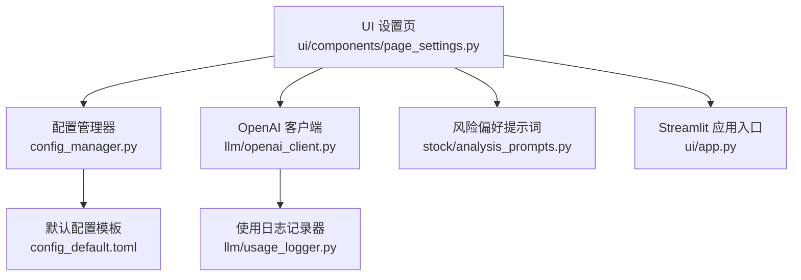
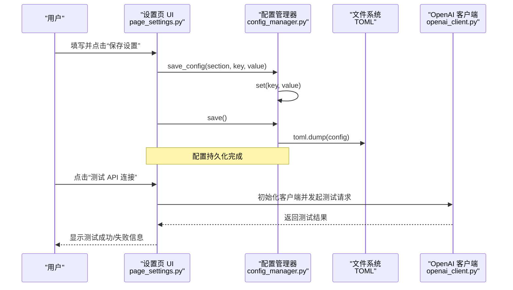
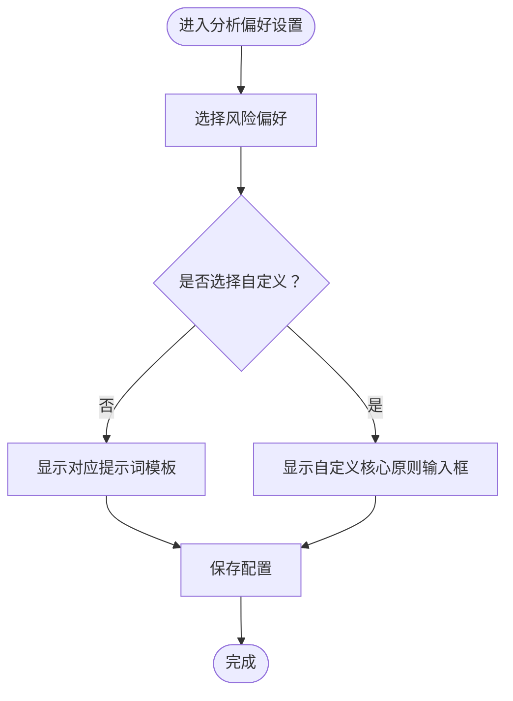
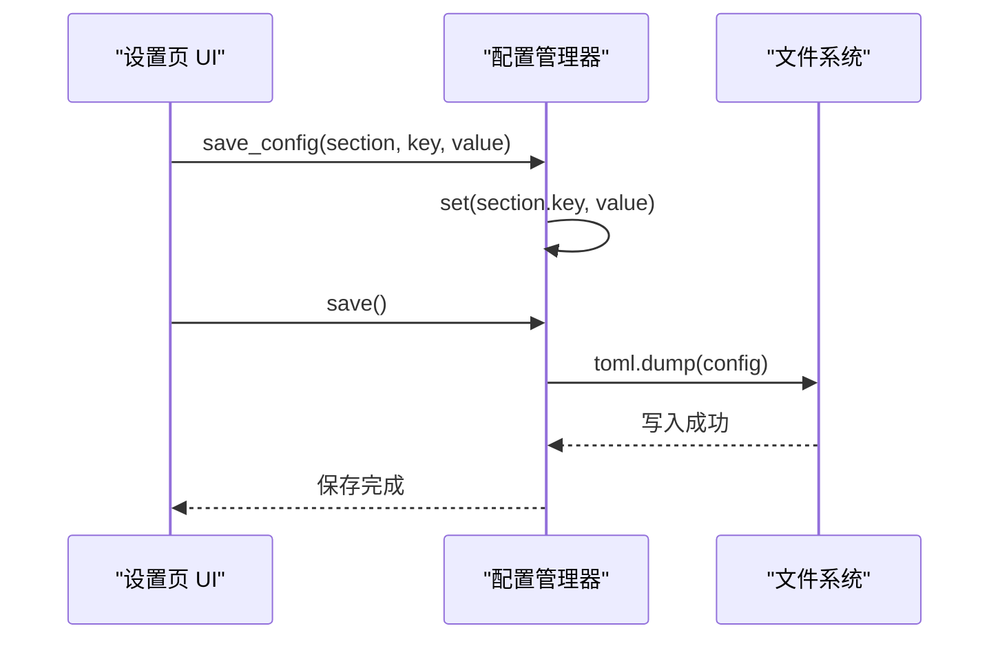
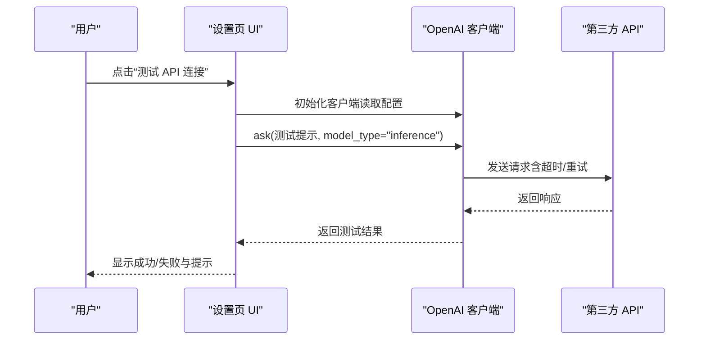
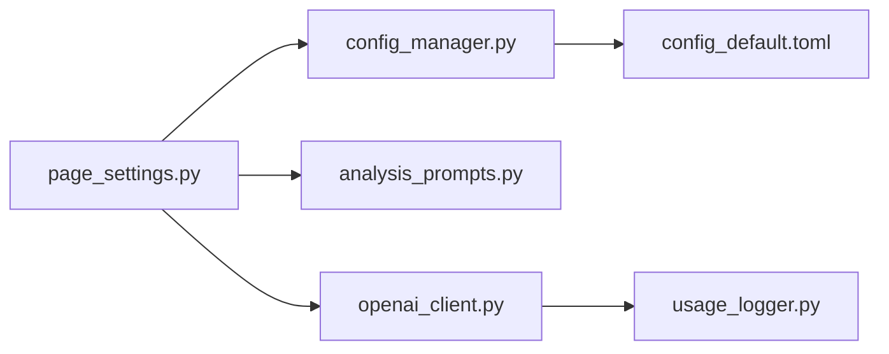

# 系统设置

<cite>
**本文引用的文件**
- [config_default.toml](file://config_default.toml)
- [config_manager.py](file://config_manager.py)
- [ui/components/page_settings.py](file://ui/components/page_settings.py)
- [stock/analysis_prompts.py](file://stock/analysis_prompts.py)
- [llm/openai_client.py](file://llm/openai_client.py)
- [llm/usage_logger.py](file://llm/usage_logger.py)
- [ui/app.py](file://ui/app.py)
- [tests/unit/ui/test_page_settings.py](file://tests/unit/ui/test_page_settings.py)
</cite>

## 目录
1. [简介](#简介)
2. [项目结构](#项目结构)
3. [核心组件](#核心组件)
4. [架构总览](#架构总览)
5. [详细组件分析](#详细组件分析)
6. [依赖关系分析](#依赖关系分析)
7. [性能考量](#性能考量)
8. [故障排查指南](#故障排查指南)
9. [结论](#结论)
10. [附录](#附录)

## 简介
本章节面向使用者与维护者，系统性讲解 xystock 的“系统设置”功能。内容涵盖：
- 通过 Web 界面配置 OpenAI API 相关参数（API Key、Base URL、分析模型 DEFAULT_MODEL、推理模型 INFERENCE_MODEL、超时时间、最大重试次数、温度参数 DEFAULT_TEMPERATURE）
- 高级设置中的缓存控制 ENABLE_CACHE 与缓存有效期 CACHE_TTL 的配置与影响
- 分析偏好设置中风险偏好 RISK_PREFERENCE 的实现机制（保守、中性、激进、自定义），以及 RISK_PREFERENCE_PROMPTS 如何映射不同风格的提示词模板
- 用户画像配置（擅长领域、交易习惯、常见错误 MISTAKES）的记录方式及其在 AI 分析中的应用
- save_config() 函数如何将配置写入 TOML 文件并通过 config.save() 持久化
- 实际操作示例：保存设置与 API 连接测试
- 常见问题排查与维护建议（配置未生效、API 测试失败、自定义提示词格式错误、配置文件备份与恢复）

## 项目结构
系统设置功能由以下模块协同实现：
- UI 层：Streamlit 页面负责展示与收集用户输入，调用保存逻辑
- 配置管理层：集中读取/写入 TOML 配置，提供默认值与键路径访问
- LLM 客户端层：根据配置初始化 OpenAI 客户端，执行请求与日志记录
- 提示词层：定义不同风险偏好的提示词模板与描述
- 日志与缓存：使用日志记录器统计使用情况，缓存控制影响请求行为

图表来源
- [ui/components/page_settings.py](file://ui/components/page_settings.py#L1-L216)
- [config_manager.py](file://config_manager.py#L1-L144)
- [llm/openai_client.py](file://llm/openai_client.py#L1-L297)
- [stock/analysis_prompts.py](file://stock/analysis_prompts.py#L1-L54)
- [llm/usage_logger.py](file://llm/usage_logger.py#L1-L204)
- [ui/app.py](file://ui/app.py#L1-L39)
- [config_default.toml](file://config_default.toml#L1-L64)

章节来源
- [ui/components/page_settings.py](file://ui/components/page_settings.py#L1-L216)
- [config_manager.py](file://config_manager.py#L1-L144)
- [llm/openai_client.py](file://llm/openai_client.py#L1-L297)
- [stock/analysis_prompts.py](file://stock/analysis_prompts.py#L1-L54)
- [llm/usage_logger.py](file://llm/usage_logger.py#L1-L204)
- [ui/app.py](file://ui/app.py#L1-L39)
- [config_default.toml](file://config_default.toml#L1-L64)

## 核心组件
- 配置管理器（ConfigManager）
  - 负责加载/保存 TOML 配置，提供键路径访问与默认值回退
  - 支持按节读取（如 LLM_OPENAI、LLM_CACHE、ANALYSIS、USER_PROFILE）
- UI 设置页（page_settings.py）
  - 提供表单控件收集用户输入，调用 save_config() 写入配置并保存
  - 提供“测试 API 连接”按钮，调用 OpenAI 客户端进行连通性测试
- OpenAI 客户端（OpenAIClient）
  - 依据配置初始化客户端（API Key、Base URL、超时、重试、默认模型、默认温度）
  - 提供 ask/chat 方法，支持 JSON 模式、系统消息、消息列表等
- 风险偏好提示词（analysis_prompts.py）
  - 定义保守、中性、激进三种风格的提示词模板
  - 提供描述映射与按偏好获取核心原则的函数
- 使用日志记录器（usage_logger.py）
  - 记录每次请求的 token 使用、响应时间、成本估算、错误信息等
  - 支持统计与 HTML 报告导出

章节来源
- [config_manager.py](file://config_manager.py#L1-L144)
- [ui/components/page_settings.py](file://ui/components/page_settings.py#L1-L216)
- [llm/openai_client.py](file://llm/openai_client.py#L1-L297)
- [stock/analysis_prompts.py](file://stock/analysis_prompts.py#L1-L54)
- [llm/usage_logger.py](file://llm/usage_logger.py#L1-L204)

## 架构总览
系统设置的典型流程如下：
- 用户在 UI 设置页填写各项参数
- save_config() 将键值写入内存配置对象
- 调用 config.save() 将内存配置写入 TOML 文件
- 后续业务模块（如 OpenAI 客户端）从配置读取参数，执行请求与日志记录

图表来源
- [ui/components/page_settings.py](file://ui/components/page_settings.py#L100-L137)
- [config_manager.py](file://config_manager.py#L85-L115)
- [llm/openai_client.py](file://llm/openai_client.py#L29-L71)

## 详细组件分析

### OpenAI API 设置（Web 界面）
- 参数项
  - API Key：用于身份认证
  - Base URL：API 基础地址（可替换为兼容 OpenAI API 的服务）
  - 分析模型 DEFAULT_MODEL：用于深度分析的模型
  - 推理模型 INFERENCE_MODEL：用于快速推理的模型
  - 超时时间 TIMEOUT：请求超时秒数
  - 最大重试次数 MAX_RETRIES：失败时的最大重试次数
  - 温度参数 DEFAULT_TEMPERATURE：控制生成文本的随机性
- UI 行为
  - 使用表单控件收集上述参数
  - 点击“保存设置”后逐项调用 save_config() 并立即保存
  - “测试 API 连接”按钮使用当前输入的 API Key 初始化客户端并发起一次测试请求，校验连通性

章节来源
- [ui/components/page_settings.py](file://ui/components/page_settings.py#L26-L118)
- [ui/components/page_settings.py](file://ui/components/page_settings.py#L122-L137)

### 高级设置：缓存控制与有效期
- ENABLE_CACHE：是否启用缓存
- CACHE_TTL：缓存有效期（秒）
- 影响范围
  - 当前配置中存在 LLM_CACHE 节，用于控制缓存开关与 TTL
  - 实际业务中，缓存控制通常由各数据模块独立实现（如股票数据缓存、市场数据缓存等），此处的 LLM_CACHE 主要用于统一配置入口
- UI 行为
  - 提供开关与数值输入，保存后立即生效（后续业务模块按需读取）

章节来源
- [config_default.toml](file://config_default.toml#L19-L23)
- [ui/components/page_settings.py](file://ui/components/page_settings.py#L86-L101)

### 分析偏好设置：风险偏好与提示词映射
- RISK_PREFERENCE 可选值
  - conservative：保守
  - neutral：中性
  - aggressive：激进
  - custom：自定义
- RISK_PREFERENCE_PROMPTS
  - 将上述偏好映射到对应的提示词模板
- RISK_PREFERENCE_DESCRIPTIONS
  - 为每种偏好提供人类可读的描述
- CUSTOM_PRINCIPLES
  - 当选择 custom 时，系统读取该字段作为核心原则
- UI 行为
  - 下拉选择风险偏好，显示对应提示词模板（不含自定义）
  - 当选择 custom 时，显示文本域用于输入自定义核心原则
  - 保存后写入 ANALYSIS 节

图表来源
- [ui/components/page_settings.py](file://ui/components/page_settings.py#L139-L175)
- [stock/analysis_prompts.py](file://stock/analysis_prompts.py#L24-L37)
- [stock/analysis_prompts.py](file://stock/analysis_prompts.py#L39-L54)

章节来源
- [ui/components/page_settings.py](file://ui/components/page_settings.py#L139-L175)
- [stock/analysis_prompts.py](file://stock/analysis_prompts.py#L1-L54)

### 用户画像配置
- 字段
  - RAW：用户画像描述（擅长领域、交易习惯等）
  - MISTAKES：常见错误（多选）
- 作用
  - 用于在 AI 分析中个性化定制建议，帮助系统更好地理解用户需求
- UI 行为
  - 文本域输入 RAW
  - 多选框选择常见错误
  - 保存后写入 USER_PROFILE 节

章节来源
- [config_default.toml](file://config_default.toml#L60-L64)
- [ui/components/page_settings.py](file://ui/components/page_settings.py#L176-L202)

### save_config() 与持久化流程
- save_config(section, key, value)
  - 通过 config.set() 写入内存配置
  - 立即调用 config.save() 将内存配置以 TOML 格式写入文件
- 配置文件位置
  - 默认使用项目根目录下的 config.toml（由全局配置实例指向）
- 读取与回退
  - 若配置文件不存在或读取失败，配置管理器会回退到默认配置
  - 默认配置来源于默认模板与环境变量

图表来源
- [ui/components/page_settings.py](file://ui/components/page_settings.py#L16-L21)
- [config_manager.py](file://config_manager.py#L85-L115)

章节来源
- [ui/components/page_settings.py](file://ui/components/page_settings.py#L16-L21)
- [config_manager.py](file://config_manager.py#L1-L144)

### API 连接测试流程
- 触发条件
  - 用户点击“测试 API 连接”
- 执行步骤
  - 从 UI 读取当前 API Key
  - 初始化 OpenAIClient（使用配置中的 TIMEOUT/MAX_RETRIES/BASE_URL）
  - 发起一次测试请求（如 ask(prompt, model_type="inference")）
  - 根据响应内容判断成功与否并反馈
- 注意事项
  - 若 API Key 为空或无效，客户端会在初始化阶段抛出错误
  - 超时与重试参数会影响测试耗时与成功率

图表来源
- [ui/components/page_settings.py](file://ui/components/page_settings.py#L122-L137)
- [llm/openai_client.py](file://llm/openai_client.py#L29-L71)

章节来源
- [ui/components/page_settings.py](file://ui/components/page_settings.py#L122-L137)
- [llm/openai_client.py](file://llm/openai_client.py#L1-L110)

## 依赖关系分析
- UI 设置页依赖
  - 配置管理器：读取/写入配置
  - 风险偏好提示词：渲染提示词模板
  - OpenAI 客户端：测试连接
- 配置管理器依赖
  - toml 解析库：读写 TOML
  - 默认模板与环境变量：提供默认值
- OpenAI 客户端依赖
  - 配置管理器：读取 API Key、Base URL、超时、重试、模型与温度
  - 使用日志记录器：记录使用情况

图表来源
- [ui/components/page_settings.py](file://ui/components/page_settings.py#L1-L216)
- [config_manager.py](file://config_manager.py#L1-L144)
- [stock/analysis_prompts.py](file://stock/analysis_prompts.py#L1-L54)
- [llm/openai_client.py](file://llm/openai_client.py#L1-L297)
- [llm/usage_logger.py](file://llm/usage_logger.py#L1-L204)
- [config_default.toml](file://config_default.toml#L1-L64)

章节来源
- [ui/components/page_settings.py](file://ui/components/page_settings.py#L1-L216)
- [config_manager.py](file://config_manager.py#L1-L144)
- [llm/openai_client.py](file://llm/openai_client.py#L1-L297)
- [stock/analysis_prompts.py](file://stock/analysis_prompts.py#L1-L54)
- [llm/usage_logger.py](file://llm/usage_logger.py#L1-L204)
- [config_default.toml](file://config_default.toml#L1-L64)

## 性能考量
- 超时与重试
  - 合理设置 TIMEOUT 与 MAX_RETRIES，避免长时间阻塞与资源占用
- 温度参数
  - DEFAULT_TEMPERATURE 影响生成多样性与稳定性，建议根据任务类型调整
- 缓存策略
  - LLM_CACHE 可降低重复请求开销，但需结合业务模块的实际缓存实现使用
- 日志与成本
  - 使用日志记录器统计 token 使用与成本，便于优化与预算控制

[本节为通用指导，无需列出章节来源]

## 故障排查指南
- 配置未生效
  - 确认已点击“保存设置”，并检查配置文件是否成功写入
  - 若配置文件不存在或损坏，系统会回退到默认配置
- API 测试失败
  - 检查 API Key 是否正确、Base URL 是否可达
  - 调整 TIMEOUT 与 MAX_RETRIES，观察网络状况
  - 查看日志文件（若启用）定位错误
- 自定义提示词格式错误
  - 确保 CUSTOM_PRINCIPLES 为有效文本；当选择 custom 时，系统会直接使用该字段
  - 风险偏好选择与提示词模板映射由 RISK_PREFERENCE_PROMPTS 控制
- 维护建议
  - 备份配置文件：定期复制 config.toml 至安全位置
  - 恢复策略：出现问题时，使用备份文件覆盖当前配置
  - 日志归档：定期导出使用报告并清理旧日志文件

章节来源
- [config_manager.py](file://config_manager.py#L23-L37)
- [ui/components/page_settings.py](file://ui/components/page_settings.py#L122-L137)
- [llm/usage_logger.py](file://llm/usage_logger.py#L164-L204)
- [stock/analysis_prompts.py](file://stock/analysis_prompts.py#L24-L37)

## 结论
xystock 的系统设置通过直观的 Web 界面与健壮的配置管理机制，实现了对 OpenAI API 参数、缓存策略、分析偏好与用户画像的统一配置与持久化。配合 API 连接测试与使用日志记录，用户可以快速验证配置并持续优化成本与性能。建议在生产环境中定期备份配置文件，并结合日志与报告进行持续监控与迭代。

[本节为总结性内容，无需列出章节来源]

## 附录

### 实操示例：保存设置与测试连接
- 保存设置
  - 在“OpenAI API 设置”区域填写 API Key、Base URL、模型、超时、重试与温度
  - 在“高级设置”区域勾选“启用缓存”，设置缓存有效期
  - 点击“保存设置”，确认成功提示
- 测试连接
  - 点击“测试 API 连接”，观察成功/失败提示
  - 若失败，检查 API Key、Base URL、网络与超时设置

章节来源
- [ui/components/page_settings.py](file://ui/components/page_settings.py#L26-L118)
- [ui/components/page_settings.py](file://ui/components/page_settings.py#L122-L137)

### 配置文件结构概览
- LLM_OPENAI：API Key、Base URL、模型、超时、重试、温度
- LLM_CACHE：ENABLE_CACHE、CACHE_TTL
- ANALYSIS：RISK_PREFERENCE、CUSTOM_PRINCIPLES
- USER_PROFILE：RAW、MISTAKES

章节来源
- [config_default.toml](file://config_default.toml#L1-L64)