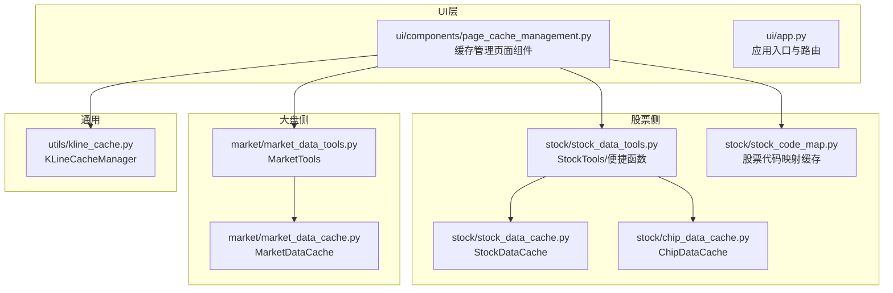
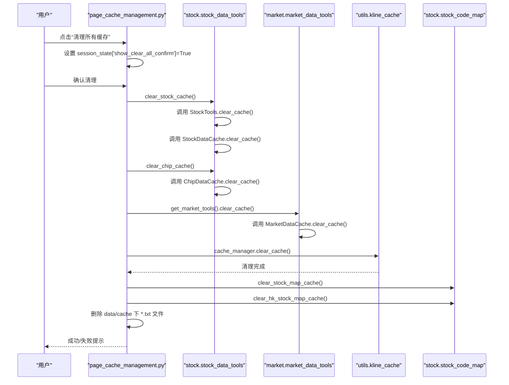
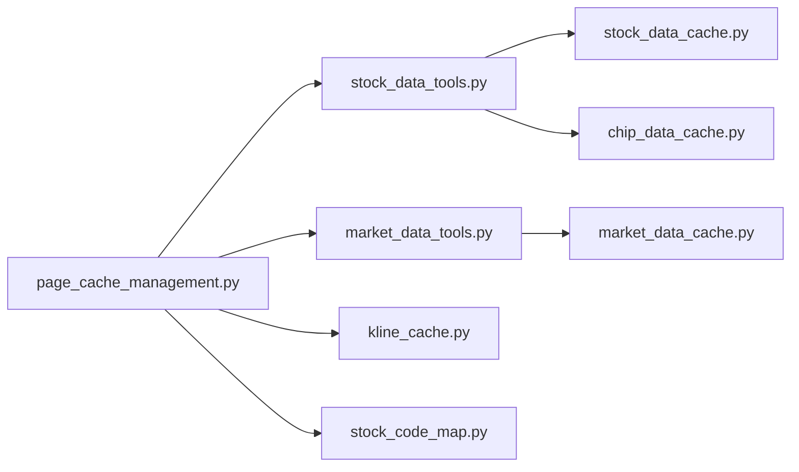

# 缓存管理

<cite>
**本文引用的文件**
- [ui/components/page_cache_management.py](file://ui/components/page_cache_management.py)
- [stock/stock_data_tools.py](file://stock/stock_data_tools.py)
- [stock/stock_data_cache.py](file://stock/stock_data_cache.py)
- [stock/chip_data_cache.py](file://stock/chip_data_cache.py)
- [stock/stock_code_map.py](file://stock/stock_code_map.py)
- [market/market_data_tools.py](file://market/market_data_tools.py)
- [market/market_data_cache.py](file://market/market_data_cache.py)
- [utils/kline_cache.py](file://utils/kline_cache.py)
- [ui/app.py](file://ui/app.py)
</cite>

## 目录
1. [简介](#简介)
2. [项目结构](#项目结构)
3. [核心组件](#核心组件)
4. [架构总览](#架构总览)
5. [详细组件分析](#详细组件分析)
6. [依赖关系分析](#依赖关系分析)
7. [性能考量](#性能考量)
8. [故障排查指南](#故障排查指南)
9. [结论](#结论)
10. [附录](#附录)

## 简介
本章节面向使用 xystock Web 界面的用户与维护者，系统性讲解“缓存管理”功能的设计与实现，覆盖：
- 如何通过 Web 界面清理股票数据缓存（基本信息、技术指标、新闻、筹码分析、AI分析）与大盘数据缓存（市场情绪、估值指标、资金流向、融资融券等）
- 批量操作“清理所有缓存”的实现逻辑与调用链
- UI 层通过 session_state 实现确认弹窗的交互设计
- 实际操作示例与反馈机制
- 常见问题排查与维护建议（含自动更新机制）

## 项目结构
缓存管理涉及 UI 页面、股票与大盘数据工具、缓存管理器、K线缓存管理器以及股票代码映射缓存等模块。下图展示了与缓存管理相关的关键文件与职责划分。

图表来源
- [ui/components/page_cache_management.py](file://ui/components/page_cache_management.py#L1-L133)
- [stock/stock_data_tools.py](file://stock/stock_data_tools.py#L640-L709)
- [stock/stock_data_cache.py](file://stock/stock_data_cache.py#L1-L319)
- [stock/chip_data_cache.py](file://stock/chip_data_cache.py#L1-L215)
- [stock/stock_code_map.py](file://stock/stock_code_map.py#L1-L287)
- [market/market_data_tools.py](file://market/market_data_tools.py#L1-L519)
- [market/market_data_cache.py](file://market/market_data_cache.py#L1-L440)
- [utils/kline_cache.py](file://utils/kline_cache.py#L1-L477)
- [ui/app.py](file://ui/app.py#L1-L229)

章节来源
- [ui/components/page_cache_management.py](file://ui/components/page_cache_management.py#L1-L133)
- [ui/app.py](file://ui/app.py#L1-L229)

## 核心组件
- 页面组件 page_cache_management.py：提供“清理股票数据缓存”“清理大盘数据缓存”“清理所有缓存”三大入口，并以 session_state 控制确认弹窗。
- 股票侧：
  - StockTools/便捷函数：封装 clear_stock_cache()、clear_chip_cache()、get_stock_tools() 等，统一调用缓存管理器。
  - StockDataCache：管理股票数据 JSON 缓存（基本信息、技术指标、新闻、筹码、AI分析等），支持按类型/股票/全量清理。
  - ChipDataCache：管理筹码原始数据 JSON 缓存，独立文件，支持按股票/全量清理。
  - 股票代码映射缓存：通过 stock_code_map.py 的 clear_stock_map_cache()/clear_hk_stock_map_cache() 清理本地映射文件与内存缓存。
- 大盘侧：
  - MarketTools：封装 get_market_tools()，统一访问 MarketDataCache。
  - MarketDataCache：管理大盘数据 JSON 缓存（市场情绪、估值、资金流、融资融券、AI分析等），支持按类型/指数/全量清理。
- K线缓存：
  - KLineCacheManager：管理 K 线 CSV 缓存，支持按类型/股票/全量清理与过期清理；注意：K 线缓存独立于前述 JSON 缓存。

章节来源
- [ui/components/page_cache_management.py](file://ui/components/page_cache_management.py#L1-L133)
- [stock/stock_data_tools.py](file://stock/stock_data_tools.py#L640-L709)
- [stock/stock_data_cache.py](file://stock/stock_data_cache.py#L1-L319)
- [stock/chip_data_cache.py](file://stock/chip_data_cache.py#L1-L215)
- [stock/stock_code_map.py](file://stock/stock_code_map.py#L1-L287)
- [market/market_data_tools.py](file://market/market_data_tools.py#L1-L519)
- [market/market_data_cache.py](file://market/market_data_cache.py#L1-L440)
- [utils/kline_cache.py](file://utils/kline_cache.py#L1-L477)

## 架构总览
下图展示了“清理所有缓存”在 UI 与各模块之间的调用关系。

图表来源
- [ui/components/page_cache_management.py](file://ui/components/page_cache_management.py#L55-L105)
- [stock/stock_data_tools.py](file://stock/stock_data_tools.py#L640-L709)
- [stock/stock_data_cache.py](file://stock/stock_data_cache.py#L179-L233)
- [stock/chip_data_cache.py](file://stock/chip_data_cache.py#L116-L137)
- [market/market_data_tools.py](file://market/market_data_tools.py#L399-L401)
- [market/market_data_cache.py](file://market/market_data_cache.py#L247-L295)
- [utils/kline_cache.py](file://utils/kline_cache.py#L331-L362)
- [stock/stock_code_map.py](file://stock/stock_code_map.py#L273-L287)

## 详细组件分析

### UI 页面：page_cache_management.py
- 主要功能
  - 提供“清理股票数据缓存”按钮：调用 stock.stock_data_tools.clear_stock_cache() 并反馈结果。
  - 提供“清理大盘数据缓存”按钮：通过 market.market_data_tools.get_market_tools() 获取 MarketTools 实例，调用其 clear_cache() 并反馈结果。
  - 提供“清理所有缓存”按钮：使用 session_state 控制确认弹窗，确认后依次调用：
    - clear_stock_cache()
    - clear_chip_cache()
    - market_tools.clear_cache()
    - cache_manager.clear_cache()
    - clear_stock_map_cache() 与 clear_hk_stock_map_cache()
    - 删除 data/cache 目录下所有 .txt 文件
- 交互设计
  - 使用 st.session_state['show_clear_all_confirm'] 控制确认弹窗显示与隐藏。
  - 确认弹窗包含“确认清理”和“取消”两个按钮，分别设置 st.session_state['show_clear_all_confirm']=False 与执行清理逻辑。

章节来源
- [ui/components/page_cache_management.py](file://ui/components/page_cache_management.py#L18-L105)

### 股票侧：StockTools 与 StockDataCache
- StockTools.clear_cache(stock_code, data_type)
  - 通过 get_stock_tools() 获取全局实例，委托给 StockDataCache.clear_cache() 完成清理。
- StockDataCache.clear_cache(stock_code=None, data_type=None)
  - 支持按“股票+类型”、“仅股票”、“仅类型”、“全量”四种粒度清理。
  - 若存在缓存文件，删除对应键或整个文件；若不存在则输出提示。
- AI 分析缓存
  - 通过 set_ai_analysis_cache()/get_ai_analysis_cache()/is_ai_analysis_cache_valid() 管理 AI 分析缓存，键名包含 analysis_type，过期时间按类型动态配置。

章节来源
- [stock/stock_data_tools.py](file://stock/stock_data_tools.py#L640-L709)
- [stock/stock_data_cache.py](file://stock/stock_data_cache.py#L179-L233)
- [stock/stock_data_cache.py](file://stock/stock_data_cache.py#L165-L178)

### 筹码缓存：ChipDataCache
- ChipDataCache.clear_cache(stock_code=None)
  - 支持按股票或全量清理，删除对应键或整个文件。
- 过期策略
  - 以小时为单位的固定过期时间，到期后需重新拉取。

章节来源
- [stock/chip_data_cache.py](file://stock/chip_data_cache.py#L116-L137)
- [stock/chip_data_cache.py](file://stock/chip_data_cache.py#L19-L22)

### 大盘侧：MarketTools 与 MarketDataCache
- MarketTools.clear_cache(data_type=None, index_name=None)
  - 支持按数据类型、指数名称或全量清理。
  - 对指数相关类型（如技术指标、AI分析）支持按指数粒度清理。
- MarketDataCache.clear_cache(data_type=None, index_name=None)
  - 依据 cache_configs 中的配置决定是否按指数区分键名，再执行清理。

章节来源
- [market/market_data_tools.py](file://market/market_data_tools.py#L399-L401)
- [market/market_data_cache.py](file://market/market_data_cache.py#L247-L295)

### K线缓存：KLineCacheManager
- KLineCacheManager.clear_cache(symbol=None, kline_type=None)
  - 支持按 K 线类型、股票、全量清理；独立于 JSON 缓存。
- 过期清理
  - clear_expired_cache() 会按每类 K 线的“新鲜度”规则过滤过期数据并持久化。

章节来源
- [utils/kline_cache.py](file://utils/kline_cache.py#L331-L362)
- [utils/kline_cache.py](file://utils/kline_cache.py#L363-L398)

### 股票代码映射缓存：stock_code_map.py
- clear_stock_map_cache() 与 clear_hk_stock_map_cache()
  - 删除本地映射 JSON 文件，并清空对应全局变量与时间戳，强制下次使用时重新加载。

章节来源
- [stock/stock_code_map.py](file://stock/stock_code_map.py#L273-L287)

### UI 路由与页面入口
- ui/app.py 将“缓存管理”页面注册为侧边栏菜单项之一，点击后调用 page_cache_management.main() 渲染页面。

章节来源
- [ui/app.py](file://ui/app.py#L55-L82)
- [ui/app.py](file://ui/app.py#L1-L229)

## 依赖关系分析
- UI 与业务层解耦
  - UI 仅负责交互与调用，具体清理逻辑由各工具类与缓存管理器承担，降低耦合。
- 股票侧依赖
  - StockTools 依赖 StockDataCache 与 ChipDataCache；clear_stock_cache()/clear_chip_cache() 通过便捷函数桥接。
- 大盘侧依赖
  - MarketTools 依赖 MarketDataCache；get_market_tools() 提供全局实例。
- K 线缓存独立
  - KLineCacheManager 与上述 JSON 缓存互不影响，清理逻辑各自独立。

图表来源
- [ui/components/page_cache_management.py](file://ui/components/page_cache_management.py#L18-L105)
- [stock/stock_data_tools.py](file://stock/stock_data_tools.py#L640-L709)
- [stock/stock_data_cache.py](file://stock/stock_data_cache.py#L1-L319)
- [stock/chip_data_cache.py](file://stock/chip_data_cache.py#L1-L215)
- [market/market_data_tools.py](file://market/market_data_tools.py#L1-L519)
- [market/market_data_cache.py](file://market/market_data_cache.py#L1-L440)
- [utils/kline_cache.py](file://utils/kline_cache.py#L1-L477)
- [stock/stock_code_map.py](file://stock/stock_code_map.py#L1-L287)

## 性能考量
- 缓存粒度与过期策略
  - 股票侧：不同数据类型（基本信息、技术指标、新闻、筹码、AI分析）具有差异化过期时间，减少无效数据占用。
  - 大盘侧：指数相关数据按指数键名区分，避免跨指数污染。
  - 筹码侧：固定小时级过期，平衡时效与性能。
- K 线缓存
  - 基于 CSV 的持久化缓存，历史数据永久保存、近期数据按新鲜度策略判定，避免频繁网络请求。
- I/O 与异常处理
  - 各缓存模块均包含 try-except 与 print 输出，便于定位问题；UI 层捕获异常并以 st.error 反馈。

[本节为通用指导，无需列出章节来源]

## 故障排查指南
- 清理失败
  - 检查是否存在权限问题（尤其是 data/cache 目录与文件）；尝试以管理员权限运行或调整目录权限。
  - 查看 UI 反馈的错误信息，或在终端查看 Python 异常堆栈。
- 文件删除权限错误
  - 确认 data/cache 目录可写；Windows 下关闭占用该文件的进程后再试。
- 缓存未完全清除
  - 确认是否同时清理了 K 线缓存（KLineCacheManager）与股票代码映射缓存（stock_code_map.py）。
  - 若仍不生效，可在终端使用相应工具函数打印缓存状态，核对键名与过期时间。
- 自动更新机制
  - 各缓存模块在读取时会根据过期时间判断是否使用缓存；部分模块支持 force_refresh 参数强制刷新。
  - K 线缓存具备 clear_expired_cache() 自动清理过期数据的能力。

章节来源
- [ui/components/page_cache_management.py](file://ui/components/page_cache_management.py#L24-L34)
- [ui/components/page_cache_management.py](file://ui/components/page_cache_management.py#L39-L49)
- [ui/components/page_cache_management.py](file://ui/components/page_cache_management.py#L70-L105)
- [stock/stock_data_cache.py](file://stock/stock_data_cache.py#L112-L128)
- [market/market_data_cache.py](file://market/market_data_cache.py#L192-L208)
- [utils/kline_cache.py](file://utils/kline_cache.py#L363-L398)

## 结论
xystock 的缓存管理通过 UI 与工具层清晰分离，既保证了易用性，又提供了细粒度的清理能力。用户可通过 Web 界面快速清理股票与大盘缓存，批量“清理所有缓存”进一步覆盖 K 线与映射缓存，满足多种维护场景。建议在遇到数据异常或需要强制刷新时，优先使用“清理所有缓存”，并结合各模块的状态打印功能进行核验。

[本节为总结性内容，无需列出章节来源]

## 附录

### 实际操作示例与反馈机制
- 清理股票数据缓存
  - 在“缓存管理”页面点击“清理股票数据缓存”，UI 会调用 clear_stock_cache()，完成后显示成功/失败提示。
- 清理大盘数据缓存
  - 在“缓存管理”页面点击“清理大盘数据缓存”，UI 通过 get_market_tools().clear_cache() 完成清理并反馈。
- 清理所有缓存
  - 点击“清理所有缓存”，出现确认弹窗；确认后依次清理：
    - 股票数据缓存（clear_stock_cache）
    - 筹码缓存（clear_chip_cache）
    - 大盘数据缓存（market_tools.clear_cache）
    - K 线缓存（cache_manager.clear_cache）
    - 股票代码映射缓存（clear_stock_map_cache、clear_hk_stock_map_cache）
    - data/cache 目录下 .txt 文件
  - 最终显示成功或失败提示。

章节来源
- [ui/components/page_cache_management.py](file://ui/components/page_cache_management.py#L18-L105)
- [stock/stock_data_tools.py](file://stock/stock_data_tools.py#L682-L709)
- [stock/chip_data_cache.py](file://stock/chip_data_cache.py#L116-L137)
- [market/market_data_tools.py](file://market/market_data_tools.py#L399-L401)
- [utils/kline_cache.py](file://utils/kline_cache.py#L331-L362)
- [stock/stock_code_map.py](file://stock/stock_code_map.py#L273-L287)

### 维护建议
- 何时手动清理
  - 数据明显过期或异常（如新闻/筹码数据长时间未更新）、需要强制刷新最新数据、或迁移/重装环境后。
- 自动更新机制
  - 读取时按过期时间判断是否使用缓存；部分模块支持 force_refresh 强制刷新；K 线缓存支持过期清理。
- 建议
  - 定期使用“清理所有缓存”进行健康检查，确保缓存一致性。
  - 对于 K 线数据，若发现缺失或异常，可先清理 K 线缓存再重试。

[本节为通用建议，无需列出章节来源]