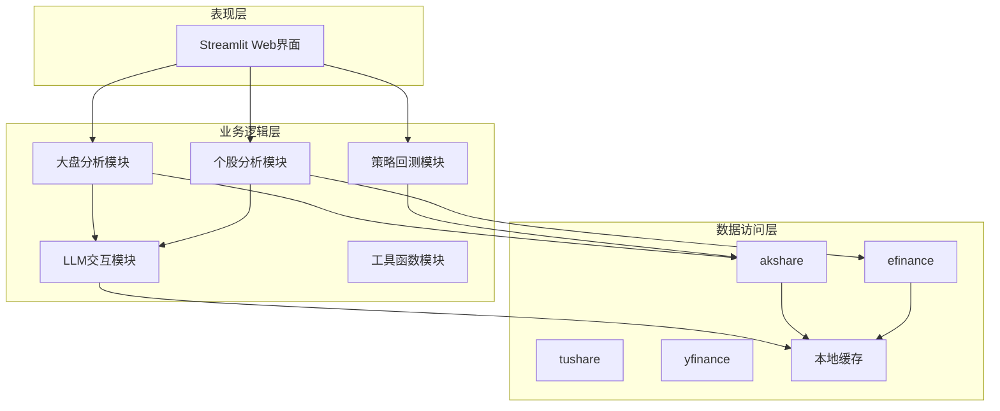
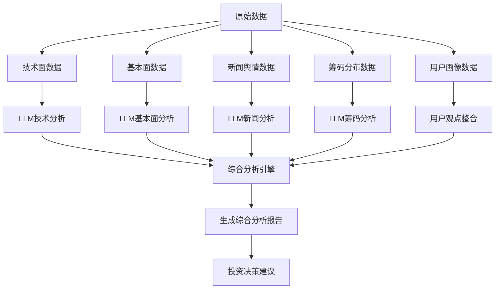
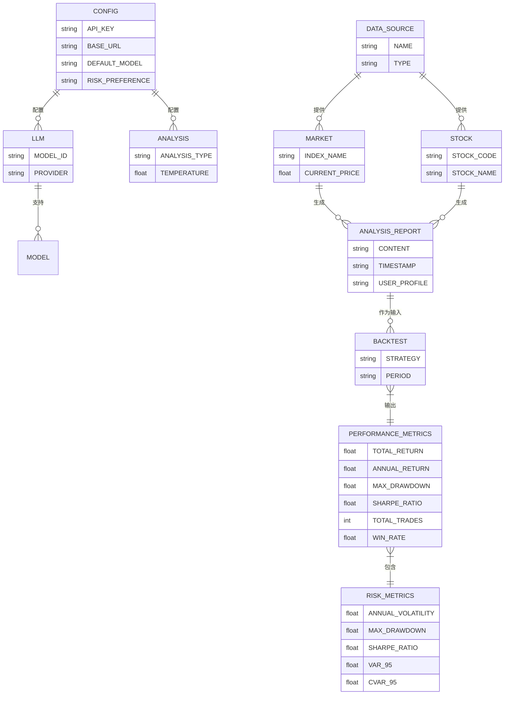

# 系统概述

<cite>
**本文档引用的文件**  
- [README.md](file://README.md)
- [main.py](file://main.py)
- [config_default.toml](file://config_default.toml)
- [requirements.txt](file://requirements.txt)
- [ui/app.py](file://ui/app.py)
- [ui/config.py](file://ui/config.py)
- [llm/openai_client.py](file://llm/openai_client.py)
- [market/market_ai_analysis.py](file://market/market_ai_analysis.py)
- [stock/stock_ai_analysis.py](file://stock/stock_ai_analysis.py)
- [backtesting/backtest.py](file://backtesting/backtest.py)
- [market/market_data_fetcher.py](file://market/market_data_fetcher.py)
- [stock/stock_data_fetcher.py](file://stock/stock_data_fetcher.py)
- [utils/risk_metrics.py](file://utils/risk_metrics.py)
</cite>

## 目录
1. [项目简介](#项目简介)
2. [架构设计与技术栈](#架构设计与技术栈)
3. [大语言模型增强分析](#大语言模型增强分析)
4. [外部服务集成](#外部服务集成)
5. [用户工作流说明](#用户工作流说明)
6. [技术优势分析](#技术优势分析)
7. [关键概念引导](#关键概念引导)

## 项目简介

xystock 是一个极简的股票与基金分析工具，旨在通过集成大语言模型（LLM）技术，为用户提供智能化、多维度的金融数据分析服务。项目支持对A股、港股通、ETF基金以及主要大盘指数（如上证指数、深证成指、创业板指等）进行实时行情获取、AI智能分析和投资策略回测。

项目核心目标是解决传统金融数据“信息过载但解读困难”的痛点，通过大模型技术将零散的指标转化为具有推理过程的决策建议，帮助用户理解技术指标背后的逻辑、评估市场情绪、识别投资机会与风险，并提供可操作的买卖建议。系统支持用户输入个人投资观点、持仓状态和风险偏好，结合市场数据生成个性化分析报告。

项目采用模块化设计，主要功能分为三大模块：大盘分析、个股分析和策略回测。大盘分析模块提供市场整体趋势、情绪、资金流向等宏观视角；个股分析模块深入剖析股票的技术面、基本面、新闻舆情和筹码分布；策略回测模块则允许用户验证投资策略的有效性。

**Section sources**
- [README.md](file://README.md#L3-L41)
- [ui/app.py](file://ui/app.py#L5-L229)

## 架构设计与技术栈

xystock 项目采用清晰的分层架构设计，确保了系统的可维护性和可扩展性。整体架构可分为表现层、业务逻辑层和数据访问层。

**表现层** 采用 **Streamlit** 框架构建，提供了一个直观、交互式的Web用户界面。Streamlit 的优势在于能够快速将Python脚本转换为美观的Web应用，非常适合数据科学和金融分析类项目。用户通过侧边栏菜单选择功能模块（大盘分析、股票分析、缓存管理、Token统计、设置），所有交互逻辑和页面渲染均由 `ui/app.py` 主控。

**业务逻辑层** 是系统的核心，负责处理复杂的分析逻辑和流程编排。该层由多个功能模块组成：
- `market` 模块：负责市场数据的获取、格式化和AI分析。
- `stock` 模块：负责个股数据的获取、格式化和AI分析。
- `llm` 模块：封装了与大语言模型的交互逻辑，是整个智能分析的引擎。
- `backtesting` 模块：提供独立的量化回测框架。
- `utils` 模块：包含数据格式化、风险计算、绘图等通用工具函数。

**数据访问层** 负责与外部数据源和本地缓存进行交互。项目集成了 `akshare`、`tushare`、`yfinance`、`efinance` 等多个数据接口，确保数据的全面性和可靠性。数据获取逻辑被封装在 `market_data_fetcher.py` 和 `stock_data_fetcher.py` 等文件中，实现了数据源的统一管理和智能缓存。

在技术栈选择上，项目以 **Python** 为核心语言，利用其强大的数据科学生态。**pandas** 用于数据处理和分析，**numpy** 提供数值计算支持。与大语言模型的交互通过 **OpenAI Python SDK** 实现，并兼容所有提供OpenAI API接口的服务。项目还使用了 **Docker** 进行容器化部署，确保了开发、测试和生产环境的一致性。

**Diagram sources**
- [ui/app.py](file://ui/app.py#L5-L229)
- [market/market_data_fetcher.py](file://market/market_data_fetcher.py#L1-L607)
- [stock/stock_data_fetcher.py](file://stock/stock_data_fetcher.py#L1-L546)
- [llm/openai_client.py](file://llm/openai_client.py#L1-L297)

## 大语言模型增强分析

xystock 的核心创新在于利用大语言模型（LLM）将传统的金融数据分析从“指标展示”升级为“智能决策”。系统通过精心设计的提示词（Prompt）和分析流程，引导LLM对多维度数据进行综合解读。

系统实现了对技术面、基本面、新闻舆情和筹码分布的智能综合分析：
- **技术面分析**：系统收集K线数据、移动平均线、MACD、RSI等技术指标，通过 `generate_tech_analysis_report` 函数生成分析报告，帮助用户识别支撑阻力位和价格趋势。
- **基本面分析**：系统获取公司的财务数据，如ROE、毛利率、资产负债率等，通过 `generate_fundamental_analysis_report` 函数进行财务健康评估和估值分析。
- **新闻舆情分析**：系统整合实时新闻资讯，通过 `generate_news_analysis_report` 函数评估新闻事件对股价的潜在影响，识别市场情绪变化。
- **筹码分布分析**：针对A股市场特点，系统分析筹码集中度、主力成本区间等，通过 `generate_chip_analysis_report` 函数揭示市场博弈的深层逻辑。

所有分析最终通过 `generate_comprehensive_analysis_report` 函数进行整合，生成一份综合分析报告。该报告不仅预测涨跌概率和幅度，还提供具体的买入/卖出点位、仓位建议，并结合用户的风险偏好和持仓状态给出个性化提醒。这种多维度、可解释的分析模式，有效解决了传统分析工具“黑盒”和“结论无推理”的问题。

**Diagram sources**
- [stock/stock_ai_analysis.py](file://stock/stock_ai_analysis.py#L1-L879)
- [market/market_ai_analysis.py](file://market/market_ai_analysis.py#L1-L123)

## 外部服务集成

xystock 设计了高度灵活的集成架构，能够无缝对接多种外部服务，确保了系统的开放性和适应性。

在大语言模型集成方面，系统通过 `llm/openai_client.py` 模块提供了对所有兼容OpenAI API的服务的支持。用户可以在配置文件中轻松切换不同的LLM提供商，而无需修改代码。项目明确支持以下模型服务：
- **OpenAI**：包括GPT-4.1-nano、GPT-4o、o1等系列模型。
- **阿里百炼 (DashScope)**：包括通义千问 Turbo、Plus、Max 等模型。
- **DeepSeek**：包括 deepseek-chat 和 deepseek-reasoner 模型。
- **其他兼容服务**：如 OpenRouter、Ollama 等。

在数据接口集成方面，项目通过 `akshare`、`tushare`、`yfinance` 和 `efinance` 等库，实现了对多源金融数据的统一获取。`akshare` 提供了丰富的A股市场数据，包括行情、基本面、资金流向等；`tushare` 作为专业的金融数据接口，补充了高质量的数据源；`yfinance` 则用于获取国际市场的参考数据；`efinance` 专注于A股实时行情，确保了数据的时效性。这种多源数据策略不仅提高了数据的可靠性，也增强了系统的容错能力。

**Section sources**
- [README.md](file://README.md#L102-L140)
- [requirements.txt](file://requirements.txt#L1-L182)
- [llm/openai_client.py](file://llm/openai_client.py#L1-L297)
- [market/market_data_fetcher.py](file://market/market_data_fetcher.py#L1-L607)
- [stock/stock_data_fetcher.py](file://stock/stock_data_fetcher.py#L1-L546)

## 用户工作流说明

xystock 为用户提供了一条清晰、完整的分析路径，从配置到最终决策，引导用户高效地使用各项功能。

1.  **配置阶段**：用户首次使用时，需进入“设置”页面，配置大语言模型的API密钥、Base URL等参数。同时，用户可以在此设置风险偏好（保守、中性、激进）和自定义投资原则，这些信息将被用于后续的个性化分析。

2.  **大盘分析**：建议用户首先进行大盘分析。通过“大盘分析”功能，系统会整合技术指标、市场情绪、资金流向和新闻资讯，生成一份关于上证指数等主要指数的AI分析报告。这份报告为用户提供了市场整体趋势的判断，是进行个股投资的前提。

3.  **个股分析**：在了解大盘趋势后，用户可进入“股票分析”页面。输入股票代码后，系统会获取该股票的实时行情、K线图、新闻、筹码分布等信息。用户可选择是否启用“AI智能分析”，系统将结合大盘环境、个股数据和用户输入的观点，生成一份全面的综合分析报告。

4.  **策略回测**：对于有量化需求的用户，可以使用“策略回测”模块。用户可以定义自己的交易策略（如均线交叉策略），系统会利用历史数据运行回测，生成包含收益率、最大回撤、夏普比率等指标的绩效报告和可视化图表，帮助用户验证策略的有效性。

5.  **Token统计与缓存管理**：为了优化使用成本，用户可以通过“Token统计”页面查看模型调用的成本消耗情况。通过“缓存管理”页面，用户可以清理或查看缓存数据，确保数据的准确性和查询效率。

**Section sources**
- [README.md](file://README.md#L93-L101)
- [ui/app.py](file://ui/app.py#L5-L229)
- [backtesting/backtest.py](file://backtesting/backtest.py#L1-L207)

## 技术优势分析

xystock 在设计上充分考虑了实用性、性能和成本，具备多项显著的技术优势。

**数据缓存机制** 是项目最突出的优势之一。系统通过 `data/cache` 目录和 `kline_cache.py` 等模块，实现了对K线数据、AI分析请求和响应的智能缓存。当用户查询已分析过的股票时，系统会优先使用缓存数据，避免了重复调用API和LLM，极大地减少了Token消耗和等待时间。这不仅降低了用户的使用成本，也显著提升了用户体验。

**模块化设计** 确保了系统的高可扩展性。项目的目录结构清晰，各模块职责分明。例如，`market` 和 `stock` 模块的结构高度相似，都包含了数据获取、AI分析、报告生成等子模块。这种设计使得添加新功能（如新增一个“基金分析”模块）变得非常简单，只需复制现有模块并进行针对性修改即可。

**灵活的配置系统** 通过 `config_default.toml` 配置文件实现。用户无需修改代码，即可调整LLM模型、分析参数、风险偏好等几乎所有设置。配置文件支持分层结构（如 `[LLM_OPENAI]`、`[AI_ANALYSIS]`），使得管理复杂配置变得井井有条。

**丰富的风险指标计算** 通过 `utils/risk_metrics.py` 模块提供。系统不仅能计算基础的年化波动率和最大回撤，还能计算夏普比率、VaR（在险价值）和CVaR（条件在险价值）等高级风险指标。这些指标被整合到分析报告中，帮助用户全面评估投资风险。

**Diagram sources**
- [config_default.toml](file://config_default.toml#L1-L64)
- [utils/risk_metrics.py](file://utils/risk_metrics.py#L1-L230)
- [backtesting/backtest.py](file://backtesting/backtest.py#L1-L207)

## 关键概念引导

为了让初学者更好地理解xystock的功能，以下是对几个关键概念的简要解释：

- **量化回测**：指使用历史数据来测试一个投资策略在过去的表现。通过回测，你可以了解该策略的收益率、最大亏损（最大回撤）和风险收益比（夏普比率），从而判断其是否有效。xystock的回测模块可以帮助你完成这一过程。

- **风险指标**：用于衡量投资风险的量化数据。例如，“最大回撤”表示投资组合在历史上从最高点到最低点的最大跌幅，反映了潜在的亏损风险；“夏普比率”衡量的是每承担一单位风险所能获得的超额回报，比率越高通常代表策略越好。

- **Token消耗**：大语言模型（LLM）在处理文本时，会将输入和输出的文本分割成小的单元，这些单元被称为“Token”。API提供商（如OpenAI）通常根据调用的Token数量来计费。xystock通过缓存机制减少重复的Token消耗，从而帮助用户节省成本。

- **用户画像**：指用户在系统中设置的个人投资特征，包括风险偏好（保守/中性/激进）、投资风格和常犯的错误。系统在生成分析报告时会考虑这些因素，从而提供更贴合用户实际情况的个性化建议。

**Section sources**
- [README.md](file://README.md#L157-L170)
- [config_default.toml](file://config_default.toml#L1-L64)
- [llm/usage_logger.py](file://llm/usage_logger.py)
- [utils/risk_metrics.py](file://utils/risk_metrics.py#L1-L230)