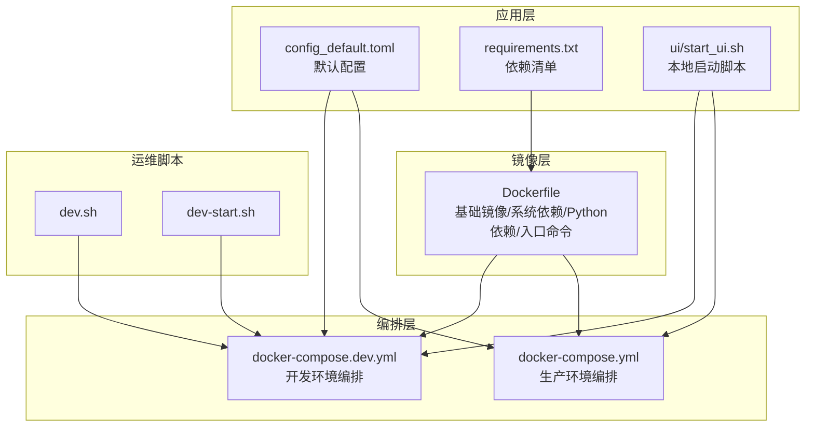
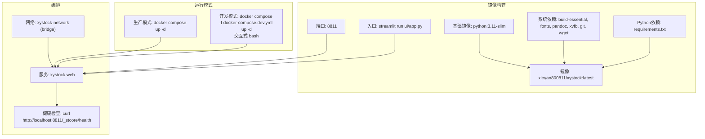
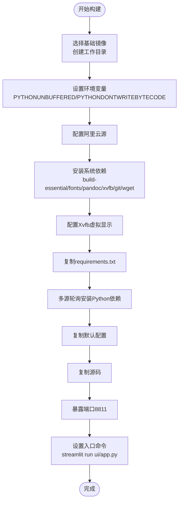
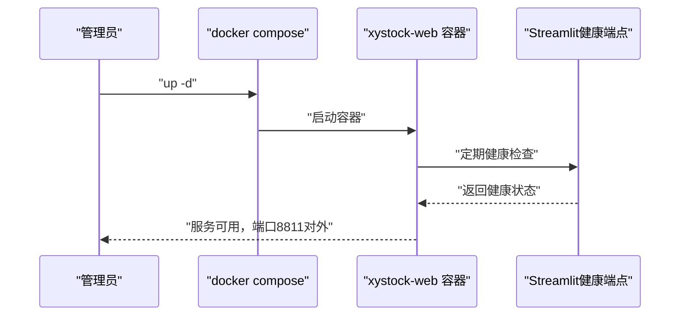
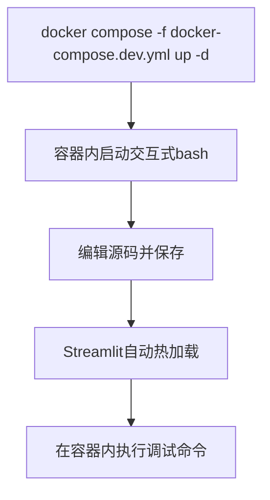
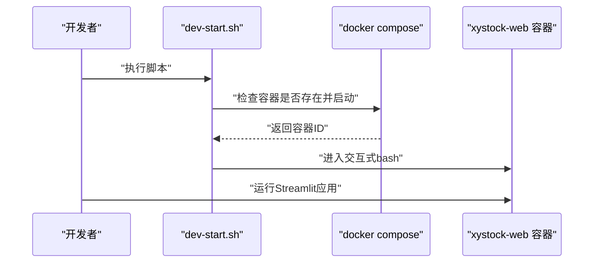
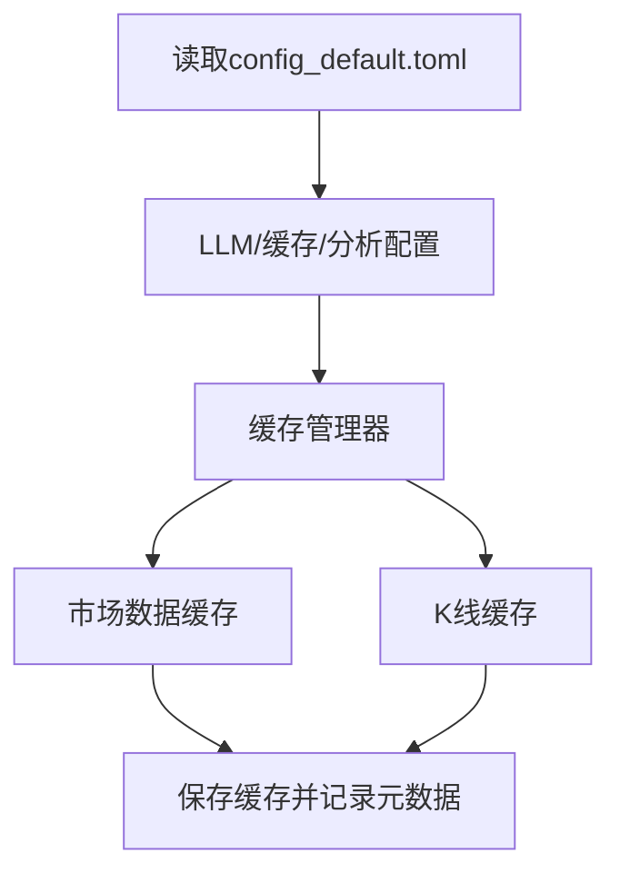
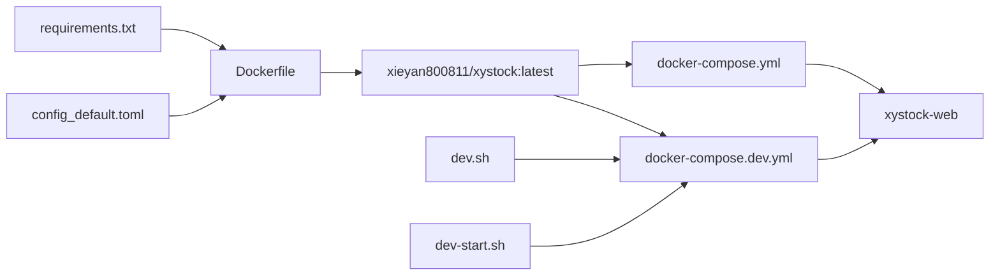

# 部署与运维

<cite>
**本文引用的文件**
- [Dockerfile](file://Dockerfile)
- [docker-compose.yml](file://docker-compose.yml)
- [docker-compose.dev.yml](file://docker-compose.dev.yml)
- [dev.sh](file://dev.sh)
- [dev-start.sh](file://dev-start.sh)
- [config_default.toml](file://config_default.toml)
- [requirements.txt](file://requirements.txt)
- [README.md](file://README.md)
- [ui/start_ui.sh](file://ui/start_ui.sh)
- [market/market_data_cache.py](file://market/market_data_cache.py)
- [utils/kline_cache.py](file://utils/kline_cache.py)
</cite>

## 目录
1. [简介](#简介)
2. [项目结构](#项目结构)
3. [核心组件](#核心组件)
4. [架构总览](#架构总览)
5. [详细组件分析](#详细组件分析)
6. [依赖关系分析](#依赖关系分析)
7. [性能与资源优化](#性能与资源优化)
8. [运维与日常维护](#运维与日常维护)
9. [故障排查指南](#故障排查指南)
10. [结论](#结论)

## 简介
本手册面向运维与开发人员，提供从镜像构建到容器化部署、从开发到生产的完整流程说明，涵盖 Dockerfile 构建细节、compose 文件差异与用途、网络与卷挂载、环境变量管理、性能优化建议、日常维护任务以及关键运维脚本的使用方法。目标是帮助团队在生产与开发环境中高效、稳定地运行该股票分析与可视化应用。

## 项目结构
该项目采用容器化部署方案，核心文件包括：
- Dockerfile：定义基础镜像、系统依赖、Python 依赖安装、工作目录、端口暴露与入口命令
- docker-compose.yml：生产环境编排，包含健康检查、网络与端口映射
- docker-compose.dev.yml：开发环境编排，交互式 bash、目录挂载与调试便利
- dev.sh、dev-start.sh：开发环境启动与进入容器的便捷脚本
- config_default.toml：默认配置项，包含 LLM、缓存、AI 分析、市场与用户画像等
- requirements.txt：Python 依赖清单
- ui/start_ui.sh：本地非容器启动脚本（作为对比参考）

图表来源
- [Dockerfile](file://Dockerfile#L1-L65)
- [docker-compose.yml](file://docker-compose.yml#L1-L38)
- [docker-compose.dev.yml](file://docker-compose.dev.yml#L1-L37)
- [config_default.toml](file://config_default.toml#L1-L64)
- [requirements.txt](file://requirements.txt#L1-L182)
- [ui/start_ui.sh](file://ui/start_ui.sh#L1-L16)
- [dev.sh](file://dev.sh#L1-L20)
- [dev-start.sh](file://dev-start.sh#L1-L19)

章节来源
- [Dockerfile](file://Dockerfile#L1-L65)
- [docker-compose.yml](file://docker-compose.yml#L1-L38)
- [docker-compose.dev.yml](file://docker-compose.dev.yml#L1-L37)
- [README.md](file://README.md#L46-L101)

## 核心组件
- Dockerfile 构建流程要点
  - 基础镜像：使用官方 Python slim 镜像
  - 系统依赖：安装构建工具、字体、pandoc、git、wget 等，并配置阿里云源
  - Python 依赖：通过多源轮询安装 requirements.txt，避免单点失败
  - 运行时准备：创建工作目录与数据/日志目录，配置 Xvfb 虚拟显示，复制配置与源码，暴露端口并设置入口命令
- docker-compose 生产与开发差异
  - 生产：直接运行 Streamlit 应用，带健康检查、网络隔离
  - 开发：交互式 bash、目录挂载、TTY/STDIN 打开，便于本地调试
- 配置与依赖
  - config_default.toml 提供默认配置，包含 LLM、缓存、AI 分析、市场与用户画像等
  - requirements.txt 列出核心依赖，便于镜像构建与本地复现

章节来源
- [Dockerfile](file://Dockerfile#L1-L65)
- [docker-compose.yml](file://docker-compose.yml#L1-L38)
- [docker-compose.dev.yml](file://docker-compose.dev.yml#L1-L37)
- [config_default.toml](file://config_default.toml#L1-L64)
- [requirements.txt](file://requirements.txt#L1-L182)

## 架构总览
下图展示了容器化部署的整体架构，包括镜像构建、服务编排、网络与健康检查、以及开发/生产两种运行模式。

图表来源
- [Dockerfile](file://Dockerfile#L1-L65)
- [docker-compose.yml](file://docker-compose.yml#L1-L38)
- [docker-compose.dev.yml](file://docker-compose.dev.yml#L1-L37)

## 详细组件分析

### Dockerfile 构建流程详解
- 基础镜像与工作目录
  - 使用官方 Python 3.11 slim 镜像，减少镜像体积
  - 创建 /app 目录并初始化 data 与 logs 目录
- 环境变量
  - 设置 Python 输出缓冲与字节码写入行为，确保日志与调试一致性
- 系统依赖与字体
  - 配置阿里云 Debian 源，加速下载
  - 安装构建工具、Xvfb、中文字体、pandoc、git、wget 等
- Python 依赖安装
  - 通过多源轮询安装 requirements.txt，提高成功率
- 配置与源码
  - 复制默认配置与全部源码至镜像
- 端口与入口
  - 暴露 8811 端口
  - 设置 Streamlit 入口命令，监听 0.0.0.0:8811

图表来源
- [Dockerfile](file://Dockerfile#L1-L65)

章节来源
- [Dockerfile](file://Dockerfile#L1-L65)

### docker-compose.yml（生产环境）
- 服务与镜像
  - 使用预构建镜像，容器名为 xystock-web
- 端口映射
  - 将宿主机 8811 映射到容器 8811
- 卷挂载
  - 当前目录挂载到 /app，便于开发调试（生产环境通常不需要）
- 环境变量
  - 时区、Python 缓冲与字节码、Streamlit 服务器地址/端口/Headless、禁用使用统计
- 健康检查
  - 通过 curl 访问 Streamlit 内部健康端点，周期 30s，超时 10s，重试 3 次，启动期 30s
- 网络
  - 加入自定义桥接网络 xystock-network

图表来源
- [docker-compose.yml](file://docker-compose.yml#L1-L38)

章节来源
- [docker-compose.yml](file://docker-compose.yml#L1-L38)

### docker-compose.dev.yml（开发环境）
- 服务与镜像
  - 使用同一镜像，容器名为 xystock-web
- 端口映射
  - 同样映射 8811:8811
- 卷挂载
  - 将项目目录挂载到 /app，便于热更新与调试
- 环境变量
  - 与生产一致的时区与 Streamlit 配置
- 交互式运行
  - tty/stdin 打开，command 覆盖为 /bin/bash，保持容器运行但不自动启动应用
- 网络
  - 同样加入 xystock-network

图表来源
- [docker-compose.dev.yml](file://docker-compose.dev.yml#L1-L37)

章节来源
- [docker-compose.dev.yml](file://docker-compose.dev.yml#L1-L37)

### 关键运维脚本
- dev.sh
  - 启动开发容器并进入交互式终端，提示在容器内手动启动应用
- dev-start.sh
  - 检查已有容器，若存在则直接进入；否则先启动再进入，简化开发流程

图表来源
- [dev-start.sh](file://dev-start.sh#L1-L19)
- [dev.sh](file://dev.sh#L1-L20)

章节来源
- [dev.sh](file://dev.sh#L1-L20)
- [dev-start.sh](file://dev-start.sh#L1-L19)

### 配置与缓存策略
- 默认配置
  - LLM/OpenAI 相关参数、日志与缓存开关、AI 分析温度与模型类型、市场新闻开关、用户画像与风险偏好等
- 缓存机制
  - 市场数据缓存：按数据类型与指数名称区分缓存键，记录时间戳与过期分钟数，支持索引特定缓存
  - K线缓存：基于 CSV 的 K 线数据缓存管理器，支持不同周期与指数日线数据

图表来源
- [config_default.toml](file://config_default.toml#L1-L64)
- [market/market_data_cache.py](file://market/market_data_cache.py#L213-L244)
- [utils/kline_cache.py](file://utils/kline_cache.py#L1-L48)

章节来源
- [config_default.toml](file://config_default.toml#L1-L64)
- [market/market_data_cache.py](file://market/market_data_cache.py#L213-L244)
- [utils/kline_cache.py](file://utils/kline_cache.py#L1-L48)

## 依赖关系分析
- 组件耦合
  - Dockerfile 依赖 requirements.txt 与 config_default.toml
  - docker-compose.yml/docker-compose.dev.yml 依赖镜像与网络
  - 运维脚本依赖 compose 文件与容器命名
- 外部依赖
  - Docker Hub 镜像、Streamlit、Xvfb、阿里云源与 PyPI 镜像源

图表来源
- [requirements.txt](file://requirements.txt#L1-L182)
- [config_default.toml](file://config_default.toml#L1-L64)
- [Dockerfile](file://Dockerfile#L1-L65)
- [docker-compose.yml](file://docker-compose.yml#L1-L38)
- [docker-compose.dev.yml](file://docker-compose.dev.yml#L1-L37)
- [dev.sh](file://dev.sh#L1-L20)
- [dev-start.sh](file://dev-start.sh#L1-L19)

章节来源
- [requirements.txt](file://requirements.txt#L1-L182)
- [config_default.toml](file://config_default.toml#L1-L64)
- [Dockerfile](file://Dockerfile#L1-L65)
- [docker-compose.yml](file://docker-compose.yml#L1-L38)
- [docker-compose.dev.yml](file://docker-compose.dev.yml#L1-L37)
- [dev.sh](file://dev.sh#L1-L20)
- [dev-start.sh](file://dev-start.sh#L1-L19)

## 性能与资源优化
- 镜像构建优化
  - 使用多源轮询安装依赖，降低单点失败概率
  - 使用 slim 基础镜像，减少镜像体积
- 运行时优化
  - 禁用 Python 字节码写入，减少磁盘 IO
  - 设置流式输出，便于日志采集
- 缓存策略
  - 启用并合理配置缓存 TTL，减少重复请求与 LLM 调用
  - 结合市场数据缓存与 K 线缓存，平衡时效性与性能
- 端口与网络
  - 使用独立桥接网络，隔离服务，便于扩展与安全控制
- 健康检查
  - 启用健康检查，配合重启策略，提升可用性

章节来源
- [Dockerfile](file://Dockerfile#L1-L65)
- [docker-compose.yml](file://docker-compose.yml#L1-L38)
- [config_default.toml](file://config_default.toml#L1-L64)
- [market/market_data_cache.py](file://market/market_data_cache.py#L213-L244)
- [utils/kline_cache.py](file://utils/kline_cache.py#L1-L48)

## 运维与日常维护
- 部署步骤（生产）
  - 拉取镜像或本地构建镜像
  - 启动服务：使用 compose 文件启动并后台运行
  - 访问 http://localhost:8811
- 部署步骤（开发）
  - 使用开发 compose 文件启动容器
  - 进入交互式终端，手动启动应用
- 网络配置
  - 使用自定义桥接网络，确保服务间通信与隔离
- 卷挂载与持久化
  - 生产环境建议将数据与日志目录映射到宿主机，避免容器删除导致数据丢失
  - 开发环境可挂载项目目录以便热更新
- 环境变量管理
  - 通过 compose 的 environment 字段统一管理时区、Python 缓冲、Streamlit 参数等
- 版本更新与镜像重建
  - 生产环境：拉取最新镜像或重新构建镜像后重启容器
  - 开发环境：重新构建镜像后进入容器继续调试
- 监控与健康检查
  - 利用健康检查端点判断服务状态，必要时触发重启
- 清理与备份
  - 清理缓存：根据缓存策略定期清理过期数据
  - 备份配置：将 config_default.toml 与数据目录备份到安全位置

章节来源
- [README.md](file://README.md#L46-L101)
- [docker-compose.yml](file://docker-compose.yml#L1-L38)
- [docker-compose.dev.yml](file://docker-compose.dev.yml#L1-L37)
- [config_default.toml](file://config_default.toml#L1-L64)

## 故障排查指南
- 容器无法启动
  - 检查端口占用与防火墙规则
  - 查看容器日志，确认依赖安装是否成功
- 健康检查失败
  - 确认 Streamlit 健康端点可达
  - 检查网络连通性与容器内部服务状态
- 依赖安装失败
  - 使用多源轮询策略，更换镜像源
  - 确保网络可达与 DNS 解析正常
- 缓存异常
  - 检查缓存文件权限与路径
  - 根据缓存状态输出定位过期或缺失问题

章节来源
- [docker-compose.yml](file://docker-compose.yml#L1-L38)
- [Dockerfile](file://Dockerfile#L1-L65)
- [market/market_data_cache.py](file://market/market_data_cache.py#L323-L424)

## 结论
通过标准化的 Dockerfile 构建流程、清晰的生产与开发 compose 文件差异、完善的网络与卷挂载策略、以及配套的运维脚本，本项目实现了从开发到生产的无缝衔接。结合合理的缓存策略与健康检查机制，能够在保证性能的同时提升系统的稳定性与可维护性。建议在生产环境中进一步完善卷挂载与备份策略，并根据业务增长逐步引入资源限制与水平扩展。