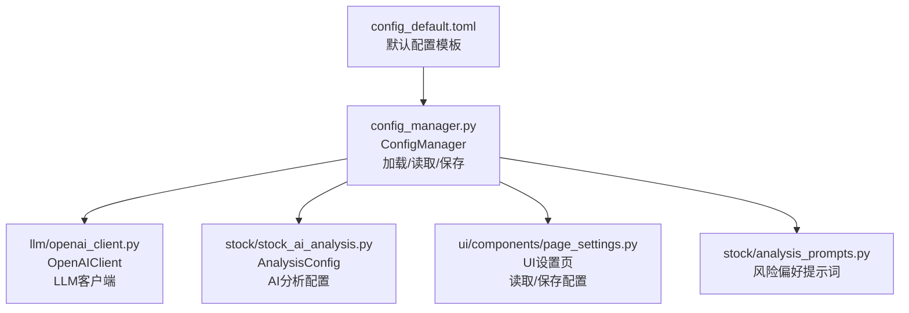
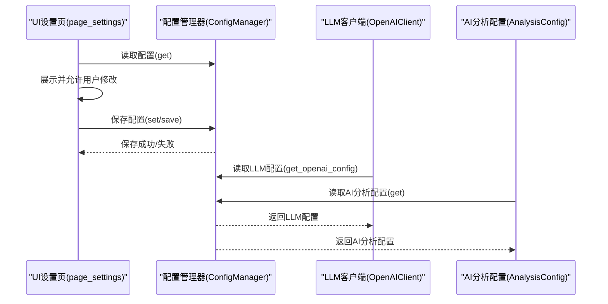
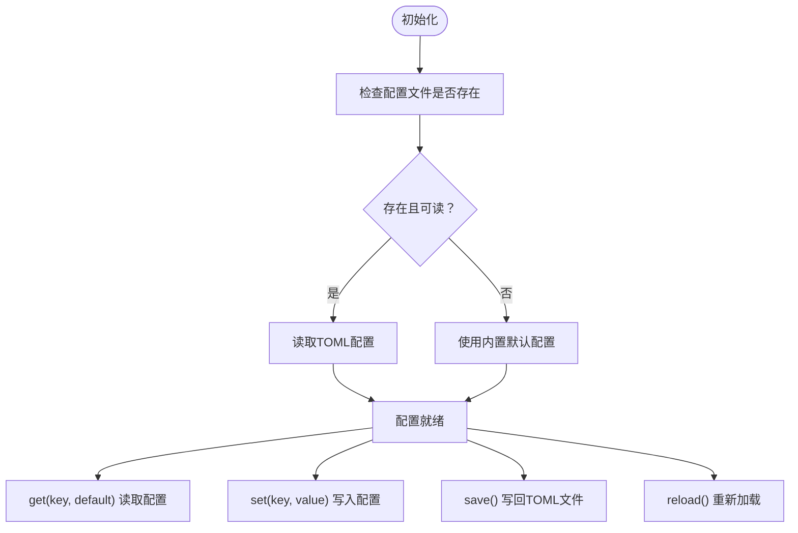
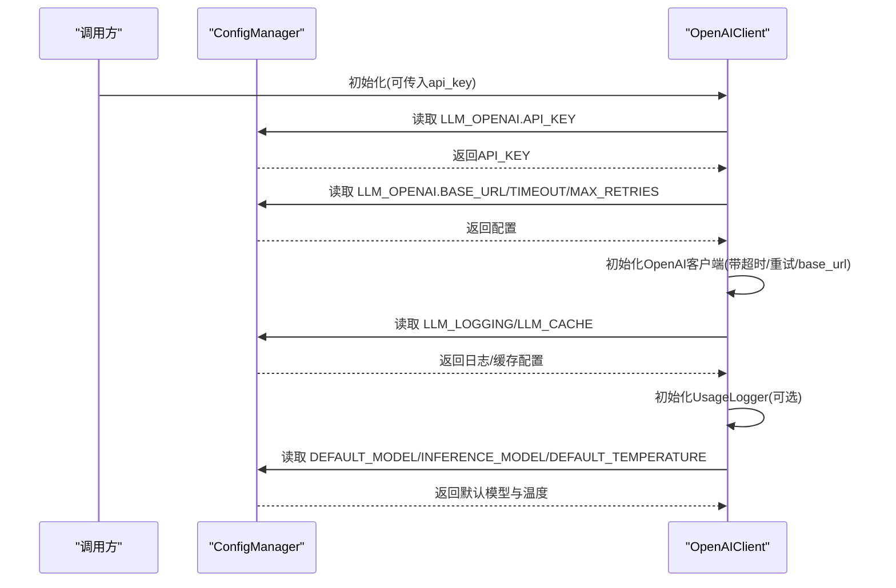
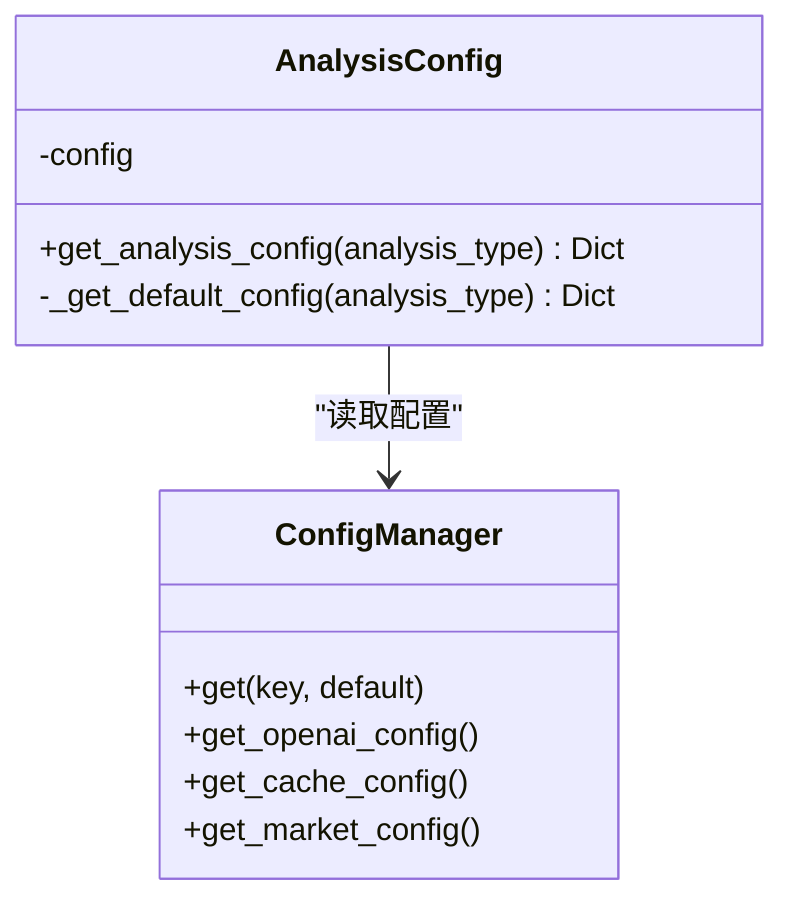
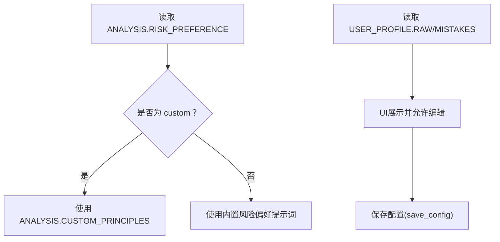
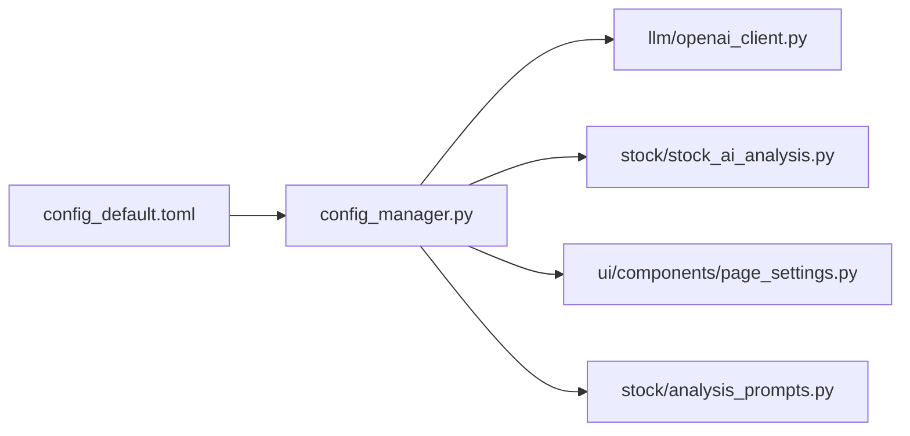

# 配置管理

<cite>
**本文引用的文件**
- [config_default.toml](file://config_default.toml)
- [config_manager.py](file://config_manager.py)
- [openai_client.py](file://llm/openai_client.py)
- [stock_ai_analysis.py](file://stock/stock_ai_analysis.py)
- [analysis_prompts.py](file://stock/analysis_prompts.py)
- [page_settings.py](file://ui/components/page_settings.py)
- [API_DOCUMENTATION.md](file://ui/components/API_DOCUMENTATION.md)
</cite>

## 目录
1. [简介](#简介)
2. [项目结构](#项目结构)
3. [核心组件](#核心组件)
4. [架构总览](#架构总览)
5. [详细组件分析](#详细组件分析)
6. [依赖关系分析](#依赖关系分析)
7. [性能考量](#性能考量)
8. [故障排查指南](#故障排查指南)
9. [结论](#结论)
10. [附录](#附录)

## 简介
本文件系统性地文档化系统的配置体系，重点围绕以下目标展开：
- 解释 config_default.toml 的结构与每个配置项的作用，涵盖 LLM 服务配置（API 密钥、基础 URL、超时、重试）、默认模型与温度、AI 分析各子模块（技术、新闻、筹码、基本面、综合）的独立参数（温度、模型类型、缓存文件名）、市场功能开关、用户风险偏好设置与用户画像配置。
- 说明 config_manager.py 如何读取、解析与提供这些配置，并展示其对外接口与默认值策略。
- 指导用户如何安全地修改配置文件以适配自身需求（更换 LLM 提供商、调整分析风格、设置风险偏好），并提供最佳实践（敏感信息保护、配置备份、不同环境的配置管理）。

## 项目结构
配置体系由“默认配置模板 + 运行时配置管理 + 多模块消费配置”三部分组成：
- 默认配置模板：config_default.toml 提供初始配置骨架与注释说明。
- 配置管理器：config_manager.py 负责加载、合并默认值、提供读取与保存接口。
- 消费者模块：LLM 客户端、AI 分析模块、UI 设置页等按需读取配置。

图表来源
- [config_default.toml](file://config_default.toml#L1-L64)
- [config_manager.py](file://config_manager.py#L1-L144)
- [openai_client.py](file://llm/openai_client.py#L1-L69)
- [stock_ai_analysis.py](file://stock/stock_ai_analysis.py#L40-L71)
- [analysis_prompts.py](file://stock/analysis_prompts.py#L1-L54)
- [page_settings.py](file://ui/components/page_settings.py#L44-L109)

章节来源
- [config_default.toml](file://config_default.toml#L1-L64)
- [config_manager.py](file://config_manager.py#L1-L144)

## 核心组件
- 配置管理器（ConfigManager）
  - 负责加载 TOML 配置文件，若文件缺失或解析失败则回退到内置默认值。
  - 提供 get(key, default) 与 set(key, value) 的点号路径访问方式。
  - 提供 get_openai_config()/get_cache_config()/get_market_config() 等便捷方法。
  - 提供 save() 将内存中的配置写回 TOML 文件。
  - 提供 reload() 重新加载配置。
- LLM 客户端（OpenAIClient）
  - 从配置读取 API 密钥、基础 URL、超时、重试、默认模型、默认温度等参数。
  - 根据 model_type 选择默认模型（默认/推理）。
- AI 分析配置（AnalysisConfig）
  - 从配置读取各分析子模块（技术/新闻/筹码/基本面/综合）的温度、模型类型、缓存文件名。
- UI 设置页（page_settings.py）
  - 读取并展示 LLM、缓存、分析偏好、用户画像等配置。
  - 提供保存按钮，调用保存逻辑更新配置文件。

章节来源
- [config_manager.py](file://config_manager.py#L1-L144)
- [openai_client.py](file://llm/openai_client.py#L1-L69)
- [stock_ai_analysis.py](file://stock/stock_ai_analysis.py#L40-L71)
- [page_settings.py](file://ui/components/page_settings.py#L44-L109)

## 架构总览
配置在系统内的流转如下：
- 启动时，ConfigManager 优先尝试加载 config.toml（若不存在则使用默认值）。
- LLM 客户端与各分析模块通过 ConfigManager 的 get/get_openai_config 等方法读取配置。
- UI 设置页通过 page_settings.py 读取配置并允许用户修改，最终调用保存逻辑写回配置文件。

图表来源
- [config_manager.py](file://config_manager.py#L64-L115)
- [openai_client.py](file://llm/openai_client.py#L37-L69)
- [stock_ai_analysis.py](file://stock/stock_ai_analysis.py#L45-L71)
- [page_settings.py](file://ui/components/page_settings.py#L44-L109)

## 详细组件分析

### 配置文件结构与字段说明（config_default.toml）
- LLM_OPENAI 区块
  - API_KEY：LLM 提供商的认证密钥（建议通过环境变量注入，避免硬编码在仓库中）。
  - BASE_URL：LLM 提供商的基础 URL（可选，用于兼容其他服务端）。
  - TIMEOUT：请求超时时间（秒）。
  - MAX_RETRIES：请求失败时的最大重试次数。
  - DEFAULT_MODEL：默认分析模型名称。
  - INFERENCE_MODEL：推理模型名称（用于快速推理场景）。
  - DEFAULT_TEMPERATURE：默认温度参数（控制生成文本的随机性）。
- LLM_LOGGING 区块
  - USAGE_LOG_FILE：Token 使用记录 CSV 文件路径。
  - ENABLE_LOGGING：是否启用日志记录。
  - LOG_LEVEL：日志级别。
- LLM_CACHE 区块
  - ENABLE_CACHE：是否启用缓存。
  - CACHE_TTL：缓存有效期（秒）。
- AI_ANALYSIS 区块
  - TECHNICAL：技术分析子模块的 TEMPERATURE、MODEL_TYPE、CACHE_FILENAME。
  - NEWS：新闻分析子模块的 TEMPERATURE、MODEL_TYPE、CACHE_FILENAME。
  - CHIP：筹码分析子模块的 TEMPERATURE、MODEL_TYPE、CACHE_FILENAME。
  - FUNDAMENTAL：基本面分析子模块的 TEMPERATURE、MODEL_TYPE、CACHE_FILENAME。
  - COMPREHENSIVE：综合分析子模块的 TEMPERATURE、MODEL_TYPE、CACHE_FILENAME。
- MARKET 区块
  - ENABLE_NEWS：是否启用市场新闻功能。
- ANALYSIS 区块
  - RISK_PREFERENCE：分析风险偏好（neutral、conservative、aggressive、custom）。
  - CUSTOM_PRINCIPLES：当 RISK_PREFERENCE 为 custom 时使用的自定义核心原则。
- USER_PROFILE 区块
  - RAW：用户画像描述。
  - MISTAKES：用户常犯错误列表（多选）。

章节来源
- [config_default.toml](file://config_default.toml#L1-L64)

### 配置管理器（ConfigManager）工作流程
- 加载策略
  - 若配置文件不存在或读取失败，则回退到内置默认配置（包含 LLM_OPENAI、LLM_LOGGING、LLM_CACHE、MARKET 等）。
  - 默认值中，API_KEY 来自环境变量 OPENAI_API_KEY，BASE_URL 默认指向 DeepSeek。
- 读取与写入
  - get(key, default) 支持点号路径访问（如 LLM_OPENAI.API_KEY）。
  - set(key, value) 动态构建嵌套字典结构。
  - save() 将内存配置写回 TOML 文件，确保父目录存在。
- 便捷方法
  - get_openai_config()/get_logging_config()/get_cache_config()/get_market_config() 提供分区块读取。
  - is_market_news_enabled() 判断市场新闻开关。
  - reload() 重新加载配置。

图表来源
- [config_manager.py](file://config_manager.py#L23-L115)

章节来源
- [config_manager.py](file://config_manager.py#L1-L144)

### LLM 客户端（OpenAIClient）如何消费配置
- 从配置读取：
  - API_KEY、BASE_URL、TIMEOUT、MAX_RETRIES、DEFAULT_MODEL、INFERENCE_MODEL、DEFAULT_TEMPERATURE。
- 行为特征：
  - 若未显式传入 API_KEY，则强制要求配置中存在有效值。
  - 根据 model_type 选择默认模型（inference 使用 INFERENCE_MODEL，否则使用 DEFAULT_MODEL）。
  - 默认温度来自配置 DEFAULT_TEMPERATURE。
  - 可选启用日志记录与使用记录器。

图表来源
- [openai_client.py](file://llm/openai_client.py#L37-L69)
- [config_manager.py](file://config_manager.py#L116-L140)

章节来源
- [openai_client.py](file://llm/openai_client.py#L1-L69)
- [config_manager.py](file://config_manager.py#L116-L140)

### AI 分析配置（AnalysisConfig）如何消费配置
- 从配置读取各分析子模块的 TEMPERATURE、MODEL_TYPE、CACHE_FILENAME。
- 若配置缺失或异常，回退到内置默认值（包含技术、新闻、筹码、基本面、公司、综合等）。
- 该配置用于决定不同分析场景下的温度、模型类型与缓存文件命名。

图表来源
- [stock_ai_analysis.py](file://stock/stock_ai_analysis.py#L45-L71)
- [config_manager.py](file://config_manager.py#L64-L115)

章节来源
- [stock_ai_analysis.py](file://stock/stock_ai_analysis.py#L45-L71)

### 风险偏好与用户画像（analysis_prompts + UI 设置）
- 风险偏好（ANALYSIS.RISK_PREFERENCE）
  - 支持 neutral、conservative、aggressive、custom。
  - 当选择 custom 时，使用 ANALYSIS.CUSTOM_PRINCIPLES 作为核心原则。
- 用户画像（USER_PROFILE）
  - RAW：用户画像描述。
  - MISTAKES：用户常犯错误列表（多选）。
- UI 设置页
  - 读取并展示上述配置项。
  - 提供保存按钮，调用保存逻辑写回配置文件。

图表来源
- [analysis_prompts.py](file://stock/analysis_prompts.py#L1-L54)
- [page_settings.py](file://ui/components/page_settings.py#L140-L202)
- [API_DOCUMENTATION.md](file://ui/components/API_DOCUMENTATION.md#L347-L418)

章节来源
- [analysis_prompts.py](file://stock/analysis_prompts.py#L1-L54)
- [page_settings.py](file://ui/components/page_settings.py#L140-L202)
- [API_DOCUMENTATION.md](file://ui/components/API_DOCUMENTATION.md#L347-L418)

## 依赖关系分析
- 配置文件与管理器
  - config_default.toml 提供默认字段与注释，config_manager.py 在运行时加载并提供默认值。
- 模块耦合
  - OpenAIClient 依赖 ConfigManager 获取 LLM 配置。
  - AnalysisConfig 依赖 ConfigManager 获取 AI 分析配置。
  - UI 设置页依赖 ConfigManager 读取与保存配置。
- 外部依赖
  - toml 解析库用于读写 TOML 文件。
  - 环境变量 OPENAI_API_KEY 用于注入敏感信息。

图表来源
- [config_default.toml](file://config_default.toml#L1-L64)
- [config_manager.py](file://config_manager.py#L1-L144)
- [openai_client.py](file://llm/openai_client.py#L1-L69)
- [stock_ai_analysis.py](file://stock/stock_ai_analysis.py#L40-L71)
- [analysis_prompts.py](file://stock/analysis_prompts.py#L1-L54)
- [page_settings.py](file://ui/components/page_settings.py#L44-L109)

章节来源
- [config_manager.py](file://config_manager.py#L1-L144)

## 性能考量
- 缓存策略
  - LLM_CACHE.ENABLE_CACHE 与 LLM_CACHE.CACHE_TTL 控制是否启用缓存以及缓存有效期，有助于降低重复请求开销。
- 超时与重试
  - LLM_OPENAI.TIMEOUT 与 LLM_OPENAI.MAX_RETRIES 影响网络请求稳定性与整体等待时间。
- 模型选择
  - 不同分析场景使用不同模型类型（默认/推理），可按需平衡速度与质量。

章节来源
- [config_default.toml](file://config_default.toml#L19-L23)
- [config_default.toml](file://config_default.toml#L5-L11)
- [openai_client.py](file://llm/openai_client.py#L37-L69)

## 故障排查指南
- 配置文件不存在或读取失败
  - 现象：系统回退到默认配置并记录警告/错误日志。
  - 处理：确认 config.toml 路径正确、权限可读；必要时复制 config_default.toml 并重命名为 config.toml。
- API 密钥未设置
  - 现象：初始化 OpenAIClient 时抛出错误，提示未设置 API 密钥。
  - 处理：在 LLM_OPENAI.API_KEY 中设置有效密钥，或通过环境变量 OPENAI_API_KEY 注入。
- 保存配置失败
  - 现象：保存配置时报错。
  - 处理：检查目标文件路径权限、磁盘空间；确认父目录存在；重试保存。
- 市场新闻功能未生效
  - 现象：市场新闻未显示。
  - 处理：检查 MARKET.ENABLE_NEWS 是否为 true。

章节来源
- [config_manager.py](file://config_manager.py#L23-L37)
- [openai_client.py](file://llm/openai_client.py#L37-L41)
- [config_manager.py](file://config_manager.py#L104-L115)
- [config_default.toml](file://config_default.toml#L51-L54)

## 结论
本配置体系通过“默认模板 + 运行时管理 + 多模块消费”的设计，实现了灵活、可扩展且易于维护的配置管理。用户可通过 UI 设置页或直接编辑 config.toml 安全地定制 LLM 服务、分析风格与用户画像；同时，通过默认值与回退机制保证了系统的健壮性。建议遵循敏感信息保护、配置备份与环境隔离的最佳实践，确保在不同环境下稳定运行。

## 附录

### 修改配置的安全指南
- 敏感信息保护
  - 将 API_KEY 等敏感信息放入环境变量（如 OPENAI_API_KEY），并在配置中留空占位符，避免提交到版本控制。
- 配置备份
  - 在修改前备份 config.toml；修改后验证配置文件语法与关键字段有效性。
- 环境隔离
  - 开发/生产环境使用不同的配置文件或环境变量，避免相互污染。
- 字段校验
  - 修改数值型字段（如 TIMEOUT、MAX_RETRIES、CACHE_TTL、DEFAULT_TEMPERATURE）时，确保范围合理。
- 重启生效
  - UI 设置页保存后，某些设置需要重启应用后生效。

章节来源
- [config_default.toml](file://config_default.toml#L1-L18)
- [config_manager.py](file://config_manager.py#L104-L115)
- [page_settings.py](file://ui/components/page_settings.py#L139-L215)